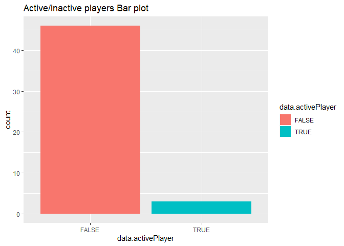
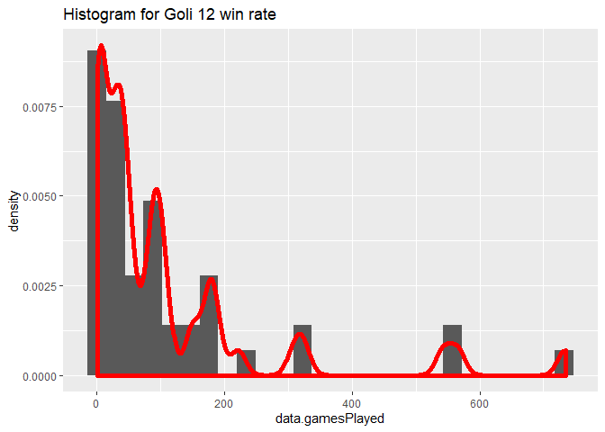

ST\_558\_NHL\_Project
================
Pramodini Karwande
6/13/2021

-   [NHL records API](#nhl-records-api)
-   [NHL stats API](#nhl-stats-api)
-   [Exploratory Data Analysis (EDA)](#exploratory-data-analysis-eda)
    -   [Data from at least two endpoints (possibly combining them into
        one)](#data-from-at-least-two-endpoints-possibly-combining-them-into-one)
    -   [You should create at least two new variables that are functions
        of the variables from a data set you
        use](#you-should-create-at-least-two-new-variables-that-are-functions-of-the-variables-from-a-data-set-you-use)
        -   [You should create some contingency
            tables.](#you-should-create-some-contingency-tables)
        -   [Numerical summaries for some quantitative variables at each
            setting of some of your categorical
            variables](#numerical-summaries-for-some-quantitative-variables-at-each-setting-of-some-of-your-categorical-variables)
        -   [create at least five plots utilizing coloring, grouping,
            etc. All plots should have nice labels and
            titles.](#create-at-least-five-plots-utilizing-coloring-grouping-etc-all-plots-should-have-nice-labels-and-titles)

``` r
# section that notes the required packages needed to run the code
library("httr")
library("jsonlite")
library("dplyr")
library("kableExtra")
library("knitr")
library("summarytools")
library("ggplot2")
```

# NHL records API

\#\#\#You should write functions to contact the NHL records API for the
endpoints listed below. The functions should return well-formatted,
parsed data (usually a data frame). Where possible, the user should have
the option to specify the franchise of choice by both name and ID number
- you’ll need to map the names to ID numbers yourself.

``` r
#Grab base URL for API
base_url <- "https://records.nhl.com/site/api"
urlExtention <- "?cayenneExp=franchiseId="
reqID <- ""
team_stat_url <- "https://statsapi.web.nhl.com/api/v1/teams"
team_extend_url <- "?expand=team.stats"

getNhlData<- function(franchiseID=NULL, franchiseName=NULL, tab_name=NULL) {
reqID <-  getID(franchiseID, franchiseName, tab_name)

if(tab_name == "franchise-detail")
{
  urlExtention <- "?cayenneExp=mostRecentTeamId="
}

if(!is.null(reqID)) {
  full_url <- paste0(base_url, "/", tab_name,urlExtention,reqID)
}
else {
  if((tab_name == "franchise-team-totals") || (tab_name == "franchise") ) {
    full_url <- paste0(base_url, "/", tab_name)
  }
}

# GET request to API
res <- GET(full_url)

franchise_data <- fromJSON(rawToChar(res$content), flatten = TRUE)
franchise_data <- data.frame(franchise_data)

if(tab_name == "franchise") {
  franchiseDataTab <- franchise_data %>% mutate("Team"=  paste0(data.teamPlaceName," ",data.teamCommonName)) %>% select("ID" = data.id, "First Season Id"= data.firstSeasonId, "Last Season Id"= data.lastSeasonId, Team)
  #franchiseDataTab <- na.omit(franchiseDataTab)
  knitr::kable(franchiseDataTab, caption = "NHL Data") %>% kable_styling()
}
else {
  knitr::kable(franchise_data, caption = "NHL Data") %>% kable_styling()
}
}


getID <- function(franchiseID=NULL, franchiseName=NULL, tab_name=NULL){
  retVal <- NULL
  if (!is.null(franchiseID)) {
    retVal<- franchiseID
    return(retVal)
  }
  else if (!is.null(franchiseName)) {
    retVal <- getName(franchiseName)
    return(retVal)
  }
  else {
    return(retVal)
  }
}

getName <- function(franchiseName=NULL) {
    tab_name <- "franchise"
    full_url <- paste0(base_url, "/", tab_name)
    res <- GET(full_url)

    franchiseNameData <- fromJSON(rawToChar(res$content), flatten = TRUE)
    franchiseNameData <- data.frame(franchiseNameData)
    franchiseID <- franchiseNameData %>% filter(data.fullName == franchiseName) %>% select(data.id)

    return(franchiseID)
} 
```

# NHL stats API

\#\#\#You should write a function to contact the NHL stats API for the
?expand=team.stats modifier. The function should be able to take a
single team or return data from all teams.

``` r
getNHLTeamStatsData <- function(teamID=NULL) {
  if (!is.null(teamID)) {
    team_stat_full_url <- paste0(team_stat_url,"/",teamID,team_extend_url)
  }
  else {
    team_stat_full_url <- paste0(team_stat_url,team_extend_url)
  }
  
  res <- GET(team_stat_full_url)

    team_stat_data <- fromJSON(rawToChar(res$content), flatten = TRUE)
    team_stat_data <- data.frame(team_stat_data)
    knitr::kable(team_stat_data, caption = "NHL Team Stat Data") %>% kable_styling()
}

# *****************TESTING START***********************
 getNHLTeamStatsData(NULL)
```

<table class="table" style="margin-left: auto; margin-right: auto;">
<caption>
NHL Team Stat Data
</caption>
<thead>
<tr>
<th style="text-align:left;">
copyright
</th>
<th style="text-align:right;">
teams.id
</th>
<th style="text-align:left;">
teams.name
</th>
<th style="text-align:left;">
teams.link
</th>
<th style="text-align:left;">
teams.abbreviation
</th>
<th style="text-align:left;">
teams.teamName
</th>
<th style="text-align:left;">
teams.locationName
</th>
<th style="text-align:left;">
teams.firstYearOfPlay
</th>
<th style="text-align:left;">
teams.teamStats
</th>
<th style="text-align:left;">
teams.shortName
</th>
<th style="text-align:left;">
teams.officialSiteUrl
</th>
<th style="text-align:right;">
teams.franchiseId
</th>
<th style="text-align:left;">
teams.active
</th>
<th style="text-align:left;">
teams.venue.name
</th>
<th style="text-align:left;">
teams.venue.link
</th>
<th style="text-align:left;">
teams.venue.city
</th>
<th style="text-align:right;">
teams.venue.id
</th>
<th style="text-align:left;">
teams.venue.timeZone.id
</th>
<th style="text-align:right;">
teams.venue.timeZone.offset
</th>
<th style="text-align:left;">
teams.venue.timeZone.tz
</th>
<th style="text-align:right;">
teams.division.id
</th>
<th style="text-align:left;">
teams.division.name
</th>
<th style="text-align:left;">
teams.division.link
</th>
<th style="text-align:right;">
teams.conference.id
</th>
<th style="text-align:left;">
teams.conference.name
</th>
<th style="text-align:left;">
teams.conference.link
</th>
<th style="text-align:right;">
teams.franchise.franchiseId
</th>
<th style="text-align:left;">
teams.franchise.teamName
</th>
<th style="text-align:left;">
teams.franchise.link
</th>
</tr>
</thead>
<tbody>
<tr>
<td style="text-align:left;">
NHL and the NHL Shield are registered trademarks of the National Hockey
League. NHL and NHL team marks are the property of the NHL and its
teams. © NHL 2021. All Rights Reserved.
</td>
<td style="text-align:right;">
1
</td>
<td style="text-align:left;">
New Jersey Devils
</td>
<td style="text-align:left;">
/api/v1/teams/1
</td>
<td style="text-align:left;">
NJD
</td>
<td style="text-align:left;">
Devils
</td>
<td style="text-align:left;">
New Jersey
</td>
<td style="text-align:left;">
1982
</td>
<td style="text-align:left;">
56 , NA , 19 , 28th , 30 , 29th , 7 , 15th , 45 , 29th , 40.2 , 29th ,
2.589 , 26th , 3.375 , 28th , 0.8293 , 21st , 14.2 , 28th , 22 , 28th ,
43 , 30th , 155 , 23rd , 71.0 , 31st , 28.7857 , 24th , 31.0179 , 22nd ,
0.552 , 22nd , 0.111 , 31st , 0.737 , 19th , 0.733 , 28th , 0.211 , 31st
, 0.417 , 31st , 3180 , 8th , 1481 , 27th , 1699 , 30th , 46.6 , 27th ,
9 , NA , 0.891 , NA , NA , 6th , NA , 29th , NA , 24th , 1 , 1 , New
Jersey Devils, New Jersey Devils, /api/v1/teams/1 , /api/v1/teams/1 ,
statsSingleSeason, R , Regular season , FALSE
</td>
<td style="text-align:left;">
New Jersey
</td>
<td style="text-align:left;">
<http://www.newjerseydevils.com/>
</td>
<td style="text-align:right;">
23
</td>
<td style="text-align:left;">
TRUE
</td>
<td style="text-align:left;">
Prudential Center
</td>
<td style="text-align:left;">
/api/v1/venues/null
</td>
<td style="text-align:left;">
Newark
</td>
<td style="text-align:right;">
NA
</td>
<td style="text-align:left;">
America/New\_York
</td>
<td style="text-align:right;">
-4
</td>
<td style="text-align:left;">
EDT
</td>
<td style="text-align:right;">
25
</td>
<td style="text-align:left;">
MassMutual East
</td>
<td style="text-align:left;">
/api/v1/divisions/25
</td>
<td style="text-align:right;">
6
</td>
<td style="text-align:left;">
Eastern
</td>
<td style="text-align:left;">
/api/v1/conferences/6
</td>
<td style="text-align:right;">
23
</td>
<td style="text-align:left;">
Devils
</td>
<td style="text-align:left;">
/api/v1/franchises/23
</td>
</tr>
<tr>
<td style="text-align:left;">
NHL and the NHL Shield are registered trademarks of the National Hockey
League. NHL and NHL team marks are the property of the NHL and its
teams. © NHL 2021. All Rights Reserved.
</td>
<td style="text-align:right;">
2
</td>
<td style="text-align:left;">
New York Islanders
</td>
<td style="text-align:left;">
/api/v1/teams/2
</td>
<td style="text-align:left;">
NYI
</td>
<td style="text-align:left;">
Islanders
</td>
<td style="text-align:left;">
New York
</td>
<td style="text-align:left;">
1972
</td>
<td style="text-align:left;">
56 , NA , 32 , 12th , 17 , 11th , 7 , 11th , 71 , 12th , 63.4 , 12th ,
2.714 , 21st , 2.232 , 2nd , 1.2418 , 7th , 18.8 , 20th , 27 , 24th , 22
, 2nd , 144 , 28th , 83.7 , 6th , 28.9821 , 22nd , 28.3929 , 10th ,
0.821 , 10th , 0.321 , 16th , 0.833 , 7th , 0.842 , 20th , 0.69 , 4th ,
0.44 , 4th , 2916 , 31st , 1498 , 25th , 1418 , 2nd , 51.4 , 9th , 9.4 ,
NA , 0.921 , NA , NA , 2nd , NA , 1st , NA , 17th , 2 , 2 , New York
Islanders, New York Islanders, /api/v1/teams/2 , /api/v1/teams/2 ,
statsSingleSeason , R , Regular season , FALSE
</td>
<td style="text-align:left;">
NY Islanders
</td>
<td style="text-align:left;">
<http://www.newyorkislanders.com/>
</td>
<td style="text-align:right;">
22
</td>
<td style="text-align:left;">
TRUE
</td>
<td style="text-align:left;">
Nassau Veterans Memorial Coliseum
</td>
<td style="text-align:left;">
/api/v1/venues/null
</td>
<td style="text-align:left;">
Uniondale
</td>
<td style="text-align:right;">
NA
</td>
<td style="text-align:left;">
America/New\_York
</td>
<td style="text-align:right;">
-4
</td>
<td style="text-align:left;">
EDT
</td>
<td style="text-align:right;">
25
</td>
<td style="text-align:left;">
MassMutual East
</td>
<td style="text-align:left;">
/api/v1/divisions/25
</td>
<td style="text-align:right;">
6
</td>
<td style="text-align:left;">
Eastern
</td>
<td style="text-align:left;">
/api/v1/conferences/6
</td>
<td style="text-align:right;">
22
</td>
<td style="text-align:left;">
Islanders
</td>
<td style="text-align:left;">
/api/v1/franchises/22
</td>
</tr>
<tr>
<td style="text-align:left;">
NHL and the NHL Shield are registered trademarks of the National Hockey
League. NHL and NHL team marks are the property of the NHL and its
teams. © NHL 2021. All Rights Reserved.
</td>
<td style="text-align:right;">
3
</td>
<td style="text-align:left;">
New York Rangers
</td>
<td style="text-align:left;">
/api/v1/teams/3
</td>
<td style="text-align:left;">
NYR
</td>
<td style="text-align:left;">
Rangers
</td>
<td style="text-align:left;">
New York
</td>
<td style="text-align:left;">
1926
</td>
<td style="text-align:left;">
56 , NA , 27 , 16th , 23 , 18th , 6 , 17th , 60 , 17th , 53.6 , 17th ,
3.143 , 10th , 2.768 , 14th , 1.0943 , 13th , 20.7 , 14th , 37 , 10th ,
30 , 12th , 179 , 4th , 82.2 , 10th , 28.6964 , 25th , 29.7143 , 13th ,
0.7 , 12th , 0.231 , 24th , 0.739 , 16th , 0.808 , 23rd , 0.545 , 14th ,
0.484 , 14th , 3026 , 26th , 1346 , 31st , 1680 , 29th , 44.5 , 31st ,
11 , NA , 0.907 , NA , NA , 20th , NA , 12th , NA , 4th , 3 , 3 , New
York Rangers , New York Rangers , /api/v1/teams/3 , /api/v1/teams/3 ,
statsSingleSeason, R , Regular season , FALSE
</td>
<td style="text-align:left;">
NY Rangers
</td>
<td style="text-align:left;">
<http://www.newyorkrangers.com/>
</td>
<td style="text-align:right;">
10
</td>
<td style="text-align:left;">
TRUE
</td>
<td style="text-align:left;">
Madison Square Garden
</td>
<td style="text-align:left;">
/api/v1/venues/5054
</td>
<td style="text-align:left;">
New York
</td>
<td style="text-align:right;">
5054
</td>
<td style="text-align:left;">
America/New\_York
</td>
<td style="text-align:right;">
-4
</td>
<td style="text-align:left;">
EDT
</td>
<td style="text-align:right;">
25
</td>
<td style="text-align:left;">
MassMutual East
</td>
<td style="text-align:left;">
/api/v1/divisions/25
</td>
<td style="text-align:right;">
6
</td>
<td style="text-align:left;">
Eastern
</td>
<td style="text-align:left;">
/api/v1/conferences/6
</td>
<td style="text-align:right;">
10
</td>
<td style="text-align:left;">
Rangers
</td>
<td style="text-align:left;">
/api/v1/franchises/10
</td>
</tr>
<tr>
<td style="text-align:left;">
NHL and the NHL Shield are registered trademarks of the National Hockey
League. NHL and NHL team marks are the property of the NHL and its
teams. © NHL 2021. All Rights Reserved.
</td>
<td style="text-align:right;">
4
</td>
<td style="text-align:left;">
Philadelphia Flyers
</td>
<td style="text-align:left;">
/api/v1/teams/4
</td>
<td style="text-align:left;">
PHI
</td>
<td style="text-align:left;">
Flyers
</td>
<td style="text-align:left;">
Philadelphia
</td>
<td style="text-align:left;">
1967
</td>
<td style="text-align:left;">
56 , NA , 25 , 18th , 23 , 19th , 8 , 8th , 58 , 19th , 51.8 , 19th ,
2.857 , 15th , 3.518 , 31st , 0.806 , 23rd , 19.2 , 18th , 32 , 15th ,
45 , 31st , 167 , 12th , 73.0 , 30th , 30.2143 , 10th , 29.2143 , 12th ,
0.609 , 23rd , 0.333 , 11th , 0.769 , 10th , 0.833 , 21st , 0.441 , 22nd
, 0.455 , 22nd , 3217 , 6th , 1738 , 3rd , 1479 , 8th , 54.0 , 2nd , 9.5
, NA , 0.88 , NA , NA , 17th , NA , 31st , NA , 16th , 4 , 4 ,
Philadelphia Flyers, Philadelphia Flyers, /api/v1/teams/4 ,
/api/v1/teams/4 , statsSingleSeason , R , Regular season , FALSE
</td>
<td style="text-align:left;">
Philadelphia
</td>
<td style="text-align:left;">
<http://www.philadelphiaflyers.com/>
</td>
<td style="text-align:right;">
16
</td>
<td style="text-align:left;">
TRUE
</td>
<td style="text-align:left;">
Wells Fargo Center
</td>
<td style="text-align:left;">
/api/v1/venues/5096
</td>
<td style="text-align:left;">
Philadelphia
</td>
<td style="text-align:right;">
5096
</td>
<td style="text-align:left;">
America/New\_York
</td>
<td style="text-align:right;">
-4
</td>
<td style="text-align:left;">
EDT
</td>
<td style="text-align:right;">
25
</td>
<td style="text-align:left;">
MassMutual East
</td>
<td style="text-align:left;">
/api/v1/divisions/25
</td>
<td style="text-align:right;">
6
</td>
<td style="text-align:left;">
Eastern
</td>
<td style="text-align:left;">
/api/v1/conferences/6
</td>
<td style="text-align:right;">
16
</td>
<td style="text-align:left;">
Flyers
</td>
<td style="text-align:left;">
/api/v1/franchises/16
</td>
</tr>
<tr>
<td style="text-align:left;">
NHL and the NHL Shield are registered trademarks of the National Hockey
League. NHL and NHL team marks are the property of the NHL and its
teams. © NHL 2021. All Rights Reserved.
</td>
<td style="text-align:right;">
5
</td>
<td style="text-align:left;">
Pittsburgh Penguins
</td>
<td style="text-align:left;">
/api/v1/teams/5
</td>
<td style="text-align:left;">
PIT
</td>
<td style="text-align:left;">
Penguins
</td>
<td style="text-align:left;">
Pittsburgh
</td>
<td style="text-align:left;">
1967
</td>
<td style="text-align:left;">
56 , NA , 37 , 4th , 16 , 7th , 3 , 25th , 77 , 7th , 68.8 , 7th , 3.446
, 2nd , 2.768 , 13th , 1.27 , 5th , 23.7 , 4th , 36 , 12th , 35 , 22nd ,
152 , 25th , 77.4 , 27th , 30.0714 , 12th , 29.9821 , 15th , 0.793 , 7th
, 0.519 , 2nd , 0.846 , 6th , 0.926 , 7th , 0.655 , 6th , 0.68 , 6th ,
3191 , 7th , 1573 , 11th , 1618 , 23rd , 49.3 , 21st , 11.5 , NA , 0.908
, NA , NA , 11th , NA , 10th , NA , 1st , 5 , 5 , Pittsburgh Penguins,
Pittsburgh Penguins, /api/v1/teams/5 , /api/v1/teams/5 ,
statsSingleSeason , R , Regular season , FALSE
</td>
<td style="text-align:left;">
Pittsburgh
</td>
<td style="text-align:left;">
<http://pittsburghpenguins.com/>
</td>
<td style="text-align:right;">
17
</td>
<td style="text-align:left;">
TRUE
</td>
<td style="text-align:left;">
PPG Paints Arena
</td>
<td style="text-align:left;">
/api/v1/venues/5034
</td>
<td style="text-align:left;">
Pittsburgh
</td>
<td style="text-align:right;">
5034
</td>
<td style="text-align:left;">
America/New\_York
</td>
<td style="text-align:right;">
-4
</td>
<td style="text-align:left;">
EDT
</td>
<td style="text-align:right;">
25
</td>
<td style="text-align:left;">
MassMutual East
</td>
<td style="text-align:left;">
/api/v1/divisions/25
</td>
<td style="text-align:right;">
6
</td>
<td style="text-align:left;">
Eastern
</td>
<td style="text-align:left;">
/api/v1/conferences/6
</td>
<td style="text-align:right;">
17
</td>
<td style="text-align:left;">
Penguins
</td>
<td style="text-align:left;">
/api/v1/franchises/17
</td>
</tr>
<tr>
<td style="text-align:left;">
NHL and the NHL Shield are registered trademarks of the National Hockey
League. NHL and NHL team marks are the property of the NHL and its
teams. © NHL 2021. All Rights Reserved.
</td>
<td style="text-align:right;">
6
</td>
<td style="text-align:left;">
Boston Bruins
</td>
<td style="text-align:left;">
/api/v1/teams/6
</td>
<td style="text-align:left;">
BOS
</td>
<td style="text-align:left;">
Bruins
</td>
<td style="text-align:left;">
Boston
</td>
<td style="text-align:left;">
1924
</td>
<td style="text-align:left;">
56 , NA , 33 , 11th , 16 , 9th , 7 , 10th , 73 , 10th , 65.2 , 10th ,
2.929 , 14th , 2.393 , 5th , 1.1383 , 12th , 21.9 , 10th , 35 , 14th ,
25 , 3rd , 160 , 16th , 86.0 , 2nd , 33.3214 , 3rd , 27.0714 , 2nd ,
0.735 , 5th , 0.364 , 17th , 0.909 , 2nd , 0.885 , 11th , 0.615 , 10th ,
0.467 , 10th , 3169 , 9th , 1751 , 2nd , 1418 , 1st , 55.2 , 1st , 8.8 ,
NA , 0.912 , NA , NA , 28th , NA , 5th , NA , 26th , 6 , 6 , Boston
Bruins , Boston Bruins , /api/v1/teams/6 , /api/v1/teams/6 ,
statsSingleSeason, R , Regular season , FALSE
</td>
<td style="text-align:left;">
Boston
</td>
<td style="text-align:left;">
<http://www.bostonbruins.com/>
</td>
<td style="text-align:right;">
6
</td>
<td style="text-align:left;">
TRUE
</td>
<td style="text-align:left;">
TD Garden
</td>
<td style="text-align:left;">
/api/v1/venues/5085
</td>
<td style="text-align:left;">
Boston
</td>
<td style="text-align:right;">
5085
</td>
<td style="text-align:left;">
America/New\_York
</td>
<td style="text-align:right;">
-4
</td>
<td style="text-align:left;">
EDT
</td>
<td style="text-align:right;">
25
</td>
<td style="text-align:left;">
MassMutual East
</td>
<td style="text-align:left;">
/api/v1/divisions/25
</td>
<td style="text-align:right;">
6
</td>
<td style="text-align:left;">
Eastern
</td>
<td style="text-align:left;">
/api/v1/conferences/6
</td>
<td style="text-align:right;">
6
</td>
<td style="text-align:left;">
Bruins
</td>
<td style="text-align:left;">
/api/v1/franchises/6
</td>
</tr>
<tr>
<td style="text-align:left;">
NHL and the NHL Shield are registered trademarks of the National Hockey
League. NHL and NHL team marks are the property of the NHL and its
teams. © NHL 2021. All Rights Reserved.
</td>
<td style="text-align:right;">
7
</td>
<td style="text-align:left;">
Buffalo Sabres
</td>
<td style="text-align:left;">
/api/v1/teams/7
</td>
<td style="text-align:left;">
BUF
</td>
<td style="text-align:left;">
Sabres
</td>
<td style="text-align:left;">
Buffalo
</td>
<td style="text-align:left;">
1970
</td>
<td style="text-align:left;">
56 , NA , 15 , 31st , 34 , 31st , 7 , 16th , 37 , 31st , 33.0 , 31st ,
2.393 , 29th , 3.5 , 30th , 0.635 , 31st , 21.0 , 12th , 30 , 20th , 31
, 15th , 143 , 29th , 77.7 , 26th , 28.4286 , 26th , 33.7321 , 31st ,
0.421 , 31st , 0.189 , 23rd , 0.364 , 31st , 0.667 , 30th , 0.357 , 27th
, 0.244 , 27th , 3053 , 24th , 1514 , 21st , 1539 , 13th , 49.6 , 19th ,
8.4 , NA , 0.896 , NA , NA , 3rd , NA , 26th , NA , 28th , 7 , 7 ,
Buffalo Sabres , Buffalo Sabres , /api/v1/teams/7 , /api/v1/teams/7 ,
statsSingleSeason, R , Regular season , FALSE
</td>
<td style="text-align:left;">
Buffalo
</td>
<td style="text-align:left;">
<http://www.sabres.com/>
</td>
<td style="text-align:right;">
19
</td>
<td style="text-align:left;">
TRUE
</td>
<td style="text-align:left;">
KeyBank Center
</td>
<td style="text-align:left;">
/api/v1/venues/5039
</td>
<td style="text-align:left;">
Buffalo
</td>
<td style="text-align:right;">
5039
</td>
<td style="text-align:left;">
America/New\_York
</td>
<td style="text-align:right;">
-4
</td>
<td style="text-align:left;">
EDT
</td>
<td style="text-align:right;">
25
</td>
<td style="text-align:left;">
MassMutual East
</td>
<td style="text-align:left;">
/api/v1/divisions/25
</td>
<td style="text-align:right;">
6
</td>
<td style="text-align:left;">
Eastern
</td>
<td style="text-align:left;">
/api/v1/conferences/6
</td>
<td style="text-align:right;">
19
</td>
<td style="text-align:left;">
Sabres
</td>
<td style="text-align:left;">
/api/v1/franchises/19
</td>
</tr>
<tr>
<td style="text-align:left;">
NHL and the NHL Shield are registered trademarks of the National Hockey
League. NHL and NHL team marks are the property of the NHL and its
teams. © NHL 2021. All Rights Reserved.
</td>
<td style="text-align:right;">
8
</td>
<td style="text-align:left;">
Montréal Canadiens
</td>
<td style="text-align:left;">
/api/v1/teams/8
</td>
<td style="text-align:left;">
MTL
</td>
<td style="text-align:left;">
Canadiens
</td>
<td style="text-align:left;">
Montréal
</td>
<td style="text-align:left;">
1909
</td>
<td style="text-align:left;">
56 , NA , 24 , 19th , 21 , 15th , 11 , 3rd , 59 , 18th , 52.7 , 18th ,
2.821 , 17th , 2.946 , 18th , 1.0291 , 17th , 19.2 , 17th , 29 , 22nd ,
37 , 26th , 151 , 26th , 78.5 , 23rd , 31.1786 , 7th , 28.1964 , 7th ,
0.613 , 16th , 0.2 , 27th , 0.7 , 22nd , 0.9 , 8th , 0.485 , 16th ,
0.318 , 16th , 3114 , 17th , 1507 , 23rd , 1607 , 22nd , 48.4 , 25th , 9
, NA , 0.896 , NA , NA , 24th , NA , 27th , NA , 23rd , 8 , 8 ,
Montréal Canadiens, Montréal Canadiens, /api/v1/teams/8 ,
/api/v1/teams/8 , statsSingleSeason , R , Regular season , FALSE
</td>
<td style="text-align:left;">
Montréal
</td>
<td style="text-align:left;">
<http://www.canadiens.com/>
</td>
<td style="text-align:right;">
1
</td>
<td style="text-align:left;">
TRUE
</td>
<td style="text-align:left;">
Bell Centre
</td>
<td style="text-align:left;">
/api/v1/venues/5028
</td>
<td style="text-align:left;">
Montréal
</td>
<td style="text-align:right;">
5028
</td>
<td style="text-align:left;">
America/Montreal
</td>
<td style="text-align:right;">
-4
</td>
<td style="text-align:left;">
EDT
</td>
<td style="text-align:right;">
28
</td>
<td style="text-align:left;">
Scotia North
</td>
<td style="text-align:left;">
/api/v1/divisions/28
</td>
<td style="text-align:right;">
6
</td>
<td style="text-align:left;">
Eastern
</td>
<td style="text-align:left;">
/api/v1/conferences/6
</td>
<td style="text-align:right;">
1
</td>
<td style="text-align:left;">
Canadiens
</td>
<td style="text-align:left;">
/api/v1/franchises/1
</td>
</tr>
<tr>
<td style="text-align:left;">
NHL and the NHL Shield are registered trademarks of the National Hockey
League. NHL and NHL team marks are the property of the NHL and its
teams. © NHL 2021. All Rights Reserved.
</td>
<td style="text-align:right;">
9
</td>
<td style="text-align:left;">
Ottawa Senators
</td>
<td style="text-align:left;">
/api/v1/teams/9
</td>
<td style="text-align:left;">
OTT
</td>
<td style="text-align:left;">
Senators
</td>
<td style="text-align:left;">
Ottawa
</td>
<td style="text-align:left;">
1990
</td>
<td style="text-align:left;">
56 , NA , 23 , 23rd , 28 , 25th , 5 , 22nd , 51 , 23rd , 45.5 , 23rd ,
2.768 , 20th , 3.375 , 27th , 0.803 , 24th , 15.5 , 26th , 27 , 25th ,
36 , 24th , 174 , 10th , 79.0 , 20th , 29.6964 , 16th , 32.125 , 27th ,
0.667 , 21st , 0.219 , 20th , 0.867 , 4th , 0.85 , 19th , 0.409 , 23rd ,
0.452 , 23rd , 3100 , 21st , 1469 , 28th , 1631 , 25th , 47.4 , 26th ,
9.3 , NA , 0.895 , NA , NA , 22nd , NA , 28th , NA , 18th , 9 , 9 ,
Ottawa Senators , Ottawa Senators , /api/v1/teams/9 , /api/v1/teams/9 ,
statsSingleSeason, R , Regular season , FALSE
</td>
<td style="text-align:left;">
Ottawa
</td>
<td style="text-align:left;">
<http://www.ottawasenators.com/>
</td>
<td style="text-align:right;">
30
</td>
<td style="text-align:left;">
TRUE
</td>
<td style="text-align:left;">
Canadian Tire Centre
</td>
<td style="text-align:left;">
/api/v1/venues/5031
</td>
<td style="text-align:left;">
Ottawa
</td>
<td style="text-align:right;">
5031
</td>
<td style="text-align:left;">
America/New\_York
</td>
<td style="text-align:right;">
-4
</td>
<td style="text-align:left;">
EDT
</td>
<td style="text-align:right;">
28
</td>
<td style="text-align:left;">
Scotia North
</td>
<td style="text-align:left;">
/api/v1/divisions/28
</td>
<td style="text-align:right;">
6
</td>
<td style="text-align:left;">
Eastern
</td>
<td style="text-align:left;">
/api/v1/conferences/6
</td>
<td style="text-align:right;">
30
</td>
<td style="text-align:left;">
Senators
</td>
<td style="text-align:left;">
/api/v1/franchises/30
</td>
</tr>
<tr>
<td style="text-align:left;">
NHL and the NHL Shield are registered trademarks of the National Hockey
League. NHL and NHL team marks are the property of the NHL and its
teams. © NHL 2021. All Rights Reserved.
</td>
<td style="text-align:right;">
10
</td>
<td style="text-align:left;">
Toronto Maple Leafs
</td>
<td style="text-align:left;">
/api/v1/teams/10
</td>
<td style="text-align:left;">
TOR
</td>
<td style="text-align:left;">
Maple Leafs
</td>
<td style="text-align:left;">
Toronto
</td>
<td style="text-align:left;">
1917
</td>
<td style="text-align:left;">
56 , NA , 35 , 8th , 14 , 5th , 7 , 9th , 77 , 5th , 68.8 , 5th , 3.321
, 6th , 2.643 , 7th , 1.375 , 3rd , 20.0 , 16th , 31 , 19th , 31 , 13th
, 155 , 20th , 78.5 , 24th , 31.2679 , 6th , 27.8214 , 5th , 0.735 , 4th
, 0.455 , 13th , 0.692 , 24th , 0.8 , 24th , 0.559 , 13th , 0.75 , 13th
, 2981 , 27th , 1523 , 18th , 1458 , 3rd , 51.1 , 10th , 10.6 , NA ,
0.905 , NA , NA , 5th , NA , 15th , NA , 6th , 10 , 10 , Toronto Maple
Leafs, Toronto Maple Leafs, /api/v1/teams/10 , /api/v1/teams/10 ,
statsSingleSeason , R , Regular season , FALSE
</td>
<td style="text-align:left;">
Toronto
</td>
<td style="text-align:left;">
<http://www.mapleleafs.com/>
</td>
<td style="text-align:right;">
5
</td>
<td style="text-align:left;">
TRUE
</td>
<td style="text-align:left;">
Scotiabank Arena
</td>
<td style="text-align:left;">
/api/v1/venues/null
</td>
<td style="text-align:left;">
Toronto
</td>
<td style="text-align:right;">
NA
</td>
<td style="text-align:left;">
America/Toronto
</td>
<td style="text-align:right;">
-4
</td>
<td style="text-align:left;">
EDT
</td>
<td style="text-align:right;">
28
</td>
<td style="text-align:left;">
Scotia North
</td>
<td style="text-align:left;">
/api/v1/divisions/28
</td>
<td style="text-align:right;">
6
</td>
<td style="text-align:left;">
Eastern
</td>
<td style="text-align:left;">
/api/v1/conferences/6
</td>
<td style="text-align:right;">
5
</td>
<td style="text-align:left;">
Maple Leafs
</td>
<td style="text-align:left;">
/api/v1/franchises/5
</td>
</tr>
<tr>
<td style="text-align:left;">
NHL and the NHL Shield are registered trademarks of the National Hockey
League. NHL and NHL team marks are the property of the NHL and its
teams. © NHL 2021. All Rights Reserved.
</td>
<td style="text-align:right;">
12
</td>
<td style="text-align:left;">
Carolina Hurricanes
</td>
<td style="text-align:left;">
/api/v1/teams/12
</td>
<td style="text-align:left;">
CAR
</td>
<td style="text-align:left;">
Hurricanes
</td>
<td style="text-align:left;">
Carolina
</td>
<td style="text-align:left;">
1979
</td>
<td style="text-align:left;">
56 , NA , 36 , 5th , 12 , 1st , 8 , 7th , 80 , 3rd , 71.4 , 3rd , 3.125
, 11th , 2.393 , 4th , 1.3086 , 4th , 25.6 , 2nd , 42 , 3rd , 26 , 4th ,
164 , 14th , 85.2 , 3rd , 32.0357 , 5th , 28.2321 , 8th , 0.735 , 3rd ,
0.5 , 9th , 0.81 , 9th , 0.862 , 16th , 0.639 , 8th , 0.632 , 8th , 3425
, 1st , 1845 , 1st , 1580 , 19th , 53.9 , 3rd , 9.8 , NA , 0.915 , NA ,
NA , 26th , NA , 3rd , NA , 12th , 12 , 12 , Carolina Hurricanes,
Carolina Hurricanes, /api/v1/teams/12 , /api/v1/teams/12 ,
statsSingleSeason , R , Regular season , FALSE
</td>
<td style="text-align:left;">
Carolina
</td>
<td style="text-align:left;">
<http://www.carolinahurricanes.com/>
</td>
<td style="text-align:right;">
26
</td>
<td style="text-align:left;">
TRUE
</td>
<td style="text-align:left;">
PNC Arena
</td>
<td style="text-align:left;">
/api/v1/venues/5066
</td>
<td style="text-align:left;">
Raleigh
</td>
<td style="text-align:right;">
5066
</td>
<td style="text-align:left;">
America/New\_York
</td>
<td style="text-align:right;">
-4
</td>
<td style="text-align:left;">
EDT
</td>
<td style="text-align:right;">
26
</td>
<td style="text-align:left;">
Discover Central
</td>
<td style="text-align:left;">
/api/v1/divisions/26
</td>
<td style="text-align:right;">
6
</td>
<td style="text-align:left;">
Eastern
</td>
<td style="text-align:left;">
/api/v1/conferences/6
</td>
<td style="text-align:right;">
26
</td>
<td style="text-align:left;">
Hurricanes
</td>
<td style="text-align:left;">
/api/v1/franchises/26
</td>
</tr>
<tr>
<td style="text-align:left;">
NHL and the NHL Shield are registered trademarks of the National Hockey
League. NHL and NHL team marks are the property of the NHL and its
teams. © NHL 2021. All Rights Reserved.
</td>
<td style="text-align:right;">
13
</td>
<td style="text-align:left;">
Florida Panthers
</td>
<td style="text-align:left;">
/api/v1/teams/13
</td>
<td style="text-align:left;">
FLA
</td>
<td style="text-align:left;">
Panthers
</td>
<td style="text-align:left;">
Florida
</td>
<td style="text-align:left;">
1993
</td>
<td style="text-align:left;">
56 , NA , 37 , 3rd , 14 , 4th , 5 , 19th , 79 , 4th , 70.5 , 4th , 3.357
, 4th , 2.696 , 9th , 1.2553 , 6th , 20.5 , 15th , 39 , 5th , 34 , 20th
, 190 , 2nd , 79.8 , 18th , 34.8929 , 1st , 30.0357 , 16th , 0.714 ,
13th , 0.607 , 1st , 0.737 , 17th , 0.929 , 5th , 0.622 , 9th , 0.75 ,
9th , 3330 , 2nd , 1671 , 5th , 1659 , 26th , 50.2 , 15th , 9.6 , NA ,
0.91 , NA , NA , 19th , NA , 8th , NA , 15th , 13 , 13 , Florida
Panthers , Florida Panthers , /api/v1/teams/13 , /api/v1/teams/13 ,
statsSingleSeason, R , Regular season , FALSE
</td>
<td style="text-align:left;">
Florida
</td>
<td style="text-align:left;">
<http://www.floridapanthers.com/>
</td>
<td style="text-align:right;">
33
</td>
<td style="text-align:left;">
TRUE
</td>
<td style="text-align:left;">
BB&T Center
</td>
<td style="text-align:left;">
/api/v1/venues/5027
</td>
<td style="text-align:left;">
Sunrise
</td>
<td style="text-align:right;">
5027
</td>
<td style="text-align:left;">
America/New\_York
</td>
<td style="text-align:right;">
-4
</td>
<td style="text-align:left;">
EDT
</td>
<td style="text-align:right;">
26
</td>
<td style="text-align:left;">
Discover Central
</td>
<td style="text-align:left;">
/api/v1/divisions/26
</td>
<td style="text-align:right;">
6
</td>
<td style="text-align:left;">
Eastern
</td>
<td style="text-align:left;">
/api/v1/conferences/6
</td>
<td style="text-align:right;">
33
</td>
<td style="text-align:left;">
Panthers
</td>
<td style="text-align:left;">
/api/v1/franchises/33
</td>
</tr>
<tr>
<td style="text-align:left;">
NHL and the NHL Shield are registered trademarks of the National Hockey
League. NHL and NHL team marks are the property of the NHL and its
teams. © NHL 2021. All Rights Reserved.
</td>
<td style="text-align:right;">
14
</td>
<td style="text-align:left;">
Tampa Bay Lightning
</td>
<td style="text-align:left;">
/api/v1/teams/14
</td>
<td style="text-align:left;">
TBL
</td>
<td style="text-align:left;">
Lightning
</td>
<td style="text-align:left;">
Tampa Bay
</td>
<td style="text-align:left;">
1991
</td>
<td style="text-align:left;">
56 , NA , 36 , 7th , 17 , 10th , 3 , 26th , 75 , 9th , 67.0 , 9th ,
3.214 , 9th , 2.589 , 6th , 1.1443 , 10th , 22.2 , 9th , 40 , 4th , 29 ,
9th , 180 , 3rd , 84.2 , 4th , 30.2143 , 9th , 28.2679 , 9th , 0.786 ,
11th , 0.5 , 3rd , 0.909 , 1st , 1 , 1st , 0.655 , 7th , 0.64 , 7th ,
3127 , 15th , 1567 , 12th , 1560 , 16th , 50.1 , 16th , 10.6 , NA ,
0.908 , NA , NA , 29th , NA , 9th , NA , 7th , 14 , 14 , Tampa Bay
Lightning, Tampa Bay Lightning, /api/v1/teams/14 , /api/v1/teams/14 ,
statsSingleSeason , R , Regular season , FALSE
</td>
<td style="text-align:left;">
Tampa Bay
</td>
<td style="text-align:left;">
<http://www.tampabaylightning.com/>
</td>
<td style="text-align:right;">
31
</td>
<td style="text-align:left;">
TRUE
</td>
<td style="text-align:left;">
AMALIE Arena
</td>
<td style="text-align:left;">
/api/v1/venues/null
</td>
<td style="text-align:left;">
Tampa
</td>
<td style="text-align:right;">
NA
</td>
<td style="text-align:left;">
America/New\_York
</td>
<td style="text-align:right;">
-4
</td>
<td style="text-align:left;">
EDT
</td>
<td style="text-align:right;">
26
</td>
<td style="text-align:left;">
Discover Central
</td>
<td style="text-align:left;">
/api/v1/divisions/26
</td>
<td style="text-align:right;">
6
</td>
<td style="text-align:left;">
Eastern
</td>
<td style="text-align:left;">
/api/v1/conferences/6
</td>
<td style="text-align:right;">
31
</td>
<td style="text-align:left;">
Lightning
</td>
<td style="text-align:left;">
/api/v1/franchises/31
</td>
</tr>
<tr>
<td style="text-align:left;">
NHL and the NHL Shield are registered trademarks of the National Hockey
League. NHL and NHL team marks are the property of the NHL and its
teams. © NHL 2021. All Rights Reserved.
</td>
<td style="text-align:right;">
15
</td>
<td style="text-align:left;">
Washington Capitals
</td>
<td style="text-align:left;">
/api/v1/teams/15
</td>
<td style="text-align:left;">
WSH
</td>
<td style="text-align:left;">
Capitals
</td>
<td style="text-align:left;">
Washington
</td>
<td style="text-align:left;">
1974
</td>
<td style="text-align:left;">
56 , NA , 36 , 6th , 15 , 6th , 5 , 20th , 77 , 6th , 68.8 , 6th , 3.357
, 5th , 2.875 , 17th , 1.2336 , 8th , 24.8 , 3rd , 38 , 6th , 26 , 5th ,
153 , 24th , 84.0 , 5th , 29.4107 , 18th , 28.7857 , 11th , 0.75 , 6th ,
0.5 , 6th , 0.727 , 20th , 0.929 , 6th , 0.677 , 5th , 0.545 , 5th ,
3134 , 14th , 1542 , 13th , 1592 , 21st , 49.2 , 22nd , 11.4 , NA , 0.9
, NA , NA , 15th , NA , 19th , NA , 2nd , 15 , 15 , Washington Capitals,
Washington Capitals, /api/v1/teams/15 , /api/v1/teams/15 ,
statsSingleSeason , R , Regular season , FALSE
</td>
<td style="text-align:left;">
Washington
</td>
<td style="text-align:left;">
<http://www.washingtoncapitals.com/>
</td>
<td style="text-align:right;">
24
</td>
<td style="text-align:left;">
TRUE
</td>
<td style="text-align:left;">
Capital One Arena
</td>
<td style="text-align:left;">
/api/v1/venues/5094
</td>
<td style="text-align:left;">
Washington
</td>
<td style="text-align:right;">
5094
</td>
<td style="text-align:left;">
America/New\_York
</td>
<td style="text-align:right;">
-4
</td>
<td style="text-align:left;">
EDT
</td>
<td style="text-align:right;">
25
</td>
<td style="text-align:left;">
MassMutual East
</td>
<td style="text-align:left;">
/api/v1/divisions/25
</td>
<td style="text-align:right;">
6
</td>
<td style="text-align:left;">
Eastern
</td>
<td style="text-align:left;">
/api/v1/conferences/6
</td>
<td style="text-align:right;">
24
</td>
<td style="text-align:left;">
Capitals
</td>
<td style="text-align:left;">
/api/v1/franchises/24
</td>
</tr>
<tr>
<td style="text-align:left;">
NHL and the NHL Shield are registered trademarks of the National Hockey
League. NHL and NHL team marks are the property of the NHL and its
teams. © NHL 2021. All Rights Reserved.
</td>
<td style="text-align:right;">
16
</td>
<td style="text-align:left;">
Chicago Blackhawks
</td>
<td style="text-align:left;">
/api/v1/teams/16
</td>
<td style="text-align:left;">
CHI
</td>
<td style="text-align:left;">
Blackhawks
</td>
<td style="text-align:left;">
Chicago
</td>
<td style="text-align:left;">
1926
</td>
<td style="text-align:left;">
56 , NA , 24 , 20th , 25 , 20th , 7 , 12th , 55 , 20th , 49.1 , 20th ,
2.839 , 16th , 3.286 , 24th , 0.8 , 25th , 21.7 , 11th , 38 , 7th , 35 ,
23rd , 175 , 6th , 76.8 , 28th , 29.1964 , 19th , 33.7143 , 30th , 0.63
, 20th , 0.241 , 19th , 0.647 , 26th , 0.789 , 26th , 0.45 , 21st ,
0.412 , 21st , 3105 , 19th , 1439 , 29th , 1666 , 27th , 46.3 , 29th ,
9.7 , NA , 0.903 , NA , NA , 8th , NA , 17th , NA , 14th , 16 , 16 ,
Chicago Blackhawks, Chicago Blackhawks, /api/v1/teams/16 ,
/api/v1/teams/16 , statsSingleSeason , R , Regular season , FALSE
</td>
<td style="text-align:left;">
Chicago
</td>
<td style="text-align:left;">
<http://www.chicagoblackhawks.com/>
</td>
<td style="text-align:right;">
11
</td>
<td style="text-align:left;">
TRUE
</td>
<td style="text-align:left;">
United Center
</td>
<td style="text-align:left;">
/api/v1/venues/5092
</td>
<td style="text-align:left;">
Chicago
</td>
<td style="text-align:right;">
5092
</td>
<td style="text-align:left;">
America/Chicago
</td>
<td style="text-align:right;">
-5
</td>
<td style="text-align:left;">
CDT
</td>
<td style="text-align:right;">
26
</td>
<td style="text-align:left;">
Discover Central
</td>
<td style="text-align:left;">
/api/v1/divisions/26
</td>
<td style="text-align:right;">
5
</td>
<td style="text-align:left;">
Western
</td>
<td style="text-align:left;">
/api/v1/conferences/5
</td>
<td style="text-align:right;">
11
</td>
<td style="text-align:left;">
Blackhawks
</td>
<td style="text-align:left;">
/api/v1/franchises/11
</td>
</tr>
<tr>
<td style="text-align:left;">
NHL and the NHL Shield are registered trademarks of the National Hockey
League. NHL and NHL team marks are the property of the NHL and its
teams. © NHL 2021. All Rights Reserved.
</td>
<td style="text-align:right;">
17
</td>
<td style="text-align:left;">
Detroit Red Wings
</td>
<td style="text-align:left;">
/api/v1/teams/17
</td>
<td style="text-align:left;">
DET
</td>
<td style="text-align:left;">
Red Wings
</td>
<td style="text-align:left;">
Detroit
</td>
<td style="text-align:left;">
1926
</td>
<td style="text-align:left;">
56 , NA , 19 , 27th , 27 , 24th , 10 , 4th , 48 , 28th , 42.9 , 28th ,
2.232 , 30th , 3 , 20th , 0.7768 , 29th , 11.4 , 30th , 17 , 30th , 33 ,
18th , 149 , 27th , 78.7 , 22nd , 27.2857 , 30th , 31.8929 , 25th , 0.5
, 29th , 0.219 , 22nd , 0.643 , 27th , 0.833 , 22nd , 0.318 , 28th ,
0.353 , 28th , 3041 , 25th , 1523 , 19th , 1518 , 10th , 50.1 , 17th ,
8.2 , NA , 0.906 , NA , NA , 12th , NA , 14th , NA , 31st , 17 , 17 ,
Detroit Red Wings, Detroit Red Wings, /api/v1/teams/17 ,
/api/v1/teams/17 , statsSingleSeason, R , Regular season , FALSE
</td>
<td style="text-align:left;">
Detroit
</td>
<td style="text-align:left;">
<http://www.detroitredwings.com/>
</td>
<td style="text-align:right;">
12
</td>
<td style="text-align:left;">
TRUE
</td>
<td style="text-align:left;">
Little Caesars Arena
</td>
<td style="text-align:left;">
/api/v1/venues/5145
</td>
<td style="text-align:left;">
Detroit
</td>
<td style="text-align:right;">
5145
</td>
<td style="text-align:left;">
America/Detroit
</td>
<td style="text-align:right;">
-4
</td>
<td style="text-align:left;">
EDT
</td>
<td style="text-align:right;">
26
</td>
<td style="text-align:left;">
Discover Central
</td>
<td style="text-align:left;">
/api/v1/divisions/26
</td>
<td style="text-align:right;">
6
</td>
<td style="text-align:left;">
Eastern
</td>
<td style="text-align:left;">
/api/v1/conferences/6
</td>
<td style="text-align:right;">
12
</td>
<td style="text-align:left;">
Red Wings
</td>
<td style="text-align:left;">
/api/v1/franchises/12
</td>
</tr>
<tr>
<td style="text-align:left;">
NHL and the NHL Shield are registered trademarks of the National Hockey
League. NHL and NHL team marks are the property of the NHL and its
teams. © NHL 2021. All Rights Reserved.
</td>
<td style="text-align:right;">
18
</td>
<td style="text-align:left;">
Nashville Predators
</td>
<td style="text-align:left;">
/api/v1/teams/18
</td>
<td style="text-align:left;">
NSH
</td>
<td style="text-align:left;">
Predators
</td>
<td style="text-align:left;">
Nashville
</td>
<td style="text-align:left;">
1997
</td>
<td style="text-align:left;">
56 , NA , 31 , 13th , 23 , 16th , 2 , 31st , 64 , 13th , 57.1 , 13th ,
2.696 , 22nd , 2.75 , 12th , 1.1429 , 11th , 17.6 , 23rd , 28 , 23rd ,
42 , 29th , 159 , 17th , 75.6 , 29th , 29.9821 , 14th , 31.3036 , 24th ,
0.72 , 17th , 0.419 , 5th , 0.75 , 13th , 0.895 , 10th , 0.571 , 12th ,
0.519 , 12th , 3149 , 12th , 1628 , 9th , 1521 , 11th , 51.7 , 7th , 9 ,
NA , 0.912 , NA , NA , 23rd , NA , 4th , NA , 22nd , 18 , 18 , Nashville
Predators, Nashville Predators, /api/v1/teams/18 , /api/v1/teams/18 ,
statsSingleSeason , R , Regular season , FALSE
</td>
<td style="text-align:left;">
Nashville
</td>
<td style="text-align:left;">
<http://www.nashvillepredators.com/>
</td>
<td style="text-align:right;">
34
</td>
<td style="text-align:left;">
TRUE
</td>
<td style="text-align:left;">
Bridgestone Arena
</td>
<td style="text-align:left;">
/api/v1/venues/5030
</td>
<td style="text-align:left;">
Nashville
</td>
<td style="text-align:right;">
5030
</td>
<td style="text-align:left;">
America/Chicago
</td>
<td style="text-align:right;">
-5
</td>
<td style="text-align:left;">
CDT
</td>
<td style="text-align:right;">
26
</td>
<td style="text-align:left;">
Discover Central
</td>
<td style="text-align:left;">
/api/v1/divisions/26
</td>
<td style="text-align:right;">
5
</td>
<td style="text-align:left;">
Western
</td>
<td style="text-align:left;">
/api/v1/conferences/5
</td>
<td style="text-align:right;">
34
</td>
<td style="text-align:left;">
Predators
</td>
<td style="text-align:left;">
/api/v1/franchises/34
</td>
</tr>
<tr>
<td style="text-align:left;">
NHL and the NHL Shield are registered trademarks of the National Hockey
League. NHL and NHL team marks are the property of the NHL and its
teams. © NHL 2021. All Rights Reserved.
</td>
<td style="text-align:right;">
19
</td>
<td style="text-align:left;">
St. Louis Blues
</td>
<td style="text-align:left;">
/api/v1/teams/19
</td>
<td style="text-align:left;">
STL
</td>
<td style="text-align:left;">
Blues
</td>
<td style="text-align:left;">
St. Louis
</td>
<td style="text-align:left;">
1967
</td>
<td style="text-align:left;">
56 , NA , 27 , 15th , 20 , 14th , 9 , 5th , 63 , 14th , 56.3 , 14th ,
2.982 , 13th , 2.982 , 19th , 0.9273 , 19th , 23.2 , 6th , 36 , 13th ,
38 , 28th , 155 , 21st , 77.8 , 25th , 28.9643 , 23rd , 29.8214 , 14th ,
0.565 , 26th , 0.424 , 4th , 0.696 , 23rd , 0.8 , 25th , 0.5 , 15th ,
0.467 , 15th , 3145 , 13th , 1677 , 4th , 1468 , 5th , 53.3 , 4th , 10.3
, NA , 0.9 , NA , NA , 21st , NA , 20th , NA , 9th , 19 , 19 , St. Louis
Blues , St. Louis Blues , /api/v1/teams/19 , /api/v1/teams/19 ,
statsSingleSeason, R , Regular season , FALSE
</td>
<td style="text-align:left;">
St Louis
</td>
<td style="text-align:left;">
<http://www.stlouisblues.com/>
</td>
<td style="text-align:right;">
18
</td>
<td style="text-align:left;">
TRUE
</td>
<td style="text-align:left;">
Enterprise Center
</td>
<td style="text-align:left;">
/api/v1/venues/5076
</td>
<td style="text-align:left;">
St. Louis
</td>
<td style="text-align:right;">
5076
</td>
<td style="text-align:left;">
America/Chicago
</td>
<td style="text-align:right;">
-5
</td>
<td style="text-align:left;">
CDT
</td>
<td style="text-align:right;">
27
</td>
<td style="text-align:left;">
Honda West
</td>
<td style="text-align:left;">
/api/v1/divisions/27
</td>
<td style="text-align:right;">
5
</td>
<td style="text-align:left;">
Western
</td>
<td style="text-align:left;">
/api/v1/conferences/5
</td>
<td style="text-align:right;">
18
</td>
<td style="text-align:left;">
Blues
</td>
<td style="text-align:left;">
/api/v1/franchises/18
</td>
</tr>
<tr>
<td style="text-align:left;">
NHL and the NHL Shield are registered trademarks of the National Hockey
League. NHL and NHL team marks are the property of the NHL and its
teams. © NHL 2021. All Rights Reserved.
</td>
<td style="text-align:right;">
20
</td>
<td style="text-align:left;">
Calgary Flames
</td>
<td style="text-align:left;">
/api/v1/teams/20
</td>
<td style="text-align:left;">
CGY
</td>
<td style="text-align:left;">
Flames
</td>
<td style="text-align:left;">
Calgary
</td>
<td style="text-align:left;">
1980
</td>
<td style="text-align:left;">
56 , NA , 26 , 17th , 27 , 23rd , 3 , 28th , 55 , 21st , 49.1 , 21st ,
2.768 , 19th , 2.857 , 16th , 1.0667 , 16th , 18.3 , 21st , 32 , 16th ,
34 , 21st , 175 , 7th , 80.2 , 15th , 30.1607 , 11th , 28.1607 , 6th ,
0.741 , 14th , 0.207 , 26th , 0.737 , 18th , 0.957 , 2nd , 0.471 , 19th
, 0.429 , 19th , 3085 , 22nd , 1541 , 14th , 1544 , 14th , 50.0 , 18th ,
9.2 , NA , 0.899 , NA , NA , 25th , NA , 23rd , NA , 20th , 20 , 20 ,
Calgary Flames , Calgary Flames , /api/v1/teams/20 , /api/v1/teams/20 ,
statsSingleSeason, R , Regular season , FALSE
</td>
<td style="text-align:left;">
Calgary
</td>
<td style="text-align:left;">
<http://www.calgaryflames.com/>
</td>
<td style="text-align:right;">
21
</td>
<td style="text-align:left;">
TRUE
</td>
<td style="text-align:left;">
Scotiabank Saddledome
</td>
<td style="text-align:left;">
/api/v1/venues/5075
</td>
<td style="text-align:left;">
Calgary
</td>
<td style="text-align:right;">
5075
</td>
<td style="text-align:left;">
America/Denver
</td>
<td style="text-align:right;">
-6
</td>
<td style="text-align:left;">
MDT
</td>
<td style="text-align:right;">
28
</td>
<td style="text-align:left;">
Scotia North
</td>
<td style="text-align:left;">
/api/v1/divisions/28
</td>
<td style="text-align:right;">
5
</td>
<td style="text-align:left;">
Western
</td>
<td style="text-align:left;">
/api/v1/conferences/5
</td>
<td style="text-align:right;">
21
</td>
<td style="text-align:left;">
Flames
</td>
<td style="text-align:left;">
/api/v1/franchises/21
</td>
</tr>
<tr>
<td style="text-align:left;">
NHL and the NHL Shield are registered trademarks of the National Hockey
League. NHL and NHL team marks are the property of the NHL and its
teams. © NHL 2021. All Rights Reserved.
</td>
<td style="text-align:right;">
21
</td>
<td style="text-align:left;">
Colorado Avalanche
</td>
<td style="text-align:left;">
/api/v1/teams/21
</td>
<td style="text-align:left;">
COL
</td>
<td style="text-align:left;">
Avalanche
</td>
<td style="text-align:left;">
Colorado
</td>
<td style="text-align:left;">
1979
</td>
<td style="text-align:left;">
56 , NA , 39 , 2nd , 13 , 2nd , 4 , 23rd , 82 , 1st , 73.2 , 1st , 3.518
, 1st , 2.357 , 3rd , 1.4886 , 1st , 22.7 , 8th , 47 , 2nd , 30 , 11th ,
207 , 1st , 83.0 , 8th , 34.5893 , 2nd , 25.4107 , 1st , 0.806 , 2nd ,
0.5 , 12th , 0.87 , 3rd , 0.939 , 3rd , 0.733 , 2nd , 0.545 , 2nd , 3235
, 4th , 1670 , 6th , 1565 , 17th , 51.6 , 8th , 10.2 , NA , 0.907 , NA ,
NA , 27th , NA , 11th , NA , 10th , 21 , 21 , Colorado Avalanche,
Colorado Avalanche, /api/v1/teams/21 , /api/v1/teams/21 ,
statsSingleSeason , R , Regular season , FALSE
</td>
<td style="text-align:left;">
Colorado
</td>
<td style="text-align:left;">
<http://www.coloradoavalanche.com/>
</td>
<td style="text-align:right;">
27
</td>
<td style="text-align:left;">
TRUE
</td>
<td style="text-align:left;">
Ball Arena
</td>
<td style="text-align:left;">
/api/v1/venues/5064
</td>
<td style="text-align:left;">
Denver
</td>
<td style="text-align:right;">
5064
</td>
<td style="text-align:left;">
America/Denver
</td>
<td style="text-align:right;">
-6
</td>
<td style="text-align:left;">
MDT
</td>
<td style="text-align:right;">
27
</td>
<td style="text-align:left;">
Honda West
</td>
<td style="text-align:left;">
/api/v1/divisions/27
</td>
<td style="text-align:right;">
5
</td>
<td style="text-align:left;">
Western
</td>
<td style="text-align:left;">
/api/v1/conferences/5
</td>
<td style="text-align:right;">
27
</td>
<td style="text-align:left;">
Avalanche
</td>
<td style="text-align:left;">
/api/v1/franchises/27
</td>
</tr>
<tr>
<td style="text-align:left;">
NHL and the NHL Shield are registered trademarks of the National Hockey
League. NHL and NHL team marks are the property of the NHL and its
teams. © NHL 2021. All Rights Reserved.
</td>
<td style="text-align:right;">
22
</td>
<td style="text-align:left;">
Edmonton Oilers
</td>
<td style="text-align:left;">
/api/v1/teams/22
</td>
<td style="text-align:left;">
EDM
</td>
<td style="text-align:left;">
Oilers
</td>
<td style="text-align:left;">
Edmonton
</td>
<td style="text-align:left;">
1979
</td>
<td style="text-align:left;">
56 , NA , 35 , 10th , 19 , 12th , 2 , 30th , 72 , 11th , 64.3 , 11th ,
3.268 , 7th , 2.75 , 11th , 0.9914 , 18th , 27.6 , 1st , 48 , 1st , 27 ,
7th , 174 , 9th , 82.5 , 9th , 29.8929 , 15th , 30.6607 , 21st , 0.852 ,
9th , 0.414 , 8th , 0.826 , 8th , 0.897 , 9th , 0.583 , 11th , 0.633 ,
11th , 2977 , 29th , 1501 , 24th , 1476 , 7th , 50.4 , 14th , 10.9 , NA
, 0.91 , NA , NA , 10th , NA , 7th , NA , 5th , 22 , 22 , Edmonton
Oilers , Edmonton Oilers , /api/v1/teams/22 , /api/v1/teams/22 ,
statsSingleSeason, R , Regular season , FALSE
</td>
<td style="text-align:left;">
Edmonton
</td>
<td style="text-align:left;">
<http://www.edmontonoilers.com/>
</td>
<td style="text-align:right;">
25
</td>
<td style="text-align:left;">
TRUE
</td>
<td style="text-align:left;">
Rogers Place
</td>
<td style="text-align:left;">
/api/v1/venues/5100
</td>
<td style="text-align:left;">
Edmonton
</td>
<td style="text-align:right;">
5100
</td>
<td style="text-align:left;">
America/Edmonton
</td>
<td style="text-align:right;">
-6
</td>
<td style="text-align:left;">
MDT
</td>
<td style="text-align:right;">
28
</td>
<td style="text-align:left;">
Scotia North
</td>
<td style="text-align:left;">
/api/v1/divisions/28
</td>
<td style="text-align:right;">
5
</td>
<td style="text-align:left;">
Western
</td>
<td style="text-align:left;">
/api/v1/conferences/5
</td>
<td style="text-align:right;">
25
</td>
<td style="text-align:left;">
Oilers
</td>
<td style="text-align:left;">
/api/v1/franchises/25
</td>
</tr>
<tr>
<td style="text-align:left;">
NHL and the NHL Shield are registered trademarks of the National Hockey
League. NHL and NHL team marks are the property of the NHL and its
teams. © NHL 2021. All Rights Reserved.
</td>
<td style="text-align:right;">
23
</td>
<td style="text-align:left;">
Vancouver Canucks
</td>
<td style="text-align:left;">
/api/v1/teams/23
</td>
<td style="text-align:left;">
VAN
</td>
<td style="text-align:left;">
Canucks
</td>
<td style="text-align:left;">
Vancouver
</td>
<td style="text-align:left;">
1970
</td>
<td style="text-align:left;">
56 , NA , 23 , 24th , 29 , 28th , 4 , 24th , 50 , 24th , 44.6 , 24th ,
2.643 , 24th , 3.339 , 26th , 0.7939 , 27th , 17.4 , 25th , 27 , 26th ,
37 , 27th , 155 , 22nd , 79.8 , 17th , 29.0893 , 20th , 33.3929 , 29th ,
0.72 , 18th , 0.161 , 28th , 0.706 , 21st , 0.882 , 12th , 0.357 , 26th
, 0.429 , 26th , 3162 , 10th , 1655 , 8th , 1507 , 9th , 52.3 , 5th ,
9.1 , NA , 0.9 , NA , NA , 30th , NA , 21st , NA , 21st , 23 , 23 ,
Vancouver Canucks, Vancouver Canucks, /api/v1/teams/23 ,
/api/v1/teams/23 , statsSingleSeason, R , Regular season , FALSE
</td>
<td style="text-align:left;">
Vancouver
</td>
<td style="text-align:left;">
<http://www.canucks.com/>
</td>
<td style="text-align:right;">
20
</td>
<td style="text-align:left;">
TRUE
</td>
<td style="text-align:left;">
Rogers Arena
</td>
<td style="text-align:left;">
/api/v1/venues/5073
</td>
<td style="text-align:left;">
Vancouver
</td>
<td style="text-align:right;">
5073
</td>
<td style="text-align:left;">
America/Vancouver
</td>
<td style="text-align:right;">
-7
</td>
<td style="text-align:left;">
PDT
</td>
<td style="text-align:right;">
28
</td>
<td style="text-align:left;">
Scotia North
</td>
<td style="text-align:left;">
/api/v1/divisions/28
</td>
<td style="text-align:right;">
5
</td>
<td style="text-align:left;">
Western
</td>
<td style="text-align:left;">
/api/v1/conferences/5
</td>
<td style="text-align:right;">
20
</td>
<td style="text-align:left;">
Canucks
</td>
<td style="text-align:left;">
/api/v1/franchises/20
</td>
</tr>
<tr>
<td style="text-align:left;">
NHL and the NHL Shield are registered trademarks of the National Hockey
League. NHL and NHL team marks are the property of the NHL and its
teams. © NHL 2021. All Rights Reserved.
</td>
<td style="text-align:right;">
24
</td>
<td style="text-align:left;">
Anaheim Ducks
</td>
<td style="text-align:left;">
/api/v1/teams/24
</td>
<td style="text-align:left;">
ANA
</td>
<td style="text-align:left;">
Ducks
</td>
<td style="text-align:left;">
Anaheim
</td>
<td style="text-align:left;">
1993
</td>
<td style="text-align:left;">
56 , NA , 17 , 30th , 30 , 30th , 9 , 6th , 43 , 30th , 38.4 , 30th ,
2.214 , 31st , 3.161 , 23rd , 0.8197 , 22nd , 8.9 , 31st , 11 , 31st ,
33 , 19th , 123 , 30th , 79.9 , 16th , 26.7857 , 31st , 30.5714 , 19th ,
0.444 , 30th , 0.172 , 30th , 0.529 , 29th , 0.643 , 31st , 0.316 , 29th
, 0.306 , 29th , 3118 , 16th , 1591 , 10th , 1527 , 12th , 51.0 , 11th ,
8.3 , NA , 0.897 , NA , NA , 16th , NA , 25th , NA , 29th , 24 , 24 ,
Anaheim Ducks , Anaheim Ducks , /api/v1/teams/24 , /api/v1/teams/24 ,
statsSingleSeason, R , Regular season , FALSE
</td>
<td style="text-align:left;">
Anaheim
</td>
<td style="text-align:left;">
<http://www.anaheimducks.com/>
</td>
<td style="text-align:right;">
32
</td>
<td style="text-align:left;">
TRUE
</td>
<td style="text-align:left;">
Honda Center
</td>
<td style="text-align:left;">
/api/v1/venues/5046
</td>
<td style="text-align:left;">
Anaheim
</td>
<td style="text-align:right;">
5046
</td>
<td style="text-align:left;">
America/Los\_Angeles
</td>
<td style="text-align:right;">
-7
</td>
<td style="text-align:left;">
PDT
</td>
<td style="text-align:right;">
27
</td>
<td style="text-align:left;">
Honda West
</td>
<td style="text-align:left;">
/api/v1/divisions/27
</td>
<td style="text-align:right;">
5
</td>
<td style="text-align:left;">
Western
</td>
<td style="text-align:left;">
/api/v1/conferences/5
</td>
<td style="text-align:right;">
32
</td>
<td style="text-align:left;">
Ducks
</td>
<td style="text-align:left;">
/api/v1/franchises/32
</td>
</tr>
<tr>
<td style="text-align:left;">
NHL and the NHL Shield are registered trademarks of the National Hockey
League. NHL and NHL team marks are the property of the NHL and its
teams. © NHL 2021. All Rights Reserved.
</td>
<td style="text-align:right;">
25
</td>
<td style="text-align:left;">
Dallas Stars
</td>
<td style="text-align:left;">
/api/v1/teams/25
</td>
<td style="text-align:left;">
DAL
</td>
<td style="text-align:left;">
Stars
</td>
<td style="text-align:left;">
Dallas
</td>
<td style="text-align:left;">
1967
</td>
<td style="text-align:left;">
56 , NA , 23 , 22nd , 19 , 13th , 14 , 1st , 60 , 16th , 53.6 , 16th ,
2.786 , 18th , 2.643 , 8th , 1.086 , 14th , 23.6 , 5th , 37 , 9th , 32 ,
16th , 157 , 18th , 79.1 , 19th , 30.3393 , 8th , 27.1071 , 3rd , 0.654
, 19th , 0.2 , 25th , 0.75 , 14th , 0.857 , 17th , 0.457 , 20th , 0.333
, 20th , 3218 , 5th , 1668 , 7th , 1550 , 15th , 51.8 , 6th , 9.2 , NA ,
0.903 , NA , NA , 9th , NA , 18th , NA , 19th , 25 , 25 , Dallas Stars ,
Dallas Stars , /api/v1/teams/25 , /api/v1/teams/25 , statsSingleSeason,
R , Regular season , FALSE
</td>
<td style="text-align:left;">
Dallas
</td>
<td style="text-align:left;">
<http://www.dallasstars.com/>
</td>
<td style="text-align:right;">
15
</td>
<td style="text-align:left;">
TRUE
</td>
<td style="text-align:left;">
American Airlines Center
</td>
<td style="text-align:left;">
/api/v1/venues/5019
</td>
<td style="text-align:left;">
Dallas
</td>
<td style="text-align:right;">
5019
</td>
<td style="text-align:left;">
America/Chicago
</td>
<td style="text-align:right;">
-5
</td>
<td style="text-align:left;">
CDT
</td>
<td style="text-align:right;">
26
</td>
<td style="text-align:left;">
Discover Central
</td>
<td style="text-align:left;">
/api/v1/divisions/26
</td>
<td style="text-align:right;">
5
</td>
<td style="text-align:left;">
Western
</td>
<td style="text-align:left;">
/api/v1/conferences/5
</td>
<td style="text-align:right;">
15
</td>
<td style="text-align:left;">
Stars
</td>
<td style="text-align:left;">
/api/v1/franchises/15
</td>
</tr>
<tr>
<td style="text-align:left;">
NHL and the NHL Shield are registered trademarks of the National Hockey
League. NHL and NHL team marks are the property of the NHL and its
teams. © NHL 2021. All Rights Reserved.
</td>
<td style="text-align:right;">
26
</td>
<td style="text-align:left;">
Los Angeles Kings
</td>
<td style="text-align:left;">
/api/v1/teams/26
</td>
<td style="text-align:left;">
LAK
</td>
<td style="text-align:left;">
Kings
</td>
<td style="text-align:left;">
Los Angeles
</td>
<td style="text-align:left;">
1967
</td>
<td style="text-align:left;">
56 , NA , 21 , 25th , 28 , 26th , 7 , 13th , 49 , 25th , 43.8 , 25th ,
2.536 , 27th , 3.018 , 21st , 0.7983 , 26th , 18.9 , 19th , 32 , 17th ,
26 , 6th , 169 , 11th , 83.7 , 7th , 28.3393 , 27th , 31.1786 , 23rd ,
0.667 , 25th , 0.2 , 21st , 0.769 , 11th , 0.875 , 14th , 0.375 , 25th ,
0.333 , 25th , 2981 , 28th , 1509 , 22nd , 1472 , 6th , 50.6 , 12th ,
8.9 , NA , 0.903 , NA , NA , 13th , NA , 16th , NA , 25th , 26 , 26 ,
Los Angeles Kings, Los Angeles Kings, /api/v1/teams/26 ,
/api/v1/teams/26 , statsSingleSeason, R , Regular season , FALSE
</td>
<td style="text-align:left;">
Los Angeles
</td>
<td style="text-align:left;">
<http://www.lakings.com/>
</td>
<td style="text-align:right;">
14
</td>
<td style="text-align:left;">
TRUE
</td>
<td style="text-align:left;">
STAPLES Center
</td>
<td style="text-align:left;">
/api/v1/venues/5081
</td>
<td style="text-align:left;">
Los Angeles
</td>
<td style="text-align:right;">
5081
</td>
<td style="text-align:left;">
America/Los\_Angeles
</td>
<td style="text-align:right;">
-7
</td>
<td style="text-align:left;">
PDT
</td>
<td style="text-align:right;">
27
</td>
<td style="text-align:left;">
Honda West
</td>
<td style="text-align:left;">
/api/v1/divisions/27
</td>
<td style="text-align:right;">
5
</td>
<td style="text-align:left;">
Western
</td>
<td style="text-align:left;">
/api/v1/conferences/5
</td>
<td style="text-align:right;">
14
</td>
<td style="text-align:left;">
Kings
</td>
<td style="text-align:left;">
/api/v1/franchises/14
</td>
</tr>
<tr>
<td style="text-align:left;">
NHL and the NHL Shield are registered trademarks of the National Hockey
League. NHL and NHL team marks are the property of the NHL and its
teams. © NHL 2021. All Rights Reserved.
</td>
<td style="text-align:right;">
28
</td>
<td style="text-align:left;">
San Jose Sharks
</td>
<td style="text-align:left;">
/api/v1/teams/28
</td>
<td style="text-align:left;">
SJS
</td>
<td style="text-align:left;">
Sharks
</td>
<td style="text-align:left;">
San Jose
</td>
<td style="text-align:left;">
1990
</td>
<td style="text-align:left;">
56 , NA , 21 , 26th , 28 , 27th , 7 , 14th , 49 , 26th , 43.8 , 26th ,
2.607 , 25th , 3.5 , 29th , 0.7836 , 28th , 14.1 , 29th , 22 , 27th , 36
, 25th , 156 , 19th , 80.4 , 14th , 30.0357 , 13th , 31.9821 , 26th ,
0.464 , 27th , 0.286 , 18th , 0.688 , 25th , 0.688 , 29th , 0.478 , 18th
, 0.333 , 18th , 3156 , 11th , 1528 , 16th , 1628 , 24th , 48.4 , 24th ,
8.7 , NA , 0.891 , NA , NA , 31st , NA , 30th , NA , 27th , 28 , 28 ,
San Jose Sharks , San Jose Sharks , /api/v1/teams/28 , /api/v1/teams/28
, statsSingleSeason, R , Regular season , FALSE
</td>
<td style="text-align:left;">
San Jose
</td>
<td style="text-align:left;">
<http://www.sjsharks.com/>
</td>
<td style="text-align:right;">
29
</td>
<td style="text-align:left;">
TRUE
</td>
<td style="text-align:left;">
SAP Center at San Jose
</td>
<td style="text-align:left;">
/api/v1/venues/null
</td>
<td style="text-align:left;">
San Jose
</td>
<td style="text-align:right;">
NA
</td>
<td style="text-align:left;">
America/Los\_Angeles
</td>
<td style="text-align:right;">
-7
</td>
<td style="text-align:left;">
PDT
</td>
<td style="text-align:right;">
27
</td>
<td style="text-align:left;">
Honda West
</td>
<td style="text-align:left;">
/api/v1/divisions/27
</td>
<td style="text-align:right;">
5
</td>
<td style="text-align:left;">
Western
</td>
<td style="text-align:left;">
/api/v1/conferences/5
</td>
<td style="text-align:right;">
29
</td>
<td style="text-align:left;">
Sharks
</td>
<td style="text-align:left;">
/api/v1/franchises/29
</td>
</tr>
<tr>
<td style="text-align:left;">
NHL and the NHL Shield are registered trademarks of the National Hockey
League. NHL and NHL team marks are the property of the NHL and its
teams. © NHL 2021. All Rights Reserved.
</td>
<td style="text-align:right;">
29
</td>
<td style="text-align:left;">
Columbus Blue Jackets
</td>
<td style="text-align:left;">
/api/v1/teams/29
</td>
<td style="text-align:left;">
CBJ
</td>
<td style="text-align:left;">
Blue Jackets
</td>
<td style="text-align:left;">
Columbus
</td>
<td style="text-align:left;">
1997
</td>
<td style="text-align:left;">
56 , NA , 18 , 29th , 26 , 22nd , 12 , 2nd , 48 , 27th , 42.9 , 27th ,
2.393 , 28th , 3.286 , 25th , 0.7405 , 30th , 15.4 , 27th , 18 , 29th ,
28 , 8th , 117 , 31st , 79.0 , 21st , 29.0179 , 21st , 32.4107 , 28th ,
0.406 , 28th , 0.208 , 29th , 0.45 , 30th , 0.75 , 27th , 0.273 , 30th ,
0.357 , 30th , 3061 , 23rd , 1387 , 30th , 1674 , 28th , 45.3 , 30th ,
8.2 , NA , 0.899 , NA , NA , 1st , NA , 22nd , NA , 30th , 29 , 29 ,
Columbus Blue Jackets, Columbus Blue Jackets, /api/v1/teams/29 ,
/api/v1/teams/29 , statsSingleSeason , R , Regular season , FALSE
</td>
<td style="text-align:left;">
Columbus
</td>
<td style="text-align:left;">
<http://www.bluejackets.com/>
</td>
<td style="text-align:right;">
36
</td>
<td style="text-align:left;">
TRUE
</td>
<td style="text-align:left;">
Nationwide Arena
</td>
<td style="text-align:left;">
/api/v1/venues/5059
</td>
<td style="text-align:left;">
Columbus
</td>
<td style="text-align:right;">
5059
</td>
<td style="text-align:left;">
America/New\_York
</td>
<td style="text-align:right;">
-4
</td>
<td style="text-align:left;">
EDT
</td>
<td style="text-align:right;">
26
</td>
<td style="text-align:left;">
Discover Central
</td>
<td style="text-align:left;">
/api/v1/divisions/26
</td>
<td style="text-align:right;">
6
</td>
<td style="text-align:left;">
Eastern
</td>
<td style="text-align:left;">
/api/v1/conferences/6
</td>
<td style="text-align:right;">
36
</td>
<td style="text-align:left;">
Blue Jackets
</td>
<td style="text-align:left;">
/api/v1/franchises/36
</td>
</tr>
<tr>
<td style="text-align:left;">
NHL and the NHL Shield are registered trademarks of the National Hockey
League. NHL and NHL team marks are the property of the NHL and its
teams. © NHL 2021. All Rights Reserved.
</td>
<td style="text-align:right;">
30
</td>
<td style="text-align:left;">
Minnesota Wild
</td>
<td style="text-align:left;">
/api/v1/teams/30
</td>
<td style="text-align:left;">
MIN
</td>
<td style="text-align:left;">
Wild
</td>
<td style="text-align:left;">
Minnesota
</td>
<td style="text-align:left;">
1997
</td>
<td style="text-align:left;">
56 , NA , 35 , 9th , 16 , 8th , 5 , 21st , 75 , 8th , 67.0 , 8th , 3.214
, 8th , 2.839 , 15th , 1.1667 , 9th , 17.6 , 24th , 29 , 21st , 31 ,
14th , 165 , 13th , 80.8 , 12th , 28.3036 , 28th , 30.4464 , 17th ,
0.767 , 8th , 0.462 , 7th , 0.739 , 15th , 0.875 , 13th , 0.714 , 3rd ,
0.517 , 3rd , 3261 , 3rd , 1517 , 20th , 1744 , 31st , 46.5 , 28th ,
11.4 , NA , 0.907 , NA , NA , 14th , NA , 13th , NA , 3rd , 30 , 30 ,
Minnesota Wild , Minnesota Wild , /api/v1/teams/30 , /api/v1/teams/30 ,
statsSingleSeason, R , Regular season , FALSE
</td>
<td style="text-align:left;">
Minnesota
</td>
<td style="text-align:left;">
<http://www.wild.com/>
</td>
<td style="text-align:right;">
37
</td>
<td style="text-align:left;">
TRUE
</td>
<td style="text-align:left;">
Xcel Energy Center
</td>
<td style="text-align:left;">
/api/v1/venues/5098
</td>
<td style="text-align:left;">
St. Paul
</td>
<td style="text-align:right;">
5098
</td>
<td style="text-align:left;">
America/Chicago
</td>
<td style="text-align:right;">
-5
</td>
<td style="text-align:left;">
CDT
</td>
<td style="text-align:right;">
27
</td>
<td style="text-align:left;">
Honda West
</td>
<td style="text-align:left;">
/api/v1/divisions/27
</td>
<td style="text-align:right;">
5
</td>
<td style="text-align:left;">
Western
</td>
<td style="text-align:left;">
/api/v1/conferences/5
</td>
<td style="text-align:right;">
37
</td>
<td style="text-align:left;">
Wild
</td>
<td style="text-align:left;">
/api/v1/franchises/37
</td>
</tr>
<tr>
<td style="text-align:left;">
NHL and the NHL Shield are registered trademarks of the National Hockey
League. NHL and NHL team marks are the property of the NHL and its
teams. © NHL 2021. All Rights Reserved.
</td>
<td style="text-align:right;">
52
</td>
<td style="text-align:left;">
Winnipeg Jets
</td>
<td style="text-align:left;">
/api/v1/teams/52
</td>
<td style="text-align:left;">
WPG
</td>
<td style="text-align:left;">
Jets
</td>
<td style="text-align:left;">
Winnipeg
</td>
<td style="text-align:left;">
2011
</td>
<td style="text-align:left;">
56 , NA , 30 , 14th , 23 , 17th , 3 , 27th , 63 , 15th , 56.3 , 15th ,
3.036 , 12th , 2.714 , 10th , 1.0784 , 15th , 23.0 , 7th , 37 , 8th , 29
, 10th , 161 , 15th , 80.5 , 13th , 29.6607 , 17th , 30.5893 , 20th ,
0.679 , 15th , 0.393 , 10th , 0.762 , 12th , 0.864 , 15th , 0.483 , 17th
, 0.625 , 17th , 2957 , 30th , 1492 , 26th , 1465 , 4th , 50.5 , 13th ,
10.2 , NA , 0.911 , NA , NA , 7th , NA , 6th , NA , 11th , 52 , 52 ,
Winnipeg Jets , Winnipeg Jets , /api/v1/teams/52 , /api/v1/teams/52 ,
statsSingleSeason, R , Regular season , FALSE
</td>
<td style="text-align:left;">
Winnipeg
</td>
<td style="text-align:left;">
<http://winnipegjets.com/>
</td>
<td style="text-align:right;">
35
</td>
<td style="text-align:left;">
TRUE
</td>
<td style="text-align:left;">
Bell MTS Place
</td>
<td style="text-align:left;">
/api/v1/venues/5058
</td>
<td style="text-align:left;">
Winnipeg
</td>
<td style="text-align:right;">
5058
</td>
<td style="text-align:left;">
America/Winnipeg
</td>
<td style="text-align:right;">
-5
</td>
<td style="text-align:left;">
CDT
</td>
<td style="text-align:right;">
28
</td>
<td style="text-align:left;">
Scotia North
</td>
<td style="text-align:left;">
/api/v1/divisions/28
</td>
<td style="text-align:right;">
5
</td>
<td style="text-align:left;">
Western
</td>
<td style="text-align:left;">
/api/v1/conferences/5
</td>
<td style="text-align:right;">
35
</td>
<td style="text-align:left;">
Jets
</td>
<td style="text-align:left;">
/api/v1/franchises/35
</td>
</tr>
<tr>
<td style="text-align:left;">
NHL and the NHL Shield are registered trademarks of the National Hockey
League. NHL and NHL team marks are the property of the NHL and its
teams. © NHL 2021. All Rights Reserved.
</td>
<td style="text-align:right;">
53
</td>
<td style="text-align:left;">
Arizona Coyotes
</td>
<td style="text-align:left;">
/api/v1/teams/53
</td>
<td style="text-align:left;">
ARI
</td>
<td style="text-align:left;">
Coyotes
</td>
<td style="text-align:left;">
Arizona
</td>
<td style="text-align:left;">
1979
</td>
<td style="text-align:left;">
56 , NA , 24 , 21st , 26 , 21st , 6 , 18th , 54 , 22nd , 48.2 , 22nd ,
2.679 , 23rd , 3.107 , 22nd , 0.8696 , 20th , 20.8 , 13th , 37 , 11th ,
32 , 17th , 178 , 5th , 80.8 , 11th , 27.4643 , 29th , 30.4643 , 18th ,
0.609 , 24th , 0.303 , 14th , 0.615 , 28th , 0.857 , 18th , 0.4 , 24th ,
0.441 , 24th , 3108 , 18th , 1525 , 17th , 1583 , 20th , 49.1 , 23rd ,
9.8 , NA , 0.898 , NA , NA , 18th , NA , 24th , NA , 13th , 53 , 53 ,
Arizona Coyotes , Arizona Coyotes , /api/v1/teams/53 , /api/v1/teams/53
, statsSingleSeason, R , Regular season , FALSE
</td>
<td style="text-align:left;">
Arizona
</td>
<td style="text-align:left;">
<http://www.arizonacoyotes.com/>
</td>
<td style="text-align:right;">
28
</td>
<td style="text-align:left;">
TRUE
</td>
<td style="text-align:left;">
Gila River Arena
</td>
<td style="text-align:left;">
/api/v1/venues/5043
</td>
<td style="text-align:left;">
Glendale
</td>
<td style="text-align:right;">
5043
</td>
<td style="text-align:left;">
America/Phoenix
</td>
<td style="text-align:right;">
-7
</td>
<td style="text-align:left;">
MST
</td>
<td style="text-align:right;">
27
</td>
<td style="text-align:left;">
Honda West
</td>
<td style="text-align:left;">
/api/v1/divisions/27
</td>
<td style="text-align:right;">
5
</td>
<td style="text-align:left;">
Western
</td>
<td style="text-align:left;">
/api/v1/conferences/5
</td>
<td style="text-align:right;">
28
</td>
<td style="text-align:left;">
Coyotes
</td>
<td style="text-align:left;">
/api/v1/franchises/28
</td>
</tr>
<tr>
<td style="text-align:left;">
NHL and the NHL Shield are registered trademarks of the National Hockey
League. NHL and NHL team marks are the property of the NHL and its
teams. © NHL 2021. All Rights Reserved.
</td>
<td style="text-align:right;">
54
</td>
<td style="text-align:left;">
Vegas Golden Knights
</td>
<td style="text-align:left;">
/api/v1/teams/54
</td>
<td style="text-align:left;">
VGK
</td>
<td style="text-align:left;">
Golden Knights
</td>
<td style="text-align:left;">
Vegas
</td>
<td style="text-align:left;">
2016
</td>
<td style="text-align:left;">
56 , NA , 40 , 1st , 14 , 3rd , 2 , 29th , 82 , 2nd , 73.2 , 2nd , 3.393
, 3rd , 2.179 , 1st , 1.3776 , 2nd , 17.8 , 22nd , 31 , 18th , 19 , 1st
, 174 , 8th , 86.8 , 1st , 32.6607 , 4th , 27.2679 , 4th , 0.861 , 1st ,
0.45 , 15th , 0.846 , 5th , 0.931 , 4th , 0.769 , 1st , 0.667 , 1st ,
3102 , 20th , 1536 , 15th , 1566 , 18th , 49.5 , 20th , 10.4 , NA , 0.92
, NA , NA , 4th , NA , 2nd , NA , 8th , 54 , 54 , Vegas Golden Knights,
Vegas Golden Knights, /api/v1/teams/54 , /api/v1/teams/54 ,
statsSingleSeason , R , Regular season , FALSE
</td>
<td style="text-align:left;">
Vegas
</td>
<td style="text-align:left;">
<http://www.vegasgoldenknights.com/>
</td>
<td style="text-align:right;">
38
</td>
<td style="text-align:left;">
TRUE
</td>
<td style="text-align:left;">
T-Mobile Arena
</td>
<td style="text-align:left;">
/api/v1/venues/5178
</td>
<td style="text-align:left;">
Las Vegas
</td>
<td style="text-align:right;">
5178
</td>
<td style="text-align:left;">
America/Los\_Angeles
</td>
<td style="text-align:right;">
-7
</td>
<td style="text-align:left;">
PDT
</td>
<td style="text-align:right;">
27
</td>
<td style="text-align:left;">
Honda West
</td>
<td style="text-align:left;">
/api/v1/divisions/27
</td>
<td style="text-align:right;">
5
</td>
<td style="text-align:left;">
Western
</td>
<td style="text-align:left;">
/api/v1/conferences/5
</td>
<td style="text-align:right;">
38
</td>
<td style="text-align:left;">
Golden Knights
</td>
<td style="text-align:left;">
/api/v1/franchises/38
</td>
</tr>
<tr>
<td style="text-align:left;">
NHL and the NHL Shield are registered trademarks of the National Hockey
League. NHL and NHL team marks are the property of the NHL and its
teams. © NHL 2021. All Rights Reserved.
</td>
<td style="text-align:right;">
55
</td>
<td style="text-align:left;">
Seattle Kraken
</td>
<td style="text-align:left;">
/api/v1/teams/55
</td>
<td style="text-align:left;">
SEA
</td>
<td style="text-align:left;">
Kraken
</td>
<td style="text-align:left;">
Seattle
</td>
<td style="text-align:left;">
NA
</td>
<td style="text-align:left;">
NULL
</td>
<td style="text-align:left;">
NA
</td>
<td style="text-align:left;">
<https://www.nhl.com/seattle>
</td>
<td style="text-align:right;">
39
</td>
<td style="text-align:left;">
FALSE
</td>
<td style="text-align:left;">
NA
</td>
<td style="text-align:left;">
NA
</td>
<td style="text-align:left;">
NA
</td>
<td style="text-align:right;">
NA
</td>
<td style="text-align:left;">
NA
</td>
<td style="text-align:right;">
NA
</td>
<td style="text-align:left;">
NA
</td>
<td style="text-align:right;">
NA
</td>
<td style="text-align:left;">
NA
</td>
<td style="text-align:left;">
/api/v1/divisions/null
</td>
<td style="text-align:right;">
NA
</td>
<td style="text-align:left;">
NA
</td>
<td style="text-align:left;">
/api/v1/conferences/null
</td>
<td style="text-align:right;">
39
</td>
<td style="text-align:left;">
Kraken
</td>
<td style="text-align:left;">
/api/v1/franchises/39
</td>
</tr>
</tbody>
</table>

``` r
 getNHLTeamStatsData(3)
```

<table class="table" style="margin-left: auto; margin-right: auto;">
<caption>
NHL Team Stat Data
</caption>
<thead>
<tr>
<th style="text-align:left;">
copyright
</th>
<th style="text-align:right;">
teams.id
</th>
<th style="text-align:left;">
teams.name
</th>
<th style="text-align:left;">
teams.link
</th>
<th style="text-align:left;">
teams.abbreviation
</th>
<th style="text-align:left;">
teams.teamName
</th>
<th style="text-align:left;">
teams.locationName
</th>
<th style="text-align:left;">
teams.firstYearOfPlay
</th>
<th style="text-align:left;">
teams.teamStats
</th>
<th style="text-align:left;">
teams.shortName
</th>
<th style="text-align:left;">
teams.officialSiteUrl
</th>
<th style="text-align:right;">
teams.franchiseId
</th>
<th style="text-align:left;">
teams.active
</th>
<th style="text-align:right;">
teams.venue.id
</th>
<th style="text-align:left;">
teams.venue.name
</th>
<th style="text-align:left;">
teams.venue.link
</th>
<th style="text-align:left;">
teams.venue.city
</th>
<th style="text-align:left;">
teams.venue.timeZone.id
</th>
<th style="text-align:right;">
teams.venue.timeZone.offset
</th>
<th style="text-align:left;">
teams.venue.timeZone.tz
</th>
<th style="text-align:right;">
teams.division.id
</th>
<th style="text-align:left;">
teams.division.name
</th>
<th style="text-align:left;">
teams.division.link
</th>
<th style="text-align:right;">
teams.conference.id
</th>
<th style="text-align:left;">
teams.conference.name
</th>
<th style="text-align:left;">
teams.conference.link
</th>
<th style="text-align:right;">
teams.franchise.franchiseId
</th>
<th style="text-align:left;">
teams.franchise.teamName
</th>
<th style="text-align:left;">
teams.franchise.link
</th>
</tr>
</thead>
<tbody>
<tr>
<td style="text-align:left;">
NHL and the NHL Shield are registered trademarks of the National Hockey
League. NHL and NHL team marks are the property of the NHL and its
teams. © NHL 2021. All Rights Reserved.
</td>
<td style="text-align:right;">
3
</td>
<td style="text-align:left;">
New York Rangers
</td>
<td style="text-align:left;">
/api/v1/teams/3
</td>
<td style="text-align:left;">
NYR
</td>
<td style="text-align:left;">
Rangers
</td>
<td style="text-align:left;">
New York
</td>
<td style="text-align:left;">
1926
</td>
<td style="text-align:left;">
56 , NA , 27 , 16th , 23 , 18th , 6 , 17th , 60 , 17th , 53.6 , 17th ,
3.143 , 10th , 2.768 , 14th , 1.0943 , 13th , 20.7 , 14th , 37 , 10th ,
30 , 12th , 179 , 4th , 82.2 , 10th , 28.6964 , 25th , 29.7143 , 13th ,
0.7 , 12th , 0.231 , 24th , 0.739 , 16th , 0.808 , 23rd , 0.545 , 14th ,
0.484 , 14th , 3026 , 26th , 1346 , 31st , 1680 , 29th , 44.5 , 31st ,
11 , NA , 0.907 , NA , NA , 20th , NA , 12th , NA , 4th , 3 , 3 , New
York Rangers , New York Rangers , /api/v1/teams/3 , /api/v1/teams/3 ,
statsSingleSeason, R , Regular season , FALSE
</td>
<td style="text-align:left;">
NY Rangers
</td>
<td style="text-align:left;">
<http://www.newyorkrangers.com/>
</td>
<td style="text-align:right;">
10
</td>
<td style="text-align:left;">
TRUE
</td>
<td style="text-align:right;">
5054
</td>
<td style="text-align:left;">
Madison Square Garden
</td>
<td style="text-align:left;">
/api/v1/venues/5054
</td>
<td style="text-align:left;">
New York
</td>
<td style="text-align:left;">
America/New\_York
</td>
<td style="text-align:right;">
-4
</td>
<td style="text-align:left;">
EDT
</td>
<td style="text-align:right;">
25
</td>
<td style="text-align:left;">
MassMutual East
</td>
<td style="text-align:left;">
/api/v1/divisions/25
</td>
<td style="text-align:right;">
6
</td>
<td style="text-align:left;">
Eastern
</td>
<td style="text-align:left;">
/api/v1/conferences/6
</td>
<td style="text-align:right;">
10
</td>
<td style="text-align:left;">
Rangers
</td>
<td style="text-align:left;">
/api/v1/franchises/10
</td>
</tr>
</tbody>
</table>

``` r
# *****************TESTING END***********************
```

\#Wrapper Function \#\#\#You should write a wrapper function that is
essentially a one-stop-shop for the user to access any of the API
endpoints you did above. That is, this function should simply call the
appropriate endpoint as per the users request (including any modifiers,
teamIDs, etc.)

``` r
nhlWrapper <- function(nhlDataRequest, franchiseID=NULL,franchiseName=NULL, tab_name=NULL) {
  output = switch (nhlDataRequest,
    "/franchise"                = getNhlData(franchiseID,franchiseName,"franchise"),
    "/franchise-team-totals"    = getNhlData(franchiseID,franchiseName,"franchise-team-totals"),
    "/franchise-season-records" = getNhlData(franchiseID,NULL,"franchise-season-records"),
    "/franchise-goalie-records" = getNhlData(franchiseID,NULL,"franchise-goalie-records"),
    "/franchise-skater-records" = getNhlData(franchiseID,NULL,"franchise-skater-records"),
    "/franchise-detail"         = getNhlData(franchiseID,NULL,"franchise-detail"),
    "/individual-team-stat"     = getNHLTeamStatsData(teamID = 2),
    "/teams-stat"               = getNHLTeamStatsData(NULL),
    )
  return(output)
}

# *****************TESTING START***********************

nhlWrapper("/franchise",NULL, NULL, "franchise" )
```

<table class="table" style="margin-left: auto; margin-right: auto;">
<caption>
NHL Data
</caption>
<thead>
<tr>
<th style="text-align:right;">
ID
</th>
<th style="text-align:right;">
First Season Id
</th>
<th style="text-align:right;">
Last Season Id
</th>
<th style="text-align:left;">
Team
</th>
</tr>
</thead>
<tbody>
<tr>
<td style="text-align:right;">
1
</td>
<td style="text-align:right;">
19171918
</td>
<td style="text-align:right;">
NA
</td>
<td style="text-align:left;">
Montréal Canadiens
</td>
</tr>
<tr>
<td style="text-align:right;">
2
</td>
<td style="text-align:right;">
19171918
</td>
<td style="text-align:right;">
19171918
</td>
<td style="text-align:left;">
Montreal Wanderers
</td>
</tr>
<tr>
<td style="text-align:right;">
3
</td>
<td style="text-align:right;">
19171918
</td>
<td style="text-align:right;">
19341935
</td>
<td style="text-align:left;">
St. Louis Eagles
</td>
</tr>
<tr>
<td style="text-align:right;">
4
</td>
<td style="text-align:right;">
19191920
</td>
<td style="text-align:right;">
19241925
</td>
<td style="text-align:left;">
Hamilton Tigers
</td>
</tr>
<tr>
<td style="text-align:right;">
5
</td>
<td style="text-align:right;">
19171918
</td>
<td style="text-align:right;">
NA
</td>
<td style="text-align:left;">
Toronto Maple Leafs
</td>
</tr>
<tr>
<td style="text-align:right;">
6
</td>
<td style="text-align:right;">
19241925
</td>
<td style="text-align:right;">
NA
</td>
<td style="text-align:left;">
Boston Bruins
</td>
</tr>
<tr>
<td style="text-align:right;">
7
</td>
<td style="text-align:right;">
19241925
</td>
<td style="text-align:right;">
19371938
</td>
<td style="text-align:left;">
Montreal Maroons
</td>
</tr>
<tr>
<td style="text-align:right;">
8
</td>
<td style="text-align:right;">
19251926
</td>
<td style="text-align:right;">
19411942
</td>
<td style="text-align:left;">
Brooklyn Americans
</td>
</tr>
<tr>
<td style="text-align:right;">
9
</td>
<td style="text-align:right;">
19251926
</td>
<td style="text-align:right;">
19301931
</td>
<td style="text-align:left;">
Philadelphia Quakers
</td>
</tr>
<tr>
<td style="text-align:right;">
10
</td>
<td style="text-align:right;">
19261927
</td>
<td style="text-align:right;">
NA
</td>
<td style="text-align:left;">
New York Rangers
</td>
</tr>
<tr>
<td style="text-align:right;">
11
</td>
<td style="text-align:right;">
19261927
</td>
<td style="text-align:right;">
NA
</td>
<td style="text-align:left;">
Chicago Blackhawks
</td>
</tr>
<tr>
<td style="text-align:right;">
12
</td>
<td style="text-align:right;">
19261927
</td>
<td style="text-align:right;">
NA
</td>
<td style="text-align:left;">
Detroit Red Wings
</td>
</tr>
<tr>
<td style="text-align:right;">
13
</td>
<td style="text-align:right;">
19671968
</td>
<td style="text-align:right;">
19771978
</td>
<td style="text-align:left;">
Cleveland Barons
</td>
</tr>
<tr>
<td style="text-align:right;">
14
</td>
<td style="text-align:right;">
19671968
</td>
<td style="text-align:right;">
NA
</td>
<td style="text-align:left;">
Los Angeles Kings
</td>
</tr>
<tr>
<td style="text-align:right;">
15
</td>
<td style="text-align:right;">
19671968
</td>
<td style="text-align:right;">
NA
</td>
<td style="text-align:left;">
Dallas Stars
</td>
</tr>
<tr>
<td style="text-align:right;">
16
</td>
<td style="text-align:right;">
19671968
</td>
<td style="text-align:right;">
NA
</td>
<td style="text-align:left;">
Philadelphia Flyers
</td>
</tr>
<tr>
<td style="text-align:right;">
17
</td>
<td style="text-align:right;">
19671968
</td>
<td style="text-align:right;">
NA
</td>
<td style="text-align:left;">
Pittsburgh Penguins
</td>
</tr>
<tr>
<td style="text-align:right;">
18
</td>
<td style="text-align:right;">
19671968
</td>
<td style="text-align:right;">
NA
</td>
<td style="text-align:left;">
St. Louis Blues
</td>
</tr>
<tr>
<td style="text-align:right;">
19
</td>
<td style="text-align:right;">
19701971
</td>
<td style="text-align:right;">
NA
</td>
<td style="text-align:left;">
Buffalo Sabres
</td>
</tr>
<tr>
<td style="text-align:right;">
20
</td>
<td style="text-align:right;">
19701971
</td>
<td style="text-align:right;">
NA
</td>
<td style="text-align:left;">
Vancouver Canucks
</td>
</tr>
<tr>
<td style="text-align:right;">
21
</td>
<td style="text-align:right;">
19721973
</td>
<td style="text-align:right;">
NA
</td>
<td style="text-align:left;">
Calgary Flames
</td>
</tr>
<tr>
<td style="text-align:right;">
22
</td>
<td style="text-align:right;">
19721973
</td>
<td style="text-align:right;">
NA
</td>
<td style="text-align:left;">
New York Islanders
</td>
</tr>
<tr>
<td style="text-align:right;">
23
</td>
<td style="text-align:right;">
19741975
</td>
<td style="text-align:right;">
NA
</td>
<td style="text-align:left;">
New Jersey Devils
</td>
</tr>
<tr>
<td style="text-align:right;">
24
</td>
<td style="text-align:right;">
19741975
</td>
<td style="text-align:right;">
NA
</td>
<td style="text-align:left;">
Washington Capitals
</td>
</tr>
<tr>
<td style="text-align:right;">
25
</td>
<td style="text-align:right;">
19791980
</td>
<td style="text-align:right;">
NA
</td>
<td style="text-align:left;">
Edmonton Oilers
</td>
</tr>
<tr>
<td style="text-align:right;">
26
</td>
<td style="text-align:right;">
19791980
</td>
<td style="text-align:right;">
NA
</td>
<td style="text-align:left;">
Carolina Hurricanes
</td>
</tr>
<tr>
<td style="text-align:right;">
27
</td>
<td style="text-align:right;">
19791980
</td>
<td style="text-align:right;">
NA
</td>
<td style="text-align:left;">
Colorado Avalanche
</td>
</tr>
<tr>
<td style="text-align:right;">
28
</td>
<td style="text-align:right;">
19791980
</td>
<td style="text-align:right;">
NA
</td>
<td style="text-align:left;">
Arizona Coyotes
</td>
</tr>
<tr>
<td style="text-align:right;">
29
</td>
<td style="text-align:right;">
19911992
</td>
<td style="text-align:right;">
NA
</td>
<td style="text-align:left;">
San Jose Sharks
</td>
</tr>
<tr>
<td style="text-align:right;">
30
</td>
<td style="text-align:right;">
19921993
</td>
<td style="text-align:right;">
NA
</td>
<td style="text-align:left;">
Ottawa Senators
</td>
</tr>
<tr>
<td style="text-align:right;">
31
</td>
<td style="text-align:right;">
19921993
</td>
<td style="text-align:right;">
NA
</td>
<td style="text-align:left;">
Tampa Bay Lightning
</td>
</tr>
<tr>
<td style="text-align:right;">
32
</td>
<td style="text-align:right;">
19931994
</td>
<td style="text-align:right;">
NA
</td>
<td style="text-align:left;">
Anaheim Ducks
</td>
</tr>
<tr>
<td style="text-align:right;">
33
</td>
<td style="text-align:right;">
19931994
</td>
<td style="text-align:right;">
NA
</td>
<td style="text-align:left;">
Florida Panthers
</td>
</tr>
<tr>
<td style="text-align:right;">
34
</td>
<td style="text-align:right;">
19981999
</td>
<td style="text-align:right;">
NA
</td>
<td style="text-align:left;">
Nashville Predators
</td>
</tr>
<tr>
<td style="text-align:right;">
35
</td>
<td style="text-align:right;">
19992000
</td>
<td style="text-align:right;">
NA
</td>
<td style="text-align:left;">
Winnipeg Jets
</td>
</tr>
<tr>
<td style="text-align:right;">
36
</td>
<td style="text-align:right;">
20002001
</td>
<td style="text-align:right;">
NA
</td>
<td style="text-align:left;">
Columbus Blue Jackets
</td>
</tr>
<tr>
<td style="text-align:right;">
37
</td>
<td style="text-align:right;">
20002001
</td>
<td style="text-align:right;">
NA
</td>
<td style="text-align:left;">
Minnesota Wild
</td>
</tr>
<tr>
<td style="text-align:right;">
38
</td>
<td style="text-align:right;">
20172018
</td>
<td style="text-align:right;">
NA
</td>
<td style="text-align:left;">
Vegas Golden Knights
</td>
</tr>
<tr>
<td style="text-align:right;">
39
</td>
<td style="text-align:right;">
20212022
</td>
<td style="text-align:right;">
NA
</td>
<td style="text-align:left;">
Seattle Kraken
</td>
</tr>
</tbody>
</table>

``` r
nhlWrapper("/franchise-team-totals",NULL, NULL, "franchise-team-totals" )
```

<table class="table" style="margin-left: auto; margin-right: auto;">
<caption>
NHL Data
</caption>
<thead>
<tr>
<th style="text-align:right;">
data.id
</th>
<th style="text-align:right;">
data.activeFranchise
</th>
<th style="text-align:right;">
data.firstSeasonId
</th>
<th style="text-align:right;">
data.franchiseId
</th>
<th style="text-align:right;">
data.gameTypeId
</th>
<th style="text-align:right;">
data.gamesPlayed
</th>
<th style="text-align:right;">
data.goalsAgainst
</th>
<th style="text-align:right;">
data.goalsFor
</th>
<th style="text-align:right;">
data.homeLosses
</th>
<th style="text-align:right;">
data.homeOvertimeLosses
</th>
<th style="text-align:right;">
data.homeTies
</th>
<th style="text-align:right;">
data.homeWins
</th>
<th style="text-align:right;">
data.lastSeasonId
</th>
<th style="text-align:right;">
data.losses
</th>
<th style="text-align:right;">
data.overtimeLosses
</th>
<th style="text-align:right;">
data.penaltyMinutes
</th>
<th style="text-align:right;">
data.pointPctg
</th>
<th style="text-align:right;">
data.points
</th>
<th style="text-align:right;">
data.roadLosses
</th>
<th style="text-align:right;">
data.roadOvertimeLosses
</th>
<th style="text-align:right;">
data.roadTies
</th>
<th style="text-align:right;">
data.roadWins
</th>
<th style="text-align:right;">
data.shootoutLosses
</th>
<th style="text-align:right;">
data.shootoutWins
</th>
<th style="text-align:right;">
data.shutouts
</th>
<th style="text-align:right;">
data.teamId
</th>
<th style="text-align:left;">
data.teamName
</th>
<th style="text-align:right;">
data.ties
</th>
<th style="text-align:left;">
data.triCode
</th>
<th style="text-align:right;">
data.wins
</th>
<th style="text-align:right;">
total
</th>
</tr>
</thead>
<tbody>
<tr>
<td style="text-align:right;">
1
</td>
<td style="text-align:right;">
1
</td>
<td style="text-align:right;">
19821983
</td>
<td style="text-align:right;">
23
</td>
<td style="text-align:right;">
2
</td>
<td style="text-align:right;">
2993
</td>
<td style="text-align:right;">
8902
</td>
<td style="text-align:right;">
8792
</td>
<td style="text-align:right;">
525
</td>
<td style="text-align:right;">
85
</td>
<td style="text-align:right;">
96
</td>
<td style="text-align:right;">
790
</td>
<td style="text-align:right;">
NA
</td>
<td style="text-align:right;">
1211
</td>
<td style="text-align:right;">
169
</td>
<td style="text-align:right;">
44773
</td>
<td style="text-align:right;">
0.5306
</td>
<td style="text-align:right;">
3176
</td>
<td style="text-align:right;">
686
</td>
<td style="text-align:right;">
84
</td>
<td style="text-align:right;">
123
</td>
<td style="text-align:right;">
604
</td>
<td style="text-align:right;">
84
</td>
<td style="text-align:right;">
78
</td>
<td style="text-align:right;">
196
</td>
<td style="text-align:right;">
1
</td>
<td style="text-align:left;">
New Jersey Devils
</td>
<td style="text-align:right;">
219
</td>
<td style="text-align:left;">
NJD
</td>
<td style="text-align:right;">
1394
</td>
<td style="text-align:right;">
105
</td>
</tr>
<tr>
<td style="text-align:right;">
2
</td>
<td style="text-align:right;">
1
</td>
<td style="text-align:right;">
19821983
</td>
<td style="text-align:right;">
23
</td>
<td style="text-align:right;">
3
</td>
<td style="text-align:right;">
257
</td>
<td style="text-align:right;">
634
</td>
<td style="text-align:right;">
697
</td>
<td style="text-align:right;">
53
</td>
<td style="text-align:right;">
0
</td>
<td style="text-align:right;">
NA
</td>
<td style="text-align:right;">
74
</td>
<td style="text-align:right;">
NA
</td>
<td style="text-align:right;">
120
</td>
<td style="text-align:right;">
0
</td>
<td style="text-align:right;">
4266
</td>
<td style="text-align:right;">
0.0039
</td>
<td style="text-align:right;">
2
</td>
<td style="text-align:right;">
67
</td>
<td style="text-align:right;">
0
</td>
<td style="text-align:right;">
NA
</td>
<td style="text-align:right;">
63
</td>
<td style="text-align:right;">
0
</td>
<td style="text-align:right;">
0
</td>
<td style="text-align:right;">
25
</td>
<td style="text-align:right;">
1
</td>
<td style="text-align:left;">
New Jersey Devils
</td>
<td style="text-align:right;">
NA
</td>
<td style="text-align:left;">
NJD
</td>
<td style="text-align:right;">
137
</td>
<td style="text-align:right;">
105
</td>
</tr>
<tr>
<td style="text-align:right;">
3
</td>
<td style="text-align:right;">
1
</td>
<td style="text-align:right;">
19721973
</td>
<td style="text-align:right;">
22
</td>
<td style="text-align:right;">
2
</td>
<td style="text-align:right;">
3788
</td>
<td style="text-align:right;">
11907
</td>
<td style="text-align:right;">
12045
</td>
<td style="text-align:right;">
678
</td>
<td style="text-align:right;">
84
</td>
<td style="text-align:right;">
170
</td>
<td style="text-align:right;">
963
</td>
<td style="text-align:right;">
NA
</td>
<td style="text-align:right;">
1587
</td>
<td style="text-align:right;">
166
</td>
<td style="text-align:right;">
57792
</td>
<td style="text-align:right;">
0.5133
</td>
<td style="text-align:right;">
3889
</td>
<td style="text-align:right;">
909
</td>
<td style="text-align:right;">
82
</td>
<td style="text-align:right;">
177
</td>
<td style="text-align:right;">
725
</td>
<td style="text-align:right;">
70
</td>
<td style="text-align:right;">
86
</td>
<td style="text-align:right;">
177
</td>
<td style="text-align:right;">
2
</td>
<td style="text-align:left;">
New York Islanders
</td>
<td style="text-align:right;">
347
</td>
<td style="text-align:left;">
NYI
</td>
<td style="text-align:right;">
1688
</td>
<td style="text-align:right;">
105
</td>
</tr>
<tr>
<td style="text-align:right;">
4
</td>
<td style="text-align:right;">
1
</td>
<td style="text-align:right;">
19721973
</td>
<td style="text-align:right;">
22
</td>
<td style="text-align:right;">
3
</td>
<td style="text-align:right;">
310
</td>
<td style="text-align:right;">
899
</td>
<td style="text-align:right;">
986
</td>
<td style="text-align:right;">
53
</td>
<td style="text-align:right;">
1
</td>
<td style="text-align:right;">
NA
</td>
<td style="text-align:right;">
95
</td>
<td style="text-align:right;">
NA
</td>
<td style="text-align:right;">
139
</td>
<td style="text-align:right;">
0
</td>
<td style="text-align:right;">
5693
</td>
<td style="text-align:right;">
0.0129
</td>
<td style="text-align:right;">
8
</td>
<td style="text-align:right;">
86
</td>
<td style="text-align:right;">
2
</td>
<td style="text-align:right;">
NA
</td>
<td style="text-align:right;">
76
</td>
<td style="text-align:right;">
0
</td>
<td style="text-align:right;">
0
</td>
<td style="text-align:right;">
12
</td>
<td style="text-align:right;">
2
</td>
<td style="text-align:left;">
New York Islanders
</td>
<td style="text-align:right;">
NA
</td>
<td style="text-align:left;">
NYI
</td>
<td style="text-align:right;">
171
</td>
<td style="text-align:right;">
105
</td>
</tr>
<tr>
<td style="text-align:right;">
5
</td>
<td style="text-align:right;">
1
</td>
<td style="text-align:right;">
19261927
</td>
<td style="text-align:right;">
10
</td>
<td style="text-align:right;">
2
</td>
<td style="text-align:right;">
6560
</td>
<td style="text-align:right;">
20020
</td>
<td style="text-align:right;">
20041
</td>
<td style="text-align:right;">
1143
</td>
<td style="text-align:right;">
76
</td>
<td style="text-align:right;">
448
</td>
<td style="text-align:right;">
1614
</td>
<td style="text-align:right;">
NA
</td>
<td style="text-align:right;">
2716
</td>
<td style="text-align:right;">
153
</td>
<td style="text-align:right;">
86129
</td>
<td style="text-align:right;">
0.5127
</td>
<td style="text-align:right;">
6727
</td>
<td style="text-align:right;">
1573
</td>
<td style="text-align:right;">
77
</td>
<td style="text-align:right;">
360
</td>
<td style="text-align:right;">
1269
</td>
<td style="text-align:right;">
68
</td>
<td style="text-align:right;">
79
</td>
<td style="text-align:right;">
408
</td>
<td style="text-align:right;">
3
</td>
<td style="text-align:left;">
New York Rangers
</td>
<td style="text-align:right;">
808
</td>
<td style="text-align:left;">
NYR
</td>
<td style="text-align:right;">
2883
</td>
<td style="text-align:right;">
105
</td>
</tr>
<tr>
<td style="text-align:right;">
6
</td>
<td style="text-align:right;">
1
</td>
<td style="text-align:right;">
19261927
</td>
<td style="text-align:right;">
10
</td>
<td style="text-align:right;">
3
</td>
<td style="text-align:right;">
518
</td>
<td style="text-align:right;">
1447
</td>
<td style="text-align:right;">
1404
</td>
<td style="text-align:right;">
104
</td>
<td style="text-align:right;">
0
</td>
<td style="text-align:right;">
1
</td>
<td style="text-align:right;">
137
</td>
<td style="text-align:right;">
NA
</td>
<td style="text-align:right;">
266
</td>
<td style="text-align:right;">
0
</td>
<td style="text-align:right;">
8181
</td>
<td style="text-align:right;">
0.0000
</td>
<td style="text-align:right;">
0
</td>
<td style="text-align:right;">
162
</td>
<td style="text-align:right;">
0
</td>
<td style="text-align:right;">
7
</td>
<td style="text-align:right;">
107
</td>
<td style="text-align:right;">
0
</td>
<td style="text-align:right;">
0
</td>
<td style="text-align:right;">
44
</td>
<td style="text-align:right;">
3
</td>
<td style="text-align:left;">
New York Rangers
</td>
<td style="text-align:right;">
8
</td>
<td style="text-align:left;">
NYR
</td>
<td style="text-align:right;">
244
</td>
<td style="text-align:right;">
105
</td>
</tr>
<tr>
<td style="text-align:right;">
7
</td>
<td style="text-align:right;">
1
</td>
<td style="text-align:right;">
19671968
</td>
<td style="text-align:right;">
16
</td>
<td style="text-align:right;">
3
</td>
<td style="text-align:right;">
449
</td>
<td style="text-align:right;">
1332
</td>
<td style="text-align:right;">
1335
</td>
<td style="text-align:right;">
97
</td>
<td style="text-align:right;">
0
</td>
<td style="text-align:right;">
NA
</td>
<td style="text-align:right;">
135
</td>
<td style="text-align:right;">
NA
</td>
<td style="text-align:right;">
218
</td>
<td style="text-align:right;">
0
</td>
<td style="text-align:right;">
9104
</td>
<td style="text-align:right;">
0.0045
</td>
<td style="text-align:right;">
4
</td>
<td style="text-align:right;">
121
</td>
<td style="text-align:right;">
0
</td>
<td style="text-align:right;">
NA
</td>
<td style="text-align:right;">
96
</td>
<td style="text-align:right;">
0
</td>
<td style="text-align:right;">
0
</td>
<td style="text-align:right;">
33
</td>
<td style="text-align:right;">
4
</td>
<td style="text-align:left;">
Philadelphia Flyers
</td>
<td style="text-align:right;">
NA
</td>
<td style="text-align:left;">
PHI
</td>
<td style="text-align:right;">
231
</td>
<td style="text-align:right;">
105
</td>
</tr>
<tr>
<td style="text-align:right;">
8
</td>
<td style="text-align:right;">
1
</td>
<td style="text-align:right;">
19671968
</td>
<td style="text-align:right;">
16
</td>
<td style="text-align:right;">
2
</td>
<td style="text-align:right;">
4171
</td>
<td style="text-align:right;">
12255
</td>
<td style="text-align:right;">
13690
</td>
<td style="text-align:right;">
584
</td>
<td style="text-align:right;">
93
</td>
<td style="text-align:right;">
193
</td>
<td style="text-align:right;">
1216
</td>
<td style="text-align:right;">
NA
</td>
<td style="text-align:right;">
1452
</td>
<td style="text-align:right;">
183
</td>
<td style="text-align:right;">
76208
</td>
<td style="text-align:right;">
0.5752
</td>
<td style="text-align:right;">
4798
</td>
<td style="text-align:right;">
868
</td>
<td style="text-align:right;">
90
</td>
<td style="text-align:right;">
264
</td>
<td style="text-align:right;">
863
</td>
<td style="text-align:right;">
92
</td>
<td style="text-align:right;">
53
</td>
<td style="text-align:right;">
248
</td>
<td style="text-align:right;">
4
</td>
<td style="text-align:left;">
Philadelphia Flyers
</td>
<td style="text-align:right;">
457
</td>
<td style="text-align:left;">
PHI
</td>
<td style="text-align:right;">
2079
</td>
<td style="text-align:right;">
105
</td>
</tr>
<tr>
<td style="text-align:right;">
9
</td>
<td style="text-align:right;">
1
</td>
<td style="text-align:right;">
19671968
</td>
<td style="text-align:right;">
17
</td>
<td style="text-align:right;">
2
</td>
<td style="text-align:right;">
4171
</td>
<td style="text-align:right;">
14049
</td>
<td style="text-align:right;">
13874
</td>
<td style="text-align:right;">
683
</td>
<td style="text-align:right;">
60
</td>
<td style="text-align:right;">
205
</td>
<td style="text-align:right;">
1138
</td>
<td style="text-align:right;">
NA
</td>
<td style="text-align:right;">
1734
</td>
<td style="text-align:right;">
151
</td>
<td style="text-align:right;">
66221
</td>
<td style="text-align:right;">
0.5203
</td>
<td style="text-align:right;">
4340
</td>
<td style="text-align:right;">
1051
</td>
<td style="text-align:right;">
91
</td>
<td style="text-align:right;">
178
</td>
<td style="text-align:right;">
765
</td>
<td style="text-align:right;">
54
</td>
<td style="text-align:right;">
83
</td>
<td style="text-align:right;">
189
</td>
<td style="text-align:right;">
5
</td>
<td style="text-align:left;">
Pittsburgh Penguins
</td>
<td style="text-align:right;">
383
</td>
<td style="text-align:left;">
PIT
</td>
<td style="text-align:right;">
1903
</td>
<td style="text-align:right;">
105
</td>
</tr>
<tr>
<td style="text-align:right;">
10
</td>
<td style="text-align:right;">
1
</td>
<td style="text-align:right;">
19671968
</td>
<td style="text-align:right;">
17
</td>
<td style="text-align:right;">
3
</td>
<td style="text-align:right;">
391
</td>
<td style="text-align:right;">
1131
</td>
<td style="text-align:right;">
1190
</td>
<td style="text-align:right;">
85
</td>
<td style="text-align:right;">
0
</td>
<td style="text-align:right;">
NA
</td>
<td style="text-align:right;">
113
</td>
<td style="text-align:right;">
NA
</td>
<td style="text-align:right;">
182
</td>
<td style="text-align:right;">
0
</td>
<td style="text-align:right;">
6106
</td>
<td style="text-align:right;">
0.0153
</td>
<td style="text-align:right;">
12
</td>
<td style="text-align:right;">
97
</td>
<td style="text-align:right;">
1
</td>
<td style="text-align:right;">
NA
</td>
<td style="text-align:right;">
96
</td>
<td style="text-align:right;">
0
</td>
<td style="text-align:right;">
0
</td>
<td style="text-align:right;">
30
</td>
<td style="text-align:right;">
5
</td>
<td style="text-align:left;">
Pittsburgh Penguins
</td>
<td style="text-align:right;">
NA
</td>
<td style="text-align:left;">
PIT
</td>
<td style="text-align:right;">
209
</td>
<td style="text-align:right;">
105
</td>
</tr>
<tr>
<td style="text-align:right;">
11
</td>
<td style="text-align:right;">
1
</td>
<td style="text-align:right;">
19241925
</td>
<td style="text-align:right;">
6
</td>
<td style="text-align:right;">
2
</td>
<td style="text-align:right;">
6626
</td>
<td style="text-align:right;">
19137
</td>
<td style="text-align:right;">
21112
</td>
<td style="text-align:right;">
960
</td>
<td style="text-align:right;">
92
</td>
<td style="text-align:right;">
376
</td>
<td style="text-align:right;">
1885
</td>
<td style="text-align:right;">
NA
</td>
<td style="text-align:right;">
2403
</td>
<td style="text-align:right;">
191
</td>
<td style="text-align:right;">
88570
</td>
<td style="text-align:right;">
0.5632
</td>
<td style="text-align:right;">
7464
</td>
<td style="text-align:right;">
1443
</td>
<td style="text-align:right;">
99
</td>
<td style="text-align:right;">
415
</td>
<td style="text-align:right;">
1356
</td>
<td style="text-align:right;">
82
</td>
<td style="text-align:right;">
68
</td>
<td style="text-align:right;">
506
</td>
<td style="text-align:right;">
6
</td>
<td style="text-align:left;">
Boston Bruins
</td>
<td style="text-align:right;">
791
</td>
<td style="text-align:left;">
BOS
</td>
<td style="text-align:right;">
3241
</td>
<td style="text-align:right;">
105
</td>
</tr>
<tr>
<td style="text-align:right;">
12
</td>
<td style="text-align:right;">
1
</td>
<td style="text-align:right;">
19241925
</td>
<td style="text-align:right;">
6
</td>
<td style="text-align:right;">
3
</td>
<td style="text-align:right;">
675
</td>
<td style="text-align:right;">
1907
</td>
<td style="text-align:right;">
1956
</td>
<td style="text-align:right;">
151
</td>
<td style="text-align:right;">
2
</td>
<td style="text-align:right;">
3
</td>
<td style="text-align:right;">
194
</td>
<td style="text-align:right;">
NA
</td>
<td style="text-align:right;">
337
</td>
<td style="text-align:right;">
0
</td>
<td style="text-align:right;">
10607
</td>
<td style="text-align:right;">
0.0296
</td>
<td style="text-align:right;">
40
</td>
<td style="text-align:right;">
186
</td>
<td style="text-align:right;">
2
</td>
<td style="text-align:right;">
3
</td>
<td style="text-align:right;">
138
</td>
<td style="text-align:right;">
0
</td>
<td style="text-align:right;">
0
</td>
<td style="text-align:right;">
49
</td>
<td style="text-align:right;">
6
</td>
<td style="text-align:left;">
Boston Bruins
</td>
<td style="text-align:right;">
6
</td>
<td style="text-align:left;">
BOS
</td>
<td style="text-align:right;">
332
</td>
<td style="text-align:right;">
105
</td>
</tr>
<tr>
<td style="text-align:right;">
13
</td>
<td style="text-align:right;">
1
</td>
<td style="text-align:right;">
19701971
</td>
<td style="text-align:right;">
19
</td>
<td style="text-align:right;">
2
</td>
<td style="text-align:right;">
3945
</td>
<td style="text-align:right;">
11966
</td>
<td style="text-align:right;">
12471
</td>
<td style="text-align:right;">
639
</td>
<td style="text-align:right;">
84
</td>
<td style="text-align:right;">
197
</td>
<td style="text-align:right;">
1053
</td>
<td style="text-align:right;">
NA
</td>
<td style="text-align:right;">
1564
</td>
<td style="text-align:right;">
167
</td>
<td style="text-align:right;">
60671
</td>
<td style="text-align:right;">
0.5305
</td>
<td style="text-align:right;">
4186
</td>
<td style="text-align:right;">
925
</td>
<td style="text-align:right;">
83
</td>
<td style="text-align:right;">
212
</td>
<td style="text-align:right;">
752
</td>
<td style="text-align:right;">
74
</td>
<td style="text-align:right;">
81
</td>
<td style="text-align:right;">
194
</td>
<td style="text-align:right;">
7
</td>
<td style="text-align:left;">
Buffalo Sabres
</td>
<td style="text-align:right;">
409
</td>
<td style="text-align:left;">
BUF
</td>
<td style="text-align:right;">
1805
</td>
<td style="text-align:right;">
105
</td>
</tr>
<tr>
<td style="text-align:right;">
14
</td>
<td style="text-align:right;">
1
</td>
<td style="text-align:right;">
19701971
</td>
<td style="text-align:right;">
19
</td>
<td style="text-align:right;">
3
</td>
<td style="text-align:right;">
256
</td>
<td style="text-align:right;">
765
</td>
<td style="text-align:right;">
763
</td>
<td style="text-align:right;">
54
</td>
<td style="text-align:right;">
0
</td>
<td style="text-align:right;">
NA
</td>
<td style="text-align:right;">
73
</td>
<td style="text-align:right;">
NA
</td>
<td style="text-align:right;">
132
</td>
<td style="text-align:right;">
0
</td>
<td style="text-align:right;">
4692
</td>
<td style="text-align:right;">
0.0000
</td>
<td style="text-align:right;">
0
</td>
<td style="text-align:right;">
78
</td>
<td style="text-align:right;">
0
</td>
<td style="text-align:right;">
NA
</td>
<td style="text-align:right;">
51
</td>
<td style="text-align:right;">
0
</td>
<td style="text-align:right;">
0
</td>
<td style="text-align:right;">
18
</td>
<td style="text-align:right;">
7
</td>
<td style="text-align:left;">
Buffalo Sabres
</td>
<td style="text-align:right;">
NA
</td>
<td style="text-align:left;">
BUF
</td>
<td style="text-align:right;">
124
</td>
<td style="text-align:right;">
105
</td>
</tr>
<tr>
<td style="text-align:right;">
15
</td>
<td style="text-align:right;">
1
</td>
<td style="text-align:right;">
19171918
</td>
<td style="text-align:right;">
1
</td>
<td style="text-align:right;">
3
</td>
<td style="text-align:right;">
773
</td>
<td style="text-align:right;">
1959
</td>
<td style="text-align:right;">
2306
</td>
<td style="text-align:right;">
133
</td>
<td style="text-align:right;">
0
</td>
<td style="text-align:right;">
3
</td>
<td style="text-align:right;">
258
</td>
<td style="text-align:right;">
NA
</td>
<td style="text-align:right;">
321
</td>
<td style="text-align:right;">
0
</td>
<td style="text-align:right;">
12150
</td>
<td style="text-align:right;">
0.0000
</td>
<td style="text-align:right;">
0
</td>
<td style="text-align:right;">
188
</td>
<td style="text-align:right;">
0
</td>
<td style="text-align:right;">
5
</td>
<td style="text-align:right;">
186
</td>
<td style="text-align:right;">
0
</td>
<td style="text-align:right;">
0
</td>
<td style="text-align:right;">
68
</td>
<td style="text-align:right;">
8
</td>
<td style="text-align:left;">
Montréal Canadiens
</td>
<td style="text-align:right;">
8
</td>
<td style="text-align:left;">
MTL
</td>
<td style="text-align:right;">
444
</td>
<td style="text-align:right;">
105
</td>
</tr>
<tr>
<td style="text-align:right;">
16
</td>
<td style="text-align:right;">
1
</td>
<td style="text-align:right;">
19171918
</td>
<td style="text-align:right;">
1
</td>
<td style="text-align:right;">
2
</td>
<td style="text-align:right;">
6787
</td>
<td style="text-align:right;">
18260
</td>
<td style="text-align:right;">
21791
</td>
<td style="text-align:right;">
881
</td>
<td style="text-align:right;">
95
</td>
<td style="text-align:right;">
381
</td>
<td style="text-align:right;">
2038
</td>
<td style="text-align:right;">
NA
</td>
<td style="text-align:right;">
2302
</td>
<td style="text-align:right;">
175
</td>
<td style="text-align:right;">
87484
</td>
<td style="text-align:right;">
0.5863
</td>
<td style="text-align:right;">
7958
</td>
<td style="text-align:right;">
1421
</td>
<td style="text-align:right;">
80
</td>
<td style="text-align:right;">
456
</td>
<td style="text-align:right;">
1435
</td>
<td style="text-align:right;">
66
</td>
<td style="text-align:right;">
69
</td>
<td style="text-align:right;">
543
</td>
<td style="text-align:right;">
8
</td>
<td style="text-align:left;">
Montréal Canadiens
</td>
<td style="text-align:right;">
837
</td>
<td style="text-align:left;">
MTL
</td>
<td style="text-align:right;">
3473
</td>
<td style="text-align:right;">
105
</td>
</tr>
<tr>
<td style="text-align:right;">
17
</td>
<td style="text-align:right;">
1
</td>
<td style="text-align:right;">
19921993
</td>
<td style="text-align:right;">
30
</td>
<td style="text-align:right;">
2
</td>
<td style="text-align:right;">
2195
</td>
<td style="text-align:right;">
6580
</td>
<td style="text-align:right;">
6250
</td>
<td style="text-align:right;">
413
</td>
<td style="text-align:right;">
93
</td>
<td style="text-align:right;">
60
</td>
<td style="text-align:right;">
533
</td>
<td style="text-align:right;">
NA
</td>
<td style="text-align:right;">
940
</td>
<td style="text-align:right;">
169
</td>
<td style="text-align:right;">
29684
</td>
<td style="text-align:right;">
0.5071
</td>
<td style="text-align:right;">
2226
</td>
<td style="text-align:right;">
527
</td>
<td style="text-align:right;">
76
</td>
<td style="text-align:right;">
55
</td>
<td style="text-align:right;">
438
</td>
<td style="text-align:right;">
79
</td>
<td style="text-align:right;">
58
</td>
<td style="text-align:right;">
137
</td>
<td style="text-align:right;">
9
</td>
<td style="text-align:left;">
Ottawa Senators
</td>
<td style="text-align:right;">
115
</td>
<td style="text-align:left;">
OTT
</td>
<td style="text-align:right;">
971
</td>
<td style="text-align:right;">
105
</td>
</tr>
<tr>
<td style="text-align:right;">
18
</td>
<td style="text-align:right;">
1
</td>
<td style="text-align:right;">
19921993
</td>
<td style="text-align:right;">
30
</td>
<td style="text-align:right;">
3
</td>
<td style="text-align:right;">
151
</td>
<td style="text-align:right;">
372
</td>
<td style="text-align:right;">
357
</td>
<td style="text-align:right;">
35
</td>
<td style="text-align:right;">
0
</td>
<td style="text-align:right;">
NA
</td>
<td style="text-align:right;">
37
</td>
<td style="text-align:right;">
NA
</td>
<td style="text-align:right;">
79
</td>
<td style="text-align:right;">
0
</td>
<td style="text-align:right;">
2102
</td>
<td style="text-align:right;">
0.0000
</td>
<td style="text-align:right;">
0
</td>
<td style="text-align:right;">
44
</td>
<td style="text-align:right;">
0
</td>
<td style="text-align:right;">
NA
</td>
<td style="text-align:right;">
35
</td>
<td style="text-align:right;">
0
</td>
<td style="text-align:right;">
0
</td>
<td style="text-align:right;">
12
</td>
<td style="text-align:right;">
9
</td>
<td style="text-align:left;">
Ottawa Senators
</td>
<td style="text-align:right;">
NA
</td>
<td style="text-align:left;">
OTT
</td>
<td style="text-align:right;">
72
</td>
<td style="text-align:right;">
105
</td>
</tr>
<tr>
<td style="text-align:right;">
19
</td>
<td style="text-align:right;">
1
</td>
<td style="text-align:right;">
19271928
</td>
<td style="text-align:right;">
5
</td>
<td style="text-align:right;">
2
</td>
<td style="text-align:right;">
6516
</td>
<td style="text-align:right;">
19953
</td>
<td style="text-align:right;">
19980
</td>
<td style="text-align:right;">
1082
</td>
<td style="text-align:right;">
85
</td>
<td style="text-align:right;">
388
</td>
<td style="text-align:right;">
1702
</td>
<td style="text-align:right;">
NA
</td>
<td style="text-align:right;">
2696
</td>
<td style="text-align:right;">
174
</td>
<td style="text-align:right;">
92331
</td>
<td style="text-align:right;">
0.5136
</td>
<td style="text-align:right;">
6693
</td>
<td style="text-align:right;">
1614
</td>
<td style="text-align:right;">
89
</td>
<td style="text-align:right;">
385
</td>
<td style="text-align:right;">
1171
</td>
<td style="text-align:right;">
77
</td>
<td style="text-align:right;">
59
</td>
<td style="text-align:right;">
422
</td>
<td style="text-align:right;">
10
</td>
<td style="text-align:left;">
Toronto Maple Leafs
</td>
<td style="text-align:right;">
773
</td>
<td style="text-align:left;">
TOR
</td>
<td style="text-align:right;">
2873
</td>
<td style="text-align:right;">
105
</td>
</tr>
<tr>
<td style="text-align:right;">
20
</td>
<td style="text-align:right;">
1
</td>
<td style="text-align:right;">
19271928
</td>
<td style="text-align:right;">
5
</td>
<td style="text-align:right;">
3
</td>
<td style="text-align:right;">
545
</td>
<td style="text-align:right;">
1491
</td>
<td style="text-align:right;">
1398
</td>
<td style="text-align:right;">
120
</td>
<td style="text-align:right;">
0
</td>
<td style="text-align:right;">
2
</td>
<td style="text-align:right;">
149
</td>
<td style="text-align:right;">
NA
</td>
<td style="text-align:right;">
283
</td>
<td style="text-align:right;">
0
</td>
<td style="text-align:right;">
8550
</td>
<td style="text-align:right;">
0.0110
</td>
<td style="text-align:right;">
12
</td>
<td style="text-align:right;">
163
</td>
<td style="text-align:right;">
1
</td>
<td style="text-align:right;">
1
</td>
<td style="text-align:right;">
110
</td>
<td style="text-align:right;">
0
</td>
<td style="text-align:right;">
0
</td>
<td style="text-align:right;">
50
</td>
<td style="text-align:right;">
10
</td>
<td style="text-align:left;">
Toronto Maple Leafs
</td>
<td style="text-align:right;">
3
</td>
<td style="text-align:left;">
TOR
</td>
<td style="text-align:right;">
259
</td>
<td style="text-align:right;">
105
</td>
</tr>
<tr>
<td style="text-align:right;">
21
</td>
<td style="text-align:right;">
1
</td>
<td style="text-align:right;">
19992000
</td>
<td style="text-align:right;">
35
</td>
<td style="text-align:right;">
2
</td>
<td style="text-align:right;">
902
</td>
<td style="text-align:right;">
3014
</td>
<td style="text-align:right;">
2465
</td>
<td style="text-align:right;">
204
</td>
<td style="text-align:right;">
38
</td>
<td style="text-align:right;">
26
</td>
<td style="text-align:right;">
183
</td>
<td style="text-align:right;">
20102011
</td>
<td style="text-align:right;">
437
</td>
<td style="text-align:right;">
78
</td>
<td style="text-align:right;">
13727
</td>
<td style="text-align:right;">
0.4473
</td>
<td style="text-align:right;">
807
</td>
<td style="text-align:right;">
233
</td>
<td style="text-align:right;">
40
</td>
<td style="text-align:right;">
19
</td>
<td style="text-align:right;">
159
</td>
<td style="text-align:right;">
29
</td>
<td style="text-align:right;">
37
</td>
<td style="text-align:right;">
41
</td>
<td style="text-align:right;">
11
</td>
<td style="text-align:left;">
Atlanta Thrashers
</td>
<td style="text-align:right;">
45
</td>
<td style="text-align:left;">
ATL
</td>
<td style="text-align:right;">
342
</td>
<td style="text-align:right;">
105
</td>
</tr>
<tr>
<td style="text-align:right;">
22
</td>
<td style="text-align:right;">
1
</td>
<td style="text-align:right;">
19992000
</td>
<td style="text-align:right;">
35
</td>
<td style="text-align:right;">
3
</td>
<td style="text-align:right;">
4
</td>
<td style="text-align:right;">
17
</td>
<td style="text-align:right;">
6
</td>
<td style="text-align:right;">
2
</td>
<td style="text-align:right;">
0
</td>
<td style="text-align:right;">
NA
</td>
<td style="text-align:right;">
0
</td>
<td style="text-align:right;">
20102011
</td>
<td style="text-align:right;">
4
</td>
<td style="text-align:right;">
0
</td>
<td style="text-align:right;">
115
</td>
<td style="text-align:right;">
0.0000
</td>
<td style="text-align:right;">
0
</td>
<td style="text-align:right;">
2
</td>
<td style="text-align:right;">
0
</td>
<td style="text-align:right;">
NA
</td>
<td style="text-align:right;">
0
</td>
<td style="text-align:right;">
0
</td>
<td style="text-align:right;">
0
</td>
<td style="text-align:right;">
0
</td>
<td style="text-align:right;">
11
</td>
<td style="text-align:left;">
Atlanta Thrashers
</td>
<td style="text-align:right;">
NA
</td>
<td style="text-align:left;">
ATL
</td>
<td style="text-align:right;">
0
</td>
<td style="text-align:right;">
105
</td>
</tr>
<tr>
<td style="text-align:right;">
23
</td>
<td style="text-align:right;">
1
</td>
<td style="text-align:right;">
19971998
</td>
<td style="text-align:right;">
26
</td>
<td style="text-align:right;">
3
</td>
<td style="text-align:right;">
112
</td>
<td style="text-align:right;">
282
</td>
<td style="text-align:right;">
272
</td>
<td style="text-align:right;">
24
</td>
<td style="text-align:right;">
0
</td>
<td style="text-align:right;">
NA
</td>
<td style="text-align:right;">
32
</td>
<td style="text-align:right;">
NA
</td>
<td style="text-align:right;">
54
</td>
<td style="text-align:right;">
0
</td>
<td style="text-align:right;">
1310
</td>
<td style="text-align:right;">
0.0714
</td>
<td style="text-align:right;">
16
</td>
<td style="text-align:right;">
30
</td>
<td style="text-align:right;">
2
</td>
<td style="text-align:right;">
NA
</td>
<td style="text-align:right;">
26
</td>
<td style="text-align:right;">
0
</td>
<td style="text-align:right;">
0
</td>
<td style="text-align:right;">
11
</td>
<td style="text-align:right;">
12
</td>
<td style="text-align:left;">
Carolina Hurricanes
</td>
<td style="text-align:right;">
NA
</td>
<td style="text-align:left;">
CAR
</td>
<td style="text-align:right;">
58
</td>
<td style="text-align:right;">
105
</td>
</tr>
<tr>
<td style="text-align:right;">
24
</td>
<td style="text-align:right;">
1
</td>
<td style="text-align:right;">
19971998
</td>
<td style="text-align:right;">
26
</td>
<td style="text-align:right;">
2
</td>
<td style="text-align:right;">
1812
</td>
<td style="text-align:right;">
5140
</td>
<td style="text-align:right;">
4914
</td>
<td style="text-align:right;">
323
</td>
<td style="text-align:right;">
77
</td>
<td style="text-align:right;">
52
</td>
<td style="text-align:right;">
453
</td>
<td style="text-align:right;">
NA
</td>
<td style="text-align:right;">
725
</td>
<td style="text-align:right;">
174
</td>
<td style="text-align:right;">
19429
</td>
<td style="text-align:right;">
0.5281
</td>
<td style="text-align:right;">
1914
</td>
<td style="text-align:right;">
402
</td>
<td style="text-align:right;">
97
</td>
<td style="text-align:right;">
34
</td>
<td style="text-align:right;">
374
</td>
<td style="text-align:right;">
61
</td>
<td style="text-align:right;">
50
</td>
<td style="text-align:right;">
99
</td>
<td style="text-align:right;">
12
</td>
<td style="text-align:left;">
Carolina Hurricanes
</td>
<td style="text-align:right;">
86
</td>
<td style="text-align:left;">
CAR
</td>
<td style="text-align:right;">
827
</td>
<td style="text-align:right;">
105
</td>
</tr>
<tr>
<td style="text-align:right;">
25
</td>
<td style="text-align:right;">
1
</td>
<td style="text-align:right;">
19931994
</td>
<td style="text-align:right;">
33
</td>
<td style="text-align:right;">
2
</td>
<td style="text-align:right;">
2109
</td>
<td style="text-align:right;">
6122
</td>
<td style="text-align:right;">
5665
</td>
<td style="text-align:right;">
390
</td>
<td style="text-align:right;">
115
</td>
<td style="text-align:right;">
65
</td>
<td style="text-align:right;">
485
</td>
<td style="text-align:right;">
NA
</td>
<td style="text-align:right;">
870
</td>
<td style="text-align:right;">
208
</td>
<td style="text-align:right;">
29171
</td>
<td style="text-align:right;">
0.5045
</td>
<td style="text-align:right;">
2128
</td>
<td style="text-align:right;">
480
</td>
<td style="text-align:right;">
93
</td>
<td style="text-align:right;">
77
</td>
<td style="text-align:right;">
404
</td>
<td style="text-align:right;">
97
</td>
<td style="text-align:right;">
71
</td>
<td style="text-align:right;">
115
</td>
<td style="text-align:right;">
13
</td>
<td style="text-align:left;">
Florida Panthers
</td>
<td style="text-align:right;">
142
</td>
<td style="text-align:left;">
FLA
</td>
<td style="text-align:right;">
889
</td>
<td style="text-align:right;">
105
</td>
</tr>
<tr>
<td style="text-align:right;">
26
</td>
<td style="text-align:right;">
1
</td>
<td style="text-align:right;">
19931994
</td>
<td style="text-align:right;">
33
</td>
<td style="text-align:right;">
3
</td>
<td style="text-align:right;">
54
</td>
<td style="text-align:right;">
152
</td>
<td style="text-align:right;">
132
</td>
<td style="text-align:right;">
15
</td>
<td style="text-align:right;">
0
</td>
<td style="text-align:right;">
NA
</td>
<td style="text-align:right;">
13
</td>
<td style="text-align:right;">
NA
</td>
<td style="text-align:right;">
33
</td>
<td style="text-align:right;">
0
</td>
<td style="text-align:right;">
775
</td>
<td style="text-align:right;">
0.0000
</td>
<td style="text-align:right;">
0
</td>
<td style="text-align:right;">
18
</td>
<td style="text-align:right;">
0
</td>
<td style="text-align:right;">
NA
</td>
<td style="text-align:right;">
8
</td>
<td style="text-align:right;">
0
</td>
<td style="text-align:right;">
0
</td>
<td style="text-align:right;">
3
</td>
<td style="text-align:right;">
13
</td>
<td style="text-align:left;">
Florida Panthers
</td>
<td style="text-align:right;">
NA
</td>
<td style="text-align:left;">
FLA
</td>
<td style="text-align:right;">
21
</td>
<td style="text-align:right;">
105
</td>
</tr>
<tr>
<td style="text-align:right;">
27
</td>
<td style="text-align:right;">
1
</td>
<td style="text-align:right;">
19921993
</td>
<td style="text-align:right;">
31
</td>
<td style="text-align:right;">
2
</td>
<td style="text-align:right;">
2194
</td>
<td style="text-align:right;">
6646
</td>
<td style="text-align:right;">
6216
</td>
<td style="text-align:right;">
414
</td>
<td style="text-align:right;">
67
</td>
<td style="text-align:right;">
56
</td>
<td style="text-align:right;">
559
</td>
<td style="text-align:right;">
NA
</td>
<td style="text-align:right;">
947
</td>
<td style="text-align:right;">
150
</td>
<td style="text-align:right;">
31086
</td>
<td style="text-align:right;">
0.5087
</td>
<td style="text-align:right;">
2232
</td>
<td style="text-align:right;">
533
</td>
<td style="text-align:right;">
83
</td>
<td style="text-align:right;">
56
</td>
<td style="text-align:right;">
426
</td>
<td style="text-align:right;">
59
</td>
<td style="text-align:right;">
68
</td>
<td style="text-align:right;">
124
</td>
<td style="text-align:right;">
14
</td>
<td style="text-align:left;">
Tampa Bay Lightning
</td>
<td style="text-align:right;">
112
</td>
<td style="text-align:left;">
TBL
</td>
<td style="text-align:right;">
985
</td>
<td style="text-align:right;">
105
</td>
</tr>
<tr>
<td style="text-align:right;">
28
</td>
<td style="text-align:right;">
1
</td>
<td style="text-align:right;">
19921993
</td>
<td style="text-align:right;">
31
</td>
<td style="text-align:right;">
3
</td>
<td style="text-align:right;">
177
</td>
<td style="text-align:right;">
461
</td>
<td style="text-align:right;">
487
</td>
<td style="text-align:right;">
43
</td>
<td style="text-align:right;">
0
</td>
<td style="text-align:right;">
NA
</td>
<td style="text-align:right;">
48
</td>
<td style="text-align:right;">
NA
</td>
<td style="text-align:right;">
76
</td>
<td style="text-align:right;">
0
</td>
<td style="text-align:right;">
2452
</td>
<td style="text-align:right;">
0.0621
</td>
<td style="text-align:right;">
22
</td>
<td style="text-align:right;">
33
</td>
<td style="text-align:right;">
0
</td>
<td style="text-align:right;">
NA
</td>
<td style="text-align:right;">
53
</td>
<td style="text-align:right;">
0
</td>
<td style="text-align:right;">
1
</td>
<td style="text-align:right;">
14
</td>
<td style="text-align:right;">
14
</td>
<td style="text-align:left;">
Tampa Bay Lightning
</td>
<td style="text-align:right;">
NA
</td>
<td style="text-align:left;">
TBL
</td>
<td style="text-align:right;">
101
</td>
<td style="text-align:right;">
105
</td>
</tr>
<tr>
<td style="text-align:right;">
29
</td>
<td style="text-align:right;">
1
</td>
<td style="text-align:right;">
19741975
</td>
<td style="text-align:right;">
24
</td>
<td style="text-align:right;">
2
</td>
<td style="text-align:right;">
3633
</td>
<td style="text-align:right;">
11553
</td>
<td style="text-align:right;">
11516
</td>
<td style="text-align:right;">
620
</td>
<td style="text-align:right;">
83
</td>
<td style="text-align:right;">
153
</td>
<td style="text-align:right;">
959
</td>
<td style="text-align:right;">
NA
</td>
<td style="text-align:right;">
1467
</td>
<td style="text-align:right;">
163
</td>
<td style="text-align:right;">
57455
</td>
<td style="text-align:right;">
0.5321
</td>
<td style="text-align:right;">
3866
</td>
<td style="text-align:right;">
847
</td>
<td style="text-align:right;">
80
</td>
<td style="text-align:right;">
150
</td>
<td style="text-align:right;">
741
</td>
<td style="text-align:right;">
71
</td>
<td style="text-align:right;">
68
</td>
<td style="text-align:right;">
178
</td>
<td style="text-align:right;">
15
</td>
<td style="text-align:left;">
Washington Capitals
</td>
<td style="text-align:right;">
303
</td>
<td style="text-align:left;">
WSH
</td>
<td style="text-align:right;">
1700
</td>
<td style="text-align:right;">
105
</td>
</tr>
<tr>
<td style="text-align:right;">
30
</td>
<td style="text-align:right;">
1
</td>
<td style="text-align:right;">
19741975
</td>
<td style="text-align:right;">
24
</td>
<td style="text-align:right;">
3
</td>
<td style="text-align:right;">
295
</td>
<td style="text-align:right;">
837
</td>
<td style="text-align:right;">
836
</td>
<td style="text-align:right;">
77
</td>
<td style="text-align:right;">
1
</td>
<td style="text-align:right;">
NA
</td>
<td style="text-align:right;">
75
</td>
<td style="text-align:right;">
NA
</td>
<td style="text-align:right;">
156
</td>
<td style="text-align:right;">
1
</td>
<td style="text-align:right;">
5152
</td>
<td style="text-align:right;">
0.0644
</td>
<td style="text-align:right;">
38
</td>
<td style="text-align:right;">
79
</td>
<td style="text-align:right;">
2
</td>
<td style="text-align:right;">
NA
</td>
<td style="text-align:right;">
63
</td>
<td style="text-align:right;">
1
</td>
<td style="text-align:right;">
0
</td>
<td style="text-align:right;">
19
</td>
<td style="text-align:right;">
15
</td>
<td style="text-align:left;">
Washington Capitals
</td>
<td style="text-align:right;">
NA
</td>
<td style="text-align:left;">
WSH
</td>
<td style="text-align:right;">
138
</td>
<td style="text-align:right;">
105
</td>
</tr>
<tr>
<td style="text-align:right;">
31
</td>
<td style="text-align:right;">
1
</td>
<td style="text-align:right;">
19261927
</td>
<td style="text-align:right;">
11
</td>
<td style="text-align:right;">
3
</td>
<td style="text-align:right;">
548
</td>
<td style="text-align:right;">
1669
</td>
<td style="text-align:right;">
1566
</td>
<td style="text-align:right;">
104
</td>
<td style="text-align:right;">
0
</td>
<td style="text-align:right;">
1
</td>
<td style="text-align:right;">
166
</td>
<td style="text-align:right;">
NA
</td>
<td style="text-align:right;">
275
</td>
<td style="text-align:right;">
0
</td>
<td style="text-align:right;">
8855
</td>
<td style="text-align:right;">
0.0000
</td>
<td style="text-align:right;">
0
</td>
<td style="text-align:right;">
171
</td>
<td style="text-align:right;">
1
</td>
<td style="text-align:right;">
4
</td>
<td style="text-align:right;">
102
</td>
<td style="text-align:right;">
0
</td>
<td style="text-align:right;">
0
</td>
<td style="text-align:right;">
32
</td>
<td style="text-align:right;">
16
</td>
<td style="text-align:left;">
Chicago Blackhawks
</td>
<td style="text-align:right;">
5
</td>
<td style="text-align:left;">
CHI
</td>
<td style="text-align:right;">
268
</td>
<td style="text-align:right;">
105
</td>
</tr>
<tr>
<td style="text-align:right;">
32
</td>
<td style="text-align:right;">
1
</td>
<td style="text-align:right;">
19261927
</td>
<td style="text-align:right;">
11
</td>
<td style="text-align:right;">
2
</td>
<td style="text-align:right;">
6560
</td>
<td style="text-align:right;">
19687
</td>
<td style="text-align:right;">
19537
</td>
<td style="text-align:right;">
1128
</td>
<td style="text-align:right;">
86
</td>
<td style="text-align:right;">
410
</td>
<td style="text-align:right;">
1655
</td>
<td style="text-align:right;">
NA
</td>
<td style="text-align:right;">
2761
</td>
<td style="text-align:right;">
173
</td>
<td style="text-align:right;">
92285
</td>
<td style="text-align:right;">
0.5039
</td>
<td style="text-align:right;">
6611
</td>
<td style="text-align:right;">
1633
</td>
<td style="text-align:right;">
87
</td>
<td style="text-align:right;">
404
</td>
<td style="text-align:right;">
1157
</td>
<td style="text-align:right;">
70
</td>
<td style="text-align:right;">
75
</td>
<td style="text-align:right;">
439
</td>
<td style="text-align:right;">
16
</td>
<td style="text-align:left;">
Chicago Blackhawks
</td>
<td style="text-align:right;">
814
</td>
<td style="text-align:left;">
CHI
</td>
<td style="text-align:right;">
2812
</td>
<td style="text-align:right;">
105
</td>
</tr>
<tr>
<td style="text-align:right;">
33
</td>
<td style="text-align:right;">
1
</td>
<td style="text-align:right;">
19321933
</td>
<td style="text-align:right;">
12
</td>
<td style="text-align:right;">
2
</td>
<td style="text-align:right;">
6293
</td>
<td style="text-align:right;">
18881
</td>
<td style="text-align:right;">
19550
</td>
<td style="text-align:right;">
940
</td>
<td style="text-align:right;">
99
</td>
<td style="text-align:right;">
368
</td>
<td style="text-align:right;">
1741
</td>
<td style="text-align:right;">
NA
</td>
<td style="text-align:right;">
2446
</td>
<td style="text-align:right;">
183
</td>
<td style="text-align:right;">
84403
</td>
<td style="text-align:right;">
0.5354
</td>
<td style="text-align:right;">
6738
</td>
<td style="text-align:right;">
1506
</td>
<td style="text-align:right;">
84
</td>
<td style="text-align:right;">
405
</td>
<td style="text-align:right;">
1150
</td>
<td style="text-align:right;">
76
</td>
<td style="text-align:right;">
71
</td>
<td style="text-align:right;">
423
</td>
<td style="text-align:right;">
17
</td>
<td style="text-align:left;">
Detroit Red Wings
</td>
<td style="text-align:right;">
773
</td>
<td style="text-align:left;">
DET
</td>
<td style="text-align:right;">
2891
</td>
<td style="text-align:right;">
105
</td>
</tr>
<tr>
<td style="text-align:right;">
34
</td>
<td style="text-align:right;">
1
</td>
<td style="text-align:right;">
19321933
</td>
<td style="text-align:right;">
12
</td>
<td style="text-align:right;">
3
</td>
<td style="text-align:right;">
618
</td>
<td style="text-align:right;">
1565
</td>
<td style="text-align:right;">
1745
</td>
<td style="text-align:right;">
126
</td>
<td style="text-align:right;">
0
</td>
<td style="text-align:right;">
0
</td>
<td style="text-align:right;">
188
</td>
<td style="text-align:right;">
NA
</td>
<td style="text-align:right;">
293
</td>
<td style="text-align:right;">
0
</td>
<td style="text-align:right;">
8735
</td>
<td style="text-align:right;">
0.0000
</td>
<td style="text-align:right;">
0
</td>
<td style="text-align:right;">
167
</td>
<td style="text-align:right;">
0
</td>
<td style="text-align:right;">
0
</td>
<td style="text-align:right;">
137
</td>
<td style="text-align:right;">
0
</td>
<td style="text-align:right;">
0
</td>
<td style="text-align:right;">
66
</td>
<td style="text-align:right;">
17
</td>
<td style="text-align:left;">
Detroit Red Wings
</td>
<td style="text-align:right;">
0
</td>
<td style="text-align:left;">
DET
</td>
<td style="text-align:right;">
325
</td>
<td style="text-align:right;">
105
</td>
</tr>
<tr>
<td style="text-align:right;">
35
</td>
<td style="text-align:right;">
1
</td>
<td style="text-align:right;">
19981999
</td>
<td style="text-align:right;">
34
</td>
<td style="text-align:right;">
2
</td>
<td style="text-align:right;">
1731
</td>
<td style="text-align:right;">
4708
</td>
<td style="text-align:right;">
4730
</td>
<td style="text-align:right;">
282
</td>
<td style="text-align:right;">
73
</td>
<td style="text-align:right;">
34
</td>
<td style="text-align:right;">
477
</td>
<td style="text-align:right;">
NA
</td>
<td style="text-align:right;">
656
</td>
<td style="text-align:right;">
163
</td>
<td style="text-align:right;">
19933
</td>
<td style="text-align:right;">
0.5566
</td>
<td style="text-align:right;">
1927
</td>
<td style="text-align:right;">
374
</td>
<td style="text-align:right;">
90
</td>
<td style="text-align:right;">
26
</td>
<td style="text-align:right;">
375
</td>
<td style="text-align:right;">
70
</td>
<td style="text-align:right;">
74
</td>
<td style="text-align:right;">
134
</td>
<td style="text-align:right;">
18
</td>
<td style="text-align:left;">
Nashville Predators
</td>
<td style="text-align:right;">
60
</td>
<td style="text-align:left;">
NSH
</td>
<td style="text-align:right;">
852
</td>
<td style="text-align:right;">
105
</td>
</tr>
<tr>
<td style="text-align:right;">
36
</td>
<td style="text-align:right;">
1
</td>
<td style="text-align:right;">
19981999
</td>
<td style="text-align:right;">
34
</td>
<td style="text-align:right;">
3
</td>
<td style="text-align:right;">
121
</td>
<td style="text-align:right;">
340
</td>
<td style="text-align:right;">
307
</td>
<td style="text-align:right;">
27
</td>
<td style="text-align:right;">
0
</td>
<td style="text-align:right;">
NA
</td>
<td style="text-align:right;">
34
</td>
<td style="text-align:right;">
NA
</td>
<td style="text-align:right;">
67
</td>
<td style="text-align:right;">
0
</td>
<td style="text-align:right;">
1377
</td>
<td style="text-align:right;">
0.0744
</td>
<td style="text-align:right;">
18
</td>
<td style="text-align:right;">
40
</td>
<td style="text-align:right;">
2
</td>
<td style="text-align:right;">
NA
</td>
<td style="text-align:right;">
20
</td>
<td style="text-align:right;">
0
</td>
<td style="text-align:right;">
0
</td>
<td style="text-align:right;">
6
</td>
<td style="text-align:right;">
18
</td>
<td style="text-align:left;">
Nashville Predators
</td>
<td style="text-align:right;">
NA
</td>
<td style="text-align:left;">
NSH
</td>
<td style="text-align:right;">
54
</td>
<td style="text-align:right;">
105
</td>
</tr>
<tr>
<td style="text-align:right;">
37
</td>
<td style="text-align:right;">
1
</td>
<td style="text-align:right;">
19671968
</td>
<td style="text-align:right;">
18
</td>
<td style="text-align:right;">
2
</td>
<td style="text-align:right;">
4173
</td>
<td style="text-align:right;">
12688
</td>
<td style="text-align:right;">
12827
</td>
<td style="text-align:right;">
674
</td>
<td style="text-align:right;">
72
</td>
<td style="text-align:right;">
218
</td>
<td style="text-align:right;">
1122
</td>
<td style="text-align:right;">
NA
</td>
<td style="text-align:right;">
1645
</td>
<td style="text-align:right;">
167
</td>
<td style="text-align:right;">
65608
</td>
<td style="text-align:right;">
0.5340
</td>
<td style="text-align:right;">
4457
</td>
<td style="text-align:right;">
971
</td>
<td style="text-align:right;">
95
</td>
<td style="text-align:right;">
214
</td>
<td style="text-align:right;">
807
</td>
<td style="text-align:right;">
69
</td>
<td style="text-align:right;">
74
</td>
<td style="text-align:right;">
252
</td>
<td style="text-align:right;">
19
</td>
<td style="text-align:left;">
St. Louis Blues
</td>
<td style="text-align:right;">
432
</td>
<td style="text-align:left;">
STL
</td>
<td style="text-align:right;">
1929
</td>
<td style="text-align:right;">
105
</td>
</tr>
<tr>
<td style="text-align:right;">
38
</td>
<td style="text-align:right;">
1
</td>
<td style="text-align:right;">
19671968
</td>
<td style="text-align:right;">
18
</td>
<td style="text-align:right;">
3
</td>
<td style="text-align:right;">
404
</td>
<td style="text-align:right;">
1227
</td>
<td style="text-align:right;">
1103
</td>
<td style="text-align:right;">
92
</td>
<td style="text-align:right;">
3
</td>
<td style="text-align:right;">
NA
</td>
<td style="text-align:right;">
108
</td>
<td style="text-align:right;">
NA
</td>
<td style="text-align:right;">
221
</td>
<td style="text-align:right;">
1
</td>
<td style="text-align:right;">
7730
</td>
<td style="text-align:right;">
0.0396
</td>
<td style="text-align:right;">
32
</td>
<td style="text-align:right;">
129
</td>
<td style="text-align:right;">
0
</td>
<td style="text-align:right;">
NA
</td>
<td style="text-align:right;">
74
</td>
<td style="text-align:right;">
1
</td>
<td style="text-align:right;">
0
</td>
<td style="text-align:right;">
21
</td>
<td style="text-align:right;">
19
</td>
<td style="text-align:left;">
St. Louis Blues
</td>
<td style="text-align:right;">
NA
</td>
<td style="text-align:left;">
STL
</td>
<td style="text-align:right;">
182
</td>
<td style="text-align:right;">
105
</td>
</tr>
<tr>
<td style="text-align:right;">
39
</td>
<td style="text-align:right;">
1
</td>
<td style="text-align:right;">
19801981
</td>
<td style="text-align:right;">
21
</td>
<td style="text-align:right;">
3
</td>
<td style="text-align:right;">
221
</td>
<td style="text-align:right;">
730
</td>
<td style="text-align:right;">
696
</td>
<td style="text-align:right;">
52
</td>
<td style="text-align:right;">
1
</td>
<td style="text-align:right;">
NA
</td>
<td style="text-align:right;">
60
</td>
<td style="text-align:right;">
NA
</td>
<td style="text-align:right;">
118
</td>
<td style="text-align:right;">
0
</td>
<td style="text-align:right;">
5118
</td>
<td style="text-align:right;">
0.0045
</td>
<td style="text-align:right;">
2
</td>
<td style="text-align:right;">
66
</td>
<td style="text-align:right;">
1
</td>
<td style="text-align:right;">
NA
</td>
<td style="text-align:right;">
43
</td>
<td style="text-align:right;">
0
</td>
<td style="text-align:right;">
0
</td>
<td style="text-align:right;">
14
</td>
<td style="text-align:right;">
20
</td>
<td style="text-align:left;">
Calgary Flames
</td>
<td style="text-align:right;">
NA
</td>
<td style="text-align:left;">
CGY
</td>
<td style="text-align:right;">
103
</td>
<td style="text-align:right;">
105
</td>
</tr>
<tr>
<td style="text-align:right;">
40
</td>
<td style="text-align:right;">
1
</td>
<td style="text-align:right;">
19801981
</td>
<td style="text-align:right;">
21
</td>
<td style="text-align:right;">
2
</td>
<td style="text-align:right;">
3154
</td>
<td style="text-align:right;">
9821
</td>
<td style="text-align:right;">
10257
</td>
<td style="text-align:right;">
508
</td>
<td style="text-align:right;">
69
</td>
<td style="text-align:right;">
135
</td>
<td style="text-align:right;">
863
</td>
<td style="text-align:right;">
NA
</td>
<td style="text-align:right;">
1236
</td>
<td style="text-align:right;">
150
</td>
<td style="text-align:right;">
55423
</td>
<td style="text-align:right;">
0.5414
</td>
<td style="text-align:right;">
3415
</td>
<td style="text-align:right;">
728
</td>
<td style="text-align:right;">
81
</td>
<td style="text-align:right;">
136
</td>
<td style="text-align:right;">
634
</td>
<td style="text-align:right;">
65
</td>
<td style="text-align:right;">
52
</td>
<td style="text-align:right;">
144
</td>
<td style="text-align:right;">
20
</td>
<td style="text-align:left;">
Calgary Flames
</td>
<td style="text-align:right;">
271
</td>
<td style="text-align:left;">
CGY
</td>
<td style="text-align:right;">
1497
</td>
<td style="text-align:right;">
105
</td>
</tr>
<tr>
<td style="text-align:right;">
41
</td>
<td style="text-align:right;">
1
</td>
<td style="text-align:right;">
19951996
</td>
<td style="text-align:right;">
27
</td>
<td style="text-align:right;">
2
</td>
<td style="text-align:right;">
1978
</td>
<td style="text-align:right;">
5458
</td>
<td style="text-align:right;">
5857
</td>
<td style="text-align:right;">
327
</td>
<td style="text-align:right;">
62
</td>
<td style="text-align:right;">
55
</td>
<td style="text-align:right;">
543
</td>
<td style="text-align:right;">
NA
</td>
<td style="text-align:right;">
728
</td>
<td style="text-align:right;">
142
</td>
<td style="text-align:right;">
25410
</td>
<td style="text-align:right;">
0.5705
</td>
<td style="text-align:right;">
2257
</td>
<td style="text-align:right;">
401
</td>
<td style="text-align:right;">
80
</td>
<td style="text-align:right;">
46
</td>
<td style="text-align:right;">
464
</td>
<td style="text-align:right;">
42
</td>
<td style="text-align:right;">
73
</td>
<td style="text-align:right;">
124
</td>
<td style="text-align:right;">
21
</td>
<td style="text-align:left;">
Colorado Avalanche
</td>
<td style="text-align:right;">
101
</td>
<td style="text-align:left;">
COL
</td>
<td style="text-align:right;">
1007
</td>
<td style="text-align:right;">
105
</td>
</tr>
<tr>
<td style="text-align:right;">
42
</td>
<td style="text-align:right;">
1
</td>
<td style="text-align:right;">
19951996
</td>
<td style="text-align:right;">
27
</td>
<td style="text-align:right;">
3
</td>
<td style="text-align:right;">
219
</td>
<td style="text-align:right;">
560
</td>
<td style="text-align:right;">
647
</td>
<td style="text-align:right;">
44
</td>
<td style="text-align:right;">
1
</td>
<td style="text-align:right;">
NA
</td>
<td style="text-align:right;">
69
</td>
<td style="text-align:right;">
NA
</td>
<td style="text-align:right;">
94
</td>
<td style="text-align:right;">
1
</td>
<td style="text-align:right;">
2970
</td>
<td style="text-align:right;">
0.0411
</td>
<td style="text-align:right;">
18
</td>
<td style="text-align:right;">
50
</td>
<td style="text-align:right;">
0
</td>
<td style="text-align:right;">
NA
</td>
<td style="text-align:right;">
55
</td>
<td style="text-align:right;">
0
</td>
<td style="text-align:right;">
0
</td>
<td style="text-align:right;">
23
</td>
<td style="text-align:right;">
21
</td>
<td style="text-align:left;">
Colorado Avalanche
</td>
<td style="text-align:right;">
NA
</td>
<td style="text-align:left;">
COL
</td>
<td style="text-align:right;">
124
</td>
<td style="text-align:right;">
105
</td>
</tr>
<tr>
<td style="text-align:right;">
43
</td>
<td style="text-align:right;">
1
</td>
<td style="text-align:right;">
19791980
</td>
<td style="text-align:right;">
25
</td>
<td style="text-align:right;">
2
</td>
<td style="text-align:right;">
3235
</td>
<td style="text-align:right;">
10633
</td>
<td style="text-align:right;">
10776
</td>
<td style="text-align:right;">
587
</td>
<td style="text-align:right;">
74
</td>
<td style="text-align:right;">
125
</td>
<td style="text-align:right;">
830
</td>
<td style="text-align:right;">
NA
</td>
<td style="text-align:right;">
1337
</td>
<td style="text-align:right;">
167
</td>
<td style="text-align:right;">
55008
</td>
<td style="text-align:right;">
0.5204
</td>
<td style="text-align:right;">
3367
</td>
<td style="text-align:right;">
750
</td>
<td style="text-align:right;">
93
</td>
<td style="text-align:right;">
137
</td>
<td style="text-align:right;">
639
</td>
<td style="text-align:right;">
69
</td>
<td style="text-align:right;">
75
</td>
<td style="text-align:right;">
122
</td>
<td style="text-align:right;">
22
</td>
<td style="text-align:left;">
Edmonton Oilers
</td>
<td style="text-align:right;">
262
</td>
<td style="text-align:left;">
EDM
</td>
<td style="text-align:right;">
1469
</td>
<td style="text-align:right;">
105
</td>
</tr>
<tr>
<td style="text-align:right;">
44
</td>
<td style="text-align:right;">
1
</td>
<td style="text-align:right;">
19791980
</td>
<td style="text-align:right;">
25
</td>
<td style="text-align:right;">
3
</td>
<td style="text-align:right;">
272
</td>
<td style="text-align:right;">
825
</td>
<td style="text-align:right;">
994
</td>
<td style="text-align:right;">
48
</td>
<td style="text-align:right;">
0
</td>
<td style="text-align:right;">
NA
</td>
<td style="text-align:right;">
91
</td>
<td style="text-align:right;">
NA
</td>
<td style="text-align:right;">
112
</td>
<td style="text-align:right;">
0
</td>
<td style="text-align:right;">
5756
</td>
<td style="text-align:right;">
0.0000
</td>
<td style="text-align:right;">
0
</td>
<td style="text-align:right;">
64
</td>
<td style="text-align:right;">
0
</td>
<td style="text-align:right;">
NA
</td>
<td style="text-align:right;">
69
</td>
<td style="text-align:right;">
0
</td>
<td style="text-align:right;">
0
</td>
<td style="text-align:right;">
14
</td>
<td style="text-align:right;">
22
</td>
<td style="text-align:left;">
Edmonton Oilers
</td>
<td style="text-align:right;">
NA
</td>
<td style="text-align:left;">
EDM
</td>
<td style="text-align:right;">
160
</td>
<td style="text-align:right;">
105
</td>
</tr>
<tr>
<td style="text-align:right;">
45
</td>
<td style="text-align:right;">
1
</td>
<td style="text-align:right;">
19701971
</td>
<td style="text-align:right;">
20
</td>
<td style="text-align:right;">
2
</td>
<td style="text-align:right;">
3945
</td>
<td style="text-align:right;">
12999
</td>
<td style="text-align:right;">
12138
</td>
<td style="text-align:right;">
736
</td>
<td style="text-align:right;">
84
</td>
<td style="text-align:right;">
210
</td>
<td style="text-align:right;">
943
</td>
<td style="text-align:right;">
NA
</td>
<td style="text-align:right;">
1746
</td>
<td style="text-align:right;">
159
</td>
<td style="text-align:right;">
66856
</td>
<td style="text-align:right;">
0.4877
</td>
<td style="text-align:right;">
3848
</td>
<td style="text-align:right;">
1010
</td>
<td style="text-align:right;">
75
</td>
<td style="text-align:right;">
181
</td>
<td style="text-align:right;">
706
</td>
<td style="text-align:right;">
76
</td>
<td style="text-align:right;">
72
</td>
<td style="text-align:right;">
169
</td>
<td style="text-align:right;">
23
</td>
<td style="text-align:left;">
Vancouver Canucks
</td>
<td style="text-align:right;">
391
</td>
<td style="text-align:left;">
VAN
</td>
<td style="text-align:right;">
1649
</td>
<td style="text-align:right;">
105
</td>
</tr>
<tr>
<td style="text-align:right;">
46
</td>
<td style="text-align:right;">
1
</td>
<td style="text-align:right;">
19701971
</td>
<td style="text-align:right;">
20
</td>
<td style="text-align:right;">
3
</td>
<td style="text-align:right;">
246
</td>
<td style="text-align:right;">
780
</td>
<td style="text-align:right;">
682
</td>
<td style="text-align:right;">
68
</td>
<td style="text-align:right;">
0
</td>
<td style="text-align:right;">
NA
</td>
<td style="text-align:right;">
56
</td>
<td style="text-align:right;">
NA
</td>
<td style="text-align:right;">
135
</td>
<td style="text-align:right;">
0
</td>
<td style="text-align:right;">
4755
</td>
<td style="text-align:right;">
0.0000
</td>
<td style="text-align:right;">
0
</td>
<td style="text-align:right;">
67
</td>
<td style="text-align:right;">
0
</td>
<td style="text-align:right;">
NA
</td>
<td style="text-align:right;">
55
</td>
<td style="text-align:right;">
0
</td>
<td style="text-align:right;">
0
</td>
<td style="text-align:right;">
14
</td>
<td style="text-align:right;">
23
</td>
<td style="text-align:left;">
Vancouver Canucks
</td>
<td style="text-align:right;">
NA
</td>
<td style="text-align:left;">
VAN
</td>
<td style="text-align:right;">
111
</td>
<td style="text-align:right;">
105
</td>
</tr>
<tr>
<td style="text-align:right;">
47
</td>
<td style="text-align:right;">
1
</td>
<td style="text-align:right;">
19931994
</td>
<td style="text-align:right;">
32
</td>
<td style="text-align:right;">
3
</td>
<td style="text-align:right;">
162
</td>
<td style="text-align:right;">
421
</td>
<td style="text-align:right;">
433
</td>
<td style="text-align:right;">
34
</td>
<td style="text-align:right;">
0
</td>
<td style="text-align:right;">
NA
</td>
<td style="text-align:right;">
51
</td>
<td style="text-align:right;">
NA
</td>
<td style="text-align:right;">
73
</td>
<td style="text-align:right;">
0
</td>
<td style="text-align:right;">
2302
</td>
<td style="text-align:right;">
0.0000
</td>
<td style="text-align:right;">
0
</td>
<td style="text-align:right;">
39
</td>
<td style="text-align:right;">
0
</td>
<td style="text-align:right;">
NA
</td>
<td style="text-align:right;">
38
</td>
<td style="text-align:right;">
0
</td>
<td style="text-align:right;">
0
</td>
<td style="text-align:right;">
16
</td>
<td style="text-align:right;">
24
</td>
<td style="text-align:left;">
Anaheim Ducks
</td>
<td style="text-align:right;">
NA
</td>
<td style="text-align:left;">
ANA
</td>
<td style="text-align:right;">
89
</td>
<td style="text-align:right;">
105
</td>
</tr>
<tr>
<td style="text-align:right;">
48
</td>
<td style="text-align:right;">
1
</td>
<td style="text-align:right;">
19931994
</td>
<td style="text-align:right;">
32
</td>
<td style="text-align:right;">
2
</td>
<td style="text-align:right;">
2111
</td>
<td style="text-align:right;">
5838
</td>
<td style="text-align:right;">
5693
</td>
<td style="text-align:right;">
359
</td>
<td style="text-align:right;">
82
</td>
<td style="text-align:right;">
58
</td>
<td style="text-align:right;">
557
</td>
<td style="text-align:right;">
NA
</td>
<td style="text-align:right;">
834
</td>
<td style="text-align:right;">
180
</td>
<td style="text-align:right;">
30579
</td>
<td style="text-align:right;">
0.5369
</td>
<td style="text-align:right;">
2267
</td>
<td style="text-align:right;">
475
</td>
<td style="text-align:right;">
98
</td>
<td style="text-align:right;">
49
</td>
<td style="text-align:right;">
433
</td>
<td style="text-align:right;">
78
</td>
<td style="text-align:right;">
71
</td>
<td style="text-align:right;">
137
</td>
<td style="text-align:right;">
24
</td>
<td style="text-align:left;">
Anaheim Ducks
</td>
<td style="text-align:right;">
107
</td>
<td style="text-align:left;">
ANA
</td>
<td style="text-align:right;">
990
</td>
<td style="text-align:right;">
105
</td>
</tr>
<tr>
<td style="text-align:right;">
49
</td>
<td style="text-align:right;">
1
</td>
<td style="text-align:right;">
19931994
</td>
<td style="text-align:right;">
15
</td>
<td style="text-align:right;">
2
</td>
<td style="text-align:right;">
2109
</td>
<td style="text-align:right;">
5609
</td>
<td style="text-align:right;">
6022
</td>
<td style="text-align:right;">
314
</td>
<td style="text-align:right;">
81
</td>
<td style="text-align:right;">
65
</td>
<td style="text-align:right;">
594
</td>
<td style="text-align:right;">
NA
</td>
<td style="text-align:right;">
738
</td>
<td style="text-align:right;">
162
</td>
<td style="text-align:right;">
28050
</td>
<td style="text-align:right;">
0.5820
</td>
<td style="text-align:right;">
2455
</td>
<td style="text-align:right;">
424
</td>
<td style="text-align:right;">
81
</td>
<td style="text-align:right;">
60
</td>
<td style="text-align:right;">
490
</td>
<td style="text-align:right;">
62
</td>
<td style="text-align:right;">
73
</td>
<td style="text-align:right;">
150
</td>
<td style="text-align:right;">
25
</td>
<td style="text-align:left;">
Dallas Stars
</td>
<td style="text-align:right;">
125
</td>
<td style="text-align:left;">
DAL
</td>
<td style="text-align:right;">
1084
</td>
<td style="text-align:right;">
105
</td>
</tr>
<tr>
<td style="text-align:right;">
50
</td>
<td style="text-align:right;">
1
</td>
<td style="text-align:right;">
19931994
</td>
<td style="text-align:right;">
15
</td>
<td style="text-align:right;">
3
</td>
<td style="text-align:right;">
200
</td>
<td style="text-align:right;">
504
</td>
<td style="text-align:right;">
511
</td>
<td style="text-align:right;">
46
</td>
<td style="text-align:right;">
0
</td>
<td style="text-align:right;">
NA
</td>
<td style="text-align:right;">
54
</td>
<td style="text-align:right;">
NA
</td>
<td style="text-align:right;">
95
</td>
<td style="text-align:right;">
0
</td>
<td style="text-align:right;">
2619
</td>
<td style="text-align:right;">
0.0350
</td>
<td style="text-align:right;">
14
</td>
<td style="text-align:right;">
49
</td>
<td style="text-align:right;">
2
</td>
<td style="text-align:right;">
NA
</td>
<td style="text-align:right;">
51
</td>
<td style="text-align:right;">
0
</td>
<td style="text-align:right;">
1
</td>
<td style="text-align:right;">
15
</td>
<td style="text-align:right;">
25
</td>
<td style="text-align:left;">
Dallas Stars
</td>
<td style="text-align:right;">
NA
</td>
<td style="text-align:left;">
DAL
</td>
<td style="text-align:right;">
105
</td>
<td style="text-align:right;">
105
</td>
</tr>
<tr>
<td style="text-align:right;">
51
</td>
<td style="text-align:right;">
1
</td>
<td style="text-align:right;">
19671968
</td>
<td style="text-align:right;">
14
</td>
<td style="text-align:right;">
2
</td>
<td style="text-align:right;">
4172
</td>
<td style="text-align:right;">
13761
</td>
<td style="text-align:right;">
13053
</td>
<td style="text-align:right;">
776
</td>
<td style="text-align:right;">
71
</td>
<td style="text-align:right;">
211
</td>
<td style="text-align:right;">
1027
</td>
<td style="text-align:right;">
NA
</td>
<td style="text-align:right;">
1829
</td>
<td style="text-align:right;">
165
</td>
<td style="text-align:right;">
65875
</td>
<td style="text-align:right;">
0.4910
</td>
<td style="text-align:right;">
4097
</td>
<td style="text-align:right;">
1053
</td>
<td style="text-align:right;">
94
</td>
<td style="text-align:right;">
213
</td>
<td style="text-align:right;">
727
</td>
<td style="text-align:right;">
71
</td>
<td style="text-align:right;">
69
</td>
<td style="text-align:right;">
234
</td>
<td style="text-align:right;">
26
</td>
<td style="text-align:left;">
Los Angeles Kings
</td>
<td style="text-align:right;">
424
</td>
<td style="text-align:left;">
LAK
</td>
<td style="text-align:right;">
1754
</td>
<td style="text-align:right;">
105
</td>
</tr>
<tr>
<td style="text-align:right;">
52
</td>
<td style="text-align:right;">
1
</td>
<td style="text-align:right;">
19671968
</td>
<td style="text-align:right;">
14
</td>
<td style="text-align:right;">
3
</td>
<td style="text-align:right;">
255
</td>
<td style="text-align:right;">
851
</td>
<td style="text-align:right;">
745
</td>
<td style="text-align:right;">
60
</td>
<td style="text-align:right;">
0
</td>
<td style="text-align:right;">
NA
</td>
<td style="text-align:right;">
62
</td>
<td style="text-align:right;">
NA
</td>
<td style="text-align:right;">
144
</td>
<td style="text-align:right;">
0
</td>
<td style="text-align:right;">
4399
</td>
<td style="text-align:right;">
0.0000
</td>
<td style="text-align:right;">
0
</td>
<td style="text-align:right;">
84
</td>
<td style="text-align:right;">
0
</td>
<td style="text-align:right;">
NA
</td>
<td style="text-align:right;">
49
</td>
<td style="text-align:right;">
0
</td>
<td style="text-align:right;">
0
</td>
<td style="text-align:right;">
14
</td>
<td style="text-align:right;">
26
</td>
<td style="text-align:left;">
Los Angeles Kings
</td>
<td style="text-align:right;">
NA
</td>
<td style="text-align:left;">
LAK
</td>
<td style="text-align:right;">
111
</td>
<td style="text-align:right;">
105
</td>
</tr>
<tr>
<td style="text-align:right;">
53
</td>
<td style="text-align:right;">
1
</td>
<td style="text-align:right;">
19961997
</td>
<td style="text-align:right;">
28
</td>
<td style="text-align:right;">
2
</td>
<td style="text-align:right;">
1360
</td>
<td style="text-align:right;">
3824
</td>
<td style="text-align:right;">
3632
</td>
<td style="text-align:right;">
249
</td>
<td style="text-align:right;">
48
</td>
<td style="text-align:right;">
43
</td>
<td style="text-align:right;">
340
</td>
<td style="text-align:right;">
20132014
</td>
<td style="text-align:right;">
546
</td>
<td style="text-align:right;">
105
</td>
<td style="text-align:right;">
19860
</td>
<td style="text-align:right;">
0.5254
</td>
<td style="text-align:right;">
1429
</td>
<td style="text-align:right;">
297
</td>
<td style="text-align:right;">
57
</td>
<td style="text-align:right;">
51
</td>
<td style="text-align:right;">
275
</td>
<td style="text-align:right;">
49
</td>
<td style="text-align:right;">
52
</td>
<td style="text-align:right;">
105
</td>
<td style="text-align:right;">
27
</td>
<td style="text-align:left;">
Phoenix Coyotes
</td>
<td style="text-align:right;">
94
</td>
<td style="text-align:left;">
PHX
</td>
<td style="text-align:right;">
615
</td>
<td style="text-align:right;">
105
</td>
</tr>
<tr>
<td style="text-align:right;">
54
</td>
<td style="text-align:right;">
1
</td>
<td style="text-align:right;">
19961997
</td>
<td style="text-align:right;">
28
</td>
<td style="text-align:right;">
3
</td>
<td style="text-align:right;">
57
</td>
<td style="text-align:right;">
169
</td>
<td style="text-align:right;">
133
</td>
<td style="text-align:right;">
19
</td>
<td style="text-align:right;">
0
</td>
<td style="text-align:right;">
NA
</td>
<td style="text-align:right;">
10
</td>
<td style="text-align:right;">
20132014
</td>
<td style="text-align:right;">
35
</td>
<td style="text-align:right;">
0
</td>
<td style="text-align:right;">
837
</td>
<td style="text-align:right;">
0.0000
</td>
<td style="text-align:right;">
0
</td>
<td style="text-align:right;">
16
</td>
<td style="text-align:right;">
0
</td>
<td style="text-align:right;">
NA
</td>
<td style="text-align:right;">
12
</td>
<td style="text-align:right;">
0
</td>
<td style="text-align:right;">
0
</td>
<td style="text-align:right;">
4
</td>
<td style="text-align:right;">
27
</td>
<td style="text-align:left;">
Phoenix Coyotes
</td>
<td style="text-align:right;">
NA
</td>
<td style="text-align:left;">
PHX
</td>
<td style="text-align:right;">
22
</td>
<td style="text-align:right;">
105
</td>
</tr>
<tr>
<td style="text-align:right;">
55
</td>
<td style="text-align:right;">
1
</td>
<td style="text-align:right;">
19911992
</td>
<td style="text-align:right;">
29
</td>
<td style="text-align:right;">
3
</td>
<td style="text-align:right;">
241
</td>
<td style="text-align:right;">
691
</td>
<td style="text-align:right;">
631
</td>
<td style="text-align:right;">
52
</td>
<td style="text-align:right;">
0
</td>
<td style="text-align:right;">
NA
</td>
<td style="text-align:right;">
67
</td>
<td style="text-align:right;">
NA
</td>
<td style="text-align:right;">
122
</td>
<td style="text-align:right;">
0
</td>
<td style="text-align:right;">
3034
</td>
<td style="text-align:right;">
0.0664
</td>
<td style="text-align:right;">
32
</td>
<td style="text-align:right;">
70
</td>
<td style="text-align:right;">
1
</td>
<td style="text-align:right;">
NA
</td>
<td style="text-align:right;">
52
</td>
<td style="text-align:right;">
0
</td>
<td style="text-align:right;">
0
</td>
<td style="text-align:right;">
15
</td>
<td style="text-align:right;">
28
</td>
<td style="text-align:left;">
San Jose Sharks
</td>
<td style="text-align:right;">
NA
</td>
<td style="text-align:left;">
SJS
</td>
<td style="text-align:right;">
119
</td>
<td style="text-align:right;">
105
</td>
</tr>
<tr>
<td style="text-align:right;">
56
</td>
<td style="text-align:right;">
1
</td>
<td style="text-align:right;">
19911992
</td>
<td style="text-align:right;">
29
</td>
<td style="text-align:right;">
2
</td>
<td style="text-align:right;">
2274
</td>
<td style="text-align:right;">
6618
</td>
<td style="text-align:right;">
6490
</td>
<td style="text-align:right;">
407
</td>
<td style="text-align:right;">
84
</td>
<td style="text-align:right;">
58
</td>
<td style="text-align:right;">
589
</td>
<td style="text-align:right;">
NA
</td>
<td style="text-align:right;">
920
</td>
<td style="text-align:right;">
163
</td>
<td style="text-align:right;">
31739
</td>
<td style="text-align:right;">
0.5330
</td>
<td style="text-align:right;">
2424
</td>
<td style="text-align:right;">
513
</td>
<td style="text-align:right;">
79
</td>
<td style="text-align:right;">
63
</td>
<td style="text-align:right;">
481
</td>
<td style="text-align:right;">
67
</td>
<td style="text-align:right;">
76
</td>
<td style="text-align:right;">
157
</td>
<td style="text-align:right;">
28
</td>
<td style="text-align:left;">
San Jose Sharks
</td>
<td style="text-align:right;">
121
</td>
<td style="text-align:left;">
SJS
</td>
<td style="text-align:right;">
1070
</td>
<td style="text-align:right;">
105
</td>
</tr>
<tr>
<td style="text-align:right;">
57
</td>
<td style="text-align:right;">
1
</td>
<td style="text-align:right;">
20002001
</td>
<td style="text-align:right;">
36
</td>
<td style="text-align:right;">
2
</td>
<td style="text-align:right;">
1568
</td>
<td style="text-align:right;">
4612
</td>
<td style="text-align:right;">
4092
</td>
<td style="text-align:right;">
300
</td>
<td style="text-align:right;">
77
</td>
<td style="text-align:right;">
18
</td>
<td style="text-align:right;">
390
</td>
<td style="text-align:right;">
NA
</td>
<td style="text-align:right;">
698
</td>
<td style="text-align:right;">
159
</td>
<td style="text-align:right;">
19835
</td>
<td style="text-align:right;">
0.4936
</td>
<td style="text-align:right;">
1548
</td>
<td style="text-align:right;">
398
</td>
<td style="text-align:right;">
82
</td>
<td style="text-align:right;">
15
</td>
<td style="text-align:right;">
288
</td>
<td style="text-align:right;">
72
</td>
<td style="text-align:right;">
71
</td>
<td style="text-align:right;">
105
</td>
<td style="text-align:right;">
29
</td>
<td style="text-align:left;">
Columbus Blue Jackets
</td>
<td style="text-align:right;">
33
</td>
<td style="text-align:left;">
CBJ
</td>
<td style="text-align:right;">
678
</td>
<td style="text-align:right;">
105
</td>
</tr>
<tr>
<td style="text-align:right;">
58
</td>
<td style="text-align:right;">
1
</td>
<td style="text-align:right;">
20002001
</td>
<td style="text-align:right;">
36
</td>
<td style="text-align:right;">
3
</td>
<td style="text-align:right;">
41
</td>
<td style="text-align:right;">
133
</td>
<td style="text-align:right;">
110
</td>
<td style="text-align:right;">
13
</td>
<td style="text-align:right;">
0
</td>
<td style="text-align:right;">
NA
</td>
<td style="text-align:right;">
6
</td>
<td style="text-align:right;">
NA
</td>
<td style="text-align:right;">
26
</td>
<td style="text-align:right;">
0
</td>
<td style="text-align:right;">
387
</td>
<td style="text-align:right;">
0.1951
</td>
<td style="text-align:right;">
16
</td>
<td style="text-align:right;">
13
</td>
<td style="text-align:right;">
3
</td>
<td style="text-align:right;">
NA
</td>
<td style="text-align:right;">
9
</td>
<td style="text-align:right;">
0
</td>
<td style="text-align:right;">
0
</td>
<td style="text-align:right;">
2
</td>
<td style="text-align:right;">
29
</td>
<td style="text-align:left;">
Columbus Blue Jackets
</td>
<td style="text-align:right;">
NA
</td>
<td style="text-align:left;">
CBJ
</td>
<td style="text-align:right;">
15
</td>
<td style="text-align:right;">
105
</td>
</tr>
<tr>
<td style="text-align:right;">
59
</td>
<td style="text-align:right;">
1
</td>
<td style="text-align:right;">
20002001
</td>
<td style="text-align:right;">
37
</td>
<td style="text-align:right;">
2
</td>
<td style="text-align:right;">
1567
</td>
<td style="text-align:right;">
4135
</td>
<td style="text-align:right;">
4166
</td>
<td style="text-align:right;">
243
</td>
<td style="text-align:right;">
84
</td>
<td style="text-align:right;">
28
</td>
<td style="text-align:right;">
429
</td>
<td style="text-align:right;">
NA
</td>
<td style="text-align:right;">
599
</td>
<td style="text-align:right;">
154
</td>
<td style="text-align:right;">
17134
</td>
<td style="text-align:right;">
0.5511
</td>
<td style="text-align:right;">
1727
</td>
<td style="text-align:right;">
356
</td>
<td style="text-align:right;">
70
</td>
<td style="text-align:right;">
27
</td>
<td style="text-align:right;">
330
</td>
<td style="text-align:right;">
70
</td>
<td style="text-align:right;">
71
</td>
<td style="text-align:right;">
113
</td>
<td style="text-align:right;">
30
</td>
<td style="text-align:left;">
Minnesota Wild
</td>
<td style="text-align:right;">
55
</td>
<td style="text-align:left;">
MIN
</td>
<td style="text-align:right;">
759
</td>
<td style="text-align:right;">
105
</td>
</tr>
<tr>
<td style="text-align:right;">
60
</td>
<td style="text-align:right;">
1
</td>
<td style="text-align:right;">
20002001
</td>
<td style="text-align:right;">
37
</td>
<td style="text-align:right;">
3
</td>
<td style="text-align:right;">
84
</td>
<td style="text-align:right;">
231
</td>
<td style="text-align:right;">
187
</td>
<td style="text-align:right;">
24
</td>
<td style="text-align:right;">
0
</td>
<td style="text-align:right;">
NA
</td>
<td style="text-align:right;">
15
</td>
<td style="text-align:right;">
NA
</td>
<td style="text-align:right;">
54
</td>
<td style="text-align:right;">
0
</td>
<td style="text-align:right;">
882
</td>
<td style="text-align:right;">
0.0119
</td>
<td style="text-align:right;">
2
</td>
<td style="text-align:right;">
30
</td>
<td style="text-align:right;">
0
</td>
<td style="text-align:right;">
NA
</td>
<td style="text-align:right;">
15
</td>
<td style="text-align:right;">
0
</td>
<td style="text-align:right;">
0
</td>
<td style="text-align:right;">
7
</td>
<td style="text-align:right;">
30
</td>
<td style="text-align:left;">
Minnesota Wild
</td>
<td style="text-align:right;">
NA
</td>
<td style="text-align:left;">
MIN
</td>
<td style="text-align:right;">
30
</td>
<td style="text-align:right;">
105
</td>
</tr>
<tr>
<td style="text-align:right;">
61
</td>
<td style="text-align:right;">
1
</td>
<td style="text-align:right;">
19671968
</td>
<td style="text-align:right;">
15
</td>
<td style="text-align:right;">
2
</td>
<td style="text-align:right;">
2062
</td>
<td style="text-align:right;">
7373
</td>
<td style="text-align:right;">
6690
</td>
<td style="text-align:right;">
391
</td>
<td style="text-align:right;">
NA
</td>
<td style="text-align:right;">
163
</td>
<td style="text-align:right;">
477
</td>
<td style="text-align:right;">
19921993
</td>
<td style="text-align:right;">
970
</td>
<td style="text-align:right;">
NA
</td>
<td style="text-align:right;">
36310
</td>
<td style="text-align:right;">
0.4486
</td>
<td style="text-align:right;">
1850
</td>
<td style="text-align:right;">
579
</td>
<td style="text-align:right;">
NA
</td>
<td style="text-align:right;">
171
</td>
<td style="text-align:right;">
281
</td>
<td style="text-align:right;">
0
</td>
<td style="text-align:right;">
0
</td>
<td style="text-align:right;">
70
</td>
<td style="text-align:right;">
31
</td>
<td style="text-align:left;">
Minnesota North Stars
</td>
<td style="text-align:right;">
334
</td>
<td style="text-align:left;">
MNS
</td>
<td style="text-align:right;">
758
</td>
<td style="text-align:right;">
105
</td>
</tr>
<tr>
<td style="text-align:right;">
62
</td>
<td style="text-align:right;">
1
</td>
<td style="text-align:right;">
19671968
</td>
<td style="text-align:right;">
15
</td>
<td style="text-align:right;">
3
</td>
<td style="text-align:right;">
166
</td>
<td style="text-align:right;">
580
</td>
<td style="text-align:right;">
552
</td>
<td style="text-align:right;">
33
</td>
<td style="text-align:right;">
NA
</td>
<td style="text-align:right;">
NA
</td>
<td style="text-align:right;">
45
</td>
<td style="text-align:right;">
19921993
</td>
<td style="text-align:right;">
86
</td>
<td style="text-align:right;">
NA
</td>
<td style="text-align:right;">
3468
</td>
<td style="text-align:right;">
0.0000
</td>
<td style="text-align:right;">
0
</td>
<td style="text-align:right;">
53
</td>
<td style="text-align:right;">
NA
</td>
<td style="text-align:right;">
NA
</td>
<td style="text-align:right;">
35
</td>
<td style="text-align:right;">
0
</td>
<td style="text-align:right;">
0
</td>
<td style="text-align:right;">
9
</td>
<td style="text-align:right;">
31
</td>
<td style="text-align:left;">
Minnesota North Stars
</td>
<td style="text-align:right;">
NA
</td>
<td style="text-align:left;">
MNS
</td>
<td style="text-align:right;">
80
</td>
<td style="text-align:right;">
105
</td>
</tr>
<tr>
<td style="text-align:right;">
63
</td>
<td style="text-align:right;">
1
</td>
<td style="text-align:right;">
19791980
</td>
<td style="text-align:right;">
27
</td>
<td style="text-align:right;">
3
</td>
<td style="text-align:right;">
80
</td>
<td style="text-align:right;">
286
</td>
<td style="text-align:right;">
247
</td>
<td style="text-align:right;">
17
</td>
<td style="text-align:right;">
NA
</td>
<td style="text-align:right;">
NA
</td>
<td style="text-align:right;">
21
</td>
<td style="text-align:right;">
19941995
</td>
<td style="text-align:right;">
45
</td>
<td style="text-align:right;">
NA
</td>
<td style="text-align:right;">
2434
</td>
<td style="text-align:right;">
0.0000
</td>
<td style="text-align:right;">
0
</td>
<td style="text-align:right;">
28
</td>
<td style="text-align:right;">
NA
</td>
<td style="text-align:right;">
NA
</td>
<td style="text-align:right;">
14
</td>
<td style="text-align:right;">
0
</td>
<td style="text-align:right;">
0
</td>
<td style="text-align:right;">
1
</td>
<td style="text-align:right;">
32
</td>
<td style="text-align:left;">
Quebec Nordiques
</td>
<td style="text-align:right;">
NA
</td>
<td style="text-align:left;">
QUE
</td>
<td style="text-align:right;">
35
</td>
<td style="text-align:right;">
105
</td>
</tr>
<tr>
<td style="text-align:right;">
64
</td>
<td style="text-align:right;">
1
</td>
<td style="text-align:right;">
19791980
</td>
<td style="text-align:right;">
27
</td>
<td style="text-align:right;">
2
</td>
<td style="text-align:right;">
1256
</td>
<td style="text-align:right;">
4883
</td>
<td style="text-align:right;">
4625
</td>
<td style="text-align:right;">
245
</td>
<td style="text-align:right;">
NA
</td>
<td style="text-align:right;">
83
</td>
<td style="text-align:right;">
300
</td>
<td style="text-align:right;">
19941995
</td>
<td style="text-align:right;">
599
</td>
<td style="text-align:right;">
NA
</td>
<td style="text-align:right;">
27013
</td>
<td style="text-align:right;">
0.4594
</td>
<td style="text-align:right;">
1154
</td>
<td style="text-align:right;">
354
</td>
<td style="text-align:right;">
NA
</td>
<td style="text-align:right;">
77
</td>
<td style="text-align:right;">
197
</td>
<td style="text-align:right;">
0
</td>
<td style="text-align:right;">
0
</td>
<td style="text-align:right;">
28
</td>
<td style="text-align:right;">
32
</td>
<td style="text-align:left;">
Quebec Nordiques
</td>
<td style="text-align:right;">
160
</td>
<td style="text-align:left;">
QUE
</td>
<td style="text-align:right;">
497
</td>
<td style="text-align:right;">
105
</td>
</tr>
<tr>
<td style="text-align:right;">
65
</td>
<td style="text-align:right;">
1
</td>
<td style="text-align:right;">
19791980
</td>
<td style="text-align:right;">
28
</td>
<td style="text-align:right;">
2
</td>
<td style="text-align:right;">
1338
</td>
<td style="text-align:right;">
5347
</td>
<td style="text-align:right;">
4762
</td>
<td style="text-align:right;">
274
</td>
<td style="text-align:right;">
NA
</td>
<td style="text-align:right;">
88
</td>
<td style="text-align:right;">
307
</td>
<td style="text-align:right;">
19951996
</td>
<td style="text-align:right;">
660
</td>
<td style="text-align:right;">
NA
</td>
<td style="text-align:right;">
27371
</td>
<td style="text-align:right;">
0.4425
</td>
<td style="text-align:right;">
1184
</td>
<td style="text-align:right;">
386
</td>
<td style="text-align:right;">
NA
</td>
<td style="text-align:right;">
84
</td>
<td style="text-align:right;">
199
</td>
<td style="text-align:right;">
0
</td>
<td style="text-align:right;">
0
</td>
<td style="text-align:right;">
37
</td>
<td style="text-align:right;">
33
</td>
<td style="text-align:left;">
Winnipeg Jets (1979)
</td>
<td style="text-align:right;">
172
</td>
<td style="text-align:left;">
WIN
</td>
<td style="text-align:right;">
506
</td>
<td style="text-align:right;">
105
</td>
</tr>
<tr>
<td style="text-align:right;">
66
</td>
<td style="text-align:right;">
1
</td>
<td style="text-align:right;">
19791980
</td>
<td style="text-align:right;">
28
</td>
<td style="text-align:right;">
3
</td>
<td style="text-align:right;">
62
</td>
<td style="text-align:right;">
253
</td>
<td style="text-align:right;">
177
</td>
<td style="text-align:right;">
16
</td>
<td style="text-align:right;">
NA
</td>
<td style="text-align:right;">
NA
</td>
<td style="text-align:right;">
12
</td>
<td style="text-align:right;">
19951996
</td>
<td style="text-align:right;">
43
</td>
<td style="text-align:right;">
NA
</td>
<td style="text-align:right;">
1546
</td>
<td style="text-align:right;">
0.0000
</td>
<td style="text-align:right;">
0
</td>
<td style="text-align:right;">
27
</td>
<td style="text-align:right;">
NA
</td>
<td style="text-align:right;">
NA
</td>
<td style="text-align:right;">
7
</td>
<td style="text-align:right;">
0
</td>
<td style="text-align:right;">
0
</td>
<td style="text-align:right;">
0
</td>
<td style="text-align:right;">
33
</td>
<td style="text-align:left;">
Winnipeg Jets (1979)
</td>
<td style="text-align:right;">
NA
</td>
<td style="text-align:left;">
WIN
</td>
<td style="text-align:right;">
19
</td>
<td style="text-align:right;">
105
</td>
</tr>
<tr>
<td style="text-align:right;">
67
</td>
<td style="text-align:right;">
1
</td>
<td style="text-align:right;">
19791980
</td>
<td style="text-align:right;">
26
</td>
<td style="text-align:right;">
2
</td>
<td style="text-align:right;">
1420
</td>
<td style="text-align:right;">
5345
</td>
<td style="text-align:right;">
4704
</td>
<td style="text-align:right;">
297
</td>
<td style="text-align:right;">
NA
</td>
<td style="text-align:right;">
95
</td>
<td style="text-align:right;">
318
</td>
<td style="text-align:right;">
19961997
</td>
<td style="text-align:right;">
709
</td>
<td style="text-align:right;">
NA
</td>
<td style="text-align:right;">
29656
</td>
<td style="text-align:right;">
0.4384
</td>
<td style="text-align:right;">
1245
</td>
<td style="text-align:right;">
412
</td>
<td style="text-align:right;">
NA
</td>
<td style="text-align:right;">
82
</td>
<td style="text-align:right;">
216
</td>
<td style="text-align:right;">
0
</td>
<td style="text-align:right;">
0
</td>
<td style="text-align:right;">
50
</td>
<td style="text-align:right;">
34
</td>
<td style="text-align:left;">
Hartford Whalers
</td>
<td style="text-align:right;">
177
</td>
<td style="text-align:left;">
HFD
</td>
<td style="text-align:right;">
534
</td>
<td style="text-align:right;">
105
</td>
</tr>
<tr>
<td style="text-align:right;">
68
</td>
<td style="text-align:right;">
1
</td>
<td style="text-align:right;">
19791980
</td>
<td style="text-align:right;">
26
</td>
<td style="text-align:right;">
3
</td>
<td style="text-align:right;">
49
</td>
<td style="text-align:right;">
177
</td>
<td style="text-align:right;">
143
</td>
<td style="text-align:right;">
10
</td>
<td style="text-align:right;">
NA
</td>
<td style="text-align:right;">
NA
</td>
<td style="text-align:right;">
12
</td>
<td style="text-align:right;">
19961997
</td>
<td style="text-align:right;">
31
</td>
<td style="text-align:right;">
NA
</td>
<td style="text-align:right;">
1273
</td>
<td style="text-align:right;">
0.0000
</td>
<td style="text-align:right;">
0
</td>
<td style="text-align:right;">
21
</td>
<td style="text-align:right;">
NA
</td>
<td style="text-align:right;">
NA
</td>
<td style="text-align:right;">
6
</td>
<td style="text-align:right;">
0
</td>
<td style="text-align:right;">
0
</td>
<td style="text-align:right;">
1
</td>
<td style="text-align:right;">
34
</td>
<td style="text-align:left;">
Hartford Whalers
</td>
<td style="text-align:right;">
NA
</td>
<td style="text-align:left;">
HFD
</td>
<td style="text-align:right;">
18
</td>
<td style="text-align:right;">
105
</td>
</tr>
<tr>
<td style="text-align:right;">
69
</td>
<td style="text-align:right;">
1
</td>
<td style="text-align:right;">
19761977
</td>
<td style="text-align:right;">
23
</td>
<td style="text-align:right;">
2
</td>
<td style="text-align:right;">
480
</td>
<td style="text-align:right;">
1957
</td>
<td style="text-align:right;">
1426
</td>
<td style="text-align:right;">
115
</td>
<td style="text-align:right;">
NA
</td>
<td style="text-align:right;">
47
</td>
<td style="text-align:right;">
78
</td>
<td style="text-align:right;">
19811982
</td>
<td style="text-align:right;">
281
</td>
<td style="text-align:right;">
NA
</td>
<td style="text-align:right;">
6216
</td>
<td style="text-align:right;">
0.3250
</td>
<td style="text-align:right;">
312
</td>
<td style="text-align:right;">
166
</td>
<td style="text-align:right;">
NA
</td>
<td style="text-align:right;">
39
</td>
<td style="text-align:right;">
35
</td>
<td style="text-align:right;">
0
</td>
<td style="text-align:right;">
0
</td>
<td style="text-align:right;">
3
</td>
<td style="text-align:right;">
35
</td>
<td style="text-align:left;">
Colorado Rockies
</td>
<td style="text-align:right;">
86
</td>
<td style="text-align:left;">
CLR
</td>
<td style="text-align:right;">
113
</td>
<td style="text-align:right;">
105
</td>
</tr>
<tr>
<td style="text-align:right;">
70
</td>
<td style="text-align:right;">
1
</td>
<td style="text-align:right;">
19761977
</td>
<td style="text-align:right;">
23
</td>
<td style="text-align:right;">
3
</td>
<td style="text-align:right;">
2
</td>
<td style="text-align:right;">
6
</td>
<td style="text-align:right;">
3
</td>
<td style="text-align:right;">
1
</td>
<td style="text-align:right;">
NA
</td>
<td style="text-align:right;">
NA
</td>
<td style="text-align:right;">
0
</td>
<td style="text-align:right;">
19811982
</td>
<td style="text-align:right;">
2
</td>
<td style="text-align:right;">
NA
</td>
<td style="text-align:right;">
25
</td>
<td style="text-align:right;">
0.0000
</td>
<td style="text-align:right;">
0
</td>
<td style="text-align:right;">
1
</td>
<td style="text-align:right;">
NA
</td>
<td style="text-align:right;">
NA
</td>
<td style="text-align:right;">
0
</td>
<td style="text-align:right;">
0
</td>
<td style="text-align:right;">
0
</td>
<td style="text-align:right;">
0
</td>
<td style="text-align:right;">
35
</td>
<td style="text-align:left;">
Colorado Rockies
</td>
<td style="text-align:right;">
NA
</td>
<td style="text-align:left;">
CLR
</td>
<td style="text-align:right;">
0
</td>
<td style="text-align:right;">
105
</td>
</tr>
<tr>
<td style="text-align:right;">
71
</td>
<td style="text-align:right;">
0
</td>
<td style="text-align:right;">
19171918
</td>
<td style="text-align:right;">
3
</td>
<td style="text-align:right;">
3
</td>
<td style="text-align:right;">
41
</td>
<td style="text-align:right;">
84
</td>
<td style="text-align:right;">
91
</td>
<td style="text-align:right;">
7
</td>
<td style="text-align:right;">
NA
</td>
<td style="text-align:right;">
4
</td>
<td style="text-align:right;">
6
</td>
<td style="text-align:right;">
19331934
</td>
<td style="text-align:right;">
17
</td>
<td style="text-align:right;">
NA
</td>
<td style="text-align:right;">
497
</td>
<td style="text-align:right;">
0.0000
</td>
<td style="text-align:right;">
0
</td>
<td style="text-align:right;">
10
</td>
<td style="text-align:right;">
NA
</td>
<td style="text-align:right;">
2
</td>
<td style="text-align:right;">
12
</td>
<td style="text-align:right;">
0
</td>
<td style="text-align:right;">
0
</td>
<td style="text-align:right;">
9
</td>
<td style="text-align:right;">
36
</td>
<td style="text-align:left;">
Ottawa Senators (1917)
</td>
<td style="text-align:right;">
6
</td>
<td style="text-align:left;">
SEN
</td>
<td style="text-align:right;">
18
</td>
<td style="text-align:right;">
105
</td>
</tr>
<tr>
<td style="text-align:right;">
72
</td>
<td style="text-align:right;">
0
</td>
<td style="text-align:right;">
19171918
</td>
<td style="text-align:right;">
3
</td>
<td style="text-align:right;">
2
</td>
<td style="text-align:right;">
542
</td>
<td style="text-align:right;">
1333
</td>
<td style="text-align:right;">
1458
</td>
<td style="text-align:right;">
81
</td>
<td style="text-align:right;">
NA
</td>
<td style="text-align:right;">
30
</td>
<td style="text-align:right;">
160
</td>
<td style="text-align:right;">
19331934
</td>
<td style="text-align:right;">
221
</td>
<td style="text-align:right;">
NA
</td>
<td style="text-align:right;">
5667
</td>
<td style="text-align:right;">
0.5341
</td>
<td style="text-align:right;">
579
</td>
<td style="text-align:right;">
140
</td>
<td style="text-align:right;">
NA
</td>
<td style="text-align:right;">
33
</td>
<td style="text-align:right;">
98
</td>
<td style="text-align:right;">
0
</td>
<td style="text-align:right;">
0
</td>
<td style="text-align:right;">
91
</td>
<td style="text-align:right;">
36
</td>
<td style="text-align:left;">
Ottawa Senators (1917)
</td>
<td style="text-align:right;">
63
</td>
<td style="text-align:left;">
SEN
</td>
<td style="text-align:right;">
258
</td>
<td style="text-align:right;">
105
</td>
</tr>
<tr>
<td style="text-align:right;">
73
</td>
<td style="text-align:right;">
0
</td>
<td style="text-align:right;">
19201921
</td>
<td style="text-align:right;">
4
</td>
<td style="text-align:right;">
2
</td>
<td style="text-align:right;">
126
</td>
<td style="text-align:right;">
475
</td>
<td style="text-align:right;">
414
</td>
<td style="text-align:right;">
30
</td>
<td style="text-align:right;">
NA
</td>
<td style="text-align:right;">
0
</td>
<td style="text-align:right;">
33
</td>
<td style="text-align:right;">
19241925
</td>
<td style="text-align:right;">
78
</td>
<td style="text-align:right;">
NA
</td>
<td style="text-align:right;">
1042
</td>
<td style="text-align:right;">
0.3770
</td>
<td style="text-align:right;">
95
</td>
<td style="text-align:right;">
48
</td>
<td style="text-align:right;">
NA
</td>
<td style="text-align:right;">
1
</td>
<td style="text-align:right;">
14
</td>
<td style="text-align:right;">
0
</td>
<td style="text-align:right;">
0
</td>
<td style="text-align:right;">
8
</td>
<td style="text-align:right;">
37
</td>
<td style="text-align:left;">
Hamilton Tigers
</td>
<td style="text-align:right;">
1
</td>
<td style="text-align:left;">
HAM
</td>
<td style="text-align:right;">
47
</td>
<td style="text-align:right;">
105
</td>
</tr>
<tr>
<td style="text-align:right;">
74
</td>
<td style="text-align:right;">
0
</td>
<td style="text-align:right;">
19251926
</td>
<td style="text-align:right;">
9
</td>
<td style="text-align:right;">
2
</td>
<td style="text-align:right;">
212
</td>
<td style="text-align:right;">
519
</td>
<td style="text-align:right;">
376
</td>
<td style="text-align:right;">
55
</td>
<td style="text-align:right;">
NA
</td>
<td style="text-align:right;">
10
</td>
<td style="text-align:right;">
41
</td>
<td style="text-align:right;">
19291930
</td>
<td style="text-align:right;">
122
</td>
<td style="text-align:right;">
NA
</td>
<td style="text-align:right;">
1620
</td>
<td style="text-align:right;">
0.3703
</td>
<td style="text-align:right;">
157
</td>
<td style="text-align:right;">
67
</td>
<td style="text-align:right;">
NA
</td>
<td style="text-align:right;">
13
</td>
<td style="text-align:right;">
26
</td>
<td style="text-align:right;">
0
</td>
<td style="text-align:right;">
0
</td>
<td style="text-align:right;">
33
</td>
<td style="text-align:right;">
38
</td>
<td style="text-align:left;">
Pittsburgh Pirates
</td>
<td style="text-align:right;">
23
</td>
<td style="text-align:left;">
PIR
</td>
<td style="text-align:right;">
67
</td>
<td style="text-align:right;">
105
</td>
</tr>
<tr>
<td style="text-align:right;">
75
</td>
<td style="text-align:right;">
0
</td>
<td style="text-align:right;">
19251926
</td>
<td style="text-align:right;">
9
</td>
<td style="text-align:right;">
3
</td>
<td style="text-align:right;">
4
</td>
<td style="text-align:right;">
12
</td>
<td style="text-align:right;">
8
</td>
<td style="text-align:right;">
1
</td>
<td style="text-align:right;">
NA
</td>
<td style="text-align:right;">
0
</td>
<td style="text-align:right;">
0
</td>
<td style="text-align:right;">
19291930
</td>
<td style="text-align:right;">
2
</td>
<td style="text-align:right;">
NA
</td>
<td style="text-align:right;">
20
</td>
<td style="text-align:right;">
0.0000
</td>
<td style="text-align:right;">
0
</td>
<td style="text-align:right;">
1
</td>
<td style="text-align:right;">
NA
</td>
<td style="text-align:right;">
1
</td>
<td style="text-align:right;">
1
</td>
<td style="text-align:right;">
0
</td>
<td style="text-align:right;">
0
</td>
<td style="text-align:right;">
0
</td>
<td style="text-align:right;">
38
</td>
<td style="text-align:left;">
Pittsburgh Pirates
</td>
<td style="text-align:right;">
1
</td>
<td style="text-align:left;">
PIR
</td>
<td style="text-align:right;">
1
</td>
<td style="text-align:right;">
105
</td>
</tr>
<tr>
<td style="text-align:right;">
76
</td>
<td style="text-align:right;">
0
</td>
<td style="text-align:right;">
19301931
</td>
<td style="text-align:right;">
9
</td>
<td style="text-align:right;">
2
</td>
<td style="text-align:right;">
44
</td>
<td style="text-align:right;">
184
</td>
<td style="text-align:right;">
76
</td>
<td style="text-align:right;">
17
</td>
<td style="text-align:right;">
NA
</td>
<td style="text-align:right;">
2
</td>
<td style="text-align:right;">
3
</td>
<td style="text-align:right;">
19301931
</td>
<td style="text-align:right;">
36
</td>
<td style="text-align:right;">
NA
</td>
<td style="text-align:right;">
503
</td>
<td style="text-align:right;">
0.1364
</td>
<td style="text-align:right;">
12
</td>
<td style="text-align:right;">
19
</td>
<td style="text-align:right;">
NA
</td>
<td style="text-align:right;">
2
</td>
<td style="text-align:right;">
1
</td>
<td style="text-align:right;">
0
</td>
<td style="text-align:right;">
0
</td>
<td style="text-align:right;">
1
</td>
<td style="text-align:right;">
39
</td>
<td style="text-align:left;">
Philadelphia Quakers
</td>
<td style="text-align:right;">
4
</td>
<td style="text-align:left;">
QUA
</td>
<td style="text-align:right;">
4
</td>
<td style="text-align:right;">
105
</td>
</tr>
<tr>
<td style="text-align:right;">
77
</td>
<td style="text-align:right;">
1
</td>
<td style="text-align:right;">
19261927
</td>
<td style="text-align:right;">
12
</td>
<td style="text-align:right;">
2
</td>
<td style="text-align:right;">
176
</td>
<td style="text-align:right;">
380
</td>
<td style="text-align:right;">
353
</td>
<td style="text-align:right;">
42
</td>
<td style="text-align:right;">
NA
</td>
<td style="text-align:right;">
11
</td>
<td style="text-align:right;">
35
</td>
<td style="text-align:right;">
19291930
</td>
<td style="text-align:right;">
87
</td>
<td style="text-align:right;">
NA
</td>
<td style="text-align:right;">
1718
</td>
<td style="text-align:right;">
0.4347
</td>
<td style="text-align:right;">
153
</td>
<td style="text-align:right;">
45
</td>
<td style="text-align:right;">
NA
</td>
<td style="text-align:right;">
14
</td>
<td style="text-align:right;">
29
</td>
<td style="text-align:right;">
0
</td>
<td style="text-align:right;">
0
</td>
<td style="text-align:right;">
29
</td>
<td style="text-align:right;">
40
</td>
<td style="text-align:left;">
Detroit Cougars
</td>
<td style="text-align:right;">
25
</td>
<td style="text-align:left;">
DCG
</td>
<td style="text-align:right;">
64
</td>
<td style="text-align:right;">
105
</td>
</tr>
<tr>
<td style="text-align:right;">
78
</td>
<td style="text-align:right;">
1
</td>
<td style="text-align:right;">
19261927
</td>
<td style="text-align:right;">
12
</td>
<td style="text-align:right;">
3
</td>
<td style="text-align:right;">
2
</td>
<td style="text-align:right;">
7
</td>
<td style="text-align:right;">
2
</td>
<td style="text-align:right;">
1
</td>
<td style="text-align:right;">
NA
</td>
<td style="text-align:right;">
0
</td>
<td style="text-align:right;">
0
</td>
<td style="text-align:right;">
19291930
</td>
<td style="text-align:right;">
2
</td>
<td style="text-align:right;">
NA
</td>
<td style="text-align:right;">
24
</td>
<td style="text-align:right;">
0.0000
</td>
<td style="text-align:right;">
0
</td>
<td style="text-align:right;">
1
</td>
<td style="text-align:right;">
NA
</td>
<td style="text-align:right;">
0
</td>
<td style="text-align:right;">
0
</td>
<td style="text-align:right;">
0
</td>
<td style="text-align:right;">
0
</td>
<td style="text-align:right;">
0
</td>
<td style="text-align:right;">
40
</td>
<td style="text-align:left;">
Detroit Cougars
</td>
<td style="text-align:right;">
0
</td>
<td style="text-align:left;">
DCG
</td>
<td style="text-align:right;">
0
</td>
<td style="text-align:right;">
105
</td>
</tr>
<tr>
<td style="text-align:right;">
79
</td>
<td style="text-align:right;">
0
</td>
<td style="text-align:right;">
19171918
</td>
<td style="text-align:right;">
2
</td>
<td style="text-align:right;">
2
</td>
<td style="text-align:right;">
6
</td>
<td style="text-align:right;">
37
</td>
<td style="text-align:right;">
17
</td>
<td style="text-align:right;">
2
</td>
<td style="text-align:right;">
NA
</td>
<td style="text-align:right;">
0
</td>
<td style="text-align:right;">
1
</td>
<td style="text-align:right;">
19171918
</td>
<td style="text-align:right;">
5
</td>
<td style="text-align:right;">
NA
</td>
<td style="text-align:right;">
27
</td>
<td style="text-align:right;">
0.1667
</td>
<td style="text-align:right;">
2
</td>
<td style="text-align:right;">
3
</td>
<td style="text-align:right;">
NA
</td>
<td style="text-align:right;">
0
</td>
<td style="text-align:right;">
0
</td>
<td style="text-align:right;">
0
</td>
<td style="text-align:right;">
0
</td>
<td style="text-align:right;">
0
</td>
<td style="text-align:right;">
41
</td>
<td style="text-align:left;">
Montreal Wanderers
</td>
<td style="text-align:right;">
0
</td>
<td style="text-align:left;">
MWN
</td>
<td style="text-align:right;">
1
</td>
<td style="text-align:right;">
105
</td>
</tr>
<tr>
<td style="text-align:right;">
80
</td>
<td style="text-align:right;">
0
</td>
<td style="text-align:right;">
19191920
</td>
<td style="text-align:right;">
4
</td>
<td style="text-align:right;">
2
</td>
<td style="text-align:right;">
24
</td>
<td style="text-align:right;">
177
</td>
<td style="text-align:right;">
91
</td>
<td style="text-align:right;">
8
</td>
<td style="text-align:right;">
NA
</td>
<td style="text-align:right;">
0
</td>
<td style="text-align:right;">
4
</td>
<td style="text-align:right;">
19191920
</td>
<td style="text-align:right;">
20
</td>
<td style="text-align:right;">
NA
</td>
<td style="text-align:right;">
119
</td>
<td style="text-align:right;">
0.1667
</td>
<td style="text-align:right;">
8
</td>
<td style="text-align:right;">
12
</td>
<td style="text-align:right;">
NA
</td>
<td style="text-align:right;">
0
</td>
<td style="text-align:right;">
0
</td>
<td style="text-align:right;">
0
</td>
<td style="text-align:right;">
0
</td>
<td style="text-align:right;">
0
</td>
<td style="text-align:right;">
42
</td>
<td style="text-align:left;">
Quebec Bulldogs
</td>
<td style="text-align:right;">
0
</td>
<td style="text-align:left;">
QBD
</td>
<td style="text-align:right;">
4
</td>
<td style="text-align:right;">
105
</td>
</tr>
<tr>
<td style="text-align:right;">
81
</td>
<td style="text-align:right;">
0
</td>
<td style="text-align:right;">
19241925
</td>
<td style="text-align:right;">
7
</td>
<td style="text-align:right;">
2
</td>
<td style="text-align:right;">
622
</td>
<td style="text-align:right;">
1405
</td>
<td style="text-align:right;">
1474
</td>
<td style="text-align:right;">
107
</td>
<td style="text-align:right;">
NA
</td>
<td style="text-align:right;">
48
</td>
<td style="text-align:right;">
156
</td>
<td style="text-align:right;">
19371938
</td>
<td style="text-align:right;">
260
</td>
<td style="text-align:right;">
NA
</td>
<td style="text-align:right;">
7330
</td>
<td style="text-align:right;">
0.5088
</td>
<td style="text-align:right;">
633
</td>
<td style="text-align:right;">
153
</td>
<td style="text-align:right;">
NA
</td>
<td style="text-align:right;">
43
</td>
<td style="text-align:right;">
115
</td>
<td style="text-align:right;">
0
</td>
<td style="text-align:right;">
0
</td>
<td style="text-align:right;">
75
</td>
<td style="text-align:right;">
43
</td>
<td style="text-align:left;">
Montreal Maroons
</td>
<td style="text-align:right;">
91
</td>
<td style="text-align:left;">
MMR
</td>
<td style="text-align:right;">
271
</td>
<td style="text-align:right;">
105
</td>
</tr>
<tr>
<td style="text-align:right;">
82
</td>
<td style="text-align:right;">
0
</td>
<td style="text-align:right;">
19241925
</td>
<td style="text-align:right;">
7
</td>
<td style="text-align:right;">
3
</td>
<td style="text-align:right;">
50
</td>
<td style="text-align:right;">
79
</td>
<td style="text-align:right;">
74
</td>
<td style="text-align:right;">
12
</td>
<td style="text-align:right;">
NA
</td>
<td style="text-align:right;">
8
</td>
<td style="text-align:right;">
9
</td>
<td style="text-align:right;">
19371938
</td>
<td style="text-align:right;">
21
</td>
<td style="text-align:right;">
NA
</td>
<td style="text-align:right;">
535
</td>
<td style="text-align:right;">
0.0000
</td>
<td style="text-align:right;">
0
</td>
<td style="text-align:right;">
9
</td>
<td style="text-align:right;">
NA
</td>
<td style="text-align:right;">
1
</td>
<td style="text-align:right;">
11
</td>
<td style="text-align:right;">
0
</td>
<td style="text-align:right;">
0
</td>
<td style="text-align:right;">
13
</td>
<td style="text-align:right;">
43
</td>
<td style="text-align:left;">
Montreal Maroons
</td>
<td style="text-align:right;">
9
</td>
<td style="text-align:left;">
MMR
</td>
<td style="text-align:right;">
20
</td>
<td style="text-align:right;">
105
</td>
</tr>
<tr>
<td style="text-align:right;">
83
</td>
<td style="text-align:right;">
0
</td>
<td style="text-align:right;">
19251926
</td>
<td style="text-align:right;">
8
</td>
<td style="text-align:right;">
2
</td>
<td style="text-align:right;">
736
</td>
<td style="text-align:right;">
2007
</td>
<td style="text-align:right;">
1510
</td>
<td style="text-align:right;">
154
</td>
<td style="text-align:right;">
NA
</td>
<td style="text-align:right;">
67
</td>
<td style="text-align:right;">
147
</td>
<td style="text-align:right;">
19401941
</td>
<td style="text-align:right;">
373
</td>
<td style="text-align:right;">
NA
</td>
<td style="text-align:right;">
6348
</td>
<td style="text-align:right;">
0.4090
</td>
<td style="text-align:right;">
602
</td>
<td style="text-align:right;">
219
</td>
<td style="text-align:right;">
NA
</td>
<td style="text-align:right;">
57
</td>
<td style="text-align:right;">
92
</td>
<td style="text-align:right;">
0
</td>
<td style="text-align:right;">
0
</td>
<td style="text-align:right;">
84
</td>
<td style="text-align:right;">
44
</td>
<td style="text-align:left;">
New York Americans
</td>
<td style="text-align:right;">
124
</td>
<td style="text-align:left;">
NYA
</td>
<td style="text-align:right;">
239
</td>
<td style="text-align:right;">
105
</td>
</tr>
<tr>
<td style="text-align:right;">
84
</td>
<td style="text-align:right;">
0
</td>
<td style="text-align:right;">
19251926
</td>
<td style="text-align:right;">
8
</td>
<td style="text-align:right;">
3
</td>
<td style="text-align:right;">
18
</td>
<td style="text-align:right;">
42
</td>
<td style="text-align:right;">
32
</td>
<td style="text-align:right;">
3
</td>
<td style="text-align:right;">
NA
</td>
<td style="text-align:right;">
1
</td>
<td style="text-align:right;">
4
</td>
<td style="text-align:right;">
19401941
</td>
<td style="text-align:right;">
11
</td>
<td style="text-align:right;">
NA
</td>
<td style="text-align:right;">
155
</td>
<td style="text-align:right;">
0.0000
</td>
<td style="text-align:right;">
0
</td>
<td style="text-align:right;">
8
</td>
<td style="text-align:right;">
NA
</td>
<td style="text-align:right;">
0
</td>
<td style="text-align:right;">
2
</td>
<td style="text-align:right;">
0
</td>
<td style="text-align:right;">
0
</td>
<td style="text-align:right;">
3
</td>
<td style="text-align:right;">
44
</td>
<td style="text-align:left;">
New York Americans
</td>
<td style="text-align:right;">
1
</td>
<td style="text-align:left;">
NYA
</td>
<td style="text-align:right;">
6
</td>
<td style="text-align:right;">
105
</td>
</tr>
<tr>
<td style="text-align:right;">
85
</td>
<td style="text-align:right;">
0
</td>
<td style="text-align:right;">
19341935
</td>
<td style="text-align:right;">
3
</td>
<td style="text-align:right;">
2
</td>
<td style="text-align:right;">
48
</td>
<td style="text-align:right;">
144
</td>
<td style="text-align:right;">
86
</td>
<td style="text-align:right;">
14
</td>
<td style="text-align:right;">
NA
</td>
<td style="text-align:right;">
3
</td>
<td style="text-align:right;">
7
</td>
<td style="text-align:right;">
19341935
</td>
<td style="text-align:right;">
31
</td>
<td style="text-align:right;">
NA
</td>
<td style="text-align:right;">
408
</td>
<td style="text-align:right;">
0.2917
</td>
<td style="text-align:right;">
28
</td>
<td style="text-align:right;">
17
</td>
<td style="text-align:right;">
NA
</td>
<td style="text-align:right;">
3
</td>
<td style="text-align:right;">
4
</td>
<td style="text-align:right;">
0
</td>
<td style="text-align:right;">
0
</td>
<td style="text-align:right;">
3
</td>
<td style="text-align:right;">
45
</td>
<td style="text-align:left;">
St. Louis Eagles
</td>
<td style="text-align:right;">
6
</td>
<td style="text-align:left;">
SLE
</td>
<td style="text-align:right;">
11
</td>
<td style="text-align:right;">
105
</td>
</tr>
<tr>
<td style="text-align:right;">
86
</td>
<td style="text-align:right;">
0
</td>
<td style="text-align:right;">
19671968
</td>
<td style="text-align:right;">
13
</td>
<td style="text-align:right;">
2
</td>
<td style="text-align:right;">
226
</td>
<td style="text-align:right;">
713
</td>
<td style="text-align:right;">
541
</td>
<td style="text-align:right;">
46
</td>
<td style="text-align:right;">
NA
</td>
<td style="text-align:right;">
23
</td>
<td style="text-align:right;">
44
</td>
<td style="text-align:right;">
19691970
</td>
<td style="text-align:right;">
118
</td>
<td style="text-align:right;">
NA
</td>
<td style="text-align:right;">
2443
</td>
<td style="text-align:right;">
0.3850
</td>
<td style="text-align:right;">
174
</td>
<td style="text-align:right;">
72
</td>
<td style="text-align:right;">
NA
</td>
<td style="text-align:right;">
19
</td>
<td style="text-align:right;">
22
</td>
<td style="text-align:right;">
0
</td>
<td style="text-align:right;">
0
</td>
<td style="text-align:right;">
11
</td>
<td style="text-align:right;">
46
</td>
<td style="text-align:left;">
Oakland Seals
</td>
<td style="text-align:right;">
42
</td>
<td style="text-align:left;">
OAK
</td>
<td style="text-align:right;">
66
</td>
<td style="text-align:right;">
105
</td>
</tr>
<tr>
<td style="text-align:right;">
87
</td>
<td style="text-align:right;">
0
</td>
<td style="text-align:right;">
19671968
</td>
<td style="text-align:right;">
13
</td>
<td style="text-align:right;">
3
</td>
<td style="text-align:right;">
11
</td>
<td style="text-align:right;">
36
</td>
<td style="text-align:right;">
31
</td>
<td style="text-align:right;">
4
</td>
<td style="text-align:right;">
NA
</td>
<td style="text-align:right;">
NA
</td>
<td style="text-align:right;">
2
</td>
<td style="text-align:right;">
19691970
</td>
<td style="text-align:right;">
8
</td>
<td style="text-align:right;">
NA
</td>
<td style="text-align:right;">
152
</td>
<td style="text-align:right;">
0.0000
</td>
<td style="text-align:right;">
0
</td>
<td style="text-align:right;">
4
</td>
<td style="text-align:right;">
NA
</td>
<td style="text-align:right;">
NA
</td>
<td style="text-align:right;">
1
</td>
<td style="text-align:right;">
0
</td>
<td style="text-align:right;">
0
</td>
<td style="text-align:right;">
0
</td>
<td style="text-align:right;">
46
</td>
<td style="text-align:left;">
Oakland Seals
</td>
<td style="text-align:right;">
NA
</td>
<td style="text-align:left;">
OAK
</td>
<td style="text-align:right;">
3
</td>
<td style="text-align:right;">
105
</td>
</tr>
<tr>
<td style="text-align:right;">
88
</td>
<td style="text-align:right;">
1
</td>
<td style="text-align:right;">
19721973
</td>
<td style="text-align:right;">
21
</td>
<td style="text-align:right;">
2
</td>
<td style="text-align:right;">
636
</td>
<td style="text-align:right;">
2013
</td>
<td style="text-align:right;">
2057
</td>
<td style="text-align:right;">
104
</td>
<td style="text-align:right;">
NA
</td>
<td style="text-align:right;">
53
</td>
<td style="text-align:right;">
161
</td>
<td style="text-align:right;">
19791980
</td>
<td style="text-align:right;">
260
</td>
<td style="text-align:right;">
NA
</td>
<td style="text-align:right;">
7608
</td>
<td style="text-align:right;">
0.5063
</td>
<td style="text-align:right;">
644
</td>
<td style="text-align:right;">
156
</td>
<td style="text-align:right;">
NA
</td>
<td style="text-align:right;">
55
</td>
<td style="text-align:right;">
107
</td>
<td style="text-align:right;">
0
</td>
<td style="text-align:right;">
0
</td>
<td style="text-align:right;">
34
</td>
<td style="text-align:right;">
47
</td>
<td style="text-align:left;">
Atlanta Flames
</td>
<td style="text-align:right;">
108
</td>
<td style="text-align:left;">
AFM
</td>
<td style="text-align:right;">
268
</td>
<td style="text-align:right;">
105
</td>
</tr>
<tr>
<td style="text-align:right;">
89
</td>
<td style="text-align:right;">
1
</td>
<td style="text-align:right;">
19721973
</td>
<td style="text-align:right;">
21
</td>
<td style="text-align:right;">
3
</td>
<td style="text-align:right;">
17
</td>
<td style="text-align:right;">
62
</td>
<td style="text-align:right;">
32
</td>
<td style="text-align:right;">
6
</td>
<td style="text-align:right;">
NA
</td>
<td style="text-align:right;">
NA
</td>
<td style="text-align:right;">
2
</td>
<td style="text-align:right;">
19791980
</td>
<td style="text-align:right;">
15
</td>
<td style="text-align:right;">
NA
</td>
<td style="text-align:right;">
461
</td>
<td style="text-align:right;">
0.0000
</td>
<td style="text-align:right;">
0
</td>
<td style="text-align:right;">
9
</td>
<td style="text-align:right;">
NA
</td>
<td style="text-align:right;">
NA
</td>
<td style="text-align:right;">
0
</td>
<td style="text-align:right;">
0
</td>
<td style="text-align:right;">
0
</td>
<td style="text-align:right;">
0
</td>
<td style="text-align:right;">
47
</td>
<td style="text-align:left;">
Atlanta Flames
</td>
<td style="text-align:right;">
NA
</td>
<td style="text-align:left;">
AFM
</td>
<td style="text-align:right;">
2
</td>
<td style="text-align:right;">
105
</td>
</tr>
<tr>
<td style="text-align:right;">
90
</td>
<td style="text-align:right;">
1
</td>
<td style="text-align:right;">
19741975
</td>
<td style="text-align:right;">
23
</td>
<td style="text-align:right;">
2
</td>
<td style="text-align:right;">
160
</td>
<td style="text-align:right;">
679
</td>
<td style="text-align:right;">
374
</td>
<td style="text-align:right;">
44
</td>
<td style="text-align:right;">
NA
</td>
<td style="text-align:right;">
16
</td>
<td style="text-align:right;">
20
</td>
<td style="text-align:right;">
19751976
</td>
<td style="text-align:right;">
110
</td>
<td style="text-align:right;">
NA
</td>
<td style="text-align:right;">
1726
</td>
<td style="text-align:right;">
0.2406
</td>
<td style="text-align:right;">
77
</td>
<td style="text-align:right;">
66
</td>
<td style="text-align:right;">
NA
</td>
<td style="text-align:right;">
7
</td>
<td style="text-align:right;">
7
</td>
<td style="text-align:right;">
0
</td>
<td style="text-align:right;">
0
</td>
<td style="text-align:right;">
0
</td>
<td style="text-align:right;">
48
</td>
<td style="text-align:left;">
Kansas City Scouts
</td>
<td style="text-align:right;">
23
</td>
<td style="text-align:left;">
KCS
</td>
<td style="text-align:right;">
27
</td>
<td style="text-align:right;">
105
</td>
</tr>
<tr>
<td style="text-align:right;">
91
</td>
<td style="text-align:right;">
0
</td>
<td style="text-align:right;">
19761977
</td>
<td style="text-align:right;">
13
</td>
<td style="text-align:right;">
2
</td>
<td style="text-align:right;">
160
</td>
<td style="text-align:right;">
617
</td>
<td style="text-align:right;">
470
</td>
<td style="text-align:right;">
34
</td>
<td style="text-align:right;">
NA
</td>
<td style="text-align:right;">
18
</td>
<td style="text-align:right;">
28
</td>
<td style="text-align:right;">
19771978
</td>
<td style="text-align:right;">
87
</td>
<td style="text-align:right;">
NA
</td>
<td style="text-align:right;">
2021
</td>
<td style="text-align:right;">
0.3750
</td>
<td style="text-align:right;">
120
</td>
<td style="text-align:right;">
53
</td>
<td style="text-align:right;">
NA
</td>
<td style="text-align:right;">
8
</td>
<td style="text-align:right;">
19
</td>
<td style="text-align:right;">
0
</td>
<td style="text-align:right;">
0
</td>
<td style="text-align:right;">
6
</td>
<td style="text-align:right;">
49
</td>
<td style="text-align:left;">
Cleveland Barons
</td>
<td style="text-align:right;">
26
</td>
<td style="text-align:left;">
CLE
</td>
<td style="text-align:right;">
47
</td>
<td style="text-align:right;">
105
</td>
</tr>
<tr>
<td style="text-align:right;">
92
</td>
<td style="text-align:right;">
1
</td>
<td style="text-align:right;">
19301931
</td>
<td style="text-align:right;">
12
</td>
<td style="text-align:right;">
2
</td>
<td style="text-align:right;">
92
</td>
<td style="text-align:right;">
213
</td>
<td style="text-align:right;">
197
</td>
<td style="text-align:right;">
10
</td>
<td style="text-align:right;">
NA
</td>
<td style="text-align:right;">
11
</td>
<td style="text-align:right;">
25
</td>
<td style="text-align:right;">
19311932
</td>
<td style="text-align:right;">
41
</td>
<td style="text-align:right;">
NA
</td>
<td style="text-align:right;">
858
</td>
<td style="text-align:right;">
0.4620
</td>
<td style="text-align:right;">
85
</td>
<td style="text-align:right;">
31
</td>
<td style="text-align:right;">
NA
</td>
<td style="text-align:right;">
6
</td>
<td style="text-align:right;">
9
</td>
<td style="text-align:right;">
0
</td>
<td style="text-align:right;">
0
</td>
<td style="text-align:right;">
12
</td>
<td style="text-align:right;">
50
</td>
<td style="text-align:left;">
Detroit Falcons
</td>
<td style="text-align:right;">
17
</td>
<td style="text-align:left;">
DFL
</td>
<td style="text-align:right;">
34
</td>
<td style="text-align:right;">
105
</td>
</tr>
<tr>
<td style="text-align:right;">
93
</td>
<td style="text-align:right;">
1
</td>
<td style="text-align:right;">
19301931
</td>
<td style="text-align:right;">
12
</td>
<td style="text-align:right;">
3
</td>
<td style="text-align:right;">
2
</td>
<td style="text-align:right;">
3
</td>
<td style="text-align:right;">
1
</td>
<td style="text-align:right;">
0
</td>
<td style="text-align:right;">
NA
</td>
<td style="text-align:right;">
1
</td>
<td style="text-align:right;">
0
</td>
<td style="text-align:right;">
19311932
</td>
<td style="text-align:right;">
1
</td>
<td style="text-align:right;">
NA
</td>
<td style="text-align:right;">
12
</td>
<td style="text-align:right;">
0.0000
</td>
<td style="text-align:right;">
0
</td>
<td style="text-align:right;">
1
</td>
<td style="text-align:right;">
NA
</td>
<td style="text-align:right;">
0
</td>
<td style="text-align:right;">
0
</td>
<td style="text-align:right;">
0
</td>
<td style="text-align:right;">
0
</td>
<td style="text-align:right;">
0
</td>
<td style="text-align:right;">
50
</td>
<td style="text-align:left;">
Detroit Falcons
</td>
<td style="text-align:right;">
1
</td>
<td style="text-align:left;">
DFL
</td>
<td style="text-align:right;">
0
</td>
<td style="text-align:right;">
105
</td>
</tr>
<tr>
<td style="text-align:right;">
94
</td>
<td style="text-align:right;">
0
</td>
<td style="text-align:right;">
19411942
</td>
<td style="text-align:right;">
8
</td>
<td style="text-align:right;">
2
</td>
<td style="text-align:right;">
48
</td>
<td style="text-align:right;">
175
</td>
<td style="text-align:right;">
133
</td>
<td style="text-align:right;">
12
</td>
<td style="text-align:right;">
NA
</td>
<td style="text-align:right;">
2
</td>
<td style="text-align:right;">
10
</td>
<td style="text-align:right;">
19411942
</td>
<td style="text-align:right;">
29
</td>
<td style="text-align:right;">
NA
</td>
<td style="text-align:right;">
425
</td>
<td style="text-align:right;">
0.3646
</td>
<td style="text-align:right;">
35
</td>
<td style="text-align:right;">
17
</td>
<td style="text-align:right;">
NA
</td>
<td style="text-align:right;">
1
</td>
<td style="text-align:right;">
6
</td>
<td style="text-align:right;">
0
</td>
<td style="text-align:right;">
0
</td>
<td style="text-align:right;">
1
</td>
<td style="text-align:right;">
51
</td>
<td style="text-align:left;">
Brooklyn Americans
</td>
<td style="text-align:right;">
3
</td>
<td style="text-align:left;">
BRK
</td>
<td style="text-align:right;">
16
</td>
<td style="text-align:right;">
105
</td>
</tr>
<tr>
<td style="text-align:right;">
95
</td>
<td style="text-align:right;">
1
</td>
<td style="text-align:right;">
20112012
</td>
<td style="text-align:right;">
35
</td>
<td style="text-align:right;">
3
</td>
<td style="text-align:right;">
39
</td>
<td style="text-align:right;">
112
</td>
<td style="text-align:right;">
104
</td>
<td style="text-align:right;">
13
</td>
<td style="text-align:right;">
0
</td>
<td style="text-align:right;">
NA
</td>
<td style="text-align:right;">
7
</td>
<td style="text-align:right;">
NA
</td>
<td style="text-align:right;">
23
</td>
<td style="text-align:right;">
0
</td>
<td style="text-align:right;">
330
</td>
<td style="text-align:right;">
0.2821
</td>
<td style="text-align:right;">
22
</td>
<td style="text-align:right;">
10
</td>
<td style="text-align:right;">
0
</td>
<td style="text-align:right;">
NA
</td>
<td style="text-align:right;">
9
</td>
<td style="text-align:right;">
0
</td>
<td style="text-align:right;">
0
</td>
<td style="text-align:right;">
3
</td>
<td style="text-align:right;">
52
</td>
<td style="text-align:left;">
Winnipeg Jets
</td>
<td style="text-align:right;">
NA
</td>
<td style="text-align:left;">
WPG
</td>
<td style="text-align:right;">
16
</td>
<td style="text-align:right;">
105
</td>
</tr>
<tr>
<td style="text-align:right;">
96
</td>
<td style="text-align:right;">
1
</td>
<td style="text-align:right;">
20112012
</td>
<td style="text-align:right;">
35
</td>
<td style="text-align:right;">
2
</td>
<td style="text-align:right;">
749
</td>
<td style="text-align:right;">
2151
</td>
<td style="text-align:right;">
2209
</td>
<td style="text-align:right;">
136
</td>
<td style="text-align:right;">
33
</td>
<td style="text-align:right;">
NA
</td>
<td style="text-align:right;">
207
</td>
<td style="text-align:right;">
NA
</td>
<td style="text-align:right;">
292
</td>
<td style="text-align:right;">
75
</td>
<td style="text-align:right;">
7621
</td>
<td style="text-align:right;">
0.5601
</td>
<td style="text-align:right;">
839
</td>
<td style="text-align:right;">
156
</td>
<td style="text-align:right;">
42
</td>
<td style="text-align:right;">
NA
</td>
<td style="text-align:right;">
175
</td>
<td style="text-align:right;">
30
</td>
<td style="text-align:right;">
36
</td>
<td style="text-align:right;">
46
</td>
<td style="text-align:right;">
52
</td>
<td style="text-align:left;">
Winnipeg Jets
</td>
<td style="text-align:right;">
NA
</td>
<td style="text-align:left;">
WPG
</td>
<td style="text-align:right;">
382
</td>
<td style="text-align:right;">
105
</td>
</tr>
<tr>
<td style="text-align:right;">
97
</td>
<td style="text-align:right;">
1
</td>
<td style="text-align:right;">
20142015
</td>
<td style="text-align:right;">
28
</td>
<td style="text-align:right;">
2
</td>
<td style="text-align:right;">
536
</td>
<td style="text-align:right;">
1619
</td>
<td style="text-align:right;">
1345
</td>
<td style="text-align:right;">
120
</td>
<td style="text-align:right;">
30
</td>
<td style="text-align:right;">
NA
</td>
<td style="text-align:right;">
116
</td>
<td style="text-align:right;">
NA
</td>
<td style="text-align:right;">
262
</td>
<td style="text-align:right;">
60
</td>
<td style="text-align:right;">
4715
</td>
<td style="text-align:right;">
0.4552
</td>
<td style="text-align:right;">
488
</td>
<td style="text-align:right;">
142
</td>
<td style="text-align:right;">
30
</td>
<td style="text-align:right;">
NA
</td>
<td style="text-align:right;">
98
</td>
<td style="text-align:right;">
22
</td>
<td style="text-align:right;">
26
</td>
<td style="text-align:right;">
28
</td>
<td style="text-align:right;">
53
</td>
<td style="text-align:left;">
Arizona Coyotes
</td>
<td style="text-align:right;">
NA
</td>
<td style="text-align:left;">
ARI
</td>
<td style="text-align:right;">
214
</td>
<td style="text-align:right;">
105
</td>
</tr>
<tr>
<td style="text-align:right;">
98
</td>
<td style="text-align:right;">
1
</td>
<td style="text-align:right;">
20172018
</td>
<td style="text-align:right;">
38
</td>
<td style="text-align:right;">
2
</td>
<td style="text-align:right;">
291
</td>
<td style="text-align:right;">
793
</td>
<td style="text-align:right;">
939
</td>
<td style="text-align:right;">
38
</td>
<td style="text-align:right;">
13
</td>
<td style="text-align:right;">
NA
</td>
<td style="text-align:right;">
96
</td>
<td style="text-align:right;">
NA
</td>
<td style="text-align:right;">
94
</td>
<td style="text-align:right;">
24
</td>
<td style="text-align:right;">
2117
</td>
<td style="text-align:right;">
0.6357
</td>
<td style="text-align:right;">
370
</td>
<td style="text-align:right;">
56
</td>
<td style="text-align:right;">
11
</td>
<td style="text-align:right;">
NA
</td>
<td style="text-align:right;">
77
</td>
<td style="text-align:right;">
9
</td>
<td style="text-align:right;">
11
</td>
<td style="text-align:right;">
27
</td>
<td style="text-align:right;">
54
</td>
<td style="text-align:left;">
Vegas Golden Knights
</td>
<td style="text-align:right;">
NA
</td>
<td style="text-align:left;">
VGK
</td>
<td style="text-align:right;">
173
</td>
<td style="text-align:right;">
105
</td>
</tr>
<tr>
<td style="text-align:right;">
99
</td>
<td style="text-align:right;">
1
</td>
<td style="text-align:right;">
20172018
</td>
<td style="text-align:right;">
38
</td>
<td style="text-align:right;">
3
</td>
<td style="text-align:right;">
63
</td>
<td style="text-align:right;">
152
</td>
<td style="text-align:right;">
187
</td>
<td style="text-align:right;">
11
</td>
<td style="text-align:right;">
1
</td>
<td style="text-align:right;">
NA
</td>
<td style="text-align:right;">
22
</td>
<td style="text-align:right;">
NA
</td>
<td style="text-align:right;">
26
</td>
<td style="text-align:right;">
0
</td>
<td style="text-align:right;">
632
</td>
<td style="text-align:right;">
0.2540
</td>
<td style="text-align:right;">
32
</td>
<td style="text-align:right;">
15
</td>
<td style="text-align:right;">
2
</td>
<td style="text-align:right;">
NA
</td>
<td style="text-align:right;">
15
</td>
<td style="text-align:right;">
0
</td>
<td style="text-align:right;">
0
</td>
<td style="text-align:right;">
10
</td>
<td style="text-align:right;">
54
</td>
<td style="text-align:left;">
Vegas Golden Knights
</td>
<td style="text-align:right;">
NA
</td>
<td style="text-align:left;">
VGK
</td>
<td style="text-align:right;">
37
</td>
<td style="text-align:right;">
105
</td>
</tr>
<tr>
<td style="text-align:right;">
100
</td>
<td style="text-align:right;">
0
</td>
<td style="text-align:right;">
19701971
</td>
<td style="text-align:right;">
13
</td>
<td style="text-align:right;">
2
</td>
<td style="text-align:right;">
472
</td>
<td style="text-align:right;">
1867
</td>
<td style="text-align:right;">
1285
</td>
<td style="text-align:right;">
100
</td>
<td style="text-align:right;">
NA
</td>
<td style="text-align:right;">
52
</td>
<td style="text-align:right;">
84
</td>
<td style="text-align:right;">
19751976
</td>
<td style="text-align:right;">
283
</td>
<td style="text-align:right;">
NA
</td>
<td style="text-align:right;">
5594
</td>
<td style="text-align:right;">
0.3231
</td>
<td style="text-align:right;">
305
</td>
<td style="text-align:right;">
183
</td>
<td style="text-align:right;">
NA
</td>
<td style="text-align:right;">
21
</td>
<td style="text-align:right;">
32
</td>
<td style="text-align:right;">
0
</td>
<td style="text-align:right;">
0
</td>
<td style="text-align:right;">
15
</td>
<td style="text-align:right;">
56
</td>
<td style="text-align:left;">
California Golden Seals
</td>
<td style="text-align:right;">
73
</td>
<td style="text-align:left;">
CGS
</td>
<td style="text-align:right;">
116
</td>
<td style="text-align:right;">
105
</td>
</tr>
<tr>
<td style="text-align:right;">
101
</td>
<td style="text-align:right;">
1
</td>
<td style="text-align:right;">
19171918
</td>
<td style="text-align:right;">
5
</td>
<td style="text-align:right;">
2
</td>
<td style="text-align:right;">
40
</td>
<td style="text-align:right;">
201
</td>
<td style="text-align:right;">
173
</td>
<td style="text-align:right;">
5
</td>
<td style="text-align:right;">
NA
</td>
<td style="text-align:right;">
0
</td>
<td style="text-align:right;">
15
</td>
<td style="text-align:right;">
19181919
</td>
<td style="text-align:right;">
22
</td>
<td style="text-align:right;">
NA
</td>
<td style="text-align:right;">
696
</td>
<td style="text-align:right;">
0.4500
</td>
<td style="text-align:right;">
36
</td>
<td style="text-align:right;">
17
</td>
<td style="text-align:right;">
NA
</td>
<td style="text-align:right;">
0
</td>
<td style="text-align:right;">
3
</td>
<td style="text-align:right;">
0
</td>
<td style="text-align:right;">
0
</td>
<td style="text-align:right;">
0
</td>
<td style="text-align:right;">
57
</td>
<td style="text-align:left;">
Toronto Arenas
</td>
<td style="text-align:right;">
0
</td>
<td style="text-align:left;">
TAN
</td>
<td style="text-align:right;">
18
</td>
<td style="text-align:right;">
105
</td>
</tr>
<tr>
<td style="text-align:right;">
102
</td>
<td style="text-align:right;">
1
</td>
<td style="text-align:right;">
19171918
</td>
<td style="text-align:right;">
5
</td>
<td style="text-align:right;">
3
</td>
<td style="text-align:right;">
7
</td>
<td style="text-align:right;">
28
</td>
<td style="text-align:right;">
28
</td>
<td style="text-align:right;">
2
</td>
<td style="text-align:right;">
NA
</td>
<td style="text-align:right;">
0
</td>
<td style="text-align:right;">
4
</td>
<td style="text-align:right;">
19181919
</td>
<td style="text-align:right;">
3
</td>
<td style="text-align:right;">
NA
</td>
<td style="text-align:right;">
176
</td>
<td style="text-align:right;">
0.0000
</td>
<td style="text-align:right;">
0
</td>
<td style="text-align:right;">
1
</td>
<td style="text-align:right;">
NA
</td>
<td style="text-align:right;">
0
</td>
<td style="text-align:right;">
0
</td>
<td style="text-align:right;">
0
</td>
<td style="text-align:right;">
0
</td>
<td style="text-align:right;">
0
</td>
<td style="text-align:right;">
57
</td>
<td style="text-align:left;">
Toronto Arenas
</td>
<td style="text-align:right;">
0
</td>
<td style="text-align:left;">
TAN
</td>
<td style="text-align:right;">
4
</td>
<td style="text-align:right;">
105
</td>
</tr>
<tr>
<td style="text-align:right;">
103
</td>
<td style="text-align:right;">
1
</td>
<td style="text-align:right;">
19191920
</td>
<td style="text-align:right;">
5
</td>
<td style="text-align:right;">
3
</td>
<td style="text-align:right;">
11
</td>
<td style="text-align:right;">
25
</td>
<td style="text-align:right;">
23
</td>
<td style="text-align:right;">
4
</td>
<td style="text-align:right;">
NA
</td>
<td style="text-align:right;">
0
</td>
<td style="text-align:right;">
4
</td>
<td style="text-align:right;">
19261927
</td>
<td style="text-align:right;">
6
</td>
<td style="text-align:right;">
NA
</td>
<td style="text-align:right;">
123
</td>
<td style="text-align:right;">
0.0000
</td>
<td style="text-align:right;">
0
</td>
<td style="text-align:right;">
2
</td>
<td style="text-align:right;">
NA
</td>
<td style="text-align:right;">
1
</td>
<td style="text-align:right;">
0
</td>
<td style="text-align:right;">
0
</td>
<td style="text-align:right;">
0
</td>
<td style="text-align:right;">
2
</td>
<td style="text-align:right;">
58
</td>
<td style="text-align:left;">
Toronto St. Patricks
</td>
<td style="text-align:right;">
1
</td>
<td style="text-align:left;">
TSP
</td>
<td style="text-align:right;">
4
</td>
<td style="text-align:right;">
105
</td>
</tr>
<tr>
<td style="text-align:right;">
104
</td>
<td style="text-align:right;">
1
</td>
<td style="text-align:right;">
19191920
</td>
<td style="text-align:right;">
5
</td>
<td style="text-align:right;">
2
</td>
<td style="text-align:right;">
230
</td>
<td style="text-align:right;">
768
</td>
<td style="text-align:right;">
724
</td>
<td style="text-align:right;">
37
</td>
<td style="text-align:right;">
NA
</td>
<td style="text-align:right;">
5
</td>
<td style="text-align:right;">
73
</td>
<td style="text-align:right;">
19261927
</td>
<td style="text-align:right;">
111
</td>
<td style="text-align:right;">
NA
</td>
<td style="text-align:right;">
2339
</td>
<td style="text-align:right;">
0.4957
</td>
<td style="text-align:right;">
228
</td>
<td style="text-align:right;">
74
</td>
<td style="text-align:right;">
NA
</td>
<td style="text-align:right;">
5
</td>
<td style="text-align:right;">
36
</td>
<td style="text-align:right;">
0
</td>
<td style="text-align:right;">
0
</td>
<td style="text-align:right;">
9
</td>
<td style="text-align:right;">
58
</td>
<td style="text-align:left;">
Toronto St. Patricks
</td>
<td style="text-align:right;">
10
</td>
<td style="text-align:left;">
TSP
</td>
<td style="text-align:right;">
109
</td>
<td style="text-align:right;">
105
</td>
</tr>
<tr>
<td style="text-align:right;">
105
</td>
<td style="text-align:right;">
1
</td>
<td style="text-align:right;">
20142015
</td>
<td style="text-align:right;">
28
</td>
<td style="text-align:right;">
3
</td>
<td style="text-align:right;">
9
</td>
<td style="text-align:right;">
33
</td>
<td style="text-align:right;">
22
</td>
<td style="text-align:right;">
1
</td>
<td style="text-align:right;">
0
</td>
<td style="text-align:right;">
NA
</td>
<td style="text-align:right;">
3
</td>
<td style="text-align:right;">
NA
</td>
<td style="text-align:right;">
5
</td>
<td style="text-align:right;">
0
</td>
<td style="text-align:right;">
80
</td>
<td style="text-align:right;">
NA
</td>
<td style="text-align:right;">
NA
</td>
<td style="text-align:right;">
4
</td>
<td style="text-align:right;">
0
</td>
<td style="text-align:right;">
NA
</td>
<td style="text-align:right;">
1
</td>
<td style="text-align:right;">
0
</td>
<td style="text-align:right;">
0
</td>
<td style="text-align:right;">
0
</td>
<td style="text-align:right;">
53
</td>
<td style="text-align:left;">
Arizona Coyotes
</td>
<td style="text-align:right;">
NA
</td>
<td style="text-align:left;">
ARI
</td>
<td style="text-align:right;">
4
</td>
<td style="text-align:right;">
105
</td>
</tr>
</tbody>
</table>

``` r
nhlWrapper("/franchise-season-records",3, NULL, "franchise-season-records" )
```

<table class="table" style="margin-left: auto; margin-right: auto;">
<caption>
NHL Data
</caption>
<thead>
<tr>
<th style="text-align:right;">
data.id
</th>
<th style="text-align:left;">
data.fewestGoals
</th>
<th style="text-align:left;">
data.fewestGoalsAgainst
</th>
<th style="text-align:left;">
data.fewestGoalsAgainstSeasons
</th>
<th style="text-align:left;">
data.fewestGoalsSeasons
</th>
<th style="text-align:left;">
data.fewestLosses
</th>
<th style="text-align:left;">
data.fewestLossesSeasons
</th>
<th style="text-align:left;">
data.fewestPoints
</th>
<th style="text-align:left;">
data.fewestPointsSeasons
</th>
<th style="text-align:left;">
data.fewestTies
</th>
<th style="text-align:left;">
data.fewestTiesSeasons
</th>
<th style="text-align:left;">
data.fewestWins
</th>
<th style="text-align:left;">
data.fewestWinsSeasons
</th>
<th style="text-align:right;">
data.franchiseId
</th>
<th style="text-align:left;">
data.franchiseName
</th>
<th style="text-align:right;">
data.homeLossStreak
</th>
<th style="text-align:left;">
data.homeLossStreakDates
</th>
<th style="text-align:right;">
data.homePointStreak
</th>
<th style="text-align:left;">
data.homePointStreakDates
</th>
<th style="text-align:right;">
data.homeWinStreak
</th>
<th style="text-align:left;">
data.homeWinStreakDates
</th>
<th style="text-align:right;">
data.homeWinlessStreak
</th>
<th style="text-align:left;">
data.homeWinlessStreakDates
</th>
<th style="text-align:right;">
data.lossStreak
</th>
<th style="text-align:left;">
data.lossStreakDates
</th>
<th style="text-align:right;">
data.mostGameGoals
</th>
<th style="text-align:left;">
data.mostGameGoalsDates
</th>
<th style="text-align:right;">
data.mostGoals
</th>
<th style="text-align:right;">
data.mostGoalsAgainst
</th>
<th style="text-align:left;">
data.mostGoalsAgainstSeasons
</th>
<th style="text-align:left;">
data.mostGoalsSeasons
</th>
<th style="text-align:right;">
data.mostLosses
</th>
<th style="text-align:left;">
data.mostLossesSeasons
</th>
<th style="text-align:right;">
data.mostPenaltyMinutes
</th>
<th style="text-align:left;">
data.mostPenaltyMinutesSeasons
</th>
<th style="text-align:right;">
data.mostPoints
</th>
<th style="text-align:left;">
data.mostPointsSeasons
</th>
<th style="text-align:right;">
data.mostShutouts
</th>
<th style="text-align:left;">
data.mostShutoutsSeasons
</th>
<th style="text-align:right;">
data.mostTies
</th>
<th style="text-align:left;">
data.mostTiesSeasons
</th>
<th style="text-align:right;">
data.mostWins
</th>
<th style="text-align:left;">
data.mostWinsSeasons
</th>
<th style="text-align:right;">
data.pointStreak
</th>
<th style="text-align:left;">
data.pointStreakDates
</th>
<th style="text-align:right;">
data.roadLossStreak
</th>
<th style="text-align:left;">
data.roadLossStreakDates
</th>
<th style="text-align:right;">
data.roadPointStreak
</th>
<th style="text-align:left;">
data.roadPointStreakDates
</th>
<th style="text-align:right;">
data.roadWinStreak
</th>
<th style="text-align:left;">
data.roadWinStreakDates
</th>
<th style="text-align:right;">
data.roadWinlessStreak
</th>
<th style="text-align:left;">
data.roadWinlessStreakDates
</th>
<th style="text-align:right;">
data.winStreak
</th>
<th style="text-align:left;">
data.winStreakDates
</th>
<th style="text-align:right;">
data.winlessStreak
</th>
<th style="text-align:left;">
data.winlessStreakDates
</th>
<th style="text-align:right;">
total
</th>
</tr>
</thead>
<tbody>
<tr>
<td style="text-align:right;">
36
</td>
<td style="text-align:left;">
NA
</td>
<td style="text-align:left;">
NA
</td>
<td style="text-align:left;">
NA
</td>
<td style="text-align:left;">
NA
</td>
<td style="text-align:left;">
NA
</td>
<td style="text-align:left;">
NA
</td>
<td style="text-align:left;">
NA
</td>
<td style="text-align:left;">
NA
</td>
<td style="text-align:left;">
NA
</td>
<td style="text-align:left;">
NA
</td>
<td style="text-align:left;">
NA
</td>
<td style="text-align:left;">
NA
</td>
<td style="text-align:right;">
3
</td>
<td style="text-align:left;">
St. Louis Eagles
</td>
<td style="text-align:right;">
5
</td>
<td style="text-align:left;">
Jan 08 1931 - Feb 03 1931
</td>
<td style="text-align:right;">
12
</td>
<td style="text-align:left;">
Dec 20 1922 - Feb 28 1923
</td>
<td style="text-align:right;">
10
</td>
<td style="text-align:left;">
Dec 30 1922 - Feb 28 1923, Nov 28 1925 - Jan 28 1926
</td>
<td style="text-align:right;">
9
</td>
<td style="text-align:left;">
Dec 11 1930 - Feb 03 1931
</td>
<td style="text-align:right;">
9
</td>
<td style="text-align:left;">
Dec 06 1930 - Jan 01 1931, Jan 08 1931 - Feb 03 1931
</td>
<td style="text-align:right;">
12
</td>
<td style="text-align:left;">
Jan 21 1920 - QBD 1 @ SEN 12, Mar 07 1921 - HAM 5 @ SEN 12
</td>
<td style="text-align:right;">
138
</td>
<td style="text-align:right;">
144
</td>
<td style="text-align:left;">
1934-35 (48)
</td>
<td style="text-align:left;">
1929-30 (44)
</td>
<td style="text-align:right;">
31
</td>
<td style="text-align:left;">
1934-35 (48)
</td>
<td style="text-align:right;">
619
</td>
<td style="text-align:left;">
1926-27 (44)
</td>
<td style="text-align:right;">
64
</td>
<td style="text-align:left;">
1926-27 (44)
</td>
<td style="text-align:right;">
15
</td>
<td style="text-align:left;">
1925-26 (36), 1927-28 (44)
</td>
<td style="text-align:right;">
13
</td>
<td style="text-align:left;">
1928-29 (44)
</td>
<td style="text-align:right;">
30
</td>
<td style="text-align:left;">
1926-27 (44)
</td>
<td style="text-align:right;">
12
</td>
<td style="text-align:left;">
Jan 24 1928 - Feb 25 1928
</td>
<td style="text-align:right;">
7
</td>
<td style="text-align:left;">
Nov 17 1934 - Dec 09 1934
</td>
<td style="text-align:right;">
8
</td>
<td style="text-align:left;">
Nov 18 1926 - Dec 28 1926
</td>
<td style="text-align:right;">
5
</td>
<td style="text-align:left;">
Feb 04 1920 - Mar 06 1920
</td>
<td style="text-align:right;">
17
</td>
<td style="text-align:left;">
Dec 15 1932 - Mar 18 1933
</td>
<td style="text-align:right;">
9
</td>
<td style="text-align:left;">
Feb 11 1920 - Mar 08 1920
</td>
<td style="text-align:right;">
12
</td>
<td style="text-align:left;">
Dec 11 1928 - Jan 10 1929
</td>
<td style="text-align:right;">
1
</td>
</tr>
</tbody>
</table>

``` r
nhlWrapper("/franchise-goalie-records",8, NULL, "franchise-goalie-records" )
```

<table class="table" style="margin-left: auto; margin-right: auto;">
<caption>
NHL Data
</caption>
<thead>
<tr>
<th style="text-align:right;">
data.id
</th>
<th style="text-align:left;">
data.activePlayer
</th>
<th style="text-align:left;">
data.firstName
</th>
<th style="text-align:right;">
data.franchiseId
</th>
<th style="text-align:left;">
data.franchiseName
</th>
<th style="text-align:right;">
data.gameTypeId
</th>
<th style="text-align:right;">
data.gamesPlayed
</th>
<th style="text-align:left;">
data.lastName
</th>
<th style="text-align:right;">
data.losses
</th>
<th style="text-align:left;">
data.mostGoalsAgainstDates
</th>
<th style="text-align:right;">
data.mostGoalsAgainstOneGame
</th>
<th style="text-align:left;">
data.mostSavesDates
</th>
<th style="text-align:left;">
data.mostSavesOneGame
</th>
<th style="text-align:left;">
data.mostShotsAgainstDates
</th>
<th style="text-align:left;">
data.mostShotsAgainstOneGame
</th>
<th style="text-align:right;">
data.mostShutoutsOneSeason
</th>
<th style="text-align:left;">
data.mostShutoutsSeasonIds
</th>
<th style="text-align:right;">
data.mostWinsOneSeason
</th>
<th style="text-align:left;">
data.mostWinsSeasonIds
</th>
<th style="text-align:left;">
data.overtimeLosses
</th>
<th style="text-align:right;">
data.playerId
</th>
<th style="text-align:left;">
data.positionCode
</th>
<th style="text-align:right;">
data.rookieGamesPlayed
</th>
<th style="text-align:right;">
data.rookieShutouts
</th>
<th style="text-align:right;">
data.rookieWins
</th>
<th style="text-align:right;">
data.seasons
</th>
<th style="text-align:right;">
data.shutouts
</th>
<th style="text-align:right;">
data.ties
</th>
<th style="text-align:right;">
data.wins
</th>
<th style="text-align:right;">
total
</th>
</tr>
</thead>
<tbody>
<tr>
<td style="text-align:right;">
552
</td>
<td style="text-align:left;">
FALSE
</td>
<td style="text-align:left;">
Lorne
</td>
<td style="text-align:right;">
8
</td>
<td style="text-align:left;">
Brooklyn Americans
</td>
<td style="text-align:right;">
2
</td>
<td style="text-align:right;">
6
</td>
<td style="text-align:left;">
Chabot
</td>
<td style="text-align:right;">
3
</td>
<td style="text-align:left;">
1937-01-26
</td>
<td style="text-align:right;">
9
</td>
<td style="text-align:left;">
NA
</td>
<td style="text-align:left;">
NA
</td>
<td style="text-align:left;">
NA
</td>
<td style="text-align:left;">
NA
</td>
<td style="text-align:right;">
1
</td>
<td style="text-align:left;">
19361937
</td>
<td style="text-align:right;">
2
</td>
<td style="text-align:left;">
19361937
</td>
<td style="text-align:left;">
NA
</td>
<td style="text-align:right;">
8449850
</td>
<td style="text-align:left;">
G
</td>
<td style="text-align:right;">
NA
</td>
<td style="text-align:right;">
NA
</td>
<td style="text-align:right;">
NA
</td>
<td style="text-align:right;">
1
</td>
<td style="text-align:right;">
1
</td>
<td style="text-align:right;">
1
</td>
<td style="text-align:right;">
2
</td>
<td style="text-align:right;">
11
</td>
</tr>
<tr>
<td style="text-align:right;">
557
</td>
<td style="text-align:left;">
FALSE
</td>
<td style="text-align:left;">
Alec
</td>
<td style="text-align:right;">
8
</td>
<td style="text-align:left;">
Brooklyn Americans
</td>
<td style="text-align:right;">
2
</td>
<td style="text-align:right;">
1
</td>
<td style="text-align:left;">
Connell
</td>
<td style="text-align:right;">
0
</td>
<td style="text-align:left;">
1934-03-15
</td>
<td style="text-align:right;">
2
</td>
<td style="text-align:left;">
NA
</td>
<td style="text-align:left;">
NA
</td>
<td style="text-align:left;">
NA
</td>
<td style="text-align:left;">
NA
</td>
<td style="text-align:right;">
0
</td>
<td style="text-align:left;">
19331934
</td>
<td style="text-align:right;">
1
</td>
<td style="text-align:left;">
19331934
</td>
<td style="text-align:left;">
NA
</td>
<td style="text-align:right;">
8449856
</td>
<td style="text-align:left;">
G
</td>
<td style="text-align:right;">
NA
</td>
<td style="text-align:right;">
NA
</td>
<td style="text-align:right;">
NA
</td>
<td style="text-align:right;">
1
</td>
<td style="text-align:right;">
0
</td>
<td style="text-align:right;">
0
</td>
<td style="text-align:right;">
1
</td>
<td style="text-align:right;">
11
</td>
</tr>
<tr>
<td style="text-align:right;">
560
</td>
<td style="text-align:left;">
FALSE
</td>
<td style="text-align:left;">
Abbie
</td>
<td style="text-align:right;">
8
</td>
<td style="text-align:left;">
Brooklyn Americans
</td>
<td style="text-align:right;">
2
</td>
<td style="text-align:right;">
1
</td>
<td style="text-align:left;">
Cox
</td>
<td style="text-align:right;">
1
</td>
<td style="text-align:left;">
1933-11-12
</td>
<td style="text-align:right;">
3
</td>
<td style="text-align:left;">
NA
</td>
<td style="text-align:left;">
NA
</td>
<td style="text-align:left;">
NA
</td>
<td style="text-align:left;">
NA
</td>
<td style="text-align:right;">
0
</td>
<td style="text-align:left;">
19331934
</td>
<td style="text-align:right;">
0
</td>
<td style="text-align:left;">
19331934
</td>
<td style="text-align:left;">
NA
</td>
<td style="text-align:right;">
8449858
</td>
<td style="text-align:left;">
G
</td>
<td style="text-align:right;">
NA
</td>
<td style="text-align:right;">
NA
</td>
<td style="text-align:right;">
NA
</td>
<td style="text-align:right;">
1
</td>
<td style="text-align:right;">
0
</td>
<td style="text-align:right;">
0
</td>
<td style="text-align:right;">
0
</td>
<td style="text-align:right;">
11
</td>
</tr>
<tr>
<td style="text-align:right;">
578
</td>
<td style="text-align:left;">
FALSE
</td>
<td style="text-align:left;">
Jake
</td>
<td style="text-align:right;">
8
</td>
<td style="text-align:left;">
Brooklyn Americans
</td>
<td style="text-align:right;">
2
</td>
<td style="text-align:right;">
105
</td>
<td style="text-align:left;">
Forbes
</td>
<td style="text-align:right;">
59
</td>
<td style="text-align:left;">
1928-03-18, 1926-02-18
</td>
<td style="text-align:right;">
7
</td>
<td style="text-align:left;">
NA
</td>
<td style="text-align:left;">
NA
</td>
<td style="text-align:left;">
NA
</td>
<td style="text-align:left;">
NA
</td>
<td style="text-align:right;">
8
</td>
<td style="text-align:left;">
19261927
</td>
<td style="text-align:right;">
17
</td>
<td style="text-align:left;">
19261927
</td>
<td style="text-align:left;">
NA
</td>
<td style="text-align:right;">
8449918
</td>
<td style="text-align:left;">
G
</td>
<td style="text-align:right;">
NA
</td>
<td style="text-align:right;">
NA
</td>
<td style="text-align:right;">
NA
</td>
<td style="text-align:right;">
7
</td>
<td style="text-align:right;">
12
</td>
<td style="text-align:right;">
10
</td>
<td style="text-align:right;">
36
</td>
<td style="text-align:right;">
11
</td>
</tr>
<tr>
<td style="text-align:right;">
593
</td>
<td style="text-align:left;">
FALSE
</td>
<td style="text-align:left;">
Benny
</td>
<td style="text-align:right;">
8
</td>
<td style="text-align:left;">
Brooklyn Americans
</td>
<td style="text-align:right;">
2
</td>
<td style="text-align:right;">
12
</td>
<td style="text-align:left;">
Grant
</td>
<td style="text-align:right;">
7
</td>
<td style="text-align:left;">
1933-12-14, 1933-12-10, 1930-01-01, 1929-12-21, 1929-12-19
</td>
<td style="text-align:right;">
5
</td>
<td style="text-align:left;">
NA
</td>
<td style="text-align:left;">
NA
</td>
<td style="text-align:left;">
NA
</td>
<td style="text-align:left;">
NA
</td>
<td style="text-align:right;">
1
</td>
<td style="text-align:left;">
19331934
</td>
<td style="text-align:right;">
3
</td>
<td style="text-align:left;">
19291930
</td>
<td style="text-align:left;">
NA
</td>
<td style="text-align:right;">
8449983
</td>
<td style="text-align:left;">
G
</td>
<td style="text-align:right;">
NA
</td>
<td style="text-align:right;">
NA
</td>
<td style="text-align:right;">
NA
</td>
<td style="text-align:right;">
2
</td>
<td style="text-align:right;">
1
</td>
<td style="text-align:right;">
1
</td>
<td style="text-align:right;">
4
</td>
<td style="text-align:right;">
11
</td>
</tr>
<tr>
<td style="text-align:right;">
607
</td>
<td style="text-align:left;">
FALSE
</td>
<td style="text-align:left;">
Percy
</td>
<td style="text-align:right;">
8
</td>
<td style="text-align:left;">
Brooklyn Americans
</td>
<td style="text-align:right;">
2
</td>
<td style="text-align:right;">
1
</td>
<td style="text-align:left;">
Jackson
</td>
<td style="text-align:right;">
1
</td>
<td style="text-align:left;">
1934-03-18
</td>
<td style="text-align:right;">
9
</td>
<td style="text-align:left;">
NA
</td>
<td style="text-align:left;">
NA
</td>
<td style="text-align:left;">
NA
</td>
<td style="text-align:left;">
NA
</td>
<td style="text-align:right;">
0
</td>
<td style="text-align:left;">
19331934
</td>
<td style="text-align:right;">
0
</td>
<td style="text-align:left;">
19331934
</td>
<td style="text-align:left;">
NA
</td>
<td style="text-align:right;">
8450003
</td>
<td style="text-align:left;">
G
</td>
<td style="text-align:right;">
NA
</td>
<td style="text-align:right;">
NA
</td>
<td style="text-align:right;">
NA
</td>
<td style="text-align:right;">
1
</td>
<td style="text-align:right;">
0
</td>
<td style="text-align:right;">
0
</td>
<td style="text-align:right;">
0
</td>
<td style="text-align:right;">
11
</td>
</tr>
<tr>
<td style="text-align:right;">
614
</td>
<td style="text-align:left;">
FALSE
</td>
<td style="text-align:left;">
Dave
</td>
<td style="text-align:right;">
8
</td>
<td style="text-align:left;">
Brooklyn Americans
</td>
<td style="text-align:right;">
2
</td>
<td style="text-align:right;">
1
</td>
<td style="text-align:left;">
Kerr
</td>
<td style="text-align:right;">
1
</td>
<td style="text-align:left;">
1932-03-08
</td>
<td style="text-align:right;">
6
</td>
<td style="text-align:left;">
NA
</td>
<td style="text-align:left;">
NA
</td>
<td style="text-align:left;">
NA
</td>
<td style="text-align:left;">
NA
</td>
<td style="text-align:right;">
0
</td>
<td style="text-align:left;">
19311932
</td>
<td style="text-align:right;">
0
</td>
<td style="text-align:left;">
19311932
</td>
<td style="text-align:left;">
NA
</td>
<td style="text-align:right;">
8450009
</td>
<td style="text-align:left;">
G
</td>
<td style="text-align:right;">
NA
</td>
<td style="text-align:right;">
NA
</td>
<td style="text-align:right;">
NA
</td>
<td style="text-align:right;">
1
</td>
<td style="text-align:right;">
0
</td>
<td style="text-align:right;">
0
</td>
<td style="text-align:right;">
0
</td>
<td style="text-align:right;">
11
</td>
</tr>
<tr>
<td style="text-align:right;">
634
</td>
<td style="text-align:left;">
FALSE
</td>
<td style="text-align:left;">
Moe
</td>
<td style="text-align:right;">
8
</td>
<td style="text-align:left;">
Brooklyn Americans
</td>
<td style="text-align:right;">
2
</td>
<td style="text-align:right;">
7
</td>
<td style="text-align:left;">
Roberts
</td>
<td style="text-align:right;">
4
</td>
<td style="text-align:left;">
1933-12-05
</td>
<td style="text-align:right;">
9
</td>
<td style="text-align:left;">
NA
</td>
<td style="text-align:left;">
NA
</td>
<td style="text-align:left;">
NA
</td>
<td style="text-align:left;">
NA
</td>
<td style="text-align:right;">
0
</td>
<td style="text-align:left;">
19311932, 19331934
</td>
<td style="text-align:right;">
1
</td>
<td style="text-align:left;">
19311932, 19331934
</td>
<td style="text-align:left;">
NA
</td>
<td style="text-align:right;">
8450104
</td>
<td style="text-align:left;">
G
</td>
<td style="text-align:right;">
NA
</td>
<td style="text-align:right;">
NA
</td>
<td style="text-align:right;">
NA
</td>
<td style="text-align:right;">
2
</td>
<td style="text-align:right;">
0
</td>
<td style="text-align:right;">
0
</td>
<td style="text-align:right;">
2
</td>
<td style="text-align:right;">
11
</td>
</tr>
<tr>
<td style="text-align:right;">
635
</td>
<td style="text-align:left;">
FALSE
</td>
<td style="text-align:left;">
Earl
</td>
<td style="text-align:right;">
8
</td>
<td style="text-align:left;">
Brooklyn Americans
</td>
<td style="text-align:right;">
2
</td>
<td style="text-align:right;">
178
</td>
<td style="text-align:left;">
Robertson
</td>
<td style="text-align:right;">
87
</td>
<td style="text-align:left;">
1940-12-01
</td>
<td style="text-align:right;">
10
</td>
<td style="text-align:left;">
NA
</td>
<td style="text-align:left;">
NA
</td>
<td style="text-align:left;">
NA
</td>
<td style="text-align:left;">
NA
</td>
<td style="text-align:right;">
6
</td>
<td style="text-align:left;">
19371938, 19391940
</td>
<td style="text-align:right;">
19
</td>
<td style="text-align:left;">
19371938
</td>
<td style="text-align:left;">
NA
</td>
<td style="text-align:right;">
8450105
</td>
<td style="text-align:left;">
G
</td>
<td style="text-align:right;">
48
</td>
<td style="text-align:right;">
6
</td>
<td style="text-align:right;">
19
</td>
<td style="text-align:right;">
5
</td>
<td style="text-align:right;">
16
</td>
<td style="text-align:right;">
33
</td>
<td style="text-align:right;">
57
</td>
<td style="text-align:right;">
11
</td>
</tr>
<tr>
<td style="text-align:right;">
650
</td>
<td style="text-align:left;">
FALSE
</td>
<td style="text-align:left;">
Flat
</td>
<td style="text-align:right;">
8
</td>
<td style="text-align:left;">
Brooklyn Americans
</td>
<td style="text-align:right;">
2
</td>
<td style="text-align:right;">
4
</td>
<td style="text-align:left;">
Walsh
</td>
<td style="text-align:right;">
0
</td>
<td style="text-align:left;">
1928-11-18
</td>
<td style="text-align:right;">
1
</td>
<td style="text-align:left;">
NA
</td>
<td style="text-align:left;">
NA
</td>
<td style="text-align:left;">
NA
</td>
<td style="text-align:left;">
NA
</td>
<td style="text-align:right;">
3
</td>
<td style="text-align:left;">
19281929
</td>
<td style="text-align:right;">
2
</td>
<td style="text-align:left;">
19281929
</td>
<td style="text-align:left;">
NA
</td>
<td style="text-align:right;">
8450144
</td>
<td style="text-align:left;">
G
</td>
<td style="text-align:right;">
NA
</td>
<td style="text-align:right;">
NA
</td>
<td style="text-align:right;">
NA
</td>
<td style="text-align:right;">
1
</td>
<td style="text-align:right;">
3
</td>
<td style="text-align:right;">
2
</td>
<td style="text-align:right;">
2
</td>
<td style="text-align:right;">
11
</td>
</tr>
<tr>
<td style="text-align:right;">
256
</td>
<td style="text-align:left;">
FALSE
</td>
<td style="text-align:left;">
Roy
</td>
<td style="text-align:right;">
8
</td>
<td style="text-align:left;">
Brooklyn Americans
</td>
<td style="text-align:right;">
2
</td>
<td style="text-align:right;">
360
</td>
<td style="text-align:left;">
Worters
</td>
<td style="text-align:right;">
171
</td>
<td style="text-align:left;">
1932-03-17
</td>
<td style="text-align:right;">
10
</td>
<td style="text-align:left;">
NA
</td>
<td style="text-align:left;">
NA
</td>
<td style="text-align:left;">
NA
</td>
<td style="text-align:left;">
NA
</td>
<td style="text-align:right;">
13
</td>
<td style="text-align:left;">
19281929
</td>
<td style="text-align:right;">
18
</td>
<td style="text-align:left;">
19301931
</td>
<td style="text-align:left;">
NA
</td>
<td style="text-align:right;">
8450153
</td>
<td style="text-align:left;">
G
</td>
<td style="text-align:right;">
NA
</td>
<td style="text-align:right;">
NA
</td>
<td style="text-align:right;">
NA
</td>
<td style="text-align:right;">
9
</td>
<td style="text-align:right;">
45
</td>
<td style="text-align:right;">
70
</td>
<td style="text-align:right;">
118
</td>
<td style="text-align:right;">
11
</td>
</tr>
</tbody>
</table>

``` r
nhlWrapper("/franchise-skater-records",4, NULL, "franchise-skater-records" )
```

<table class="table" style="margin-left: auto; margin-right: auto;">
<caption>
NHL Data
</caption>
<thead>
<tr>
<th style="text-align:right;">
data.id
</th>
<th style="text-align:left;">
data.activePlayer
</th>
<th style="text-align:right;">
data.assists
</th>
<th style="text-align:left;">
data.firstName
</th>
<th style="text-align:right;">
data.franchiseId
</th>
<th style="text-align:left;">
data.franchiseName
</th>
<th style="text-align:right;">
data.gameTypeId
</th>
<th style="text-align:right;">
data.gamesPlayed
</th>
<th style="text-align:right;">
data.goals
</th>
<th style="text-align:left;">
data.lastName
</th>
<th style="text-align:left;">
data.mostAssistsGameDates
</th>
<th style="text-align:right;">
data.mostAssistsOneGame
</th>
<th style="text-align:right;">
data.mostAssistsOneSeason
</th>
<th style="text-align:left;">
data.mostAssistsSeasonIds
</th>
<th style="text-align:left;">
data.mostGoalsGameDates
</th>
<th style="text-align:right;">
data.mostGoalsOneGame
</th>
<th style="text-align:right;">
data.mostGoalsOneSeason
</th>
<th style="text-align:left;">
data.mostGoalsSeasonIds
</th>
<th style="text-align:right;">
data.mostPenaltyMinutesOneSeason
</th>
<th style="text-align:left;">
data.mostPenaltyMinutesSeasonIds
</th>
<th style="text-align:left;">
data.mostPointsGameDates
</th>
<th style="text-align:right;">
data.mostPointsOneGame
</th>
<th style="text-align:right;">
data.mostPointsOneSeason
</th>
<th style="text-align:left;">
data.mostPointsSeasonIds
</th>
<th style="text-align:right;">
data.penaltyMinutes
</th>
<th style="text-align:right;">
data.playerId
</th>
<th style="text-align:right;">
data.points
</th>
<th style="text-align:left;">
data.positionCode
</th>
<th style="text-align:right;">
data.rookieGamesPlayed
</th>
<th style="text-align:right;">
data.rookiePoints
</th>
<th style="text-align:right;">
data.seasons
</th>
<th style="text-align:right;">
total
</th>
</tr>
</thead>
<tbody>
<tr>
<td style="text-align:right;">
18372
</td>
<td style="text-align:left;">
FALSE
</td>
<td style="text-align:right;">
0
</td>
<td style="text-align:left;">
Jack
</td>
<td style="text-align:right;">
4
</td>
<td style="text-align:left;">
Hamilton Tigers
</td>
<td style="text-align:right;">
2
</td>
<td style="text-align:right;">
9
</td>
<td style="text-align:right;">
0
</td>
<td style="text-align:left;">
Coughlin
</td>
<td style="text-align:left;">
1920-01-14, 1920-01-17, 1920-01-21, 1920-01-24, 1920-01-28, 1920-01-31,
1920-02-04, 1920-02-07, 1920-02-11
</td>
<td style="text-align:right;">
0
</td>
<td style="text-align:right;">
0
</td>
<td style="text-align:left;">
19191920
</td>
<td style="text-align:left;">
1920-01-14, 1920-01-17, 1920-01-21, 1920-01-24, 1920-01-28, 1920-01-31,
1920-02-04, 1920-02-07, 1920-02-11
</td>
<td style="text-align:right;">
0
</td>
<td style="text-align:right;">
0
</td>
<td style="text-align:left;">
19191920
</td>
<td style="text-align:right;">
0
</td>
<td style="text-align:left;">
19191920
</td>
<td style="text-align:left;">
1920-01-14, 1920-01-17, 1920-01-21, 1920-01-24, 1920-01-28, 1920-01-31,
1920-02-04, 1920-02-07, 1920-02-11
</td>
<td style="text-align:right;">
0
</td>
<td style="text-align:right;">
0
</td>
<td style="text-align:left;">
19191920
</td>
<td style="text-align:right;">
0
</td>
<td style="text-align:right;">
8445740
</td>
<td style="text-align:right;">
0
</td>
<td style="text-align:left;">
R
</td>
<td style="text-align:right;">
NA
</td>
<td style="text-align:right;">
NA
</td>
<td style="text-align:right;">
1
</td>
<td style="text-align:right;">
36
</td>
</tr>
<tr>
<td style="text-align:right;">
18546
</td>
<td style="text-align:left;">
FALSE
</td>
<td style="text-align:right;">
0
</td>
<td style="text-align:left;">
Corb
</td>
<td style="text-align:right;">
4
</td>
<td style="text-align:left;">
Hamilton Tigers
</td>
<td style="text-align:right;">
2
</td>
<td style="text-align:right;">
23
</td>
<td style="text-align:right;">
0
</td>
<td style="text-align:left;">
Denneny
</td>
<td style="text-align:left;">
1923-12-15, 1923-12-19, 1923-12-22, 1923-12-26, 1923-12-29, 1924-01-02,
1924-01-05, 1924-01-09, 1924-01-12, 1924-01-16, 1924-01-19, 1924-01-23,
1924-01-26, 1924-01-30, 1924-02-02, 1924-02-06, 1924-02-09, 1924-02-13,
1924-02-16, 1924-02-20, 1924-02-23, 1924-02-27, 1924-03-01, 1924-03-05
</td>
<td style="text-align:right;">
0
</td>
<td style="text-align:right;">
0
</td>
<td style="text-align:left;">
19231924
</td>
<td style="text-align:left;">
1923-12-15, 1923-12-19, 1923-12-22, 1923-12-26, 1923-12-29, 1924-01-02,
1924-01-05, 1924-01-09, 1924-01-12, 1924-01-16, 1924-01-19, 1924-01-23,
1924-01-26, 1924-01-30, 1924-02-02, 1924-02-06, 1924-02-09, 1924-02-13,
1924-02-16, 1924-02-20, 1924-02-23, 1924-02-27, 1924-03-01, 1924-03-05
</td>
<td style="text-align:right;">
0
</td>
<td style="text-align:right;">
0
</td>
<td style="text-align:left;">
19231924
</td>
<td style="text-align:right;">
8
</td>
<td style="text-align:left;">
19231924
</td>
<td style="text-align:left;">
1923-12-15, 1923-12-19, 1923-12-22, 1923-12-26, 1923-12-29, 1924-01-02,
1924-01-05, 1924-01-09, 1924-01-12, 1924-01-16, 1924-01-19, 1924-01-23,
1924-01-26, 1924-01-30, 1924-02-02, 1924-02-06, 1924-02-09, 1924-02-13,
1924-02-16, 1924-02-20, 1924-02-23, 1924-02-27, 1924-03-01, 1924-03-05
</td>
<td style="text-align:right;">
0
</td>
<td style="text-align:right;">
0
</td>
<td style="text-align:left;">
19231924
</td>
<td style="text-align:right;">
8
</td>
<td style="text-align:right;">
8445873
</td>
<td style="text-align:right;">
0
</td>
<td style="text-align:left;">
C
</td>
<td style="text-align:right;">
NA
</td>
<td style="text-align:right;">
NA
</td>
<td style="text-align:right;">
1
</td>
<td style="text-align:right;">
36
</td>
</tr>
<tr>
<td style="text-align:right;">
19290
</td>
<td style="text-align:left;">
FALSE
</td>
<td style="text-align:right;">
0
</td>
<td style="text-align:left;">
Charles
</td>
<td style="text-align:right;">
4
</td>
<td style="text-align:left;">
Hamilton Tigers
</td>
<td style="text-align:right;">
2
</td>
<td style="text-align:right;">
1
</td>
<td style="text-align:right;">
0
</td>
<td style="text-align:left;">
Fraser
</td>
<td style="text-align:left;">
1923-12-15, 1923-12-19, 1923-12-22, 1923-12-26, 1923-12-29, 1924-01-02,
1924-01-05, 1924-01-09, 1924-01-12, 1924-01-16, 1924-01-19, 1924-01-23,
1924-01-26, 1924-01-30, 1924-02-02, 1924-02-06, 1924-02-09, 1924-02-13,
1924-02-16, 1924-02-20, 1924-02-23, 1924-02-27, 1924-03-01, 1924-03-05
</td>
<td style="text-align:right;">
0
</td>
<td style="text-align:right;">
0
</td>
<td style="text-align:left;">
19231924
</td>
<td style="text-align:left;">
1923-12-15, 1923-12-19, 1923-12-22, 1923-12-26, 1923-12-29, 1924-01-02,
1924-01-05, 1924-01-09, 1924-01-12, 1924-01-16, 1924-01-19, 1924-01-23,
1924-01-26, 1924-01-30, 1924-02-02, 1924-02-06, 1924-02-09, 1924-02-13,
1924-02-16, 1924-02-20, 1924-02-23, 1924-02-27, 1924-03-01, 1924-03-05
</td>
<td style="text-align:right;">
0
</td>
<td style="text-align:right;">
0
</td>
<td style="text-align:left;">
19231924
</td>
<td style="text-align:right;">
0
</td>
<td style="text-align:left;">
19231924
</td>
<td style="text-align:left;">
1923-12-15, 1923-12-19, 1923-12-22, 1923-12-26, 1923-12-29, 1924-01-02,
1924-01-05, 1924-01-09, 1924-01-12, 1924-01-16, 1924-01-19, 1924-01-23,
1924-01-26, 1924-01-30, 1924-02-02, 1924-02-06, 1924-02-09, 1924-02-13,
1924-02-16, 1924-02-20, 1924-02-23, 1924-02-27, 1924-03-01, 1924-03-05
</td>
<td style="text-align:right;">
0
</td>
<td style="text-align:right;">
0
</td>
<td style="text-align:left;">
19231924
</td>
<td style="text-align:right;">
0
</td>
<td style="text-align:right;">
8446492
</td>
<td style="text-align:right;">
0
</td>
<td style="text-align:left;">
D
</td>
<td style="text-align:right;">
1
</td>
<td style="text-align:right;">
0
</td>
<td style="text-align:right;">
1
</td>
<td style="text-align:right;">
36
</td>
</tr>
<tr>
<td style="text-align:right;">
20894
</td>
<td style="text-align:left;">
FALSE
</td>
<td style="text-align:right;">
0
</td>
<td style="text-align:left;">
Jack
</td>
<td style="text-align:right;">
4
</td>
<td style="text-align:left;">
Hamilton Tigers
</td>
<td style="text-align:right;">
2
</td>
<td style="text-align:right;">
1
</td>
<td style="text-align:right;">
0
</td>
<td style="text-align:left;">
Marks
</td>
<td style="text-align:left;">
1919-12-24, 1919-12-27, 1920-01-01, 1920-01-07, 1920-01-10, 1920-01-12,
1920-01-14, 1920-01-17, 1920-01-21, 1920-01-24, 1920-01-28, 1920-01-31,
1920-02-04, 1920-02-07, 1920-02-11, 1920-02-16, 1920-02-18, 1920-02-21,
1920-02-25, 1920-02-28, 1920-03-03, 1920-03-06, 1920-03-08, 1920-03-10
</td>
<td style="text-align:right;">
0
</td>
<td style="text-align:right;">
0
</td>
<td style="text-align:left;">
19191920
</td>
<td style="text-align:left;">
1919-12-24, 1919-12-27, 1920-01-01, 1920-01-07, 1920-01-10, 1920-01-12,
1920-01-14, 1920-01-17, 1920-01-21, 1920-01-24, 1920-01-28, 1920-01-31,
1920-02-04, 1920-02-07, 1920-02-11, 1920-02-16, 1920-02-18, 1920-02-21,
1920-02-25, 1920-02-28, 1920-03-03, 1920-03-06, 1920-03-08, 1920-03-10
</td>
<td style="text-align:right;">
0
</td>
<td style="text-align:right;">
0
</td>
<td style="text-align:left;">
19191920
</td>
<td style="text-align:right;">
4
</td>
<td style="text-align:left;">
19191920
</td>
<td style="text-align:left;">
1919-12-24, 1919-12-27, 1920-01-01, 1920-01-07, 1920-01-10, 1920-01-12,
1920-01-14, 1920-01-17, 1920-01-21, 1920-01-24, 1920-01-28, 1920-01-31,
1920-02-04, 1920-02-07, 1920-02-11, 1920-02-16, 1920-02-18, 1920-02-21,
1920-02-25, 1920-02-28, 1920-03-03, 1920-03-06, 1920-03-08, 1920-03-10
</td>
<td style="text-align:right;">
0
</td>
<td style="text-align:right;">
0
</td>
<td style="text-align:left;">
19191920
</td>
<td style="text-align:right;">
4
</td>
<td style="text-align:right;">
8447616
</td>
<td style="text-align:right;">
0
</td>
<td style="text-align:left;">
L
</td>
<td style="text-align:right;">
NA
</td>
<td style="text-align:right;">
NA
</td>
<td style="text-align:right;">
1
</td>
<td style="text-align:right;">
36
</td>
</tr>
<tr>
<td style="text-align:right;">
21137
</td>
<td style="text-align:left;">
FALSE
</td>
<td style="text-align:right;">
0
</td>
<td style="text-align:left;">
Fred
</td>
<td style="text-align:right;">
4
</td>
<td style="text-align:left;">
Hamilton Tigers
</td>
<td style="text-align:right;">
2
</td>
<td style="text-align:right;">
8
</td>
<td style="text-align:right;">
0
</td>
<td style="text-align:left;">
McLean
</td>
<td style="text-align:left;">
1919-12-24, 1919-12-27, 1920-01-01, 1920-01-07, 1920-01-10, 1920-01-12,
1920-01-14, 1920-01-17, 1920-01-21, 1920-01-24, 1920-01-28, 1920-01-31,
1920-02-04, 1920-02-07, 1920-02-11, 1920-02-16, 1920-02-18, 1920-02-21,
1920-02-25, 1920-02-28, 1920-03-03, 1920-03-06, 1920-03-08, 1920-03-10
</td>
<td style="text-align:right;">
0
</td>
<td style="text-align:right;">
0
</td>
<td style="text-align:left;">
19191920
</td>
<td style="text-align:left;">
1919-12-24, 1919-12-27, 1920-01-01, 1920-01-07, 1920-01-10, 1920-01-12,
1920-01-14, 1920-01-17, 1920-01-21, 1920-01-24, 1920-01-28, 1920-01-31,
1920-02-04, 1920-02-07, 1920-02-11, 1920-02-16, 1920-02-18, 1920-02-21,
1920-02-25, 1920-02-28, 1920-03-03, 1920-03-06, 1920-03-08, 1920-03-10
</td>
<td style="text-align:right;">
0
</td>
<td style="text-align:right;">
0
</td>
<td style="text-align:left;">
19191920
</td>
<td style="text-align:right;">
2
</td>
<td style="text-align:left;">
19191920
</td>
<td style="text-align:left;">
1919-12-24, 1919-12-27, 1920-01-01, 1920-01-07, 1920-01-10, 1920-01-12,
1920-01-14, 1920-01-17, 1920-01-21, 1920-01-24, 1920-01-28, 1920-01-31,
1920-02-04, 1920-02-07, 1920-02-11, 1920-02-16, 1920-02-18, 1920-02-21,
1920-02-25, 1920-02-28, 1920-03-03, 1920-03-06, 1920-03-08, 1920-03-10
</td>
<td style="text-align:right;">
0
</td>
<td style="text-align:right;">
0
</td>
<td style="text-align:left;">
19191920
</td>
<td style="text-align:right;">
2
</td>
<td style="text-align:right;">
8447796
</td>
<td style="text-align:right;">
0
</td>
<td style="text-align:left;">
D
</td>
<td style="text-align:right;">
8
</td>
<td style="text-align:right;">
0
</td>
<td style="text-align:right;">
1
</td>
<td style="text-align:right;">
36
</td>
</tr>
<tr>
<td style="text-align:right;">
21167
</td>
<td style="text-align:left;">
FALSE
</td>
<td style="text-align:right;">
0
</td>
<td style="text-align:left;">
George
</td>
<td style="text-align:right;">
4
</td>
<td style="text-align:left;">
Hamilton Tigers
</td>
<td style="text-align:right;">
2
</td>
<td style="text-align:right;">
1
</td>
<td style="text-align:right;">
0
</td>
<td style="text-align:left;">
McNaughton
</td>
<td style="text-align:left;">
1919-12-24, 1919-12-27, 1920-01-01, 1920-01-07, 1920-01-10, 1920-01-12,
1920-01-14, 1920-01-17, 1920-01-21, 1920-01-24, 1920-01-28, 1920-01-31,
1920-02-04, 1920-02-07, 1920-02-11, 1920-02-16, 1920-02-18, 1920-02-21,
1920-02-25, 1920-02-28, 1920-03-03, 1920-03-06, 1920-03-08, 1920-03-10
</td>
<td style="text-align:right;">
0
</td>
<td style="text-align:right;">
0
</td>
<td style="text-align:left;">
19191920
</td>
<td style="text-align:left;">
1919-12-24, 1919-12-27, 1920-01-01, 1920-01-07, 1920-01-10, 1920-01-12,
1920-01-14, 1920-01-17, 1920-01-21, 1920-01-24, 1920-01-28, 1920-01-31,
1920-02-04, 1920-02-07, 1920-02-11, 1920-02-16, 1920-02-18, 1920-02-21,
1920-02-25, 1920-02-28, 1920-03-03, 1920-03-06, 1920-03-08, 1920-03-10
</td>
<td style="text-align:right;">
0
</td>
<td style="text-align:right;">
0
</td>
<td style="text-align:left;">
19191920
</td>
<td style="text-align:right;">
0
</td>
<td style="text-align:left;">
19191920
</td>
<td style="text-align:left;">
1919-12-24, 1919-12-27, 1920-01-01, 1920-01-07, 1920-01-10, 1920-01-12,
1920-01-14, 1920-01-17, 1920-01-21, 1920-01-24, 1920-01-28, 1920-01-31,
1920-02-04, 1920-02-07, 1920-02-11, 1920-02-16, 1920-02-18, 1920-02-21,
1920-02-25, 1920-02-28, 1920-03-03, 1920-03-06, 1920-03-08, 1920-03-10
</td>
<td style="text-align:right;">
0
</td>
<td style="text-align:right;">
0
</td>
<td style="text-align:left;">
19191920
</td>
<td style="text-align:right;">
0
</td>
<td style="text-align:right;">
8447816
</td>
<td style="text-align:right;">
0
</td>
<td style="text-align:left;">
R
</td>
<td style="text-align:right;">
1
</td>
<td style="text-align:right;">
0
</td>
<td style="text-align:right;">
1
</td>
<td style="text-align:right;">
36
</td>
</tr>
<tr>
<td style="text-align:right;">
22715
</td>
<td style="text-align:left;">
FALSE
</td>
<td style="text-align:right;">
0
</td>
<td style="text-align:left;">
Ganton
</td>
<td style="text-align:right;">
4
</td>
<td style="text-align:left;">
Hamilton Tigers
</td>
<td style="text-align:right;">
2
</td>
<td style="text-align:right;">
7
</td>
<td style="text-align:right;">
0
</td>
<td style="text-align:left;">
Scott
</td>
<td style="text-align:left;">
1924-01-16, 1924-01-23, 1924-01-26, 1924-01-30, 1924-02-02, 1924-02-06,
1924-02-09
</td>
<td style="text-align:right;">
0
</td>
<td style="text-align:right;">
0
</td>
<td style="text-align:left;">
19231924
</td>
<td style="text-align:left;">
1924-01-16, 1924-01-23, 1924-01-26, 1924-01-30, 1924-02-02, 1924-02-06,
1924-02-09
</td>
<td style="text-align:right;">
0
</td>
<td style="text-align:right;">
0
</td>
<td style="text-align:left;">
19231924
</td>
<td style="text-align:right;">
0
</td>
<td style="text-align:left;">
19231924
</td>
<td style="text-align:left;">
1924-01-16, 1924-01-23, 1924-01-26, 1924-01-30, 1924-02-02, 1924-02-06,
1924-02-09
</td>
<td style="text-align:right;">
0
</td>
<td style="text-align:right;">
0
</td>
<td style="text-align:left;">
19231924
</td>
<td style="text-align:right;">
0
</td>
<td style="text-align:right;">
8448948
</td>
<td style="text-align:right;">
0
</td>
<td style="text-align:left;">
R
</td>
<td style="text-align:right;">
NA
</td>
<td style="text-align:right;">
NA
</td>
<td style="text-align:right;">
1
</td>
<td style="text-align:right;">
36
</td>
</tr>
<tr>
<td style="text-align:right;">
22913
</td>
<td style="text-align:left;">
FALSE
</td>
<td style="text-align:right;">
1
</td>
<td style="text-align:left;">
Tommy
</td>
<td style="text-align:right;">
4
</td>
<td style="text-align:left;">
Hamilton Tigers
</td>
<td style="text-align:right;">
2
</td>
<td style="text-align:right;">
10
</td>
<td style="text-align:right;">
0
</td>
<td style="text-align:left;">
Smith
</td>
<td style="text-align:left;">
1920-01-07
</td>
<td style="text-align:right;">
1
</td>
<td style="text-align:right;">
1
</td>
<td style="text-align:left;">
19191920
</td>
<td style="text-align:left;">
1919-12-24, 1919-12-27, 1920-01-01, 1920-01-07, 1920-01-10, 1920-01-12,
1920-01-14, 1920-01-17, 1920-01-21, 1920-01-24, 1920-01-28, 1920-01-31,
1920-02-04, 1920-02-07, 1920-02-11, 1920-02-16, 1920-02-18, 1920-02-21,
1920-02-25, 1920-02-28, 1920-03-03, 1920-03-06, 1920-03-08, 1920-03-10
</td>
<td style="text-align:right;">
0
</td>
<td style="text-align:right;">
0
</td>
<td style="text-align:left;">
19191920
</td>
<td style="text-align:right;">
11
</td>
<td style="text-align:left;">
19191920
</td>
<td style="text-align:left;">
1920-01-07
</td>
<td style="text-align:right;">
1
</td>
<td style="text-align:right;">
1
</td>
<td style="text-align:left;">
19191920
</td>
<td style="text-align:right;">
11
</td>
<td style="text-align:right;">
8449087
</td>
<td style="text-align:right;">
1
</td>
<td style="text-align:left;">
C
</td>
<td style="text-align:right;">
10
</td>
<td style="text-align:right;">
1
</td>
<td style="text-align:right;">
1
</td>
<td style="text-align:right;">
36
</td>
</tr>
<tr>
<td style="text-align:right;">
23379
</td>
<td style="text-align:left;">
FALSE
</td>
<td style="text-align:right;">
0
</td>
<td style="text-align:left;">
Alex
</td>
<td style="text-align:right;">
4
</td>
<td style="text-align:left;">
Hamilton Tigers
</td>
<td style="text-align:right;">
2
</td>
<td style="text-align:right;">
1
</td>
<td style="text-align:right;">
0
</td>
<td style="text-align:left;">
Wellington
</td>
<td style="text-align:left;">
1919-12-24, 1919-12-27, 1920-01-01, 1920-01-07, 1920-01-10, 1920-01-12,
1920-01-14, 1920-01-17, 1920-01-21, 1920-01-24, 1920-01-28, 1920-01-31,
1920-02-04, 1920-02-07, 1920-02-11, 1920-02-16, 1920-02-18, 1920-02-21,
1920-02-25, 1920-02-28, 1920-03-03, 1920-03-06, 1920-03-08, 1920-03-10
</td>
<td style="text-align:right;">
0
</td>
<td style="text-align:right;">
0
</td>
<td style="text-align:left;">
19191920
</td>
<td style="text-align:left;">
1919-12-24, 1919-12-27, 1920-01-01, 1920-01-07, 1920-01-10, 1920-01-12,
1920-01-14, 1920-01-17, 1920-01-21, 1920-01-24, 1920-01-28, 1920-01-31,
1920-02-04, 1920-02-07, 1920-02-11, 1920-02-16, 1920-02-18, 1920-02-21,
1920-02-25, 1920-02-28, 1920-03-03, 1920-03-06, 1920-03-08, 1920-03-10
</td>
<td style="text-align:right;">
0
</td>
<td style="text-align:right;">
0
</td>
<td style="text-align:left;">
19191920
</td>
<td style="text-align:right;">
0
</td>
<td style="text-align:left;">
19191920
</td>
<td style="text-align:left;">
1919-12-24, 1919-12-27, 1920-01-01, 1920-01-07, 1920-01-10, 1920-01-12,
1920-01-14, 1920-01-17, 1920-01-21, 1920-01-24, 1920-01-28, 1920-01-31,
1920-02-04, 1920-02-07, 1920-02-11, 1920-02-16, 1920-02-18, 1920-02-21,
1920-02-25, 1920-02-28, 1920-03-03, 1920-03-06, 1920-03-08, 1920-03-10
</td>
<td style="text-align:right;">
0
</td>
<td style="text-align:right;">
0
</td>
<td style="text-align:left;">
19191920
</td>
<td style="text-align:right;">
0
</td>
<td style="text-align:right;">
8449382
</td>
<td style="text-align:right;">
0
</td>
<td style="text-align:left;">
R
</td>
<td style="text-align:right;">
1
</td>
<td style="text-align:right;">
0
</td>
<td style="text-align:right;">
1
</td>
<td style="text-align:right;">
36
</td>
</tr>
<tr>
<td style="text-align:right;">
18253
</td>
<td style="text-align:left;">
FALSE
</td>
<td style="text-align:right;">
0
</td>
<td style="text-align:left;">
Charlie
</td>
<td style="text-align:right;">
4
</td>
<td style="text-align:left;">
Hamilton Tigers
</td>
<td style="text-align:right;">
2
</td>
<td style="text-align:right;">
7
</td>
<td style="text-align:right;">
1
</td>
<td style="text-align:left;">
Cotch
</td>
<td style="text-align:left;">
1924-12-20, 1924-12-25, 1925-01-01, 1925-01-07, 1925-01-17, 1925-01-21,
1925-01-28
</td>
<td style="text-align:right;">
0
</td>
<td style="text-align:right;">
0
</td>
<td style="text-align:left;">
19241925
</td>
<td style="text-align:left;">
1924-12-25
</td>
<td style="text-align:right;">
1
</td>
<td style="text-align:right;">
1
</td>
<td style="text-align:left;">
19241925
</td>
<td style="text-align:right;">
0
</td>
<td style="text-align:left;">
19241925
</td>
<td style="text-align:left;">
1924-12-25
</td>
<td style="text-align:right;">
1
</td>
<td style="text-align:right;">
1
</td>
<td style="text-align:left;">
19241925
</td>
<td style="text-align:right;">
0
</td>
<td style="text-align:right;">
8445644
</td>
<td style="text-align:right;">
1
</td>
<td style="text-align:left;">
L
</td>
<td style="text-align:right;">
7
</td>
<td style="text-align:right;">
1
</td>
<td style="text-align:right;">
1
</td>
<td style="text-align:right;">
36
</td>
</tr>
<tr>
<td style="text-align:right;">
19519
</td>
<td style="text-align:left;">
FALSE
</td>
<td style="text-align:right;">
0
</td>
<td style="text-align:left;">
Leth
</td>
<td style="text-align:right;">
4
</td>
<td style="text-align:left;">
Hamilton Tigers
</td>
<td style="text-align:right;">
2
</td>
<td style="text-align:right;">
5
</td>
<td style="text-align:right;">
1
</td>
<td style="text-align:left;">
Graham
</td>
<td style="text-align:left;">
1922-12-16, 1922-12-20, 1922-12-23, 1922-12-27, 1922-12-30, 1923-01-03,
1923-01-06, 1923-01-10, 1923-01-13, 1923-01-17, 1923-01-20, 1923-01-24,
1923-01-27, 1923-01-31, 1923-02-03, 1923-02-07, 1923-02-10, 1923-02-14,
1923-02-17, 1923-02-21, 1923-02-24, 1923-02-28, 1923-03-03, 1923-03-05
</td>
<td style="text-align:right;">
0
</td>
<td style="text-align:right;">
0
</td>
<td style="text-align:left;">
19221923
</td>
<td style="text-align:left;">
1922-12-20
</td>
<td style="text-align:right;">
1
</td>
<td style="text-align:right;">
1
</td>
<td style="text-align:left;">
19221923
</td>
<td style="text-align:right;">
0
</td>
<td style="text-align:left;">
19221923
</td>
<td style="text-align:left;">
1922-12-20
</td>
<td style="text-align:right;">
1
</td>
<td style="text-align:right;">
1
</td>
<td style="text-align:left;">
19221923
</td>
<td style="text-align:right;">
0
</td>
<td style="text-align:right;">
8446629
</td>
<td style="text-align:right;">
1
</td>
<td style="text-align:left;">
L
</td>
<td style="text-align:right;">
NA
</td>
<td style="text-align:right;">
NA
</td>
<td style="text-align:right;">
1
</td>
<td style="text-align:right;">
36
</td>
</tr>
<tr>
<td style="text-align:right;">
21082
</td>
<td style="text-align:left;">
FALSE
</td>
<td style="text-align:right;">
2
</td>
<td style="text-align:left;">
Moylan
</td>
<td style="text-align:right;">
4
</td>
<td style="text-align:left;">
Hamilton Tigers
</td>
<td style="text-align:right;">
2
</td>
<td style="text-align:right;">
22
</td>
<td style="text-align:right;">
1
</td>
<td style="text-align:left;">
McDonnell
</td>
<td style="text-align:left;">
1920-12-22, 1921-01-19
</td>
<td style="text-align:right;">
1
</td>
<td style="text-align:right;">
2
</td>
<td style="text-align:left;">
19201921
</td>
<td style="text-align:left;">
1921-02-09
</td>
<td style="text-align:right;">
1
</td>
<td style="text-align:right;">
1
</td>
<td style="text-align:left;">
19201921
</td>
<td style="text-align:right;">
2
</td>
<td style="text-align:left;">
19201921
</td>
<td style="text-align:left;">
1920-12-22, 1921-01-19, 1921-02-09
</td>
<td style="text-align:right;">
1
</td>
<td style="text-align:right;">
3
</td>
<td style="text-align:left;">
19201921
</td>
<td style="text-align:right;">
2
</td>
<td style="text-align:right;">
8447765
</td>
<td style="text-align:right;">
3
</td>
<td style="text-align:left;">
D
</td>
<td style="text-align:right;">
22
</td>
<td style="text-align:right;">
3
</td>
<td style="text-align:right;">
1
</td>
<td style="text-align:right;">
36
</td>
</tr>
<tr>
<td style="text-align:right;">
18668
</td>
<td style="text-align:left;">
FALSE
</td>
<td style="text-align:right;">
0
</td>
<td style="text-align:left;">
Babe
</td>
<td style="text-align:right;">
4
</td>
<td style="text-align:left;">
Hamilton Tigers
</td>
<td style="text-align:right;">
2
</td>
<td style="text-align:right;">
1
</td>
<td style="text-align:right;">
2
</td>
<td style="text-align:left;">
Dye
</td>
<td style="text-align:left;">
1920-12-22
</td>
<td style="text-align:right;">
0
</td>
<td style="text-align:right;">
0
</td>
<td style="text-align:left;">
19201921
</td>
<td style="text-align:left;">
1920-12-22
</td>
<td style="text-align:right;">
2
</td>
<td style="text-align:right;">
2
</td>
<td style="text-align:left;">
19201921
</td>
<td style="text-align:right;">
0
</td>
<td style="text-align:left;">
19201921
</td>
<td style="text-align:left;">
1920-12-22
</td>
<td style="text-align:right;">
2
</td>
<td style="text-align:right;">
2
</td>
<td style="text-align:left;">
19201921
</td>
<td style="text-align:right;">
0
</td>
<td style="text-align:right;">
8445972
</td>
<td style="text-align:right;">
2
</td>
<td style="text-align:left;">
R
</td>
<td style="text-align:right;">
NA
</td>
<td style="text-align:right;">
NA
</td>
<td style="text-align:right;">
1
</td>
<td style="text-align:right;">
36
</td>
</tr>
<tr>
<td style="text-align:right;">
23014
</td>
<td style="text-align:left;">
FALSE
</td>
<td style="text-align:right;">
4
</td>
<td style="text-align:left;">
Jesse
</td>
<td style="text-align:right;">
4
</td>
<td style="text-align:left;">
Hamilton Tigers
</td>
<td style="text-align:right;">
2
</td>
<td style="text-align:right;">
49
</td>
<td style="text-align:right;">
5
</td>
<td style="text-align:left;">
Spring
</td>
<td style="text-align:left;">
1923-12-29
</td>
<td style="text-align:right;">
2
</td>
<td style="text-align:right;">
3
</td>
<td style="text-align:left;">
19231924
</td>
<td style="text-align:left;">
1923-12-19, 1923-12-26, 1924-01-09, 1924-12-25, 1925-02-04
</td>
<td style="text-align:right;">
1
</td>
<td style="text-align:right;">
3
</td>
<td style="text-align:left;">
19231924
</td>
<td style="text-align:right;">
20
</td>
<td style="text-align:left;">
19231924
</td>
<td style="text-align:left;">
1923-12-29
</td>
<td style="text-align:right;">
2
</td>
<td style="text-align:right;">
6
</td>
<td style="text-align:left;">
19231924
</td>
<td style="text-align:right;">
31
</td>
<td style="text-align:right;">
8449141
</td>
<td style="text-align:right;">
9
</td>
<td style="text-align:left;">
D
</td>
<td style="text-align:right;">
29
</td>
<td style="text-align:right;">
6
</td>
<td style="text-align:right;">
2
</td>
<td style="text-align:right;">
36
</td>
</tr>
<tr>
<td style="text-align:right;">
17605
</td>
<td style="text-align:left;">
FALSE
</td>
<td style="text-align:right;">
17
</td>
<td style="text-align:left;">
Edmond
</td>
<td style="text-align:right;">
4
</td>
<td style="text-align:left;">
Hamilton Tigers
</td>
<td style="text-align:right;">
2
</td>
<td style="text-align:right;">
69
</td>
<td style="text-align:right;">
12
</td>
<td style="text-align:left;">
Bouchard
</td>
<td style="text-align:left;">
1922-12-27, 1923-02-03
</td>
<td style="text-align:right;">
3
</td>
<td style="text-align:right;">
15
</td>
<td style="text-align:left;">
19221923
</td>
<td style="text-align:left;">
1923-01-17, 1924-03-05
</td>
<td style="text-align:right;">
2
</td>
<td style="text-align:right;">
5
</td>
<td style="text-align:left;">
19221923, 19231924
</td>
<td style="text-align:right;">
40
</td>
<td style="text-align:left;">
19221923
</td>
<td style="text-align:left;">
1922-12-27, 1923-01-13, 1923-02-03
</td>
<td style="text-align:right;">
3
</td>
<td style="text-align:right;">
20
</td>
<td style="text-align:left;">
19221923
</td>
<td style="text-align:right;">
62
</td>
<td style="text-align:right;">
8445131
</td>
<td style="text-align:right;">
29
</td>
<td style="text-align:left;">
L
</td>
<td style="text-align:right;">
NA
</td>
<td style="text-align:right;">
NA
</td>
<td style="text-align:right;">
3
</td>
<td style="text-align:right;">
36
</td>
</tr>
<tr>
<td style="text-align:right;">
20514
</td>
<td style="text-align:left;">
FALSE
</td>
<td style="text-align:right;">
3
</td>
<td style="text-align:left;">
Charlie
</td>
<td style="text-align:right;">
4
</td>
<td style="text-align:left;">
Hamilton Tigers
</td>
<td style="text-align:right;">
2
</td>
<td style="text-align:right;">
30
</td>
<td style="text-align:right;">
6
</td>
<td style="text-align:left;">
Langlois
</td>
<td style="text-align:left;">
1924-12-05, 1925-02-07, 1925-02-11
</td>
<td style="text-align:right;">
1
</td>
<td style="text-align:right;">
3
</td>
<td style="text-align:left;">
19241925
</td>
<td style="text-align:left;">
1925-01-21
</td>
<td style="text-align:right;">
2
</td>
<td style="text-align:right;">
6
</td>
<td style="text-align:left;">
19241925
</td>
<td style="text-align:right;">
55
</td>
<td style="text-align:left;">
19241925
</td>
<td style="text-align:left;">
1925-01-21
</td>
<td style="text-align:right;">
2
</td>
<td style="text-align:right;">
9
</td>
<td style="text-align:left;">
19241925
</td>
<td style="text-align:right;">
55
</td>
<td style="text-align:right;">
8447323
</td>
<td style="text-align:right;">
9
</td>
<td style="text-align:left;">
R
</td>
<td style="text-align:right;">
30
</td>
<td style="text-align:right;">
9
</td>
<td style="text-align:right;">
1
</td>
<td style="text-align:right;">
36
</td>
</tr>
<tr>
<td style="text-align:right;">
20941
</td>
<td style="text-align:left;">
FALSE
</td>
<td style="text-align:right;">
12
</td>
<td style="text-align:left;">
Joe
</td>
<td style="text-align:right;">
4
</td>
<td style="text-align:left;">
Hamilton Tigers
</td>
<td style="text-align:right;">
2
</td>
<td style="text-align:right;">
42
</td>
<td style="text-align:right;">
9
</td>
<td style="text-align:left;">
Matte
</td>
<td style="text-align:left;">
1921-02-16
</td>
<td style="text-align:right;">
3
</td>
<td style="text-align:right;">
9
</td>
<td style="text-align:left;">
19201921
</td>
<td style="text-align:left;">
1922-01-21
</td>
<td style="text-align:right;">
2
</td>
<td style="text-align:right;">
6
</td>
<td style="text-align:left;">
19201921
</td>
<td style="text-align:right;">
29
</td>
<td style="text-align:left;">
19201921
</td>
<td style="text-align:left;">
1921-02-16
</td>
<td style="text-align:right;">
4
</td>
<td style="text-align:right;">
15
</td>
<td style="text-align:left;">
19201921
</td>
<td style="text-align:right;">
33
</td>
<td style="text-align:right;">
8447637
</td>
<td style="text-align:right;">
21
</td>
<td style="text-align:left;">
D
</td>
<td style="text-align:right;">
NA
</td>
<td style="text-align:right;">
NA
</td>
<td style="text-align:right;">
2
</td>
<td style="text-align:right;">
36
</td>
</tr>
<tr>
<td style="text-align:right;">
21077
</td>
<td style="text-align:left;">
FALSE
</td>
<td style="text-align:right;">
7
</td>
<td style="text-align:left;">
Jack
</td>
<td style="text-align:right;">
4
</td>
<td style="text-align:left;">
Hamilton Tigers
</td>
<td style="text-align:right;">
2
</td>
<td style="text-align:right;">
24
</td>
<td style="text-align:right;">
6
</td>
<td style="text-align:left;">
McDonald
</td>
<td style="text-align:left;">
1920-01-31
</td>
<td style="text-align:right;">
2
</td>
<td style="text-align:right;">
7
</td>
<td style="text-align:left;">
19191920
</td>
<td style="text-align:left;">
1919-12-24, 1919-12-27, 1920-01-07, 1920-01-24, 1920-02-16, 1920-03-10
</td>
<td style="text-align:right;">
1
</td>
<td style="text-align:right;">
6
</td>
<td style="text-align:left;">
19191920
</td>
<td style="text-align:right;">
4
</td>
<td style="text-align:left;">
19191920
</td>
<td style="text-align:left;">
1919-12-24, 1919-12-27, 1920-01-07, 1920-01-31
</td>
<td style="text-align:right;">
2
</td>
<td style="text-align:right;">
13
</td>
<td style="text-align:left;">
19191920
</td>
<td style="text-align:right;">
4
</td>
<td style="text-align:right;">
8447761
</td>
<td style="text-align:right;">
13
</td>
<td style="text-align:left;">
L
</td>
<td style="text-align:right;">
NA
</td>
<td style="text-align:right;">
NA
</td>
<td style="text-align:right;">
1
</td>
<td style="text-align:right;">
36
</td>
</tr>
<tr>
<td style="text-align:right;">
21925
</td>
<td style="text-align:left;">
FALSE
</td>
<td style="text-align:right;">
3
</td>
<td style="text-align:left;">
Dave
</td>
<td style="text-align:right;">
4
</td>
<td style="text-align:left;">
Hamilton Tigers
</td>
<td style="text-align:right;">
2
</td>
<td style="text-align:right;">
23
</td>
<td style="text-align:right;">
6
</td>
<td style="text-align:left;">
Ritchie
</td>
<td style="text-align:left;">
1920-02-28, 1920-03-03, 1920-03-10
</td>
<td style="text-align:right;">
1
</td>
<td style="text-align:right;">
3
</td>
<td style="text-align:left;">
19191920
</td>
<td style="text-align:left;">
1920-01-14, 1920-01-24, 1920-01-28, 1920-01-31, 1920-02-18, 1920-03-08
</td>
<td style="text-align:right;">
1
</td>
<td style="text-align:right;">
6
</td>
<td style="text-align:left;">
19191920
</td>
<td style="text-align:right;">
18
</td>
<td style="text-align:left;">
19191920
</td>
<td style="text-align:left;">
1920-01-14, 1920-01-24, 1920-01-28, 1920-01-31, 1920-02-18, 1920-02-28,
1920-03-03, 1920-03-08, 1920-03-10
</td>
<td style="text-align:right;">
1
</td>
<td style="text-align:right;">
9
</td>
<td style="text-align:left;">
19191920
</td>
<td style="text-align:right;">
18
</td>
<td style="text-align:right;">
8448336
</td>
<td style="text-align:right;">
9
</td>
<td style="text-align:left;">
D
</td>
<td style="text-align:right;">
NA
</td>
<td style="text-align:right;">
NA
</td>
<td style="text-align:right;">
1
</td>
<td style="text-align:right;">
36
</td>
</tr>
<tr>
<td style="text-align:right;">
17014
</td>
<td style="text-align:left;">
FALSE
</td>
<td style="text-align:right;">
4
</td>
<td style="text-align:left;">
Billy
</td>
<td style="text-align:right;">
4
</td>
<td style="text-align:left;">
Hamilton Tigers
</td>
<td style="text-align:right;">
2
</td>
<td style="text-align:right;">
24
</td>
<td style="text-align:right;">
8
</td>
<td style="text-align:left;">
Coutu
</td>
<td style="text-align:left;">
1921-01-19
</td>
<td style="text-align:right;">
2
</td>
<td style="text-align:right;">
4
</td>
<td style="text-align:left;">
19201921
</td>
<td style="text-align:left;">
1921-02-26
</td>
<td style="text-align:right;">
2
</td>
<td style="text-align:right;">
8
</td>
<td style="text-align:left;">
19201921
</td>
<td style="text-align:right;">
117
</td>
<td style="text-align:left;">
19201921
</td>
<td style="text-align:left;">
1921-01-19, 1921-02-26
</td>
<td style="text-align:right;">
2
</td>
<td style="text-align:right;">
12
</td>
<td style="text-align:left;">
19201921
</td>
<td style="text-align:right;">
117
</td>
<td style="text-align:right;">
8445744
</td>
<td style="text-align:right;">
12
</td>
<td style="text-align:left;">
D
</td>
<td style="text-align:right;">
NA
</td>
<td style="text-align:right;">
NA
</td>
<td style="text-align:right;">
1
</td>
<td style="text-align:right;">
36
</td>
</tr>
<tr>
<td style="text-align:right;">
17881
</td>
<td style="text-align:left;">
FALSE
</td>
<td style="text-align:right;">
5
</td>
<td style="text-align:left;">
Ed
</td>
<td style="text-align:right;">
4
</td>
<td style="text-align:left;">
Hamilton Tigers
</td>
<td style="text-align:right;">
2
</td>
<td style="text-align:right;">
45
</td>
<td style="text-align:right;">
10
</td>
<td style="text-align:left;">
Carpenter
</td>
<td style="text-align:left;">
1920-01-12, 1920-02-16, 1920-03-08, 1920-03-10, 1920-12-29
</td>
<td style="text-align:right;">
1
</td>
<td style="text-align:right;">
4
</td>
<td style="text-align:left;">
19191920
</td>
<td style="text-align:left;">
1920-03-10
</td>
<td style="text-align:right;">
2
</td>
<td style="text-align:right;">
8
</td>
<td style="text-align:left;">
19191920
</td>
<td style="text-align:right;">
24
</td>
<td style="text-align:left;">
19191920
</td>
<td style="text-align:left;">
1920-03-10
</td>
<td style="text-align:right;">
3
</td>
<td style="text-align:right;">
12
</td>
<td style="text-align:left;">
19191920
</td>
<td style="text-align:right;">
41
</td>
<td style="text-align:right;">
8445330
</td>
<td style="text-align:right;">
15
</td>
<td style="text-align:left;">
D
</td>
<td style="text-align:right;">
24
</td>
<td style="text-align:right;">
12
</td>
<td style="text-align:right;">
2
</td>
<td style="text-align:right;">
36
</td>
</tr>
<tr>
<td style="text-align:right;">
21133
</td>
<td style="text-align:left;">
FALSE
</td>
<td style="text-align:right;">
3
</td>
<td style="text-align:left;">
Alex
</td>
<td style="text-align:right;">
4
</td>
<td style="text-align:left;">
Hamilton Tigers
</td>
<td style="text-align:right;">
2
</td>
<td style="text-align:right;">
29
</td>
<td style="text-align:right;">
8
</td>
<td style="text-align:left;">
McKinnon
</td>
<td style="text-align:left;">
1925-01-31, 1925-02-07, 1925-03-09
</td>
<td style="text-align:right;">
1
</td>
<td style="text-align:right;">
3
</td>
<td style="text-align:left;">
19241925
</td>
<td style="text-align:left;">
1924-12-05, 1925-01-31
</td>
<td style="text-align:right;">
2
</td>
<td style="text-align:right;">
8
</td>
<td style="text-align:left;">
19241925
</td>
<td style="text-align:right;">
47
</td>
<td style="text-align:left;">
19241925
</td>
<td style="text-align:left;">
1925-01-31
</td>
<td style="text-align:right;">
3
</td>
<td style="text-align:right;">
11
</td>
<td style="text-align:left;">
19241925
</td>
<td style="text-align:right;">
47
</td>
<td style="text-align:right;">
8447794
</td>
<td style="text-align:right;">
11
</td>
<td style="text-align:left;">
R
</td>
<td style="text-align:right;">
29
</td>
<td style="text-align:right;">
11
</td>
<td style="text-align:right;">
1
</td>
<td style="text-align:right;">
36
</td>
</tr>
<tr>
<td style="text-align:right;">
21812
</td>
<td style="text-align:left;">
FALSE
</td>
<td style="text-align:right;">
15
</td>
<td style="text-align:left;">
Ken
</td>
<td style="text-align:right;">
4
</td>
<td style="text-align:left;">
Hamilton Tigers
</td>
<td style="text-align:right;">
2
</td>
<td style="text-align:right;">
54
</td>
<td style="text-align:right;">
15
</td>
<td style="text-align:left;">
Randall
</td>
<td style="text-align:left;">
1924-01-09, 1924-12-13
</td>
<td style="text-align:right;">
2
</td>
<td style="text-align:right;">
9
</td>
<td style="text-align:left;">
19241925
</td>
<td style="text-align:left;">
1924-12-10
</td>
<td style="text-align:right;">
3
</td>
<td style="text-align:right;">
8
</td>
<td style="text-align:left;">
19241925
</td>
<td style="text-align:right;">
64
</td>
<td style="text-align:left;">
19231924
</td>
<td style="text-align:left;">
1924-01-09, 1924-12-10
</td>
<td style="text-align:right;">
4
</td>
<td style="text-align:right;">
17
</td>
<td style="text-align:left;">
19241925
</td>
<td style="text-align:right;">
116
</td>
<td style="text-align:right;">
8448246
</td>
<td style="text-align:right;">
30
</td>
<td style="text-align:left;">
R
</td>
<td style="text-align:right;">
NA
</td>
<td style="text-align:right;">
NA
</td>
<td style="text-align:right;">
2
</td>
<td style="text-align:right;">
36
</td>
</tr>
<tr>
<td style="text-align:right;">
17165
</td>
<td style="text-align:left;">
FALSE
</td>
<td style="text-align:right;">
24
</td>
<td style="text-align:left;">
Leo
</td>
<td style="text-align:right;">
4
</td>
<td style="text-align:left;">
Hamilton Tigers
</td>
<td style="text-align:right;">
2
</td>
<td style="text-align:right;">
58
</td>
<td style="text-align:right;">
17
</td>
<td style="text-align:left;">
Reise Sr. 
</td>
<td style="text-align:left;">
1922-01-18
</td>
<td style="text-align:right;">
3
</td>
<td style="text-align:right;">
14
</td>
<td style="text-align:left;">
19211922
</td>
<td style="text-align:left;">
1921-02-28, 1921-03-05, 1922-01-04, 1922-01-11, 1922-01-25, 1922-01-28,
1922-02-04, 1922-02-22, 1922-02-25, 1922-03-04, 1922-03-08, 1922-12-30,
1923-01-06, 1923-01-10, 1923-01-17, 1923-01-31, 1923-02-14
</td>
<td style="text-align:right;">
1
</td>
<td style="text-align:right;">
9
</td>
<td style="text-align:left;">
19211922
</td>
<td style="text-align:right;">
35
</td>
<td style="text-align:left;">
19221923
</td>
<td style="text-align:left;">
1922-01-18, 1922-03-04
</td>
<td style="text-align:right;">
3
</td>
<td style="text-align:right;">
23
</td>
<td style="text-align:left;">
19211922
</td>
<td style="text-align:right;">
60
</td>
<td style="text-align:right;">
8448315
</td>
<td style="text-align:right;">
41
</td>
<td style="text-align:left;">
D
</td>
<td style="text-align:right;">
6
</td>
<td style="text-align:right;">
2
</td>
<td style="text-align:right;">
4
</td>
<td style="text-align:right;">
36
</td>
</tr>
<tr>
<td style="text-align:right;">
17317
</td>
<td style="text-align:left;">
FALSE
</td>
<td style="text-align:right;">
7
</td>
<td style="text-align:left;">
Amos
</td>
<td style="text-align:right;">
4
</td>
<td style="text-align:left;">
Hamilton Tigers
</td>
<td style="text-align:right;">
2
</td>
<td style="text-align:right;">
46
</td>
<td style="text-align:right;">
15
</td>
<td style="text-align:left;">
Arbour
</td>
<td style="text-align:left;">
1922-01-18
</td>
<td style="text-align:right;">
2
</td>
<td style="text-align:right;">
6
</td>
<td style="text-align:left;">
19211922
</td>
<td style="text-align:left;">
1921-12-17, 1922-01-07, 1922-01-14, 1922-01-18, 1922-01-28, 1922-02-01,
1922-02-08, 1922-02-15, 1922-03-01, 1922-12-16, 1922-12-27, 1923-01-06,
1923-01-10, 1923-01-13, 1923-02-10
</td>
<td style="text-align:right;">
1
</td>
<td style="text-align:right;">
9
</td>
<td style="text-align:left;">
19211922
</td>
<td style="text-align:right;">
10
</td>
<td style="text-align:left;">
19221923
</td>
<td style="text-align:left;">
1922-01-18
</td>
<td style="text-align:right;">
3
</td>
<td style="text-align:right;">
15
</td>
<td style="text-align:left;">
19211922
</td>
<td style="text-align:right;">
18
</td>
<td style="text-align:right;">
8444956
</td>
<td style="text-align:right;">
22
</td>
<td style="text-align:left;">
L
</td>
<td style="text-align:right;">
NA
</td>
<td style="text-align:right;">
NA
</td>
<td style="text-align:right;">
2
</td>
<td style="text-align:right;">
36
</td>
</tr>
<tr>
<td style="text-align:right;">
21318
</td>
<td style="text-align:left;">
FALSE
</td>
<td style="text-align:right;">
11
</td>
<td style="text-align:left;">
Harry
</td>
<td style="text-align:right;">
4
</td>
<td style="text-align:left;">
Hamilton Tigers
</td>
<td style="text-align:right;">
2
</td>
<td style="text-align:right;">
51
</td>
<td style="text-align:right;">
13
</td>
<td style="text-align:left;">
Mummery
</td>
<td style="text-align:left;">
1920-01-31
</td>
<td style="text-align:right;">
3
</td>
<td style="text-align:right;">
9
</td>
<td style="text-align:left;">
19191920
</td>
<td style="text-align:left;">
1920-02-21
</td>
<td style="text-align:right;">
2
</td>
<td style="text-align:right;">
9
</td>
<td style="text-align:left;">
19191920
</td>
<td style="text-align:right;">
40
</td>
<td style="text-align:left;">
19211922
</td>
<td style="text-align:left;">
1920-01-31
</td>
<td style="text-align:right;">
3
</td>
<td style="text-align:right;">
18
</td>
<td style="text-align:left;">
19191920
</td>
<td style="text-align:right;">
82
</td>
<td style="text-align:right;">
8447907
</td>
<td style="text-align:right;">
24
</td>
<td style="text-align:left;">
D
</td>
<td style="text-align:right;">
NA
</td>
<td style="text-align:right;">
NA
</td>
<td style="text-align:right;">
3
</td>
<td style="text-align:right;">
36
</td>
</tr>
<tr>
<td style="text-align:right;">
18177
</td>
<td style="text-align:left;">
FALSE
</td>
<td style="text-align:right;">
5
</td>
<td style="text-align:left;">
Bert
</td>
<td style="text-align:right;">
4
</td>
<td style="text-align:left;">
Hamilton Tigers
</td>
<td style="text-align:right;">
2
</td>
<td style="text-align:right;">
21
</td>
<td style="text-align:right;">
10
</td>
<td style="text-align:left;">
Corbeau
</td>
<td style="text-align:left;">
1922-12-27
</td>
<td style="text-align:right;">
2
</td>
<td style="text-align:right;">
5
</td>
<td style="text-align:left;">
19221923
</td>
<td style="text-align:left;">
1922-12-27
</td>
<td style="text-align:right;">
3
</td>
<td style="text-align:right;">
10
</td>
<td style="text-align:left;">
19221923
</td>
<td style="text-align:right;">
42
</td>
<td style="text-align:left;">
19221923
</td>
<td style="text-align:left;">
1922-12-27
</td>
<td style="text-align:right;">
5
</td>
<td style="text-align:right;">
15
</td>
<td style="text-align:left;">
19221923
</td>
<td style="text-align:right;">
42
</td>
<td style="text-align:right;">
8445571
</td>
<td style="text-align:right;">
15
</td>
<td style="text-align:left;">
D
</td>
<td style="text-align:right;">
NA
</td>
<td style="text-align:right;">
NA
</td>
<td style="text-align:right;">
1
</td>
<td style="text-align:right;">
36
</td>
</tr>
<tr>
<td style="text-align:right;">
17873
</td>
<td style="text-align:left;">
FALSE
</td>
<td style="text-align:right;">
12
</td>
<td style="text-align:left;">
George
</td>
<td style="text-align:right;">
4
</td>
<td style="text-align:left;">
Hamilton Tigers
</td>
<td style="text-align:right;">
2
</td>
<td style="text-align:right;">
68
</td>
<td style="text-align:right;">
21
</td>
<td style="text-align:left;">
Carey
</td>
<td style="text-align:left;">
1920-02-21
</td>
<td style="text-align:right;">
2
</td>
<td style="text-align:right;">
8
</td>
<td style="text-align:left;">
19191920
</td>
<td style="text-align:left;">
1919-12-24, 1920-01-17, 1920-12-29, 1921-02-12
</td>
<td style="text-align:right;">
2
</td>
<td style="text-align:right;">
11
</td>
<td style="text-align:left;">
19191920
</td>
<td style="text-align:right;">
8
</td>
<td style="text-align:left;">
19201921
</td>
<td style="text-align:left;">
1919-12-24, 1920-01-17
</td>
<td style="text-align:right;">
3
</td>
<td style="text-align:right;">
19
</td>
<td style="text-align:left;">
19191920
</td>
<td style="text-align:right;">
20
</td>
<td style="text-align:right;">
8445326
</td>
<td style="text-align:right;">
33
</td>
<td style="text-align:left;">
R
</td>
<td style="text-align:right;">
20
</td>
<td style="text-align:right;">
19
</td>
<td style="text-align:right;">
4
</td>
<td style="text-align:right;">
36
</td>
</tr>
<tr>
<td style="text-align:right;">
20988
</td>
<td style="text-align:left;">
FALSE
</td>
<td style="text-align:right;">
7
</td>
<td style="text-align:left;">
Thomas
</td>
<td style="text-align:right;">
4
</td>
<td style="text-align:left;">
Hamilton Tigers
</td>
<td style="text-align:right;">
2
</td>
<td style="text-align:right;">
35
</td>
<td style="text-align:right;">
22
</td>
<td style="text-align:left;">
McCarthy
</td>
<td style="text-align:left;">
1920-02-21
</td>
<td style="text-align:right;">
2
</td>
<td style="text-align:right;">
6
</td>
<td style="text-align:left;">
19191920
</td>
<td style="text-align:left;">
1921-02-02
</td>
<td style="text-align:right;">
3
</td>
<td style="text-align:right;">
12
</td>
<td style="text-align:left;">
19191920
</td>
<td style="text-align:right;">
10
</td>
<td style="text-align:left;">
19201921
</td>
<td style="text-align:left;">
1920-02-21
</td>
<td style="text-align:right;">
4
</td>
<td style="text-align:right;">
18
</td>
<td style="text-align:left;">
19191920
</td>
<td style="text-align:right;">
10
</td>
<td style="text-align:right;">
8447674
</td>
<td style="text-align:right;">
29
</td>
<td style="text-align:left;">
R
</td>
<td style="text-align:right;">
12
</td>
<td style="text-align:right;">
18
</td>
<td style="text-align:right;">
2
</td>
<td style="text-align:right;">
36
</td>
</tr>
<tr>
<td style="text-align:right;">
23576
</td>
<td style="text-align:left;">
FALSE
</td>
<td style="text-align:right;">
14
</td>
<td style="text-align:left;">
Cully
</td>
<td style="text-align:right;">
4
</td>
<td style="text-align:left;">
Hamilton Tigers
</td>
<td style="text-align:right;">
2
</td>
<td style="text-align:right;">
46
</td>
<td style="text-align:right;">
23
</td>
<td style="text-align:left;">
Wilson
</td>
<td style="text-align:left;">
1922-02-04
</td>
<td style="text-align:right;">
4
</td>
<td style="text-align:right;">
9
</td>
<td style="text-align:left;">
19211922
</td>
<td style="text-align:left;">
1922-01-18, 1923-01-13
</td>
<td style="text-align:right;">
3
</td>
<td style="text-align:right;">
16
</td>
<td style="text-align:left;">
19221923
</td>
<td style="text-align:right;">
46
</td>
<td style="text-align:left;">
19221923
</td>
<td style="text-align:left;">
1922-02-04
</td>
<td style="text-align:right;">
5
</td>
<td style="text-align:right;">
21
</td>
<td style="text-align:left;">
19221923
</td>
<td style="text-align:right;">
66
</td>
<td style="text-align:right;">
8449551
</td>
<td style="text-align:right;">
37
</td>
<td style="text-align:left;">
R
</td>
<td style="text-align:right;">
NA
</td>
<td style="text-align:right;">
NA
</td>
<td style="text-align:right;">
2
</td>
<td style="text-align:right;">
36
</td>
</tr>
<tr>
<td style="text-align:right;">
16913
</td>
<td style="text-align:left;">
FALSE
</td>
<td style="text-align:right;">
33
</td>
<td style="text-align:left;">
Mickey
</td>
<td style="text-align:right;">
4
</td>
<td style="text-align:left;">
Hamilton Tigers
</td>
<td style="text-align:right;">
2
</td>
<td style="text-align:right;">
112
</td>
<td style="text-align:right;">
51
</td>
<td style="text-align:left;">
Roach
</td>
<td style="text-align:left;">
1921-02-23
</td>
<td style="text-align:right;">
4
</td>
<td style="text-align:right;">
9
</td>
<td style="text-align:left;">
19221923
</td>
<td style="text-align:left;">
1922-02-08, 1922-03-08, 1922-12-27, 1923-02-28
</td>
<td style="text-align:right;">
3
</td>
<td style="text-align:right;">
17
</td>
<td style="text-align:left;">
19221923
</td>
<td style="text-align:right;">
9
</td>
<td style="text-align:left;">
19211922
</td>
<td style="text-align:left;">
1921-02-23, 1922-03-08
</td>
<td style="text-align:right;">
5
</td>
<td style="text-align:right;">
26
</td>
<td style="text-align:left;">
19221923
</td>
<td style="text-align:right;">
32
</td>
<td style="text-align:right;">
8448349
</td>
<td style="text-align:right;">
84
</td>
<td style="text-align:left;">
C
</td>
<td style="text-align:right;">
NA
</td>
<td style="text-align:right;">
NA
</td>
<td style="text-align:right;">
5
</td>
<td style="text-align:right;">
36
</td>
</tr>
<tr>
<td style="text-align:right;">
16909
</td>
<td style="text-align:left;">
FALSE
</td>
<td style="text-align:right;">
27
</td>
<td style="text-align:left;">
Goldie
</td>
<td style="text-align:right;">
4
</td>
<td style="text-align:left;">
Hamilton Tigers
</td>
<td style="text-align:right;">
2
</td>
<td style="text-align:right;">
95
</td>
<td style="text-align:right;">
55
</td>
<td style="text-align:left;">
Prodgers
</td>
<td style="text-align:left;">
1921-02-02, 1921-02-12, 1921-02-28, 1922-01-21, 1922-12-16
</td>
<td style="text-align:right;">
2
</td>
<td style="text-align:right;">
9
</td>
<td style="text-align:left;">
19201921
</td>
<td style="text-align:left;">
1921-01-22
</td>
<td style="text-align:right;">
3
</td>
<td style="text-align:right;">
18
</td>
<td style="text-align:left;">
19201921
</td>
<td style="text-align:right;">
15
</td>
<td style="text-align:left;">
19221923
</td>
<td style="text-align:left;">
1921-01-22, 1922-01-21, 1922-12-16
</td>
<td style="text-align:right;">
3
</td>
<td style="text-align:right;">
27
</td>
<td style="text-align:left;">
19201921
</td>
<td style="text-align:right;">
35
</td>
<td style="text-align:right;">
8448212
</td>
<td style="text-align:right;">
82
</td>
<td style="text-align:left;">
C
</td>
<td style="text-align:right;">
NA
</td>
<td style="text-align:right;">
NA
</td>
<td style="text-align:right;">
5
</td>
<td style="text-align:right;">
36
</td>
</tr>
<tr>
<td style="text-align:right;">
17149
</td>
<td style="text-align:left;">
FALSE
</td>
<td style="text-align:right;">
16
</td>
<td style="text-align:left;">
Shorty
</td>
<td style="text-align:right;">
4
</td>
<td style="text-align:left;">
Hamilton Tigers
</td>
<td style="text-align:right;">
2
</td>
<td style="text-align:right;">
50
</td>
<td style="text-align:right;">
25
</td>
<td style="text-align:left;">
Green
</td>
<td style="text-align:left;">
1924-12-10, 1925-03-04
</td>
<td style="text-align:right;">
2
</td>
<td style="text-align:right;">
9
</td>
<td style="text-align:left;">
19241925
</td>
<td style="text-align:left;">
1924-02-02, 1924-11-29, 1924-12-20, 1925-01-01, 1925-01-28, 1925-02-11
</td>
<td style="text-align:right;">
2
</td>
<td style="text-align:right;">
18
</td>
<td style="text-align:left;">
19241925
</td>
<td style="text-align:right;">
73
</td>
<td style="text-align:left;">
19241925
</td>
<td style="text-align:left;">
1924-12-20, 1925-02-11
</td>
<td style="text-align:right;">
3
</td>
<td style="text-align:right;">
27
</td>
<td style="text-align:left;">
19241925
</td>
<td style="text-align:right;">
106
</td>
<td style="text-align:right;">
8446644
</td>
<td style="text-align:right;">
41
</td>
<td style="text-align:left;">
R
</td>
<td style="text-align:right;">
22
</td>
<td style="text-align:right;">
14
</td>
<td style="text-align:right;">
2
</td>
<td style="text-align:right;">
36
</td>
</tr>
<tr>
<td style="text-align:right;">
17069
</td>
<td style="text-align:left;">
FALSE
</td>
<td style="text-align:right;">
18
</td>
<td style="text-align:left;">
Red
</td>
<td style="text-align:right;">
4
</td>
<td style="text-align:left;">
Hamilton Tigers
</td>
<td style="text-align:right;">
2
</td>
<td style="text-align:right;">
53
</td>
<td style="text-align:right;">
30
</td>
<td style="text-align:left;">
Green
</td>
<td style="text-align:left;">
1924-12-25
</td>
<td style="text-align:right;">
3
</td>
<td style="text-align:right;">
16
</td>
<td style="text-align:left;">
19241925
</td>
<td style="text-align:left;">
1924-12-05
</td>
<td style="text-align:right;">
5
</td>
<td style="text-align:right;">
19
</td>
<td style="text-align:left;">
19241925
</td>
<td style="text-align:right;">
67
</td>
<td style="text-align:left;">
19241925
</td>
<td style="text-align:left;">
1924-12-05
</td>
<td style="text-align:right;">
7
</td>
<td style="text-align:right;">
35
</td>
<td style="text-align:left;">
19241925
</td>
<td style="text-align:right;">
97
</td>
<td style="text-align:right;">
8446643
</td>
<td style="text-align:right;">
48
</td>
<td style="text-align:left;">
L
</td>
<td style="text-align:right;">
23
</td>
<td style="text-align:right;">
13
</td>
<td style="text-align:right;">
2
</td>
<td style="text-align:right;">
36
</td>
</tr>
<tr>
<td style="text-align:right;">
17759
</td>
<td style="text-align:left;">
FALSE
</td>
<td style="text-align:right;">
15
</td>
<td style="text-align:left;">
Billy
</td>
<td style="text-align:right;">
4
</td>
<td style="text-align:left;">
Hamilton Tigers
</td>
<td style="text-align:right;">
2
</td>
<td style="text-align:right;">
61
</td>
<td style="text-align:right;">
42
</td>
<td style="text-align:left;">
Burch
</td>
<td style="text-align:left;">
1924-01-02, 1924-12-05, 1924-12-20
</td>
<td style="text-align:right;">
2
</td>
<td style="text-align:right;">
6
</td>
<td style="text-align:left;">
19231924, 19241925
</td>
<td style="text-align:left;">
1924-02-06
</td>
<td style="text-align:right;">
4
</td>
<td style="text-align:right;">
20
</td>
<td style="text-align:left;">
19241925
</td>
<td style="text-align:right;">
10
</td>
<td style="text-align:left;">
19241925
</td>
<td style="text-align:left;">
1924-02-06, 1924-12-05
</td>
<td style="text-align:right;">
4
</td>
<td style="text-align:right;">
26
</td>
<td style="text-align:left;">
19241925
</td>
<td style="text-align:right;">
18
</td>
<td style="text-align:right;">
8445255
</td>
<td style="text-align:right;">
57
</td>
<td style="text-align:left;">
C
</td>
<td style="text-align:right;">
10
</td>
<td style="text-align:right;">
9
</td>
<td style="text-align:right;">
3
</td>
<td style="text-align:right;">
36
</td>
</tr>
<tr>
<td style="text-align:right;">
16987
</td>
<td style="text-align:left;">
FALSE
</td>
<td style="text-align:right;">
26
</td>
<td style="text-align:left;">
Joe
</td>
<td style="text-align:right;">
4
</td>
<td style="text-align:left;">
Hamilton Tigers
</td>
<td style="text-align:right;">
2
</td>
<td style="text-align:right;">
68
</td>
<td style="text-align:right;">
91
</td>
<td style="text-align:left;">
Malone
</td>
<td style="text-align:left;">
1919-12-24, 1920-01-07, 1920-02-28, 1921-02-09, 1922-03-08
</td>
<td style="text-align:right;">
2
</td>
<td style="text-align:right;">
10
</td>
<td style="text-align:left;">
19191920
</td>
<td style="text-align:left;">
1920-01-31
</td>
<td style="text-align:right;">
7
</td>
<td style="text-align:right;">
39
</td>
<td style="text-align:left;">
19191920
</td>
<td style="text-align:right;">
12
</td>
<td style="text-align:left;">
19191920
</td>
<td style="text-align:left;">
1920-01-31
</td>
<td style="text-align:right;">
7
</td>
<td style="text-align:right;">
49
</td>
<td style="text-align:left;">
19191920
</td>
<td style="text-align:right;">
22
</td>
<td style="text-align:right;">
8447594
</td>
<td style="text-align:right;">
117
</td>
<td style="text-align:left;">
C
</td>
<td style="text-align:right;">
NA
</td>
<td style="text-align:right;">
NA
</td>
<td style="text-align:right;">
3
</td>
<td style="text-align:right;">
36
</td>
</tr>
</tbody>
</table>

``` r
nhlWrapper("/franchise-detail",2, NULL, "franchise-detail" )
```

<table class="table" style="margin-left: auto; margin-right: auto;">
<caption>
NHL Data
</caption>
<thead>
<tr>
<th style="text-align:right;">
data.id
</th>
<th style="text-align:left;">
data.active
</th>
<th style="text-align:left;">
data.captainHistory
</th>
<th style="text-align:left;">
data.coachingHistory
</th>
<th style="text-align:left;">
data.dateAwarded
</th>
<th style="text-align:left;">
data.directoryUrl
</th>
<th style="text-align:right;">
data.firstSeasonId
</th>
<th style="text-align:left;">
data.generalManagerHistory
</th>
<th style="text-align:left;">
data.heroImageUrl
</th>
<th style="text-align:right;">
data.mostRecentTeamId
</th>
<th style="text-align:left;">
data.retiredNumbersSummary
</th>
<th style="text-align:left;">
data.teamAbbrev
</th>
<th style="text-align:left;">
data.teamFullName
</th>
<th style="text-align:right;">
total
</th>
</tr>
</thead>
<tbody>
<tr>
<td style="text-align:right;">
22
</td>
<td style="text-align:left;">
TRUE
</td>
<td style="text-align:left;">
&lt;ul class=“striped-list”&gt; &lt;li&gt;Anders Lee: 2018-19
&ndash;&nbsp;Present&lt;/li&gt; &lt;li&gt;John Tavares: 2013-14
&ndash;&nbsp;2017-18&lt;/li&gt; &lt;li&gt;Mark Streit: 2011-12
&ndash;&nbsp;2012-13&lt;/li&gt; &lt;li&gt;Doug Weight: 2009-10
&ndash;&nbsp;2010-11&lt;/li&gt; &lt;li&gt;Bill Guerin and (No Captain):
2008-09&lt;/li&gt; &lt;li&gt;Bill Guerin: 2007-08&lt;/li&gt;
&lt;li&gt;Alexei Yashin: 2005-06 &ndash;&nbsp;2006-07&lt;/li&gt;
&lt;li&gt;Michael Peca: 2001-02 &ndash;&nbsp;2003-04&lt;/li&gt;
&lt;li&gt;Kenny Jonsson: 1999-00 &ndash;&nbsp;2000-01&lt;/li&gt;
&lt;li&gt;Trevor Linden: 1998-99&lt;/li&gt; &lt;li&gt;Bryan McCabe and
Trevor Linden: 1997-98&lt;/li&gt; &lt;li&gt;(No Captain):
1996-97&lt;/li&gt; &lt;li&gt;Patrick Flatley: 1992-93
&ndash;&nbsp;1995-96&lt;/li&gt; &lt;li&gt;Brent Sutter and Patrick
Flatley: 1991-92&lt;/li&gt; &lt;li&gt;Brent Sutter: 1987-88
&ndash;&nbsp;1990-91&lt;/li&gt; &lt;li&gt;Denis Potvin: 1979-80
&ndash;&nbsp;1986-87&lt;/li&gt; &lt;li&gt;Clark Gillies: 1977-78
&ndash;&nbsp;1978-79&lt;/li&gt; &lt;li&gt;Ed Westfall and Clark Gillies:
1976-77&lt;/li&gt; &lt;li&gt;Ed Westfall: 1972-73
&ndash;&nbsp;1975-76&lt;/li&gt; &lt;/ul&gt;
</td>
<td style="text-align:left;">
&lt;ul class=“striped-list”&gt; &lt;li&gt;Barry Trotz: Oct. 4, 2018
&ndash; Present&lt;/li&gt; &lt;li&gt;Doug Weight: Jan. 19, 2017 &ndash;
April 7, 2018&lt;/li&gt; &lt;li&gt;Jack Capuano: Nov. 17, 2010 &ndash;
Jan. 16, 2017&lt;/li&gt; &lt;li&gt;Scott Gordon: Oct. 10, 2008 &ndash;
Nov. 13, 2010&lt;/li&gt; &lt;li&gt;Ted Nolan: Nov. 3, 2007 &ndash; April
4, 2008&lt;/li&gt; &lt;li&gt;Al Arbour: Nov. 1, 2007&lt;/li&gt;
&lt;li&gt;Ted Nolan: Oct. 5, 2006 &ndash; Oct. 27, 2007&lt;/li&gt;
&lt;li&gt;Brad Shaw: Jan. 12&nbsp;&ndash; April 18, 2006&lt;/li&gt;
&lt;li&gt;Steve Stirling: Oct. 9, 2003 &ndash; Jan. 10, 2006&lt;/li&gt;
&lt;li&gt;Peter Laviolette: Oct. 5, 2001 &ndash; April 17,
2003&lt;/li&gt; &lt;li&gt;Lorne Henning: March 5&nbsp;&ndash; April 7,
2001&lt;/li&gt; &lt;li&gt;Butch Goring: Oct. 2, 1999 &ndash; March 3,
2001&lt;/li&gt; &lt;li&gt;Bill Stewart: Jan. 21&nbsp;&ndash; April 17,
1999&lt;/li&gt; &lt;li&gt;Mike Milbury: March 12, 1998 &ndash; Jan. 20,
1999&lt;/li&gt; &lt;li&gt;Rick Bowness: Jan. 24, 1997 &ndash; March 10,
1998&lt;/li&gt; &lt;li&gt;Mike Milbury: Oct. 7, 1995 &ndash; Jan. 22,
1997&lt;/li&gt; &lt;li&gt;Lorne Henning: Jan. 21&nbsp;&ndash; May 2,
1995&lt;/li&gt; &lt;li&gt;Al Arbour: Dec. 9, 1988 &ndash; April 24,
1994&lt;/li&gt; &lt;li&gt;Terry Simpson: Oct. 9, 1986 &ndash; Dec. 6,
1988&lt;/li&gt; &lt;li&gt;Al Arbour: Oct. 10, 1973 &ndash; April 12,
1986&lt;/li&gt; &lt;li&gt;Earl Ingarfield: Jan. 31&nbsp;&ndash; April 1,
1973&lt;/li&gt; &lt;li&gt;Phil Goyette: Oct. 7, 1972 &ndash; Jan. 26,
1973&lt;/li&gt; &lt;li&gt;\* &lt;em&gt;Date range indicates first and
last games coached during tenure (regular season or
playoffs)&lt;/em&gt;&lt;/li&gt; &lt;/ul&gt;
</td>
<td style="text-align:left;">
1972-06-06T00:00:00
</td>
<td style="text-align:left;">
<https://www.nhl.com/islanders/team/business-directory>
</td>
<td style="text-align:right;">
19721973
</td>
<td style="text-align:left;">
&lt;ul class=“striped-list”&gt; &lt;li&gt;Lou Lamoriello: June 5, 2018
&ndash; Present&lt;/li&gt; &lt;li&gt;Garth Snow: July 18, 2006 &ndash;
June 5, 2018&lt;/li&gt; &lt;li&gt;Neil Smith: June 6&nbsp;&ndash; July
18, 2006&lt;/li&gt; &lt;li&gt;Mike Milbury: Dec. 12, 1995 &ndash; June
6, 2006&lt;/li&gt; &lt;li&gt;Darcy Regier: Dec. 2-12, 1995&lt;/li&gt;
&lt;li&gt;Don Maloney: Aug. 17, 1992 &ndash; Dec. 2, 1995&lt;/li&gt;
&lt;li&gt;Bill Torrey: Feb. 14, 1972 &ndash; Aug. 17, 1992&lt;/li&gt;
&lt;li&gt;\* &lt;em&gt;Date range indicates first and last days of
tenure&lt;/em&gt;&lt;/li&gt; &lt;/ul&gt;
</td>
<td style="text-align:left;">
<https://records.nhl.com/site/asset/public/ext/hero/Team>
Pages/NYI/Barzal.jpg
</td>
<td style="text-align:right;">
2
</td>
<td style="text-align:left;">
&lt;ul class=“striped-list”&gt; &lt;li&gt;5 &ndash;&nbsp;Denis Potvin
(1973-88)&lt;/li&gt; &lt;li&gt;9 &ndash;&nbsp;Clark Gillies
(1974-86)&lt;/li&gt; &lt;li&gt;19 &ndash;&nbsp;Bryan Trottier
(1975-90)&lt;/li&gt; &lt;li&gt;22 &ndash;&nbsp;Mike Bossy
(1977-87)&lt;/li&gt; &lt;li&gt;23 &ndash;&nbsp;Bobby Nystrom
(1972-86)&lt;/li&gt; &lt;li&gt;27 &ndash;&nbsp;John Tonelli
(1978-86)&lt;/li&gt; &lt;li&gt;31 &ndash;&nbsp;Billy Smith
(1972-89)&lt;/li&gt; &lt;li&gt;91 &ndash;&nbsp;Butch Goring
(1980-84)&lt;/li&gt; &lt;/ul&gt;
</td>
<td style="text-align:left;">
NYI
</td>
<td style="text-align:left;">
New York Islanders
</td>
<td style="text-align:right;">
1
</td>
</tr>
</tbody>
</table>

``` r
#getNhlData(NULL, "Montreal Wanderers", "franchise")
#getNhlData(6, "Montreal Wanderers", NULL)
#getNhlData(NULL, NULL, NULL)

# *****************TESTING END***********************
```

# Exploratory Data Analysis (EDA)

### Data from at least two endpoints (possibly combining them into one)

``` r
#Team Stat data
res <- GET(paste0(team_stat_url,team_extend_url))
teams_stat <- fromJSON(rawToChar(res$content), flatten = TRUE)
teams_stat <- data.frame(teams_stat) %>% rename("data.id"="teams.franchiseId")

# Franchise data
res <- GET(paste0(base_url, "/", "franchise"))
franchise_join_data <- fromJSON(rawToChar(res$content), flatten = TRUE)
franchise_join_data <- data.frame(franchise_join_data)


#Fanchise and Team stat joint data
franchise_team_stat <- inner_join(franchise_join_data, teams_stat, by = "data.id")
franchise_team_stat <- franchise_team_stat %>% select("franchiseID"="data.id","teams.id", "teams.firstYearOfPlay", "teams.active","teams.venue.city","teams.venue.id","teams.division.id","teams.division.name", "teams.conference.id", "teams.conference.name" ) %>% na.omit()
franchise_team_stat
```

    ##    franchiseID teams.id teams.firstYearOfPlay teams.active teams.venue.city teams.venue.id
    ## 1            1        8                  1909         TRUE        Montréal           5028
    ## 3            6        6                  1924         TRUE           Boston           5085
    ## 4           10        3                  1926         TRUE         New York           5054
    ## 5           11       16                  1926         TRUE          Chicago           5092
    ## 6           12       17                  1926         TRUE          Detroit           5145
    ## 7           14       26                  1967         TRUE      Los Angeles           5081
    ## 8           15       25                  1967         TRUE           Dallas           5019
    ## 9           16        4                  1967         TRUE     Philadelphia           5096
    ## 10          17        5                  1967         TRUE       Pittsburgh           5034
    ## 11          18       19                  1967         TRUE        St. Louis           5076
    ## 12          19        7                  1970         TRUE          Buffalo           5039
    ## 13          20       23                  1970         TRUE        Vancouver           5073
    ## 14          21       20                  1980         TRUE          Calgary           5075
    ## 17          24       15                  1974         TRUE       Washington           5094
    ## 18          25       22                  1979         TRUE         Edmonton           5100
    ## 19          26       12                  1979         TRUE          Raleigh           5066
    ## 20          27       21                  1979         TRUE           Denver           5064
    ## 21          28       53                  1979         TRUE         Glendale           5043
    ## 23          30        9                  1990         TRUE           Ottawa           5031
    ## 25          32       24                  1993         TRUE          Anaheim           5046
    ## 26          33       13                  1993         TRUE          Sunrise           5027
    ## 27          34       18                  1997         TRUE        Nashville           5030
    ## 28          35       52                  2011         TRUE         Winnipeg           5058
    ## 29          36       29                  1997         TRUE         Columbus           5059
    ## 30          37       30                  1997         TRUE         St. Paul           5098
    ## 31          38       54                  2016         TRUE        Las Vegas           5178
    ##    teams.division.id teams.division.name teams.conference.id teams.conference.name
    ## 1                 28        Scotia North                   6               Eastern
    ## 3                 25     MassMutual East                   6               Eastern
    ## 4                 25     MassMutual East                   6               Eastern
    ## 5                 26    Discover Central                   5               Western
    ## 6                 26    Discover Central                   6               Eastern
    ## 7                 27          Honda West                   5               Western
    ## 8                 26    Discover Central                   5               Western
    ## 9                 25     MassMutual East                   6               Eastern
    ## 10                25     MassMutual East                   6               Eastern
    ## 11                27          Honda West                   5               Western
    ## 12                25     MassMutual East                   6               Eastern
    ## 13                28        Scotia North                   5               Western
    ## 14                28        Scotia North                   5               Western
    ## 17                25     MassMutual East                   6               Eastern
    ## 18                28        Scotia North                   5               Western
    ## 19                26    Discover Central                   6               Eastern
    ## 20                27          Honda West                   5               Western
    ## 21                27          Honda West                   5               Western
    ## 23                28        Scotia North                   6               Eastern
    ## 25                27          Honda West                   5               Western
    ## 26                26    Discover Central                   6               Eastern
    ## 27                26    Discover Central                   5               Western
    ## 28                28        Scotia North                   5               Western
    ## 29                26    Discover Central                   6               Eastern
    ## 30                27          Honda West                   5               Western
    ## 31                27          Honda West                   5               Western

## You should create at least two new variables that are functions of the variables from a data set you use

``` r
WinLossRate <- function() {
  res <- GET(paste0(paste0(base_url, "/", "franchise-goalie-records",urlExtention,12)))
  goli_12_data <- fromJSON(rawToChar(res$content), flatten = TRUE) 
  goli_12_data <- goli_12_data %>% data.frame(goli_12_data) %>% select(data.activePlayer, data.firstName, data.franchiseName, data.gamesPlayed, data.lastName, data.gameTypeId, data.playerId, data.mostGoalsAgainstOneGame, data.ties, data.wins, data.losses ) %>% mutate(winRate= round(data.wins/data.gamesPlayed, 2) , lossRate= round(data.losses/data.gamesPlayed,2))
  return (goli_12_data)
}


goli_12_data <- WinLossRate ()
goli_12_data
```

    ##    data.activePlayer data.firstName data.franchiseName data.gamesPlayed data.lastName data.gameTypeId
    ## 1              FALSE          Allan  Detroit Red Wings                4        Bester               2
    ## 2              FALSE          Alain  Detroit Red Wings                3      Chevrier               2
    ## 3              FALSE            Joe  Detroit Red Wings               29         Daley               2
    ## 4              FALSE         Darren  Detroit Red Wings                3         Eliot               2
    ## 5              FALSE            Bob  Detroit Red Wings               13       Essensa               2
    ## 6              FALSE         Gilles  Detroit Red Wings               95       Gilbert               2
    ## 7              FALSE           Glen  Detroit Red Wings              186        Hanlon               2
    ## 8              FALSE        Dominik  Detroit Red Wings              176         Hasek               2
    ## 9              FALSE          Peter  Detroit Red Wings                3           Ing               2
    ## 10             FALSE         Curtis  Detroit Red Wings               92        Joseph               2
    ## 11             FALSE            Ron  Detroit Red Wings               32           Low               2
    ## 12             FALSE          Peter  Detroit Red Wings                4       McDuffe               2
    ## 13             FALSE          Eddie  Detroit Red Wings               49           Mio               2
    ## 14             FALSE           Greg  Detroit Red Wings               10        Millen               2
    ## 15             FALSE           Hank  Detroit Red Wings               99        Bassen               2
    ## 16             FALSE         Claude  Detroit Red Wings                1       Bourque               2
    ## 17             FALSE           Alec  Detroit Red Wings               48       Connell               2
    ## 18             FALSE          Abbie  Detroit Red Wings                2           Cox               2
    ## 19             FALSE          Roger  Detroit Red Wings              310       Crozier               2
    ## 20             FALSE           Wilf  Detroit Red Wings               29          Cude               2
    ## 21             FALSE          Denis  Detroit Red Wings               25       DeJordy               2
    ## 22             FALSE            Roy  Detroit Red Wings              221       Edwards               2
    ## 23             FALSE             Ed  Detroit Red Wings               71      Giacomin               2
    ## 24             FALSE          Glenn  Detroit Red Wings              148          Hall               2
    ## 25             FALSE            Hap  Detroit Red Wings               85        Holmes               2
    ## 26             FALSE          Harry  Detroit Red Wings              324        Lumley               2
    ## 27             FALSE          Alfie  Detroit Red Wings                1         Moore               2
    ## 28             FALSE         Johnny  Detroit Red Wings              152        Mowers               2
    ## 29             FALSE      John Ross  Detroit Red Wings               89         Roach               2
    ## 30             FALSE          Terry  Detroit Red Wings              734       Sawchuk               2
    ## 31             FALSE         Normie  Detroit Red Wings              178         Smith               2
    ## 32             FALSE           Tiny  Detroit Red Wings               85      Thompson               2
    ## 33             FALSE           Bill  Detroit Red Wings                4       Ranford               2
    ## 34             FALSE        Vincent  Detroit Red Wings               32      Riendeau               2
    ## 35             FALSE            Bob  Detroit Red Wings               41         Sauve               2
    ## 36             FALSE             Al  Detroit Red Wings               43         Smith               2
    ## 37             FALSE          Rogie  Detroit Red Wings              109        Vachon               2
    ## 38             FALSE           Mike  Detroit Red Wings               95        Vernon               2
    ## 39             FALSE            Ken  Detroit Red Wings               29       Wregget               2
    ## 40             FALSE          Chris  Detroit Red Wings              565        Osgood               2
    ## 41             FALSE           Marc  Detroit Red Wings                2       Lamothe               2
    ## 42             FALSE          Manny  Detroit Red Wings              180        Legace               2
    ## 43             FALSE             Ty  Detroit Red Wings               55       Conklin               2
    ## 44             FALSE           Joey  Detroit Red Wings               37     MacDonald               2
    ## 45             FALSE          Jimmy  Detroit Red Wings              543        Howard               2
    ## 46              TRUE         Thomas  Detroit Red Wings               34        Greiss               2
    ## 47              TRUE       Jonathan  Detroit Red Wings              105       Bernier               2
    ## 48             FALSE          Jonas  Detroit Red Wings               41    Gustavsson               2
    ## 49              TRUE         Calvin  Detroit Red Wings                9       Pickard               2
    ##    data.playerId data.mostGoalsAgainstOneGame data.ties data.wins data.losses winRate lossRate
    ## 1        8445458                            6         0         0           3    0.00     0.75
    ## 2        8446052                            5         0         0           2    0.00     0.67
    ## 3        8446290                            8         5        11          10    0.38     0.34
    ## 4        8446637                            4         1         0           0    0.00     0.00
    ## 5        8446719                            5         2         4           7    0.31     0.54
    ## 6        8447170                            8        16        21          48    0.22     0.51
    ## 7        8447505                           10        26        65          71    0.35     0.38
    ## 8        8447687                            8        10       114          39    0.65     0.22
    ## 9        8448142                            8         0         1           2    0.33     0.67
    ## 10       8448382                            6         9        50          29    0.54     0.32
    ## 11       8448891                            9         9         9          12    0.28     0.38
    ## 12       8449426                            8         1         0           3    0.00     0.75
    ## 13       8449618                            8         5        10          21    0.20     0.43
    ## 14       8449627                            4         3         3           2    0.30     0.20
    ## 15       8449804                            8        19        34          37    0.34     0.37
    ## 16       8449833                            3         0         0           1    0.00     1.00
    ## 17       8449856                            7        10        18          20    0.38     0.42
    ## 18       8449858                            4         1         0           0    0.00     0.00
    ## 19       8449859                           10        43       131         118    0.42     0.38
    ## 20       8449861                            6         8        15           6    0.52     0.21
    ## 21       8449866                            8         3         8          12    0.32     0.48
    ## 22       8449915                           11        31        94          82    0.43     0.37
    ## 23       8449979                            9         7        23          37    0.32     0.52
    ## 24       8449988                            7        29        74          45    0.50     0.30
    ## 25       8449997                            7        10        30          45    0.35     0.53
    ## 26       8450019                           11        56       163         105    0.50     0.32
    ## 27       8450045                            3         0         0           1    0.00     1.00
    ## 28       8450047                           11        26        65          61    0.43     0.40
    ## 29       8450103                            8        14        41          34    0.46     0.38
    ## 30       8450111                           10       132       350         245    0.48     0.33
    ## 31       8450115                            7        31        76          71    0.43     0.40
    ## 32       8450127                           10        12        32          41    0.38     0.48
    ## 33       8450651                            3         1         3           0    0.75     0.00
    ## 34       8450834                            7         2        17           8    0.53     0.25
    ## 35       8451143                            8         4        11          25    0.27     0.61
    ## 36       8451474                            9         4        18          20    0.42     0.47
    ## 37       8452122                            8        19        30          57    0.28     0.52
    ## 38       8452217                            6        14        53          24    0.56     0.25
    ## 39       8452535                            6         2        14          10    0.48     0.34
    ## 40       8458568                            7        46       317         149    0.56     0.26
    ## 41       8459028                            2         1         1           0    0.50     0.00
    ## 42       8459308                            6        16       112          34    0.62     0.19
    ## 43       8469152                            7        NA        30          17    0.55     0.31
    ## 44       8469732                            7        NA        14          15    0.38     0.41
    ## 45       8470657                            7         0       246         196    0.45     0.36
    ## 46       8471306                            7         0         8          15    0.24     0.44
    ## 47       8473541                            8         0        33          51    0.31     0.49
    ## 48       8475361                            5        NA        21          10    0.51     0.24
    ## 49       8475717                            6         0         2           3    0.22     0.33

### You should create some contingency tables.

``` r
kable( table(goli_12_data %>% group_by(data.mostGoalsAgainstOneGame) %>% select(data.mostGoalsAgainstOneGame, data.lastName))) %>% kable_styling()
```

<table class="table" style="margin-left: auto; margin-right: auto;">
<thead>
<tr>
<th style="text-align:left;">
</th>
<th style="text-align:right;">
Bassen
</th>
<th style="text-align:right;">
Bernier
</th>
<th style="text-align:right;">
Bester
</th>
<th style="text-align:right;">
Bourque
</th>
<th style="text-align:right;">
Chevrier
</th>
<th style="text-align:right;">
Conklin
</th>
<th style="text-align:right;">
Connell
</th>
<th style="text-align:right;">
Cox
</th>
<th style="text-align:right;">
Crozier
</th>
<th style="text-align:right;">
Cude
</th>
<th style="text-align:right;">
Daley
</th>
<th style="text-align:right;">
DeJordy
</th>
<th style="text-align:right;">
Edwards
</th>
<th style="text-align:right;">
Eliot
</th>
<th style="text-align:right;">
Essensa
</th>
<th style="text-align:right;">
Giacomin
</th>
<th style="text-align:right;">
Gilbert
</th>
<th style="text-align:right;">
Greiss
</th>
<th style="text-align:right;">
Gustavsson
</th>
<th style="text-align:right;">
Hall
</th>
<th style="text-align:right;">
Hanlon
</th>
<th style="text-align:right;">
Hasek
</th>
<th style="text-align:right;">
Holmes
</th>
<th style="text-align:right;">
Howard
</th>
<th style="text-align:right;">
Ing
</th>
<th style="text-align:right;">
Joseph
</th>
<th style="text-align:right;">
Lamothe
</th>
<th style="text-align:right;">
Legace
</th>
<th style="text-align:right;">
Low
</th>
<th style="text-align:right;">
Lumley
</th>
<th style="text-align:right;">
MacDonald
</th>
<th style="text-align:right;">
McDuffe
</th>
<th style="text-align:right;">
Millen
</th>
<th style="text-align:right;">
Mio
</th>
<th style="text-align:right;">
Moore
</th>
<th style="text-align:right;">
Mowers
</th>
<th style="text-align:right;">
Osgood
</th>
<th style="text-align:right;">
Pickard
</th>
<th style="text-align:right;">
Ranford
</th>
<th style="text-align:right;">
Riendeau
</th>
<th style="text-align:right;">
Roach
</th>
<th style="text-align:right;">
Sauve
</th>
<th style="text-align:right;">
Sawchuk
</th>
<th style="text-align:right;">
Smith
</th>
<th style="text-align:right;">
Thompson
</th>
<th style="text-align:right;">
Vachon
</th>
<th style="text-align:right;">
Vernon
</th>
<th style="text-align:right;">
Wregget
</th>
</tr>
</thead>
<tbody>
<tr>
<td style="text-align:left;">
2
</td>
<td style="text-align:right;">
0
</td>
<td style="text-align:right;">
0
</td>
<td style="text-align:right;">
0
</td>
<td style="text-align:right;">
0
</td>
<td style="text-align:right;">
0
</td>
<td style="text-align:right;">
0
</td>
<td style="text-align:right;">
0
</td>
<td style="text-align:right;">
0
</td>
<td style="text-align:right;">
0
</td>
<td style="text-align:right;">
0
</td>
<td style="text-align:right;">
0
</td>
<td style="text-align:right;">
0
</td>
<td style="text-align:right;">
0
</td>
<td style="text-align:right;">
0
</td>
<td style="text-align:right;">
0
</td>
<td style="text-align:right;">
0
</td>
<td style="text-align:right;">
0
</td>
<td style="text-align:right;">
0
</td>
<td style="text-align:right;">
0
</td>
<td style="text-align:right;">
0
</td>
<td style="text-align:right;">
0
</td>
<td style="text-align:right;">
0
</td>
<td style="text-align:right;">
0
</td>
<td style="text-align:right;">
0
</td>
<td style="text-align:right;">
0
</td>
<td style="text-align:right;">
0
</td>
<td style="text-align:right;">
1
</td>
<td style="text-align:right;">
0
</td>
<td style="text-align:right;">
0
</td>
<td style="text-align:right;">
0
</td>
<td style="text-align:right;">
0
</td>
<td style="text-align:right;">
0
</td>
<td style="text-align:right;">
0
</td>
<td style="text-align:right;">
0
</td>
<td style="text-align:right;">
0
</td>
<td style="text-align:right;">
0
</td>
<td style="text-align:right;">
0
</td>
<td style="text-align:right;">
0
</td>
<td style="text-align:right;">
0
</td>
<td style="text-align:right;">
0
</td>
<td style="text-align:right;">
0
</td>
<td style="text-align:right;">
0
</td>
<td style="text-align:right;">
0
</td>
<td style="text-align:right;">
0
</td>
<td style="text-align:right;">
0
</td>
<td style="text-align:right;">
0
</td>
<td style="text-align:right;">
0
</td>
<td style="text-align:right;">
0
</td>
</tr>
<tr>
<td style="text-align:left;">
3
</td>
<td style="text-align:right;">
0
</td>
<td style="text-align:right;">
0
</td>
<td style="text-align:right;">
0
</td>
<td style="text-align:right;">
1
</td>
<td style="text-align:right;">
0
</td>
<td style="text-align:right;">
0
</td>
<td style="text-align:right;">
0
</td>
<td style="text-align:right;">
0
</td>
<td style="text-align:right;">
0
</td>
<td style="text-align:right;">
0
</td>
<td style="text-align:right;">
0
</td>
<td style="text-align:right;">
0
</td>
<td style="text-align:right;">
0
</td>
<td style="text-align:right;">
0
</td>
<td style="text-align:right;">
0
</td>
<td style="text-align:right;">
0
</td>
<td style="text-align:right;">
0
</td>
<td style="text-align:right;">
0
</td>
<td style="text-align:right;">
0
</td>
<td style="text-align:right;">
0
</td>
<td style="text-align:right;">
0
</td>
<td style="text-align:right;">
0
</td>
<td style="text-align:right;">
0
</td>
<td style="text-align:right;">
0
</td>
<td style="text-align:right;">
0
</td>
<td style="text-align:right;">
0
</td>
<td style="text-align:right;">
0
</td>
<td style="text-align:right;">
0
</td>
<td style="text-align:right;">
0
</td>
<td style="text-align:right;">
0
</td>
<td style="text-align:right;">
0
</td>
<td style="text-align:right;">
0
</td>
<td style="text-align:right;">
0
</td>
<td style="text-align:right;">
0
</td>
<td style="text-align:right;">
1
</td>
<td style="text-align:right;">
0
</td>
<td style="text-align:right;">
0
</td>
<td style="text-align:right;">
0
</td>
<td style="text-align:right;">
1
</td>
<td style="text-align:right;">
0
</td>
<td style="text-align:right;">
0
</td>
<td style="text-align:right;">
0
</td>
<td style="text-align:right;">
0
</td>
<td style="text-align:right;">
0
</td>
<td style="text-align:right;">
0
</td>
<td style="text-align:right;">
0
</td>
<td style="text-align:right;">
0
</td>
<td style="text-align:right;">
0
</td>
</tr>
<tr>
<td style="text-align:left;">
4
</td>
<td style="text-align:right;">
0
</td>
<td style="text-align:right;">
0
</td>
<td style="text-align:right;">
0
</td>
<td style="text-align:right;">
0
</td>
<td style="text-align:right;">
0
</td>
<td style="text-align:right;">
0
</td>
<td style="text-align:right;">
0
</td>
<td style="text-align:right;">
1
</td>
<td style="text-align:right;">
0
</td>
<td style="text-align:right;">
0
</td>
<td style="text-align:right;">
0
</td>
<td style="text-align:right;">
0
</td>
<td style="text-align:right;">
0
</td>
<td style="text-align:right;">
1
</td>
<td style="text-align:right;">
0
</td>
<td style="text-align:right;">
0
</td>
<td style="text-align:right;">
0
</td>
<td style="text-align:right;">
0
</td>
<td style="text-align:right;">
0
</td>
<td style="text-align:right;">
0
</td>
<td style="text-align:right;">
0
</td>
<td style="text-align:right;">
0
</td>
<td style="text-align:right;">
0
</td>
<td style="text-align:right;">
0
</td>
<td style="text-align:right;">
0
</td>
<td style="text-align:right;">
0
</td>
<td style="text-align:right;">
0
</td>
<td style="text-align:right;">
0
</td>
<td style="text-align:right;">
0
</td>
<td style="text-align:right;">
0
</td>
<td style="text-align:right;">
0
</td>
<td style="text-align:right;">
0
</td>
<td style="text-align:right;">
1
</td>
<td style="text-align:right;">
0
</td>
<td style="text-align:right;">
0
</td>
<td style="text-align:right;">
0
</td>
<td style="text-align:right;">
0
</td>
<td style="text-align:right;">
0
</td>
<td style="text-align:right;">
0
</td>
<td style="text-align:right;">
0
</td>
<td style="text-align:right;">
0
</td>
<td style="text-align:right;">
0
</td>
<td style="text-align:right;">
0
</td>
<td style="text-align:right;">
0
</td>
<td style="text-align:right;">
0
</td>
<td style="text-align:right;">
0
</td>
<td style="text-align:right;">
0
</td>
<td style="text-align:right;">
0
</td>
</tr>
<tr>
<td style="text-align:left;">
5
</td>
<td style="text-align:right;">
0
</td>
<td style="text-align:right;">
0
</td>
<td style="text-align:right;">
0
</td>
<td style="text-align:right;">
0
</td>
<td style="text-align:right;">
1
</td>
<td style="text-align:right;">
0
</td>
<td style="text-align:right;">
0
</td>
<td style="text-align:right;">
0
</td>
<td style="text-align:right;">
0
</td>
<td style="text-align:right;">
0
</td>
<td style="text-align:right;">
0
</td>
<td style="text-align:right;">
0
</td>
<td style="text-align:right;">
0
</td>
<td style="text-align:right;">
0
</td>
<td style="text-align:right;">
1
</td>
<td style="text-align:right;">
0
</td>
<td style="text-align:right;">
0
</td>
<td style="text-align:right;">
0
</td>
<td style="text-align:right;">
1
</td>
<td style="text-align:right;">
0
</td>
<td style="text-align:right;">
0
</td>
<td style="text-align:right;">
0
</td>
<td style="text-align:right;">
0
</td>
<td style="text-align:right;">
0
</td>
<td style="text-align:right;">
0
</td>
<td style="text-align:right;">
0
</td>
<td style="text-align:right;">
0
</td>
<td style="text-align:right;">
0
</td>
<td style="text-align:right;">
0
</td>
<td style="text-align:right;">
0
</td>
<td style="text-align:right;">
0
</td>
<td style="text-align:right;">
0
</td>
<td style="text-align:right;">
0
</td>
<td style="text-align:right;">
0
</td>
<td style="text-align:right;">
0
</td>
<td style="text-align:right;">
0
</td>
<td style="text-align:right;">
0
</td>
<td style="text-align:right;">
0
</td>
<td style="text-align:right;">
0
</td>
<td style="text-align:right;">
0
</td>
<td style="text-align:right;">
0
</td>
<td style="text-align:right;">
0
</td>
<td style="text-align:right;">
0
</td>
<td style="text-align:right;">
0
</td>
<td style="text-align:right;">
0
</td>
<td style="text-align:right;">
0
</td>
<td style="text-align:right;">
0
</td>
<td style="text-align:right;">
0
</td>
</tr>
<tr>
<td style="text-align:left;">
6
</td>
<td style="text-align:right;">
0
</td>
<td style="text-align:right;">
0
</td>
<td style="text-align:right;">
1
</td>
<td style="text-align:right;">
0
</td>
<td style="text-align:right;">
0
</td>
<td style="text-align:right;">
0
</td>
<td style="text-align:right;">
0
</td>
<td style="text-align:right;">
0
</td>
<td style="text-align:right;">
0
</td>
<td style="text-align:right;">
1
</td>
<td style="text-align:right;">
0
</td>
<td style="text-align:right;">
0
</td>
<td style="text-align:right;">
0
</td>
<td style="text-align:right;">
0
</td>
<td style="text-align:right;">
0
</td>
<td style="text-align:right;">
0
</td>
<td style="text-align:right;">
0
</td>
<td style="text-align:right;">
0
</td>
<td style="text-align:right;">
0
</td>
<td style="text-align:right;">
0
</td>
<td style="text-align:right;">
0
</td>
<td style="text-align:right;">
0
</td>
<td style="text-align:right;">
0
</td>
<td style="text-align:right;">
0
</td>
<td style="text-align:right;">
0
</td>
<td style="text-align:right;">
1
</td>
<td style="text-align:right;">
0
</td>
<td style="text-align:right;">
1
</td>
<td style="text-align:right;">
0
</td>
<td style="text-align:right;">
0
</td>
<td style="text-align:right;">
0
</td>
<td style="text-align:right;">
0
</td>
<td style="text-align:right;">
0
</td>
<td style="text-align:right;">
0
</td>
<td style="text-align:right;">
0
</td>
<td style="text-align:right;">
0
</td>
<td style="text-align:right;">
0
</td>
<td style="text-align:right;">
1
</td>
<td style="text-align:right;">
0
</td>
<td style="text-align:right;">
0
</td>
<td style="text-align:right;">
0
</td>
<td style="text-align:right;">
0
</td>
<td style="text-align:right;">
0
</td>
<td style="text-align:right;">
0
</td>
<td style="text-align:right;">
0
</td>
<td style="text-align:right;">
0
</td>
<td style="text-align:right;">
1
</td>
<td style="text-align:right;">
1
</td>
</tr>
<tr>
<td style="text-align:left;">
7
</td>
<td style="text-align:right;">
0
</td>
<td style="text-align:right;">
0
</td>
<td style="text-align:right;">
0
</td>
<td style="text-align:right;">
0
</td>
<td style="text-align:right;">
0
</td>
<td style="text-align:right;">
1
</td>
<td style="text-align:right;">
1
</td>
<td style="text-align:right;">
0
</td>
<td style="text-align:right;">
0
</td>
<td style="text-align:right;">
0
</td>
<td style="text-align:right;">
0
</td>
<td style="text-align:right;">
0
</td>
<td style="text-align:right;">
0
</td>
<td style="text-align:right;">
0
</td>
<td style="text-align:right;">
0
</td>
<td style="text-align:right;">
0
</td>
<td style="text-align:right;">
0
</td>
<td style="text-align:right;">
1
</td>
<td style="text-align:right;">
0
</td>
<td style="text-align:right;">
1
</td>
<td style="text-align:right;">
0
</td>
<td style="text-align:right;">
0
</td>
<td style="text-align:right;">
1
</td>
<td style="text-align:right;">
1
</td>
<td style="text-align:right;">
0
</td>
<td style="text-align:right;">
0
</td>
<td style="text-align:right;">
0
</td>
<td style="text-align:right;">
0
</td>
<td style="text-align:right;">
0
</td>
<td style="text-align:right;">
0
</td>
<td style="text-align:right;">
1
</td>
<td style="text-align:right;">
0
</td>
<td style="text-align:right;">
0
</td>
<td style="text-align:right;">
0
</td>
<td style="text-align:right;">
0
</td>
<td style="text-align:right;">
0
</td>
<td style="text-align:right;">
1
</td>
<td style="text-align:right;">
0
</td>
<td style="text-align:right;">
0
</td>
<td style="text-align:right;">
1
</td>
<td style="text-align:right;">
0
</td>
<td style="text-align:right;">
0
</td>
<td style="text-align:right;">
0
</td>
<td style="text-align:right;">
1
</td>
<td style="text-align:right;">
0
</td>
<td style="text-align:right;">
0
</td>
<td style="text-align:right;">
0
</td>
<td style="text-align:right;">
0
</td>
</tr>
<tr>
<td style="text-align:left;">
8
</td>
<td style="text-align:right;">
1
</td>
<td style="text-align:right;">
1
</td>
<td style="text-align:right;">
0
</td>
<td style="text-align:right;">
0
</td>
<td style="text-align:right;">
0
</td>
<td style="text-align:right;">
0
</td>
<td style="text-align:right;">
0
</td>
<td style="text-align:right;">
0
</td>
<td style="text-align:right;">
0
</td>
<td style="text-align:right;">
0
</td>
<td style="text-align:right;">
1
</td>
<td style="text-align:right;">
1
</td>
<td style="text-align:right;">
0
</td>
<td style="text-align:right;">
0
</td>
<td style="text-align:right;">
0
</td>
<td style="text-align:right;">
0
</td>
<td style="text-align:right;">
1
</td>
<td style="text-align:right;">
0
</td>
<td style="text-align:right;">
0
</td>
<td style="text-align:right;">
0
</td>
<td style="text-align:right;">
0
</td>
<td style="text-align:right;">
1
</td>
<td style="text-align:right;">
0
</td>
<td style="text-align:right;">
0
</td>
<td style="text-align:right;">
1
</td>
<td style="text-align:right;">
0
</td>
<td style="text-align:right;">
0
</td>
<td style="text-align:right;">
0
</td>
<td style="text-align:right;">
0
</td>
<td style="text-align:right;">
0
</td>
<td style="text-align:right;">
0
</td>
<td style="text-align:right;">
1
</td>
<td style="text-align:right;">
0
</td>
<td style="text-align:right;">
1
</td>
<td style="text-align:right;">
0
</td>
<td style="text-align:right;">
0
</td>
<td style="text-align:right;">
0
</td>
<td style="text-align:right;">
0
</td>
<td style="text-align:right;">
0
</td>
<td style="text-align:right;">
0
</td>
<td style="text-align:right;">
1
</td>
<td style="text-align:right;">
1
</td>
<td style="text-align:right;">
0
</td>
<td style="text-align:right;">
0
</td>
<td style="text-align:right;">
0
</td>
<td style="text-align:right;">
1
</td>
<td style="text-align:right;">
0
</td>
<td style="text-align:right;">
0
</td>
</tr>
<tr>
<td style="text-align:left;">
9
</td>
<td style="text-align:right;">
0
</td>
<td style="text-align:right;">
0
</td>
<td style="text-align:right;">
0
</td>
<td style="text-align:right;">
0
</td>
<td style="text-align:right;">
0
</td>
<td style="text-align:right;">
0
</td>
<td style="text-align:right;">
0
</td>
<td style="text-align:right;">
0
</td>
<td style="text-align:right;">
0
</td>
<td style="text-align:right;">
0
</td>
<td style="text-align:right;">
0
</td>
<td style="text-align:right;">
0
</td>
<td style="text-align:right;">
0
</td>
<td style="text-align:right;">
0
</td>
<td style="text-align:right;">
0
</td>
<td style="text-align:right;">
1
</td>
<td style="text-align:right;">
0
</td>
<td style="text-align:right;">
0
</td>
<td style="text-align:right;">
0
</td>
<td style="text-align:right;">
0
</td>
<td style="text-align:right;">
0
</td>
<td style="text-align:right;">
0
</td>
<td style="text-align:right;">
0
</td>
<td style="text-align:right;">
0
</td>
<td style="text-align:right;">
0
</td>
<td style="text-align:right;">
0
</td>
<td style="text-align:right;">
0
</td>
<td style="text-align:right;">
0
</td>
<td style="text-align:right;">
1
</td>
<td style="text-align:right;">
0
</td>
<td style="text-align:right;">
0
</td>
<td style="text-align:right;">
0
</td>
<td style="text-align:right;">
0
</td>
<td style="text-align:right;">
0
</td>
<td style="text-align:right;">
0
</td>
<td style="text-align:right;">
0
</td>
<td style="text-align:right;">
0
</td>
<td style="text-align:right;">
0
</td>
<td style="text-align:right;">
0
</td>
<td style="text-align:right;">
0
</td>
<td style="text-align:right;">
0
</td>
<td style="text-align:right;">
0
</td>
<td style="text-align:right;">
0
</td>
<td style="text-align:right;">
1
</td>
<td style="text-align:right;">
0
</td>
<td style="text-align:right;">
0
</td>
<td style="text-align:right;">
0
</td>
<td style="text-align:right;">
0
</td>
</tr>
<tr>
<td style="text-align:left;">
10
</td>
<td style="text-align:right;">
0
</td>
<td style="text-align:right;">
0
</td>
<td style="text-align:right;">
0
</td>
<td style="text-align:right;">
0
</td>
<td style="text-align:right;">
0
</td>
<td style="text-align:right;">
0
</td>
<td style="text-align:right;">
0
</td>
<td style="text-align:right;">
0
</td>
<td style="text-align:right;">
1
</td>
<td style="text-align:right;">
0
</td>
<td style="text-align:right;">
0
</td>
<td style="text-align:right;">
0
</td>
<td style="text-align:right;">
0
</td>
<td style="text-align:right;">
0
</td>
<td style="text-align:right;">
0
</td>
<td style="text-align:right;">
0
</td>
<td style="text-align:right;">
0
</td>
<td style="text-align:right;">
0
</td>
<td style="text-align:right;">
0
</td>
<td style="text-align:right;">
0
</td>
<td style="text-align:right;">
1
</td>
<td style="text-align:right;">
0
</td>
<td style="text-align:right;">
0
</td>
<td style="text-align:right;">
0
</td>
<td style="text-align:right;">
0
</td>
<td style="text-align:right;">
0
</td>
<td style="text-align:right;">
0
</td>
<td style="text-align:right;">
0
</td>
<td style="text-align:right;">
0
</td>
<td style="text-align:right;">
0
</td>
<td style="text-align:right;">
0
</td>
<td style="text-align:right;">
0
</td>
<td style="text-align:right;">
0
</td>
<td style="text-align:right;">
0
</td>
<td style="text-align:right;">
0
</td>
<td style="text-align:right;">
0
</td>
<td style="text-align:right;">
0
</td>
<td style="text-align:right;">
0
</td>
<td style="text-align:right;">
0
</td>
<td style="text-align:right;">
0
</td>
<td style="text-align:right;">
0
</td>
<td style="text-align:right;">
0
</td>
<td style="text-align:right;">
1
</td>
<td style="text-align:right;">
0
</td>
<td style="text-align:right;">
1
</td>
<td style="text-align:right;">
0
</td>
<td style="text-align:right;">
0
</td>
<td style="text-align:right;">
0
</td>
</tr>
<tr>
<td style="text-align:left;">
11
</td>
<td style="text-align:right;">
0
</td>
<td style="text-align:right;">
0
</td>
<td style="text-align:right;">
0
</td>
<td style="text-align:right;">
0
</td>
<td style="text-align:right;">
0
</td>
<td style="text-align:right;">
0
</td>
<td style="text-align:right;">
0
</td>
<td style="text-align:right;">
0
</td>
<td style="text-align:right;">
0
</td>
<td style="text-align:right;">
0
</td>
<td style="text-align:right;">
0
</td>
<td style="text-align:right;">
0
</td>
<td style="text-align:right;">
1
</td>
<td style="text-align:right;">
0
</td>
<td style="text-align:right;">
0
</td>
<td style="text-align:right;">
0
</td>
<td style="text-align:right;">
0
</td>
<td style="text-align:right;">
0
</td>
<td style="text-align:right;">
0
</td>
<td style="text-align:right;">
0
</td>
<td style="text-align:right;">
0
</td>
<td style="text-align:right;">
0
</td>
<td style="text-align:right;">
0
</td>
<td style="text-align:right;">
0
</td>
<td style="text-align:right;">
0
</td>
<td style="text-align:right;">
0
</td>
<td style="text-align:right;">
0
</td>
<td style="text-align:right;">
0
</td>
<td style="text-align:right;">
0
</td>
<td style="text-align:right;">
1
</td>
<td style="text-align:right;">
0
</td>
<td style="text-align:right;">
0
</td>
<td style="text-align:right;">
0
</td>
<td style="text-align:right;">
0
</td>
<td style="text-align:right;">
0
</td>
<td style="text-align:right;">
1
</td>
<td style="text-align:right;">
0
</td>
<td style="text-align:right;">
0
</td>
<td style="text-align:right;">
0
</td>
<td style="text-align:right;">
0
</td>
<td style="text-align:right;">
0
</td>
<td style="text-align:right;">
0
</td>
<td style="text-align:right;">
0
</td>
<td style="text-align:right;">
0
</td>
<td style="text-align:right;">
0
</td>
<td style="text-align:right;">
0
</td>
<td style="text-align:right;">
0
</td>
<td style="text-align:right;">
0
</td>
</tr>
</tbody>
</table>

``` r
#Contingency table for #games played and if player is active
kable(table(goli_12_data$data.gamesPlayed, goli_12_data$data.activePlayer)) %>% kable_styling()
```

<table class="table" style="margin-left: auto; margin-right: auto;">
<thead>
<tr>
<th style="text-align:left;">
</th>
<th style="text-align:right;">
FALSE
</th>
<th style="text-align:right;">
TRUE
</th>
</tr>
</thead>
<tbody>
<tr>
<td style="text-align:left;">
1
</td>
<td style="text-align:right;">
2
</td>
<td style="text-align:right;">
0
</td>
</tr>
<tr>
<td style="text-align:left;">
2
</td>
<td style="text-align:right;">
2
</td>
<td style="text-align:right;">
0
</td>
</tr>
<tr>
<td style="text-align:left;">
3
</td>
<td style="text-align:right;">
3
</td>
<td style="text-align:right;">
0
</td>
</tr>
<tr>
<td style="text-align:left;">
4
</td>
<td style="text-align:right;">
3
</td>
<td style="text-align:right;">
0
</td>
</tr>
<tr>
<td style="text-align:left;">
9
</td>
<td style="text-align:right;">
0
</td>
<td style="text-align:right;">
1
</td>
</tr>
<tr>
<td style="text-align:left;">
10
</td>
<td style="text-align:right;">
1
</td>
<td style="text-align:right;">
0
</td>
</tr>
<tr>
<td style="text-align:left;">
13
</td>
<td style="text-align:right;">
1
</td>
<td style="text-align:right;">
0
</td>
</tr>
<tr>
<td style="text-align:left;">
25
</td>
<td style="text-align:right;">
1
</td>
<td style="text-align:right;">
0
</td>
</tr>
<tr>
<td style="text-align:left;">
29
</td>
<td style="text-align:right;">
3
</td>
<td style="text-align:right;">
0
</td>
</tr>
<tr>
<td style="text-align:left;">
32
</td>
<td style="text-align:right;">
2
</td>
<td style="text-align:right;">
0
</td>
</tr>
<tr>
<td style="text-align:left;">
34
</td>
<td style="text-align:right;">
0
</td>
<td style="text-align:right;">
1
</td>
</tr>
<tr>
<td style="text-align:left;">
37
</td>
<td style="text-align:right;">
1
</td>
<td style="text-align:right;">
0
</td>
</tr>
<tr>
<td style="text-align:left;">
41
</td>
<td style="text-align:right;">
2
</td>
<td style="text-align:right;">
0
</td>
</tr>
<tr>
<td style="text-align:left;">
43
</td>
<td style="text-align:right;">
1
</td>
<td style="text-align:right;">
0
</td>
</tr>
<tr>
<td style="text-align:left;">
48
</td>
<td style="text-align:right;">
1
</td>
<td style="text-align:right;">
0
</td>
</tr>
<tr>
<td style="text-align:left;">
49
</td>
<td style="text-align:right;">
1
</td>
<td style="text-align:right;">
0
</td>
</tr>
<tr>
<td style="text-align:left;">
55
</td>
<td style="text-align:right;">
1
</td>
<td style="text-align:right;">
0
</td>
</tr>
<tr>
<td style="text-align:left;">
71
</td>
<td style="text-align:right;">
1
</td>
<td style="text-align:right;">
0
</td>
</tr>
<tr>
<td style="text-align:left;">
85
</td>
<td style="text-align:right;">
2
</td>
<td style="text-align:right;">
0
</td>
</tr>
<tr>
<td style="text-align:left;">
89
</td>
<td style="text-align:right;">
1
</td>
<td style="text-align:right;">
0
</td>
</tr>
<tr>
<td style="text-align:left;">
92
</td>
<td style="text-align:right;">
1
</td>
<td style="text-align:right;">
0
</td>
</tr>
<tr>
<td style="text-align:left;">
95
</td>
<td style="text-align:right;">
2
</td>
<td style="text-align:right;">
0
</td>
</tr>
<tr>
<td style="text-align:left;">
99
</td>
<td style="text-align:right;">
1
</td>
<td style="text-align:right;">
0
</td>
</tr>
<tr>
<td style="text-align:left;">
105
</td>
<td style="text-align:right;">
0
</td>
<td style="text-align:right;">
1
</td>
</tr>
<tr>
<td style="text-align:left;">
109
</td>
<td style="text-align:right;">
1
</td>
<td style="text-align:right;">
0
</td>
</tr>
<tr>
<td style="text-align:left;">
148
</td>
<td style="text-align:right;">
1
</td>
<td style="text-align:right;">
0
</td>
</tr>
<tr>
<td style="text-align:left;">
152
</td>
<td style="text-align:right;">
1
</td>
<td style="text-align:right;">
0
</td>
</tr>
<tr>
<td style="text-align:left;">
176
</td>
<td style="text-align:right;">
1
</td>
<td style="text-align:right;">
0
</td>
</tr>
<tr>
<td style="text-align:left;">
178
</td>
<td style="text-align:right;">
1
</td>
<td style="text-align:right;">
0
</td>
</tr>
<tr>
<td style="text-align:left;">
180
</td>
<td style="text-align:right;">
1
</td>
<td style="text-align:right;">
0
</td>
</tr>
<tr>
<td style="text-align:left;">
186
</td>
<td style="text-align:right;">
1
</td>
<td style="text-align:right;">
0
</td>
</tr>
<tr>
<td style="text-align:left;">
221
</td>
<td style="text-align:right;">
1
</td>
<td style="text-align:right;">
0
</td>
</tr>
<tr>
<td style="text-align:left;">
310
</td>
<td style="text-align:right;">
1
</td>
<td style="text-align:right;">
0
</td>
</tr>
<tr>
<td style="text-align:left;">
324
</td>
<td style="text-align:right;">
1
</td>
<td style="text-align:right;">
0
</td>
</tr>
<tr>
<td style="text-align:left;">
543
</td>
<td style="text-align:right;">
1
</td>
<td style="text-align:right;">
0
</td>
</tr>
<tr>
<td style="text-align:left;">
565
</td>
<td style="text-align:right;">
1
</td>
<td style="text-align:right;">
0
</td>
</tr>
<tr>
<td style="text-align:left;">
734
</td>
<td style="text-align:right;">
1
</td>
<td style="text-align:right;">
0
</td>
</tr>
</tbody>
</table>

``` r
#Contingency table for #player last name, most goals against one game and if player is active
kable(table(goli_12_data$data.lastName,goli_12_data$data.mostGoalsAgainstOneGame, goli_12_data$data.activePlayer)) %>% kable_styling()
```

<table class="table" style="margin-left: auto; margin-right: auto;">
<thead>
<tr>
<th style="text-align:left;">
Var1
</th>
<th style="text-align:left;">
Var2
</th>
<th style="text-align:left;">
Var3
</th>
<th style="text-align:right;">
Freq
</th>
</tr>
</thead>
<tbody>
<tr>
<td style="text-align:left;">
Bassen
</td>
<td style="text-align:left;">
2
</td>
<td style="text-align:left;">
FALSE
</td>
<td style="text-align:right;">
0
</td>
</tr>
<tr>
<td style="text-align:left;">
Bernier
</td>
<td style="text-align:left;">
2
</td>
<td style="text-align:left;">
FALSE
</td>
<td style="text-align:right;">
0
</td>
</tr>
<tr>
<td style="text-align:left;">
Bester
</td>
<td style="text-align:left;">
2
</td>
<td style="text-align:left;">
FALSE
</td>
<td style="text-align:right;">
0
</td>
</tr>
<tr>
<td style="text-align:left;">
Bourque
</td>
<td style="text-align:left;">
2
</td>
<td style="text-align:left;">
FALSE
</td>
<td style="text-align:right;">
0
</td>
</tr>
<tr>
<td style="text-align:left;">
Chevrier
</td>
<td style="text-align:left;">
2
</td>
<td style="text-align:left;">
FALSE
</td>
<td style="text-align:right;">
0
</td>
</tr>
<tr>
<td style="text-align:left;">
Conklin
</td>
<td style="text-align:left;">
2
</td>
<td style="text-align:left;">
FALSE
</td>
<td style="text-align:right;">
0
</td>
</tr>
<tr>
<td style="text-align:left;">
Connell
</td>
<td style="text-align:left;">
2
</td>
<td style="text-align:left;">
FALSE
</td>
<td style="text-align:right;">
0
</td>
</tr>
<tr>
<td style="text-align:left;">
Cox
</td>
<td style="text-align:left;">
2
</td>
<td style="text-align:left;">
FALSE
</td>
<td style="text-align:right;">
0
</td>
</tr>
<tr>
<td style="text-align:left;">
Crozier
</td>
<td style="text-align:left;">
2
</td>
<td style="text-align:left;">
FALSE
</td>
<td style="text-align:right;">
0
</td>
</tr>
<tr>
<td style="text-align:left;">
Cude
</td>
<td style="text-align:left;">
2
</td>
<td style="text-align:left;">
FALSE
</td>
<td style="text-align:right;">
0
</td>
</tr>
<tr>
<td style="text-align:left;">
Daley
</td>
<td style="text-align:left;">
2
</td>
<td style="text-align:left;">
FALSE
</td>
<td style="text-align:right;">
0
</td>
</tr>
<tr>
<td style="text-align:left;">
DeJordy
</td>
<td style="text-align:left;">
2
</td>
<td style="text-align:left;">
FALSE
</td>
<td style="text-align:right;">
0
</td>
</tr>
<tr>
<td style="text-align:left;">
Edwards
</td>
<td style="text-align:left;">
2
</td>
<td style="text-align:left;">
FALSE
</td>
<td style="text-align:right;">
0
</td>
</tr>
<tr>
<td style="text-align:left;">
Eliot
</td>
<td style="text-align:left;">
2
</td>
<td style="text-align:left;">
FALSE
</td>
<td style="text-align:right;">
0
</td>
</tr>
<tr>
<td style="text-align:left;">
Essensa
</td>
<td style="text-align:left;">
2
</td>
<td style="text-align:left;">
FALSE
</td>
<td style="text-align:right;">
0
</td>
</tr>
<tr>
<td style="text-align:left;">
Giacomin
</td>
<td style="text-align:left;">
2
</td>
<td style="text-align:left;">
FALSE
</td>
<td style="text-align:right;">
0
</td>
</tr>
<tr>
<td style="text-align:left;">
Gilbert
</td>
<td style="text-align:left;">
2
</td>
<td style="text-align:left;">
FALSE
</td>
<td style="text-align:right;">
0
</td>
</tr>
<tr>
<td style="text-align:left;">
Greiss
</td>
<td style="text-align:left;">
2
</td>
<td style="text-align:left;">
FALSE
</td>
<td style="text-align:right;">
0
</td>
</tr>
<tr>
<td style="text-align:left;">
Gustavsson
</td>
<td style="text-align:left;">
2
</td>
<td style="text-align:left;">
FALSE
</td>
<td style="text-align:right;">
0
</td>
</tr>
<tr>
<td style="text-align:left;">
Hall
</td>
<td style="text-align:left;">
2
</td>
<td style="text-align:left;">
FALSE
</td>
<td style="text-align:right;">
0
</td>
</tr>
<tr>
<td style="text-align:left;">
Hanlon
</td>
<td style="text-align:left;">
2
</td>
<td style="text-align:left;">
FALSE
</td>
<td style="text-align:right;">
0
</td>
</tr>
<tr>
<td style="text-align:left;">
Hasek
</td>
<td style="text-align:left;">
2
</td>
<td style="text-align:left;">
FALSE
</td>
<td style="text-align:right;">
0
</td>
</tr>
<tr>
<td style="text-align:left;">
Holmes
</td>
<td style="text-align:left;">
2
</td>
<td style="text-align:left;">
FALSE
</td>
<td style="text-align:right;">
0
</td>
</tr>
<tr>
<td style="text-align:left;">
Howard
</td>
<td style="text-align:left;">
2
</td>
<td style="text-align:left;">
FALSE
</td>
<td style="text-align:right;">
0
</td>
</tr>
<tr>
<td style="text-align:left;">
Ing
</td>
<td style="text-align:left;">
2
</td>
<td style="text-align:left;">
FALSE
</td>
<td style="text-align:right;">
0
</td>
</tr>
<tr>
<td style="text-align:left;">
Joseph
</td>
<td style="text-align:left;">
2
</td>
<td style="text-align:left;">
FALSE
</td>
<td style="text-align:right;">
0
</td>
</tr>
<tr>
<td style="text-align:left;">
Lamothe
</td>
<td style="text-align:left;">
2
</td>
<td style="text-align:left;">
FALSE
</td>
<td style="text-align:right;">
1
</td>
</tr>
<tr>
<td style="text-align:left;">
Legace
</td>
<td style="text-align:left;">
2
</td>
<td style="text-align:left;">
FALSE
</td>
<td style="text-align:right;">
0
</td>
</tr>
<tr>
<td style="text-align:left;">
Low
</td>
<td style="text-align:left;">
2
</td>
<td style="text-align:left;">
FALSE
</td>
<td style="text-align:right;">
0
</td>
</tr>
<tr>
<td style="text-align:left;">
Lumley
</td>
<td style="text-align:left;">
2
</td>
<td style="text-align:left;">
FALSE
</td>
<td style="text-align:right;">
0
</td>
</tr>
<tr>
<td style="text-align:left;">
MacDonald
</td>
<td style="text-align:left;">
2
</td>
<td style="text-align:left;">
FALSE
</td>
<td style="text-align:right;">
0
</td>
</tr>
<tr>
<td style="text-align:left;">
McDuffe
</td>
<td style="text-align:left;">
2
</td>
<td style="text-align:left;">
FALSE
</td>
<td style="text-align:right;">
0
</td>
</tr>
<tr>
<td style="text-align:left;">
Millen
</td>
<td style="text-align:left;">
2
</td>
<td style="text-align:left;">
FALSE
</td>
<td style="text-align:right;">
0
</td>
</tr>
<tr>
<td style="text-align:left;">
Mio
</td>
<td style="text-align:left;">
2
</td>
<td style="text-align:left;">
FALSE
</td>
<td style="text-align:right;">
0
</td>
</tr>
<tr>
<td style="text-align:left;">
Moore
</td>
<td style="text-align:left;">
2
</td>
<td style="text-align:left;">
FALSE
</td>
<td style="text-align:right;">
0
</td>
</tr>
<tr>
<td style="text-align:left;">
Mowers
</td>
<td style="text-align:left;">
2
</td>
<td style="text-align:left;">
FALSE
</td>
<td style="text-align:right;">
0
</td>
</tr>
<tr>
<td style="text-align:left;">
Osgood
</td>
<td style="text-align:left;">
2
</td>
<td style="text-align:left;">
FALSE
</td>
<td style="text-align:right;">
0
</td>
</tr>
<tr>
<td style="text-align:left;">
Pickard
</td>
<td style="text-align:left;">
2
</td>
<td style="text-align:left;">
FALSE
</td>
<td style="text-align:right;">
0
</td>
</tr>
<tr>
<td style="text-align:left;">
Ranford
</td>
<td style="text-align:left;">
2
</td>
<td style="text-align:left;">
FALSE
</td>
<td style="text-align:right;">
0
</td>
</tr>
<tr>
<td style="text-align:left;">
Riendeau
</td>
<td style="text-align:left;">
2
</td>
<td style="text-align:left;">
FALSE
</td>
<td style="text-align:right;">
0
</td>
</tr>
<tr>
<td style="text-align:left;">
Roach
</td>
<td style="text-align:left;">
2
</td>
<td style="text-align:left;">
FALSE
</td>
<td style="text-align:right;">
0
</td>
</tr>
<tr>
<td style="text-align:left;">
Sauve
</td>
<td style="text-align:left;">
2
</td>
<td style="text-align:left;">
FALSE
</td>
<td style="text-align:right;">
0
</td>
</tr>
<tr>
<td style="text-align:left;">
Sawchuk
</td>
<td style="text-align:left;">
2
</td>
<td style="text-align:left;">
FALSE
</td>
<td style="text-align:right;">
0
</td>
</tr>
<tr>
<td style="text-align:left;">
Smith
</td>
<td style="text-align:left;">
2
</td>
<td style="text-align:left;">
FALSE
</td>
<td style="text-align:right;">
0
</td>
</tr>
<tr>
<td style="text-align:left;">
Thompson
</td>
<td style="text-align:left;">
2
</td>
<td style="text-align:left;">
FALSE
</td>
<td style="text-align:right;">
0
</td>
</tr>
<tr>
<td style="text-align:left;">
Vachon
</td>
<td style="text-align:left;">
2
</td>
<td style="text-align:left;">
FALSE
</td>
<td style="text-align:right;">
0
</td>
</tr>
<tr>
<td style="text-align:left;">
Vernon
</td>
<td style="text-align:left;">
2
</td>
<td style="text-align:left;">
FALSE
</td>
<td style="text-align:right;">
0
</td>
</tr>
<tr>
<td style="text-align:left;">
Wregget
</td>
<td style="text-align:left;">
2
</td>
<td style="text-align:left;">
FALSE
</td>
<td style="text-align:right;">
0
</td>
</tr>
<tr>
<td style="text-align:left;">
Bassen
</td>
<td style="text-align:left;">
3
</td>
<td style="text-align:left;">
FALSE
</td>
<td style="text-align:right;">
0
</td>
</tr>
<tr>
<td style="text-align:left;">
Bernier
</td>
<td style="text-align:left;">
3
</td>
<td style="text-align:left;">
FALSE
</td>
<td style="text-align:right;">
0
</td>
</tr>
<tr>
<td style="text-align:left;">
Bester
</td>
<td style="text-align:left;">
3
</td>
<td style="text-align:left;">
FALSE
</td>
<td style="text-align:right;">
0
</td>
</tr>
<tr>
<td style="text-align:left;">
Bourque
</td>
<td style="text-align:left;">
3
</td>
<td style="text-align:left;">
FALSE
</td>
<td style="text-align:right;">
1
</td>
</tr>
<tr>
<td style="text-align:left;">
Chevrier
</td>
<td style="text-align:left;">
3
</td>
<td style="text-align:left;">
FALSE
</td>
<td style="text-align:right;">
0
</td>
</tr>
<tr>
<td style="text-align:left;">
Conklin
</td>
<td style="text-align:left;">
3
</td>
<td style="text-align:left;">
FALSE
</td>
<td style="text-align:right;">
0
</td>
</tr>
<tr>
<td style="text-align:left;">
Connell
</td>
<td style="text-align:left;">
3
</td>
<td style="text-align:left;">
FALSE
</td>
<td style="text-align:right;">
0
</td>
</tr>
<tr>
<td style="text-align:left;">
Cox
</td>
<td style="text-align:left;">
3
</td>
<td style="text-align:left;">
FALSE
</td>
<td style="text-align:right;">
0
</td>
</tr>
<tr>
<td style="text-align:left;">
Crozier
</td>
<td style="text-align:left;">
3
</td>
<td style="text-align:left;">
FALSE
</td>
<td style="text-align:right;">
0
</td>
</tr>
<tr>
<td style="text-align:left;">
Cude
</td>
<td style="text-align:left;">
3
</td>
<td style="text-align:left;">
FALSE
</td>
<td style="text-align:right;">
0
</td>
</tr>
<tr>
<td style="text-align:left;">
Daley
</td>
<td style="text-align:left;">
3
</td>
<td style="text-align:left;">
FALSE
</td>
<td style="text-align:right;">
0
</td>
</tr>
<tr>
<td style="text-align:left;">
DeJordy
</td>
<td style="text-align:left;">
3
</td>
<td style="text-align:left;">
FALSE
</td>
<td style="text-align:right;">
0
</td>
</tr>
<tr>
<td style="text-align:left;">
Edwards
</td>
<td style="text-align:left;">
3
</td>
<td style="text-align:left;">
FALSE
</td>
<td style="text-align:right;">
0
</td>
</tr>
<tr>
<td style="text-align:left;">
Eliot
</td>
<td style="text-align:left;">
3
</td>
<td style="text-align:left;">
FALSE
</td>
<td style="text-align:right;">
0
</td>
</tr>
<tr>
<td style="text-align:left;">
Essensa
</td>
<td style="text-align:left;">
3
</td>
<td style="text-align:left;">
FALSE
</td>
<td style="text-align:right;">
0
</td>
</tr>
<tr>
<td style="text-align:left;">
Giacomin
</td>
<td style="text-align:left;">
3
</td>
<td style="text-align:left;">
FALSE
</td>
<td style="text-align:right;">
0
</td>
</tr>
<tr>
<td style="text-align:left;">
Gilbert
</td>
<td style="text-align:left;">
3
</td>
<td style="text-align:left;">
FALSE
</td>
<td style="text-align:right;">
0
</td>
</tr>
<tr>
<td style="text-align:left;">
Greiss
</td>
<td style="text-align:left;">
3
</td>
<td style="text-align:left;">
FALSE
</td>
<td style="text-align:right;">
0
</td>
</tr>
<tr>
<td style="text-align:left;">
Gustavsson
</td>
<td style="text-align:left;">
3
</td>
<td style="text-align:left;">
FALSE
</td>
<td style="text-align:right;">
0
</td>
</tr>
<tr>
<td style="text-align:left;">
Hall
</td>
<td style="text-align:left;">
3
</td>
<td style="text-align:left;">
FALSE
</td>
<td style="text-align:right;">
0
</td>
</tr>
<tr>
<td style="text-align:left;">
Hanlon
</td>
<td style="text-align:left;">
3
</td>
<td style="text-align:left;">
FALSE
</td>
<td style="text-align:right;">
0
</td>
</tr>
<tr>
<td style="text-align:left;">
Hasek
</td>
<td style="text-align:left;">
3
</td>
<td style="text-align:left;">
FALSE
</td>
<td style="text-align:right;">
0
</td>
</tr>
<tr>
<td style="text-align:left;">
Holmes
</td>
<td style="text-align:left;">
3
</td>
<td style="text-align:left;">
FALSE
</td>
<td style="text-align:right;">
0
</td>
</tr>
<tr>
<td style="text-align:left;">
Howard
</td>
<td style="text-align:left;">
3
</td>
<td style="text-align:left;">
FALSE
</td>
<td style="text-align:right;">
0
</td>
</tr>
<tr>
<td style="text-align:left;">
Ing
</td>
<td style="text-align:left;">
3
</td>
<td style="text-align:left;">
FALSE
</td>
<td style="text-align:right;">
0
</td>
</tr>
<tr>
<td style="text-align:left;">
Joseph
</td>
<td style="text-align:left;">
3
</td>
<td style="text-align:left;">
FALSE
</td>
<td style="text-align:right;">
0
</td>
</tr>
<tr>
<td style="text-align:left;">
Lamothe
</td>
<td style="text-align:left;">
3
</td>
<td style="text-align:left;">
FALSE
</td>
<td style="text-align:right;">
0
</td>
</tr>
<tr>
<td style="text-align:left;">
Legace
</td>
<td style="text-align:left;">
3
</td>
<td style="text-align:left;">
FALSE
</td>
<td style="text-align:right;">
0
</td>
</tr>
<tr>
<td style="text-align:left;">
Low
</td>
<td style="text-align:left;">
3
</td>
<td style="text-align:left;">
FALSE
</td>
<td style="text-align:right;">
0
</td>
</tr>
<tr>
<td style="text-align:left;">
Lumley
</td>
<td style="text-align:left;">
3
</td>
<td style="text-align:left;">
FALSE
</td>
<td style="text-align:right;">
0
</td>
</tr>
<tr>
<td style="text-align:left;">
MacDonald
</td>
<td style="text-align:left;">
3
</td>
<td style="text-align:left;">
FALSE
</td>
<td style="text-align:right;">
0
</td>
</tr>
<tr>
<td style="text-align:left;">
McDuffe
</td>
<td style="text-align:left;">
3
</td>
<td style="text-align:left;">
FALSE
</td>
<td style="text-align:right;">
0
</td>
</tr>
<tr>
<td style="text-align:left;">
Millen
</td>
<td style="text-align:left;">
3
</td>
<td style="text-align:left;">
FALSE
</td>
<td style="text-align:right;">
0
</td>
</tr>
<tr>
<td style="text-align:left;">
Mio
</td>
<td style="text-align:left;">
3
</td>
<td style="text-align:left;">
FALSE
</td>
<td style="text-align:right;">
0
</td>
</tr>
<tr>
<td style="text-align:left;">
Moore
</td>
<td style="text-align:left;">
3
</td>
<td style="text-align:left;">
FALSE
</td>
<td style="text-align:right;">
1
</td>
</tr>
<tr>
<td style="text-align:left;">
Mowers
</td>
<td style="text-align:left;">
3
</td>
<td style="text-align:left;">
FALSE
</td>
<td style="text-align:right;">
0
</td>
</tr>
<tr>
<td style="text-align:left;">
Osgood
</td>
<td style="text-align:left;">
3
</td>
<td style="text-align:left;">
FALSE
</td>
<td style="text-align:right;">
0
</td>
</tr>
<tr>
<td style="text-align:left;">
Pickard
</td>
<td style="text-align:left;">
3
</td>
<td style="text-align:left;">
FALSE
</td>
<td style="text-align:right;">
0
</td>
</tr>
<tr>
<td style="text-align:left;">
Ranford
</td>
<td style="text-align:left;">
3
</td>
<td style="text-align:left;">
FALSE
</td>
<td style="text-align:right;">
1
</td>
</tr>
<tr>
<td style="text-align:left;">
Riendeau
</td>
<td style="text-align:left;">
3
</td>
<td style="text-align:left;">
FALSE
</td>
<td style="text-align:right;">
0
</td>
</tr>
<tr>
<td style="text-align:left;">
Roach
</td>
<td style="text-align:left;">
3
</td>
<td style="text-align:left;">
FALSE
</td>
<td style="text-align:right;">
0
</td>
</tr>
<tr>
<td style="text-align:left;">
Sauve
</td>
<td style="text-align:left;">
3
</td>
<td style="text-align:left;">
FALSE
</td>
<td style="text-align:right;">
0
</td>
</tr>
<tr>
<td style="text-align:left;">
Sawchuk
</td>
<td style="text-align:left;">
3
</td>
<td style="text-align:left;">
FALSE
</td>
<td style="text-align:right;">
0
</td>
</tr>
<tr>
<td style="text-align:left;">
Smith
</td>
<td style="text-align:left;">
3
</td>
<td style="text-align:left;">
FALSE
</td>
<td style="text-align:right;">
0
</td>
</tr>
<tr>
<td style="text-align:left;">
Thompson
</td>
<td style="text-align:left;">
3
</td>
<td style="text-align:left;">
FALSE
</td>
<td style="text-align:right;">
0
</td>
</tr>
<tr>
<td style="text-align:left;">
Vachon
</td>
<td style="text-align:left;">
3
</td>
<td style="text-align:left;">
FALSE
</td>
<td style="text-align:right;">
0
</td>
</tr>
<tr>
<td style="text-align:left;">
Vernon
</td>
<td style="text-align:left;">
3
</td>
<td style="text-align:left;">
FALSE
</td>
<td style="text-align:right;">
0
</td>
</tr>
<tr>
<td style="text-align:left;">
Wregget
</td>
<td style="text-align:left;">
3
</td>
<td style="text-align:left;">
FALSE
</td>
<td style="text-align:right;">
0
</td>
</tr>
<tr>
<td style="text-align:left;">
Bassen
</td>
<td style="text-align:left;">
4
</td>
<td style="text-align:left;">
FALSE
</td>
<td style="text-align:right;">
0
</td>
</tr>
<tr>
<td style="text-align:left;">
Bernier
</td>
<td style="text-align:left;">
4
</td>
<td style="text-align:left;">
FALSE
</td>
<td style="text-align:right;">
0
</td>
</tr>
<tr>
<td style="text-align:left;">
Bester
</td>
<td style="text-align:left;">
4
</td>
<td style="text-align:left;">
FALSE
</td>
<td style="text-align:right;">
0
</td>
</tr>
<tr>
<td style="text-align:left;">
Bourque
</td>
<td style="text-align:left;">
4
</td>
<td style="text-align:left;">
FALSE
</td>
<td style="text-align:right;">
0
</td>
</tr>
<tr>
<td style="text-align:left;">
Chevrier
</td>
<td style="text-align:left;">
4
</td>
<td style="text-align:left;">
FALSE
</td>
<td style="text-align:right;">
0
</td>
</tr>
<tr>
<td style="text-align:left;">
Conklin
</td>
<td style="text-align:left;">
4
</td>
<td style="text-align:left;">
FALSE
</td>
<td style="text-align:right;">
0
</td>
</tr>
<tr>
<td style="text-align:left;">
Connell
</td>
<td style="text-align:left;">
4
</td>
<td style="text-align:left;">
FALSE
</td>
<td style="text-align:right;">
0
</td>
</tr>
<tr>
<td style="text-align:left;">
Cox
</td>
<td style="text-align:left;">
4
</td>
<td style="text-align:left;">
FALSE
</td>
<td style="text-align:right;">
1
</td>
</tr>
<tr>
<td style="text-align:left;">
Crozier
</td>
<td style="text-align:left;">
4
</td>
<td style="text-align:left;">
FALSE
</td>
<td style="text-align:right;">
0
</td>
</tr>
<tr>
<td style="text-align:left;">
Cude
</td>
<td style="text-align:left;">
4
</td>
<td style="text-align:left;">
FALSE
</td>
<td style="text-align:right;">
0
</td>
</tr>
<tr>
<td style="text-align:left;">
Daley
</td>
<td style="text-align:left;">
4
</td>
<td style="text-align:left;">
FALSE
</td>
<td style="text-align:right;">
0
</td>
</tr>
<tr>
<td style="text-align:left;">
DeJordy
</td>
<td style="text-align:left;">
4
</td>
<td style="text-align:left;">
FALSE
</td>
<td style="text-align:right;">
0
</td>
</tr>
<tr>
<td style="text-align:left;">
Edwards
</td>
<td style="text-align:left;">
4
</td>
<td style="text-align:left;">
FALSE
</td>
<td style="text-align:right;">
0
</td>
</tr>
<tr>
<td style="text-align:left;">
Eliot
</td>
<td style="text-align:left;">
4
</td>
<td style="text-align:left;">
FALSE
</td>
<td style="text-align:right;">
1
</td>
</tr>
<tr>
<td style="text-align:left;">
Essensa
</td>
<td style="text-align:left;">
4
</td>
<td style="text-align:left;">
FALSE
</td>
<td style="text-align:right;">
0
</td>
</tr>
<tr>
<td style="text-align:left;">
Giacomin
</td>
<td style="text-align:left;">
4
</td>
<td style="text-align:left;">
FALSE
</td>
<td style="text-align:right;">
0
</td>
</tr>
<tr>
<td style="text-align:left;">
Gilbert
</td>
<td style="text-align:left;">
4
</td>
<td style="text-align:left;">
FALSE
</td>
<td style="text-align:right;">
0
</td>
</tr>
<tr>
<td style="text-align:left;">
Greiss
</td>
<td style="text-align:left;">
4
</td>
<td style="text-align:left;">
FALSE
</td>
<td style="text-align:right;">
0
</td>
</tr>
<tr>
<td style="text-align:left;">
Gustavsson
</td>
<td style="text-align:left;">
4
</td>
<td style="text-align:left;">
FALSE
</td>
<td style="text-align:right;">
0
</td>
</tr>
<tr>
<td style="text-align:left;">
Hall
</td>
<td style="text-align:left;">
4
</td>
<td style="text-align:left;">
FALSE
</td>
<td style="text-align:right;">
0
</td>
</tr>
<tr>
<td style="text-align:left;">
Hanlon
</td>
<td style="text-align:left;">
4
</td>
<td style="text-align:left;">
FALSE
</td>
<td style="text-align:right;">
0
</td>
</tr>
<tr>
<td style="text-align:left;">
Hasek
</td>
<td style="text-align:left;">
4
</td>
<td style="text-align:left;">
FALSE
</td>
<td style="text-align:right;">
0
</td>
</tr>
<tr>
<td style="text-align:left;">
Holmes
</td>
<td style="text-align:left;">
4
</td>
<td style="text-align:left;">
FALSE
</td>
<td style="text-align:right;">
0
</td>
</tr>
<tr>
<td style="text-align:left;">
Howard
</td>
<td style="text-align:left;">
4
</td>
<td style="text-align:left;">
FALSE
</td>
<td style="text-align:right;">
0
</td>
</tr>
<tr>
<td style="text-align:left;">
Ing
</td>
<td style="text-align:left;">
4
</td>
<td style="text-align:left;">
FALSE
</td>
<td style="text-align:right;">
0
</td>
</tr>
<tr>
<td style="text-align:left;">
Joseph
</td>
<td style="text-align:left;">
4
</td>
<td style="text-align:left;">
FALSE
</td>
<td style="text-align:right;">
0
</td>
</tr>
<tr>
<td style="text-align:left;">
Lamothe
</td>
<td style="text-align:left;">
4
</td>
<td style="text-align:left;">
FALSE
</td>
<td style="text-align:right;">
0
</td>
</tr>
<tr>
<td style="text-align:left;">
Legace
</td>
<td style="text-align:left;">
4
</td>
<td style="text-align:left;">
FALSE
</td>
<td style="text-align:right;">
0
</td>
</tr>
<tr>
<td style="text-align:left;">
Low
</td>
<td style="text-align:left;">
4
</td>
<td style="text-align:left;">
FALSE
</td>
<td style="text-align:right;">
0
</td>
</tr>
<tr>
<td style="text-align:left;">
Lumley
</td>
<td style="text-align:left;">
4
</td>
<td style="text-align:left;">
FALSE
</td>
<td style="text-align:right;">
0
</td>
</tr>
<tr>
<td style="text-align:left;">
MacDonald
</td>
<td style="text-align:left;">
4
</td>
<td style="text-align:left;">
FALSE
</td>
<td style="text-align:right;">
0
</td>
</tr>
<tr>
<td style="text-align:left;">
McDuffe
</td>
<td style="text-align:left;">
4
</td>
<td style="text-align:left;">
FALSE
</td>
<td style="text-align:right;">
0
</td>
</tr>
<tr>
<td style="text-align:left;">
Millen
</td>
<td style="text-align:left;">
4
</td>
<td style="text-align:left;">
FALSE
</td>
<td style="text-align:right;">
1
</td>
</tr>
<tr>
<td style="text-align:left;">
Mio
</td>
<td style="text-align:left;">
4
</td>
<td style="text-align:left;">
FALSE
</td>
<td style="text-align:right;">
0
</td>
</tr>
<tr>
<td style="text-align:left;">
Moore
</td>
<td style="text-align:left;">
4
</td>
<td style="text-align:left;">
FALSE
</td>
<td style="text-align:right;">
0
</td>
</tr>
<tr>
<td style="text-align:left;">
Mowers
</td>
<td style="text-align:left;">
4
</td>
<td style="text-align:left;">
FALSE
</td>
<td style="text-align:right;">
0
</td>
</tr>
<tr>
<td style="text-align:left;">
Osgood
</td>
<td style="text-align:left;">
4
</td>
<td style="text-align:left;">
FALSE
</td>
<td style="text-align:right;">
0
</td>
</tr>
<tr>
<td style="text-align:left;">
Pickard
</td>
<td style="text-align:left;">
4
</td>
<td style="text-align:left;">
FALSE
</td>
<td style="text-align:right;">
0
</td>
</tr>
<tr>
<td style="text-align:left;">
Ranford
</td>
<td style="text-align:left;">
4
</td>
<td style="text-align:left;">
FALSE
</td>
<td style="text-align:right;">
0
</td>
</tr>
<tr>
<td style="text-align:left;">
Riendeau
</td>
<td style="text-align:left;">
4
</td>
<td style="text-align:left;">
FALSE
</td>
<td style="text-align:right;">
0
</td>
</tr>
<tr>
<td style="text-align:left;">
Roach
</td>
<td style="text-align:left;">
4
</td>
<td style="text-align:left;">
FALSE
</td>
<td style="text-align:right;">
0
</td>
</tr>
<tr>
<td style="text-align:left;">
Sauve
</td>
<td style="text-align:left;">
4
</td>
<td style="text-align:left;">
FALSE
</td>
<td style="text-align:right;">
0
</td>
</tr>
<tr>
<td style="text-align:left;">
Sawchuk
</td>
<td style="text-align:left;">
4
</td>
<td style="text-align:left;">
FALSE
</td>
<td style="text-align:right;">
0
</td>
</tr>
<tr>
<td style="text-align:left;">
Smith
</td>
<td style="text-align:left;">
4
</td>
<td style="text-align:left;">
FALSE
</td>
<td style="text-align:right;">
0
</td>
</tr>
<tr>
<td style="text-align:left;">
Thompson
</td>
<td style="text-align:left;">
4
</td>
<td style="text-align:left;">
FALSE
</td>
<td style="text-align:right;">
0
</td>
</tr>
<tr>
<td style="text-align:left;">
Vachon
</td>
<td style="text-align:left;">
4
</td>
<td style="text-align:left;">
FALSE
</td>
<td style="text-align:right;">
0
</td>
</tr>
<tr>
<td style="text-align:left;">
Vernon
</td>
<td style="text-align:left;">
4
</td>
<td style="text-align:left;">
FALSE
</td>
<td style="text-align:right;">
0
</td>
</tr>
<tr>
<td style="text-align:left;">
Wregget
</td>
<td style="text-align:left;">
4
</td>
<td style="text-align:left;">
FALSE
</td>
<td style="text-align:right;">
0
</td>
</tr>
<tr>
<td style="text-align:left;">
Bassen
</td>
<td style="text-align:left;">
5
</td>
<td style="text-align:left;">
FALSE
</td>
<td style="text-align:right;">
0
</td>
</tr>
<tr>
<td style="text-align:left;">
Bernier
</td>
<td style="text-align:left;">
5
</td>
<td style="text-align:left;">
FALSE
</td>
<td style="text-align:right;">
0
</td>
</tr>
<tr>
<td style="text-align:left;">
Bester
</td>
<td style="text-align:left;">
5
</td>
<td style="text-align:left;">
FALSE
</td>
<td style="text-align:right;">
0
</td>
</tr>
<tr>
<td style="text-align:left;">
Bourque
</td>
<td style="text-align:left;">
5
</td>
<td style="text-align:left;">
FALSE
</td>
<td style="text-align:right;">
0
</td>
</tr>
<tr>
<td style="text-align:left;">
Chevrier
</td>
<td style="text-align:left;">
5
</td>
<td style="text-align:left;">
FALSE
</td>
<td style="text-align:right;">
1
</td>
</tr>
<tr>
<td style="text-align:left;">
Conklin
</td>
<td style="text-align:left;">
5
</td>
<td style="text-align:left;">
FALSE
</td>
<td style="text-align:right;">
0
</td>
</tr>
<tr>
<td style="text-align:left;">
Connell
</td>
<td style="text-align:left;">
5
</td>
<td style="text-align:left;">
FALSE
</td>
<td style="text-align:right;">
0
</td>
</tr>
<tr>
<td style="text-align:left;">
Cox
</td>
<td style="text-align:left;">
5
</td>
<td style="text-align:left;">
FALSE
</td>
<td style="text-align:right;">
0
</td>
</tr>
<tr>
<td style="text-align:left;">
Crozier
</td>
<td style="text-align:left;">
5
</td>
<td style="text-align:left;">
FALSE
</td>
<td style="text-align:right;">
0
</td>
</tr>
<tr>
<td style="text-align:left;">
Cude
</td>
<td style="text-align:left;">
5
</td>
<td style="text-align:left;">
FALSE
</td>
<td style="text-align:right;">
0
</td>
</tr>
<tr>
<td style="text-align:left;">
Daley
</td>
<td style="text-align:left;">
5
</td>
<td style="text-align:left;">
FALSE
</td>
<td style="text-align:right;">
0
</td>
</tr>
<tr>
<td style="text-align:left;">
DeJordy
</td>
<td style="text-align:left;">
5
</td>
<td style="text-align:left;">
FALSE
</td>
<td style="text-align:right;">
0
</td>
</tr>
<tr>
<td style="text-align:left;">
Edwards
</td>
<td style="text-align:left;">
5
</td>
<td style="text-align:left;">
FALSE
</td>
<td style="text-align:right;">
0
</td>
</tr>
<tr>
<td style="text-align:left;">
Eliot
</td>
<td style="text-align:left;">
5
</td>
<td style="text-align:left;">
FALSE
</td>
<td style="text-align:right;">
0
</td>
</tr>
<tr>
<td style="text-align:left;">
Essensa
</td>
<td style="text-align:left;">
5
</td>
<td style="text-align:left;">
FALSE
</td>
<td style="text-align:right;">
1
</td>
</tr>
<tr>
<td style="text-align:left;">
Giacomin
</td>
<td style="text-align:left;">
5
</td>
<td style="text-align:left;">
FALSE
</td>
<td style="text-align:right;">
0
</td>
</tr>
<tr>
<td style="text-align:left;">
Gilbert
</td>
<td style="text-align:left;">
5
</td>
<td style="text-align:left;">
FALSE
</td>
<td style="text-align:right;">
0
</td>
</tr>
<tr>
<td style="text-align:left;">
Greiss
</td>
<td style="text-align:left;">
5
</td>
<td style="text-align:left;">
FALSE
</td>
<td style="text-align:right;">
0
</td>
</tr>
<tr>
<td style="text-align:left;">
Gustavsson
</td>
<td style="text-align:left;">
5
</td>
<td style="text-align:left;">
FALSE
</td>
<td style="text-align:right;">
1
</td>
</tr>
<tr>
<td style="text-align:left;">
Hall
</td>
<td style="text-align:left;">
5
</td>
<td style="text-align:left;">
FALSE
</td>
<td style="text-align:right;">
0
</td>
</tr>
<tr>
<td style="text-align:left;">
Hanlon
</td>
<td style="text-align:left;">
5
</td>
<td style="text-align:left;">
FALSE
</td>
<td style="text-align:right;">
0
</td>
</tr>
<tr>
<td style="text-align:left;">
Hasek
</td>
<td style="text-align:left;">
5
</td>
<td style="text-align:left;">
FALSE
</td>
<td style="text-align:right;">
0
</td>
</tr>
<tr>
<td style="text-align:left;">
Holmes
</td>
<td style="text-align:left;">
5
</td>
<td style="text-align:left;">
FALSE
</td>
<td style="text-align:right;">
0
</td>
</tr>
<tr>
<td style="text-align:left;">
Howard
</td>
<td style="text-align:left;">
5
</td>
<td style="text-align:left;">
FALSE
</td>
<td style="text-align:right;">
0
</td>
</tr>
<tr>
<td style="text-align:left;">
Ing
</td>
<td style="text-align:left;">
5
</td>
<td style="text-align:left;">
FALSE
</td>
<td style="text-align:right;">
0
</td>
</tr>
<tr>
<td style="text-align:left;">
Joseph
</td>
<td style="text-align:left;">
5
</td>
<td style="text-align:left;">
FALSE
</td>
<td style="text-align:right;">
0
</td>
</tr>
<tr>
<td style="text-align:left;">
Lamothe
</td>
<td style="text-align:left;">
5
</td>
<td style="text-align:left;">
FALSE
</td>
<td style="text-align:right;">
0
</td>
</tr>
<tr>
<td style="text-align:left;">
Legace
</td>
<td style="text-align:left;">
5
</td>
<td style="text-align:left;">
FALSE
</td>
<td style="text-align:right;">
0
</td>
</tr>
<tr>
<td style="text-align:left;">
Low
</td>
<td style="text-align:left;">
5
</td>
<td style="text-align:left;">
FALSE
</td>
<td style="text-align:right;">
0
</td>
</tr>
<tr>
<td style="text-align:left;">
Lumley
</td>
<td style="text-align:left;">
5
</td>
<td style="text-align:left;">
FALSE
</td>
<td style="text-align:right;">
0
</td>
</tr>
<tr>
<td style="text-align:left;">
MacDonald
</td>
<td style="text-align:left;">
5
</td>
<td style="text-align:left;">
FALSE
</td>
<td style="text-align:right;">
0
</td>
</tr>
<tr>
<td style="text-align:left;">
McDuffe
</td>
<td style="text-align:left;">
5
</td>
<td style="text-align:left;">
FALSE
</td>
<td style="text-align:right;">
0
</td>
</tr>
<tr>
<td style="text-align:left;">
Millen
</td>
<td style="text-align:left;">
5
</td>
<td style="text-align:left;">
FALSE
</td>
<td style="text-align:right;">
0
</td>
</tr>
<tr>
<td style="text-align:left;">
Mio
</td>
<td style="text-align:left;">
5
</td>
<td style="text-align:left;">
FALSE
</td>
<td style="text-align:right;">
0
</td>
</tr>
<tr>
<td style="text-align:left;">
Moore
</td>
<td style="text-align:left;">
5
</td>
<td style="text-align:left;">
FALSE
</td>
<td style="text-align:right;">
0
</td>
</tr>
<tr>
<td style="text-align:left;">
Mowers
</td>
<td style="text-align:left;">
5
</td>
<td style="text-align:left;">
FALSE
</td>
<td style="text-align:right;">
0
</td>
</tr>
<tr>
<td style="text-align:left;">
Osgood
</td>
<td style="text-align:left;">
5
</td>
<td style="text-align:left;">
FALSE
</td>
<td style="text-align:right;">
0
</td>
</tr>
<tr>
<td style="text-align:left;">
Pickard
</td>
<td style="text-align:left;">
5
</td>
<td style="text-align:left;">
FALSE
</td>
<td style="text-align:right;">
0
</td>
</tr>
<tr>
<td style="text-align:left;">
Ranford
</td>
<td style="text-align:left;">
5
</td>
<td style="text-align:left;">
FALSE
</td>
<td style="text-align:right;">
0
</td>
</tr>
<tr>
<td style="text-align:left;">
Riendeau
</td>
<td style="text-align:left;">
5
</td>
<td style="text-align:left;">
FALSE
</td>
<td style="text-align:right;">
0
</td>
</tr>
<tr>
<td style="text-align:left;">
Roach
</td>
<td style="text-align:left;">
5
</td>
<td style="text-align:left;">
FALSE
</td>
<td style="text-align:right;">
0
</td>
</tr>
<tr>
<td style="text-align:left;">
Sauve
</td>
<td style="text-align:left;">
5
</td>
<td style="text-align:left;">
FALSE
</td>
<td style="text-align:right;">
0
</td>
</tr>
<tr>
<td style="text-align:left;">
Sawchuk
</td>
<td style="text-align:left;">
5
</td>
<td style="text-align:left;">
FALSE
</td>
<td style="text-align:right;">
0
</td>
</tr>
<tr>
<td style="text-align:left;">
Smith
</td>
<td style="text-align:left;">
5
</td>
<td style="text-align:left;">
FALSE
</td>
<td style="text-align:right;">
0
</td>
</tr>
<tr>
<td style="text-align:left;">
Thompson
</td>
<td style="text-align:left;">
5
</td>
<td style="text-align:left;">
FALSE
</td>
<td style="text-align:right;">
0
</td>
</tr>
<tr>
<td style="text-align:left;">
Vachon
</td>
<td style="text-align:left;">
5
</td>
<td style="text-align:left;">
FALSE
</td>
<td style="text-align:right;">
0
</td>
</tr>
<tr>
<td style="text-align:left;">
Vernon
</td>
<td style="text-align:left;">
5
</td>
<td style="text-align:left;">
FALSE
</td>
<td style="text-align:right;">
0
</td>
</tr>
<tr>
<td style="text-align:left;">
Wregget
</td>
<td style="text-align:left;">
5
</td>
<td style="text-align:left;">
FALSE
</td>
<td style="text-align:right;">
0
</td>
</tr>
<tr>
<td style="text-align:left;">
Bassen
</td>
<td style="text-align:left;">
6
</td>
<td style="text-align:left;">
FALSE
</td>
<td style="text-align:right;">
0
</td>
</tr>
<tr>
<td style="text-align:left;">
Bernier
</td>
<td style="text-align:left;">
6
</td>
<td style="text-align:left;">
FALSE
</td>
<td style="text-align:right;">
0
</td>
</tr>
<tr>
<td style="text-align:left;">
Bester
</td>
<td style="text-align:left;">
6
</td>
<td style="text-align:left;">
FALSE
</td>
<td style="text-align:right;">
1
</td>
</tr>
<tr>
<td style="text-align:left;">
Bourque
</td>
<td style="text-align:left;">
6
</td>
<td style="text-align:left;">
FALSE
</td>
<td style="text-align:right;">
0
</td>
</tr>
<tr>
<td style="text-align:left;">
Chevrier
</td>
<td style="text-align:left;">
6
</td>
<td style="text-align:left;">
FALSE
</td>
<td style="text-align:right;">
0
</td>
</tr>
<tr>
<td style="text-align:left;">
Conklin
</td>
<td style="text-align:left;">
6
</td>
<td style="text-align:left;">
FALSE
</td>
<td style="text-align:right;">
0
</td>
</tr>
<tr>
<td style="text-align:left;">
Connell
</td>
<td style="text-align:left;">
6
</td>
<td style="text-align:left;">
FALSE
</td>
<td style="text-align:right;">
0
</td>
</tr>
<tr>
<td style="text-align:left;">
Cox
</td>
<td style="text-align:left;">
6
</td>
<td style="text-align:left;">
FALSE
</td>
<td style="text-align:right;">
0
</td>
</tr>
<tr>
<td style="text-align:left;">
Crozier
</td>
<td style="text-align:left;">
6
</td>
<td style="text-align:left;">
FALSE
</td>
<td style="text-align:right;">
0
</td>
</tr>
<tr>
<td style="text-align:left;">
Cude
</td>
<td style="text-align:left;">
6
</td>
<td style="text-align:left;">
FALSE
</td>
<td style="text-align:right;">
1
</td>
</tr>
<tr>
<td style="text-align:left;">
Daley
</td>
<td style="text-align:left;">
6
</td>
<td style="text-align:left;">
FALSE
</td>
<td style="text-align:right;">
0
</td>
</tr>
<tr>
<td style="text-align:left;">
DeJordy
</td>
<td style="text-align:left;">
6
</td>
<td style="text-align:left;">
FALSE
</td>
<td style="text-align:right;">
0
</td>
</tr>
<tr>
<td style="text-align:left;">
Edwards
</td>
<td style="text-align:left;">
6
</td>
<td style="text-align:left;">
FALSE
</td>
<td style="text-align:right;">
0
</td>
</tr>
<tr>
<td style="text-align:left;">
Eliot
</td>
<td style="text-align:left;">
6
</td>
<td style="text-align:left;">
FALSE
</td>
<td style="text-align:right;">
0
</td>
</tr>
<tr>
<td style="text-align:left;">
Essensa
</td>
<td style="text-align:left;">
6
</td>
<td style="text-align:left;">
FALSE
</td>
<td style="text-align:right;">
0
</td>
</tr>
<tr>
<td style="text-align:left;">
Giacomin
</td>
<td style="text-align:left;">
6
</td>
<td style="text-align:left;">
FALSE
</td>
<td style="text-align:right;">
0
</td>
</tr>
<tr>
<td style="text-align:left;">
Gilbert
</td>
<td style="text-align:left;">
6
</td>
<td style="text-align:left;">
FALSE
</td>
<td style="text-align:right;">
0
</td>
</tr>
<tr>
<td style="text-align:left;">
Greiss
</td>
<td style="text-align:left;">
6
</td>
<td style="text-align:left;">
FALSE
</td>
<td style="text-align:right;">
0
</td>
</tr>
<tr>
<td style="text-align:left;">
Gustavsson
</td>
<td style="text-align:left;">
6
</td>
<td style="text-align:left;">
FALSE
</td>
<td style="text-align:right;">
0
</td>
</tr>
<tr>
<td style="text-align:left;">
Hall
</td>
<td style="text-align:left;">
6
</td>
<td style="text-align:left;">
FALSE
</td>
<td style="text-align:right;">
0
</td>
</tr>
<tr>
<td style="text-align:left;">
Hanlon
</td>
<td style="text-align:left;">
6
</td>
<td style="text-align:left;">
FALSE
</td>
<td style="text-align:right;">
0
</td>
</tr>
<tr>
<td style="text-align:left;">
Hasek
</td>
<td style="text-align:left;">
6
</td>
<td style="text-align:left;">
FALSE
</td>
<td style="text-align:right;">
0
</td>
</tr>
<tr>
<td style="text-align:left;">
Holmes
</td>
<td style="text-align:left;">
6
</td>
<td style="text-align:left;">
FALSE
</td>
<td style="text-align:right;">
0
</td>
</tr>
<tr>
<td style="text-align:left;">
Howard
</td>
<td style="text-align:left;">
6
</td>
<td style="text-align:left;">
FALSE
</td>
<td style="text-align:right;">
0
</td>
</tr>
<tr>
<td style="text-align:left;">
Ing
</td>
<td style="text-align:left;">
6
</td>
<td style="text-align:left;">
FALSE
</td>
<td style="text-align:right;">
0
</td>
</tr>
<tr>
<td style="text-align:left;">
Joseph
</td>
<td style="text-align:left;">
6
</td>
<td style="text-align:left;">
FALSE
</td>
<td style="text-align:right;">
1
</td>
</tr>
<tr>
<td style="text-align:left;">
Lamothe
</td>
<td style="text-align:left;">
6
</td>
<td style="text-align:left;">
FALSE
</td>
<td style="text-align:right;">
0
</td>
</tr>
<tr>
<td style="text-align:left;">
Legace
</td>
<td style="text-align:left;">
6
</td>
<td style="text-align:left;">
FALSE
</td>
<td style="text-align:right;">
1
</td>
</tr>
<tr>
<td style="text-align:left;">
Low
</td>
<td style="text-align:left;">
6
</td>
<td style="text-align:left;">
FALSE
</td>
<td style="text-align:right;">
0
</td>
</tr>
<tr>
<td style="text-align:left;">
Lumley
</td>
<td style="text-align:left;">
6
</td>
<td style="text-align:left;">
FALSE
</td>
<td style="text-align:right;">
0
</td>
</tr>
<tr>
<td style="text-align:left;">
MacDonald
</td>
<td style="text-align:left;">
6
</td>
<td style="text-align:left;">
FALSE
</td>
<td style="text-align:right;">
0
</td>
</tr>
<tr>
<td style="text-align:left;">
McDuffe
</td>
<td style="text-align:left;">
6
</td>
<td style="text-align:left;">
FALSE
</td>
<td style="text-align:right;">
0
</td>
</tr>
<tr>
<td style="text-align:left;">
Millen
</td>
<td style="text-align:left;">
6
</td>
<td style="text-align:left;">
FALSE
</td>
<td style="text-align:right;">
0
</td>
</tr>
<tr>
<td style="text-align:left;">
Mio
</td>
<td style="text-align:left;">
6
</td>
<td style="text-align:left;">
FALSE
</td>
<td style="text-align:right;">
0
</td>
</tr>
<tr>
<td style="text-align:left;">
Moore
</td>
<td style="text-align:left;">
6
</td>
<td style="text-align:left;">
FALSE
</td>
<td style="text-align:right;">
0
</td>
</tr>
<tr>
<td style="text-align:left;">
Mowers
</td>
<td style="text-align:left;">
6
</td>
<td style="text-align:left;">
FALSE
</td>
<td style="text-align:right;">
0
</td>
</tr>
<tr>
<td style="text-align:left;">
Osgood
</td>
<td style="text-align:left;">
6
</td>
<td style="text-align:left;">
FALSE
</td>
<td style="text-align:right;">
0
</td>
</tr>
<tr>
<td style="text-align:left;">
Pickard
</td>
<td style="text-align:left;">
6
</td>
<td style="text-align:left;">
FALSE
</td>
<td style="text-align:right;">
0
</td>
</tr>
<tr>
<td style="text-align:left;">
Ranford
</td>
<td style="text-align:left;">
6
</td>
<td style="text-align:left;">
FALSE
</td>
<td style="text-align:right;">
0
</td>
</tr>
<tr>
<td style="text-align:left;">
Riendeau
</td>
<td style="text-align:left;">
6
</td>
<td style="text-align:left;">
FALSE
</td>
<td style="text-align:right;">
0
</td>
</tr>
<tr>
<td style="text-align:left;">
Roach
</td>
<td style="text-align:left;">
6
</td>
<td style="text-align:left;">
FALSE
</td>
<td style="text-align:right;">
0
</td>
</tr>
<tr>
<td style="text-align:left;">
Sauve
</td>
<td style="text-align:left;">
6
</td>
<td style="text-align:left;">
FALSE
</td>
<td style="text-align:right;">
0
</td>
</tr>
<tr>
<td style="text-align:left;">
Sawchuk
</td>
<td style="text-align:left;">
6
</td>
<td style="text-align:left;">
FALSE
</td>
<td style="text-align:right;">
0
</td>
</tr>
<tr>
<td style="text-align:left;">
Smith
</td>
<td style="text-align:left;">
6
</td>
<td style="text-align:left;">
FALSE
</td>
<td style="text-align:right;">
0
</td>
</tr>
<tr>
<td style="text-align:left;">
Thompson
</td>
<td style="text-align:left;">
6
</td>
<td style="text-align:left;">
FALSE
</td>
<td style="text-align:right;">
0
</td>
</tr>
<tr>
<td style="text-align:left;">
Vachon
</td>
<td style="text-align:left;">
6
</td>
<td style="text-align:left;">
FALSE
</td>
<td style="text-align:right;">
0
</td>
</tr>
<tr>
<td style="text-align:left;">
Vernon
</td>
<td style="text-align:left;">
6
</td>
<td style="text-align:left;">
FALSE
</td>
<td style="text-align:right;">
1
</td>
</tr>
<tr>
<td style="text-align:left;">
Wregget
</td>
<td style="text-align:left;">
6
</td>
<td style="text-align:left;">
FALSE
</td>
<td style="text-align:right;">
1
</td>
</tr>
<tr>
<td style="text-align:left;">
Bassen
</td>
<td style="text-align:left;">
7
</td>
<td style="text-align:left;">
FALSE
</td>
<td style="text-align:right;">
0
</td>
</tr>
<tr>
<td style="text-align:left;">
Bernier
</td>
<td style="text-align:left;">
7
</td>
<td style="text-align:left;">
FALSE
</td>
<td style="text-align:right;">
0
</td>
</tr>
<tr>
<td style="text-align:left;">
Bester
</td>
<td style="text-align:left;">
7
</td>
<td style="text-align:left;">
FALSE
</td>
<td style="text-align:right;">
0
</td>
</tr>
<tr>
<td style="text-align:left;">
Bourque
</td>
<td style="text-align:left;">
7
</td>
<td style="text-align:left;">
FALSE
</td>
<td style="text-align:right;">
0
</td>
</tr>
<tr>
<td style="text-align:left;">
Chevrier
</td>
<td style="text-align:left;">
7
</td>
<td style="text-align:left;">
FALSE
</td>
<td style="text-align:right;">
0
</td>
</tr>
<tr>
<td style="text-align:left;">
Conklin
</td>
<td style="text-align:left;">
7
</td>
<td style="text-align:left;">
FALSE
</td>
<td style="text-align:right;">
1
</td>
</tr>
<tr>
<td style="text-align:left;">
Connell
</td>
<td style="text-align:left;">
7
</td>
<td style="text-align:left;">
FALSE
</td>
<td style="text-align:right;">
1
</td>
</tr>
<tr>
<td style="text-align:left;">
Cox
</td>
<td style="text-align:left;">
7
</td>
<td style="text-align:left;">
FALSE
</td>
<td style="text-align:right;">
0
</td>
</tr>
<tr>
<td style="text-align:left;">
Crozier
</td>
<td style="text-align:left;">
7
</td>
<td style="text-align:left;">
FALSE
</td>
<td style="text-align:right;">
0
</td>
</tr>
<tr>
<td style="text-align:left;">
Cude
</td>
<td style="text-align:left;">
7
</td>
<td style="text-align:left;">
FALSE
</td>
<td style="text-align:right;">
0
</td>
</tr>
<tr>
<td style="text-align:left;">
Daley
</td>
<td style="text-align:left;">
7
</td>
<td style="text-align:left;">
FALSE
</td>
<td style="text-align:right;">
0
</td>
</tr>
<tr>
<td style="text-align:left;">
DeJordy
</td>
<td style="text-align:left;">
7
</td>
<td style="text-align:left;">
FALSE
</td>
<td style="text-align:right;">
0
</td>
</tr>
<tr>
<td style="text-align:left;">
Edwards
</td>
<td style="text-align:left;">
7
</td>
<td style="text-align:left;">
FALSE
</td>
<td style="text-align:right;">
0
</td>
</tr>
<tr>
<td style="text-align:left;">
Eliot
</td>
<td style="text-align:left;">
7
</td>
<td style="text-align:left;">
FALSE
</td>
<td style="text-align:right;">
0
</td>
</tr>
<tr>
<td style="text-align:left;">
Essensa
</td>
<td style="text-align:left;">
7
</td>
<td style="text-align:left;">
FALSE
</td>
<td style="text-align:right;">
0
</td>
</tr>
<tr>
<td style="text-align:left;">
Giacomin
</td>
<td style="text-align:left;">
7
</td>
<td style="text-align:left;">
FALSE
</td>
<td style="text-align:right;">
0
</td>
</tr>
<tr>
<td style="text-align:left;">
Gilbert
</td>
<td style="text-align:left;">
7
</td>
<td style="text-align:left;">
FALSE
</td>
<td style="text-align:right;">
0
</td>
</tr>
<tr>
<td style="text-align:left;">
Greiss
</td>
<td style="text-align:left;">
7
</td>
<td style="text-align:left;">
FALSE
</td>
<td style="text-align:right;">
0
</td>
</tr>
<tr>
<td style="text-align:left;">
Gustavsson
</td>
<td style="text-align:left;">
7
</td>
<td style="text-align:left;">
FALSE
</td>
<td style="text-align:right;">
0
</td>
</tr>
<tr>
<td style="text-align:left;">
Hall
</td>
<td style="text-align:left;">
7
</td>
<td style="text-align:left;">
FALSE
</td>
<td style="text-align:right;">
1
</td>
</tr>
<tr>
<td style="text-align:left;">
Hanlon
</td>
<td style="text-align:left;">
7
</td>
<td style="text-align:left;">
FALSE
</td>
<td style="text-align:right;">
0
</td>
</tr>
<tr>
<td style="text-align:left;">
Hasek
</td>
<td style="text-align:left;">
7
</td>
<td style="text-align:left;">
FALSE
</td>
<td style="text-align:right;">
0
</td>
</tr>
<tr>
<td style="text-align:left;">
Holmes
</td>
<td style="text-align:left;">
7
</td>
<td style="text-align:left;">
FALSE
</td>
<td style="text-align:right;">
1
</td>
</tr>
<tr>
<td style="text-align:left;">
Howard
</td>
<td style="text-align:left;">
7
</td>
<td style="text-align:left;">
FALSE
</td>
<td style="text-align:right;">
1
</td>
</tr>
<tr>
<td style="text-align:left;">
Ing
</td>
<td style="text-align:left;">
7
</td>
<td style="text-align:left;">
FALSE
</td>
<td style="text-align:right;">
0
</td>
</tr>
<tr>
<td style="text-align:left;">
Joseph
</td>
<td style="text-align:left;">
7
</td>
<td style="text-align:left;">
FALSE
</td>
<td style="text-align:right;">
0
</td>
</tr>
<tr>
<td style="text-align:left;">
Lamothe
</td>
<td style="text-align:left;">
7
</td>
<td style="text-align:left;">
FALSE
</td>
<td style="text-align:right;">
0
</td>
</tr>
<tr>
<td style="text-align:left;">
Legace
</td>
<td style="text-align:left;">
7
</td>
<td style="text-align:left;">
FALSE
</td>
<td style="text-align:right;">
0
</td>
</tr>
<tr>
<td style="text-align:left;">
Low
</td>
<td style="text-align:left;">
7
</td>
<td style="text-align:left;">
FALSE
</td>
<td style="text-align:right;">
0
</td>
</tr>
<tr>
<td style="text-align:left;">
Lumley
</td>
<td style="text-align:left;">
7
</td>
<td style="text-align:left;">
FALSE
</td>
<td style="text-align:right;">
0
</td>
</tr>
<tr>
<td style="text-align:left;">
MacDonald
</td>
<td style="text-align:left;">
7
</td>
<td style="text-align:left;">
FALSE
</td>
<td style="text-align:right;">
1
</td>
</tr>
<tr>
<td style="text-align:left;">
McDuffe
</td>
<td style="text-align:left;">
7
</td>
<td style="text-align:left;">
FALSE
</td>
<td style="text-align:right;">
0
</td>
</tr>
<tr>
<td style="text-align:left;">
Millen
</td>
<td style="text-align:left;">
7
</td>
<td style="text-align:left;">
FALSE
</td>
<td style="text-align:right;">
0
</td>
</tr>
<tr>
<td style="text-align:left;">
Mio
</td>
<td style="text-align:left;">
7
</td>
<td style="text-align:left;">
FALSE
</td>
<td style="text-align:right;">
0
</td>
</tr>
<tr>
<td style="text-align:left;">
Moore
</td>
<td style="text-align:left;">
7
</td>
<td style="text-align:left;">
FALSE
</td>
<td style="text-align:right;">
0
</td>
</tr>
<tr>
<td style="text-align:left;">
Mowers
</td>
<td style="text-align:left;">
7
</td>
<td style="text-align:left;">
FALSE
</td>
<td style="text-align:right;">
0
</td>
</tr>
<tr>
<td style="text-align:left;">
Osgood
</td>
<td style="text-align:left;">
7
</td>
<td style="text-align:left;">
FALSE
</td>
<td style="text-align:right;">
1
</td>
</tr>
<tr>
<td style="text-align:left;">
Pickard
</td>
<td style="text-align:left;">
7
</td>
<td style="text-align:left;">
FALSE
</td>
<td style="text-align:right;">
0
</td>
</tr>
<tr>
<td style="text-align:left;">
Ranford
</td>
<td style="text-align:left;">
7
</td>
<td style="text-align:left;">
FALSE
</td>
<td style="text-align:right;">
0
</td>
</tr>
<tr>
<td style="text-align:left;">
Riendeau
</td>
<td style="text-align:left;">
7
</td>
<td style="text-align:left;">
FALSE
</td>
<td style="text-align:right;">
1
</td>
</tr>
<tr>
<td style="text-align:left;">
Roach
</td>
<td style="text-align:left;">
7
</td>
<td style="text-align:left;">
FALSE
</td>
<td style="text-align:right;">
0
</td>
</tr>
<tr>
<td style="text-align:left;">
Sauve
</td>
<td style="text-align:left;">
7
</td>
<td style="text-align:left;">
FALSE
</td>
<td style="text-align:right;">
0
</td>
</tr>
<tr>
<td style="text-align:left;">
Sawchuk
</td>
<td style="text-align:left;">
7
</td>
<td style="text-align:left;">
FALSE
</td>
<td style="text-align:right;">
0
</td>
</tr>
<tr>
<td style="text-align:left;">
Smith
</td>
<td style="text-align:left;">
7
</td>
<td style="text-align:left;">
FALSE
</td>
<td style="text-align:right;">
1
</td>
</tr>
<tr>
<td style="text-align:left;">
Thompson
</td>
<td style="text-align:left;">
7
</td>
<td style="text-align:left;">
FALSE
</td>
<td style="text-align:right;">
0
</td>
</tr>
<tr>
<td style="text-align:left;">
Vachon
</td>
<td style="text-align:left;">
7
</td>
<td style="text-align:left;">
FALSE
</td>
<td style="text-align:right;">
0
</td>
</tr>
<tr>
<td style="text-align:left;">
Vernon
</td>
<td style="text-align:left;">
7
</td>
<td style="text-align:left;">
FALSE
</td>
<td style="text-align:right;">
0
</td>
</tr>
<tr>
<td style="text-align:left;">
Wregget
</td>
<td style="text-align:left;">
7
</td>
<td style="text-align:left;">
FALSE
</td>
<td style="text-align:right;">
0
</td>
</tr>
<tr>
<td style="text-align:left;">
Bassen
</td>
<td style="text-align:left;">
8
</td>
<td style="text-align:left;">
FALSE
</td>
<td style="text-align:right;">
1
</td>
</tr>
<tr>
<td style="text-align:left;">
Bernier
</td>
<td style="text-align:left;">
8
</td>
<td style="text-align:left;">
FALSE
</td>
<td style="text-align:right;">
0
</td>
</tr>
<tr>
<td style="text-align:left;">
Bester
</td>
<td style="text-align:left;">
8
</td>
<td style="text-align:left;">
FALSE
</td>
<td style="text-align:right;">
0
</td>
</tr>
<tr>
<td style="text-align:left;">
Bourque
</td>
<td style="text-align:left;">
8
</td>
<td style="text-align:left;">
FALSE
</td>
<td style="text-align:right;">
0
</td>
</tr>
<tr>
<td style="text-align:left;">
Chevrier
</td>
<td style="text-align:left;">
8
</td>
<td style="text-align:left;">
FALSE
</td>
<td style="text-align:right;">
0
</td>
</tr>
<tr>
<td style="text-align:left;">
Conklin
</td>
<td style="text-align:left;">
8
</td>
<td style="text-align:left;">
FALSE
</td>
<td style="text-align:right;">
0
</td>
</tr>
<tr>
<td style="text-align:left;">
Connell
</td>
<td style="text-align:left;">
8
</td>
<td style="text-align:left;">
FALSE
</td>
<td style="text-align:right;">
0
</td>
</tr>
<tr>
<td style="text-align:left;">
Cox
</td>
<td style="text-align:left;">
8
</td>
<td style="text-align:left;">
FALSE
</td>
<td style="text-align:right;">
0
</td>
</tr>
<tr>
<td style="text-align:left;">
Crozier
</td>
<td style="text-align:left;">
8
</td>
<td style="text-align:left;">
FALSE
</td>
<td style="text-align:right;">
0
</td>
</tr>
<tr>
<td style="text-align:left;">
Cude
</td>
<td style="text-align:left;">
8
</td>
<td style="text-align:left;">
FALSE
</td>
<td style="text-align:right;">
0
</td>
</tr>
<tr>
<td style="text-align:left;">
Daley
</td>
<td style="text-align:left;">
8
</td>
<td style="text-align:left;">
FALSE
</td>
<td style="text-align:right;">
1
</td>
</tr>
<tr>
<td style="text-align:left;">
DeJordy
</td>
<td style="text-align:left;">
8
</td>
<td style="text-align:left;">
FALSE
</td>
<td style="text-align:right;">
1
</td>
</tr>
<tr>
<td style="text-align:left;">
Edwards
</td>
<td style="text-align:left;">
8
</td>
<td style="text-align:left;">
FALSE
</td>
<td style="text-align:right;">
0
</td>
</tr>
<tr>
<td style="text-align:left;">
Eliot
</td>
<td style="text-align:left;">
8
</td>
<td style="text-align:left;">
FALSE
</td>
<td style="text-align:right;">
0
</td>
</tr>
<tr>
<td style="text-align:left;">
Essensa
</td>
<td style="text-align:left;">
8
</td>
<td style="text-align:left;">
FALSE
</td>
<td style="text-align:right;">
0
</td>
</tr>
<tr>
<td style="text-align:left;">
Giacomin
</td>
<td style="text-align:left;">
8
</td>
<td style="text-align:left;">
FALSE
</td>
<td style="text-align:right;">
0
</td>
</tr>
<tr>
<td style="text-align:left;">
Gilbert
</td>
<td style="text-align:left;">
8
</td>
<td style="text-align:left;">
FALSE
</td>
<td style="text-align:right;">
1
</td>
</tr>
<tr>
<td style="text-align:left;">
Greiss
</td>
<td style="text-align:left;">
8
</td>
<td style="text-align:left;">
FALSE
</td>
<td style="text-align:right;">
0
</td>
</tr>
<tr>
<td style="text-align:left;">
Gustavsson
</td>
<td style="text-align:left;">
8
</td>
<td style="text-align:left;">
FALSE
</td>
<td style="text-align:right;">
0
</td>
</tr>
<tr>
<td style="text-align:left;">
Hall
</td>
<td style="text-align:left;">
8
</td>
<td style="text-align:left;">
FALSE
</td>
<td style="text-align:right;">
0
</td>
</tr>
<tr>
<td style="text-align:left;">
Hanlon
</td>
<td style="text-align:left;">
8
</td>
<td style="text-align:left;">
FALSE
</td>
<td style="text-align:right;">
0
</td>
</tr>
<tr>
<td style="text-align:left;">
Hasek
</td>
<td style="text-align:left;">
8
</td>
<td style="text-align:left;">
FALSE
</td>
<td style="text-align:right;">
1
</td>
</tr>
<tr>
<td style="text-align:left;">
Holmes
</td>
<td style="text-align:left;">
8
</td>
<td style="text-align:left;">
FALSE
</td>
<td style="text-align:right;">
0
</td>
</tr>
<tr>
<td style="text-align:left;">
Howard
</td>
<td style="text-align:left;">
8
</td>
<td style="text-align:left;">
FALSE
</td>
<td style="text-align:right;">
0
</td>
</tr>
<tr>
<td style="text-align:left;">
Ing
</td>
<td style="text-align:left;">
8
</td>
<td style="text-align:left;">
FALSE
</td>
<td style="text-align:right;">
1
</td>
</tr>
<tr>
<td style="text-align:left;">
Joseph
</td>
<td style="text-align:left;">
8
</td>
<td style="text-align:left;">
FALSE
</td>
<td style="text-align:right;">
0
</td>
</tr>
<tr>
<td style="text-align:left;">
Lamothe
</td>
<td style="text-align:left;">
8
</td>
<td style="text-align:left;">
FALSE
</td>
<td style="text-align:right;">
0
</td>
</tr>
<tr>
<td style="text-align:left;">
Legace
</td>
<td style="text-align:left;">
8
</td>
<td style="text-align:left;">
FALSE
</td>
<td style="text-align:right;">
0
</td>
</tr>
<tr>
<td style="text-align:left;">
Low
</td>
<td style="text-align:left;">
8
</td>
<td style="text-align:left;">
FALSE
</td>
<td style="text-align:right;">
0
</td>
</tr>
<tr>
<td style="text-align:left;">
Lumley
</td>
<td style="text-align:left;">
8
</td>
<td style="text-align:left;">
FALSE
</td>
<td style="text-align:right;">
0
</td>
</tr>
<tr>
<td style="text-align:left;">
MacDonald
</td>
<td style="text-align:left;">
8
</td>
<td style="text-align:left;">
FALSE
</td>
<td style="text-align:right;">
0
</td>
</tr>
<tr>
<td style="text-align:left;">
McDuffe
</td>
<td style="text-align:left;">
8
</td>
<td style="text-align:left;">
FALSE
</td>
<td style="text-align:right;">
1
</td>
</tr>
<tr>
<td style="text-align:left;">
Millen
</td>
<td style="text-align:left;">
8
</td>
<td style="text-align:left;">
FALSE
</td>
<td style="text-align:right;">
0
</td>
</tr>
<tr>
<td style="text-align:left;">
Mio
</td>
<td style="text-align:left;">
8
</td>
<td style="text-align:left;">
FALSE
</td>
<td style="text-align:right;">
1
</td>
</tr>
<tr>
<td style="text-align:left;">
Moore
</td>
<td style="text-align:left;">
8
</td>
<td style="text-align:left;">
FALSE
</td>
<td style="text-align:right;">
0
</td>
</tr>
<tr>
<td style="text-align:left;">
Mowers
</td>
<td style="text-align:left;">
8
</td>
<td style="text-align:left;">
FALSE
</td>
<td style="text-align:right;">
0
</td>
</tr>
<tr>
<td style="text-align:left;">
Osgood
</td>
<td style="text-align:left;">
8
</td>
<td style="text-align:left;">
FALSE
</td>
<td style="text-align:right;">
0
</td>
</tr>
<tr>
<td style="text-align:left;">
Pickard
</td>
<td style="text-align:left;">
8
</td>
<td style="text-align:left;">
FALSE
</td>
<td style="text-align:right;">
0
</td>
</tr>
<tr>
<td style="text-align:left;">
Ranford
</td>
<td style="text-align:left;">
8
</td>
<td style="text-align:left;">
FALSE
</td>
<td style="text-align:right;">
0
</td>
</tr>
<tr>
<td style="text-align:left;">
Riendeau
</td>
<td style="text-align:left;">
8
</td>
<td style="text-align:left;">
FALSE
</td>
<td style="text-align:right;">
0
</td>
</tr>
<tr>
<td style="text-align:left;">
Roach
</td>
<td style="text-align:left;">
8
</td>
<td style="text-align:left;">
FALSE
</td>
<td style="text-align:right;">
1
</td>
</tr>
<tr>
<td style="text-align:left;">
Sauve
</td>
<td style="text-align:left;">
8
</td>
<td style="text-align:left;">
FALSE
</td>
<td style="text-align:right;">
1
</td>
</tr>
<tr>
<td style="text-align:left;">
Sawchuk
</td>
<td style="text-align:left;">
8
</td>
<td style="text-align:left;">
FALSE
</td>
<td style="text-align:right;">
0
</td>
</tr>
<tr>
<td style="text-align:left;">
Smith
</td>
<td style="text-align:left;">
8
</td>
<td style="text-align:left;">
FALSE
</td>
<td style="text-align:right;">
0
</td>
</tr>
<tr>
<td style="text-align:left;">
Thompson
</td>
<td style="text-align:left;">
8
</td>
<td style="text-align:left;">
FALSE
</td>
<td style="text-align:right;">
0
</td>
</tr>
<tr>
<td style="text-align:left;">
Vachon
</td>
<td style="text-align:left;">
8
</td>
<td style="text-align:left;">
FALSE
</td>
<td style="text-align:right;">
1
</td>
</tr>
<tr>
<td style="text-align:left;">
Vernon
</td>
<td style="text-align:left;">
8
</td>
<td style="text-align:left;">
FALSE
</td>
<td style="text-align:right;">
0
</td>
</tr>
<tr>
<td style="text-align:left;">
Wregget
</td>
<td style="text-align:left;">
8
</td>
<td style="text-align:left;">
FALSE
</td>
<td style="text-align:right;">
0
</td>
</tr>
<tr>
<td style="text-align:left;">
Bassen
</td>
<td style="text-align:left;">
9
</td>
<td style="text-align:left;">
FALSE
</td>
<td style="text-align:right;">
0
</td>
</tr>
<tr>
<td style="text-align:left;">
Bernier
</td>
<td style="text-align:left;">
9
</td>
<td style="text-align:left;">
FALSE
</td>
<td style="text-align:right;">
0
</td>
</tr>
<tr>
<td style="text-align:left;">
Bester
</td>
<td style="text-align:left;">
9
</td>
<td style="text-align:left;">
FALSE
</td>
<td style="text-align:right;">
0
</td>
</tr>
<tr>
<td style="text-align:left;">
Bourque
</td>
<td style="text-align:left;">
9
</td>
<td style="text-align:left;">
FALSE
</td>
<td style="text-align:right;">
0
</td>
</tr>
<tr>
<td style="text-align:left;">
Chevrier
</td>
<td style="text-align:left;">
9
</td>
<td style="text-align:left;">
FALSE
</td>
<td style="text-align:right;">
0
</td>
</tr>
<tr>
<td style="text-align:left;">
Conklin
</td>
<td style="text-align:left;">
9
</td>
<td style="text-align:left;">
FALSE
</td>
<td style="text-align:right;">
0
</td>
</tr>
<tr>
<td style="text-align:left;">
Connell
</td>
<td style="text-align:left;">
9
</td>
<td style="text-align:left;">
FALSE
</td>
<td style="text-align:right;">
0
</td>
</tr>
<tr>
<td style="text-align:left;">
Cox
</td>
<td style="text-align:left;">
9
</td>
<td style="text-align:left;">
FALSE
</td>
<td style="text-align:right;">
0
</td>
</tr>
<tr>
<td style="text-align:left;">
Crozier
</td>
<td style="text-align:left;">
9
</td>
<td style="text-align:left;">
FALSE
</td>
<td style="text-align:right;">
0
</td>
</tr>
<tr>
<td style="text-align:left;">
Cude
</td>
<td style="text-align:left;">
9
</td>
<td style="text-align:left;">
FALSE
</td>
<td style="text-align:right;">
0
</td>
</tr>
<tr>
<td style="text-align:left;">
Daley
</td>
<td style="text-align:left;">
9
</td>
<td style="text-align:left;">
FALSE
</td>
<td style="text-align:right;">
0
</td>
</tr>
<tr>
<td style="text-align:left;">
DeJordy
</td>
<td style="text-align:left;">
9
</td>
<td style="text-align:left;">
FALSE
</td>
<td style="text-align:right;">
0
</td>
</tr>
<tr>
<td style="text-align:left;">
Edwards
</td>
<td style="text-align:left;">
9
</td>
<td style="text-align:left;">
FALSE
</td>
<td style="text-align:right;">
0
</td>
</tr>
<tr>
<td style="text-align:left;">
Eliot
</td>
<td style="text-align:left;">
9
</td>
<td style="text-align:left;">
FALSE
</td>
<td style="text-align:right;">
0
</td>
</tr>
<tr>
<td style="text-align:left;">
Essensa
</td>
<td style="text-align:left;">
9
</td>
<td style="text-align:left;">
FALSE
</td>
<td style="text-align:right;">
0
</td>
</tr>
<tr>
<td style="text-align:left;">
Giacomin
</td>
<td style="text-align:left;">
9
</td>
<td style="text-align:left;">
FALSE
</td>
<td style="text-align:right;">
1
</td>
</tr>
<tr>
<td style="text-align:left;">
Gilbert
</td>
<td style="text-align:left;">
9
</td>
<td style="text-align:left;">
FALSE
</td>
<td style="text-align:right;">
0
</td>
</tr>
<tr>
<td style="text-align:left;">
Greiss
</td>
<td style="text-align:left;">
9
</td>
<td style="text-align:left;">
FALSE
</td>
<td style="text-align:right;">
0
</td>
</tr>
<tr>
<td style="text-align:left;">
Gustavsson
</td>
<td style="text-align:left;">
9
</td>
<td style="text-align:left;">
FALSE
</td>
<td style="text-align:right;">
0
</td>
</tr>
<tr>
<td style="text-align:left;">
Hall
</td>
<td style="text-align:left;">
9
</td>
<td style="text-align:left;">
FALSE
</td>
<td style="text-align:right;">
0
</td>
</tr>
<tr>
<td style="text-align:left;">
Hanlon
</td>
<td style="text-align:left;">
9
</td>
<td style="text-align:left;">
FALSE
</td>
<td style="text-align:right;">
0
</td>
</tr>
<tr>
<td style="text-align:left;">
Hasek
</td>
<td style="text-align:left;">
9
</td>
<td style="text-align:left;">
FALSE
</td>
<td style="text-align:right;">
0
</td>
</tr>
<tr>
<td style="text-align:left;">
Holmes
</td>
<td style="text-align:left;">
9
</td>
<td style="text-align:left;">
FALSE
</td>
<td style="text-align:right;">
0
</td>
</tr>
<tr>
<td style="text-align:left;">
Howard
</td>
<td style="text-align:left;">
9
</td>
<td style="text-align:left;">
FALSE
</td>
<td style="text-align:right;">
0
</td>
</tr>
<tr>
<td style="text-align:left;">
Ing
</td>
<td style="text-align:left;">
9
</td>
<td style="text-align:left;">
FALSE
</td>
<td style="text-align:right;">
0
</td>
</tr>
<tr>
<td style="text-align:left;">
Joseph
</td>
<td style="text-align:left;">
9
</td>
<td style="text-align:left;">
FALSE
</td>
<td style="text-align:right;">
0
</td>
</tr>
<tr>
<td style="text-align:left;">
Lamothe
</td>
<td style="text-align:left;">
9
</td>
<td style="text-align:left;">
FALSE
</td>
<td style="text-align:right;">
0
</td>
</tr>
<tr>
<td style="text-align:left;">
Legace
</td>
<td style="text-align:left;">
9
</td>
<td style="text-align:left;">
FALSE
</td>
<td style="text-align:right;">
0
</td>
</tr>
<tr>
<td style="text-align:left;">
Low
</td>
<td style="text-align:left;">
9
</td>
<td style="text-align:left;">
FALSE
</td>
<td style="text-align:right;">
1
</td>
</tr>
<tr>
<td style="text-align:left;">
Lumley
</td>
<td style="text-align:left;">
9
</td>
<td style="text-align:left;">
FALSE
</td>
<td style="text-align:right;">
0
</td>
</tr>
<tr>
<td style="text-align:left;">
MacDonald
</td>
<td style="text-align:left;">
9
</td>
<td style="text-align:left;">
FALSE
</td>
<td style="text-align:right;">
0
</td>
</tr>
<tr>
<td style="text-align:left;">
McDuffe
</td>
<td style="text-align:left;">
9
</td>
<td style="text-align:left;">
FALSE
</td>
<td style="text-align:right;">
0
</td>
</tr>
<tr>
<td style="text-align:left;">
Millen
</td>
<td style="text-align:left;">
9
</td>
<td style="text-align:left;">
FALSE
</td>
<td style="text-align:right;">
0
</td>
</tr>
<tr>
<td style="text-align:left;">
Mio
</td>
<td style="text-align:left;">
9
</td>
<td style="text-align:left;">
FALSE
</td>
<td style="text-align:right;">
0
</td>
</tr>
<tr>
<td style="text-align:left;">
Moore
</td>
<td style="text-align:left;">
9
</td>
<td style="text-align:left;">
FALSE
</td>
<td style="text-align:right;">
0
</td>
</tr>
<tr>
<td style="text-align:left;">
Mowers
</td>
<td style="text-align:left;">
9
</td>
<td style="text-align:left;">
FALSE
</td>
<td style="text-align:right;">
0
</td>
</tr>
<tr>
<td style="text-align:left;">
Osgood
</td>
<td style="text-align:left;">
9
</td>
<td style="text-align:left;">
FALSE
</td>
<td style="text-align:right;">
0
</td>
</tr>
<tr>
<td style="text-align:left;">
Pickard
</td>
<td style="text-align:left;">
9
</td>
<td style="text-align:left;">
FALSE
</td>
<td style="text-align:right;">
0
</td>
</tr>
<tr>
<td style="text-align:left;">
Ranford
</td>
<td style="text-align:left;">
9
</td>
<td style="text-align:left;">
FALSE
</td>
<td style="text-align:right;">
0
</td>
</tr>
<tr>
<td style="text-align:left;">
Riendeau
</td>
<td style="text-align:left;">
9
</td>
<td style="text-align:left;">
FALSE
</td>
<td style="text-align:right;">
0
</td>
</tr>
<tr>
<td style="text-align:left;">
Roach
</td>
<td style="text-align:left;">
9
</td>
<td style="text-align:left;">
FALSE
</td>
<td style="text-align:right;">
0
</td>
</tr>
<tr>
<td style="text-align:left;">
Sauve
</td>
<td style="text-align:left;">
9
</td>
<td style="text-align:left;">
FALSE
</td>
<td style="text-align:right;">
0
</td>
</tr>
<tr>
<td style="text-align:left;">
Sawchuk
</td>
<td style="text-align:left;">
9
</td>
<td style="text-align:left;">
FALSE
</td>
<td style="text-align:right;">
0
</td>
</tr>
<tr>
<td style="text-align:left;">
Smith
</td>
<td style="text-align:left;">
9
</td>
<td style="text-align:left;">
FALSE
</td>
<td style="text-align:right;">
1
</td>
</tr>
<tr>
<td style="text-align:left;">
Thompson
</td>
<td style="text-align:left;">
9
</td>
<td style="text-align:left;">
FALSE
</td>
<td style="text-align:right;">
0
</td>
</tr>
<tr>
<td style="text-align:left;">
Vachon
</td>
<td style="text-align:left;">
9
</td>
<td style="text-align:left;">
FALSE
</td>
<td style="text-align:right;">
0
</td>
</tr>
<tr>
<td style="text-align:left;">
Vernon
</td>
<td style="text-align:left;">
9
</td>
<td style="text-align:left;">
FALSE
</td>
<td style="text-align:right;">
0
</td>
</tr>
<tr>
<td style="text-align:left;">
Wregget
</td>
<td style="text-align:left;">
9
</td>
<td style="text-align:left;">
FALSE
</td>
<td style="text-align:right;">
0
</td>
</tr>
<tr>
<td style="text-align:left;">
Bassen
</td>
<td style="text-align:left;">
10
</td>
<td style="text-align:left;">
FALSE
</td>
<td style="text-align:right;">
0
</td>
</tr>
<tr>
<td style="text-align:left;">
Bernier
</td>
<td style="text-align:left;">
10
</td>
<td style="text-align:left;">
FALSE
</td>
<td style="text-align:right;">
0
</td>
</tr>
<tr>
<td style="text-align:left;">
Bester
</td>
<td style="text-align:left;">
10
</td>
<td style="text-align:left;">
FALSE
</td>
<td style="text-align:right;">
0
</td>
</tr>
<tr>
<td style="text-align:left;">
Bourque
</td>
<td style="text-align:left;">
10
</td>
<td style="text-align:left;">
FALSE
</td>
<td style="text-align:right;">
0
</td>
</tr>
<tr>
<td style="text-align:left;">
Chevrier
</td>
<td style="text-align:left;">
10
</td>
<td style="text-align:left;">
FALSE
</td>
<td style="text-align:right;">
0
</td>
</tr>
<tr>
<td style="text-align:left;">
Conklin
</td>
<td style="text-align:left;">
10
</td>
<td style="text-align:left;">
FALSE
</td>
<td style="text-align:right;">
0
</td>
</tr>
<tr>
<td style="text-align:left;">
Connell
</td>
<td style="text-align:left;">
10
</td>
<td style="text-align:left;">
FALSE
</td>
<td style="text-align:right;">
0
</td>
</tr>
<tr>
<td style="text-align:left;">
Cox
</td>
<td style="text-align:left;">
10
</td>
<td style="text-align:left;">
FALSE
</td>
<td style="text-align:right;">
0
</td>
</tr>
<tr>
<td style="text-align:left;">
Crozier
</td>
<td style="text-align:left;">
10
</td>
<td style="text-align:left;">
FALSE
</td>
<td style="text-align:right;">
1
</td>
</tr>
<tr>
<td style="text-align:left;">
Cude
</td>
<td style="text-align:left;">
10
</td>
<td style="text-align:left;">
FALSE
</td>
<td style="text-align:right;">
0
</td>
</tr>
<tr>
<td style="text-align:left;">
Daley
</td>
<td style="text-align:left;">
10
</td>
<td style="text-align:left;">
FALSE
</td>
<td style="text-align:right;">
0
</td>
</tr>
<tr>
<td style="text-align:left;">
DeJordy
</td>
<td style="text-align:left;">
10
</td>
<td style="text-align:left;">
FALSE
</td>
<td style="text-align:right;">
0
</td>
</tr>
<tr>
<td style="text-align:left;">
Edwards
</td>
<td style="text-align:left;">
10
</td>
<td style="text-align:left;">
FALSE
</td>
<td style="text-align:right;">
0
</td>
</tr>
<tr>
<td style="text-align:left;">
Eliot
</td>
<td style="text-align:left;">
10
</td>
<td style="text-align:left;">
FALSE
</td>
<td style="text-align:right;">
0
</td>
</tr>
<tr>
<td style="text-align:left;">
Essensa
</td>
<td style="text-align:left;">
10
</td>
<td style="text-align:left;">
FALSE
</td>
<td style="text-align:right;">
0
</td>
</tr>
<tr>
<td style="text-align:left;">
Giacomin
</td>
<td style="text-align:left;">
10
</td>
<td style="text-align:left;">
FALSE
</td>
<td style="text-align:right;">
0
</td>
</tr>
<tr>
<td style="text-align:left;">
Gilbert
</td>
<td style="text-align:left;">
10
</td>
<td style="text-align:left;">
FALSE
</td>
<td style="text-align:right;">
0
</td>
</tr>
<tr>
<td style="text-align:left;">
Greiss
</td>
<td style="text-align:left;">
10
</td>
<td style="text-align:left;">
FALSE
</td>
<td style="text-align:right;">
0
</td>
</tr>
<tr>
<td style="text-align:left;">
Gustavsson
</td>
<td style="text-align:left;">
10
</td>
<td style="text-align:left;">
FALSE
</td>
<td style="text-align:right;">
0
</td>
</tr>
<tr>
<td style="text-align:left;">
Hall
</td>
<td style="text-align:left;">
10
</td>
<td style="text-align:left;">
FALSE
</td>
<td style="text-align:right;">
0
</td>
</tr>
<tr>
<td style="text-align:left;">
Hanlon
</td>
<td style="text-align:left;">
10
</td>
<td style="text-align:left;">
FALSE
</td>
<td style="text-align:right;">
1
</td>
</tr>
<tr>
<td style="text-align:left;">
Hasek
</td>
<td style="text-align:left;">
10
</td>
<td style="text-align:left;">
FALSE
</td>
<td style="text-align:right;">
0
</td>
</tr>
<tr>
<td style="text-align:left;">
Holmes
</td>
<td style="text-align:left;">
10
</td>
<td style="text-align:left;">
FALSE
</td>
<td style="text-align:right;">
0
</td>
</tr>
<tr>
<td style="text-align:left;">
Howard
</td>
<td style="text-align:left;">
10
</td>
<td style="text-align:left;">
FALSE
</td>
<td style="text-align:right;">
0
</td>
</tr>
<tr>
<td style="text-align:left;">
Ing
</td>
<td style="text-align:left;">
10
</td>
<td style="text-align:left;">
FALSE
</td>
<td style="text-align:right;">
0
</td>
</tr>
<tr>
<td style="text-align:left;">
Joseph
</td>
<td style="text-align:left;">
10
</td>
<td style="text-align:left;">
FALSE
</td>
<td style="text-align:right;">
0
</td>
</tr>
<tr>
<td style="text-align:left;">
Lamothe
</td>
<td style="text-align:left;">
10
</td>
<td style="text-align:left;">
FALSE
</td>
<td style="text-align:right;">
0
</td>
</tr>
<tr>
<td style="text-align:left;">
Legace
</td>
<td style="text-align:left;">
10
</td>
<td style="text-align:left;">
FALSE
</td>
<td style="text-align:right;">
0
</td>
</tr>
<tr>
<td style="text-align:left;">
Low
</td>
<td style="text-align:left;">
10
</td>
<td style="text-align:left;">
FALSE
</td>
<td style="text-align:right;">
0
</td>
</tr>
<tr>
<td style="text-align:left;">
Lumley
</td>
<td style="text-align:left;">
10
</td>
<td style="text-align:left;">
FALSE
</td>
<td style="text-align:right;">
0
</td>
</tr>
<tr>
<td style="text-align:left;">
MacDonald
</td>
<td style="text-align:left;">
10
</td>
<td style="text-align:left;">
FALSE
</td>
<td style="text-align:right;">
0
</td>
</tr>
<tr>
<td style="text-align:left;">
McDuffe
</td>
<td style="text-align:left;">
10
</td>
<td style="text-align:left;">
FALSE
</td>
<td style="text-align:right;">
0
</td>
</tr>
<tr>
<td style="text-align:left;">
Millen
</td>
<td style="text-align:left;">
10
</td>
<td style="text-align:left;">
FALSE
</td>
<td style="text-align:right;">
0
</td>
</tr>
<tr>
<td style="text-align:left;">
Mio
</td>
<td style="text-align:left;">
10
</td>
<td style="text-align:left;">
FALSE
</td>
<td style="text-align:right;">
0
</td>
</tr>
<tr>
<td style="text-align:left;">
Moore
</td>
<td style="text-align:left;">
10
</td>
<td style="text-align:left;">
FALSE
</td>
<td style="text-align:right;">
0
</td>
</tr>
<tr>
<td style="text-align:left;">
Mowers
</td>
<td style="text-align:left;">
10
</td>
<td style="text-align:left;">
FALSE
</td>
<td style="text-align:right;">
0
</td>
</tr>
<tr>
<td style="text-align:left;">
Osgood
</td>
<td style="text-align:left;">
10
</td>
<td style="text-align:left;">
FALSE
</td>
<td style="text-align:right;">
0
</td>
</tr>
<tr>
<td style="text-align:left;">
Pickard
</td>
<td style="text-align:left;">
10
</td>
<td style="text-align:left;">
FALSE
</td>
<td style="text-align:right;">
0
</td>
</tr>
<tr>
<td style="text-align:left;">
Ranford
</td>
<td style="text-align:left;">
10
</td>
<td style="text-align:left;">
FALSE
</td>
<td style="text-align:right;">
0
</td>
</tr>
<tr>
<td style="text-align:left;">
Riendeau
</td>
<td style="text-align:left;">
10
</td>
<td style="text-align:left;">
FALSE
</td>
<td style="text-align:right;">
0
</td>
</tr>
<tr>
<td style="text-align:left;">
Roach
</td>
<td style="text-align:left;">
10
</td>
<td style="text-align:left;">
FALSE
</td>
<td style="text-align:right;">
0
</td>
</tr>
<tr>
<td style="text-align:left;">
Sauve
</td>
<td style="text-align:left;">
10
</td>
<td style="text-align:left;">
FALSE
</td>
<td style="text-align:right;">
0
</td>
</tr>
<tr>
<td style="text-align:left;">
Sawchuk
</td>
<td style="text-align:left;">
10
</td>
<td style="text-align:left;">
FALSE
</td>
<td style="text-align:right;">
1
</td>
</tr>
<tr>
<td style="text-align:left;">
Smith
</td>
<td style="text-align:left;">
10
</td>
<td style="text-align:left;">
FALSE
</td>
<td style="text-align:right;">
0
</td>
</tr>
<tr>
<td style="text-align:left;">
Thompson
</td>
<td style="text-align:left;">
10
</td>
<td style="text-align:left;">
FALSE
</td>
<td style="text-align:right;">
1
</td>
</tr>
<tr>
<td style="text-align:left;">
Vachon
</td>
<td style="text-align:left;">
10
</td>
<td style="text-align:left;">
FALSE
</td>
<td style="text-align:right;">
0
</td>
</tr>
<tr>
<td style="text-align:left;">
Vernon
</td>
<td style="text-align:left;">
10
</td>
<td style="text-align:left;">
FALSE
</td>
<td style="text-align:right;">
0
</td>
</tr>
<tr>
<td style="text-align:left;">
Wregget
</td>
<td style="text-align:left;">
10
</td>
<td style="text-align:left;">
FALSE
</td>
<td style="text-align:right;">
0
</td>
</tr>
<tr>
<td style="text-align:left;">
Bassen
</td>
<td style="text-align:left;">
11
</td>
<td style="text-align:left;">
FALSE
</td>
<td style="text-align:right;">
0
</td>
</tr>
<tr>
<td style="text-align:left;">
Bernier
</td>
<td style="text-align:left;">
11
</td>
<td style="text-align:left;">
FALSE
</td>
<td style="text-align:right;">
0
</td>
</tr>
<tr>
<td style="text-align:left;">
Bester
</td>
<td style="text-align:left;">
11
</td>
<td style="text-align:left;">
FALSE
</td>
<td style="text-align:right;">
0
</td>
</tr>
<tr>
<td style="text-align:left;">
Bourque
</td>
<td style="text-align:left;">
11
</td>
<td style="text-align:left;">
FALSE
</td>
<td style="text-align:right;">
0
</td>
</tr>
<tr>
<td style="text-align:left;">
Chevrier
</td>
<td style="text-align:left;">
11
</td>
<td style="text-align:left;">
FALSE
</td>
<td style="text-align:right;">
0
</td>
</tr>
<tr>
<td style="text-align:left;">
Conklin
</td>
<td style="text-align:left;">
11
</td>
<td style="text-align:left;">
FALSE
</td>
<td style="text-align:right;">
0
</td>
</tr>
<tr>
<td style="text-align:left;">
Connell
</td>
<td style="text-align:left;">
11
</td>
<td style="text-align:left;">
FALSE
</td>
<td style="text-align:right;">
0
</td>
</tr>
<tr>
<td style="text-align:left;">
Cox
</td>
<td style="text-align:left;">
11
</td>
<td style="text-align:left;">
FALSE
</td>
<td style="text-align:right;">
0
</td>
</tr>
<tr>
<td style="text-align:left;">
Crozier
</td>
<td style="text-align:left;">
11
</td>
<td style="text-align:left;">
FALSE
</td>
<td style="text-align:right;">
0
</td>
</tr>
<tr>
<td style="text-align:left;">
Cude
</td>
<td style="text-align:left;">
11
</td>
<td style="text-align:left;">
FALSE
</td>
<td style="text-align:right;">
0
</td>
</tr>
<tr>
<td style="text-align:left;">
Daley
</td>
<td style="text-align:left;">
11
</td>
<td style="text-align:left;">
FALSE
</td>
<td style="text-align:right;">
0
</td>
</tr>
<tr>
<td style="text-align:left;">
DeJordy
</td>
<td style="text-align:left;">
11
</td>
<td style="text-align:left;">
FALSE
</td>
<td style="text-align:right;">
0
</td>
</tr>
<tr>
<td style="text-align:left;">
Edwards
</td>
<td style="text-align:left;">
11
</td>
<td style="text-align:left;">
FALSE
</td>
<td style="text-align:right;">
1
</td>
</tr>
<tr>
<td style="text-align:left;">
Eliot
</td>
<td style="text-align:left;">
11
</td>
<td style="text-align:left;">
FALSE
</td>
<td style="text-align:right;">
0
</td>
</tr>
<tr>
<td style="text-align:left;">
Essensa
</td>
<td style="text-align:left;">
11
</td>
<td style="text-align:left;">
FALSE
</td>
<td style="text-align:right;">
0
</td>
</tr>
<tr>
<td style="text-align:left;">
Giacomin
</td>
<td style="text-align:left;">
11
</td>
<td style="text-align:left;">
FALSE
</td>
<td style="text-align:right;">
0
</td>
</tr>
<tr>
<td style="text-align:left;">
Gilbert
</td>
<td style="text-align:left;">
11
</td>
<td style="text-align:left;">
FALSE
</td>
<td style="text-align:right;">
0
</td>
</tr>
<tr>
<td style="text-align:left;">
Greiss
</td>
<td style="text-align:left;">
11
</td>
<td style="text-align:left;">
FALSE
</td>
<td style="text-align:right;">
0
</td>
</tr>
<tr>
<td style="text-align:left;">
Gustavsson
</td>
<td style="text-align:left;">
11
</td>
<td style="text-align:left;">
FALSE
</td>
<td style="text-align:right;">
0
</td>
</tr>
<tr>
<td style="text-align:left;">
Hall
</td>
<td style="text-align:left;">
11
</td>
<td style="text-align:left;">
FALSE
</td>
<td style="text-align:right;">
0
</td>
</tr>
<tr>
<td style="text-align:left;">
Hanlon
</td>
<td style="text-align:left;">
11
</td>
<td style="text-align:left;">
FALSE
</td>
<td style="text-align:right;">
0
</td>
</tr>
<tr>
<td style="text-align:left;">
Hasek
</td>
<td style="text-align:left;">
11
</td>
<td style="text-align:left;">
FALSE
</td>
<td style="text-align:right;">
0
</td>
</tr>
<tr>
<td style="text-align:left;">
Holmes
</td>
<td style="text-align:left;">
11
</td>
<td style="text-align:left;">
FALSE
</td>
<td style="text-align:right;">
0
</td>
</tr>
<tr>
<td style="text-align:left;">
Howard
</td>
<td style="text-align:left;">
11
</td>
<td style="text-align:left;">
FALSE
</td>
<td style="text-align:right;">
0
</td>
</tr>
<tr>
<td style="text-align:left;">
Ing
</td>
<td style="text-align:left;">
11
</td>
<td style="text-align:left;">
FALSE
</td>
<td style="text-align:right;">
0
</td>
</tr>
<tr>
<td style="text-align:left;">
Joseph
</td>
<td style="text-align:left;">
11
</td>
<td style="text-align:left;">
FALSE
</td>
<td style="text-align:right;">
0
</td>
</tr>
<tr>
<td style="text-align:left;">
Lamothe
</td>
<td style="text-align:left;">
11
</td>
<td style="text-align:left;">
FALSE
</td>
<td style="text-align:right;">
0
</td>
</tr>
<tr>
<td style="text-align:left;">
Legace
</td>
<td style="text-align:left;">
11
</td>
<td style="text-align:left;">
FALSE
</td>
<td style="text-align:right;">
0
</td>
</tr>
<tr>
<td style="text-align:left;">
Low
</td>
<td style="text-align:left;">
11
</td>
<td style="text-align:left;">
FALSE
</td>
<td style="text-align:right;">
0
</td>
</tr>
<tr>
<td style="text-align:left;">
Lumley
</td>
<td style="text-align:left;">
11
</td>
<td style="text-align:left;">
FALSE
</td>
<td style="text-align:right;">
1
</td>
</tr>
<tr>
<td style="text-align:left;">
MacDonald
</td>
<td style="text-align:left;">
11
</td>
<td style="text-align:left;">
FALSE
</td>
<td style="text-align:right;">
0
</td>
</tr>
<tr>
<td style="text-align:left;">
McDuffe
</td>
<td style="text-align:left;">
11
</td>
<td style="text-align:left;">
FALSE
</td>
<td style="text-align:right;">
0
</td>
</tr>
<tr>
<td style="text-align:left;">
Millen
</td>
<td style="text-align:left;">
11
</td>
<td style="text-align:left;">
FALSE
</td>
<td style="text-align:right;">
0
</td>
</tr>
<tr>
<td style="text-align:left;">
Mio
</td>
<td style="text-align:left;">
11
</td>
<td style="text-align:left;">
FALSE
</td>
<td style="text-align:right;">
0
</td>
</tr>
<tr>
<td style="text-align:left;">
Moore
</td>
<td style="text-align:left;">
11
</td>
<td style="text-align:left;">
FALSE
</td>
<td style="text-align:right;">
0
</td>
</tr>
<tr>
<td style="text-align:left;">
Mowers
</td>
<td style="text-align:left;">
11
</td>
<td style="text-align:left;">
FALSE
</td>
<td style="text-align:right;">
1
</td>
</tr>
<tr>
<td style="text-align:left;">
Osgood
</td>
<td style="text-align:left;">
11
</td>
<td style="text-align:left;">
FALSE
</td>
<td style="text-align:right;">
0
</td>
</tr>
<tr>
<td style="text-align:left;">
Pickard
</td>
<td style="text-align:left;">
11
</td>
<td style="text-align:left;">
FALSE
</td>
<td style="text-align:right;">
0
</td>
</tr>
<tr>
<td style="text-align:left;">
Ranford
</td>
<td style="text-align:left;">
11
</td>
<td style="text-align:left;">
FALSE
</td>
<td style="text-align:right;">
0
</td>
</tr>
<tr>
<td style="text-align:left;">
Riendeau
</td>
<td style="text-align:left;">
11
</td>
<td style="text-align:left;">
FALSE
</td>
<td style="text-align:right;">
0
</td>
</tr>
<tr>
<td style="text-align:left;">
Roach
</td>
<td style="text-align:left;">
11
</td>
<td style="text-align:left;">
FALSE
</td>
<td style="text-align:right;">
0
</td>
</tr>
<tr>
<td style="text-align:left;">
Sauve
</td>
<td style="text-align:left;">
11
</td>
<td style="text-align:left;">
FALSE
</td>
<td style="text-align:right;">
0
</td>
</tr>
<tr>
<td style="text-align:left;">
Sawchuk
</td>
<td style="text-align:left;">
11
</td>
<td style="text-align:left;">
FALSE
</td>
<td style="text-align:right;">
0
</td>
</tr>
<tr>
<td style="text-align:left;">
Smith
</td>
<td style="text-align:left;">
11
</td>
<td style="text-align:left;">
FALSE
</td>
<td style="text-align:right;">
0
</td>
</tr>
<tr>
<td style="text-align:left;">
Thompson
</td>
<td style="text-align:left;">
11
</td>
<td style="text-align:left;">
FALSE
</td>
<td style="text-align:right;">
0
</td>
</tr>
<tr>
<td style="text-align:left;">
Vachon
</td>
<td style="text-align:left;">
11
</td>
<td style="text-align:left;">
FALSE
</td>
<td style="text-align:right;">
0
</td>
</tr>
<tr>
<td style="text-align:left;">
Vernon
</td>
<td style="text-align:left;">
11
</td>
<td style="text-align:left;">
FALSE
</td>
<td style="text-align:right;">
0
</td>
</tr>
<tr>
<td style="text-align:left;">
Wregget
</td>
<td style="text-align:left;">
11
</td>
<td style="text-align:left;">
FALSE
</td>
<td style="text-align:right;">
0
</td>
</tr>
<tr>
<td style="text-align:left;">
Bassen
</td>
<td style="text-align:left;">
2
</td>
<td style="text-align:left;">
TRUE
</td>
<td style="text-align:right;">
0
</td>
</tr>
<tr>
<td style="text-align:left;">
Bernier
</td>
<td style="text-align:left;">
2
</td>
<td style="text-align:left;">
TRUE
</td>
<td style="text-align:right;">
0
</td>
</tr>
<tr>
<td style="text-align:left;">
Bester
</td>
<td style="text-align:left;">
2
</td>
<td style="text-align:left;">
TRUE
</td>
<td style="text-align:right;">
0
</td>
</tr>
<tr>
<td style="text-align:left;">
Bourque
</td>
<td style="text-align:left;">
2
</td>
<td style="text-align:left;">
TRUE
</td>
<td style="text-align:right;">
0
</td>
</tr>
<tr>
<td style="text-align:left;">
Chevrier
</td>
<td style="text-align:left;">
2
</td>
<td style="text-align:left;">
TRUE
</td>
<td style="text-align:right;">
0
</td>
</tr>
<tr>
<td style="text-align:left;">
Conklin
</td>
<td style="text-align:left;">
2
</td>
<td style="text-align:left;">
TRUE
</td>
<td style="text-align:right;">
0
</td>
</tr>
<tr>
<td style="text-align:left;">
Connell
</td>
<td style="text-align:left;">
2
</td>
<td style="text-align:left;">
TRUE
</td>
<td style="text-align:right;">
0
</td>
</tr>
<tr>
<td style="text-align:left;">
Cox
</td>
<td style="text-align:left;">
2
</td>
<td style="text-align:left;">
TRUE
</td>
<td style="text-align:right;">
0
</td>
</tr>
<tr>
<td style="text-align:left;">
Crozier
</td>
<td style="text-align:left;">
2
</td>
<td style="text-align:left;">
TRUE
</td>
<td style="text-align:right;">
0
</td>
</tr>
<tr>
<td style="text-align:left;">
Cude
</td>
<td style="text-align:left;">
2
</td>
<td style="text-align:left;">
TRUE
</td>
<td style="text-align:right;">
0
</td>
</tr>
<tr>
<td style="text-align:left;">
Daley
</td>
<td style="text-align:left;">
2
</td>
<td style="text-align:left;">
TRUE
</td>
<td style="text-align:right;">
0
</td>
</tr>
<tr>
<td style="text-align:left;">
DeJordy
</td>
<td style="text-align:left;">
2
</td>
<td style="text-align:left;">
TRUE
</td>
<td style="text-align:right;">
0
</td>
</tr>
<tr>
<td style="text-align:left;">
Edwards
</td>
<td style="text-align:left;">
2
</td>
<td style="text-align:left;">
TRUE
</td>
<td style="text-align:right;">
0
</td>
</tr>
<tr>
<td style="text-align:left;">
Eliot
</td>
<td style="text-align:left;">
2
</td>
<td style="text-align:left;">
TRUE
</td>
<td style="text-align:right;">
0
</td>
</tr>
<tr>
<td style="text-align:left;">
Essensa
</td>
<td style="text-align:left;">
2
</td>
<td style="text-align:left;">
TRUE
</td>
<td style="text-align:right;">
0
</td>
</tr>
<tr>
<td style="text-align:left;">
Giacomin
</td>
<td style="text-align:left;">
2
</td>
<td style="text-align:left;">
TRUE
</td>
<td style="text-align:right;">
0
</td>
</tr>
<tr>
<td style="text-align:left;">
Gilbert
</td>
<td style="text-align:left;">
2
</td>
<td style="text-align:left;">
TRUE
</td>
<td style="text-align:right;">
0
</td>
</tr>
<tr>
<td style="text-align:left;">
Greiss
</td>
<td style="text-align:left;">
2
</td>
<td style="text-align:left;">
TRUE
</td>
<td style="text-align:right;">
0
</td>
</tr>
<tr>
<td style="text-align:left;">
Gustavsson
</td>
<td style="text-align:left;">
2
</td>
<td style="text-align:left;">
TRUE
</td>
<td style="text-align:right;">
0
</td>
</tr>
<tr>
<td style="text-align:left;">
Hall
</td>
<td style="text-align:left;">
2
</td>
<td style="text-align:left;">
TRUE
</td>
<td style="text-align:right;">
0
</td>
</tr>
<tr>
<td style="text-align:left;">
Hanlon
</td>
<td style="text-align:left;">
2
</td>
<td style="text-align:left;">
TRUE
</td>
<td style="text-align:right;">
0
</td>
</tr>
<tr>
<td style="text-align:left;">
Hasek
</td>
<td style="text-align:left;">
2
</td>
<td style="text-align:left;">
TRUE
</td>
<td style="text-align:right;">
0
</td>
</tr>
<tr>
<td style="text-align:left;">
Holmes
</td>
<td style="text-align:left;">
2
</td>
<td style="text-align:left;">
TRUE
</td>
<td style="text-align:right;">
0
</td>
</tr>
<tr>
<td style="text-align:left;">
Howard
</td>
<td style="text-align:left;">
2
</td>
<td style="text-align:left;">
TRUE
</td>
<td style="text-align:right;">
0
</td>
</tr>
<tr>
<td style="text-align:left;">
Ing
</td>
<td style="text-align:left;">
2
</td>
<td style="text-align:left;">
TRUE
</td>
<td style="text-align:right;">
0
</td>
</tr>
<tr>
<td style="text-align:left;">
Joseph
</td>
<td style="text-align:left;">
2
</td>
<td style="text-align:left;">
TRUE
</td>
<td style="text-align:right;">
0
</td>
</tr>
<tr>
<td style="text-align:left;">
Lamothe
</td>
<td style="text-align:left;">
2
</td>
<td style="text-align:left;">
TRUE
</td>
<td style="text-align:right;">
0
</td>
</tr>
<tr>
<td style="text-align:left;">
Legace
</td>
<td style="text-align:left;">
2
</td>
<td style="text-align:left;">
TRUE
</td>
<td style="text-align:right;">
0
</td>
</tr>
<tr>
<td style="text-align:left;">
Low
</td>
<td style="text-align:left;">
2
</td>
<td style="text-align:left;">
TRUE
</td>
<td style="text-align:right;">
0
</td>
</tr>
<tr>
<td style="text-align:left;">
Lumley
</td>
<td style="text-align:left;">
2
</td>
<td style="text-align:left;">
TRUE
</td>
<td style="text-align:right;">
0
</td>
</tr>
<tr>
<td style="text-align:left;">
MacDonald
</td>
<td style="text-align:left;">
2
</td>
<td style="text-align:left;">
TRUE
</td>
<td style="text-align:right;">
0
</td>
</tr>
<tr>
<td style="text-align:left;">
McDuffe
</td>
<td style="text-align:left;">
2
</td>
<td style="text-align:left;">
TRUE
</td>
<td style="text-align:right;">
0
</td>
</tr>
<tr>
<td style="text-align:left;">
Millen
</td>
<td style="text-align:left;">
2
</td>
<td style="text-align:left;">
TRUE
</td>
<td style="text-align:right;">
0
</td>
</tr>
<tr>
<td style="text-align:left;">
Mio
</td>
<td style="text-align:left;">
2
</td>
<td style="text-align:left;">
TRUE
</td>
<td style="text-align:right;">
0
</td>
</tr>
<tr>
<td style="text-align:left;">
Moore
</td>
<td style="text-align:left;">
2
</td>
<td style="text-align:left;">
TRUE
</td>
<td style="text-align:right;">
0
</td>
</tr>
<tr>
<td style="text-align:left;">
Mowers
</td>
<td style="text-align:left;">
2
</td>
<td style="text-align:left;">
TRUE
</td>
<td style="text-align:right;">
0
</td>
</tr>
<tr>
<td style="text-align:left;">
Osgood
</td>
<td style="text-align:left;">
2
</td>
<td style="text-align:left;">
TRUE
</td>
<td style="text-align:right;">
0
</td>
</tr>
<tr>
<td style="text-align:left;">
Pickard
</td>
<td style="text-align:left;">
2
</td>
<td style="text-align:left;">
TRUE
</td>
<td style="text-align:right;">
0
</td>
</tr>
<tr>
<td style="text-align:left;">
Ranford
</td>
<td style="text-align:left;">
2
</td>
<td style="text-align:left;">
TRUE
</td>
<td style="text-align:right;">
0
</td>
</tr>
<tr>
<td style="text-align:left;">
Riendeau
</td>
<td style="text-align:left;">
2
</td>
<td style="text-align:left;">
TRUE
</td>
<td style="text-align:right;">
0
</td>
</tr>
<tr>
<td style="text-align:left;">
Roach
</td>
<td style="text-align:left;">
2
</td>
<td style="text-align:left;">
TRUE
</td>
<td style="text-align:right;">
0
</td>
</tr>
<tr>
<td style="text-align:left;">
Sauve
</td>
<td style="text-align:left;">
2
</td>
<td style="text-align:left;">
TRUE
</td>
<td style="text-align:right;">
0
</td>
</tr>
<tr>
<td style="text-align:left;">
Sawchuk
</td>
<td style="text-align:left;">
2
</td>
<td style="text-align:left;">
TRUE
</td>
<td style="text-align:right;">
0
</td>
</tr>
<tr>
<td style="text-align:left;">
Smith
</td>
<td style="text-align:left;">
2
</td>
<td style="text-align:left;">
TRUE
</td>
<td style="text-align:right;">
0
</td>
</tr>
<tr>
<td style="text-align:left;">
Thompson
</td>
<td style="text-align:left;">
2
</td>
<td style="text-align:left;">
TRUE
</td>
<td style="text-align:right;">
0
</td>
</tr>
<tr>
<td style="text-align:left;">
Vachon
</td>
<td style="text-align:left;">
2
</td>
<td style="text-align:left;">
TRUE
</td>
<td style="text-align:right;">
0
</td>
</tr>
<tr>
<td style="text-align:left;">
Vernon
</td>
<td style="text-align:left;">
2
</td>
<td style="text-align:left;">
TRUE
</td>
<td style="text-align:right;">
0
</td>
</tr>
<tr>
<td style="text-align:left;">
Wregget
</td>
<td style="text-align:left;">
2
</td>
<td style="text-align:left;">
TRUE
</td>
<td style="text-align:right;">
0
</td>
</tr>
<tr>
<td style="text-align:left;">
Bassen
</td>
<td style="text-align:left;">
3
</td>
<td style="text-align:left;">
TRUE
</td>
<td style="text-align:right;">
0
</td>
</tr>
<tr>
<td style="text-align:left;">
Bernier
</td>
<td style="text-align:left;">
3
</td>
<td style="text-align:left;">
TRUE
</td>
<td style="text-align:right;">
0
</td>
</tr>
<tr>
<td style="text-align:left;">
Bester
</td>
<td style="text-align:left;">
3
</td>
<td style="text-align:left;">
TRUE
</td>
<td style="text-align:right;">
0
</td>
</tr>
<tr>
<td style="text-align:left;">
Bourque
</td>
<td style="text-align:left;">
3
</td>
<td style="text-align:left;">
TRUE
</td>
<td style="text-align:right;">
0
</td>
</tr>
<tr>
<td style="text-align:left;">
Chevrier
</td>
<td style="text-align:left;">
3
</td>
<td style="text-align:left;">
TRUE
</td>
<td style="text-align:right;">
0
</td>
</tr>
<tr>
<td style="text-align:left;">
Conklin
</td>
<td style="text-align:left;">
3
</td>
<td style="text-align:left;">
TRUE
</td>
<td style="text-align:right;">
0
</td>
</tr>
<tr>
<td style="text-align:left;">
Connell
</td>
<td style="text-align:left;">
3
</td>
<td style="text-align:left;">
TRUE
</td>
<td style="text-align:right;">
0
</td>
</tr>
<tr>
<td style="text-align:left;">
Cox
</td>
<td style="text-align:left;">
3
</td>
<td style="text-align:left;">
TRUE
</td>
<td style="text-align:right;">
0
</td>
</tr>
<tr>
<td style="text-align:left;">
Crozier
</td>
<td style="text-align:left;">
3
</td>
<td style="text-align:left;">
TRUE
</td>
<td style="text-align:right;">
0
</td>
</tr>
<tr>
<td style="text-align:left;">
Cude
</td>
<td style="text-align:left;">
3
</td>
<td style="text-align:left;">
TRUE
</td>
<td style="text-align:right;">
0
</td>
</tr>
<tr>
<td style="text-align:left;">
Daley
</td>
<td style="text-align:left;">
3
</td>
<td style="text-align:left;">
TRUE
</td>
<td style="text-align:right;">
0
</td>
</tr>
<tr>
<td style="text-align:left;">
DeJordy
</td>
<td style="text-align:left;">
3
</td>
<td style="text-align:left;">
TRUE
</td>
<td style="text-align:right;">
0
</td>
</tr>
<tr>
<td style="text-align:left;">
Edwards
</td>
<td style="text-align:left;">
3
</td>
<td style="text-align:left;">
TRUE
</td>
<td style="text-align:right;">
0
</td>
</tr>
<tr>
<td style="text-align:left;">
Eliot
</td>
<td style="text-align:left;">
3
</td>
<td style="text-align:left;">
TRUE
</td>
<td style="text-align:right;">
0
</td>
</tr>
<tr>
<td style="text-align:left;">
Essensa
</td>
<td style="text-align:left;">
3
</td>
<td style="text-align:left;">
TRUE
</td>
<td style="text-align:right;">
0
</td>
</tr>
<tr>
<td style="text-align:left;">
Giacomin
</td>
<td style="text-align:left;">
3
</td>
<td style="text-align:left;">
TRUE
</td>
<td style="text-align:right;">
0
</td>
</tr>
<tr>
<td style="text-align:left;">
Gilbert
</td>
<td style="text-align:left;">
3
</td>
<td style="text-align:left;">
TRUE
</td>
<td style="text-align:right;">
0
</td>
</tr>
<tr>
<td style="text-align:left;">
Greiss
</td>
<td style="text-align:left;">
3
</td>
<td style="text-align:left;">
TRUE
</td>
<td style="text-align:right;">
0
</td>
</tr>
<tr>
<td style="text-align:left;">
Gustavsson
</td>
<td style="text-align:left;">
3
</td>
<td style="text-align:left;">
TRUE
</td>
<td style="text-align:right;">
0
</td>
</tr>
<tr>
<td style="text-align:left;">
Hall
</td>
<td style="text-align:left;">
3
</td>
<td style="text-align:left;">
TRUE
</td>
<td style="text-align:right;">
0
</td>
</tr>
<tr>
<td style="text-align:left;">
Hanlon
</td>
<td style="text-align:left;">
3
</td>
<td style="text-align:left;">
TRUE
</td>
<td style="text-align:right;">
0
</td>
</tr>
<tr>
<td style="text-align:left;">
Hasek
</td>
<td style="text-align:left;">
3
</td>
<td style="text-align:left;">
TRUE
</td>
<td style="text-align:right;">
0
</td>
</tr>
<tr>
<td style="text-align:left;">
Holmes
</td>
<td style="text-align:left;">
3
</td>
<td style="text-align:left;">
TRUE
</td>
<td style="text-align:right;">
0
</td>
</tr>
<tr>
<td style="text-align:left;">
Howard
</td>
<td style="text-align:left;">
3
</td>
<td style="text-align:left;">
TRUE
</td>
<td style="text-align:right;">
0
</td>
</tr>
<tr>
<td style="text-align:left;">
Ing
</td>
<td style="text-align:left;">
3
</td>
<td style="text-align:left;">
TRUE
</td>
<td style="text-align:right;">
0
</td>
</tr>
<tr>
<td style="text-align:left;">
Joseph
</td>
<td style="text-align:left;">
3
</td>
<td style="text-align:left;">
TRUE
</td>
<td style="text-align:right;">
0
</td>
</tr>
<tr>
<td style="text-align:left;">
Lamothe
</td>
<td style="text-align:left;">
3
</td>
<td style="text-align:left;">
TRUE
</td>
<td style="text-align:right;">
0
</td>
</tr>
<tr>
<td style="text-align:left;">
Legace
</td>
<td style="text-align:left;">
3
</td>
<td style="text-align:left;">
TRUE
</td>
<td style="text-align:right;">
0
</td>
</tr>
<tr>
<td style="text-align:left;">
Low
</td>
<td style="text-align:left;">
3
</td>
<td style="text-align:left;">
TRUE
</td>
<td style="text-align:right;">
0
</td>
</tr>
<tr>
<td style="text-align:left;">
Lumley
</td>
<td style="text-align:left;">
3
</td>
<td style="text-align:left;">
TRUE
</td>
<td style="text-align:right;">
0
</td>
</tr>
<tr>
<td style="text-align:left;">
MacDonald
</td>
<td style="text-align:left;">
3
</td>
<td style="text-align:left;">
TRUE
</td>
<td style="text-align:right;">
0
</td>
</tr>
<tr>
<td style="text-align:left;">
McDuffe
</td>
<td style="text-align:left;">
3
</td>
<td style="text-align:left;">
TRUE
</td>
<td style="text-align:right;">
0
</td>
</tr>
<tr>
<td style="text-align:left;">
Millen
</td>
<td style="text-align:left;">
3
</td>
<td style="text-align:left;">
TRUE
</td>
<td style="text-align:right;">
0
</td>
</tr>
<tr>
<td style="text-align:left;">
Mio
</td>
<td style="text-align:left;">
3
</td>
<td style="text-align:left;">
TRUE
</td>
<td style="text-align:right;">
0
</td>
</tr>
<tr>
<td style="text-align:left;">
Moore
</td>
<td style="text-align:left;">
3
</td>
<td style="text-align:left;">
TRUE
</td>
<td style="text-align:right;">
0
</td>
</tr>
<tr>
<td style="text-align:left;">
Mowers
</td>
<td style="text-align:left;">
3
</td>
<td style="text-align:left;">
TRUE
</td>
<td style="text-align:right;">
0
</td>
</tr>
<tr>
<td style="text-align:left;">
Osgood
</td>
<td style="text-align:left;">
3
</td>
<td style="text-align:left;">
TRUE
</td>
<td style="text-align:right;">
0
</td>
</tr>
<tr>
<td style="text-align:left;">
Pickard
</td>
<td style="text-align:left;">
3
</td>
<td style="text-align:left;">
TRUE
</td>
<td style="text-align:right;">
0
</td>
</tr>
<tr>
<td style="text-align:left;">
Ranford
</td>
<td style="text-align:left;">
3
</td>
<td style="text-align:left;">
TRUE
</td>
<td style="text-align:right;">
0
</td>
</tr>
<tr>
<td style="text-align:left;">
Riendeau
</td>
<td style="text-align:left;">
3
</td>
<td style="text-align:left;">
TRUE
</td>
<td style="text-align:right;">
0
</td>
</tr>
<tr>
<td style="text-align:left;">
Roach
</td>
<td style="text-align:left;">
3
</td>
<td style="text-align:left;">
TRUE
</td>
<td style="text-align:right;">
0
</td>
</tr>
<tr>
<td style="text-align:left;">
Sauve
</td>
<td style="text-align:left;">
3
</td>
<td style="text-align:left;">
TRUE
</td>
<td style="text-align:right;">
0
</td>
</tr>
<tr>
<td style="text-align:left;">
Sawchuk
</td>
<td style="text-align:left;">
3
</td>
<td style="text-align:left;">
TRUE
</td>
<td style="text-align:right;">
0
</td>
</tr>
<tr>
<td style="text-align:left;">
Smith
</td>
<td style="text-align:left;">
3
</td>
<td style="text-align:left;">
TRUE
</td>
<td style="text-align:right;">
0
</td>
</tr>
<tr>
<td style="text-align:left;">
Thompson
</td>
<td style="text-align:left;">
3
</td>
<td style="text-align:left;">
TRUE
</td>
<td style="text-align:right;">
0
</td>
</tr>
<tr>
<td style="text-align:left;">
Vachon
</td>
<td style="text-align:left;">
3
</td>
<td style="text-align:left;">
TRUE
</td>
<td style="text-align:right;">
0
</td>
</tr>
<tr>
<td style="text-align:left;">
Vernon
</td>
<td style="text-align:left;">
3
</td>
<td style="text-align:left;">
TRUE
</td>
<td style="text-align:right;">
0
</td>
</tr>
<tr>
<td style="text-align:left;">
Wregget
</td>
<td style="text-align:left;">
3
</td>
<td style="text-align:left;">
TRUE
</td>
<td style="text-align:right;">
0
</td>
</tr>
<tr>
<td style="text-align:left;">
Bassen
</td>
<td style="text-align:left;">
4
</td>
<td style="text-align:left;">
TRUE
</td>
<td style="text-align:right;">
0
</td>
</tr>
<tr>
<td style="text-align:left;">
Bernier
</td>
<td style="text-align:left;">
4
</td>
<td style="text-align:left;">
TRUE
</td>
<td style="text-align:right;">
0
</td>
</tr>
<tr>
<td style="text-align:left;">
Bester
</td>
<td style="text-align:left;">
4
</td>
<td style="text-align:left;">
TRUE
</td>
<td style="text-align:right;">
0
</td>
</tr>
<tr>
<td style="text-align:left;">
Bourque
</td>
<td style="text-align:left;">
4
</td>
<td style="text-align:left;">
TRUE
</td>
<td style="text-align:right;">
0
</td>
</tr>
<tr>
<td style="text-align:left;">
Chevrier
</td>
<td style="text-align:left;">
4
</td>
<td style="text-align:left;">
TRUE
</td>
<td style="text-align:right;">
0
</td>
</tr>
<tr>
<td style="text-align:left;">
Conklin
</td>
<td style="text-align:left;">
4
</td>
<td style="text-align:left;">
TRUE
</td>
<td style="text-align:right;">
0
</td>
</tr>
<tr>
<td style="text-align:left;">
Connell
</td>
<td style="text-align:left;">
4
</td>
<td style="text-align:left;">
TRUE
</td>
<td style="text-align:right;">
0
</td>
</tr>
<tr>
<td style="text-align:left;">
Cox
</td>
<td style="text-align:left;">
4
</td>
<td style="text-align:left;">
TRUE
</td>
<td style="text-align:right;">
0
</td>
</tr>
<tr>
<td style="text-align:left;">
Crozier
</td>
<td style="text-align:left;">
4
</td>
<td style="text-align:left;">
TRUE
</td>
<td style="text-align:right;">
0
</td>
</tr>
<tr>
<td style="text-align:left;">
Cude
</td>
<td style="text-align:left;">
4
</td>
<td style="text-align:left;">
TRUE
</td>
<td style="text-align:right;">
0
</td>
</tr>
<tr>
<td style="text-align:left;">
Daley
</td>
<td style="text-align:left;">
4
</td>
<td style="text-align:left;">
TRUE
</td>
<td style="text-align:right;">
0
</td>
</tr>
<tr>
<td style="text-align:left;">
DeJordy
</td>
<td style="text-align:left;">
4
</td>
<td style="text-align:left;">
TRUE
</td>
<td style="text-align:right;">
0
</td>
</tr>
<tr>
<td style="text-align:left;">
Edwards
</td>
<td style="text-align:left;">
4
</td>
<td style="text-align:left;">
TRUE
</td>
<td style="text-align:right;">
0
</td>
</tr>
<tr>
<td style="text-align:left;">
Eliot
</td>
<td style="text-align:left;">
4
</td>
<td style="text-align:left;">
TRUE
</td>
<td style="text-align:right;">
0
</td>
</tr>
<tr>
<td style="text-align:left;">
Essensa
</td>
<td style="text-align:left;">
4
</td>
<td style="text-align:left;">
TRUE
</td>
<td style="text-align:right;">
0
</td>
</tr>
<tr>
<td style="text-align:left;">
Giacomin
</td>
<td style="text-align:left;">
4
</td>
<td style="text-align:left;">
TRUE
</td>
<td style="text-align:right;">
0
</td>
</tr>
<tr>
<td style="text-align:left;">
Gilbert
</td>
<td style="text-align:left;">
4
</td>
<td style="text-align:left;">
TRUE
</td>
<td style="text-align:right;">
0
</td>
</tr>
<tr>
<td style="text-align:left;">
Greiss
</td>
<td style="text-align:left;">
4
</td>
<td style="text-align:left;">
TRUE
</td>
<td style="text-align:right;">
0
</td>
</tr>
<tr>
<td style="text-align:left;">
Gustavsson
</td>
<td style="text-align:left;">
4
</td>
<td style="text-align:left;">
TRUE
</td>
<td style="text-align:right;">
0
</td>
</tr>
<tr>
<td style="text-align:left;">
Hall
</td>
<td style="text-align:left;">
4
</td>
<td style="text-align:left;">
TRUE
</td>
<td style="text-align:right;">
0
</td>
</tr>
<tr>
<td style="text-align:left;">
Hanlon
</td>
<td style="text-align:left;">
4
</td>
<td style="text-align:left;">
TRUE
</td>
<td style="text-align:right;">
0
</td>
</tr>
<tr>
<td style="text-align:left;">
Hasek
</td>
<td style="text-align:left;">
4
</td>
<td style="text-align:left;">
TRUE
</td>
<td style="text-align:right;">
0
</td>
</tr>
<tr>
<td style="text-align:left;">
Holmes
</td>
<td style="text-align:left;">
4
</td>
<td style="text-align:left;">
TRUE
</td>
<td style="text-align:right;">
0
</td>
</tr>
<tr>
<td style="text-align:left;">
Howard
</td>
<td style="text-align:left;">
4
</td>
<td style="text-align:left;">
TRUE
</td>
<td style="text-align:right;">
0
</td>
</tr>
<tr>
<td style="text-align:left;">
Ing
</td>
<td style="text-align:left;">
4
</td>
<td style="text-align:left;">
TRUE
</td>
<td style="text-align:right;">
0
</td>
</tr>
<tr>
<td style="text-align:left;">
Joseph
</td>
<td style="text-align:left;">
4
</td>
<td style="text-align:left;">
TRUE
</td>
<td style="text-align:right;">
0
</td>
</tr>
<tr>
<td style="text-align:left;">
Lamothe
</td>
<td style="text-align:left;">
4
</td>
<td style="text-align:left;">
TRUE
</td>
<td style="text-align:right;">
0
</td>
</tr>
<tr>
<td style="text-align:left;">
Legace
</td>
<td style="text-align:left;">
4
</td>
<td style="text-align:left;">
TRUE
</td>
<td style="text-align:right;">
0
</td>
</tr>
<tr>
<td style="text-align:left;">
Low
</td>
<td style="text-align:left;">
4
</td>
<td style="text-align:left;">
TRUE
</td>
<td style="text-align:right;">
0
</td>
</tr>
<tr>
<td style="text-align:left;">
Lumley
</td>
<td style="text-align:left;">
4
</td>
<td style="text-align:left;">
TRUE
</td>
<td style="text-align:right;">
0
</td>
</tr>
<tr>
<td style="text-align:left;">
MacDonald
</td>
<td style="text-align:left;">
4
</td>
<td style="text-align:left;">
TRUE
</td>
<td style="text-align:right;">
0
</td>
</tr>
<tr>
<td style="text-align:left;">
McDuffe
</td>
<td style="text-align:left;">
4
</td>
<td style="text-align:left;">
TRUE
</td>
<td style="text-align:right;">
0
</td>
</tr>
<tr>
<td style="text-align:left;">
Millen
</td>
<td style="text-align:left;">
4
</td>
<td style="text-align:left;">
TRUE
</td>
<td style="text-align:right;">
0
</td>
</tr>
<tr>
<td style="text-align:left;">
Mio
</td>
<td style="text-align:left;">
4
</td>
<td style="text-align:left;">
TRUE
</td>
<td style="text-align:right;">
0
</td>
</tr>
<tr>
<td style="text-align:left;">
Moore
</td>
<td style="text-align:left;">
4
</td>
<td style="text-align:left;">
TRUE
</td>
<td style="text-align:right;">
0
</td>
</tr>
<tr>
<td style="text-align:left;">
Mowers
</td>
<td style="text-align:left;">
4
</td>
<td style="text-align:left;">
TRUE
</td>
<td style="text-align:right;">
0
</td>
</tr>
<tr>
<td style="text-align:left;">
Osgood
</td>
<td style="text-align:left;">
4
</td>
<td style="text-align:left;">
TRUE
</td>
<td style="text-align:right;">
0
</td>
</tr>
<tr>
<td style="text-align:left;">
Pickard
</td>
<td style="text-align:left;">
4
</td>
<td style="text-align:left;">
TRUE
</td>
<td style="text-align:right;">
0
</td>
</tr>
<tr>
<td style="text-align:left;">
Ranford
</td>
<td style="text-align:left;">
4
</td>
<td style="text-align:left;">
TRUE
</td>
<td style="text-align:right;">
0
</td>
</tr>
<tr>
<td style="text-align:left;">
Riendeau
</td>
<td style="text-align:left;">
4
</td>
<td style="text-align:left;">
TRUE
</td>
<td style="text-align:right;">
0
</td>
</tr>
<tr>
<td style="text-align:left;">
Roach
</td>
<td style="text-align:left;">
4
</td>
<td style="text-align:left;">
TRUE
</td>
<td style="text-align:right;">
0
</td>
</tr>
<tr>
<td style="text-align:left;">
Sauve
</td>
<td style="text-align:left;">
4
</td>
<td style="text-align:left;">
TRUE
</td>
<td style="text-align:right;">
0
</td>
</tr>
<tr>
<td style="text-align:left;">
Sawchuk
</td>
<td style="text-align:left;">
4
</td>
<td style="text-align:left;">
TRUE
</td>
<td style="text-align:right;">
0
</td>
</tr>
<tr>
<td style="text-align:left;">
Smith
</td>
<td style="text-align:left;">
4
</td>
<td style="text-align:left;">
TRUE
</td>
<td style="text-align:right;">
0
</td>
</tr>
<tr>
<td style="text-align:left;">
Thompson
</td>
<td style="text-align:left;">
4
</td>
<td style="text-align:left;">
TRUE
</td>
<td style="text-align:right;">
0
</td>
</tr>
<tr>
<td style="text-align:left;">
Vachon
</td>
<td style="text-align:left;">
4
</td>
<td style="text-align:left;">
TRUE
</td>
<td style="text-align:right;">
0
</td>
</tr>
<tr>
<td style="text-align:left;">
Vernon
</td>
<td style="text-align:left;">
4
</td>
<td style="text-align:left;">
TRUE
</td>
<td style="text-align:right;">
0
</td>
</tr>
<tr>
<td style="text-align:left;">
Wregget
</td>
<td style="text-align:left;">
4
</td>
<td style="text-align:left;">
TRUE
</td>
<td style="text-align:right;">
0
</td>
</tr>
<tr>
<td style="text-align:left;">
Bassen
</td>
<td style="text-align:left;">
5
</td>
<td style="text-align:left;">
TRUE
</td>
<td style="text-align:right;">
0
</td>
</tr>
<tr>
<td style="text-align:left;">
Bernier
</td>
<td style="text-align:left;">
5
</td>
<td style="text-align:left;">
TRUE
</td>
<td style="text-align:right;">
0
</td>
</tr>
<tr>
<td style="text-align:left;">
Bester
</td>
<td style="text-align:left;">
5
</td>
<td style="text-align:left;">
TRUE
</td>
<td style="text-align:right;">
0
</td>
</tr>
<tr>
<td style="text-align:left;">
Bourque
</td>
<td style="text-align:left;">
5
</td>
<td style="text-align:left;">
TRUE
</td>
<td style="text-align:right;">
0
</td>
</tr>
<tr>
<td style="text-align:left;">
Chevrier
</td>
<td style="text-align:left;">
5
</td>
<td style="text-align:left;">
TRUE
</td>
<td style="text-align:right;">
0
</td>
</tr>
<tr>
<td style="text-align:left;">
Conklin
</td>
<td style="text-align:left;">
5
</td>
<td style="text-align:left;">
TRUE
</td>
<td style="text-align:right;">
0
</td>
</tr>
<tr>
<td style="text-align:left;">
Connell
</td>
<td style="text-align:left;">
5
</td>
<td style="text-align:left;">
TRUE
</td>
<td style="text-align:right;">
0
</td>
</tr>
<tr>
<td style="text-align:left;">
Cox
</td>
<td style="text-align:left;">
5
</td>
<td style="text-align:left;">
TRUE
</td>
<td style="text-align:right;">
0
</td>
</tr>
<tr>
<td style="text-align:left;">
Crozier
</td>
<td style="text-align:left;">
5
</td>
<td style="text-align:left;">
TRUE
</td>
<td style="text-align:right;">
0
</td>
</tr>
<tr>
<td style="text-align:left;">
Cude
</td>
<td style="text-align:left;">
5
</td>
<td style="text-align:left;">
TRUE
</td>
<td style="text-align:right;">
0
</td>
</tr>
<tr>
<td style="text-align:left;">
Daley
</td>
<td style="text-align:left;">
5
</td>
<td style="text-align:left;">
TRUE
</td>
<td style="text-align:right;">
0
</td>
</tr>
<tr>
<td style="text-align:left;">
DeJordy
</td>
<td style="text-align:left;">
5
</td>
<td style="text-align:left;">
TRUE
</td>
<td style="text-align:right;">
0
</td>
</tr>
<tr>
<td style="text-align:left;">
Edwards
</td>
<td style="text-align:left;">
5
</td>
<td style="text-align:left;">
TRUE
</td>
<td style="text-align:right;">
0
</td>
</tr>
<tr>
<td style="text-align:left;">
Eliot
</td>
<td style="text-align:left;">
5
</td>
<td style="text-align:left;">
TRUE
</td>
<td style="text-align:right;">
0
</td>
</tr>
<tr>
<td style="text-align:left;">
Essensa
</td>
<td style="text-align:left;">
5
</td>
<td style="text-align:left;">
TRUE
</td>
<td style="text-align:right;">
0
</td>
</tr>
<tr>
<td style="text-align:left;">
Giacomin
</td>
<td style="text-align:left;">
5
</td>
<td style="text-align:left;">
TRUE
</td>
<td style="text-align:right;">
0
</td>
</tr>
<tr>
<td style="text-align:left;">
Gilbert
</td>
<td style="text-align:left;">
5
</td>
<td style="text-align:left;">
TRUE
</td>
<td style="text-align:right;">
0
</td>
</tr>
<tr>
<td style="text-align:left;">
Greiss
</td>
<td style="text-align:left;">
5
</td>
<td style="text-align:left;">
TRUE
</td>
<td style="text-align:right;">
0
</td>
</tr>
<tr>
<td style="text-align:left;">
Gustavsson
</td>
<td style="text-align:left;">
5
</td>
<td style="text-align:left;">
TRUE
</td>
<td style="text-align:right;">
0
</td>
</tr>
<tr>
<td style="text-align:left;">
Hall
</td>
<td style="text-align:left;">
5
</td>
<td style="text-align:left;">
TRUE
</td>
<td style="text-align:right;">
0
</td>
</tr>
<tr>
<td style="text-align:left;">
Hanlon
</td>
<td style="text-align:left;">
5
</td>
<td style="text-align:left;">
TRUE
</td>
<td style="text-align:right;">
0
</td>
</tr>
<tr>
<td style="text-align:left;">
Hasek
</td>
<td style="text-align:left;">
5
</td>
<td style="text-align:left;">
TRUE
</td>
<td style="text-align:right;">
0
</td>
</tr>
<tr>
<td style="text-align:left;">
Holmes
</td>
<td style="text-align:left;">
5
</td>
<td style="text-align:left;">
TRUE
</td>
<td style="text-align:right;">
0
</td>
</tr>
<tr>
<td style="text-align:left;">
Howard
</td>
<td style="text-align:left;">
5
</td>
<td style="text-align:left;">
TRUE
</td>
<td style="text-align:right;">
0
</td>
</tr>
<tr>
<td style="text-align:left;">
Ing
</td>
<td style="text-align:left;">
5
</td>
<td style="text-align:left;">
TRUE
</td>
<td style="text-align:right;">
0
</td>
</tr>
<tr>
<td style="text-align:left;">
Joseph
</td>
<td style="text-align:left;">
5
</td>
<td style="text-align:left;">
TRUE
</td>
<td style="text-align:right;">
0
</td>
</tr>
<tr>
<td style="text-align:left;">
Lamothe
</td>
<td style="text-align:left;">
5
</td>
<td style="text-align:left;">
TRUE
</td>
<td style="text-align:right;">
0
</td>
</tr>
<tr>
<td style="text-align:left;">
Legace
</td>
<td style="text-align:left;">
5
</td>
<td style="text-align:left;">
TRUE
</td>
<td style="text-align:right;">
0
</td>
</tr>
<tr>
<td style="text-align:left;">
Low
</td>
<td style="text-align:left;">
5
</td>
<td style="text-align:left;">
TRUE
</td>
<td style="text-align:right;">
0
</td>
</tr>
<tr>
<td style="text-align:left;">
Lumley
</td>
<td style="text-align:left;">
5
</td>
<td style="text-align:left;">
TRUE
</td>
<td style="text-align:right;">
0
</td>
</tr>
<tr>
<td style="text-align:left;">
MacDonald
</td>
<td style="text-align:left;">
5
</td>
<td style="text-align:left;">
TRUE
</td>
<td style="text-align:right;">
0
</td>
</tr>
<tr>
<td style="text-align:left;">
McDuffe
</td>
<td style="text-align:left;">
5
</td>
<td style="text-align:left;">
TRUE
</td>
<td style="text-align:right;">
0
</td>
</tr>
<tr>
<td style="text-align:left;">
Millen
</td>
<td style="text-align:left;">
5
</td>
<td style="text-align:left;">
TRUE
</td>
<td style="text-align:right;">
0
</td>
</tr>
<tr>
<td style="text-align:left;">
Mio
</td>
<td style="text-align:left;">
5
</td>
<td style="text-align:left;">
TRUE
</td>
<td style="text-align:right;">
0
</td>
</tr>
<tr>
<td style="text-align:left;">
Moore
</td>
<td style="text-align:left;">
5
</td>
<td style="text-align:left;">
TRUE
</td>
<td style="text-align:right;">
0
</td>
</tr>
<tr>
<td style="text-align:left;">
Mowers
</td>
<td style="text-align:left;">
5
</td>
<td style="text-align:left;">
TRUE
</td>
<td style="text-align:right;">
0
</td>
</tr>
<tr>
<td style="text-align:left;">
Osgood
</td>
<td style="text-align:left;">
5
</td>
<td style="text-align:left;">
TRUE
</td>
<td style="text-align:right;">
0
</td>
</tr>
<tr>
<td style="text-align:left;">
Pickard
</td>
<td style="text-align:left;">
5
</td>
<td style="text-align:left;">
TRUE
</td>
<td style="text-align:right;">
0
</td>
</tr>
<tr>
<td style="text-align:left;">
Ranford
</td>
<td style="text-align:left;">
5
</td>
<td style="text-align:left;">
TRUE
</td>
<td style="text-align:right;">
0
</td>
</tr>
<tr>
<td style="text-align:left;">
Riendeau
</td>
<td style="text-align:left;">
5
</td>
<td style="text-align:left;">
TRUE
</td>
<td style="text-align:right;">
0
</td>
</tr>
<tr>
<td style="text-align:left;">
Roach
</td>
<td style="text-align:left;">
5
</td>
<td style="text-align:left;">
TRUE
</td>
<td style="text-align:right;">
0
</td>
</tr>
<tr>
<td style="text-align:left;">
Sauve
</td>
<td style="text-align:left;">
5
</td>
<td style="text-align:left;">
TRUE
</td>
<td style="text-align:right;">
0
</td>
</tr>
<tr>
<td style="text-align:left;">
Sawchuk
</td>
<td style="text-align:left;">
5
</td>
<td style="text-align:left;">
TRUE
</td>
<td style="text-align:right;">
0
</td>
</tr>
<tr>
<td style="text-align:left;">
Smith
</td>
<td style="text-align:left;">
5
</td>
<td style="text-align:left;">
TRUE
</td>
<td style="text-align:right;">
0
</td>
</tr>
<tr>
<td style="text-align:left;">
Thompson
</td>
<td style="text-align:left;">
5
</td>
<td style="text-align:left;">
TRUE
</td>
<td style="text-align:right;">
0
</td>
</tr>
<tr>
<td style="text-align:left;">
Vachon
</td>
<td style="text-align:left;">
5
</td>
<td style="text-align:left;">
TRUE
</td>
<td style="text-align:right;">
0
</td>
</tr>
<tr>
<td style="text-align:left;">
Vernon
</td>
<td style="text-align:left;">
5
</td>
<td style="text-align:left;">
TRUE
</td>
<td style="text-align:right;">
0
</td>
</tr>
<tr>
<td style="text-align:left;">
Wregget
</td>
<td style="text-align:left;">
5
</td>
<td style="text-align:left;">
TRUE
</td>
<td style="text-align:right;">
0
</td>
</tr>
<tr>
<td style="text-align:left;">
Bassen
</td>
<td style="text-align:left;">
6
</td>
<td style="text-align:left;">
TRUE
</td>
<td style="text-align:right;">
0
</td>
</tr>
<tr>
<td style="text-align:left;">
Bernier
</td>
<td style="text-align:left;">
6
</td>
<td style="text-align:left;">
TRUE
</td>
<td style="text-align:right;">
0
</td>
</tr>
<tr>
<td style="text-align:left;">
Bester
</td>
<td style="text-align:left;">
6
</td>
<td style="text-align:left;">
TRUE
</td>
<td style="text-align:right;">
0
</td>
</tr>
<tr>
<td style="text-align:left;">
Bourque
</td>
<td style="text-align:left;">
6
</td>
<td style="text-align:left;">
TRUE
</td>
<td style="text-align:right;">
0
</td>
</tr>
<tr>
<td style="text-align:left;">
Chevrier
</td>
<td style="text-align:left;">
6
</td>
<td style="text-align:left;">
TRUE
</td>
<td style="text-align:right;">
0
</td>
</tr>
<tr>
<td style="text-align:left;">
Conklin
</td>
<td style="text-align:left;">
6
</td>
<td style="text-align:left;">
TRUE
</td>
<td style="text-align:right;">
0
</td>
</tr>
<tr>
<td style="text-align:left;">
Connell
</td>
<td style="text-align:left;">
6
</td>
<td style="text-align:left;">
TRUE
</td>
<td style="text-align:right;">
0
</td>
</tr>
<tr>
<td style="text-align:left;">
Cox
</td>
<td style="text-align:left;">
6
</td>
<td style="text-align:left;">
TRUE
</td>
<td style="text-align:right;">
0
</td>
</tr>
<tr>
<td style="text-align:left;">
Crozier
</td>
<td style="text-align:left;">
6
</td>
<td style="text-align:left;">
TRUE
</td>
<td style="text-align:right;">
0
</td>
</tr>
<tr>
<td style="text-align:left;">
Cude
</td>
<td style="text-align:left;">
6
</td>
<td style="text-align:left;">
TRUE
</td>
<td style="text-align:right;">
0
</td>
</tr>
<tr>
<td style="text-align:left;">
Daley
</td>
<td style="text-align:left;">
6
</td>
<td style="text-align:left;">
TRUE
</td>
<td style="text-align:right;">
0
</td>
</tr>
<tr>
<td style="text-align:left;">
DeJordy
</td>
<td style="text-align:left;">
6
</td>
<td style="text-align:left;">
TRUE
</td>
<td style="text-align:right;">
0
</td>
</tr>
<tr>
<td style="text-align:left;">
Edwards
</td>
<td style="text-align:left;">
6
</td>
<td style="text-align:left;">
TRUE
</td>
<td style="text-align:right;">
0
</td>
</tr>
<tr>
<td style="text-align:left;">
Eliot
</td>
<td style="text-align:left;">
6
</td>
<td style="text-align:left;">
TRUE
</td>
<td style="text-align:right;">
0
</td>
</tr>
<tr>
<td style="text-align:left;">
Essensa
</td>
<td style="text-align:left;">
6
</td>
<td style="text-align:left;">
TRUE
</td>
<td style="text-align:right;">
0
</td>
</tr>
<tr>
<td style="text-align:left;">
Giacomin
</td>
<td style="text-align:left;">
6
</td>
<td style="text-align:left;">
TRUE
</td>
<td style="text-align:right;">
0
</td>
</tr>
<tr>
<td style="text-align:left;">
Gilbert
</td>
<td style="text-align:left;">
6
</td>
<td style="text-align:left;">
TRUE
</td>
<td style="text-align:right;">
0
</td>
</tr>
<tr>
<td style="text-align:left;">
Greiss
</td>
<td style="text-align:left;">
6
</td>
<td style="text-align:left;">
TRUE
</td>
<td style="text-align:right;">
0
</td>
</tr>
<tr>
<td style="text-align:left;">
Gustavsson
</td>
<td style="text-align:left;">
6
</td>
<td style="text-align:left;">
TRUE
</td>
<td style="text-align:right;">
0
</td>
</tr>
<tr>
<td style="text-align:left;">
Hall
</td>
<td style="text-align:left;">
6
</td>
<td style="text-align:left;">
TRUE
</td>
<td style="text-align:right;">
0
</td>
</tr>
<tr>
<td style="text-align:left;">
Hanlon
</td>
<td style="text-align:left;">
6
</td>
<td style="text-align:left;">
TRUE
</td>
<td style="text-align:right;">
0
</td>
</tr>
<tr>
<td style="text-align:left;">
Hasek
</td>
<td style="text-align:left;">
6
</td>
<td style="text-align:left;">
TRUE
</td>
<td style="text-align:right;">
0
</td>
</tr>
<tr>
<td style="text-align:left;">
Holmes
</td>
<td style="text-align:left;">
6
</td>
<td style="text-align:left;">
TRUE
</td>
<td style="text-align:right;">
0
</td>
</tr>
<tr>
<td style="text-align:left;">
Howard
</td>
<td style="text-align:left;">
6
</td>
<td style="text-align:left;">
TRUE
</td>
<td style="text-align:right;">
0
</td>
</tr>
<tr>
<td style="text-align:left;">
Ing
</td>
<td style="text-align:left;">
6
</td>
<td style="text-align:left;">
TRUE
</td>
<td style="text-align:right;">
0
</td>
</tr>
<tr>
<td style="text-align:left;">
Joseph
</td>
<td style="text-align:left;">
6
</td>
<td style="text-align:left;">
TRUE
</td>
<td style="text-align:right;">
0
</td>
</tr>
<tr>
<td style="text-align:left;">
Lamothe
</td>
<td style="text-align:left;">
6
</td>
<td style="text-align:left;">
TRUE
</td>
<td style="text-align:right;">
0
</td>
</tr>
<tr>
<td style="text-align:left;">
Legace
</td>
<td style="text-align:left;">
6
</td>
<td style="text-align:left;">
TRUE
</td>
<td style="text-align:right;">
0
</td>
</tr>
<tr>
<td style="text-align:left;">
Low
</td>
<td style="text-align:left;">
6
</td>
<td style="text-align:left;">
TRUE
</td>
<td style="text-align:right;">
0
</td>
</tr>
<tr>
<td style="text-align:left;">
Lumley
</td>
<td style="text-align:left;">
6
</td>
<td style="text-align:left;">
TRUE
</td>
<td style="text-align:right;">
0
</td>
</tr>
<tr>
<td style="text-align:left;">
MacDonald
</td>
<td style="text-align:left;">
6
</td>
<td style="text-align:left;">
TRUE
</td>
<td style="text-align:right;">
0
</td>
</tr>
<tr>
<td style="text-align:left;">
McDuffe
</td>
<td style="text-align:left;">
6
</td>
<td style="text-align:left;">
TRUE
</td>
<td style="text-align:right;">
0
</td>
</tr>
<tr>
<td style="text-align:left;">
Millen
</td>
<td style="text-align:left;">
6
</td>
<td style="text-align:left;">
TRUE
</td>
<td style="text-align:right;">
0
</td>
</tr>
<tr>
<td style="text-align:left;">
Mio
</td>
<td style="text-align:left;">
6
</td>
<td style="text-align:left;">
TRUE
</td>
<td style="text-align:right;">
0
</td>
</tr>
<tr>
<td style="text-align:left;">
Moore
</td>
<td style="text-align:left;">
6
</td>
<td style="text-align:left;">
TRUE
</td>
<td style="text-align:right;">
0
</td>
</tr>
<tr>
<td style="text-align:left;">
Mowers
</td>
<td style="text-align:left;">
6
</td>
<td style="text-align:left;">
TRUE
</td>
<td style="text-align:right;">
0
</td>
</tr>
<tr>
<td style="text-align:left;">
Osgood
</td>
<td style="text-align:left;">
6
</td>
<td style="text-align:left;">
TRUE
</td>
<td style="text-align:right;">
0
</td>
</tr>
<tr>
<td style="text-align:left;">
Pickard
</td>
<td style="text-align:left;">
6
</td>
<td style="text-align:left;">
TRUE
</td>
<td style="text-align:right;">
1
</td>
</tr>
<tr>
<td style="text-align:left;">
Ranford
</td>
<td style="text-align:left;">
6
</td>
<td style="text-align:left;">
TRUE
</td>
<td style="text-align:right;">
0
</td>
</tr>
<tr>
<td style="text-align:left;">
Riendeau
</td>
<td style="text-align:left;">
6
</td>
<td style="text-align:left;">
TRUE
</td>
<td style="text-align:right;">
0
</td>
</tr>
<tr>
<td style="text-align:left;">
Roach
</td>
<td style="text-align:left;">
6
</td>
<td style="text-align:left;">
TRUE
</td>
<td style="text-align:right;">
0
</td>
</tr>
<tr>
<td style="text-align:left;">
Sauve
</td>
<td style="text-align:left;">
6
</td>
<td style="text-align:left;">
TRUE
</td>
<td style="text-align:right;">
0
</td>
</tr>
<tr>
<td style="text-align:left;">
Sawchuk
</td>
<td style="text-align:left;">
6
</td>
<td style="text-align:left;">
TRUE
</td>
<td style="text-align:right;">
0
</td>
</tr>
<tr>
<td style="text-align:left;">
Smith
</td>
<td style="text-align:left;">
6
</td>
<td style="text-align:left;">
TRUE
</td>
<td style="text-align:right;">
0
</td>
</tr>
<tr>
<td style="text-align:left;">
Thompson
</td>
<td style="text-align:left;">
6
</td>
<td style="text-align:left;">
TRUE
</td>
<td style="text-align:right;">
0
</td>
</tr>
<tr>
<td style="text-align:left;">
Vachon
</td>
<td style="text-align:left;">
6
</td>
<td style="text-align:left;">
TRUE
</td>
<td style="text-align:right;">
0
</td>
</tr>
<tr>
<td style="text-align:left;">
Vernon
</td>
<td style="text-align:left;">
6
</td>
<td style="text-align:left;">
TRUE
</td>
<td style="text-align:right;">
0
</td>
</tr>
<tr>
<td style="text-align:left;">
Wregget
</td>
<td style="text-align:left;">
6
</td>
<td style="text-align:left;">
TRUE
</td>
<td style="text-align:right;">
0
</td>
</tr>
<tr>
<td style="text-align:left;">
Bassen
</td>
<td style="text-align:left;">
7
</td>
<td style="text-align:left;">
TRUE
</td>
<td style="text-align:right;">
0
</td>
</tr>
<tr>
<td style="text-align:left;">
Bernier
</td>
<td style="text-align:left;">
7
</td>
<td style="text-align:left;">
TRUE
</td>
<td style="text-align:right;">
0
</td>
</tr>
<tr>
<td style="text-align:left;">
Bester
</td>
<td style="text-align:left;">
7
</td>
<td style="text-align:left;">
TRUE
</td>
<td style="text-align:right;">
0
</td>
</tr>
<tr>
<td style="text-align:left;">
Bourque
</td>
<td style="text-align:left;">
7
</td>
<td style="text-align:left;">
TRUE
</td>
<td style="text-align:right;">
0
</td>
</tr>
<tr>
<td style="text-align:left;">
Chevrier
</td>
<td style="text-align:left;">
7
</td>
<td style="text-align:left;">
TRUE
</td>
<td style="text-align:right;">
0
</td>
</tr>
<tr>
<td style="text-align:left;">
Conklin
</td>
<td style="text-align:left;">
7
</td>
<td style="text-align:left;">
TRUE
</td>
<td style="text-align:right;">
0
</td>
</tr>
<tr>
<td style="text-align:left;">
Connell
</td>
<td style="text-align:left;">
7
</td>
<td style="text-align:left;">
TRUE
</td>
<td style="text-align:right;">
0
</td>
</tr>
<tr>
<td style="text-align:left;">
Cox
</td>
<td style="text-align:left;">
7
</td>
<td style="text-align:left;">
TRUE
</td>
<td style="text-align:right;">
0
</td>
</tr>
<tr>
<td style="text-align:left;">
Crozier
</td>
<td style="text-align:left;">
7
</td>
<td style="text-align:left;">
TRUE
</td>
<td style="text-align:right;">
0
</td>
</tr>
<tr>
<td style="text-align:left;">
Cude
</td>
<td style="text-align:left;">
7
</td>
<td style="text-align:left;">
TRUE
</td>
<td style="text-align:right;">
0
</td>
</tr>
<tr>
<td style="text-align:left;">
Daley
</td>
<td style="text-align:left;">
7
</td>
<td style="text-align:left;">
TRUE
</td>
<td style="text-align:right;">
0
</td>
</tr>
<tr>
<td style="text-align:left;">
DeJordy
</td>
<td style="text-align:left;">
7
</td>
<td style="text-align:left;">
TRUE
</td>
<td style="text-align:right;">
0
</td>
</tr>
<tr>
<td style="text-align:left;">
Edwards
</td>
<td style="text-align:left;">
7
</td>
<td style="text-align:left;">
TRUE
</td>
<td style="text-align:right;">
0
</td>
</tr>
<tr>
<td style="text-align:left;">
Eliot
</td>
<td style="text-align:left;">
7
</td>
<td style="text-align:left;">
TRUE
</td>
<td style="text-align:right;">
0
</td>
</tr>
<tr>
<td style="text-align:left;">
Essensa
</td>
<td style="text-align:left;">
7
</td>
<td style="text-align:left;">
TRUE
</td>
<td style="text-align:right;">
0
</td>
</tr>
<tr>
<td style="text-align:left;">
Giacomin
</td>
<td style="text-align:left;">
7
</td>
<td style="text-align:left;">
TRUE
</td>
<td style="text-align:right;">
0
</td>
</tr>
<tr>
<td style="text-align:left;">
Gilbert
</td>
<td style="text-align:left;">
7
</td>
<td style="text-align:left;">
TRUE
</td>
<td style="text-align:right;">
0
</td>
</tr>
<tr>
<td style="text-align:left;">
Greiss
</td>
<td style="text-align:left;">
7
</td>
<td style="text-align:left;">
TRUE
</td>
<td style="text-align:right;">
1
</td>
</tr>
<tr>
<td style="text-align:left;">
Gustavsson
</td>
<td style="text-align:left;">
7
</td>
<td style="text-align:left;">
TRUE
</td>
<td style="text-align:right;">
0
</td>
</tr>
<tr>
<td style="text-align:left;">
Hall
</td>
<td style="text-align:left;">
7
</td>
<td style="text-align:left;">
TRUE
</td>
<td style="text-align:right;">
0
</td>
</tr>
<tr>
<td style="text-align:left;">
Hanlon
</td>
<td style="text-align:left;">
7
</td>
<td style="text-align:left;">
TRUE
</td>
<td style="text-align:right;">
0
</td>
</tr>
<tr>
<td style="text-align:left;">
Hasek
</td>
<td style="text-align:left;">
7
</td>
<td style="text-align:left;">
TRUE
</td>
<td style="text-align:right;">
0
</td>
</tr>
<tr>
<td style="text-align:left;">
Holmes
</td>
<td style="text-align:left;">
7
</td>
<td style="text-align:left;">
TRUE
</td>
<td style="text-align:right;">
0
</td>
</tr>
<tr>
<td style="text-align:left;">
Howard
</td>
<td style="text-align:left;">
7
</td>
<td style="text-align:left;">
TRUE
</td>
<td style="text-align:right;">
0
</td>
</tr>
<tr>
<td style="text-align:left;">
Ing
</td>
<td style="text-align:left;">
7
</td>
<td style="text-align:left;">
TRUE
</td>
<td style="text-align:right;">
0
</td>
</tr>
<tr>
<td style="text-align:left;">
Joseph
</td>
<td style="text-align:left;">
7
</td>
<td style="text-align:left;">
TRUE
</td>
<td style="text-align:right;">
0
</td>
</tr>
<tr>
<td style="text-align:left;">
Lamothe
</td>
<td style="text-align:left;">
7
</td>
<td style="text-align:left;">
TRUE
</td>
<td style="text-align:right;">
0
</td>
</tr>
<tr>
<td style="text-align:left;">
Legace
</td>
<td style="text-align:left;">
7
</td>
<td style="text-align:left;">
TRUE
</td>
<td style="text-align:right;">
0
</td>
</tr>
<tr>
<td style="text-align:left;">
Low
</td>
<td style="text-align:left;">
7
</td>
<td style="text-align:left;">
TRUE
</td>
<td style="text-align:right;">
0
</td>
</tr>
<tr>
<td style="text-align:left;">
Lumley
</td>
<td style="text-align:left;">
7
</td>
<td style="text-align:left;">
TRUE
</td>
<td style="text-align:right;">
0
</td>
</tr>
<tr>
<td style="text-align:left;">
MacDonald
</td>
<td style="text-align:left;">
7
</td>
<td style="text-align:left;">
TRUE
</td>
<td style="text-align:right;">
0
</td>
</tr>
<tr>
<td style="text-align:left;">
McDuffe
</td>
<td style="text-align:left;">
7
</td>
<td style="text-align:left;">
TRUE
</td>
<td style="text-align:right;">
0
</td>
</tr>
<tr>
<td style="text-align:left;">
Millen
</td>
<td style="text-align:left;">
7
</td>
<td style="text-align:left;">
TRUE
</td>
<td style="text-align:right;">
0
</td>
</tr>
<tr>
<td style="text-align:left;">
Mio
</td>
<td style="text-align:left;">
7
</td>
<td style="text-align:left;">
TRUE
</td>
<td style="text-align:right;">
0
</td>
</tr>
<tr>
<td style="text-align:left;">
Moore
</td>
<td style="text-align:left;">
7
</td>
<td style="text-align:left;">
TRUE
</td>
<td style="text-align:right;">
0
</td>
</tr>
<tr>
<td style="text-align:left;">
Mowers
</td>
<td style="text-align:left;">
7
</td>
<td style="text-align:left;">
TRUE
</td>
<td style="text-align:right;">
0
</td>
</tr>
<tr>
<td style="text-align:left;">
Osgood
</td>
<td style="text-align:left;">
7
</td>
<td style="text-align:left;">
TRUE
</td>
<td style="text-align:right;">
0
</td>
</tr>
<tr>
<td style="text-align:left;">
Pickard
</td>
<td style="text-align:left;">
7
</td>
<td style="text-align:left;">
TRUE
</td>
<td style="text-align:right;">
0
</td>
</tr>
<tr>
<td style="text-align:left;">
Ranford
</td>
<td style="text-align:left;">
7
</td>
<td style="text-align:left;">
TRUE
</td>
<td style="text-align:right;">
0
</td>
</tr>
<tr>
<td style="text-align:left;">
Riendeau
</td>
<td style="text-align:left;">
7
</td>
<td style="text-align:left;">
TRUE
</td>
<td style="text-align:right;">
0
</td>
</tr>
<tr>
<td style="text-align:left;">
Roach
</td>
<td style="text-align:left;">
7
</td>
<td style="text-align:left;">
TRUE
</td>
<td style="text-align:right;">
0
</td>
</tr>
<tr>
<td style="text-align:left;">
Sauve
</td>
<td style="text-align:left;">
7
</td>
<td style="text-align:left;">
TRUE
</td>
<td style="text-align:right;">
0
</td>
</tr>
<tr>
<td style="text-align:left;">
Sawchuk
</td>
<td style="text-align:left;">
7
</td>
<td style="text-align:left;">
TRUE
</td>
<td style="text-align:right;">
0
</td>
</tr>
<tr>
<td style="text-align:left;">
Smith
</td>
<td style="text-align:left;">
7
</td>
<td style="text-align:left;">
TRUE
</td>
<td style="text-align:right;">
0
</td>
</tr>
<tr>
<td style="text-align:left;">
Thompson
</td>
<td style="text-align:left;">
7
</td>
<td style="text-align:left;">
TRUE
</td>
<td style="text-align:right;">
0
</td>
</tr>
<tr>
<td style="text-align:left;">
Vachon
</td>
<td style="text-align:left;">
7
</td>
<td style="text-align:left;">
TRUE
</td>
<td style="text-align:right;">
0
</td>
</tr>
<tr>
<td style="text-align:left;">
Vernon
</td>
<td style="text-align:left;">
7
</td>
<td style="text-align:left;">
TRUE
</td>
<td style="text-align:right;">
0
</td>
</tr>
<tr>
<td style="text-align:left;">
Wregget
</td>
<td style="text-align:left;">
7
</td>
<td style="text-align:left;">
TRUE
</td>
<td style="text-align:right;">
0
</td>
</tr>
<tr>
<td style="text-align:left;">
Bassen
</td>
<td style="text-align:left;">
8
</td>
<td style="text-align:left;">
TRUE
</td>
<td style="text-align:right;">
0
</td>
</tr>
<tr>
<td style="text-align:left;">
Bernier
</td>
<td style="text-align:left;">
8
</td>
<td style="text-align:left;">
TRUE
</td>
<td style="text-align:right;">
1
</td>
</tr>
<tr>
<td style="text-align:left;">
Bester
</td>
<td style="text-align:left;">
8
</td>
<td style="text-align:left;">
TRUE
</td>
<td style="text-align:right;">
0
</td>
</tr>
<tr>
<td style="text-align:left;">
Bourque
</td>
<td style="text-align:left;">
8
</td>
<td style="text-align:left;">
TRUE
</td>
<td style="text-align:right;">
0
</td>
</tr>
<tr>
<td style="text-align:left;">
Chevrier
</td>
<td style="text-align:left;">
8
</td>
<td style="text-align:left;">
TRUE
</td>
<td style="text-align:right;">
0
</td>
</tr>
<tr>
<td style="text-align:left;">
Conklin
</td>
<td style="text-align:left;">
8
</td>
<td style="text-align:left;">
TRUE
</td>
<td style="text-align:right;">
0
</td>
</tr>
<tr>
<td style="text-align:left;">
Connell
</td>
<td style="text-align:left;">
8
</td>
<td style="text-align:left;">
TRUE
</td>
<td style="text-align:right;">
0
</td>
</tr>
<tr>
<td style="text-align:left;">
Cox
</td>
<td style="text-align:left;">
8
</td>
<td style="text-align:left;">
TRUE
</td>
<td style="text-align:right;">
0
</td>
</tr>
<tr>
<td style="text-align:left;">
Crozier
</td>
<td style="text-align:left;">
8
</td>
<td style="text-align:left;">
TRUE
</td>
<td style="text-align:right;">
0
</td>
</tr>
<tr>
<td style="text-align:left;">
Cude
</td>
<td style="text-align:left;">
8
</td>
<td style="text-align:left;">
TRUE
</td>
<td style="text-align:right;">
0
</td>
</tr>
<tr>
<td style="text-align:left;">
Daley
</td>
<td style="text-align:left;">
8
</td>
<td style="text-align:left;">
TRUE
</td>
<td style="text-align:right;">
0
</td>
</tr>
<tr>
<td style="text-align:left;">
DeJordy
</td>
<td style="text-align:left;">
8
</td>
<td style="text-align:left;">
TRUE
</td>
<td style="text-align:right;">
0
</td>
</tr>
<tr>
<td style="text-align:left;">
Edwards
</td>
<td style="text-align:left;">
8
</td>
<td style="text-align:left;">
TRUE
</td>
<td style="text-align:right;">
0
</td>
</tr>
<tr>
<td style="text-align:left;">
Eliot
</td>
<td style="text-align:left;">
8
</td>
<td style="text-align:left;">
TRUE
</td>
<td style="text-align:right;">
0
</td>
</tr>
<tr>
<td style="text-align:left;">
Essensa
</td>
<td style="text-align:left;">
8
</td>
<td style="text-align:left;">
TRUE
</td>
<td style="text-align:right;">
0
</td>
</tr>
<tr>
<td style="text-align:left;">
Giacomin
</td>
<td style="text-align:left;">
8
</td>
<td style="text-align:left;">
TRUE
</td>
<td style="text-align:right;">
0
</td>
</tr>
<tr>
<td style="text-align:left;">
Gilbert
</td>
<td style="text-align:left;">
8
</td>
<td style="text-align:left;">
TRUE
</td>
<td style="text-align:right;">
0
</td>
</tr>
<tr>
<td style="text-align:left;">
Greiss
</td>
<td style="text-align:left;">
8
</td>
<td style="text-align:left;">
TRUE
</td>
<td style="text-align:right;">
0
</td>
</tr>
<tr>
<td style="text-align:left;">
Gustavsson
</td>
<td style="text-align:left;">
8
</td>
<td style="text-align:left;">
TRUE
</td>
<td style="text-align:right;">
0
</td>
</tr>
<tr>
<td style="text-align:left;">
Hall
</td>
<td style="text-align:left;">
8
</td>
<td style="text-align:left;">
TRUE
</td>
<td style="text-align:right;">
0
</td>
</tr>
<tr>
<td style="text-align:left;">
Hanlon
</td>
<td style="text-align:left;">
8
</td>
<td style="text-align:left;">
TRUE
</td>
<td style="text-align:right;">
0
</td>
</tr>
<tr>
<td style="text-align:left;">
Hasek
</td>
<td style="text-align:left;">
8
</td>
<td style="text-align:left;">
TRUE
</td>
<td style="text-align:right;">
0
</td>
</tr>
<tr>
<td style="text-align:left;">
Holmes
</td>
<td style="text-align:left;">
8
</td>
<td style="text-align:left;">
TRUE
</td>
<td style="text-align:right;">
0
</td>
</tr>
<tr>
<td style="text-align:left;">
Howard
</td>
<td style="text-align:left;">
8
</td>
<td style="text-align:left;">
TRUE
</td>
<td style="text-align:right;">
0
</td>
</tr>
<tr>
<td style="text-align:left;">
Ing
</td>
<td style="text-align:left;">
8
</td>
<td style="text-align:left;">
TRUE
</td>
<td style="text-align:right;">
0
</td>
</tr>
<tr>
<td style="text-align:left;">
Joseph
</td>
<td style="text-align:left;">
8
</td>
<td style="text-align:left;">
TRUE
</td>
<td style="text-align:right;">
0
</td>
</tr>
<tr>
<td style="text-align:left;">
Lamothe
</td>
<td style="text-align:left;">
8
</td>
<td style="text-align:left;">
TRUE
</td>
<td style="text-align:right;">
0
</td>
</tr>
<tr>
<td style="text-align:left;">
Legace
</td>
<td style="text-align:left;">
8
</td>
<td style="text-align:left;">
TRUE
</td>
<td style="text-align:right;">
0
</td>
</tr>
<tr>
<td style="text-align:left;">
Low
</td>
<td style="text-align:left;">
8
</td>
<td style="text-align:left;">
TRUE
</td>
<td style="text-align:right;">
0
</td>
</tr>
<tr>
<td style="text-align:left;">
Lumley
</td>
<td style="text-align:left;">
8
</td>
<td style="text-align:left;">
TRUE
</td>
<td style="text-align:right;">
0
</td>
</tr>
<tr>
<td style="text-align:left;">
MacDonald
</td>
<td style="text-align:left;">
8
</td>
<td style="text-align:left;">
TRUE
</td>
<td style="text-align:right;">
0
</td>
</tr>
<tr>
<td style="text-align:left;">
McDuffe
</td>
<td style="text-align:left;">
8
</td>
<td style="text-align:left;">
TRUE
</td>
<td style="text-align:right;">
0
</td>
</tr>
<tr>
<td style="text-align:left;">
Millen
</td>
<td style="text-align:left;">
8
</td>
<td style="text-align:left;">
TRUE
</td>
<td style="text-align:right;">
0
</td>
</tr>
<tr>
<td style="text-align:left;">
Mio
</td>
<td style="text-align:left;">
8
</td>
<td style="text-align:left;">
TRUE
</td>
<td style="text-align:right;">
0
</td>
</tr>
<tr>
<td style="text-align:left;">
Moore
</td>
<td style="text-align:left;">
8
</td>
<td style="text-align:left;">
TRUE
</td>
<td style="text-align:right;">
0
</td>
</tr>
<tr>
<td style="text-align:left;">
Mowers
</td>
<td style="text-align:left;">
8
</td>
<td style="text-align:left;">
TRUE
</td>
<td style="text-align:right;">
0
</td>
</tr>
<tr>
<td style="text-align:left;">
Osgood
</td>
<td style="text-align:left;">
8
</td>
<td style="text-align:left;">
TRUE
</td>
<td style="text-align:right;">
0
</td>
</tr>
<tr>
<td style="text-align:left;">
Pickard
</td>
<td style="text-align:left;">
8
</td>
<td style="text-align:left;">
TRUE
</td>
<td style="text-align:right;">
0
</td>
</tr>
<tr>
<td style="text-align:left;">
Ranford
</td>
<td style="text-align:left;">
8
</td>
<td style="text-align:left;">
TRUE
</td>
<td style="text-align:right;">
0
</td>
</tr>
<tr>
<td style="text-align:left;">
Riendeau
</td>
<td style="text-align:left;">
8
</td>
<td style="text-align:left;">
TRUE
</td>
<td style="text-align:right;">
0
</td>
</tr>
<tr>
<td style="text-align:left;">
Roach
</td>
<td style="text-align:left;">
8
</td>
<td style="text-align:left;">
TRUE
</td>
<td style="text-align:right;">
0
</td>
</tr>
<tr>
<td style="text-align:left;">
Sauve
</td>
<td style="text-align:left;">
8
</td>
<td style="text-align:left;">
TRUE
</td>
<td style="text-align:right;">
0
</td>
</tr>
<tr>
<td style="text-align:left;">
Sawchuk
</td>
<td style="text-align:left;">
8
</td>
<td style="text-align:left;">
TRUE
</td>
<td style="text-align:right;">
0
</td>
</tr>
<tr>
<td style="text-align:left;">
Smith
</td>
<td style="text-align:left;">
8
</td>
<td style="text-align:left;">
TRUE
</td>
<td style="text-align:right;">
0
</td>
</tr>
<tr>
<td style="text-align:left;">
Thompson
</td>
<td style="text-align:left;">
8
</td>
<td style="text-align:left;">
TRUE
</td>
<td style="text-align:right;">
0
</td>
</tr>
<tr>
<td style="text-align:left;">
Vachon
</td>
<td style="text-align:left;">
8
</td>
<td style="text-align:left;">
TRUE
</td>
<td style="text-align:right;">
0
</td>
</tr>
<tr>
<td style="text-align:left;">
Vernon
</td>
<td style="text-align:left;">
8
</td>
<td style="text-align:left;">
TRUE
</td>
<td style="text-align:right;">
0
</td>
</tr>
<tr>
<td style="text-align:left;">
Wregget
</td>
<td style="text-align:left;">
8
</td>
<td style="text-align:left;">
TRUE
</td>
<td style="text-align:right;">
0
</td>
</tr>
<tr>
<td style="text-align:left;">
Bassen
</td>
<td style="text-align:left;">
9
</td>
<td style="text-align:left;">
TRUE
</td>
<td style="text-align:right;">
0
</td>
</tr>
<tr>
<td style="text-align:left;">
Bernier
</td>
<td style="text-align:left;">
9
</td>
<td style="text-align:left;">
TRUE
</td>
<td style="text-align:right;">
0
</td>
</tr>
<tr>
<td style="text-align:left;">
Bester
</td>
<td style="text-align:left;">
9
</td>
<td style="text-align:left;">
TRUE
</td>
<td style="text-align:right;">
0
</td>
</tr>
<tr>
<td style="text-align:left;">
Bourque
</td>
<td style="text-align:left;">
9
</td>
<td style="text-align:left;">
TRUE
</td>
<td style="text-align:right;">
0
</td>
</tr>
<tr>
<td style="text-align:left;">
Chevrier
</td>
<td style="text-align:left;">
9
</td>
<td style="text-align:left;">
TRUE
</td>
<td style="text-align:right;">
0
</td>
</tr>
<tr>
<td style="text-align:left;">
Conklin
</td>
<td style="text-align:left;">
9
</td>
<td style="text-align:left;">
TRUE
</td>
<td style="text-align:right;">
0
</td>
</tr>
<tr>
<td style="text-align:left;">
Connell
</td>
<td style="text-align:left;">
9
</td>
<td style="text-align:left;">
TRUE
</td>
<td style="text-align:right;">
0
</td>
</tr>
<tr>
<td style="text-align:left;">
Cox
</td>
<td style="text-align:left;">
9
</td>
<td style="text-align:left;">
TRUE
</td>
<td style="text-align:right;">
0
</td>
</tr>
<tr>
<td style="text-align:left;">
Crozier
</td>
<td style="text-align:left;">
9
</td>
<td style="text-align:left;">
TRUE
</td>
<td style="text-align:right;">
0
</td>
</tr>
<tr>
<td style="text-align:left;">
Cude
</td>
<td style="text-align:left;">
9
</td>
<td style="text-align:left;">
TRUE
</td>
<td style="text-align:right;">
0
</td>
</tr>
<tr>
<td style="text-align:left;">
Daley
</td>
<td style="text-align:left;">
9
</td>
<td style="text-align:left;">
TRUE
</td>
<td style="text-align:right;">
0
</td>
</tr>
<tr>
<td style="text-align:left;">
DeJordy
</td>
<td style="text-align:left;">
9
</td>
<td style="text-align:left;">
TRUE
</td>
<td style="text-align:right;">
0
</td>
</tr>
<tr>
<td style="text-align:left;">
Edwards
</td>
<td style="text-align:left;">
9
</td>
<td style="text-align:left;">
TRUE
</td>
<td style="text-align:right;">
0
</td>
</tr>
<tr>
<td style="text-align:left;">
Eliot
</td>
<td style="text-align:left;">
9
</td>
<td style="text-align:left;">
TRUE
</td>
<td style="text-align:right;">
0
</td>
</tr>
<tr>
<td style="text-align:left;">
Essensa
</td>
<td style="text-align:left;">
9
</td>
<td style="text-align:left;">
TRUE
</td>
<td style="text-align:right;">
0
</td>
</tr>
<tr>
<td style="text-align:left;">
Giacomin
</td>
<td style="text-align:left;">
9
</td>
<td style="text-align:left;">
TRUE
</td>
<td style="text-align:right;">
0
</td>
</tr>
<tr>
<td style="text-align:left;">
Gilbert
</td>
<td style="text-align:left;">
9
</td>
<td style="text-align:left;">
TRUE
</td>
<td style="text-align:right;">
0
</td>
</tr>
<tr>
<td style="text-align:left;">
Greiss
</td>
<td style="text-align:left;">
9
</td>
<td style="text-align:left;">
TRUE
</td>
<td style="text-align:right;">
0
</td>
</tr>
<tr>
<td style="text-align:left;">
Gustavsson
</td>
<td style="text-align:left;">
9
</td>
<td style="text-align:left;">
TRUE
</td>
<td style="text-align:right;">
0
</td>
</tr>
<tr>
<td style="text-align:left;">
Hall
</td>
<td style="text-align:left;">
9
</td>
<td style="text-align:left;">
TRUE
</td>
<td style="text-align:right;">
0
</td>
</tr>
<tr>
<td style="text-align:left;">
Hanlon
</td>
<td style="text-align:left;">
9
</td>
<td style="text-align:left;">
TRUE
</td>
<td style="text-align:right;">
0
</td>
</tr>
<tr>
<td style="text-align:left;">
Hasek
</td>
<td style="text-align:left;">
9
</td>
<td style="text-align:left;">
TRUE
</td>
<td style="text-align:right;">
0
</td>
</tr>
<tr>
<td style="text-align:left;">
Holmes
</td>
<td style="text-align:left;">
9
</td>
<td style="text-align:left;">
TRUE
</td>
<td style="text-align:right;">
0
</td>
</tr>
<tr>
<td style="text-align:left;">
Howard
</td>
<td style="text-align:left;">
9
</td>
<td style="text-align:left;">
TRUE
</td>
<td style="text-align:right;">
0
</td>
</tr>
<tr>
<td style="text-align:left;">
Ing
</td>
<td style="text-align:left;">
9
</td>
<td style="text-align:left;">
TRUE
</td>
<td style="text-align:right;">
0
</td>
</tr>
<tr>
<td style="text-align:left;">
Joseph
</td>
<td style="text-align:left;">
9
</td>
<td style="text-align:left;">
TRUE
</td>
<td style="text-align:right;">
0
</td>
</tr>
<tr>
<td style="text-align:left;">
Lamothe
</td>
<td style="text-align:left;">
9
</td>
<td style="text-align:left;">
TRUE
</td>
<td style="text-align:right;">
0
</td>
</tr>
<tr>
<td style="text-align:left;">
Legace
</td>
<td style="text-align:left;">
9
</td>
<td style="text-align:left;">
TRUE
</td>
<td style="text-align:right;">
0
</td>
</tr>
<tr>
<td style="text-align:left;">
Low
</td>
<td style="text-align:left;">
9
</td>
<td style="text-align:left;">
TRUE
</td>
<td style="text-align:right;">
0
</td>
</tr>
<tr>
<td style="text-align:left;">
Lumley
</td>
<td style="text-align:left;">
9
</td>
<td style="text-align:left;">
TRUE
</td>
<td style="text-align:right;">
0
</td>
</tr>
<tr>
<td style="text-align:left;">
MacDonald
</td>
<td style="text-align:left;">
9
</td>
<td style="text-align:left;">
TRUE
</td>
<td style="text-align:right;">
0
</td>
</tr>
<tr>
<td style="text-align:left;">
McDuffe
</td>
<td style="text-align:left;">
9
</td>
<td style="text-align:left;">
TRUE
</td>
<td style="text-align:right;">
0
</td>
</tr>
<tr>
<td style="text-align:left;">
Millen
</td>
<td style="text-align:left;">
9
</td>
<td style="text-align:left;">
TRUE
</td>
<td style="text-align:right;">
0
</td>
</tr>
<tr>
<td style="text-align:left;">
Mio
</td>
<td style="text-align:left;">
9
</td>
<td style="text-align:left;">
TRUE
</td>
<td style="text-align:right;">
0
</td>
</tr>
<tr>
<td style="text-align:left;">
Moore
</td>
<td style="text-align:left;">
9
</td>
<td style="text-align:left;">
TRUE
</td>
<td style="text-align:right;">
0
</td>
</tr>
<tr>
<td style="text-align:left;">
Mowers
</td>
<td style="text-align:left;">
9
</td>
<td style="text-align:left;">
TRUE
</td>
<td style="text-align:right;">
0
</td>
</tr>
<tr>
<td style="text-align:left;">
Osgood
</td>
<td style="text-align:left;">
9
</td>
<td style="text-align:left;">
TRUE
</td>
<td style="text-align:right;">
0
</td>
</tr>
<tr>
<td style="text-align:left;">
Pickard
</td>
<td style="text-align:left;">
9
</td>
<td style="text-align:left;">
TRUE
</td>
<td style="text-align:right;">
0
</td>
</tr>
<tr>
<td style="text-align:left;">
Ranford
</td>
<td style="text-align:left;">
9
</td>
<td style="text-align:left;">
TRUE
</td>
<td style="text-align:right;">
0
</td>
</tr>
<tr>
<td style="text-align:left;">
Riendeau
</td>
<td style="text-align:left;">
9
</td>
<td style="text-align:left;">
TRUE
</td>
<td style="text-align:right;">
0
</td>
</tr>
<tr>
<td style="text-align:left;">
Roach
</td>
<td style="text-align:left;">
9
</td>
<td style="text-align:left;">
TRUE
</td>
<td style="text-align:right;">
0
</td>
</tr>
<tr>
<td style="text-align:left;">
Sauve
</td>
<td style="text-align:left;">
9
</td>
<td style="text-align:left;">
TRUE
</td>
<td style="text-align:right;">
0
</td>
</tr>
<tr>
<td style="text-align:left;">
Sawchuk
</td>
<td style="text-align:left;">
9
</td>
<td style="text-align:left;">
TRUE
</td>
<td style="text-align:right;">
0
</td>
</tr>
<tr>
<td style="text-align:left;">
Smith
</td>
<td style="text-align:left;">
9
</td>
<td style="text-align:left;">
TRUE
</td>
<td style="text-align:right;">
0
</td>
</tr>
<tr>
<td style="text-align:left;">
Thompson
</td>
<td style="text-align:left;">
9
</td>
<td style="text-align:left;">
TRUE
</td>
<td style="text-align:right;">
0
</td>
</tr>
<tr>
<td style="text-align:left;">
Vachon
</td>
<td style="text-align:left;">
9
</td>
<td style="text-align:left;">
TRUE
</td>
<td style="text-align:right;">
0
</td>
</tr>
<tr>
<td style="text-align:left;">
Vernon
</td>
<td style="text-align:left;">
9
</td>
<td style="text-align:left;">
TRUE
</td>
<td style="text-align:right;">
0
</td>
</tr>
<tr>
<td style="text-align:left;">
Wregget
</td>
<td style="text-align:left;">
9
</td>
<td style="text-align:left;">
TRUE
</td>
<td style="text-align:right;">
0
</td>
</tr>
<tr>
<td style="text-align:left;">
Bassen
</td>
<td style="text-align:left;">
10
</td>
<td style="text-align:left;">
TRUE
</td>
<td style="text-align:right;">
0
</td>
</tr>
<tr>
<td style="text-align:left;">
Bernier
</td>
<td style="text-align:left;">
10
</td>
<td style="text-align:left;">
TRUE
</td>
<td style="text-align:right;">
0
</td>
</tr>
<tr>
<td style="text-align:left;">
Bester
</td>
<td style="text-align:left;">
10
</td>
<td style="text-align:left;">
TRUE
</td>
<td style="text-align:right;">
0
</td>
</tr>
<tr>
<td style="text-align:left;">
Bourque
</td>
<td style="text-align:left;">
10
</td>
<td style="text-align:left;">
TRUE
</td>
<td style="text-align:right;">
0
</td>
</tr>
<tr>
<td style="text-align:left;">
Chevrier
</td>
<td style="text-align:left;">
10
</td>
<td style="text-align:left;">
TRUE
</td>
<td style="text-align:right;">
0
</td>
</tr>
<tr>
<td style="text-align:left;">
Conklin
</td>
<td style="text-align:left;">
10
</td>
<td style="text-align:left;">
TRUE
</td>
<td style="text-align:right;">
0
</td>
</tr>
<tr>
<td style="text-align:left;">
Connell
</td>
<td style="text-align:left;">
10
</td>
<td style="text-align:left;">
TRUE
</td>
<td style="text-align:right;">
0
</td>
</tr>
<tr>
<td style="text-align:left;">
Cox
</td>
<td style="text-align:left;">
10
</td>
<td style="text-align:left;">
TRUE
</td>
<td style="text-align:right;">
0
</td>
</tr>
<tr>
<td style="text-align:left;">
Crozier
</td>
<td style="text-align:left;">
10
</td>
<td style="text-align:left;">
TRUE
</td>
<td style="text-align:right;">
0
</td>
</tr>
<tr>
<td style="text-align:left;">
Cude
</td>
<td style="text-align:left;">
10
</td>
<td style="text-align:left;">
TRUE
</td>
<td style="text-align:right;">
0
</td>
</tr>
<tr>
<td style="text-align:left;">
Daley
</td>
<td style="text-align:left;">
10
</td>
<td style="text-align:left;">
TRUE
</td>
<td style="text-align:right;">
0
</td>
</tr>
<tr>
<td style="text-align:left;">
DeJordy
</td>
<td style="text-align:left;">
10
</td>
<td style="text-align:left;">
TRUE
</td>
<td style="text-align:right;">
0
</td>
</tr>
<tr>
<td style="text-align:left;">
Edwards
</td>
<td style="text-align:left;">
10
</td>
<td style="text-align:left;">
TRUE
</td>
<td style="text-align:right;">
0
</td>
</tr>
<tr>
<td style="text-align:left;">
Eliot
</td>
<td style="text-align:left;">
10
</td>
<td style="text-align:left;">
TRUE
</td>
<td style="text-align:right;">
0
</td>
</tr>
<tr>
<td style="text-align:left;">
Essensa
</td>
<td style="text-align:left;">
10
</td>
<td style="text-align:left;">
TRUE
</td>
<td style="text-align:right;">
0
</td>
</tr>
<tr>
<td style="text-align:left;">
Giacomin
</td>
<td style="text-align:left;">
10
</td>
<td style="text-align:left;">
TRUE
</td>
<td style="text-align:right;">
0
</td>
</tr>
<tr>
<td style="text-align:left;">
Gilbert
</td>
<td style="text-align:left;">
10
</td>
<td style="text-align:left;">
TRUE
</td>
<td style="text-align:right;">
0
</td>
</tr>
<tr>
<td style="text-align:left;">
Greiss
</td>
<td style="text-align:left;">
10
</td>
<td style="text-align:left;">
TRUE
</td>
<td style="text-align:right;">
0
</td>
</tr>
<tr>
<td style="text-align:left;">
Gustavsson
</td>
<td style="text-align:left;">
10
</td>
<td style="text-align:left;">
TRUE
</td>
<td style="text-align:right;">
0
</td>
</tr>
<tr>
<td style="text-align:left;">
Hall
</td>
<td style="text-align:left;">
10
</td>
<td style="text-align:left;">
TRUE
</td>
<td style="text-align:right;">
0
</td>
</tr>
<tr>
<td style="text-align:left;">
Hanlon
</td>
<td style="text-align:left;">
10
</td>
<td style="text-align:left;">
TRUE
</td>
<td style="text-align:right;">
0
</td>
</tr>
<tr>
<td style="text-align:left;">
Hasek
</td>
<td style="text-align:left;">
10
</td>
<td style="text-align:left;">
TRUE
</td>
<td style="text-align:right;">
0
</td>
</tr>
<tr>
<td style="text-align:left;">
Holmes
</td>
<td style="text-align:left;">
10
</td>
<td style="text-align:left;">
TRUE
</td>
<td style="text-align:right;">
0
</td>
</tr>
<tr>
<td style="text-align:left;">
Howard
</td>
<td style="text-align:left;">
10
</td>
<td style="text-align:left;">
TRUE
</td>
<td style="text-align:right;">
0
</td>
</tr>
<tr>
<td style="text-align:left;">
Ing
</td>
<td style="text-align:left;">
10
</td>
<td style="text-align:left;">
TRUE
</td>
<td style="text-align:right;">
0
</td>
</tr>
<tr>
<td style="text-align:left;">
Joseph
</td>
<td style="text-align:left;">
10
</td>
<td style="text-align:left;">
TRUE
</td>
<td style="text-align:right;">
0
</td>
</tr>
<tr>
<td style="text-align:left;">
Lamothe
</td>
<td style="text-align:left;">
10
</td>
<td style="text-align:left;">
TRUE
</td>
<td style="text-align:right;">
0
</td>
</tr>
<tr>
<td style="text-align:left;">
Legace
</td>
<td style="text-align:left;">
10
</td>
<td style="text-align:left;">
TRUE
</td>
<td style="text-align:right;">
0
</td>
</tr>
<tr>
<td style="text-align:left;">
Low
</td>
<td style="text-align:left;">
10
</td>
<td style="text-align:left;">
TRUE
</td>
<td style="text-align:right;">
0
</td>
</tr>
<tr>
<td style="text-align:left;">
Lumley
</td>
<td style="text-align:left;">
10
</td>
<td style="text-align:left;">
TRUE
</td>
<td style="text-align:right;">
0
</td>
</tr>
<tr>
<td style="text-align:left;">
MacDonald
</td>
<td style="text-align:left;">
10
</td>
<td style="text-align:left;">
TRUE
</td>
<td style="text-align:right;">
0
</td>
</tr>
<tr>
<td style="text-align:left;">
McDuffe
</td>
<td style="text-align:left;">
10
</td>
<td style="text-align:left;">
TRUE
</td>
<td style="text-align:right;">
0
</td>
</tr>
<tr>
<td style="text-align:left;">
Millen
</td>
<td style="text-align:left;">
10
</td>
<td style="text-align:left;">
TRUE
</td>
<td style="text-align:right;">
0
</td>
</tr>
<tr>
<td style="text-align:left;">
Mio
</td>
<td style="text-align:left;">
10
</td>
<td style="text-align:left;">
TRUE
</td>
<td style="text-align:right;">
0
</td>
</tr>
<tr>
<td style="text-align:left;">
Moore
</td>
<td style="text-align:left;">
10
</td>
<td style="text-align:left;">
TRUE
</td>
<td style="text-align:right;">
0
</td>
</tr>
<tr>
<td style="text-align:left;">
Mowers
</td>
<td style="text-align:left;">
10
</td>
<td style="text-align:left;">
TRUE
</td>
<td style="text-align:right;">
0
</td>
</tr>
<tr>
<td style="text-align:left;">
Osgood
</td>
<td style="text-align:left;">
10
</td>
<td style="text-align:left;">
TRUE
</td>
<td style="text-align:right;">
0
</td>
</tr>
<tr>
<td style="text-align:left;">
Pickard
</td>
<td style="text-align:left;">
10
</td>
<td style="text-align:left;">
TRUE
</td>
<td style="text-align:right;">
0
</td>
</tr>
<tr>
<td style="text-align:left;">
Ranford
</td>
<td style="text-align:left;">
10
</td>
<td style="text-align:left;">
TRUE
</td>
<td style="text-align:right;">
0
</td>
</tr>
<tr>
<td style="text-align:left;">
Riendeau
</td>
<td style="text-align:left;">
10
</td>
<td style="text-align:left;">
TRUE
</td>
<td style="text-align:right;">
0
</td>
</tr>
<tr>
<td style="text-align:left;">
Roach
</td>
<td style="text-align:left;">
10
</td>
<td style="text-align:left;">
TRUE
</td>
<td style="text-align:right;">
0
</td>
</tr>
<tr>
<td style="text-align:left;">
Sauve
</td>
<td style="text-align:left;">
10
</td>
<td style="text-align:left;">
TRUE
</td>
<td style="text-align:right;">
0
</td>
</tr>
<tr>
<td style="text-align:left;">
Sawchuk
</td>
<td style="text-align:left;">
10
</td>
<td style="text-align:left;">
TRUE
</td>
<td style="text-align:right;">
0
</td>
</tr>
<tr>
<td style="text-align:left;">
Smith
</td>
<td style="text-align:left;">
10
</td>
<td style="text-align:left;">
TRUE
</td>
<td style="text-align:right;">
0
</td>
</tr>
<tr>
<td style="text-align:left;">
Thompson
</td>
<td style="text-align:left;">
10
</td>
<td style="text-align:left;">
TRUE
</td>
<td style="text-align:right;">
0
</td>
</tr>
<tr>
<td style="text-align:left;">
Vachon
</td>
<td style="text-align:left;">
10
</td>
<td style="text-align:left;">
TRUE
</td>
<td style="text-align:right;">
0
</td>
</tr>
<tr>
<td style="text-align:left;">
Vernon
</td>
<td style="text-align:left;">
10
</td>
<td style="text-align:left;">
TRUE
</td>
<td style="text-align:right;">
0
</td>
</tr>
<tr>
<td style="text-align:left;">
Wregget
</td>
<td style="text-align:left;">
10
</td>
<td style="text-align:left;">
TRUE
</td>
<td style="text-align:right;">
0
</td>
</tr>
<tr>
<td style="text-align:left;">
Bassen
</td>
<td style="text-align:left;">
11
</td>
<td style="text-align:left;">
TRUE
</td>
<td style="text-align:right;">
0
</td>
</tr>
<tr>
<td style="text-align:left;">
Bernier
</td>
<td style="text-align:left;">
11
</td>
<td style="text-align:left;">
TRUE
</td>
<td style="text-align:right;">
0
</td>
</tr>
<tr>
<td style="text-align:left;">
Bester
</td>
<td style="text-align:left;">
11
</td>
<td style="text-align:left;">
TRUE
</td>
<td style="text-align:right;">
0
</td>
</tr>
<tr>
<td style="text-align:left;">
Bourque
</td>
<td style="text-align:left;">
11
</td>
<td style="text-align:left;">
TRUE
</td>
<td style="text-align:right;">
0
</td>
</tr>
<tr>
<td style="text-align:left;">
Chevrier
</td>
<td style="text-align:left;">
11
</td>
<td style="text-align:left;">
TRUE
</td>
<td style="text-align:right;">
0
</td>
</tr>
<tr>
<td style="text-align:left;">
Conklin
</td>
<td style="text-align:left;">
11
</td>
<td style="text-align:left;">
TRUE
</td>
<td style="text-align:right;">
0
</td>
</tr>
<tr>
<td style="text-align:left;">
Connell
</td>
<td style="text-align:left;">
11
</td>
<td style="text-align:left;">
TRUE
</td>
<td style="text-align:right;">
0
</td>
</tr>
<tr>
<td style="text-align:left;">
Cox
</td>
<td style="text-align:left;">
11
</td>
<td style="text-align:left;">
TRUE
</td>
<td style="text-align:right;">
0
</td>
</tr>
<tr>
<td style="text-align:left;">
Crozier
</td>
<td style="text-align:left;">
11
</td>
<td style="text-align:left;">
TRUE
</td>
<td style="text-align:right;">
0
</td>
</tr>
<tr>
<td style="text-align:left;">
Cude
</td>
<td style="text-align:left;">
11
</td>
<td style="text-align:left;">
TRUE
</td>
<td style="text-align:right;">
0
</td>
</tr>
<tr>
<td style="text-align:left;">
Daley
</td>
<td style="text-align:left;">
11
</td>
<td style="text-align:left;">
TRUE
</td>
<td style="text-align:right;">
0
</td>
</tr>
<tr>
<td style="text-align:left;">
DeJordy
</td>
<td style="text-align:left;">
11
</td>
<td style="text-align:left;">
TRUE
</td>
<td style="text-align:right;">
0
</td>
</tr>
<tr>
<td style="text-align:left;">
Edwards
</td>
<td style="text-align:left;">
11
</td>
<td style="text-align:left;">
TRUE
</td>
<td style="text-align:right;">
0
</td>
</tr>
<tr>
<td style="text-align:left;">
Eliot
</td>
<td style="text-align:left;">
11
</td>
<td style="text-align:left;">
TRUE
</td>
<td style="text-align:right;">
0
</td>
</tr>
<tr>
<td style="text-align:left;">
Essensa
</td>
<td style="text-align:left;">
11
</td>
<td style="text-align:left;">
TRUE
</td>
<td style="text-align:right;">
0
</td>
</tr>
<tr>
<td style="text-align:left;">
Giacomin
</td>
<td style="text-align:left;">
11
</td>
<td style="text-align:left;">
TRUE
</td>
<td style="text-align:right;">
0
</td>
</tr>
<tr>
<td style="text-align:left;">
Gilbert
</td>
<td style="text-align:left;">
11
</td>
<td style="text-align:left;">
TRUE
</td>
<td style="text-align:right;">
0
</td>
</tr>
<tr>
<td style="text-align:left;">
Greiss
</td>
<td style="text-align:left;">
11
</td>
<td style="text-align:left;">
TRUE
</td>
<td style="text-align:right;">
0
</td>
</tr>
<tr>
<td style="text-align:left;">
Gustavsson
</td>
<td style="text-align:left;">
11
</td>
<td style="text-align:left;">
TRUE
</td>
<td style="text-align:right;">
0
</td>
</tr>
<tr>
<td style="text-align:left;">
Hall
</td>
<td style="text-align:left;">
11
</td>
<td style="text-align:left;">
TRUE
</td>
<td style="text-align:right;">
0
</td>
</tr>
<tr>
<td style="text-align:left;">
Hanlon
</td>
<td style="text-align:left;">
11
</td>
<td style="text-align:left;">
TRUE
</td>
<td style="text-align:right;">
0
</td>
</tr>
<tr>
<td style="text-align:left;">
Hasek
</td>
<td style="text-align:left;">
11
</td>
<td style="text-align:left;">
TRUE
</td>
<td style="text-align:right;">
0
</td>
</tr>
<tr>
<td style="text-align:left;">
Holmes
</td>
<td style="text-align:left;">
11
</td>
<td style="text-align:left;">
TRUE
</td>
<td style="text-align:right;">
0
</td>
</tr>
<tr>
<td style="text-align:left;">
Howard
</td>
<td style="text-align:left;">
11
</td>
<td style="text-align:left;">
TRUE
</td>
<td style="text-align:right;">
0
</td>
</tr>
<tr>
<td style="text-align:left;">
Ing
</td>
<td style="text-align:left;">
11
</td>
<td style="text-align:left;">
TRUE
</td>
<td style="text-align:right;">
0
</td>
</tr>
<tr>
<td style="text-align:left;">
Joseph
</td>
<td style="text-align:left;">
11
</td>
<td style="text-align:left;">
TRUE
</td>
<td style="text-align:right;">
0
</td>
</tr>
<tr>
<td style="text-align:left;">
Lamothe
</td>
<td style="text-align:left;">
11
</td>
<td style="text-align:left;">
TRUE
</td>
<td style="text-align:right;">
0
</td>
</tr>
<tr>
<td style="text-align:left;">
Legace
</td>
<td style="text-align:left;">
11
</td>
<td style="text-align:left;">
TRUE
</td>
<td style="text-align:right;">
0
</td>
</tr>
<tr>
<td style="text-align:left;">
Low
</td>
<td style="text-align:left;">
11
</td>
<td style="text-align:left;">
TRUE
</td>
<td style="text-align:right;">
0
</td>
</tr>
<tr>
<td style="text-align:left;">
Lumley
</td>
<td style="text-align:left;">
11
</td>
<td style="text-align:left;">
TRUE
</td>
<td style="text-align:right;">
0
</td>
</tr>
<tr>
<td style="text-align:left;">
MacDonald
</td>
<td style="text-align:left;">
11
</td>
<td style="text-align:left;">
TRUE
</td>
<td style="text-align:right;">
0
</td>
</tr>
<tr>
<td style="text-align:left;">
McDuffe
</td>
<td style="text-align:left;">
11
</td>
<td style="text-align:left;">
TRUE
</td>
<td style="text-align:right;">
0
</td>
</tr>
<tr>
<td style="text-align:left;">
Millen
</td>
<td style="text-align:left;">
11
</td>
<td style="text-align:left;">
TRUE
</td>
<td style="text-align:right;">
0
</td>
</tr>
<tr>
<td style="text-align:left;">
Mio
</td>
<td style="text-align:left;">
11
</td>
<td style="text-align:left;">
TRUE
</td>
<td style="text-align:right;">
0
</td>
</tr>
<tr>
<td style="text-align:left;">
Moore
</td>
<td style="text-align:left;">
11
</td>
<td style="text-align:left;">
TRUE
</td>
<td style="text-align:right;">
0
</td>
</tr>
<tr>
<td style="text-align:left;">
Mowers
</td>
<td style="text-align:left;">
11
</td>
<td style="text-align:left;">
TRUE
</td>
<td style="text-align:right;">
0
</td>
</tr>
<tr>
<td style="text-align:left;">
Osgood
</td>
<td style="text-align:left;">
11
</td>
<td style="text-align:left;">
TRUE
</td>
<td style="text-align:right;">
0
</td>
</tr>
<tr>
<td style="text-align:left;">
Pickard
</td>
<td style="text-align:left;">
11
</td>
<td style="text-align:left;">
TRUE
</td>
<td style="text-align:right;">
0
</td>
</tr>
<tr>
<td style="text-align:left;">
Ranford
</td>
<td style="text-align:left;">
11
</td>
<td style="text-align:left;">
TRUE
</td>
<td style="text-align:right;">
0
</td>
</tr>
<tr>
<td style="text-align:left;">
Riendeau
</td>
<td style="text-align:left;">
11
</td>
<td style="text-align:left;">
TRUE
</td>
<td style="text-align:right;">
0
</td>
</tr>
<tr>
<td style="text-align:left;">
Roach
</td>
<td style="text-align:left;">
11
</td>
<td style="text-align:left;">
TRUE
</td>
<td style="text-align:right;">
0
</td>
</tr>
<tr>
<td style="text-align:left;">
Sauve
</td>
<td style="text-align:left;">
11
</td>
<td style="text-align:left;">
TRUE
</td>
<td style="text-align:right;">
0
</td>
</tr>
<tr>
<td style="text-align:left;">
Sawchuk
</td>
<td style="text-align:left;">
11
</td>
<td style="text-align:left;">
TRUE
</td>
<td style="text-align:right;">
0
</td>
</tr>
<tr>
<td style="text-align:left;">
Smith
</td>
<td style="text-align:left;">
11
</td>
<td style="text-align:left;">
TRUE
</td>
<td style="text-align:right;">
0
</td>
</tr>
<tr>
<td style="text-align:left;">
Thompson
</td>
<td style="text-align:left;">
11
</td>
<td style="text-align:left;">
TRUE
</td>
<td style="text-align:right;">
0
</td>
</tr>
<tr>
<td style="text-align:left;">
Vachon
</td>
<td style="text-align:left;">
11
</td>
<td style="text-align:left;">
TRUE
</td>
<td style="text-align:right;">
0
</td>
</tr>
<tr>
<td style="text-align:left;">
Vernon
</td>
<td style="text-align:left;">
11
</td>
<td style="text-align:left;">
TRUE
</td>
<td style="text-align:right;">
0
</td>
</tr>
<tr>
<td style="text-align:left;">
Wregget
</td>
<td style="text-align:left;">
11
</td>
<td style="text-align:left;">
TRUE
</td>
<td style="text-align:right;">
0
</td>
</tr>
</tbody>
</table>

### Numerical summaries for some quantitative variables at each setting of some of your categorical variables

``` r
gameSummary <- function(moreThanGames) {
 goli_12_game_smry <- goli_12_data %>% filter(data.gamesPlayed > moreThanGames) %>% select(data.firstName,data.gamesPlayed, winRate, lossRate)
}
goli_12_game_smry <- gameSummary(100)
goli_12_game_smry
```

    ##    data.firstName data.gamesPlayed winRate lossRate
    ## 1            Glen              186    0.35     0.38
    ## 2         Dominik              176    0.65     0.22
    ## 3           Roger              310    0.42     0.38
    ## 4             Roy              221    0.43     0.37
    ## 5           Glenn              148    0.50     0.30
    ## 6           Harry              324    0.50     0.32
    ## 7          Johnny              152    0.43     0.40
    ## 8           Terry              734    0.48     0.33
    ## 9          Normie              178    0.43     0.40
    ## 10          Rogie              109    0.28     0.52
    ## 11          Chris              565    0.56     0.26
    ## 12          Manny              180    0.62     0.19
    ## 13          Jimmy              543    0.45     0.36
    ## 14       Jonathan              105    0.31     0.49

``` r
getSummary <- function() {
  goli_12_game_smry<- descr(goli_12_game_smry,stats = c("min","Q1","med", "mean", "Q3", "max"))
  goli_12_game_smry <- data.frame(goli_12_game_smry)
  goli_12_game_smry <- round(goli_12_game_smry, digits = 1)
  return(goli_12_game_smry)
}
  getSummary()
```

    ##        data.gamesPlayed lossRate winRate
    ## Min               105.0      0.2     0.3
    ## Q1                152.0      0.3     0.4
    ## Median            183.0      0.4     0.4
    ## Mean              280.8      0.4     0.5
    ## Q3                324.0      0.4     0.5
    ## Max               734.0      0.5     0.7

### create at least five plots utilizing coloring, grouping, etc. All plots should have nice labels and titles.

``` r
goli_12_box <- ggplot(data=goli_12_data, aes(x=data.activePlayer))
goli_12_box + geom_bar(aes(fill= data.activePlayer), position = "dodge") + labs(title = "Active/inactive players Bar plot")
```

<!-- -->

``` r
ggplot(goli_12_data, aes(x=data.gamesPlayed)) + geom_histogram(aes(y = ..density.., fill = winRate), bins = 26) + geom_density(adjust=0.4, alpha=0.4, color = "red", size = 2,outline.type="full", position = "stack") + labs(title="Histogram for Goli 12 win rate")
```

<!-- --> \#\#\#
Scatterplot Scatterplot is a good visualization tool. It is comparing
games played vs win rate for goli 12.Win rate is seems to be decreased
for Goli 12 as the number of games increased.

<!-- -->

``` r
ggplot (goli_12_data, aes(x=data.gamesPlayed, y=data.wins, group=data.activePlayer)) + geom_point(aes(color= data.activePlayer)) + geom_smooth(method='lm', color='light blue') + ggtitle("Games played vs Wins")
```

<!-- -->

``` r
goli_12_box2<- ggplot(data= goli_12_data, aes(x=data.gamesPlayed, y= data.losses, group=data.activePlayer, color=data.activePlayer))
goli_12_box2 + geom_boxplot() + labs(title="Boxplot of games played and losses by individual players") + geom_jitter(aes(color=data.activePlayer))
```

<!-- -->

``` r
goli_12_box_data <- goli_12_data %>% select(data.activePlayer, data.gamesPlayed) 
histogram1<- ggplot(data=goli_12_box_data, aes(x=data.gamesPlayed))
histogram1 + geom_histogram(binwidth = 10, aes(fill= data.activePlayer)) + labs(title="Histogram for games Played") +
  geom_density(adjust= 0.25, alpha=0.05)
```

<!-- -->
