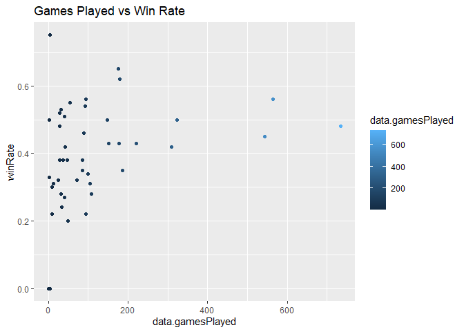
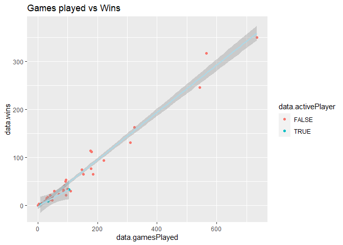
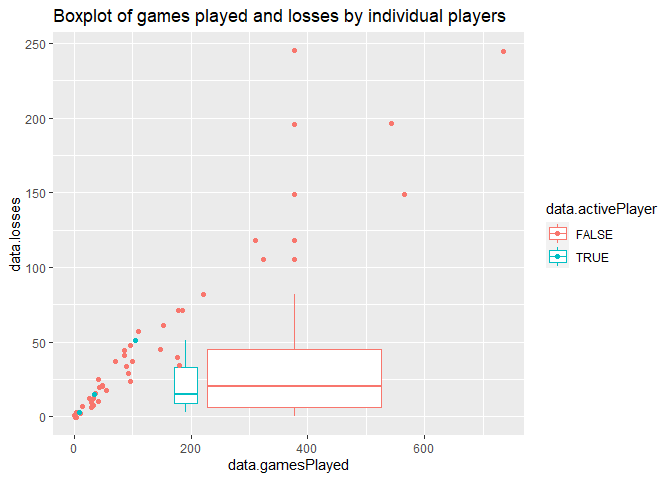
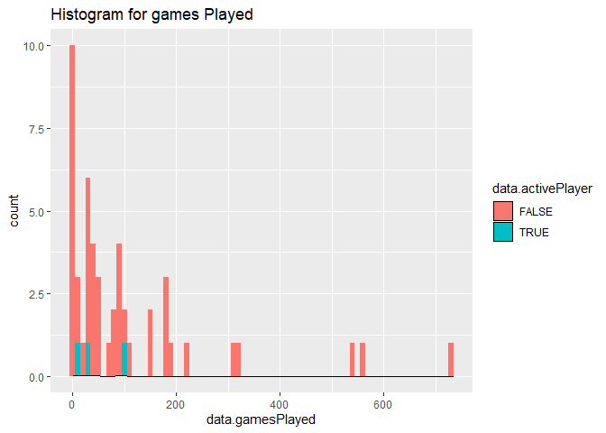

ST\_558\_NHL\_Project
================
Pramodini Karwande
6/13/2021

-   [ST558 : National Hockey League(NHL) Data
    Analysis](#st558--national-hockey-leaguenhl-data-analysis)
    -   [List of Required libraries](#list-of-required-libraries)
    -   [NHL Records API Functions](#nhl-records-api-functions)
    -   [NHL Stats API Function](#nhl-stats-api-function)
    -   [Exploratory Data Analysis
        (EDA)](#exploratory-data-analysis-eda)
        -   [Create new variables](#create-new-variables)
        -   [Contingency Tables](#contingency-tables)
        -   [Numerical summaries for some quantitative
            variables](#numerical-summaries-for-some-quantitative-variables)
    -   [PLOTS :](#plots-)
        -   [1) Bar plot : Active/inactive players Bar
            plot](#1-bar-plot--activeinactive-players-bar-plot)
        -   [2) Histogram Plot : Histogram Plot for goli 12 games played
            and win
            rate.](#2-histogram-plot--histogram-plot-for-goli-12-games-played-and-win-rate)
        -   [3) Scatterplot : Games Played vs Win
            Rate](#3-scatterplot--games-played-vs-win-rate)
        -   [4) ScatterP Plot : Games played vs
            Wins](#4-scatterp-plot--games-played-vs-wins)
        -   [5) Box Plot: Boxplot of games played and losses by
            individual
            players](#5-box-plot-boxplot-of-games-played-and-losses-by-individual-players)
        -   [6) Histogram Plot : Histogram for games
            Played](#6-histogram-plot--histogram-for-games-played)

# ST558 : National Hockey League(NHL) Data Analysis

NHL is professional *ice hokey league* in the world and is one of the
major professional sports league in the United States.We will be doing
data analysis using NHL records api and NHL stats api. Project 1
involves creating a `**vignette**` and summerizing data from **NHL
API**.

Below in the knitr options, I have set echo true to show the code work,
evaluation true and hided the warning and messages which appears due to
including required libraries, or if any function got deprecated and
suggest to use valid options, etc…

## List of Required libraries

“httr” : httr is designed to map closely to the underlying http
protocol. “jsonlite” : The jsonlite package is a JSON parser/generator
optimized for the web. Its main strength is that it implements a
bidirectional mapping between JSON data and the most important R data
types. “dplyr” : dplyr provides the set of data manipulation tools,
functions like group\_by, summarise,… “kableExtra” : kableExtra is a
light weight table generator coming from ‘knitr’. “knitr” : knitr
provides full control of the output without heavy coding work. I used
for options to show the code chunks from RMarkdown and hide the
warnings, messages generating from code with one liner coding.
“summarytools”: I used summarytools to fetch min, max, Q1,… data
“ggplot2” : Using ggplot2, I able to generate scatter plot, boxplot,
histogram, bar chart for EDA

``` r
# section that notes the required packages needed to run the code
library("httr")
library("jsonlite")
library("dplyr")
library("kableExtra")
library("knitr")
library("summarytools")
library("ggplot2")
```

## NHL Records API Functions

Below are the functions to contact the NHL records API for the endpoints
listed below. The functions are accessing API and displaying the part of
data here for the reference.The user have the option to specify the
franchise of choice by both name and ID number.

Below in the code, I declared variables which are having the common
value which can be used through out in this program. Used paste0
function to join the string to make url with common string (like base
url) and requirement specific string (like franchise ID). Used kable
function which helped to generate and style HTML table. Verified the
null values if we are getting null value from user.

``` r
#Grab base URL for API
base_url <- "https://records.nhl.com/site/api"
urlExtention <- "?cayenneExp=franchiseId="
reqID <- ""
team_stat_url <- "https://statsapi.web.nhl.com/api/v1/teams"
team_extend_url <- "?expand=team.stats"

getNhlData<- function(franchiseID=NULL, franchiseName=NULL, tab_name=NULL) {
reqID <-  getID(franchiseID, franchiseName, tab_name)

if(tab_name == "franchise-detail")
{
  urlExtention <- "?cayenneExp=mostRecentTeamId="
}

if(!is.null(reqID)) {
  full_url <- paste0(base_url, "/", tab_name,urlExtention,reqID)
}
else {
  if((tab_name == "franchise-team-totals") || (tab_name == "franchise") ) {
    full_url <- paste0(base_url, "/", tab_name)
  }
}

# GET request to API
res <- GET(full_url)

franchise_data <- fromJSON(rawToChar(res$content), flatten = TRUE)
franchise_data <- data.frame(franchise_data)

if(tab_name == "franchise") {
  franchiseDataTab <- franchise_data %>% mutate("Team"=  paste0(data.teamPlaceName," ",data.teamCommonName)) %>% select("ID" = data.id, "First Season Id"= data.firstSeasonId, "Last Season Id"= data.lastSeasonId, Team)
  #franchiseDataTab <- na.omit(franchiseDataTab)
  knitr::kable(head(franchiseDataTab), caption = tab_name) %>% kable_styling()
}
else {
  knitr::kable(head(franchise_data), caption = tab_name) %>% kable_styling()
}
}

# verify if user provided ID or franchise name or both are null.
getID <- function(franchiseID=NULL, franchiseName=NULL, tab_name=NULL){
  retVal <- NULL
  if (!is.null(franchiseID)) {
    retVal<- franchiseID
    return(retVal)
  }
  else if (!is.null(franchiseName)) {
    retVal <- getName(franchiseName)
    return(retVal)
  }
  else {
    return(retVal)
  }
}

# map Name to ID to get franchise data.
getName <- function(franchiseName=NULL) {
    tab_name <- "franchise"
    full_url <- paste0(base_url, "/", tab_name)
    res <- GET(full_url)

    franchiseNameData <- fromJSON(rawToChar(res$content), flatten = TRUE)
    franchiseNameData <- data.frame(franchiseNameData)
    franchiseID <- franchiseNameData %>% filter(data.fullName == franchiseName) %>% select(data.id)

    return(franchiseID)
} 
```

## NHL Stats API Function

Below is a function to contact the NHL stats API for the
?expand=team.stats modifier. The function is able to take a single team
or return data from all teams. Here, API url is different for all teams
and individual player. Verified it using the if, else function and
redirect API call accordingly.

``` r
getNHLTeamStatsData <- function(teamID=NULL) {
  if (!is.null(teamID)) {
    team_stat_full_url <- paste0(team_stat_url,"/",teamID,team_extend_url)
  }
  else {
    team_stat_full_url <- paste0(team_stat_url,team_extend_url)
  }
  
  res <- GET(team_stat_full_url)

    team_stat_data <- fromJSON(rawToChar(res$content), flatten = TRUE)
    team_stat_data <- data.frame(team_stat_data)
    knitr::kable(head(team_stat_data), caption = "NHL Team Stat Data") %>% kable_styling()
}

# *****************TESTING START***********************
 getNHLTeamStatsData(NULL)
```

<table class="table" style="margin-left: auto; margin-right: auto;">
<caption>
NHL Team Stat Data
</caption>
<thead>
<tr>
<th style="text-align:left;">
copyright
</th>
<th style="text-align:right;">
teams.id
</th>
<th style="text-align:left;">
teams.name
</th>
<th style="text-align:left;">
teams.link
</th>
<th style="text-align:left;">
teams.abbreviation
</th>
<th style="text-align:left;">
teams.teamName
</th>
<th style="text-align:left;">
teams.locationName
</th>
<th style="text-align:left;">
teams.firstYearOfPlay
</th>
<th style="text-align:left;">
teams.teamStats
</th>
<th style="text-align:left;">
teams.shortName
</th>
<th style="text-align:left;">
teams.officialSiteUrl
</th>
<th style="text-align:right;">
teams.franchiseId
</th>
<th style="text-align:left;">
teams.active
</th>
<th style="text-align:left;">
teams.venue.name
</th>
<th style="text-align:left;">
teams.venue.link
</th>
<th style="text-align:left;">
teams.venue.city
</th>
<th style="text-align:right;">
teams.venue.id
</th>
<th style="text-align:left;">
teams.venue.timeZone.id
</th>
<th style="text-align:right;">
teams.venue.timeZone.offset
</th>
<th style="text-align:left;">
teams.venue.timeZone.tz
</th>
<th style="text-align:right;">
teams.division.id
</th>
<th style="text-align:left;">
teams.division.name
</th>
<th style="text-align:left;">
teams.division.link
</th>
<th style="text-align:right;">
teams.conference.id
</th>
<th style="text-align:left;">
teams.conference.name
</th>
<th style="text-align:left;">
teams.conference.link
</th>
<th style="text-align:right;">
teams.franchise.franchiseId
</th>
<th style="text-align:left;">
teams.franchise.teamName
</th>
<th style="text-align:left;">
teams.franchise.link
</th>
</tr>
</thead>
<tbody>
<tr>
<td style="text-align:left;">
NHL and the NHL Shield are registered trademarks of the National Hockey
League. NHL and NHL team marks are the property of the NHL and its
teams. © NHL 2021. All Rights Reserved.
</td>
<td style="text-align:right;">
1
</td>
<td style="text-align:left;">
New Jersey Devils
</td>
<td style="text-align:left;">
/api/v1/teams/1
</td>
<td style="text-align:left;">
NJD
</td>
<td style="text-align:left;">
Devils
</td>
<td style="text-align:left;">
New Jersey
</td>
<td style="text-align:left;">
1982
</td>
<td style="text-align:left;">
56 , NA , 19 , 28th , 30 , 29th , 7 , 15th , 45 , 29th , 40.2 , 29th ,
2.589 , 26th , 3.375 , 28th , 0.8293 , 21st , 14.2 , 28th , 22 , 28th ,
43 , 30th , 155 , 23rd , 71.0 , 31st , 28.7857 , 24th , 31.0179 , 22nd ,
0.552 , 22nd , 0.111 , 31st , 0.737 , 19th , 0.733 , 28th , 0.211 , 31st
, 0.417 , 31st , 3180 , 8th , 1481 , 27th , 1699 , 30th , 46.6 , 27th ,
9 , NA , 0.891 , NA , NA , 6th , NA , 29th , NA , 24th , 1 , 1 , New
Jersey Devils, New Jersey Devils, /api/v1/teams/1 , /api/v1/teams/1 ,
statsSingleSeason, R , Regular season , FALSE
</td>
<td style="text-align:left;">
New Jersey
</td>
<td style="text-align:left;">
<http://www.newjerseydevils.com/>
</td>
<td style="text-align:right;">
23
</td>
<td style="text-align:left;">
TRUE
</td>
<td style="text-align:left;">
Prudential Center
</td>
<td style="text-align:left;">
/api/v1/venues/null
</td>
<td style="text-align:left;">
Newark
</td>
<td style="text-align:right;">
NA
</td>
<td style="text-align:left;">
America/New\_York
</td>
<td style="text-align:right;">
-4
</td>
<td style="text-align:left;">
EDT
</td>
<td style="text-align:right;">
25
</td>
<td style="text-align:left;">
MassMutual East
</td>
<td style="text-align:left;">
/api/v1/divisions/25
</td>
<td style="text-align:right;">
6
</td>
<td style="text-align:left;">
Eastern
</td>
<td style="text-align:left;">
/api/v1/conferences/6
</td>
<td style="text-align:right;">
23
</td>
<td style="text-align:left;">
Devils
</td>
<td style="text-align:left;">
/api/v1/franchises/23
</td>
</tr>
<tr>
<td style="text-align:left;">
NHL and the NHL Shield are registered trademarks of the National Hockey
League. NHL and NHL team marks are the property of the NHL and its
teams. © NHL 2021. All Rights Reserved.
</td>
<td style="text-align:right;">
2
</td>
<td style="text-align:left;">
New York Islanders
</td>
<td style="text-align:left;">
/api/v1/teams/2
</td>
<td style="text-align:left;">
NYI
</td>
<td style="text-align:left;">
Islanders
</td>
<td style="text-align:left;">
New York
</td>
<td style="text-align:left;">
1972
</td>
<td style="text-align:left;">
56 , NA , 32 , 12th , 17 , 11th , 7 , 11th , 71 , 12th , 63.4 , 12th ,
2.714 , 21st , 2.232 , 2nd , 1.2418 , 7th , 18.8 , 20th , 27 , 24th , 22
, 2nd , 144 , 28th , 83.7 , 6th , 28.9821 , 22nd , 28.3929 , 10th ,
0.821 , 10th , 0.321 , 16th , 0.833 , 7th , 0.842 , 20th , 0.69 , 4th ,
0.44 , 4th , 2916 , 31st , 1498 , 25th , 1418 , 2nd , 51.4 , 9th , 9.4 ,
NA , 0.921 , NA , NA , 2nd , NA , 1st , NA , 17th , 2 , 2 , New York
Islanders, New York Islanders, /api/v1/teams/2 , /api/v1/teams/2 ,
statsSingleSeason , R , Regular season , FALSE
</td>
<td style="text-align:left;">
NY Islanders
</td>
<td style="text-align:left;">
<http://www.newyorkislanders.com/>
</td>
<td style="text-align:right;">
22
</td>
<td style="text-align:left;">
TRUE
</td>
<td style="text-align:left;">
Nassau Veterans Memorial Coliseum
</td>
<td style="text-align:left;">
/api/v1/venues/null
</td>
<td style="text-align:left;">
Uniondale
</td>
<td style="text-align:right;">
NA
</td>
<td style="text-align:left;">
America/New\_York
</td>
<td style="text-align:right;">
-4
</td>
<td style="text-align:left;">
EDT
</td>
<td style="text-align:right;">
25
</td>
<td style="text-align:left;">
MassMutual East
</td>
<td style="text-align:left;">
/api/v1/divisions/25
</td>
<td style="text-align:right;">
6
</td>
<td style="text-align:left;">
Eastern
</td>
<td style="text-align:left;">
/api/v1/conferences/6
</td>
<td style="text-align:right;">
22
</td>
<td style="text-align:left;">
Islanders
</td>
<td style="text-align:left;">
/api/v1/franchises/22
</td>
</tr>
<tr>
<td style="text-align:left;">
NHL and the NHL Shield are registered trademarks of the National Hockey
League. NHL and NHL team marks are the property of the NHL and its
teams. © NHL 2021. All Rights Reserved.
</td>
<td style="text-align:right;">
3
</td>
<td style="text-align:left;">
New York Rangers
</td>
<td style="text-align:left;">
/api/v1/teams/3
</td>
<td style="text-align:left;">
NYR
</td>
<td style="text-align:left;">
Rangers
</td>
<td style="text-align:left;">
New York
</td>
<td style="text-align:left;">
1926
</td>
<td style="text-align:left;">
56 , NA , 27 , 16th , 23 , 18th , 6 , 17th , 60 , 17th , 53.6 , 17th ,
3.143 , 10th , 2.768 , 14th , 1.0943 , 13th , 20.7 , 14th , 37 , 10th ,
30 , 12th , 179 , 4th , 82.2 , 10th , 28.6964 , 25th , 29.7143 , 13th ,
0.7 , 12th , 0.231 , 24th , 0.739 , 16th , 0.808 , 23rd , 0.545 , 14th ,
0.484 , 14th , 3026 , 26th , 1346 , 31st , 1680 , 29th , 44.5 , 31st ,
11 , NA , 0.907 , NA , NA , 20th , NA , 12th , NA , 4th , 3 , 3 , New
York Rangers , New York Rangers , /api/v1/teams/3 , /api/v1/teams/3 ,
statsSingleSeason, R , Regular season , FALSE
</td>
<td style="text-align:left;">
NY Rangers
</td>
<td style="text-align:left;">
<http://www.newyorkrangers.com/>
</td>
<td style="text-align:right;">
10
</td>
<td style="text-align:left;">
TRUE
</td>
<td style="text-align:left;">
Madison Square Garden
</td>
<td style="text-align:left;">
/api/v1/venues/5054
</td>
<td style="text-align:left;">
New York
</td>
<td style="text-align:right;">
5054
</td>
<td style="text-align:left;">
America/New\_York
</td>
<td style="text-align:right;">
-4
</td>
<td style="text-align:left;">
EDT
</td>
<td style="text-align:right;">
25
</td>
<td style="text-align:left;">
MassMutual East
</td>
<td style="text-align:left;">
/api/v1/divisions/25
</td>
<td style="text-align:right;">
6
</td>
<td style="text-align:left;">
Eastern
</td>
<td style="text-align:left;">
/api/v1/conferences/6
</td>
<td style="text-align:right;">
10
</td>
<td style="text-align:left;">
Rangers
</td>
<td style="text-align:left;">
/api/v1/franchises/10
</td>
</tr>
<tr>
<td style="text-align:left;">
NHL and the NHL Shield are registered trademarks of the National Hockey
League. NHL and NHL team marks are the property of the NHL and its
teams. © NHL 2021. All Rights Reserved.
</td>
<td style="text-align:right;">
4
</td>
<td style="text-align:left;">
Philadelphia Flyers
</td>
<td style="text-align:left;">
/api/v1/teams/4
</td>
<td style="text-align:left;">
PHI
</td>
<td style="text-align:left;">
Flyers
</td>
<td style="text-align:left;">
Philadelphia
</td>
<td style="text-align:left;">
1967
</td>
<td style="text-align:left;">
56 , NA , 25 , 18th , 23 , 19th , 8 , 8th , 58 , 19th , 51.8 , 19th ,
2.857 , 15th , 3.518 , 31st , 0.806 , 23rd , 19.2 , 18th , 32 , 15th ,
45 , 31st , 167 , 12th , 73.0 , 30th , 30.2143 , 10th , 29.2143 , 12th ,
0.609 , 23rd , 0.333 , 11th , 0.769 , 10th , 0.833 , 21st , 0.441 , 22nd
, 0.455 , 22nd , 3217 , 6th , 1738 , 3rd , 1479 , 8th , 54.0 , 2nd , 9.5
, NA , 0.88 , NA , NA , 17th , NA , 31st , NA , 16th , 4 , 4 ,
Philadelphia Flyers, Philadelphia Flyers, /api/v1/teams/4 ,
/api/v1/teams/4 , statsSingleSeason , R , Regular season , FALSE
</td>
<td style="text-align:left;">
Philadelphia
</td>
<td style="text-align:left;">
<http://www.philadelphiaflyers.com/>
</td>
<td style="text-align:right;">
16
</td>
<td style="text-align:left;">
TRUE
</td>
<td style="text-align:left;">
Wells Fargo Center
</td>
<td style="text-align:left;">
/api/v1/venues/5096
</td>
<td style="text-align:left;">
Philadelphia
</td>
<td style="text-align:right;">
5096
</td>
<td style="text-align:left;">
America/New\_York
</td>
<td style="text-align:right;">
-4
</td>
<td style="text-align:left;">
EDT
</td>
<td style="text-align:right;">
25
</td>
<td style="text-align:left;">
MassMutual East
</td>
<td style="text-align:left;">
/api/v1/divisions/25
</td>
<td style="text-align:right;">
6
</td>
<td style="text-align:left;">
Eastern
</td>
<td style="text-align:left;">
/api/v1/conferences/6
</td>
<td style="text-align:right;">
16
</td>
<td style="text-align:left;">
Flyers
</td>
<td style="text-align:left;">
/api/v1/franchises/16
</td>
</tr>
<tr>
<td style="text-align:left;">
NHL and the NHL Shield are registered trademarks of the National Hockey
League. NHL and NHL team marks are the property of the NHL and its
teams. © NHL 2021. All Rights Reserved.
</td>
<td style="text-align:right;">
5
</td>
<td style="text-align:left;">
Pittsburgh Penguins
</td>
<td style="text-align:left;">
/api/v1/teams/5
</td>
<td style="text-align:left;">
PIT
</td>
<td style="text-align:left;">
Penguins
</td>
<td style="text-align:left;">
Pittsburgh
</td>
<td style="text-align:left;">
1967
</td>
<td style="text-align:left;">
56 , NA , 37 , 4th , 16 , 7th , 3 , 25th , 77 , 7th , 68.8 , 7th , 3.446
, 2nd , 2.768 , 13th , 1.27 , 5th , 23.7 , 4th , 36 , 12th , 35 , 22nd ,
152 , 25th , 77.4 , 27th , 30.0714 , 12th , 29.9821 , 15th , 0.793 , 7th
, 0.519 , 2nd , 0.846 , 6th , 0.926 , 7th , 0.655 , 6th , 0.68 , 6th ,
3191 , 7th , 1573 , 11th , 1618 , 23rd , 49.3 , 21st , 11.5 , NA , 0.908
, NA , NA , 11th , NA , 10th , NA , 1st , 5 , 5 , Pittsburgh Penguins,
Pittsburgh Penguins, /api/v1/teams/5 , /api/v1/teams/5 ,
statsSingleSeason , R , Regular season , FALSE
</td>
<td style="text-align:left;">
Pittsburgh
</td>
<td style="text-align:left;">
<http://pittsburghpenguins.com/>
</td>
<td style="text-align:right;">
17
</td>
<td style="text-align:left;">
TRUE
</td>
<td style="text-align:left;">
PPG Paints Arena
</td>
<td style="text-align:left;">
/api/v1/venues/5034
</td>
<td style="text-align:left;">
Pittsburgh
</td>
<td style="text-align:right;">
5034
</td>
<td style="text-align:left;">
America/New\_York
</td>
<td style="text-align:right;">
-4
</td>
<td style="text-align:left;">
EDT
</td>
<td style="text-align:right;">
25
</td>
<td style="text-align:left;">
MassMutual East
</td>
<td style="text-align:left;">
/api/v1/divisions/25
</td>
<td style="text-align:right;">
6
</td>
<td style="text-align:left;">
Eastern
</td>
<td style="text-align:left;">
/api/v1/conferences/6
</td>
<td style="text-align:right;">
17
</td>
<td style="text-align:left;">
Penguins
</td>
<td style="text-align:left;">
/api/v1/franchises/17
</td>
</tr>
<tr>
<td style="text-align:left;">
NHL and the NHL Shield are registered trademarks of the National Hockey
League. NHL and NHL team marks are the property of the NHL and its
teams. © NHL 2021. All Rights Reserved.
</td>
<td style="text-align:right;">
6
</td>
<td style="text-align:left;">
Boston Bruins
</td>
<td style="text-align:left;">
/api/v1/teams/6
</td>
<td style="text-align:left;">
BOS
</td>
<td style="text-align:left;">
Bruins
</td>
<td style="text-align:left;">
Boston
</td>
<td style="text-align:left;">
1924
</td>
<td style="text-align:left;">
56 , NA , 33 , 11th , 16 , 9th , 7 , 10th , 73 , 10th , 65.2 , 10th ,
2.929 , 14th , 2.393 , 5th , 1.1383 , 12th , 21.9 , 10th , 35 , 14th ,
25 , 3rd , 160 , 16th , 86.0 , 2nd , 33.3214 , 3rd , 27.0714 , 2nd ,
0.735 , 5th , 0.364 , 17th , 0.909 , 2nd , 0.885 , 11th , 0.615 , 10th ,
0.467 , 10th , 3169 , 9th , 1751 , 2nd , 1418 , 1st , 55.2 , 1st , 8.8 ,
NA , 0.912 , NA , NA , 28th , NA , 5th , NA , 26th , 6 , 6 , Boston
Bruins , Boston Bruins , /api/v1/teams/6 , /api/v1/teams/6 ,
statsSingleSeason, R , Regular season , FALSE
</td>
<td style="text-align:left;">
Boston
</td>
<td style="text-align:left;">
<http://www.bostonbruins.com/>
</td>
<td style="text-align:right;">
6
</td>
<td style="text-align:left;">
TRUE
</td>
<td style="text-align:left;">
TD Garden
</td>
<td style="text-align:left;">
/api/v1/venues/5085
</td>
<td style="text-align:left;">
Boston
</td>
<td style="text-align:right;">
5085
</td>
<td style="text-align:left;">
America/New\_York
</td>
<td style="text-align:right;">
-4
</td>
<td style="text-align:left;">
EDT
</td>
<td style="text-align:right;">
25
</td>
<td style="text-align:left;">
MassMutual East
</td>
<td style="text-align:left;">
/api/v1/divisions/25
</td>
<td style="text-align:right;">
6
</td>
<td style="text-align:left;">
Eastern
</td>
<td style="text-align:left;">
/api/v1/conferences/6
</td>
<td style="text-align:right;">
6
</td>
<td style="text-align:left;">
Bruins
</td>
<td style="text-align:left;">
/api/v1/franchises/6
</td>
</tr>
</tbody>
</table>

``` r
 getNHLTeamStatsData(3)
```

<table class="table" style="margin-left: auto; margin-right: auto;">
<caption>
NHL Team Stat Data
</caption>
<thead>
<tr>
<th style="text-align:left;">
copyright
</th>
<th style="text-align:right;">
teams.id
</th>
<th style="text-align:left;">
teams.name
</th>
<th style="text-align:left;">
teams.link
</th>
<th style="text-align:left;">
teams.abbreviation
</th>
<th style="text-align:left;">
teams.teamName
</th>
<th style="text-align:left;">
teams.locationName
</th>
<th style="text-align:left;">
teams.firstYearOfPlay
</th>
<th style="text-align:left;">
teams.teamStats
</th>
<th style="text-align:left;">
teams.shortName
</th>
<th style="text-align:left;">
teams.officialSiteUrl
</th>
<th style="text-align:right;">
teams.franchiseId
</th>
<th style="text-align:left;">
teams.active
</th>
<th style="text-align:right;">
teams.venue.id
</th>
<th style="text-align:left;">
teams.venue.name
</th>
<th style="text-align:left;">
teams.venue.link
</th>
<th style="text-align:left;">
teams.venue.city
</th>
<th style="text-align:left;">
teams.venue.timeZone.id
</th>
<th style="text-align:right;">
teams.venue.timeZone.offset
</th>
<th style="text-align:left;">
teams.venue.timeZone.tz
</th>
<th style="text-align:right;">
teams.division.id
</th>
<th style="text-align:left;">
teams.division.name
</th>
<th style="text-align:left;">
teams.division.link
</th>
<th style="text-align:right;">
teams.conference.id
</th>
<th style="text-align:left;">
teams.conference.name
</th>
<th style="text-align:left;">
teams.conference.link
</th>
<th style="text-align:right;">
teams.franchise.franchiseId
</th>
<th style="text-align:left;">
teams.franchise.teamName
</th>
<th style="text-align:left;">
teams.franchise.link
</th>
</tr>
</thead>
<tbody>
<tr>
<td style="text-align:left;">
NHL and the NHL Shield are registered trademarks of the National Hockey
League. NHL and NHL team marks are the property of the NHL and its
teams. © NHL 2021. All Rights Reserved.
</td>
<td style="text-align:right;">
3
</td>
<td style="text-align:left;">
New York Rangers
</td>
<td style="text-align:left;">
/api/v1/teams/3
</td>
<td style="text-align:left;">
NYR
</td>
<td style="text-align:left;">
Rangers
</td>
<td style="text-align:left;">
New York
</td>
<td style="text-align:left;">
1926
</td>
<td style="text-align:left;">
56 , NA , 27 , 16th , 23 , 18th , 6 , 17th , 60 , 17th , 53.6 , 17th ,
3.143 , 10th , 2.768 , 14th , 1.0943 , 13th , 20.7 , 14th , 37 , 10th ,
30 , 12th , 179 , 4th , 82.2 , 10th , 28.6964 , 25th , 29.7143 , 13th ,
0.7 , 12th , 0.231 , 24th , 0.739 , 16th , 0.808 , 23rd , 0.545 , 14th ,
0.484 , 14th , 3026 , 26th , 1346 , 31st , 1680 , 29th , 44.5 , 31st ,
11 , NA , 0.907 , NA , NA , 20th , NA , 12th , NA , 4th , 3 , 3 , New
York Rangers , New York Rangers , /api/v1/teams/3 , /api/v1/teams/3 ,
statsSingleSeason, R , Regular season , FALSE
</td>
<td style="text-align:left;">
NY Rangers
</td>
<td style="text-align:left;">
<http://www.newyorkrangers.com/>
</td>
<td style="text-align:right;">
10
</td>
<td style="text-align:left;">
TRUE
</td>
<td style="text-align:right;">
5054
</td>
<td style="text-align:left;">
Madison Square Garden
</td>
<td style="text-align:left;">
/api/v1/venues/5054
</td>
<td style="text-align:left;">
New York
</td>
<td style="text-align:left;">
America/New\_York
</td>
<td style="text-align:right;">
-4
</td>
<td style="text-align:left;">
EDT
</td>
<td style="text-align:right;">
25
</td>
<td style="text-align:left;">
MassMutual East
</td>
<td style="text-align:left;">
/api/v1/divisions/25
</td>
<td style="text-align:right;">
6
</td>
<td style="text-align:left;">
Eastern
</td>
<td style="text-align:left;">
/api/v1/conferences/6
</td>
<td style="text-align:right;">
10
</td>
<td style="text-align:left;">
Rangers
</td>
<td style="text-align:left;">
/api/v1/franchises/10
</td>
</tr>
</tbody>
</table>

``` r
# *****************TESTING END***********************
```

\#Wrapper Function Wrapper function : that is essentially a
one-stop-shop for the user to access any of the API endpoints listed for
the project study. This function simply calls the appropriate endpoint
as per the users request (including any modifiers, teamIDs, etc.). This
is achieved using switch case based on user request. All the requests
call is done and tested based on ST 558- Project.

``` r
nhlWrapper <- function(nhlDataRequest, franchiseID=NULL,franchiseName=NULL, tab_name=NULL) {
  output = switch (nhlDataRequest,
    "/franchise"                = getNhlData(franchiseID,franchiseName,"franchise"),
    "/franchise-team-totals"    = getNhlData(franchiseID,franchiseName,"franchise-team-totals"),
    "/franchise-season-records" = getNhlData(franchiseID,NULL,"franchise-season-records"),
    "/franchise-goalie-records" = getNhlData(franchiseID,NULL,"franchise-goalie-records"),
    "/franchise-skater-records" = getNhlData(franchiseID,NULL,"franchise-skater-records"),
    "/franchise-detail"         = getNhlData(franchiseID,NULL,"franchise-detail"),
    "/individual-team-stat"     = getNHLTeamStatsData(teamID = 2),
    "/teams-stat"               = getNHLTeamStatsData(NULL),
    )
  return(output)
}

# *****************TESTING START***********************

nhlWrapper("/franchise",NULL, NULL, "franchise" )
```

<table class="table" style="margin-left: auto; margin-right: auto;">
<caption>
franchise
</caption>
<thead>
<tr>
<th style="text-align:right;">
ID
</th>
<th style="text-align:right;">
First Season Id
</th>
<th style="text-align:right;">
Last Season Id
</th>
<th style="text-align:left;">
Team
</th>
</tr>
</thead>
<tbody>
<tr>
<td style="text-align:right;">
1
</td>
<td style="text-align:right;">
19171918
</td>
<td style="text-align:right;">
NA
</td>
<td style="text-align:left;">
Montréal Canadiens
</td>
</tr>
<tr>
<td style="text-align:right;">
2
</td>
<td style="text-align:right;">
19171918
</td>
<td style="text-align:right;">
19171918
</td>
<td style="text-align:left;">
Montreal Wanderers
</td>
</tr>
<tr>
<td style="text-align:right;">
3
</td>
<td style="text-align:right;">
19171918
</td>
<td style="text-align:right;">
19341935
</td>
<td style="text-align:left;">
St. Louis Eagles
</td>
</tr>
<tr>
<td style="text-align:right;">
4
</td>
<td style="text-align:right;">
19191920
</td>
<td style="text-align:right;">
19241925
</td>
<td style="text-align:left;">
Hamilton Tigers
</td>
</tr>
<tr>
<td style="text-align:right;">
5
</td>
<td style="text-align:right;">
19171918
</td>
<td style="text-align:right;">
NA
</td>
<td style="text-align:left;">
Toronto Maple Leafs
</td>
</tr>
<tr>
<td style="text-align:right;">
6
</td>
<td style="text-align:right;">
19241925
</td>
<td style="text-align:right;">
NA
</td>
<td style="text-align:left;">
Boston Bruins
</td>
</tr>
</tbody>
</table>

``` r
nhlWrapper("/franchise-team-totals",NULL, NULL, "franchise-team-totals" )
```

<table class="table" style="margin-left: auto; margin-right: auto;">
<caption>
franchise-team-totals
</caption>
<thead>
<tr>
<th style="text-align:right;">
data.id
</th>
<th style="text-align:right;">
data.activeFranchise
</th>
<th style="text-align:right;">
data.firstSeasonId
</th>
<th style="text-align:right;">
data.franchiseId
</th>
<th style="text-align:right;">
data.gameTypeId
</th>
<th style="text-align:right;">
data.gamesPlayed
</th>
<th style="text-align:right;">
data.goalsAgainst
</th>
<th style="text-align:right;">
data.goalsFor
</th>
<th style="text-align:right;">
data.homeLosses
</th>
<th style="text-align:right;">
data.homeOvertimeLosses
</th>
<th style="text-align:right;">
data.homeTies
</th>
<th style="text-align:right;">
data.homeWins
</th>
<th style="text-align:right;">
data.lastSeasonId
</th>
<th style="text-align:right;">
data.losses
</th>
<th style="text-align:right;">
data.overtimeLosses
</th>
<th style="text-align:right;">
data.penaltyMinutes
</th>
<th style="text-align:right;">
data.pointPctg
</th>
<th style="text-align:right;">
data.points
</th>
<th style="text-align:right;">
data.roadLosses
</th>
<th style="text-align:right;">
data.roadOvertimeLosses
</th>
<th style="text-align:right;">
data.roadTies
</th>
<th style="text-align:right;">
data.roadWins
</th>
<th style="text-align:right;">
data.shootoutLosses
</th>
<th style="text-align:right;">
data.shootoutWins
</th>
<th style="text-align:right;">
data.shutouts
</th>
<th style="text-align:right;">
data.teamId
</th>
<th style="text-align:left;">
data.teamName
</th>
<th style="text-align:right;">
data.ties
</th>
<th style="text-align:left;">
data.triCode
</th>
<th style="text-align:right;">
data.wins
</th>
<th style="text-align:right;">
total
</th>
</tr>
</thead>
<tbody>
<tr>
<td style="text-align:right;">
1
</td>
<td style="text-align:right;">
1
</td>
<td style="text-align:right;">
19821983
</td>
<td style="text-align:right;">
23
</td>
<td style="text-align:right;">
2
</td>
<td style="text-align:right;">
2993
</td>
<td style="text-align:right;">
8902
</td>
<td style="text-align:right;">
8792
</td>
<td style="text-align:right;">
525
</td>
<td style="text-align:right;">
85
</td>
<td style="text-align:right;">
96
</td>
<td style="text-align:right;">
790
</td>
<td style="text-align:right;">
NA
</td>
<td style="text-align:right;">
1211
</td>
<td style="text-align:right;">
169
</td>
<td style="text-align:right;">
44773
</td>
<td style="text-align:right;">
0.5306
</td>
<td style="text-align:right;">
3176
</td>
<td style="text-align:right;">
686
</td>
<td style="text-align:right;">
84
</td>
<td style="text-align:right;">
123
</td>
<td style="text-align:right;">
604
</td>
<td style="text-align:right;">
84
</td>
<td style="text-align:right;">
78
</td>
<td style="text-align:right;">
196
</td>
<td style="text-align:right;">
1
</td>
<td style="text-align:left;">
New Jersey Devils
</td>
<td style="text-align:right;">
219
</td>
<td style="text-align:left;">
NJD
</td>
<td style="text-align:right;">
1394
</td>
<td style="text-align:right;">
105
</td>
</tr>
<tr>
<td style="text-align:right;">
2
</td>
<td style="text-align:right;">
1
</td>
<td style="text-align:right;">
19821983
</td>
<td style="text-align:right;">
23
</td>
<td style="text-align:right;">
3
</td>
<td style="text-align:right;">
257
</td>
<td style="text-align:right;">
634
</td>
<td style="text-align:right;">
697
</td>
<td style="text-align:right;">
53
</td>
<td style="text-align:right;">
0
</td>
<td style="text-align:right;">
NA
</td>
<td style="text-align:right;">
74
</td>
<td style="text-align:right;">
NA
</td>
<td style="text-align:right;">
120
</td>
<td style="text-align:right;">
0
</td>
<td style="text-align:right;">
4266
</td>
<td style="text-align:right;">
0.0039
</td>
<td style="text-align:right;">
2
</td>
<td style="text-align:right;">
67
</td>
<td style="text-align:right;">
0
</td>
<td style="text-align:right;">
NA
</td>
<td style="text-align:right;">
63
</td>
<td style="text-align:right;">
0
</td>
<td style="text-align:right;">
0
</td>
<td style="text-align:right;">
25
</td>
<td style="text-align:right;">
1
</td>
<td style="text-align:left;">
New Jersey Devils
</td>
<td style="text-align:right;">
NA
</td>
<td style="text-align:left;">
NJD
</td>
<td style="text-align:right;">
137
</td>
<td style="text-align:right;">
105
</td>
</tr>
<tr>
<td style="text-align:right;">
3
</td>
<td style="text-align:right;">
1
</td>
<td style="text-align:right;">
19721973
</td>
<td style="text-align:right;">
22
</td>
<td style="text-align:right;">
2
</td>
<td style="text-align:right;">
3788
</td>
<td style="text-align:right;">
11907
</td>
<td style="text-align:right;">
12045
</td>
<td style="text-align:right;">
678
</td>
<td style="text-align:right;">
84
</td>
<td style="text-align:right;">
170
</td>
<td style="text-align:right;">
963
</td>
<td style="text-align:right;">
NA
</td>
<td style="text-align:right;">
1587
</td>
<td style="text-align:right;">
166
</td>
<td style="text-align:right;">
57792
</td>
<td style="text-align:right;">
0.5133
</td>
<td style="text-align:right;">
3889
</td>
<td style="text-align:right;">
909
</td>
<td style="text-align:right;">
82
</td>
<td style="text-align:right;">
177
</td>
<td style="text-align:right;">
725
</td>
<td style="text-align:right;">
70
</td>
<td style="text-align:right;">
86
</td>
<td style="text-align:right;">
177
</td>
<td style="text-align:right;">
2
</td>
<td style="text-align:left;">
New York Islanders
</td>
<td style="text-align:right;">
347
</td>
<td style="text-align:left;">
NYI
</td>
<td style="text-align:right;">
1688
</td>
<td style="text-align:right;">
105
</td>
</tr>
<tr>
<td style="text-align:right;">
4
</td>
<td style="text-align:right;">
1
</td>
<td style="text-align:right;">
19721973
</td>
<td style="text-align:right;">
22
</td>
<td style="text-align:right;">
3
</td>
<td style="text-align:right;">
310
</td>
<td style="text-align:right;">
899
</td>
<td style="text-align:right;">
986
</td>
<td style="text-align:right;">
53
</td>
<td style="text-align:right;">
1
</td>
<td style="text-align:right;">
NA
</td>
<td style="text-align:right;">
95
</td>
<td style="text-align:right;">
NA
</td>
<td style="text-align:right;">
139
</td>
<td style="text-align:right;">
0
</td>
<td style="text-align:right;">
5693
</td>
<td style="text-align:right;">
0.0129
</td>
<td style="text-align:right;">
8
</td>
<td style="text-align:right;">
86
</td>
<td style="text-align:right;">
2
</td>
<td style="text-align:right;">
NA
</td>
<td style="text-align:right;">
76
</td>
<td style="text-align:right;">
0
</td>
<td style="text-align:right;">
0
</td>
<td style="text-align:right;">
12
</td>
<td style="text-align:right;">
2
</td>
<td style="text-align:left;">
New York Islanders
</td>
<td style="text-align:right;">
NA
</td>
<td style="text-align:left;">
NYI
</td>
<td style="text-align:right;">
171
</td>
<td style="text-align:right;">
105
</td>
</tr>
<tr>
<td style="text-align:right;">
5
</td>
<td style="text-align:right;">
1
</td>
<td style="text-align:right;">
19261927
</td>
<td style="text-align:right;">
10
</td>
<td style="text-align:right;">
2
</td>
<td style="text-align:right;">
6560
</td>
<td style="text-align:right;">
20020
</td>
<td style="text-align:right;">
20041
</td>
<td style="text-align:right;">
1143
</td>
<td style="text-align:right;">
76
</td>
<td style="text-align:right;">
448
</td>
<td style="text-align:right;">
1614
</td>
<td style="text-align:right;">
NA
</td>
<td style="text-align:right;">
2716
</td>
<td style="text-align:right;">
153
</td>
<td style="text-align:right;">
86129
</td>
<td style="text-align:right;">
0.5127
</td>
<td style="text-align:right;">
6727
</td>
<td style="text-align:right;">
1573
</td>
<td style="text-align:right;">
77
</td>
<td style="text-align:right;">
360
</td>
<td style="text-align:right;">
1269
</td>
<td style="text-align:right;">
68
</td>
<td style="text-align:right;">
79
</td>
<td style="text-align:right;">
408
</td>
<td style="text-align:right;">
3
</td>
<td style="text-align:left;">
New York Rangers
</td>
<td style="text-align:right;">
808
</td>
<td style="text-align:left;">
NYR
</td>
<td style="text-align:right;">
2883
</td>
<td style="text-align:right;">
105
</td>
</tr>
<tr>
<td style="text-align:right;">
6
</td>
<td style="text-align:right;">
1
</td>
<td style="text-align:right;">
19261927
</td>
<td style="text-align:right;">
10
</td>
<td style="text-align:right;">
3
</td>
<td style="text-align:right;">
518
</td>
<td style="text-align:right;">
1447
</td>
<td style="text-align:right;">
1404
</td>
<td style="text-align:right;">
104
</td>
<td style="text-align:right;">
0
</td>
<td style="text-align:right;">
1
</td>
<td style="text-align:right;">
137
</td>
<td style="text-align:right;">
NA
</td>
<td style="text-align:right;">
266
</td>
<td style="text-align:right;">
0
</td>
<td style="text-align:right;">
8181
</td>
<td style="text-align:right;">
0.0000
</td>
<td style="text-align:right;">
0
</td>
<td style="text-align:right;">
162
</td>
<td style="text-align:right;">
0
</td>
<td style="text-align:right;">
7
</td>
<td style="text-align:right;">
107
</td>
<td style="text-align:right;">
0
</td>
<td style="text-align:right;">
0
</td>
<td style="text-align:right;">
44
</td>
<td style="text-align:right;">
3
</td>
<td style="text-align:left;">
New York Rangers
</td>
<td style="text-align:right;">
8
</td>
<td style="text-align:left;">
NYR
</td>
<td style="text-align:right;">
244
</td>
<td style="text-align:right;">
105
</td>
</tr>
</tbody>
</table>

``` r
nhlWrapper("/franchise-season-records",3, NULL, "franchise-season-records" )
```

<table class="table" style="margin-left: auto; margin-right: auto;">
<caption>
franchise-season-records
</caption>
<thead>
<tr>
<th style="text-align:right;">
data.id
</th>
<th style="text-align:left;">
data.fewestGoals
</th>
<th style="text-align:left;">
data.fewestGoalsAgainst
</th>
<th style="text-align:left;">
data.fewestGoalsAgainstSeasons
</th>
<th style="text-align:left;">
data.fewestGoalsSeasons
</th>
<th style="text-align:left;">
data.fewestLosses
</th>
<th style="text-align:left;">
data.fewestLossesSeasons
</th>
<th style="text-align:left;">
data.fewestPoints
</th>
<th style="text-align:left;">
data.fewestPointsSeasons
</th>
<th style="text-align:left;">
data.fewestTies
</th>
<th style="text-align:left;">
data.fewestTiesSeasons
</th>
<th style="text-align:left;">
data.fewestWins
</th>
<th style="text-align:left;">
data.fewestWinsSeasons
</th>
<th style="text-align:right;">
data.franchiseId
</th>
<th style="text-align:left;">
data.franchiseName
</th>
<th style="text-align:right;">
data.homeLossStreak
</th>
<th style="text-align:left;">
data.homeLossStreakDates
</th>
<th style="text-align:right;">
data.homePointStreak
</th>
<th style="text-align:left;">
data.homePointStreakDates
</th>
<th style="text-align:right;">
data.homeWinStreak
</th>
<th style="text-align:left;">
data.homeWinStreakDates
</th>
<th style="text-align:right;">
data.homeWinlessStreak
</th>
<th style="text-align:left;">
data.homeWinlessStreakDates
</th>
<th style="text-align:right;">
data.lossStreak
</th>
<th style="text-align:left;">
data.lossStreakDates
</th>
<th style="text-align:right;">
data.mostGameGoals
</th>
<th style="text-align:left;">
data.mostGameGoalsDates
</th>
<th style="text-align:right;">
data.mostGoals
</th>
<th style="text-align:right;">
data.mostGoalsAgainst
</th>
<th style="text-align:left;">
data.mostGoalsAgainstSeasons
</th>
<th style="text-align:left;">
data.mostGoalsSeasons
</th>
<th style="text-align:right;">
data.mostLosses
</th>
<th style="text-align:left;">
data.mostLossesSeasons
</th>
<th style="text-align:right;">
data.mostPenaltyMinutes
</th>
<th style="text-align:left;">
data.mostPenaltyMinutesSeasons
</th>
<th style="text-align:right;">
data.mostPoints
</th>
<th style="text-align:left;">
data.mostPointsSeasons
</th>
<th style="text-align:right;">
data.mostShutouts
</th>
<th style="text-align:left;">
data.mostShutoutsSeasons
</th>
<th style="text-align:right;">
data.mostTies
</th>
<th style="text-align:left;">
data.mostTiesSeasons
</th>
<th style="text-align:right;">
data.mostWins
</th>
<th style="text-align:left;">
data.mostWinsSeasons
</th>
<th style="text-align:right;">
data.pointStreak
</th>
<th style="text-align:left;">
data.pointStreakDates
</th>
<th style="text-align:right;">
data.roadLossStreak
</th>
<th style="text-align:left;">
data.roadLossStreakDates
</th>
<th style="text-align:right;">
data.roadPointStreak
</th>
<th style="text-align:left;">
data.roadPointStreakDates
</th>
<th style="text-align:right;">
data.roadWinStreak
</th>
<th style="text-align:left;">
data.roadWinStreakDates
</th>
<th style="text-align:right;">
data.roadWinlessStreak
</th>
<th style="text-align:left;">
data.roadWinlessStreakDates
</th>
<th style="text-align:right;">
data.winStreak
</th>
<th style="text-align:left;">
data.winStreakDates
</th>
<th style="text-align:right;">
data.winlessStreak
</th>
<th style="text-align:left;">
data.winlessStreakDates
</th>
<th style="text-align:right;">
total
</th>
</tr>
</thead>
<tbody>
<tr>
<td style="text-align:right;">
36
</td>
<td style="text-align:left;">
NA
</td>
<td style="text-align:left;">
NA
</td>
<td style="text-align:left;">
NA
</td>
<td style="text-align:left;">
NA
</td>
<td style="text-align:left;">
NA
</td>
<td style="text-align:left;">
NA
</td>
<td style="text-align:left;">
NA
</td>
<td style="text-align:left;">
NA
</td>
<td style="text-align:left;">
NA
</td>
<td style="text-align:left;">
NA
</td>
<td style="text-align:left;">
NA
</td>
<td style="text-align:left;">
NA
</td>
<td style="text-align:right;">
3
</td>
<td style="text-align:left;">
St. Louis Eagles
</td>
<td style="text-align:right;">
5
</td>
<td style="text-align:left;">
Jan 08 1931 - Feb 03 1931
</td>
<td style="text-align:right;">
12
</td>
<td style="text-align:left;">
Dec 20 1922 - Feb 28 1923
</td>
<td style="text-align:right;">
10
</td>
<td style="text-align:left;">
Dec 30 1922 - Feb 28 1923, Nov 28 1925 - Jan 28 1926
</td>
<td style="text-align:right;">
9
</td>
<td style="text-align:left;">
Dec 11 1930 - Feb 03 1931
</td>
<td style="text-align:right;">
9
</td>
<td style="text-align:left;">
Dec 06 1930 - Jan 01 1931, Jan 08 1931 - Feb 03 1931
</td>
<td style="text-align:right;">
12
</td>
<td style="text-align:left;">
Jan 21 1920 - QBD 1 @ SEN 12, Mar 07 1921 - HAM 5 @ SEN 12
</td>
<td style="text-align:right;">
138
</td>
<td style="text-align:right;">
144
</td>
<td style="text-align:left;">
1934-35 (48)
</td>
<td style="text-align:left;">
1929-30 (44)
</td>
<td style="text-align:right;">
31
</td>
<td style="text-align:left;">
1934-35 (48)
</td>
<td style="text-align:right;">
619
</td>
<td style="text-align:left;">
1926-27 (44)
</td>
<td style="text-align:right;">
64
</td>
<td style="text-align:left;">
1926-27 (44)
</td>
<td style="text-align:right;">
15
</td>
<td style="text-align:left;">
1925-26 (36), 1927-28 (44)
</td>
<td style="text-align:right;">
13
</td>
<td style="text-align:left;">
1928-29 (44)
</td>
<td style="text-align:right;">
30
</td>
<td style="text-align:left;">
1926-27 (44)
</td>
<td style="text-align:right;">
12
</td>
<td style="text-align:left;">
Jan 24 1928 - Feb 25 1928
</td>
<td style="text-align:right;">
7
</td>
<td style="text-align:left;">
Nov 17 1934 - Dec 09 1934
</td>
<td style="text-align:right;">
8
</td>
<td style="text-align:left;">
Nov 18 1926 - Dec 28 1926
</td>
<td style="text-align:right;">
5
</td>
<td style="text-align:left;">
Feb 04 1920 - Mar 06 1920
</td>
<td style="text-align:right;">
17
</td>
<td style="text-align:left;">
Dec 15 1932 - Mar 18 1933
</td>
<td style="text-align:right;">
9
</td>
<td style="text-align:left;">
Feb 11 1920 - Mar 08 1920
</td>
<td style="text-align:right;">
12
</td>
<td style="text-align:left;">
Dec 11 1928 - Jan 10 1929
</td>
<td style="text-align:right;">
1
</td>
</tr>
</tbody>
</table>

``` r
nhlWrapper("/franchise-goalie-records",8, NULL, "franchise-goalie-records" )
```

<table class="table" style="margin-left: auto; margin-right: auto;">
<caption>
franchise-goalie-records
</caption>
<thead>
<tr>
<th style="text-align:right;">
data.id
</th>
<th style="text-align:left;">
data.activePlayer
</th>
<th style="text-align:left;">
data.firstName
</th>
<th style="text-align:right;">
data.franchiseId
</th>
<th style="text-align:left;">
data.franchiseName
</th>
<th style="text-align:right;">
data.gameTypeId
</th>
<th style="text-align:right;">
data.gamesPlayed
</th>
<th style="text-align:left;">
data.lastName
</th>
<th style="text-align:right;">
data.losses
</th>
<th style="text-align:left;">
data.mostGoalsAgainstDates
</th>
<th style="text-align:right;">
data.mostGoalsAgainstOneGame
</th>
<th style="text-align:left;">
data.mostSavesDates
</th>
<th style="text-align:left;">
data.mostSavesOneGame
</th>
<th style="text-align:left;">
data.mostShotsAgainstDates
</th>
<th style="text-align:left;">
data.mostShotsAgainstOneGame
</th>
<th style="text-align:right;">
data.mostShutoutsOneSeason
</th>
<th style="text-align:left;">
data.mostShutoutsSeasonIds
</th>
<th style="text-align:right;">
data.mostWinsOneSeason
</th>
<th style="text-align:left;">
data.mostWinsSeasonIds
</th>
<th style="text-align:left;">
data.overtimeLosses
</th>
<th style="text-align:right;">
data.playerId
</th>
<th style="text-align:left;">
data.positionCode
</th>
<th style="text-align:right;">
data.rookieGamesPlayed
</th>
<th style="text-align:right;">
data.rookieShutouts
</th>
<th style="text-align:right;">
data.rookieWins
</th>
<th style="text-align:right;">
data.seasons
</th>
<th style="text-align:right;">
data.shutouts
</th>
<th style="text-align:right;">
data.ties
</th>
<th style="text-align:right;">
data.wins
</th>
<th style="text-align:right;">
total
</th>
</tr>
</thead>
<tbody>
<tr>
<td style="text-align:right;">
552
</td>
<td style="text-align:left;">
FALSE
</td>
<td style="text-align:left;">
Lorne
</td>
<td style="text-align:right;">
8
</td>
<td style="text-align:left;">
Brooklyn Americans
</td>
<td style="text-align:right;">
2
</td>
<td style="text-align:right;">
6
</td>
<td style="text-align:left;">
Chabot
</td>
<td style="text-align:right;">
3
</td>
<td style="text-align:left;">
1937-01-26
</td>
<td style="text-align:right;">
9
</td>
<td style="text-align:left;">
NA
</td>
<td style="text-align:left;">
NA
</td>
<td style="text-align:left;">
NA
</td>
<td style="text-align:left;">
NA
</td>
<td style="text-align:right;">
1
</td>
<td style="text-align:left;">
19361937
</td>
<td style="text-align:right;">
2
</td>
<td style="text-align:left;">
19361937
</td>
<td style="text-align:left;">
NA
</td>
<td style="text-align:right;">
8449850
</td>
<td style="text-align:left;">
G
</td>
<td style="text-align:right;">
NA
</td>
<td style="text-align:right;">
NA
</td>
<td style="text-align:right;">
NA
</td>
<td style="text-align:right;">
1
</td>
<td style="text-align:right;">
1
</td>
<td style="text-align:right;">
1
</td>
<td style="text-align:right;">
2
</td>
<td style="text-align:right;">
11
</td>
</tr>
<tr>
<td style="text-align:right;">
557
</td>
<td style="text-align:left;">
FALSE
</td>
<td style="text-align:left;">
Alec
</td>
<td style="text-align:right;">
8
</td>
<td style="text-align:left;">
Brooklyn Americans
</td>
<td style="text-align:right;">
2
</td>
<td style="text-align:right;">
1
</td>
<td style="text-align:left;">
Connell
</td>
<td style="text-align:right;">
0
</td>
<td style="text-align:left;">
1934-03-15
</td>
<td style="text-align:right;">
2
</td>
<td style="text-align:left;">
NA
</td>
<td style="text-align:left;">
NA
</td>
<td style="text-align:left;">
NA
</td>
<td style="text-align:left;">
NA
</td>
<td style="text-align:right;">
0
</td>
<td style="text-align:left;">
19331934
</td>
<td style="text-align:right;">
1
</td>
<td style="text-align:left;">
19331934
</td>
<td style="text-align:left;">
NA
</td>
<td style="text-align:right;">
8449856
</td>
<td style="text-align:left;">
G
</td>
<td style="text-align:right;">
NA
</td>
<td style="text-align:right;">
NA
</td>
<td style="text-align:right;">
NA
</td>
<td style="text-align:right;">
1
</td>
<td style="text-align:right;">
0
</td>
<td style="text-align:right;">
0
</td>
<td style="text-align:right;">
1
</td>
<td style="text-align:right;">
11
</td>
</tr>
<tr>
<td style="text-align:right;">
560
</td>
<td style="text-align:left;">
FALSE
</td>
<td style="text-align:left;">
Abbie
</td>
<td style="text-align:right;">
8
</td>
<td style="text-align:left;">
Brooklyn Americans
</td>
<td style="text-align:right;">
2
</td>
<td style="text-align:right;">
1
</td>
<td style="text-align:left;">
Cox
</td>
<td style="text-align:right;">
1
</td>
<td style="text-align:left;">
1933-11-12
</td>
<td style="text-align:right;">
3
</td>
<td style="text-align:left;">
NA
</td>
<td style="text-align:left;">
NA
</td>
<td style="text-align:left;">
NA
</td>
<td style="text-align:left;">
NA
</td>
<td style="text-align:right;">
0
</td>
<td style="text-align:left;">
19331934
</td>
<td style="text-align:right;">
0
</td>
<td style="text-align:left;">
19331934
</td>
<td style="text-align:left;">
NA
</td>
<td style="text-align:right;">
8449858
</td>
<td style="text-align:left;">
G
</td>
<td style="text-align:right;">
NA
</td>
<td style="text-align:right;">
NA
</td>
<td style="text-align:right;">
NA
</td>
<td style="text-align:right;">
1
</td>
<td style="text-align:right;">
0
</td>
<td style="text-align:right;">
0
</td>
<td style="text-align:right;">
0
</td>
<td style="text-align:right;">
11
</td>
</tr>
<tr>
<td style="text-align:right;">
578
</td>
<td style="text-align:left;">
FALSE
</td>
<td style="text-align:left;">
Jake
</td>
<td style="text-align:right;">
8
</td>
<td style="text-align:left;">
Brooklyn Americans
</td>
<td style="text-align:right;">
2
</td>
<td style="text-align:right;">
105
</td>
<td style="text-align:left;">
Forbes
</td>
<td style="text-align:right;">
59
</td>
<td style="text-align:left;">
1928-03-18, 1926-02-18
</td>
<td style="text-align:right;">
7
</td>
<td style="text-align:left;">
NA
</td>
<td style="text-align:left;">
NA
</td>
<td style="text-align:left;">
NA
</td>
<td style="text-align:left;">
NA
</td>
<td style="text-align:right;">
8
</td>
<td style="text-align:left;">
19261927
</td>
<td style="text-align:right;">
17
</td>
<td style="text-align:left;">
19261927
</td>
<td style="text-align:left;">
NA
</td>
<td style="text-align:right;">
8449918
</td>
<td style="text-align:left;">
G
</td>
<td style="text-align:right;">
NA
</td>
<td style="text-align:right;">
NA
</td>
<td style="text-align:right;">
NA
</td>
<td style="text-align:right;">
7
</td>
<td style="text-align:right;">
12
</td>
<td style="text-align:right;">
10
</td>
<td style="text-align:right;">
36
</td>
<td style="text-align:right;">
11
</td>
</tr>
<tr>
<td style="text-align:right;">
593
</td>
<td style="text-align:left;">
FALSE
</td>
<td style="text-align:left;">
Benny
</td>
<td style="text-align:right;">
8
</td>
<td style="text-align:left;">
Brooklyn Americans
</td>
<td style="text-align:right;">
2
</td>
<td style="text-align:right;">
12
</td>
<td style="text-align:left;">
Grant
</td>
<td style="text-align:right;">
7
</td>
<td style="text-align:left;">
1933-12-14, 1933-12-10, 1930-01-01, 1929-12-21, 1929-12-19
</td>
<td style="text-align:right;">
5
</td>
<td style="text-align:left;">
NA
</td>
<td style="text-align:left;">
NA
</td>
<td style="text-align:left;">
NA
</td>
<td style="text-align:left;">
NA
</td>
<td style="text-align:right;">
1
</td>
<td style="text-align:left;">
19331934
</td>
<td style="text-align:right;">
3
</td>
<td style="text-align:left;">
19291930
</td>
<td style="text-align:left;">
NA
</td>
<td style="text-align:right;">
8449983
</td>
<td style="text-align:left;">
G
</td>
<td style="text-align:right;">
NA
</td>
<td style="text-align:right;">
NA
</td>
<td style="text-align:right;">
NA
</td>
<td style="text-align:right;">
2
</td>
<td style="text-align:right;">
1
</td>
<td style="text-align:right;">
1
</td>
<td style="text-align:right;">
4
</td>
<td style="text-align:right;">
11
</td>
</tr>
<tr>
<td style="text-align:right;">
607
</td>
<td style="text-align:left;">
FALSE
</td>
<td style="text-align:left;">
Percy
</td>
<td style="text-align:right;">
8
</td>
<td style="text-align:left;">
Brooklyn Americans
</td>
<td style="text-align:right;">
2
</td>
<td style="text-align:right;">
1
</td>
<td style="text-align:left;">
Jackson
</td>
<td style="text-align:right;">
1
</td>
<td style="text-align:left;">
1934-03-18
</td>
<td style="text-align:right;">
9
</td>
<td style="text-align:left;">
NA
</td>
<td style="text-align:left;">
NA
</td>
<td style="text-align:left;">
NA
</td>
<td style="text-align:left;">
NA
</td>
<td style="text-align:right;">
0
</td>
<td style="text-align:left;">
19331934
</td>
<td style="text-align:right;">
0
</td>
<td style="text-align:left;">
19331934
</td>
<td style="text-align:left;">
NA
</td>
<td style="text-align:right;">
8450003
</td>
<td style="text-align:left;">
G
</td>
<td style="text-align:right;">
NA
</td>
<td style="text-align:right;">
NA
</td>
<td style="text-align:right;">
NA
</td>
<td style="text-align:right;">
1
</td>
<td style="text-align:right;">
0
</td>
<td style="text-align:right;">
0
</td>
<td style="text-align:right;">
0
</td>
<td style="text-align:right;">
11
</td>
</tr>
</tbody>
</table>

``` r
nhlWrapper("/franchise-skater-records",4, NULL, "franchise-skater-records" )
```

<table class="table" style="margin-left: auto; margin-right: auto;">
<caption>
franchise-skater-records
</caption>
<thead>
<tr>
<th style="text-align:right;">
data.id
</th>
<th style="text-align:left;">
data.activePlayer
</th>
<th style="text-align:right;">
data.assists
</th>
<th style="text-align:left;">
data.firstName
</th>
<th style="text-align:right;">
data.franchiseId
</th>
<th style="text-align:left;">
data.franchiseName
</th>
<th style="text-align:right;">
data.gameTypeId
</th>
<th style="text-align:right;">
data.gamesPlayed
</th>
<th style="text-align:right;">
data.goals
</th>
<th style="text-align:left;">
data.lastName
</th>
<th style="text-align:left;">
data.mostAssistsGameDates
</th>
<th style="text-align:right;">
data.mostAssistsOneGame
</th>
<th style="text-align:right;">
data.mostAssistsOneSeason
</th>
<th style="text-align:left;">
data.mostAssistsSeasonIds
</th>
<th style="text-align:left;">
data.mostGoalsGameDates
</th>
<th style="text-align:right;">
data.mostGoalsOneGame
</th>
<th style="text-align:right;">
data.mostGoalsOneSeason
</th>
<th style="text-align:left;">
data.mostGoalsSeasonIds
</th>
<th style="text-align:right;">
data.mostPenaltyMinutesOneSeason
</th>
<th style="text-align:left;">
data.mostPenaltyMinutesSeasonIds
</th>
<th style="text-align:left;">
data.mostPointsGameDates
</th>
<th style="text-align:right;">
data.mostPointsOneGame
</th>
<th style="text-align:right;">
data.mostPointsOneSeason
</th>
<th style="text-align:left;">
data.mostPointsSeasonIds
</th>
<th style="text-align:right;">
data.penaltyMinutes
</th>
<th style="text-align:right;">
data.playerId
</th>
<th style="text-align:right;">
data.points
</th>
<th style="text-align:left;">
data.positionCode
</th>
<th style="text-align:right;">
data.rookieGamesPlayed
</th>
<th style="text-align:right;">
data.rookiePoints
</th>
<th style="text-align:right;">
data.seasons
</th>
<th style="text-align:right;">
total
</th>
</tr>
</thead>
<tbody>
<tr>
<td style="text-align:right;">
18372
</td>
<td style="text-align:left;">
FALSE
</td>
<td style="text-align:right;">
0
</td>
<td style="text-align:left;">
Jack
</td>
<td style="text-align:right;">
4
</td>
<td style="text-align:left;">
Hamilton Tigers
</td>
<td style="text-align:right;">
2
</td>
<td style="text-align:right;">
9
</td>
<td style="text-align:right;">
0
</td>
<td style="text-align:left;">
Coughlin
</td>
<td style="text-align:left;">
1920-01-14, 1920-01-17, 1920-01-21, 1920-01-24, 1920-01-28, 1920-01-31,
1920-02-04, 1920-02-07, 1920-02-11
</td>
<td style="text-align:right;">
0
</td>
<td style="text-align:right;">
0
</td>
<td style="text-align:left;">
19191920
</td>
<td style="text-align:left;">
1920-01-14, 1920-01-17, 1920-01-21, 1920-01-24, 1920-01-28, 1920-01-31,
1920-02-04, 1920-02-07, 1920-02-11
</td>
<td style="text-align:right;">
0
</td>
<td style="text-align:right;">
0
</td>
<td style="text-align:left;">
19191920
</td>
<td style="text-align:right;">
0
</td>
<td style="text-align:left;">
19191920
</td>
<td style="text-align:left;">
1920-01-14, 1920-01-17, 1920-01-21, 1920-01-24, 1920-01-28, 1920-01-31,
1920-02-04, 1920-02-07, 1920-02-11
</td>
<td style="text-align:right;">
0
</td>
<td style="text-align:right;">
0
</td>
<td style="text-align:left;">
19191920
</td>
<td style="text-align:right;">
0
</td>
<td style="text-align:right;">
8445740
</td>
<td style="text-align:right;">
0
</td>
<td style="text-align:left;">
R
</td>
<td style="text-align:right;">
NA
</td>
<td style="text-align:right;">
NA
</td>
<td style="text-align:right;">
1
</td>
<td style="text-align:right;">
36
</td>
</tr>
<tr>
<td style="text-align:right;">
18546
</td>
<td style="text-align:left;">
FALSE
</td>
<td style="text-align:right;">
0
</td>
<td style="text-align:left;">
Corb
</td>
<td style="text-align:right;">
4
</td>
<td style="text-align:left;">
Hamilton Tigers
</td>
<td style="text-align:right;">
2
</td>
<td style="text-align:right;">
23
</td>
<td style="text-align:right;">
0
</td>
<td style="text-align:left;">
Denneny
</td>
<td style="text-align:left;">
1923-12-15, 1923-12-19, 1923-12-22, 1923-12-26, 1923-12-29, 1924-01-02,
1924-01-05, 1924-01-09, 1924-01-12, 1924-01-16, 1924-01-19, 1924-01-23,
1924-01-26, 1924-01-30, 1924-02-02, 1924-02-06, 1924-02-09, 1924-02-13,
1924-02-16, 1924-02-20, 1924-02-23, 1924-02-27, 1924-03-01, 1924-03-05
</td>
<td style="text-align:right;">
0
</td>
<td style="text-align:right;">
0
</td>
<td style="text-align:left;">
19231924
</td>
<td style="text-align:left;">
1923-12-15, 1923-12-19, 1923-12-22, 1923-12-26, 1923-12-29, 1924-01-02,
1924-01-05, 1924-01-09, 1924-01-12, 1924-01-16, 1924-01-19, 1924-01-23,
1924-01-26, 1924-01-30, 1924-02-02, 1924-02-06, 1924-02-09, 1924-02-13,
1924-02-16, 1924-02-20, 1924-02-23, 1924-02-27, 1924-03-01, 1924-03-05
</td>
<td style="text-align:right;">
0
</td>
<td style="text-align:right;">
0
</td>
<td style="text-align:left;">
19231924
</td>
<td style="text-align:right;">
8
</td>
<td style="text-align:left;">
19231924
</td>
<td style="text-align:left;">
1923-12-15, 1923-12-19, 1923-12-22, 1923-12-26, 1923-12-29, 1924-01-02,
1924-01-05, 1924-01-09, 1924-01-12, 1924-01-16, 1924-01-19, 1924-01-23,
1924-01-26, 1924-01-30, 1924-02-02, 1924-02-06, 1924-02-09, 1924-02-13,
1924-02-16, 1924-02-20, 1924-02-23, 1924-02-27, 1924-03-01, 1924-03-05
</td>
<td style="text-align:right;">
0
</td>
<td style="text-align:right;">
0
</td>
<td style="text-align:left;">
19231924
</td>
<td style="text-align:right;">
8
</td>
<td style="text-align:right;">
8445873
</td>
<td style="text-align:right;">
0
</td>
<td style="text-align:left;">
C
</td>
<td style="text-align:right;">
NA
</td>
<td style="text-align:right;">
NA
</td>
<td style="text-align:right;">
1
</td>
<td style="text-align:right;">
36
</td>
</tr>
<tr>
<td style="text-align:right;">
19290
</td>
<td style="text-align:left;">
FALSE
</td>
<td style="text-align:right;">
0
</td>
<td style="text-align:left;">
Charles
</td>
<td style="text-align:right;">
4
</td>
<td style="text-align:left;">
Hamilton Tigers
</td>
<td style="text-align:right;">
2
</td>
<td style="text-align:right;">
1
</td>
<td style="text-align:right;">
0
</td>
<td style="text-align:left;">
Fraser
</td>
<td style="text-align:left;">
1923-12-15, 1923-12-19, 1923-12-22, 1923-12-26, 1923-12-29, 1924-01-02,
1924-01-05, 1924-01-09, 1924-01-12, 1924-01-16, 1924-01-19, 1924-01-23,
1924-01-26, 1924-01-30, 1924-02-02, 1924-02-06, 1924-02-09, 1924-02-13,
1924-02-16, 1924-02-20, 1924-02-23, 1924-02-27, 1924-03-01, 1924-03-05
</td>
<td style="text-align:right;">
0
</td>
<td style="text-align:right;">
0
</td>
<td style="text-align:left;">
19231924
</td>
<td style="text-align:left;">
1923-12-15, 1923-12-19, 1923-12-22, 1923-12-26, 1923-12-29, 1924-01-02,
1924-01-05, 1924-01-09, 1924-01-12, 1924-01-16, 1924-01-19, 1924-01-23,
1924-01-26, 1924-01-30, 1924-02-02, 1924-02-06, 1924-02-09, 1924-02-13,
1924-02-16, 1924-02-20, 1924-02-23, 1924-02-27, 1924-03-01, 1924-03-05
</td>
<td style="text-align:right;">
0
</td>
<td style="text-align:right;">
0
</td>
<td style="text-align:left;">
19231924
</td>
<td style="text-align:right;">
0
</td>
<td style="text-align:left;">
19231924
</td>
<td style="text-align:left;">
1923-12-15, 1923-12-19, 1923-12-22, 1923-12-26, 1923-12-29, 1924-01-02,
1924-01-05, 1924-01-09, 1924-01-12, 1924-01-16, 1924-01-19, 1924-01-23,
1924-01-26, 1924-01-30, 1924-02-02, 1924-02-06, 1924-02-09, 1924-02-13,
1924-02-16, 1924-02-20, 1924-02-23, 1924-02-27, 1924-03-01, 1924-03-05
</td>
<td style="text-align:right;">
0
</td>
<td style="text-align:right;">
0
</td>
<td style="text-align:left;">
19231924
</td>
<td style="text-align:right;">
0
</td>
<td style="text-align:right;">
8446492
</td>
<td style="text-align:right;">
0
</td>
<td style="text-align:left;">
D
</td>
<td style="text-align:right;">
1
</td>
<td style="text-align:right;">
0
</td>
<td style="text-align:right;">
1
</td>
<td style="text-align:right;">
36
</td>
</tr>
<tr>
<td style="text-align:right;">
20894
</td>
<td style="text-align:left;">
FALSE
</td>
<td style="text-align:right;">
0
</td>
<td style="text-align:left;">
Jack
</td>
<td style="text-align:right;">
4
</td>
<td style="text-align:left;">
Hamilton Tigers
</td>
<td style="text-align:right;">
2
</td>
<td style="text-align:right;">
1
</td>
<td style="text-align:right;">
0
</td>
<td style="text-align:left;">
Marks
</td>
<td style="text-align:left;">
1919-12-24, 1919-12-27, 1920-01-01, 1920-01-07, 1920-01-10, 1920-01-12,
1920-01-14, 1920-01-17, 1920-01-21, 1920-01-24, 1920-01-28, 1920-01-31,
1920-02-04, 1920-02-07, 1920-02-11, 1920-02-16, 1920-02-18, 1920-02-21,
1920-02-25, 1920-02-28, 1920-03-03, 1920-03-06, 1920-03-08, 1920-03-10
</td>
<td style="text-align:right;">
0
</td>
<td style="text-align:right;">
0
</td>
<td style="text-align:left;">
19191920
</td>
<td style="text-align:left;">
1919-12-24, 1919-12-27, 1920-01-01, 1920-01-07, 1920-01-10, 1920-01-12,
1920-01-14, 1920-01-17, 1920-01-21, 1920-01-24, 1920-01-28, 1920-01-31,
1920-02-04, 1920-02-07, 1920-02-11, 1920-02-16, 1920-02-18, 1920-02-21,
1920-02-25, 1920-02-28, 1920-03-03, 1920-03-06, 1920-03-08, 1920-03-10
</td>
<td style="text-align:right;">
0
</td>
<td style="text-align:right;">
0
</td>
<td style="text-align:left;">
19191920
</td>
<td style="text-align:right;">
4
</td>
<td style="text-align:left;">
19191920
</td>
<td style="text-align:left;">
1919-12-24, 1919-12-27, 1920-01-01, 1920-01-07, 1920-01-10, 1920-01-12,
1920-01-14, 1920-01-17, 1920-01-21, 1920-01-24, 1920-01-28, 1920-01-31,
1920-02-04, 1920-02-07, 1920-02-11, 1920-02-16, 1920-02-18, 1920-02-21,
1920-02-25, 1920-02-28, 1920-03-03, 1920-03-06, 1920-03-08, 1920-03-10
</td>
<td style="text-align:right;">
0
</td>
<td style="text-align:right;">
0
</td>
<td style="text-align:left;">
19191920
</td>
<td style="text-align:right;">
4
</td>
<td style="text-align:right;">
8447616
</td>
<td style="text-align:right;">
0
</td>
<td style="text-align:left;">
L
</td>
<td style="text-align:right;">
NA
</td>
<td style="text-align:right;">
NA
</td>
<td style="text-align:right;">
1
</td>
<td style="text-align:right;">
36
</td>
</tr>
<tr>
<td style="text-align:right;">
21137
</td>
<td style="text-align:left;">
FALSE
</td>
<td style="text-align:right;">
0
</td>
<td style="text-align:left;">
Fred
</td>
<td style="text-align:right;">
4
</td>
<td style="text-align:left;">
Hamilton Tigers
</td>
<td style="text-align:right;">
2
</td>
<td style="text-align:right;">
8
</td>
<td style="text-align:right;">
0
</td>
<td style="text-align:left;">
McLean
</td>
<td style="text-align:left;">
1919-12-24, 1919-12-27, 1920-01-01, 1920-01-07, 1920-01-10, 1920-01-12,
1920-01-14, 1920-01-17, 1920-01-21, 1920-01-24, 1920-01-28, 1920-01-31,
1920-02-04, 1920-02-07, 1920-02-11, 1920-02-16, 1920-02-18, 1920-02-21,
1920-02-25, 1920-02-28, 1920-03-03, 1920-03-06, 1920-03-08, 1920-03-10
</td>
<td style="text-align:right;">
0
</td>
<td style="text-align:right;">
0
</td>
<td style="text-align:left;">
19191920
</td>
<td style="text-align:left;">
1919-12-24, 1919-12-27, 1920-01-01, 1920-01-07, 1920-01-10, 1920-01-12,
1920-01-14, 1920-01-17, 1920-01-21, 1920-01-24, 1920-01-28, 1920-01-31,
1920-02-04, 1920-02-07, 1920-02-11, 1920-02-16, 1920-02-18, 1920-02-21,
1920-02-25, 1920-02-28, 1920-03-03, 1920-03-06, 1920-03-08, 1920-03-10
</td>
<td style="text-align:right;">
0
</td>
<td style="text-align:right;">
0
</td>
<td style="text-align:left;">
19191920
</td>
<td style="text-align:right;">
2
</td>
<td style="text-align:left;">
19191920
</td>
<td style="text-align:left;">
1919-12-24, 1919-12-27, 1920-01-01, 1920-01-07, 1920-01-10, 1920-01-12,
1920-01-14, 1920-01-17, 1920-01-21, 1920-01-24, 1920-01-28, 1920-01-31,
1920-02-04, 1920-02-07, 1920-02-11, 1920-02-16, 1920-02-18, 1920-02-21,
1920-02-25, 1920-02-28, 1920-03-03, 1920-03-06, 1920-03-08, 1920-03-10
</td>
<td style="text-align:right;">
0
</td>
<td style="text-align:right;">
0
</td>
<td style="text-align:left;">
19191920
</td>
<td style="text-align:right;">
2
</td>
<td style="text-align:right;">
8447796
</td>
<td style="text-align:right;">
0
</td>
<td style="text-align:left;">
D
</td>
<td style="text-align:right;">
8
</td>
<td style="text-align:right;">
0
</td>
<td style="text-align:right;">
1
</td>
<td style="text-align:right;">
36
</td>
</tr>
<tr>
<td style="text-align:right;">
21167
</td>
<td style="text-align:left;">
FALSE
</td>
<td style="text-align:right;">
0
</td>
<td style="text-align:left;">
George
</td>
<td style="text-align:right;">
4
</td>
<td style="text-align:left;">
Hamilton Tigers
</td>
<td style="text-align:right;">
2
</td>
<td style="text-align:right;">
1
</td>
<td style="text-align:right;">
0
</td>
<td style="text-align:left;">
McNaughton
</td>
<td style="text-align:left;">
1919-12-24, 1919-12-27, 1920-01-01, 1920-01-07, 1920-01-10, 1920-01-12,
1920-01-14, 1920-01-17, 1920-01-21, 1920-01-24, 1920-01-28, 1920-01-31,
1920-02-04, 1920-02-07, 1920-02-11, 1920-02-16, 1920-02-18, 1920-02-21,
1920-02-25, 1920-02-28, 1920-03-03, 1920-03-06, 1920-03-08, 1920-03-10
</td>
<td style="text-align:right;">
0
</td>
<td style="text-align:right;">
0
</td>
<td style="text-align:left;">
19191920
</td>
<td style="text-align:left;">
1919-12-24, 1919-12-27, 1920-01-01, 1920-01-07, 1920-01-10, 1920-01-12,
1920-01-14, 1920-01-17, 1920-01-21, 1920-01-24, 1920-01-28, 1920-01-31,
1920-02-04, 1920-02-07, 1920-02-11, 1920-02-16, 1920-02-18, 1920-02-21,
1920-02-25, 1920-02-28, 1920-03-03, 1920-03-06, 1920-03-08, 1920-03-10
</td>
<td style="text-align:right;">
0
</td>
<td style="text-align:right;">
0
</td>
<td style="text-align:left;">
19191920
</td>
<td style="text-align:right;">
0
</td>
<td style="text-align:left;">
19191920
</td>
<td style="text-align:left;">
1919-12-24, 1919-12-27, 1920-01-01, 1920-01-07, 1920-01-10, 1920-01-12,
1920-01-14, 1920-01-17, 1920-01-21, 1920-01-24, 1920-01-28, 1920-01-31,
1920-02-04, 1920-02-07, 1920-02-11, 1920-02-16, 1920-02-18, 1920-02-21,
1920-02-25, 1920-02-28, 1920-03-03, 1920-03-06, 1920-03-08, 1920-03-10
</td>
<td style="text-align:right;">
0
</td>
<td style="text-align:right;">
0
</td>
<td style="text-align:left;">
19191920
</td>
<td style="text-align:right;">
0
</td>
<td style="text-align:right;">
8447816
</td>
<td style="text-align:right;">
0
</td>
<td style="text-align:left;">
R
</td>
<td style="text-align:right;">
1
</td>
<td style="text-align:right;">
0
</td>
<td style="text-align:right;">
1
</td>
<td style="text-align:right;">
36
</td>
</tr>
</tbody>
</table>

``` r
nhlWrapper("/franchise-detail",2, NULL, "franchise-detail" )
```

<table class="table" style="margin-left: auto; margin-right: auto;">
<caption>
franchise-detail
</caption>
<thead>
<tr>
<th style="text-align:right;">
data.id
</th>
<th style="text-align:left;">
data.active
</th>
<th style="text-align:left;">
data.captainHistory
</th>
<th style="text-align:left;">
data.coachingHistory
</th>
<th style="text-align:left;">
data.dateAwarded
</th>
<th style="text-align:left;">
data.directoryUrl
</th>
<th style="text-align:right;">
data.firstSeasonId
</th>
<th style="text-align:left;">
data.generalManagerHistory
</th>
<th style="text-align:left;">
data.heroImageUrl
</th>
<th style="text-align:right;">
data.mostRecentTeamId
</th>
<th style="text-align:left;">
data.retiredNumbersSummary
</th>
<th style="text-align:left;">
data.teamAbbrev
</th>
<th style="text-align:left;">
data.teamFullName
</th>
<th style="text-align:right;">
total
</th>
</tr>
</thead>
<tbody>
<tr>
<td style="text-align:right;">
22
</td>
<td style="text-align:left;">
TRUE
</td>
<td style="text-align:left;">
&lt;ul class=“striped-list”&gt; &lt;li&gt;Anders Lee: 2018-19
&ndash;&nbsp;Present&lt;/li&gt; &lt;li&gt;John Tavares: 2013-14
&ndash;&nbsp;2017-18&lt;/li&gt; &lt;li&gt;Mark Streit: 2011-12
&ndash;&nbsp;2012-13&lt;/li&gt; &lt;li&gt;Doug Weight: 2009-10
&ndash;&nbsp;2010-11&lt;/li&gt; &lt;li&gt;Bill Guerin and (No Captain):
2008-09&lt;/li&gt; &lt;li&gt;Bill Guerin: 2007-08&lt;/li&gt;
&lt;li&gt;Alexei Yashin: 2005-06 &ndash;&nbsp;2006-07&lt;/li&gt;
&lt;li&gt;Michael Peca: 2001-02 &ndash;&nbsp;2003-04&lt;/li&gt;
&lt;li&gt;Kenny Jonsson: 1999-00 &ndash;&nbsp;2000-01&lt;/li&gt;
&lt;li&gt;Trevor Linden: 1998-99&lt;/li&gt; &lt;li&gt;Bryan McCabe and
Trevor Linden: 1997-98&lt;/li&gt; &lt;li&gt;(No Captain):
1996-97&lt;/li&gt; &lt;li&gt;Patrick Flatley: 1992-93
&ndash;&nbsp;1995-96&lt;/li&gt; &lt;li&gt;Brent Sutter and Patrick
Flatley: 1991-92&lt;/li&gt; &lt;li&gt;Brent Sutter: 1987-88
&ndash;&nbsp;1990-91&lt;/li&gt; &lt;li&gt;Denis Potvin: 1979-80
&ndash;&nbsp;1986-87&lt;/li&gt; &lt;li&gt;Clark Gillies: 1977-78
&ndash;&nbsp;1978-79&lt;/li&gt; &lt;li&gt;Ed Westfall and Clark Gillies:
1976-77&lt;/li&gt; &lt;li&gt;Ed Westfall: 1972-73
&ndash;&nbsp;1975-76&lt;/li&gt; &lt;/ul&gt;
</td>
<td style="text-align:left;">
&lt;ul class=“striped-list”&gt; &lt;li&gt;Barry Trotz: Oct. 4, 2018
&ndash; Present&lt;/li&gt; &lt;li&gt;Doug Weight: Jan. 19, 2017 &ndash;
April 7, 2018&lt;/li&gt; &lt;li&gt;Jack Capuano: Nov. 17, 2010 &ndash;
Jan. 16, 2017&lt;/li&gt; &lt;li&gt;Scott Gordon: Oct. 10, 2008 &ndash;
Nov. 13, 2010&lt;/li&gt; &lt;li&gt;Ted Nolan: Nov. 3, 2007 &ndash; April
4, 2008&lt;/li&gt; &lt;li&gt;Al Arbour: Nov. 1, 2007&lt;/li&gt;
&lt;li&gt;Ted Nolan: Oct. 5, 2006 &ndash; Oct. 27, 2007&lt;/li&gt;
&lt;li&gt;Brad Shaw: Jan. 12&nbsp;&ndash; April 18, 2006&lt;/li&gt;
&lt;li&gt;Steve Stirling: Oct. 9, 2003 &ndash; Jan. 10, 2006&lt;/li&gt;
&lt;li&gt;Peter Laviolette: Oct. 5, 2001 &ndash; April 17,
2003&lt;/li&gt; &lt;li&gt;Lorne Henning: March 5&nbsp;&ndash; April 7,
2001&lt;/li&gt; &lt;li&gt;Butch Goring: Oct. 2, 1999 &ndash; March 3,
2001&lt;/li&gt; &lt;li&gt;Bill Stewart: Jan. 21&nbsp;&ndash; April 17,
1999&lt;/li&gt; &lt;li&gt;Mike Milbury: March 12, 1998 &ndash; Jan. 20,
1999&lt;/li&gt; &lt;li&gt;Rick Bowness: Jan. 24, 1997 &ndash; March 10,
1998&lt;/li&gt; &lt;li&gt;Mike Milbury: Oct. 7, 1995 &ndash; Jan. 22,
1997&lt;/li&gt; &lt;li&gt;Lorne Henning: Jan. 21&nbsp;&ndash; May 2,
1995&lt;/li&gt; &lt;li&gt;Al Arbour: Dec. 9, 1988 &ndash; April 24,
1994&lt;/li&gt; &lt;li&gt;Terry Simpson: Oct. 9, 1986 &ndash; Dec. 6,
1988&lt;/li&gt; &lt;li&gt;Al Arbour: Oct. 10, 1973 &ndash; April 12,
1986&lt;/li&gt; &lt;li&gt;Earl Ingarfield: Jan. 31&nbsp;&ndash; April 1,
1973&lt;/li&gt; &lt;li&gt;Phil Goyette: Oct. 7, 1972 &ndash; Jan. 26,
1973&lt;/li&gt; &lt;li&gt;\* &lt;em&gt;Date range indicates first and
last games coached during tenure (regular season or
playoffs)&lt;/em&gt;&lt;/li&gt; &lt;/ul&gt;
</td>
<td style="text-align:left;">
1972-06-06T00:00:00
</td>
<td style="text-align:left;">
<https://www.nhl.com/islanders/team/business-directory>
</td>
<td style="text-align:right;">
19721973
</td>
<td style="text-align:left;">
&lt;ul class=“striped-list”&gt; &lt;li&gt;Lou Lamoriello: June 5, 2018
&ndash; Present&lt;/li&gt; &lt;li&gt;Garth Snow: July 18, 2006 &ndash;
June 5, 2018&lt;/li&gt; &lt;li&gt;Neil Smith: June 6&nbsp;&ndash; July
18, 2006&lt;/li&gt; &lt;li&gt;Mike Milbury: Dec. 12, 1995 &ndash; June
6, 2006&lt;/li&gt; &lt;li&gt;Darcy Regier: Dec. 2-12, 1995&lt;/li&gt;
&lt;li&gt;Don Maloney: Aug. 17, 1992 &ndash; Dec. 2, 1995&lt;/li&gt;
&lt;li&gt;Bill Torrey: Feb. 14, 1972 &ndash; Aug. 17, 1992&lt;/li&gt;
&lt;li&gt;\* &lt;em&gt;Date range indicates first and last days of
tenure&lt;/em&gt;&lt;/li&gt; &lt;/ul&gt;
</td>
<td style="text-align:left;">
<https://records.nhl.com/site/asset/public/ext/hero/Team>
Pages/NYI/Barzal.jpg
</td>
<td style="text-align:right;">
2
</td>
<td style="text-align:left;">
&lt;ul class=“striped-list”&gt; &lt;li&gt;5 &ndash;&nbsp;Denis Potvin
(1973-88)&lt;/li&gt; &lt;li&gt;9 &ndash;&nbsp;Clark Gillies
(1974-86)&lt;/li&gt; &lt;li&gt;19 &ndash;&nbsp;Bryan Trottier
(1975-90)&lt;/li&gt; &lt;li&gt;22 &ndash;&nbsp;Mike Bossy
(1977-87)&lt;/li&gt; &lt;li&gt;23 &ndash;&nbsp;Bobby Nystrom
(1972-86)&lt;/li&gt; &lt;li&gt;27 &ndash;&nbsp;John Tonelli
(1978-86)&lt;/li&gt; &lt;li&gt;31 &ndash;&nbsp;Billy Smith
(1972-89)&lt;/li&gt; &lt;li&gt;91 &ndash;&nbsp;Butch Goring
(1980-84)&lt;/li&gt; &lt;/ul&gt;
</td>
<td style="text-align:left;">
NYI
</td>
<td style="text-align:left;">
New York Islanders
</td>
<td style="text-align:right;">
1
</td>
</tr>
</tbody>
</table>

``` r
#getNhlData(NULL, "Montreal Wanderers", "franchise")
#getNhlData(6, "Montreal Wanderers", NULL)
#getNhlData(NULL, NULL, NULL)

# *****************TESTING END***********************
```

## Exploratory Data Analysis (EDA)

Data from at least two endpoints (possibly combining them into one).
Here I used inner join function to join data from team stats and
Franchise dataset. Used select function to get only limited columns from
this joined data. I had to call api again since my wrapper function is
using kable function on dataset in order to test and provide details on
readme file and kable datatype can not be used to performed actions like
select, group\_by,…

``` r
#Team Stat data
res <- GET(paste0(team_stat_url,team_extend_url))
teams_stat <- fromJSON(rawToChar(res$content), flatten = TRUE)
teams_stat <- data.frame(teams_stat) %>% rename("data.id"="teams.franchiseId")

# Franchise data
res <- GET(paste0(base_url, "/", "franchise"))
franchise_join_data <- fromJSON(rawToChar(res$content), flatten = TRUE)
franchise_join_data <- data.frame(franchise_join_data)


#Fanchise and Team stat joint data
franchise_team_stat <- inner_join(franchise_join_data, teams_stat, by = "data.id")
franchise_team_stat <- franchise_team_stat %>% select("franchiseID"="data.id","teams.id", "teams.firstYearOfPlay", "teams.active","teams.venue.city","teams.venue.id","teams.division.id","teams.division.name", "teams.conference.id", "teams.conference.name" ) %>% na.omit()
franchise_team_stat
```

    ##    franchiseID teams.id teams.firstYearOfPlay teams.active teams.venue.city
    ## 1            1        8                  1909         TRUE        Montréal
    ## 3            6        6                  1924         TRUE           Boston
    ## 4           10        3                  1926         TRUE         New York
    ## 5           11       16                  1926         TRUE          Chicago
    ## 6           12       17                  1926         TRUE          Detroit
    ## 7           14       26                  1967         TRUE      Los Angeles
    ## 8           15       25                  1967         TRUE           Dallas
    ## 9           16        4                  1967         TRUE     Philadelphia
    ## 10          17        5                  1967         TRUE       Pittsburgh
    ## 11          18       19                  1967         TRUE        St. Louis
    ## 12          19        7                  1970         TRUE          Buffalo
    ## 13          20       23                  1970         TRUE        Vancouver
    ## 14          21       20                  1980         TRUE          Calgary
    ## 17          24       15                  1974         TRUE       Washington
    ## 18          25       22                  1979         TRUE         Edmonton
    ## 19          26       12                  1979         TRUE          Raleigh
    ## 20          27       21                  1979         TRUE           Denver
    ## 21          28       53                  1979         TRUE         Glendale
    ## 23          30        9                  1990         TRUE           Ottawa
    ## 25          32       24                  1993         TRUE          Anaheim
    ## 26          33       13                  1993         TRUE          Sunrise
    ## 27          34       18                  1997         TRUE        Nashville
    ## 28          35       52                  2011         TRUE         Winnipeg
    ## 29          36       29                  1997         TRUE         Columbus
    ## 30          37       30                  1997         TRUE         St. Paul
    ## 31          38       54                  2016         TRUE        Las Vegas
    ##    teams.venue.id teams.division.id teams.division.name teams.conference.id
    ## 1            5028                28        Scotia North                   6
    ## 3            5085                25     MassMutual East                   6
    ## 4            5054                25     MassMutual East                   6
    ## 5            5092                26    Discover Central                   5
    ## 6            5145                26    Discover Central                   6
    ## 7            5081                27          Honda West                   5
    ## 8            5019                26    Discover Central                   5
    ## 9            5096                25     MassMutual East                   6
    ## 10           5034                25     MassMutual East                   6
    ## 11           5076                27          Honda West                   5
    ## 12           5039                25     MassMutual East                   6
    ## 13           5073                28        Scotia North                   5
    ## 14           5075                28        Scotia North                   5
    ## 17           5094                25     MassMutual East                   6
    ## 18           5100                28        Scotia North                   5
    ## 19           5066                26    Discover Central                   6
    ## 20           5064                27          Honda West                   5
    ## 21           5043                27          Honda West                   5
    ## 23           5031                28        Scotia North                   6
    ## 25           5046                27          Honda West                   5
    ## 26           5027                26    Discover Central                   6
    ## 27           5030                26    Discover Central                   5
    ## 28           5058                28        Scotia North                   5
    ## 29           5059                26    Discover Central                   6
    ## 30           5098                27          Honda West                   5
    ## 31           5178                27          Honda West                   5
    ##    teams.conference.name
    ## 1                Eastern
    ## 3                Eastern
    ## 4                Eastern
    ## 5                Western
    ## 6                Eastern
    ## 7                Western
    ## 8                Western
    ## 9                Eastern
    ## 10               Eastern
    ## 11               Western
    ## 12               Eastern
    ## 13               Western
    ## 14               Western
    ## 17               Eastern
    ## 18               Western
    ## 19               Eastern
    ## 20               Western
    ## 21               Western
    ## 23               Eastern
    ## 25               Western
    ## 26               Eastern
    ## 27               Western
    ## 28               Western
    ## 29               Eastern
    ## 30               Western
    ## 31               Western

### Create new variables

Used franchise-goalie-records table for further analysis. Created new
variables winRate and lossRate using mutate function. Mutate function
adds these predictor variables in the existing dataset.

``` r
WinLossRate <- function() {
  res <- GET(paste0(paste0(base_url, "/", "franchise-goalie-records",urlExtention,12)))
  goli_12_data <- fromJSON(rawToChar(res$content), flatten = TRUE) 
  goli_12_data <- goli_12_data %>% data.frame(goli_12_data) %>% select(data.activePlayer, data.firstName, data.franchiseName, data.gamesPlayed, data.lastName, data.gameTypeId, data.playerId, data.mostGoalsAgainstOneGame, data.ties, data.wins, data.losses ) %>% mutate(winRate= round(data.wins/data.gamesPlayed, 2) , lossRate= round(data.losses/data.gamesPlayed,2))
  return (goli_12_data)
}


goli_12_data <- WinLossRate ()
goli_12_data
```

    ##    data.activePlayer data.firstName data.franchiseName data.gamesPlayed
    ## 1              FALSE          Allan  Detroit Red Wings                4
    ## 2              FALSE          Alain  Detroit Red Wings                3
    ## 3              FALSE            Joe  Detroit Red Wings               29
    ## 4              FALSE         Darren  Detroit Red Wings                3
    ## 5              FALSE            Bob  Detroit Red Wings               13
    ## 6              FALSE         Gilles  Detroit Red Wings               95
    ## 7              FALSE           Glen  Detroit Red Wings              186
    ## 8              FALSE        Dominik  Detroit Red Wings              176
    ## 9              FALSE          Peter  Detroit Red Wings                3
    ## 10             FALSE         Curtis  Detroit Red Wings               92
    ## 11             FALSE            Ron  Detroit Red Wings               32
    ## 12             FALSE          Peter  Detroit Red Wings                4
    ## 13             FALSE          Eddie  Detroit Red Wings               49
    ## 14             FALSE           Greg  Detroit Red Wings               10
    ## 15             FALSE           Hank  Detroit Red Wings               99
    ## 16             FALSE         Claude  Detroit Red Wings                1
    ## 17             FALSE           Alec  Detroit Red Wings               48
    ## 18             FALSE          Abbie  Detroit Red Wings                2
    ## 19             FALSE          Roger  Detroit Red Wings              310
    ## 20             FALSE           Wilf  Detroit Red Wings               29
    ## 21             FALSE          Denis  Detroit Red Wings               25
    ## 22             FALSE            Roy  Detroit Red Wings              221
    ## 23             FALSE             Ed  Detroit Red Wings               71
    ## 24             FALSE          Glenn  Detroit Red Wings              148
    ## 25             FALSE            Hap  Detroit Red Wings               85
    ## 26             FALSE          Harry  Detroit Red Wings              324
    ## 27             FALSE          Alfie  Detroit Red Wings                1
    ## 28             FALSE         Johnny  Detroit Red Wings              152
    ## 29             FALSE      John Ross  Detroit Red Wings               89
    ## 30             FALSE          Terry  Detroit Red Wings              734
    ## 31             FALSE         Normie  Detroit Red Wings              178
    ## 32             FALSE           Tiny  Detroit Red Wings               85
    ## 33             FALSE           Bill  Detroit Red Wings                4
    ## 34             FALSE        Vincent  Detroit Red Wings               32
    ## 35             FALSE            Bob  Detroit Red Wings               41
    ## 36             FALSE             Al  Detroit Red Wings               43
    ## 37             FALSE          Rogie  Detroit Red Wings              109
    ## 38             FALSE           Mike  Detroit Red Wings               95
    ## 39             FALSE            Ken  Detroit Red Wings               29
    ## 40             FALSE          Chris  Detroit Red Wings              565
    ## 41             FALSE           Marc  Detroit Red Wings                2
    ## 42             FALSE          Manny  Detroit Red Wings              180
    ## 43             FALSE             Ty  Detroit Red Wings               55
    ## 44             FALSE           Joey  Detroit Red Wings               37
    ## 45             FALSE          Jimmy  Detroit Red Wings              543
    ## 46              TRUE         Thomas  Detroit Red Wings               34
    ## 47              TRUE       Jonathan  Detroit Red Wings              105
    ## 48             FALSE          Jonas  Detroit Red Wings               41
    ## 49              TRUE         Calvin  Detroit Red Wings                9
    ##    data.lastName data.gameTypeId data.playerId data.mostGoalsAgainstOneGame
    ## 1         Bester               2       8445458                            6
    ## 2       Chevrier               2       8446052                            5
    ## 3          Daley               2       8446290                            8
    ## 4          Eliot               2       8446637                            4
    ## 5        Essensa               2       8446719                            5
    ## 6        Gilbert               2       8447170                            8
    ## 7         Hanlon               2       8447505                           10
    ## 8          Hasek               2       8447687                            8
    ## 9            Ing               2       8448142                            8
    ## 10        Joseph               2       8448382                            6
    ## 11           Low               2       8448891                            9
    ## 12       McDuffe               2       8449426                            8
    ## 13           Mio               2       8449618                            8
    ## 14        Millen               2       8449627                            4
    ## 15        Bassen               2       8449804                            8
    ## 16       Bourque               2       8449833                            3
    ## 17       Connell               2       8449856                            7
    ## 18           Cox               2       8449858                            4
    ## 19       Crozier               2       8449859                           10
    ## 20          Cude               2       8449861                            6
    ## 21       DeJordy               2       8449866                            8
    ## 22       Edwards               2       8449915                           11
    ## 23      Giacomin               2       8449979                            9
    ## 24          Hall               2       8449988                            7
    ## 25        Holmes               2       8449997                            7
    ## 26        Lumley               2       8450019                           11
    ## 27         Moore               2       8450045                            3
    ## 28        Mowers               2       8450047                           11
    ## 29         Roach               2       8450103                            8
    ## 30       Sawchuk               2       8450111                           10
    ## 31         Smith               2       8450115                            7
    ## 32      Thompson               2       8450127                           10
    ## 33       Ranford               2       8450651                            3
    ## 34      Riendeau               2       8450834                            7
    ## 35         Sauve               2       8451143                            8
    ## 36         Smith               2       8451474                            9
    ## 37        Vachon               2       8452122                            8
    ## 38        Vernon               2       8452217                            6
    ## 39       Wregget               2       8452535                            6
    ## 40        Osgood               2       8458568                            7
    ## 41       Lamothe               2       8459028                            2
    ## 42        Legace               2       8459308                            6
    ## 43       Conklin               2       8469152                            7
    ## 44     MacDonald               2       8469732                            7
    ## 45        Howard               2       8470657                            7
    ## 46        Greiss               2       8471306                            7
    ## 47       Bernier               2       8473541                            8
    ## 48    Gustavsson               2       8475361                            5
    ## 49       Pickard               2       8475717                            6
    ##    data.ties data.wins data.losses winRate lossRate
    ## 1          0         0           3    0.00     0.75
    ## 2          0         0           2    0.00     0.67
    ## 3          5        11          10    0.38     0.34
    ## 4          1         0           0    0.00     0.00
    ## 5          2         4           7    0.31     0.54
    ## 6         16        21          48    0.22     0.51
    ## 7         26        65          71    0.35     0.38
    ## 8         10       114          39    0.65     0.22
    ## 9          0         1           2    0.33     0.67
    ## 10         9        50          29    0.54     0.32
    ## 11         9         9          12    0.28     0.38
    ## 12         1         0           3    0.00     0.75
    ## 13         5        10          21    0.20     0.43
    ## 14         3         3           2    0.30     0.20
    ## 15        19        34          37    0.34     0.37
    ## 16         0         0           1    0.00     1.00
    ## 17        10        18          20    0.38     0.42
    ## 18         1         0           0    0.00     0.00
    ## 19        43       131         118    0.42     0.38
    ## 20         8        15           6    0.52     0.21
    ## 21         3         8          12    0.32     0.48
    ## 22        31        94          82    0.43     0.37
    ## 23         7        23          37    0.32     0.52
    ## 24        29        74          45    0.50     0.30
    ## 25        10        30          45    0.35     0.53
    ## 26        56       163         105    0.50     0.32
    ## 27         0         0           1    0.00     1.00
    ## 28        26        65          61    0.43     0.40
    ## 29        14        41          34    0.46     0.38
    ## 30       132       350         245    0.48     0.33
    ## 31        31        76          71    0.43     0.40
    ## 32        12        32          41    0.38     0.48
    ## 33         1         3           0    0.75     0.00
    ## 34         2        17           8    0.53     0.25
    ## 35         4        11          25    0.27     0.61
    ## 36         4        18          20    0.42     0.47
    ## 37        19        30          57    0.28     0.52
    ## 38        14        53          24    0.56     0.25
    ## 39         2        14          10    0.48     0.34
    ## 40        46       317         149    0.56     0.26
    ## 41         1         1           0    0.50     0.00
    ## 42        16       112          34    0.62     0.19
    ## 43        NA        30          17    0.55     0.31
    ## 44        NA        14          15    0.38     0.41
    ## 45         0       246         196    0.45     0.36
    ## 46         0         8          15    0.24     0.44
    ## 47         0        33          51    0.31     0.49
    ## 48        NA        21          10    0.51     0.24
    ## 49         0         2           3    0.22     0.33

### Contingency Tables

1.  Contingency table for mostGoalsAgainstOneGame and player’s lastName.
    This is two way contingency table. We used table() function to
    create contingency tables.
2.  Contingency tables created for games played and if player is active.
    This is two way contingency table. Observation is data is mostly
    available for Inactive Players. There are only 3 players active for
    the games played \#9, \#34 and \#105.
3.  Three way contingency table for goli’s lastname, most goals against
    one game and active player. It created 2 tables, first with inactive
    player and another one with active player. I see all the records in
    one table due to kable function.

``` r
kable( table(goli_12_data %>% group_by(data.mostGoalsAgainstOneGame) %>% select(data.mostGoalsAgainstOneGame, data.lastName))) %>% kable_styling()
```

<table class="table" style="margin-left: auto; margin-right: auto;">
<thead>
<tr>
<th style="text-align:left;">
</th>
<th style="text-align:right;">
Bassen
</th>
<th style="text-align:right;">
Bernier
</th>
<th style="text-align:right;">
Bester
</th>
<th style="text-align:right;">
Bourque
</th>
<th style="text-align:right;">
Chevrier
</th>
<th style="text-align:right;">
Conklin
</th>
<th style="text-align:right;">
Connell
</th>
<th style="text-align:right;">
Cox
</th>
<th style="text-align:right;">
Crozier
</th>
<th style="text-align:right;">
Cude
</th>
<th style="text-align:right;">
Daley
</th>
<th style="text-align:right;">
DeJordy
</th>
<th style="text-align:right;">
Edwards
</th>
<th style="text-align:right;">
Eliot
</th>
<th style="text-align:right;">
Essensa
</th>
<th style="text-align:right;">
Giacomin
</th>
<th style="text-align:right;">
Gilbert
</th>
<th style="text-align:right;">
Greiss
</th>
<th style="text-align:right;">
Gustavsson
</th>
<th style="text-align:right;">
Hall
</th>
<th style="text-align:right;">
Hanlon
</th>
<th style="text-align:right;">
Hasek
</th>
<th style="text-align:right;">
Holmes
</th>
<th style="text-align:right;">
Howard
</th>
<th style="text-align:right;">
Ing
</th>
<th style="text-align:right;">
Joseph
</th>
<th style="text-align:right;">
Lamothe
</th>
<th style="text-align:right;">
Legace
</th>
<th style="text-align:right;">
Low
</th>
<th style="text-align:right;">
Lumley
</th>
<th style="text-align:right;">
MacDonald
</th>
<th style="text-align:right;">
McDuffe
</th>
<th style="text-align:right;">
Millen
</th>
<th style="text-align:right;">
Mio
</th>
<th style="text-align:right;">
Moore
</th>
<th style="text-align:right;">
Mowers
</th>
<th style="text-align:right;">
Osgood
</th>
<th style="text-align:right;">
Pickard
</th>
<th style="text-align:right;">
Ranford
</th>
<th style="text-align:right;">
Riendeau
</th>
<th style="text-align:right;">
Roach
</th>
<th style="text-align:right;">
Sauve
</th>
<th style="text-align:right;">
Sawchuk
</th>
<th style="text-align:right;">
Smith
</th>
<th style="text-align:right;">
Thompson
</th>
<th style="text-align:right;">
Vachon
</th>
<th style="text-align:right;">
Vernon
</th>
<th style="text-align:right;">
Wregget
</th>
</tr>
</thead>
<tbody>
<tr>
<td style="text-align:left;">
2
</td>
<td style="text-align:right;">
0
</td>
<td style="text-align:right;">
0
</td>
<td style="text-align:right;">
0
</td>
<td style="text-align:right;">
0
</td>
<td style="text-align:right;">
0
</td>
<td style="text-align:right;">
0
</td>
<td style="text-align:right;">
0
</td>
<td style="text-align:right;">
0
</td>
<td style="text-align:right;">
0
</td>
<td style="text-align:right;">
0
</td>
<td style="text-align:right;">
0
</td>
<td style="text-align:right;">
0
</td>
<td style="text-align:right;">
0
</td>
<td style="text-align:right;">
0
</td>
<td style="text-align:right;">
0
</td>
<td style="text-align:right;">
0
</td>
<td style="text-align:right;">
0
</td>
<td style="text-align:right;">
0
</td>
<td style="text-align:right;">
0
</td>
<td style="text-align:right;">
0
</td>
<td style="text-align:right;">
0
</td>
<td style="text-align:right;">
0
</td>
<td style="text-align:right;">
0
</td>
<td style="text-align:right;">
0
</td>
<td style="text-align:right;">
0
</td>
<td style="text-align:right;">
0
</td>
<td style="text-align:right;">
1
</td>
<td style="text-align:right;">
0
</td>
<td style="text-align:right;">
0
</td>
<td style="text-align:right;">
0
</td>
<td style="text-align:right;">
0
</td>
<td style="text-align:right;">
0
</td>
<td style="text-align:right;">
0
</td>
<td style="text-align:right;">
0
</td>
<td style="text-align:right;">
0
</td>
<td style="text-align:right;">
0
</td>
<td style="text-align:right;">
0
</td>
<td style="text-align:right;">
0
</td>
<td style="text-align:right;">
0
</td>
<td style="text-align:right;">
0
</td>
<td style="text-align:right;">
0
</td>
<td style="text-align:right;">
0
</td>
<td style="text-align:right;">
0
</td>
<td style="text-align:right;">
0
</td>
<td style="text-align:right;">
0
</td>
<td style="text-align:right;">
0
</td>
<td style="text-align:right;">
0
</td>
<td style="text-align:right;">
0
</td>
</tr>
<tr>
<td style="text-align:left;">
3
</td>
<td style="text-align:right;">
0
</td>
<td style="text-align:right;">
0
</td>
<td style="text-align:right;">
0
</td>
<td style="text-align:right;">
1
</td>
<td style="text-align:right;">
0
</td>
<td style="text-align:right;">
0
</td>
<td style="text-align:right;">
0
</td>
<td style="text-align:right;">
0
</td>
<td style="text-align:right;">
0
</td>
<td style="text-align:right;">
0
</td>
<td style="text-align:right;">
0
</td>
<td style="text-align:right;">
0
</td>
<td style="text-align:right;">
0
</td>
<td style="text-align:right;">
0
</td>
<td style="text-align:right;">
0
</td>
<td style="text-align:right;">
0
</td>
<td style="text-align:right;">
0
</td>
<td style="text-align:right;">
0
</td>
<td style="text-align:right;">
0
</td>
<td style="text-align:right;">
0
</td>
<td style="text-align:right;">
0
</td>
<td style="text-align:right;">
0
</td>
<td style="text-align:right;">
0
</td>
<td style="text-align:right;">
0
</td>
<td style="text-align:right;">
0
</td>
<td style="text-align:right;">
0
</td>
<td style="text-align:right;">
0
</td>
<td style="text-align:right;">
0
</td>
<td style="text-align:right;">
0
</td>
<td style="text-align:right;">
0
</td>
<td style="text-align:right;">
0
</td>
<td style="text-align:right;">
0
</td>
<td style="text-align:right;">
0
</td>
<td style="text-align:right;">
0
</td>
<td style="text-align:right;">
1
</td>
<td style="text-align:right;">
0
</td>
<td style="text-align:right;">
0
</td>
<td style="text-align:right;">
0
</td>
<td style="text-align:right;">
1
</td>
<td style="text-align:right;">
0
</td>
<td style="text-align:right;">
0
</td>
<td style="text-align:right;">
0
</td>
<td style="text-align:right;">
0
</td>
<td style="text-align:right;">
0
</td>
<td style="text-align:right;">
0
</td>
<td style="text-align:right;">
0
</td>
<td style="text-align:right;">
0
</td>
<td style="text-align:right;">
0
</td>
</tr>
<tr>
<td style="text-align:left;">
4
</td>
<td style="text-align:right;">
0
</td>
<td style="text-align:right;">
0
</td>
<td style="text-align:right;">
0
</td>
<td style="text-align:right;">
0
</td>
<td style="text-align:right;">
0
</td>
<td style="text-align:right;">
0
</td>
<td style="text-align:right;">
0
</td>
<td style="text-align:right;">
1
</td>
<td style="text-align:right;">
0
</td>
<td style="text-align:right;">
0
</td>
<td style="text-align:right;">
0
</td>
<td style="text-align:right;">
0
</td>
<td style="text-align:right;">
0
</td>
<td style="text-align:right;">
1
</td>
<td style="text-align:right;">
0
</td>
<td style="text-align:right;">
0
</td>
<td style="text-align:right;">
0
</td>
<td style="text-align:right;">
0
</td>
<td style="text-align:right;">
0
</td>
<td style="text-align:right;">
0
</td>
<td style="text-align:right;">
0
</td>
<td style="text-align:right;">
0
</td>
<td style="text-align:right;">
0
</td>
<td style="text-align:right;">
0
</td>
<td style="text-align:right;">
0
</td>
<td style="text-align:right;">
0
</td>
<td style="text-align:right;">
0
</td>
<td style="text-align:right;">
0
</td>
<td style="text-align:right;">
0
</td>
<td style="text-align:right;">
0
</td>
<td style="text-align:right;">
0
</td>
<td style="text-align:right;">
0
</td>
<td style="text-align:right;">
1
</td>
<td style="text-align:right;">
0
</td>
<td style="text-align:right;">
0
</td>
<td style="text-align:right;">
0
</td>
<td style="text-align:right;">
0
</td>
<td style="text-align:right;">
0
</td>
<td style="text-align:right;">
0
</td>
<td style="text-align:right;">
0
</td>
<td style="text-align:right;">
0
</td>
<td style="text-align:right;">
0
</td>
<td style="text-align:right;">
0
</td>
<td style="text-align:right;">
0
</td>
<td style="text-align:right;">
0
</td>
<td style="text-align:right;">
0
</td>
<td style="text-align:right;">
0
</td>
<td style="text-align:right;">
0
</td>
</tr>
<tr>
<td style="text-align:left;">
5
</td>
<td style="text-align:right;">
0
</td>
<td style="text-align:right;">
0
</td>
<td style="text-align:right;">
0
</td>
<td style="text-align:right;">
0
</td>
<td style="text-align:right;">
1
</td>
<td style="text-align:right;">
0
</td>
<td style="text-align:right;">
0
</td>
<td style="text-align:right;">
0
</td>
<td style="text-align:right;">
0
</td>
<td style="text-align:right;">
0
</td>
<td style="text-align:right;">
0
</td>
<td style="text-align:right;">
0
</td>
<td style="text-align:right;">
0
</td>
<td style="text-align:right;">
0
</td>
<td style="text-align:right;">
1
</td>
<td style="text-align:right;">
0
</td>
<td style="text-align:right;">
0
</td>
<td style="text-align:right;">
0
</td>
<td style="text-align:right;">
1
</td>
<td style="text-align:right;">
0
</td>
<td style="text-align:right;">
0
</td>
<td style="text-align:right;">
0
</td>
<td style="text-align:right;">
0
</td>
<td style="text-align:right;">
0
</td>
<td style="text-align:right;">
0
</td>
<td style="text-align:right;">
0
</td>
<td style="text-align:right;">
0
</td>
<td style="text-align:right;">
0
</td>
<td style="text-align:right;">
0
</td>
<td style="text-align:right;">
0
</td>
<td style="text-align:right;">
0
</td>
<td style="text-align:right;">
0
</td>
<td style="text-align:right;">
0
</td>
<td style="text-align:right;">
0
</td>
<td style="text-align:right;">
0
</td>
<td style="text-align:right;">
0
</td>
<td style="text-align:right;">
0
</td>
<td style="text-align:right;">
0
</td>
<td style="text-align:right;">
0
</td>
<td style="text-align:right;">
0
</td>
<td style="text-align:right;">
0
</td>
<td style="text-align:right;">
0
</td>
<td style="text-align:right;">
0
</td>
<td style="text-align:right;">
0
</td>
<td style="text-align:right;">
0
</td>
<td style="text-align:right;">
0
</td>
<td style="text-align:right;">
0
</td>
<td style="text-align:right;">
0
</td>
</tr>
<tr>
<td style="text-align:left;">
6
</td>
<td style="text-align:right;">
0
</td>
<td style="text-align:right;">
0
</td>
<td style="text-align:right;">
1
</td>
<td style="text-align:right;">
0
</td>
<td style="text-align:right;">
0
</td>
<td style="text-align:right;">
0
</td>
<td style="text-align:right;">
0
</td>
<td style="text-align:right;">
0
</td>
<td style="text-align:right;">
0
</td>
<td style="text-align:right;">
1
</td>
<td style="text-align:right;">
0
</td>
<td style="text-align:right;">
0
</td>
<td style="text-align:right;">
0
</td>
<td style="text-align:right;">
0
</td>
<td style="text-align:right;">
0
</td>
<td style="text-align:right;">
0
</td>
<td style="text-align:right;">
0
</td>
<td style="text-align:right;">
0
</td>
<td style="text-align:right;">
0
</td>
<td style="text-align:right;">
0
</td>
<td style="text-align:right;">
0
</td>
<td style="text-align:right;">
0
</td>
<td style="text-align:right;">
0
</td>
<td style="text-align:right;">
0
</td>
<td style="text-align:right;">
0
</td>
<td style="text-align:right;">
1
</td>
<td style="text-align:right;">
0
</td>
<td style="text-align:right;">
1
</td>
<td style="text-align:right;">
0
</td>
<td style="text-align:right;">
0
</td>
<td style="text-align:right;">
0
</td>
<td style="text-align:right;">
0
</td>
<td style="text-align:right;">
0
</td>
<td style="text-align:right;">
0
</td>
<td style="text-align:right;">
0
</td>
<td style="text-align:right;">
0
</td>
<td style="text-align:right;">
0
</td>
<td style="text-align:right;">
1
</td>
<td style="text-align:right;">
0
</td>
<td style="text-align:right;">
0
</td>
<td style="text-align:right;">
0
</td>
<td style="text-align:right;">
0
</td>
<td style="text-align:right;">
0
</td>
<td style="text-align:right;">
0
</td>
<td style="text-align:right;">
0
</td>
<td style="text-align:right;">
0
</td>
<td style="text-align:right;">
1
</td>
<td style="text-align:right;">
1
</td>
</tr>
<tr>
<td style="text-align:left;">
7
</td>
<td style="text-align:right;">
0
</td>
<td style="text-align:right;">
0
</td>
<td style="text-align:right;">
0
</td>
<td style="text-align:right;">
0
</td>
<td style="text-align:right;">
0
</td>
<td style="text-align:right;">
1
</td>
<td style="text-align:right;">
1
</td>
<td style="text-align:right;">
0
</td>
<td style="text-align:right;">
0
</td>
<td style="text-align:right;">
0
</td>
<td style="text-align:right;">
0
</td>
<td style="text-align:right;">
0
</td>
<td style="text-align:right;">
0
</td>
<td style="text-align:right;">
0
</td>
<td style="text-align:right;">
0
</td>
<td style="text-align:right;">
0
</td>
<td style="text-align:right;">
0
</td>
<td style="text-align:right;">
1
</td>
<td style="text-align:right;">
0
</td>
<td style="text-align:right;">
1
</td>
<td style="text-align:right;">
0
</td>
<td style="text-align:right;">
0
</td>
<td style="text-align:right;">
1
</td>
<td style="text-align:right;">
1
</td>
<td style="text-align:right;">
0
</td>
<td style="text-align:right;">
0
</td>
<td style="text-align:right;">
0
</td>
<td style="text-align:right;">
0
</td>
<td style="text-align:right;">
0
</td>
<td style="text-align:right;">
0
</td>
<td style="text-align:right;">
1
</td>
<td style="text-align:right;">
0
</td>
<td style="text-align:right;">
0
</td>
<td style="text-align:right;">
0
</td>
<td style="text-align:right;">
0
</td>
<td style="text-align:right;">
0
</td>
<td style="text-align:right;">
1
</td>
<td style="text-align:right;">
0
</td>
<td style="text-align:right;">
0
</td>
<td style="text-align:right;">
1
</td>
<td style="text-align:right;">
0
</td>
<td style="text-align:right;">
0
</td>
<td style="text-align:right;">
0
</td>
<td style="text-align:right;">
1
</td>
<td style="text-align:right;">
0
</td>
<td style="text-align:right;">
0
</td>
<td style="text-align:right;">
0
</td>
<td style="text-align:right;">
0
</td>
</tr>
<tr>
<td style="text-align:left;">
8
</td>
<td style="text-align:right;">
1
</td>
<td style="text-align:right;">
1
</td>
<td style="text-align:right;">
0
</td>
<td style="text-align:right;">
0
</td>
<td style="text-align:right;">
0
</td>
<td style="text-align:right;">
0
</td>
<td style="text-align:right;">
0
</td>
<td style="text-align:right;">
0
</td>
<td style="text-align:right;">
0
</td>
<td style="text-align:right;">
0
</td>
<td style="text-align:right;">
1
</td>
<td style="text-align:right;">
1
</td>
<td style="text-align:right;">
0
</td>
<td style="text-align:right;">
0
</td>
<td style="text-align:right;">
0
</td>
<td style="text-align:right;">
0
</td>
<td style="text-align:right;">
1
</td>
<td style="text-align:right;">
0
</td>
<td style="text-align:right;">
0
</td>
<td style="text-align:right;">
0
</td>
<td style="text-align:right;">
0
</td>
<td style="text-align:right;">
1
</td>
<td style="text-align:right;">
0
</td>
<td style="text-align:right;">
0
</td>
<td style="text-align:right;">
1
</td>
<td style="text-align:right;">
0
</td>
<td style="text-align:right;">
0
</td>
<td style="text-align:right;">
0
</td>
<td style="text-align:right;">
0
</td>
<td style="text-align:right;">
0
</td>
<td style="text-align:right;">
0
</td>
<td style="text-align:right;">
1
</td>
<td style="text-align:right;">
0
</td>
<td style="text-align:right;">
1
</td>
<td style="text-align:right;">
0
</td>
<td style="text-align:right;">
0
</td>
<td style="text-align:right;">
0
</td>
<td style="text-align:right;">
0
</td>
<td style="text-align:right;">
0
</td>
<td style="text-align:right;">
0
</td>
<td style="text-align:right;">
1
</td>
<td style="text-align:right;">
1
</td>
<td style="text-align:right;">
0
</td>
<td style="text-align:right;">
0
</td>
<td style="text-align:right;">
0
</td>
<td style="text-align:right;">
1
</td>
<td style="text-align:right;">
0
</td>
<td style="text-align:right;">
0
</td>
</tr>
<tr>
<td style="text-align:left;">
9
</td>
<td style="text-align:right;">
0
</td>
<td style="text-align:right;">
0
</td>
<td style="text-align:right;">
0
</td>
<td style="text-align:right;">
0
</td>
<td style="text-align:right;">
0
</td>
<td style="text-align:right;">
0
</td>
<td style="text-align:right;">
0
</td>
<td style="text-align:right;">
0
</td>
<td style="text-align:right;">
0
</td>
<td style="text-align:right;">
0
</td>
<td style="text-align:right;">
0
</td>
<td style="text-align:right;">
0
</td>
<td style="text-align:right;">
0
</td>
<td style="text-align:right;">
0
</td>
<td style="text-align:right;">
0
</td>
<td style="text-align:right;">
1
</td>
<td style="text-align:right;">
0
</td>
<td style="text-align:right;">
0
</td>
<td style="text-align:right;">
0
</td>
<td style="text-align:right;">
0
</td>
<td style="text-align:right;">
0
</td>
<td style="text-align:right;">
0
</td>
<td style="text-align:right;">
0
</td>
<td style="text-align:right;">
0
</td>
<td style="text-align:right;">
0
</td>
<td style="text-align:right;">
0
</td>
<td style="text-align:right;">
0
</td>
<td style="text-align:right;">
0
</td>
<td style="text-align:right;">
1
</td>
<td style="text-align:right;">
0
</td>
<td style="text-align:right;">
0
</td>
<td style="text-align:right;">
0
</td>
<td style="text-align:right;">
0
</td>
<td style="text-align:right;">
0
</td>
<td style="text-align:right;">
0
</td>
<td style="text-align:right;">
0
</td>
<td style="text-align:right;">
0
</td>
<td style="text-align:right;">
0
</td>
<td style="text-align:right;">
0
</td>
<td style="text-align:right;">
0
</td>
<td style="text-align:right;">
0
</td>
<td style="text-align:right;">
0
</td>
<td style="text-align:right;">
0
</td>
<td style="text-align:right;">
1
</td>
<td style="text-align:right;">
0
</td>
<td style="text-align:right;">
0
</td>
<td style="text-align:right;">
0
</td>
<td style="text-align:right;">
0
</td>
</tr>
<tr>
<td style="text-align:left;">
10
</td>
<td style="text-align:right;">
0
</td>
<td style="text-align:right;">
0
</td>
<td style="text-align:right;">
0
</td>
<td style="text-align:right;">
0
</td>
<td style="text-align:right;">
0
</td>
<td style="text-align:right;">
0
</td>
<td style="text-align:right;">
0
</td>
<td style="text-align:right;">
0
</td>
<td style="text-align:right;">
1
</td>
<td style="text-align:right;">
0
</td>
<td style="text-align:right;">
0
</td>
<td style="text-align:right;">
0
</td>
<td style="text-align:right;">
0
</td>
<td style="text-align:right;">
0
</td>
<td style="text-align:right;">
0
</td>
<td style="text-align:right;">
0
</td>
<td style="text-align:right;">
0
</td>
<td style="text-align:right;">
0
</td>
<td style="text-align:right;">
0
</td>
<td style="text-align:right;">
0
</td>
<td style="text-align:right;">
1
</td>
<td style="text-align:right;">
0
</td>
<td style="text-align:right;">
0
</td>
<td style="text-align:right;">
0
</td>
<td style="text-align:right;">
0
</td>
<td style="text-align:right;">
0
</td>
<td style="text-align:right;">
0
</td>
<td style="text-align:right;">
0
</td>
<td style="text-align:right;">
0
</td>
<td style="text-align:right;">
0
</td>
<td style="text-align:right;">
0
</td>
<td style="text-align:right;">
0
</td>
<td style="text-align:right;">
0
</td>
<td style="text-align:right;">
0
</td>
<td style="text-align:right;">
0
</td>
<td style="text-align:right;">
0
</td>
<td style="text-align:right;">
0
</td>
<td style="text-align:right;">
0
</td>
<td style="text-align:right;">
0
</td>
<td style="text-align:right;">
0
</td>
<td style="text-align:right;">
0
</td>
<td style="text-align:right;">
0
</td>
<td style="text-align:right;">
1
</td>
<td style="text-align:right;">
0
</td>
<td style="text-align:right;">
1
</td>
<td style="text-align:right;">
0
</td>
<td style="text-align:right;">
0
</td>
<td style="text-align:right;">
0
</td>
</tr>
<tr>
<td style="text-align:left;">
11
</td>
<td style="text-align:right;">
0
</td>
<td style="text-align:right;">
0
</td>
<td style="text-align:right;">
0
</td>
<td style="text-align:right;">
0
</td>
<td style="text-align:right;">
0
</td>
<td style="text-align:right;">
0
</td>
<td style="text-align:right;">
0
</td>
<td style="text-align:right;">
0
</td>
<td style="text-align:right;">
0
</td>
<td style="text-align:right;">
0
</td>
<td style="text-align:right;">
0
</td>
<td style="text-align:right;">
0
</td>
<td style="text-align:right;">
1
</td>
<td style="text-align:right;">
0
</td>
<td style="text-align:right;">
0
</td>
<td style="text-align:right;">
0
</td>
<td style="text-align:right;">
0
</td>
<td style="text-align:right;">
0
</td>
<td style="text-align:right;">
0
</td>
<td style="text-align:right;">
0
</td>
<td style="text-align:right;">
0
</td>
<td style="text-align:right;">
0
</td>
<td style="text-align:right;">
0
</td>
<td style="text-align:right;">
0
</td>
<td style="text-align:right;">
0
</td>
<td style="text-align:right;">
0
</td>
<td style="text-align:right;">
0
</td>
<td style="text-align:right;">
0
</td>
<td style="text-align:right;">
0
</td>
<td style="text-align:right;">
1
</td>
<td style="text-align:right;">
0
</td>
<td style="text-align:right;">
0
</td>
<td style="text-align:right;">
0
</td>
<td style="text-align:right;">
0
</td>
<td style="text-align:right;">
0
</td>
<td style="text-align:right;">
1
</td>
<td style="text-align:right;">
0
</td>
<td style="text-align:right;">
0
</td>
<td style="text-align:right;">
0
</td>
<td style="text-align:right;">
0
</td>
<td style="text-align:right;">
0
</td>
<td style="text-align:right;">
0
</td>
<td style="text-align:right;">
0
</td>
<td style="text-align:right;">
0
</td>
<td style="text-align:right;">
0
</td>
<td style="text-align:right;">
0
</td>
<td style="text-align:right;">
0
</td>
<td style="text-align:right;">
0
</td>
</tr>
</tbody>
</table>

``` r
#Contingency table for #games played and if player is active
kable(table(goli_12_data$data.gamesPlayed, goli_12_data$data.activePlayer)) %>% kable_styling()
```

<table class="table" style="margin-left: auto; margin-right: auto;">
<thead>
<tr>
<th style="text-align:left;">
</th>
<th style="text-align:right;">
FALSE
</th>
<th style="text-align:right;">
TRUE
</th>
</tr>
</thead>
<tbody>
<tr>
<td style="text-align:left;">
1
</td>
<td style="text-align:right;">
2
</td>
<td style="text-align:right;">
0
</td>
</tr>
<tr>
<td style="text-align:left;">
2
</td>
<td style="text-align:right;">
2
</td>
<td style="text-align:right;">
0
</td>
</tr>
<tr>
<td style="text-align:left;">
3
</td>
<td style="text-align:right;">
3
</td>
<td style="text-align:right;">
0
</td>
</tr>
<tr>
<td style="text-align:left;">
4
</td>
<td style="text-align:right;">
3
</td>
<td style="text-align:right;">
0
</td>
</tr>
<tr>
<td style="text-align:left;">
9
</td>
<td style="text-align:right;">
0
</td>
<td style="text-align:right;">
1
</td>
</tr>
<tr>
<td style="text-align:left;">
10
</td>
<td style="text-align:right;">
1
</td>
<td style="text-align:right;">
0
</td>
</tr>
<tr>
<td style="text-align:left;">
13
</td>
<td style="text-align:right;">
1
</td>
<td style="text-align:right;">
0
</td>
</tr>
<tr>
<td style="text-align:left;">
25
</td>
<td style="text-align:right;">
1
</td>
<td style="text-align:right;">
0
</td>
</tr>
<tr>
<td style="text-align:left;">
29
</td>
<td style="text-align:right;">
3
</td>
<td style="text-align:right;">
0
</td>
</tr>
<tr>
<td style="text-align:left;">
32
</td>
<td style="text-align:right;">
2
</td>
<td style="text-align:right;">
0
</td>
</tr>
<tr>
<td style="text-align:left;">
34
</td>
<td style="text-align:right;">
0
</td>
<td style="text-align:right;">
1
</td>
</tr>
<tr>
<td style="text-align:left;">
37
</td>
<td style="text-align:right;">
1
</td>
<td style="text-align:right;">
0
</td>
</tr>
<tr>
<td style="text-align:left;">
41
</td>
<td style="text-align:right;">
2
</td>
<td style="text-align:right;">
0
</td>
</tr>
<tr>
<td style="text-align:left;">
43
</td>
<td style="text-align:right;">
1
</td>
<td style="text-align:right;">
0
</td>
</tr>
<tr>
<td style="text-align:left;">
48
</td>
<td style="text-align:right;">
1
</td>
<td style="text-align:right;">
0
</td>
</tr>
<tr>
<td style="text-align:left;">
49
</td>
<td style="text-align:right;">
1
</td>
<td style="text-align:right;">
0
</td>
</tr>
<tr>
<td style="text-align:left;">
55
</td>
<td style="text-align:right;">
1
</td>
<td style="text-align:right;">
0
</td>
</tr>
<tr>
<td style="text-align:left;">
71
</td>
<td style="text-align:right;">
1
</td>
<td style="text-align:right;">
0
</td>
</tr>
<tr>
<td style="text-align:left;">
85
</td>
<td style="text-align:right;">
2
</td>
<td style="text-align:right;">
0
</td>
</tr>
<tr>
<td style="text-align:left;">
89
</td>
<td style="text-align:right;">
1
</td>
<td style="text-align:right;">
0
</td>
</tr>
<tr>
<td style="text-align:left;">
92
</td>
<td style="text-align:right;">
1
</td>
<td style="text-align:right;">
0
</td>
</tr>
<tr>
<td style="text-align:left;">
95
</td>
<td style="text-align:right;">
2
</td>
<td style="text-align:right;">
0
</td>
</tr>
<tr>
<td style="text-align:left;">
99
</td>
<td style="text-align:right;">
1
</td>
<td style="text-align:right;">
0
</td>
</tr>
<tr>
<td style="text-align:left;">
105
</td>
<td style="text-align:right;">
0
</td>
<td style="text-align:right;">
1
</td>
</tr>
<tr>
<td style="text-align:left;">
109
</td>
<td style="text-align:right;">
1
</td>
<td style="text-align:right;">
0
</td>
</tr>
<tr>
<td style="text-align:left;">
148
</td>
<td style="text-align:right;">
1
</td>
<td style="text-align:right;">
0
</td>
</tr>
<tr>
<td style="text-align:left;">
152
</td>
<td style="text-align:right;">
1
</td>
<td style="text-align:right;">
0
</td>
</tr>
<tr>
<td style="text-align:left;">
176
</td>
<td style="text-align:right;">
1
</td>
<td style="text-align:right;">
0
</td>
</tr>
<tr>
<td style="text-align:left;">
178
</td>
<td style="text-align:right;">
1
</td>
<td style="text-align:right;">
0
</td>
</tr>
<tr>
<td style="text-align:left;">
180
</td>
<td style="text-align:right;">
1
</td>
<td style="text-align:right;">
0
</td>
</tr>
<tr>
<td style="text-align:left;">
186
</td>
<td style="text-align:right;">
1
</td>
<td style="text-align:right;">
0
</td>
</tr>
<tr>
<td style="text-align:left;">
221
</td>
<td style="text-align:right;">
1
</td>
<td style="text-align:right;">
0
</td>
</tr>
<tr>
<td style="text-align:left;">
310
</td>
<td style="text-align:right;">
1
</td>
<td style="text-align:right;">
0
</td>
</tr>
<tr>
<td style="text-align:left;">
324
</td>
<td style="text-align:right;">
1
</td>
<td style="text-align:right;">
0
</td>
</tr>
<tr>
<td style="text-align:left;">
543
</td>
<td style="text-align:right;">
1
</td>
<td style="text-align:right;">
0
</td>
</tr>
<tr>
<td style="text-align:left;">
565
</td>
<td style="text-align:right;">
1
</td>
<td style="text-align:right;">
0
</td>
</tr>
<tr>
<td style="text-align:left;">
734
</td>
<td style="text-align:right;">
1
</td>
<td style="text-align:right;">
0
</td>
</tr>
</tbody>
</table>

``` r
#Contingency table for #player last name, most goals against one game and if player is active
kable(table(goli_12_data$data.lastName,goli_12_data$data.mostGoalsAgainstOneGame, goli_12_data$data.activePlayer)) %>% kable_styling()
```

<table class="table" style="margin-left: auto; margin-right: auto;">
<thead>
<tr>
<th style="text-align:left;">
Var1
</th>
<th style="text-align:left;">
Var2
</th>
<th style="text-align:left;">
Var3
</th>
<th style="text-align:right;">
Freq
</th>
</tr>
</thead>
<tbody>
<tr>
<td style="text-align:left;">
Bassen
</td>
<td style="text-align:left;">
2
</td>
<td style="text-align:left;">
FALSE
</td>
<td style="text-align:right;">
0
</td>
</tr>
<tr>
<td style="text-align:left;">
Bernier
</td>
<td style="text-align:left;">
2
</td>
<td style="text-align:left;">
FALSE
</td>
<td style="text-align:right;">
0
</td>
</tr>
<tr>
<td style="text-align:left;">
Bester
</td>
<td style="text-align:left;">
2
</td>
<td style="text-align:left;">
FALSE
</td>
<td style="text-align:right;">
0
</td>
</tr>
<tr>
<td style="text-align:left;">
Bourque
</td>
<td style="text-align:left;">
2
</td>
<td style="text-align:left;">
FALSE
</td>
<td style="text-align:right;">
0
</td>
</tr>
<tr>
<td style="text-align:left;">
Chevrier
</td>
<td style="text-align:left;">
2
</td>
<td style="text-align:left;">
FALSE
</td>
<td style="text-align:right;">
0
</td>
</tr>
<tr>
<td style="text-align:left;">
Conklin
</td>
<td style="text-align:left;">
2
</td>
<td style="text-align:left;">
FALSE
</td>
<td style="text-align:right;">
0
</td>
</tr>
<tr>
<td style="text-align:left;">
Connell
</td>
<td style="text-align:left;">
2
</td>
<td style="text-align:left;">
FALSE
</td>
<td style="text-align:right;">
0
</td>
</tr>
<tr>
<td style="text-align:left;">
Cox
</td>
<td style="text-align:left;">
2
</td>
<td style="text-align:left;">
FALSE
</td>
<td style="text-align:right;">
0
</td>
</tr>
<tr>
<td style="text-align:left;">
Crozier
</td>
<td style="text-align:left;">
2
</td>
<td style="text-align:left;">
FALSE
</td>
<td style="text-align:right;">
0
</td>
</tr>
<tr>
<td style="text-align:left;">
Cude
</td>
<td style="text-align:left;">
2
</td>
<td style="text-align:left;">
FALSE
</td>
<td style="text-align:right;">
0
</td>
</tr>
<tr>
<td style="text-align:left;">
Daley
</td>
<td style="text-align:left;">
2
</td>
<td style="text-align:left;">
FALSE
</td>
<td style="text-align:right;">
0
</td>
</tr>
<tr>
<td style="text-align:left;">
DeJordy
</td>
<td style="text-align:left;">
2
</td>
<td style="text-align:left;">
FALSE
</td>
<td style="text-align:right;">
0
</td>
</tr>
<tr>
<td style="text-align:left;">
Edwards
</td>
<td style="text-align:left;">
2
</td>
<td style="text-align:left;">
FALSE
</td>
<td style="text-align:right;">
0
</td>
</tr>
<tr>
<td style="text-align:left;">
Eliot
</td>
<td style="text-align:left;">
2
</td>
<td style="text-align:left;">
FALSE
</td>
<td style="text-align:right;">
0
</td>
</tr>
<tr>
<td style="text-align:left;">
Essensa
</td>
<td style="text-align:left;">
2
</td>
<td style="text-align:left;">
FALSE
</td>
<td style="text-align:right;">
0
</td>
</tr>
<tr>
<td style="text-align:left;">
Giacomin
</td>
<td style="text-align:left;">
2
</td>
<td style="text-align:left;">
FALSE
</td>
<td style="text-align:right;">
0
</td>
</tr>
<tr>
<td style="text-align:left;">
Gilbert
</td>
<td style="text-align:left;">
2
</td>
<td style="text-align:left;">
FALSE
</td>
<td style="text-align:right;">
0
</td>
</tr>
<tr>
<td style="text-align:left;">
Greiss
</td>
<td style="text-align:left;">
2
</td>
<td style="text-align:left;">
FALSE
</td>
<td style="text-align:right;">
0
</td>
</tr>
<tr>
<td style="text-align:left;">
Gustavsson
</td>
<td style="text-align:left;">
2
</td>
<td style="text-align:left;">
FALSE
</td>
<td style="text-align:right;">
0
</td>
</tr>
<tr>
<td style="text-align:left;">
Hall
</td>
<td style="text-align:left;">
2
</td>
<td style="text-align:left;">
FALSE
</td>
<td style="text-align:right;">
0
</td>
</tr>
<tr>
<td style="text-align:left;">
Hanlon
</td>
<td style="text-align:left;">
2
</td>
<td style="text-align:left;">
FALSE
</td>
<td style="text-align:right;">
0
</td>
</tr>
<tr>
<td style="text-align:left;">
Hasek
</td>
<td style="text-align:left;">
2
</td>
<td style="text-align:left;">
FALSE
</td>
<td style="text-align:right;">
0
</td>
</tr>
<tr>
<td style="text-align:left;">
Holmes
</td>
<td style="text-align:left;">
2
</td>
<td style="text-align:left;">
FALSE
</td>
<td style="text-align:right;">
0
</td>
</tr>
<tr>
<td style="text-align:left;">
Howard
</td>
<td style="text-align:left;">
2
</td>
<td style="text-align:left;">
FALSE
</td>
<td style="text-align:right;">
0
</td>
</tr>
<tr>
<td style="text-align:left;">
Ing
</td>
<td style="text-align:left;">
2
</td>
<td style="text-align:left;">
FALSE
</td>
<td style="text-align:right;">
0
</td>
</tr>
<tr>
<td style="text-align:left;">
Joseph
</td>
<td style="text-align:left;">
2
</td>
<td style="text-align:left;">
FALSE
</td>
<td style="text-align:right;">
0
</td>
</tr>
<tr>
<td style="text-align:left;">
Lamothe
</td>
<td style="text-align:left;">
2
</td>
<td style="text-align:left;">
FALSE
</td>
<td style="text-align:right;">
1
</td>
</tr>
<tr>
<td style="text-align:left;">
Legace
</td>
<td style="text-align:left;">
2
</td>
<td style="text-align:left;">
FALSE
</td>
<td style="text-align:right;">
0
</td>
</tr>
<tr>
<td style="text-align:left;">
Low
</td>
<td style="text-align:left;">
2
</td>
<td style="text-align:left;">
FALSE
</td>
<td style="text-align:right;">
0
</td>
</tr>
<tr>
<td style="text-align:left;">
Lumley
</td>
<td style="text-align:left;">
2
</td>
<td style="text-align:left;">
FALSE
</td>
<td style="text-align:right;">
0
</td>
</tr>
<tr>
<td style="text-align:left;">
MacDonald
</td>
<td style="text-align:left;">
2
</td>
<td style="text-align:left;">
FALSE
</td>
<td style="text-align:right;">
0
</td>
</tr>
<tr>
<td style="text-align:left;">
McDuffe
</td>
<td style="text-align:left;">
2
</td>
<td style="text-align:left;">
FALSE
</td>
<td style="text-align:right;">
0
</td>
</tr>
<tr>
<td style="text-align:left;">
Millen
</td>
<td style="text-align:left;">
2
</td>
<td style="text-align:left;">
FALSE
</td>
<td style="text-align:right;">
0
</td>
</tr>
<tr>
<td style="text-align:left;">
Mio
</td>
<td style="text-align:left;">
2
</td>
<td style="text-align:left;">
FALSE
</td>
<td style="text-align:right;">
0
</td>
</tr>
<tr>
<td style="text-align:left;">
Moore
</td>
<td style="text-align:left;">
2
</td>
<td style="text-align:left;">
FALSE
</td>
<td style="text-align:right;">
0
</td>
</tr>
<tr>
<td style="text-align:left;">
Mowers
</td>
<td style="text-align:left;">
2
</td>
<td style="text-align:left;">
FALSE
</td>
<td style="text-align:right;">
0
</td>
</tr>
<tr>
<td style="text-align:left;">
Osgood
</td>
<td style="text-align:left;">
2
</td>
<td style="text-align:left;">
FALSE
</td>
<td style="text-align:right;">
0
</td>
</tr>
<tr>
<td style="text-align:left;">
Pickard
</td>
<td style="text-align:left;">
2
</td>
<td style="text-align:left;">
FALSE
</td>
<td style="text-align:right;">
0
</td>
</tr>
<tr>
<td style="text-align:left;">
Ranford
</td>
<td style="text-align:left;">
2
</td>
<td style="text-align:left;">
FALSE
</td>
<td style="text-align:right;">
0
</td>
</tr>
<tr>
<td style="text-align:left;">
Riendeau
</td>
<td style="text-align:left;">
2
</td>
<td style="text-align:left;">
FALSE
</td>
<td style="text-align:right;">
0
</td>
</tr>
<tr>
<td style="text-align:left;">
Roach
</td>
<td style="text-align:left;">
2
</td>
<td style="text-align:left;">
FALSE
</td>
<td style="text-align:right;">
0
</td>
</tr>
<tr>
<td style="text-align:left;">
Sauve
</td>
<td style="text-align:left;">
2
</td>
<td style="text-align:left;">
FALSE
</td>
<td style="text-align:right;">
0
</td>
</tr>
<tr>
<td style="text-align:left;">
Sawchuk
</td>
<td style="text-align:left;">
2
</td>
<td style="text-align:left;">
FALSE
</td>
<td style="text-align:right;">
0
</td>
</tr>
<tr>
<td style="text-align:left;">
Smith
</td>
<td style="text-align:left;">
2
</td>
<td style="text-align:left;">
FALSE
</td>
<td style="text-align:right;">
0
</td>
</tr>
<tr>
<td style="text-align:left;">
Thompson
</td>
<td style="text-align:left;">
2
</td>
<td style="text-align:left;">
FALSE
</td>
<td style="text-align:right;">
0
</td>
</tr>
<tr>
<td style="text-align:left;">
Vachon
</td>
<td style="text-align:left;">
2
</td>
<td style="text-align:left;">
FALSE
</td>
<td style="text-align:right;">
0
</td>
</tr>
<tr>
<td style="text-align:left;">
Vernon
</td>
<td style="text-align:left;">
2
</td>
<td style="text-align:left;">
FALSE
</td>
<td style="text-align:right;">
0
</td>
</tr>
<tr>
<td style="text-align:left;">
Wregget
</td>
<td style="text-align:left;">
2
</td>
<td style="text-align:left;">
FALSE
</td>
<td style="text-align:right;">
0
</td>
</tr>
<tr>
<td style="text-align:left;">
Bassen
</td>
<td style="text-align:left;">
3
</td>
<td style="text-align:left;">
FALSE
</td>
<td style="text-align:right;">
0
</td>
</tr>
<tr>
<td style="text-align:left;">
Bernier
</td>
<td style="text-align:left;">
3
</td>
<td style="text-align:left;">
FALSE
</td>
<td style="text-align:right;">
0
</td>
</tr>
<tr>
<td style="text-align:left;">
Bester
</td>
<td style="text-align:left;">
3
</td>
<td style="text-align:left;">
FALSE
</td>
<td style="text-align:right;">
0
</td>
</tr>
<tr>
<td style="text-align:left;">
Bourque
</td>
<td style="text-align:left;">
3
</td>
<td style="text-align:left;">
FALSE
</td>
<td style="text-align:right;">
1
</td>
</tr>
<tr>
<td style="text-align:left;">
Chevrier
</td>
<td style="text-align:left;">
3
</td>
<td style="text-align:left;">
FALSE
</td>
<td style="text-align:right;">
0
</td>
</tr>
<tr>
<td style="text-align:left;">
Conklin
</td>
<td style="text-align:left;">
3
</td>
<td style="text-align:left;">
FALSE
</td>
<td style="text-align:right;">
0
</td>
</tr>
<tr>
<td style="text-align:left;">
Connell
</td>
<td style="text-align:left;">
3
</td>
<td style="text-align:left;">
FALSE
</td>
<td style="text-align:right;">
0
</td>
</tr>
<tr>
<td style="text-align:left;">
Cox
</td>
<td style="text-align:left;">
3
</td>
<td style="text-align:left;">
FALSE
</td>
<td style="text-align:right;">
0
</td>
</tr>
<tr>
<td style="text-align:left;">
Crozier
</td>
<td style="text-align:left;">
3
</td>
<td style="text-align:left;">
FALSE
</td>
<td style="text-align:right;">
0
</td>
</tr>
<tr>
<td style="text-align:left;">
Cude
</td>
<td style="text-align:left;">
3
</td>
<td style="text-align:left;">
FALSE
</td>
<td style="text-align:right;">
0
</td>
</tr>
<tr>
<td style="text-align:left;">
Daley
</td>
<td style="text-align:left;">
3
</td>
<td style="text-align:left;">
FALSE
</td>
<td style="text-align:right;">
0
</td>
</tr>
<tr>
<td style="text-align:left;">
DeJordy
</td>
<td style="text-align:left;">
3
</td>
<td style="text-align:left;">
FALSE
</td>
<td style="text-align:right;">
0
</td>
</tr>
<tr>
<td style="text-align:left;">
Edwards
</td>
<td style="text-align:left;">
3
</td>
<td style="text-align:left;">
FALSE
</td>
<td style="text-align:right;">
0
</td>
</tr>
<tr>
<td style="text-align:left;">
Eliot
</td>
<td style="text-align:left;">
3
</td>
<td style="text-align:left;">
FALSE
</td>
<td style="text-align:right;">
0
</td>
</tr>
<tr>
<td style="text-align:left;">
Essensa
</td>
<td style="text-align:left;">
3
</td>
<td style="text-align:left;">
FALSE
</td>
<td style="text-align:right;">
0
</td>
</tr>
<tr>
<td style="text-align:left;">
Giacomin
</td>
<td style="text-align:left;">
3
</td>
<td style="text-align:left;">
FALSE
</td>
<td style="text-align:right;">
0
</td>
</tr>
<tr>
<td style="text-align:left;">
Gilbert
</td>
<td style="text-align:left;">
3
</td>
<td style="text-align:left;">
FALSE
</td>
<td style="text-align:right;">
0
</td>
</tr>
<tr>
<td style="text-align:left;">
Greiss
</td>
<td style="text-align:left;">
3
</td>
<td style="text-align:left;">
FALSE
</td>
<td style="text-align:right;">
0
</td>
</tr>
<tr>
<td style="text-align:left;">
Gustavsson
</td>
<td style="text-align:left;">
3
</td>
<td style="text-align:left;">
FALSE
</td>
<td style="text-align:right;">
0
</td>
</tr>
<tr>
<td style="text-align:left;">
Hall
</td>
<td style="text-align:left;">
3
</td>
<td style="text-align:left;">
FALSE
</td>
<td style="text-align:right;">
0
</td>
</tr>
<tr>
<td style="text-align:left;">
Hanlon
</td>
<td style="text-align:left;">
3
</td>
<td style="text-align:left;">
FALSE
</td>
<td style="text-align:right;">
0
</td>
</tr>
<tr>
<td style="text-align:left;">
Hasek
</td>
<td style="text-align:left;">
3
</td>
<td style="text-align:left;">
FALSE
</td>
<td style="text-align:right;">
0
</td>
</tr>
<tr>
<td style="text-align:left;">
Holmes
</td>
<td style="text-align:left;">
3
</td>
<td style="text-align:left;">
FALSE
</td>
<td style="text-align:right;">
0
</td>
</tr>
<tr>
<td style="text-align:left;">
Howard
</td>
<td style="text-align:left;">
3
</td>
<td style="text-align:left;">
FALSE
</td>
<td style="text-align:right;">
0
</td>
</tr>
<tr>
<td style="text-align:left;">
Ing
</td>
<td style="text-align:left;">
3
</td>
<td style="text-align:left;">
FALSE
</td>
<td style="text-align:right;">
0
</td>
</tr>
<tr>
<td style="text-align:left;">
Joseph
</td>
<td style="text-align:left;">
3
</td>
<td style="text-align:left;">
FALSE
</td>
<td style="text-align:right;">
0
</td>
</tr>
<tr>
<td style="text-align:left;">
Lamothe
</td>
<td style="text-align:left;">
3
</td>
<td style="text-align:left;">
FALSE
</td>
<td style="text-align:right;">
0
</td>
</tr>
<tr>
<td style="text-align:left;">
Legace
</td>
<td style="text-align:left;">
3
</td>
<td style="text-align:left;">
FALSE
</td>
<td style="text-align:right;">
0
</td>
</tr>
<tr>
<td style="text-align:left;">
Low
</td>
<td style="text-align:left;">
3
</td>
<td style="text-align:left;">
FALSE
</td>
<td style="text-align:right;">
0
</td>
</tr>
<tr>
<td style="text-align:left;">
Lumley
</td>
<td style="text-align:left;">
3
</td>
<td style="text-align:left;">
FALSE
</td>
<td style="text-align:right;">
0
</td>
</tr>
<tr>
<td style="text-align:left;">
MacDonald
</td>
<td style="text-align:left;">
3
</td>
<td style="text-align:left;">
FALSE
</td>
<td style="text-align:right;">
0
</td>
</tr>
<tr>
<td style="text-align:left;">
McDuffe
</td>
<td style="text-align:left;">
3
</td>
<td style="text-align:left;">
FALSE
</td>
<td style="text-align:right;">
0
</td>
</tr>
<tr>
<td style="text-align:left;">
Millen
</td>
<td style="text-align:left;">
3
</td>
<td style="text-align:left;">
FALSE
</td>
<td style="text-align:right;">
0
</td>
</tr>
<tr>
<td style="text-align:left;">
Mio
</td>
<td style="text-align:left;">
3
</td>
<td style="text-align:left;">
FALSE
</td>
<td style="text-align:right;">
0
</td>
</tr>
<tr>
<td style="text-align:left;">
Moore
</td>
<td style="text-align:left;">
3
</td>
<td style="text-align:left;">
FALSE
</td>
<td style="text-align:right;">
1
</td>
</tr>
<tr>
<td style="text-align:left;">
Mowers
</td>
<td style="text-align:left;">
3
</td>
<td style="text-align:left;">
FALSE
</td>
<td style="text-align:right;">
0
</td>
</tr>
<tr>
<td style="text-align:left;">
Osgood
</td>
<td style="text-align:left;">
3
</td>
<td style="text-align:left;">
FALSE
</td>
<td style="text-align:right;">
0
</td>
</tr>
<tr>
<td style="text-align:left;">
Pickard
</td>
<td style="text-align:left;">
3
</td>
<td style="text-align:left;">
FALSE
</td>
<td style="text-align:right;">
0
</td>
</tr>
<tr>
<td style="text-align:left;">
Ranford
</td>
<td style="text-align:left;">
3
</td>
<td style="text-align:left;">
FALSE
</td>
<td style="text-align:right;">
1
</td>
</tr>
<tr>
<td style="text-align:left;">
Riendeau
</td>
<td style="text-align:left;">
3
</td>
<td style="text-align:left;">
FALSE
</td>
<td style="text-align:right;">
0
</td>
</tr>
<tr>
<td style="text-align:left;">
Roach
</td>
<td style="text-align:left;">
3
</td>
<td style="text-align:left;">
FALSE
</td>
<td style="text-align:right;">
0
</td>
</tr>
<tr>
<td style="text-align:left;">
Sauve
</td>
<td style="text-align:left;">
3
</td>
<td style="text-align:left;">
FALSE
</td>
<td style="text-align:right;">
0
</td>
</tr>
<tr>
<td style="text-align:left;">
Sawchuk
</td>
<td style="text-align:left;">
3
</td>
<td style="text-align:left;">
FALSE
</td>
<td style="text-align:right;">
0
</td>
</tr>
<tr>
<td style="text-align:left;">
Smith
</td>
<td style="text-align:left;">
3
</td>
<td style="text-align:left;">
FALSE
</td>
<td style="text-align:right;">
0
</td>
</tr>
<tr>
<td style="text-align:left;">
Thompson
</td>
<td style="text-align:left;">
3
</td>
<td style="text-align:left;">
FALSE
</td>
<td style="text-align:right;">
0
</td>
</tr>
<tr>
<td style="text-align:left;">
Vachon
</td>
<td style="text-align:left;">
3
</td>
<td style="text-align:left;">
FALSE
</td>
<td style="text-align:right;">
0
</td>
</tr>
<tr>
<td style="text-align:left;">
Vernon
</td>
<td style="text-align:left;">
3
</td>
<td style="text-align:left;">
FALSE
</td>
<td style="text-align:right;">
0
</td>
</tr>
<tr>
<td style="text-align:left;">
Wregget
</td>
<td style="text-align:left;">
3
</td>
<td style="text-align:left;">
FALSE
</td>
<td style="text-align:right;">
0
</td>
</tr>
<tr>
<td style="text-align:left;">
Bassen
</td>
<td style="text-align:left;">
4
</td>
<td style="text-align:left;">
FALSE
</td>
<td style="text-align:right;">
0
</td>
</tr>
<tr>
<td style="text-align:left;">
Bernier
</td>
<td style="text-align:left;">
4
</td>
<td style="text-align:left;">
FALSE
</td>
<td style="text-align:right;">
0
</td>
</tr>
<tr>
<td style="text-align:left;">
Bester
</td>
<td style="text-align:left;">
4
</td>
<td style="text-align:left;">
FALSE
</td>
<td style="text-align:right;">
0
</td>
</tr>
<tr>
<td style="text-align:left;">
Bourque
</td>
<td style="text-align:left;">
4
</td>
<td style="text-align:left;">
FALSE
</td>
<td style="text-align:right;">
0
</td>
</tr>
<tr>
<td style="text-align:left;">
Chevrier
</td>
<td style="text-align:left;">
4
</td>
<td style="text-align:left;">
FALSE
</td>
<td style="text-align:right;">
0
</td>
</tr>
<tr>
<td style="text-align:left;">
Conklin
</td>
<td style="text-align:left;">
4
</td>
<td style="text-align:left;">
FALSE
</td>
<td style="text-align:right;">
0
</td>
</tr>
<tr>
<td style="text-align:left;">
Connell
</td>
<td style="text-align:left;">
4
</td>
<td style="text-align:left;">
FALSE
</td>
<td style="text-align:right;">
0
</td>
</tr>
<tr>
<td style="text-align:left;">
Cox
</td>
<td style="text-align:left;">
4
</td>
<td style="text-align:left;">
FALSE
</td>
<td style="text-align:right;">
1
</td>
</tr>
<tr>
<td style="text-align:left;">
Crozier
</td>
<td style="text-align:left;">
4
</td>
<td style="text-align:left;">
FALSE
</td>
<td style="text-align:right;">
0
</td>
</tr>
<tr>
<td style="text-align:left;">
Cude
</td>
<td style="text-align:left;">
4
</td>
<td style="text-align:left;">
FALSE
</td>
<td style="text-align:right;">
0
</td>
</tr>
<tr>
<td style="text-align:left;">
Daley
</td>
<td style="text-align:left;">
4
</td>
<td style="text-align:left;">
FALSE
</td>
<td style="text-align:right;">
0
</td>
</tr>
<tr>
<td style="text-align:left;">
DeJordy
</td>
<td style="text-align:left;">
4
</td>
<td style="text-align:left;">
FALSE
</td>
<td style="text-align:right;">
0
</td>
</tr>
<tr>
<td style="text-align:left;">
Edwards
</td>
<td style="text-align:left;">
4
</td>
<td style="text-align:left;">
FALSE
</td>
<td style="text-align:right;">
0
</td>
</tr>
<tr>
<td style="text-align:left;">
Eliot
</td>
<td style="text-align:left;">
4
</td>
<td style="text-align:left;">
FALSE
</td>
<td style="text-align:right;">
1
</td>
</tr>
<tr>
<td style="text-align:left;">
Essensa
</td>
<td style="text-align:left;">
4
</td>
<td style="text-align:left;">
FALSE
</td>
<td style="text-align:right;">
0
</td>
</tr>
<tr>
<td style="text-align:left;">
Giacomin
</td>
<td style="text-align:left;">
4
</td>
<td style="text-align:left;">
FALSE
</td>
<td style="text-align:right;">
0
</td>
</tr>
<tr>
<td style="text-align:left;">
Gilbert
</td>
<td style="text-align:left;">
4
</td>
<td style="text-align:left;">
FALSE
</td>
<td style="text-align:right;">
0
</td>
</tr>
<tr>
<td style="text-align:left;">
Greiss
</td>
<td style="text-align:left;">
4
</td>
<td style="text-align:left;">
FALSE
</td>
<td style="text-align:right;">
0
</td>
</tr>
<tr>
<td style="text-align:left;">
Gustavsson
</td>
<td style="text-align:left;">
4
</td>
<td style="text-align:left;">
FALSE
</td>
<td style="text-align:right;">
0
</td>
</tr>
<tr>
<td style="text-align:left;">
Hall
</td>
<td style="text-align:left;">
4
</td>
<td style="text-align:left;">
FALSE
</td>
<td style="text-align:right;">
0
</td>
</tr>
<tr>
<td style="text-align:left;">
Hanlon
</td>
<td style="text-align:left;">
4
</td>
<td style="text-align:left;">
FALSE
</td>
<td style="text-align:right;">
0
</td>
</tr>
<tr>
<td style="text-align:left;">
Hasek
</td>
<td style="text-align:left;">
4
</td>
<td style="text-align:left;">
FALSE
</td>
<td style="text-align:right;">
0
</td>
</tr>
<tr>
<td style="text-align:left;">
Holmes
</td>
<td style="text-align:left;">
4
</td>
<td style="text-align:left;">
FALSE
</td>
<td style="text-align:right;">
0
</td>
</tr>
<tr>
<td style="text-align:left;">
Howard
</td>
<td style="text-align:left;">
4
</td>
<td style="text-align:left;">
FALSE
</td>
<td style="text-align:right;">
0
</td>
</tr>
<tr>
<td style="text-align:left;">
Ing
</td>
<td style="text-align:left;">
4
</td>
<td style="text-align:left;">
FALSE
</td>
<td style="text-align:right;">
0
</td>
</tr>
<tr>
<td style="text-align:left;">
Joseph
</td>
<td style="text-align:left;">
4
</td>
<td style="text-align:left;">
FALSE
</td>
<td style="text-align:right;">
0
</td>
</tr>
<tr>
<td style="text-align:left;">
Lamothe
</td>
<td style="text-align:left;">
4
</td>
<td style="text-align:left;">
FALSE
</td>
<td style="text-align:right;">
0
</td>
</tr>
<tr>
<td style="text-align:left;">
Legace
</td>
<td style="text-align:left;">
4
</td>
<td style="text-align:left;">
FALSE
</td>
<td style="text-align:right;">
0
</td>
</tr>
<tr>
<td style="text-align:left;">
Low
</td>
<td style="text-align:left;">
4
</td>
<td style="text-align:left;">
FALSE
</td>
<td style="text-align:right;">
0
</td>
</tr>
<tr>
<td style="text-align:left;">
Lumley
</td>
<td style="text-align:left;">
4
</td>
<td style="text-align:left;">
FALSE
</td>
<td style="text-align:right;">
0
</td>
</tr>
<tr>
<td style="text-align:left;">
MacDonald
</td>
<td style="text-align:left;">
4
</td>
<td style="text-align:left;">
FALSE
</td>
<td style="text-align:right;">
0
</td>
</tr>
<tr>
<td style="text-align:left;">
McDuffe
</td>
<td style="text-align:left;">
4
</td>
<td style="text-align:left;">
FALSE
</td>
<td style="text-align:right;">
0
</td>
</tr>
<tr>
<td style="text-align:left;">
Millen
</td>
<td style="text-align:left;">
4
</td>
<td style="text-align:left;">
FALSE
</td>
<td style="text-align:right;">
1
</td>
</tr>
<tr>
<td style="text-align:left;">
Mio
</td>
<td style="text-align:left;">
4
</td>
<td style="text-align:left;">
FALSE
</td>
<td style="text-align:right;">
0
</td>
</tr>
<tr>
<td style="text-align:left;">
Moore
</td>
<td style="text-align:left;">
4
</td>
<td style="text-align:left;">
FALSE
</td>
<td style="text-align:right;">
0
</td>
</tr>
<tr>
<td style="text-align:left;">
Mowers
</td>
<td style="text-align:left;">
4
</td>
<td style="text-align:left;">
FALSE
</td>
<td style="text-align:right;">
0
</td>
</tr>
<tr>
<td style="text-align:left;">
Osgood
</td>
<td style="text-align:left;">
4
</td>
<td style="text-align:left;">
FALSE
</td>
<td style="text-align:right;">
0
</td>
</tr>
<tr>
<td style="text-align:left;">
Pickard
</td>
<td style="text-align:left;">
4
</td>
<td style="text-align:left;">
FALSE
</td>
<td style="text-align:right;">
0
</td>
</tr>
<tr>
<td style="text-align:left;">
Ranford
</td>
<td style="text-align:left;">
4
</td>
<td style="text-align:left;">
FALSE
</td>
<td style="text-align:right;">
0
</td>
</tr>
<tr>
<td style="text-align:left;">
Riendeau
</td>
<td style="text-align:left;">
4
</td>
<td style="text-align:left;">
FALSE
</td>
<td style="text-align:right;">
0
</td>
</tr>
<tr>
<td style="text-align:left;">
Roach
</td>
<td style="text-align:left;">
4
</td>
<td style="text-align:left;">
FALSE
</td>
<td style="text-align:right;">
0
</td>
</tr>
<tr>
<td style="text-align:left;">
Sauve
</td>
<td style="text-align:left;">
4
</td>
<td style="text-align:left;">
FALSE
</td>
<td style="text-align:right;">
0
</td>
</tr>
<tr>
<td style="text-align:left;">
Sawchuk
</td>
<td style="text-align:left;">
4
</td>
<td style="text-align:left;">
FALSE
</td>
<td style="text-align:right;">
0
</td>
</tr>
<tr>
<td style="text-align:left;">
Smith
</td>
<td style="text-align:left;">
4
</td>
<td style="text-align:left;">
FALSE
</td>
<td style="text-align:right;">
0
</td>
</tr>
<tr>
<td style="text-align:left;">
Thompson
</td>
<td style="text-align:left;">
4
</td>
<td style="text-align:left;">
FALSE
</td>
<td style="text-align:right;">
0
</td>
</tr>
<tr>
<td style="text-align:left;">
Vachon
</td>
<td style="text-align:left;">
4
</td>
<td style="text-align:left;">
FALSE
</td>
<td style="text-align:right;">
0
</td>
</tr>
<tr>
<td style="text-align:left;">
Vernon
</td>
<td style="text-align:left;">
4
</td>
<td style="text-align:left;">
FALSE
</td>
<td style="text-align:right;">
0
</td>
</tr>
<tr>
<td style="text-align:left;">
Wregget
</td>
<td style="text-align:left;">
4
</td>
<td style="text-align:left;">
FALSE
</td>
<td style="text-align:right;">
0
</td>
</tr>
<tr>
<td style="text-align:left;">
Bassen
</td>
<td style="text-align:left;">
5
</td>
<td style="text-align:left;">
FALSE
</td>
<td style="text-align:right;">
0
</td>
</tr>
<tr>
<td style="text-align:left;">
Bernier
</td>
<td style="text-align:left;">
5
</td>
<td style="text-align:left;">
FALSE
</td>
<td style="text-align:right;">
0
</td>
</tr>
<tr>
<td style="text-align:left;">
Bester
</td>
<td style="text-align:left;">
5
</td>
<td style="text-align:left;">
FALSE
</td>
<td style="text-align:right;">
0
</td>
</tr>
<tr>
<td style="text-align:left;">
Bourque
</td>
<td style="text-align:left;">
5
</td>
<td style="text-align:left;">
FALSE
</td>
<td style="text-align:right;">
0
</td>
</tr>
<tr>
<td style="text-align:left;">
Chevrier
</td>
<td style="text-align:left;">
5
</td>
<td style="text-align:left;">
FALSE
</td>
<td style="text-align:right;">
1
</td>
</tr>
<tr>
<td style="text-align:left;">
Conklin
</td>
<td style="text-align:left;">
5
</td>
<td style="text-align:left;">
FALSE
</td>
<td style="text-align:right;">
0
</td>
</tr>
<tr>
<td style="text-align:left;">
Connell
</td>
<td style="text-align:left;">
5
</td>
<td style="text-align:left;">
FALSE
</td>
<td style="text-align:right;">
0
</td>
</tr>
<tr>
<td style="text-align:left;">
Cox
</td>
<td style="text-align:left;">
5
</td>
<td style="text-align:left;">
FALSE
</td>
<td style="text-align:right;">
0
</td>
</tr>
<tr>
<td style="text-align:left;">
Crozier
</td>
<td style="text-align:left;">
5
</td>
<td style="text-align:left;">
FALSE
</td>
<td style="text-align:right;">
0
</td>
</tr>
<tr>
<td style="text-align:left;">
Cude
</td>
<td style="text-align:left;">
5
</td>
<td style="text-align:left;">
FALSE
</td>
<td style="text-align:right;">
0
</td>
</tr>
<tr>
<td style="text-align:left;">
Daley
</td>
<td style="text-align:left;">
5
</td>
<td style="text-align:left;">
FALSE
</td>
<td style="text-align:right;">
0
</td>
</tr>
<tr>
<td style="text-align:left;">
DeJordy
</td>
<td style="text-align:left;">
5
</td>
<td style="text-align:left;">
FALSE
</td>
<td style="text-align:right;">
0
</td>
</tr>
<tr>
<td style="text-align:left;">
Edwards
</td>
<td style="text-align:left;">
5
</td>
<td style="text-align:left;">
FALSE
</td>
<td style="text-align:right;">
0
</td>
</tr>
<tr>
<td style="text-align:left;">
Eliot
</td>
<td style="text-align:left;">
5
</td>
<td style="text-align:left;">
FALSE
</td>
<td style="text-align:right;">
0
</td>
</tr>
<tr>
<td style="text-align:left;">
Essensa
</td>
<td style="text-align:left;">
5
</td>
<td style="text-align:left;">
FALSE
</td>
<td style="text-align:right;">
1
</td>
</tr>
<tr>
<td style="text-align:left;">
Giacomin
</td>
<td style="text-align:left;">
5
</td>
<td style="text-align:left;">
FALSE
</td>
<td style="text-align:right;">
0
</td>
</tr>
<tr>
<td style="text-align:left;">
Gilbert
</td>
<td style="text-align:left;">
5
</td>
<td style="text-align:left;">
FALSE
</td>
<td style="text-align:right;">
0
</td>
</tr>
<tr>
<td style="text-align:left;">
Greiss
</td>
<td style="text-align:left;">
5
</td>
<td style="text-align:left;">
FALSE
</td>
<td style="text-align:right;">
0
</td>
</tr>
<tr>
<td style="text-align:left;">
Gustavsson
</td>
<td style="text-align:left;">
5
</td>
<td style="text-align:left;">
FALSE
</td>
<td style="text-align:right;">
1
</td>
</tr>
<tr>
<td style="text-align:left;">
Hall
</td>
<td style="text-align:left;">
5
</td>
<td style="text-align:left;">
FALSE
</td>
<td style="text-align:right;">
0
</td>
</tr>
<tr>
<td style="text-align:left;">
Hanlon
</td>
<td style="text-align:left;">
5
</td>
<td style="text-align:left;">
FALSE
</td>
<td style="text-align:right;">
0
</td>
</tr>
<tr>
<td style="text-align:left;">
Hasek
</td>
<td style="text-align:left;">
5
</td>
<td style="text-align:left;">
FALSE
</td>
<td style="text-align:right;">
0
</td>
</tr>
<tr>
<td style="text-align:left;">
Holmes
</td>
<td style="text-align:left;">
5
</td>
<td style="text-align:left;">
FALSE
</td>
<td style="text-align:right;">
0
</td>
</tr>
<tr>
<td style="text-align:left;">
Howard
</td>
<td style="text-align:left;">
5
</td>
<td style="text-align:left;">
FALSE
</td>
<td style="text-align:right;">
0
</td>
</tr>
<tr>
<td style="text-align:left;">
Ing
</td>
<td style="text-align:left;">
5
</td>
<td style="text-align:left;">
FALSE
</td>
<td style="text-align:right;">
0
</td>
</tr>
<tr>
<td style="text-align:left;">
Joseph
</td>
<td style="text-align:left;">
5
</td>
<td style="text-align:left;">
FALSE
</td>
<td style="text-align:right;">
0
</td>
</tr>
<tr>
<td style="text-align:left;">
Lamothe
</td>
<td style="text-align:left;">
5
</td>
<td style="text-align:left;">
FALSE
</td>
<td style="text-align:right;">
0
</td>
</tr>
<tr>
<td style="text-align:left;">
Legace
</td>
<td style="text-align:left;">
5
</td>
<td style="text-align:left;">
FALSE
</td>
<td style="text-align:right;">
0
</td>
</tr>
<tr>
<td style="text-align:left;">
Low
</td>
<td style="text-align:left;">
5
</td>
<td style="text-align:left;">
FALSE
</td>
<td style="text-align:right;">
0
</td>
</tr>
<tr>
<td style="text-align:left;">
Lumley
</td>
<td style="text-align:left;">
5
</td>
<td style="text-align:left;">
FALSE
</td>
<td style="text-align:right;">
0
</td>
</tr>
<tr>
<td style="text-align:left;">
MacDonald
</td>
<td style="text-align:left;">
5
</td>
<td style="text-align:left;">
FALSE
</td>
<td style="text-align:right;">
0
</td>
</tr>
<tr>
<td style="text-align:left;">
McDuffe
</td>
<td style="text-align:left;">
5
</td>
<td style="text-align:left;">
FALSE
</td>
<td style="text-align:right;">
0
</td>
</tr>
<tr>
<td style="text-align:left;">
Millen
</td>
<td style="text-align:left;">
5
</td>
<td style="text-align:left;">
FALSE
</td>
<td style="text-align:right;">
0
</td>
</tr>
<tr>
<td style="text-align:left;">
Mio
</td>
<td style="text-align:left;">
5
</td>
<td style="text-align:left;">
FALSE
</td>
<td style="text-align:right;">
0
</td>
</tr>
<tr>
<td style="text-align:left;">
Moore
</td>
<td style="text-align:left;">
5
</td>
<td style="text-align:left;">
FALSE
</td>
<td style="text-align:right;">
0
</td>
</tr>
<tr>
<td style="text-align:left;">
Mowers
</td>
<td style="text-align:left;">
5
</td>
<td style="text-align:left;">
FALSE
</td>
<td style="text-align:right;">
0
</td>
</tr>
<tr>
<td style="text-align:left;">
Osgood
</td>
<td style="text-align:left;">
5
</td>
<td style="text-align:left;">
FALSE
</td>
<td style="text-align:right;">
0
</td>
</tr>
<tr>
<td style="text-align:left;">
Pickard
</td>
<td style="text-align:left;">
5
</td>
<td style="text-align:left;">
FALSE
</td>
<td style="text-align:right;">
0
</td>
</tr>
<tr>
<td style="text-align:left;">
Ranford
</td>
<td style="text-align:left;">
5
</td>
<td style="text-align:left;">
FALSE
</td>
<td style="text-align:right;">
0
</td>
</tr>
<tr>
<td style="text-align:left;">
Riendeau
</td>
<td style="text-align:left;">
5
</td>
<td style="text-align:left;">
FALSE
</td>
<td style="text-align:right;">
0
</td>
</tr>
<tr>
<td style="text-align:left;">
Roach
</td>
<td style="text-align:left;">
5
</td>
<td style="text-align:left;">
FALSE
</td>
<td style="text-align:right;">
0
</td>
</tr>
<tr>
<td style="text-align:left;">
Sauve
</td>
<td style="text-align:left;">
5
</td>
<td style="text-align:left;">
FALSE
</td>
<td style="text-align:right;">
0
</td>
</tr>
<tr>
<td style="text-align:left;">
Sawchuk
</td>
<td style="text-align:left;">
5
</td>
<td style="text-align:left;">
FALSE
</td>
<td style="text-align:right;">
0
</td>
</tr>
<tr>
<td style="text-align:left;">
Smith
</td>
<td style="text-align:left;">
5
</td>
<td style="text-align:left;">
FALSE
</td>
<td style="text-align:right;">
0
</td>
</tr>
<tr>
<td style="text-align:left;">
Thompson
</td>
<td style="text-align:left;">
5
</td>
<td style="text-align:left;">
FALSE
</td>
<td style="text-align:right;">
0
</td>
</tr>
<tr>
<td style="text-align:left;">
Vachon
</td>
<td style="text-align:left;">
5
</td>
<td style="text-align:left;">
FALSE
</td>
<td style="text-align:right;">
0
</td>
</tr>
<tr>
<td style="text-align:left;">
Vernon
</td>
<td style="text-align:left;">
5
</td>
<td style="text-align:left;">
FALSE
</td>
<td style="text-align:right;">
0
</td>
</tr>
<tr>
<td style="text-align:left;">
Wregget
</td>
<td style="text-align:left;">
5
</td>
<td style="text-align:left;">
FALSE
</td>
<td style="text-align:right;">
0
</td>
</tr>
<tr>
<td style="text-align:left;">
Bassen
</td>
<td style="text-align:left;">
6
</td>
<td style="text-align:left;">
FALSE
</td>
<td style="text-align:right;">
0
</td>
</tr>
<tr>
<td style="text-align:left;">
Bernier
</td>
<td style="text-align:left;">
6
</td>
<td style="text-align:left;">
FALSE
</td>
<td style="text-align:right;">
0
</td>
</tr>
<tr>
<td style="text-align:left;">
Bester
</td>
<td style="text-align:left;">
6
</td>
<td style="text-align:left;">
FALSE
</td>
<td style="text-align:right;">
1
</td>
</tr>
<tr>
<td style="text-align:left;">
Bourque
</td>
<td style="text-align:left;">
6
</td>
<td style="text-align:left;">
FALSE
</td>
<td style="text-align:right;">
0
</td>
</tr>
<tr>
<td style="text-align:left;">
Chevrier
</td>
<td style="text-align:left;">
6
</td>
<td style="text-align:left;">
FALSE
</td>
<td style="text-align:right;">
0
</td>
</tr>
<tr>
<td style="text-align:left;">
Conklin
</td>
<td style="text-align:left;">
6
</td>
<td style="text-align:left;">
FALSE
</td>
<td style="text-align:right;">
0
</td>
</tr>
<tr>
<td style="text-align:left;">
Connell
</td>
<td style="text-align:left;">
6
</td>
<td style="text-align:left;">
FALSE
</td>
<td style="text-align:right;">
0
</td>
</tr>
<tr>
<td style="text-align:left;">
Cox
</td>
<td style="text-align:left;">
6
</td>
<td style="text-align:left;">
FALSE
</td>
<td style="text-align:right;">
0
</td>
</tr>
<tr>
<td style="text-align:left;">
Crozier
</td>
<td style="text-align:left;">
6
</td>
<td style="text-align:left;">
FALSE
</td>
<td style="text-align:right;">
0
</td>
</tr>
<tr>
<td style="text-align:left;">
Cude
</td>
<td style="text-align:left;">
6
</td>
<td style="text-align:left;">
FALSE
</td>
<td style="text-align:right;">
1
</td>
</tr>
<tr>
<td style="text-align:left;">
Daley
</td>
<td style="text-align:left;">
6
</td>
<td style="text-align:left;">
FALSE
</td>
<td style="text-align:right;">
0
</td>
</tr>
<tr>
<td style="text-align:left;">
DeJordy
</td>
<td style="text-align:left;">
6
</td>
<td style="text-align:left;">
FALSE
</td>
<td style="text-align:right;">
0
</td>
</tr>
<tr>
<td style="text-align:left;">
Edwards
</td>
<td style="text-align:left;">
6
</td>
<td style="text-align:left;">
FALSE
</td>
<td style="text-align:right;">
0
</td>
</tr>
<tr>
<td style="text-align:left;">
Eliot
</td>
<td style="text-align:left;">
6
</td>
<td style="text-align:left;">
FALSE
</td>
<td style="text-align:right;">
0
</td>
</tr>
<tr>
<td style="text-align:left;">
Essensa
</td>
<td style="text-align:left;">
6
</td>
<td style="text-align:left;">
FALSE
</td>
<td style="text-align:right;">
0
</td>
</tr>
<tr>
<td style="text-align:left;">
Giacomin
</td>
<td style="text-align:left;">
6
</td>
<td style="text-align:left;">
FALSE
</td>
<td style="text-align:right;">
0
</td>
</tr>
<tr>
<td style="text-align:left;">
Gilbert
</td>
<td style="text-align:left;">
6
</td>
<td style="text-align:left;">
FALSE
</td>
<td style="text-align:right;">
0
</td>
</tr>
<tr>
<td style="text-align:left;">
Greiss
</td>
<td style="text-align:left;">
6
</td>
<td style="text-align:left;">
FALSE
</td>
<td style="text-align:right;">
0
</td>
</tr>
<tr>
<td style="text-align:left;">
Gustavsson
</td>
<td style="text-align:left;">
6
</td>
<td style="text-align:left;">
FALSE
</td>
<td style="text-align:right;">
0
</td>
</tr>
<tr>
<td style="text-align:left;">
Hall
</td>
<td style="text-align:left;">
6
</td>
<td style="text-align:left;">
FALSE
</td>
<td style="text-align:right;">
0
</td>
</tr>
<tr>
<td style="text-align:left;">
Hanlon
</td>
<td style="text-align:left;">
6
</td>
<td style="text-align:left;">
FALSE
</td>
<td style="text-align:right;">
0
</td>
</tr>
<tr>
<td style="text-align:left;">
Hasek
</td>
<td style="text-align:left;">
6
</td>
<td style="text-align:left;">
FALSE
</td>
<td style="text-align:right;">
0
</td>
</tr>
<tr>
<td style="text-align:left;">
Holmes
</td>
<td style="text-align:left;">
6
</td>
<td style="text-align:left;">
FALSE
</td>
<td style="text-align:right;">
0
</td>
</tr>
<tr>
<td style="text-align:left;">
Howard
</td>
<td style="text-align:left;">
6
</td>
<td style="text-align:left;">
FALSE
</td>
<td style="text-align:right;">
0
</td>
</tr>
<tr>
<td style="text-align:left;">
Ing
</td>
<td style="text-align:left;">
6
</td>
<td style="text-align:left;">
FALSE
</td>
<td style="text-align:right;">
0
</td>
</tr>
<tr>
<td style="text-align:left;">
Joseph
</td>
<td style="text-align:left;">
6
</td>
<td style="text-align:left;">
FALSE
</td>
<td style="text-align:right;">
1
</td>
</tr>
<tr>
<td style="text-align:left;">
Lamothe
</td>
<td style="text-align:left;">
6
</td>
<td style="text-align:left;">
FALSE
</td>
<td style="text-align:right;">
0
</td>
</tr>
<tr>
<td style="text-align:left;">
Legace
</td>
<td style="text-align:left;">
6
</td>
<td style="text-align:left;">
FALSE
</td>
<td style="text-align:right;">
1
</td>
</tr>
<tr>
<td style="text-align:left;">
Low
</td>
<td style="text-align:left;">
6
</td>
<td style="text-align:left;">
FALSE
</td>
<td style="text-align:right;">
0
</td>
</tr>
<tr>
<td style="text-align:left;">
Lumley
</td>
<td style="text-align:left;">
6
</td>
<td style="text-align:left;">
FALSE
</td>
<td style="text-align:right;">
0
</td>
</tr>
<tr>
<td style="text-align:left;">
MacDonald
</td>
<td style="text-align:left;">
6
</td>
<td style="text-align:left;">
FALSE
</td>
<td style="text-align:right;">
0
</td>
</tr>
<tr>
<td style="text-align:left;">
McDuffe
</td>
<td style="text-align:left;">
6
</td>
<td style="text-align:left;">
FALSE
</td>
<td style="text-align:right;">
0
</td>
</tr>
<tr>
<td style="text-align:left;">
Millen
</td>
<td style="text-align:left;">
6
</td>
<td style="text-align:left;">
FALSE
</td>
<td style="text-align:right;">
0
</td>
</tr>
<tr>
<td style="text-align:left;">
Mio
</td>
<td style="text-align:left;">
6
</td>
<td style="text-align:left;">
FALSE
</td>
<td style="text-align:right;">
0
</td>
</tr>
<tr>
<td style="text-align:left;">
Moore
</td>
<td style="text-align:left;">
6
</td>
<td style="text-align:left;">
FALSE
</td>
<td style="text-align:right;">
0
</td>
</tr>
<tr>
<td style="text-align:left;">
Mowers
</td>
<td style="text-align:left;">
6
</td>
<td style="text-align:left;">
FALSE
</td>
<td style="text-align:right;">
0
</td>
</tr>
<tr>
<td style="text-align:left;">
Osgood
</td>
<td style="text-align:left;">
6
</td>
<td style="text-align:left;">
FALSE
</td>
<td style="text-align:right;">
0
</td>
</tr>
<tr>
<td style="text-align:left;">
Pickard
</td>
<td style="text-align:left;">
6
</td>
<td style="text-align:left;">
FALSE
</td>
<td style="text-align:right;">
0
</td>
</tr>
<tr>
<td style="text-align:left;">
Ranford
</td>
<td style="text-align:left;">
6
</td>
<td style="text-align:left;">
FALSE
</td>
<td style="text-align:right;">
0
</td>
</tr>
<tr>
<td style="text-align:left;">
Riendeau
</td>
<td style="text-align:left;">
6
</td>
<td style="text-align:left;">
FALSE
</td>
<td style="text-align:right;">
0
</td>
</tr>
<tr>
<td style="text-align:left;">
Roach
</td>
<td style="text-align:left;">
6
</td>
<td style="text-align:left;">
FALSE
</td>
<td style="text-align:right;">
0
</td>
</tr>
<tr>
<td style="text-align:left;">
Sauve
</td>
<td style="text-align:left;">
6
</td>
<td style="text-align:left;">
FALSE
</td>
<td style="text-align:right;">
0
</td>
</tr>
<tr>
<td style="text-align:left;">
Sawchuk
</td>
<td style="text-align:left;">
6
</td>
<td style="text-align:left;">
FALSE
</td>
<td style="text-align:right;">
0
</td>
</tr>
<tr>
<td style="text-align:left;">
Smith
</td>
<td style="text-align:left;">
6
</td>
<td style="text-align:left;">
FALSE
</td>
<td style="text-align:right;">
0
</td>
</tr>
<tr>
<td style="text-align:left;">
Thompson
</td>
<td style="text-align:left;">
6
</td>
<td style="text-align:left;">
FALSE
</td>
<td style="text-align:right;">
0
</td>
</tr>
<tr>
<td style="text-align:left;">
Vachon
</td>
<td style="text-align:left;">
6
</td>
<td style="text-align:left;">
FALSE
</td>
<td style="text-align:right;">
0
</td>
</tr>
<tr>
<td style="text-align:left;">
Vernon
</td>
<td style="text-align:left;">
6
</td>
<td style="text-align:left;">
FALSE
</td>
<td style="text-align:right;">
1
</td>
</tr>
<tr>
<td style="text-align:left;">
Wregget
</td>
<td style="text-align:left;">
6
</td>
<td style="text-align:left;">
FALSE
</td>
<td style="text-align:right;">
1
</td>
</tr>
<tr>
<td style="text-align:left;">
Bassen
</td>
<td style="text-align:left;">
7
</td>
<td style="text-align:left;">
FALSE
</td>
<td style="text-align:right;">
0
</td>
</tr>
<tr>
<td style="text-align:left;">
Bernier
</td>
<td style="text-align:left;">
7
</td>
<td style="text-align:left;">
FALSE
</td>
<td style="text-align:right;">
0
</td>
</tr>
<tr>
<td style="text-align:left;">
Bester
</td>
<td style="text-align:left;">
7
</td>
<td style="text-align:left;">
FALSE
</td>
<td style="text-align:right;">
0
</td>
</tr>
<tr>
<td style="text-align:left;">
Bourque
</td>
<td style="text-align:left;">
7
</td>
<td style="text-align:left;">
FALSE
</td>
<td style="text-align:right;">
0
</td>
</tr>
<tr>
<td style="text-align:left;">
Chevrier
</td>
<td style="text-align:left;">
7
</td>
<td style="text-align:left;">
FALSE
</td>
<td style="text-align:right;">
0
</td>
</tr>
<tr>
<td style="text-align:left;">
Conklin
</td>
<td style="text-align:left;">
7
</td>
<td style="text-align:left;">
FALSE
</td>
<td style="text-align:right;">
1
</td>
</tr>
<tr>
<td style="text-align:left;">
Connell
</td>
<td style="text-align:left;">
7
</td>
<td style="text-align:left;">
FALSE
</td>
<td style="text-align:right;">
1
</td>
</tr>
<tr>
<td style="text-align:left;">
Cox
</td>
<td style="text-align:left;">
7
</td>
<td style="text-align:left;">
FALSE
</td>
<td style="text-align:right;">
0
</td>
</tr>
<tr>
<td style="text-align:left;">
Crozier
</td>
<td style="text-align:left;">
7
</td>
<td style="text-align:left;">
FALSE
</td>
<td style="text-align:right;">
0
</td>
</tr>
<tr>
<td style="text-align:left;">
Cude
</td>
<td style="text-align:left;">
7
</td>
<td style="text-align:left;">
FALSE
</td>
<td style="text-align:right;">
0
</td>
</tr>
<tr>
<td style="text-align:left;">
Daley
</td>
<td style="text-align:left;">
7
</td>
<td style="text-align:left;">
FALSE
</td>
<td style="text-align:right;">
0
</td>
</tr>
<tr>
<td style="text-align:left;">
DeJordy
</td>
<td style="text-align:left;">
7
</td>
<td style="text-align:left;">
FALSE
</td>
<td style="text-align:right;">
0
</td>
</tr>
<tr>
<td style="text-align:left;">
Edwards
</td>
<td style="text-align:left;">
7
</td>
<td style="text-align:left;">
FALSE
</td>
<td style="text-align:right;">
0
</td>
</tr>
<tr>
<td style="text-align:left;">
Eliot
</td>
<td style="text-align:left;">
7
</td>
<td style="text-align:left;">
FALSE
</td>
<td style="text-align:right;">
0
</td>
</tr>
<tr>
<td style="text-align:left;">
Essensa
</td>
<td style="text-align:left;">
7
</td>
<td style="text-align:left;">
FALSE
</td>
<td style="text-align:right;">
0
</td>
</tr>
<tr>
<td style="text-align:left;">
Giacomin
</td>
<td style="text-align:left;">
7
</td>
<td style="text-align:left;">
FALSE
</td>
<td style="text-align:right;">
0
</td>
</tr>
<tr>
<td style="text-align:left;">
Gilbert
</td>
<td style="text-align:left;">
7
</td>
<td style="text-align:left;">
FALSE
</td>
<td style="text-align:right;">
0
</td>
</tr>
<tr>
<td style="text-align:left;">
Greiss
</td>
<td style="text-align:left;">
7
</td>
<td style="text-align:left;">
FALSE
</td>
<td style="text-align:right;">
0
</td>
</tr>
<tr>
<td style="text-align:left;">
Gustavsson
</td>
<td style="text-align:left;">
7
</td>
<td style="text-align:left;">
FALSE
</td>
<td style="text-align:right;">
0
</td>
</tr>
<tr>
<td style="text-align:left;">
Hall
</td>
<td style="text-align:left;">
7
</td>
<td style="text-align:left;">
FALSE
</td>
<td style="text-align:right;">
1
</td>
</tr>
<tr>
<td style="text-align:left;">
Hanlon
</td>
<td style="text-align:left;">
7
</td>
<td style="text-align:left;">
FALSE
</td>
<td style="text-align:right;">
0
</td>
</tr>
<tr>
<td style="text-align:left;">
Hasek
</td>
<td style="text-align:left;">
7
</td>
<td style="text-align:left;">
FALSE
</td>
<td style="text-align:right;">
0
</td>
</tr>
<tr>
<td style="text-align:left;">
Holmes
</td>
<td style="text-align:left;">
7
</td>
<td style="text-align:left;">
FALSE
</td>
<td style="text-align:right;">
1
</td>
</tr>
<tr>
<td style="text-align:left;">
Howard
</td>
<td style="text-align:left;">
7
</td>
<td style="text-align:left;">
FALSE
</td>
<td style="text-align:right;">
1
</td>
</tr>
<tr>
<td style="text-align:left;">
Ing
</td>
<td style="text-align:left;">
7
</td>
<td style="text-align:left;">
FALSE
</td>
<td style="text-align:right;">
0
</td>
</tr>
<tr>
<td style="text-align:left;">
Joseph
</td>
<td style="text-align:left;">
7
</td>
<td style="text-align:left;">
FALSE
</td>
<td style="text-align:right;">
0
</td>
</tr>
<tr>
<td style="text-align:left;">
Lamothe
</td>
<td style="text-align:left;">
7
</td>
<td style="text-align:left;">
FALSE
</td>
<td style="text-align:right;">
0
</td>
</tr>
<tr>
<td style="text-align:left;">
Legace
</td>
<td style="text-align:left;">
7
</td>
<td style="text-align:left;">
FALSE
</td>
<td style="text-align:right;">
0
</td>
</tr>
<tr>
<td style="text-align:left;">
Low
</td>
<td style="text-align:left;">
7
</td>
<td style="text-align:left;">
FALSE
</td>
<td style="text-align:right;">
0
</td>
</tr>
<tr>
<td style="text-align:left;">
Lumley
</td>
<td style="text-align:left;">
7
</td>
<td style="text-align:left;">
FALSE
</td>
<td style="text-align:right;">
0
</td>
</tr>
<tr>
<td style="text-align:left;">
MacDonald
</td>
<td style="text-align:left;">
7
</td>
<td style="text-align:left;">
FALSE
</td>
<td style="text-align:right;">
1
</td>
</tr>
<tr>
<td style="text-align:left;">
McDuffe
</td>
<td style="text-align:left;">
7
</td>
<td style="text-align:left;">
FALSE
</td>
<td style="text-align:right;">
0
</td>
</tr>
<tr>
<td style="text-align:left;">
Millen
</td>
<td style="text-align:left;">
7
</td>
<td style="text-align:left;">
FALSE
</td>
<td style="text-align:right;">
0
</td>
</tr>
<tr>
<td style="text-align:left;">
Mio
</td>
<td style="text-align:left;">
7
</td>
<td style="text-align:left;">
FALSE
</td>
<td style="text-align:right;">
0
</td>
</tr>
<tr>
<td style="text-align:left;">
Moore
</td>
<td style="text-align:left;">
7
</td>
<td style="text-align:left;">
FALSE
</td>
<td style="text-align:right;">
0
</td>
</tr>
<tr>
<td style="text-align:left;">
Mowers
</td>
<td style="text-align:left;">
7
</td>
<td style="text-align:left;">
FALSE
</td>
<td style="text-align:right;">
0
</td>
</tr>
<tr>
<td style="text-align:left;">
Osgood
</td>
<td style="text-align:left;">
7
</td>
<td style="text-align:left;">
FALSE
</td>
<td style="text-align:right;">
1
</td>
</tr>
<tr>
<td style="text-align:left;">
Pickard
</td>
<td style="text-align:left;">
7
</td>
<td style="text-align:left;">
FALSE
</td>
<td style="text-align:right;">
0
</td>
</tr>
<tr>
<td style="text-align:left;">
Ranford
</td>
<td style="text-align:left;">
7
</td>
<td style="text-align:left;">
FALSE
</td>
<td style="text-align:right;">
0
</td>
</tr>
<tr>
<td style="text-align:left;">
Riendeau
</td>
<td style="text-align:left;">
7
</td>
<td style="text-align:left;">
FALSE
</td>
<td style="text-align:right;">
1
</td>
</tr>
<tr>
<td style="text-align:left;">
Roach
</td>
<td style="text-align:left;">
7
</td>
<td style="text-align:left;">
FALSE
</td>
<td style="text-align:right;">
0
</td>
</tr>
<tr>
<td style="text-align:left;">
Sauve
</td>
<td style="text-align:left;">
7
</td>
<td style="text-align:left;">
FALSE
</td>
<td style="text-align:right;">
0
</td>
</tr>
<tr>
<td style="text-align:left;">
Sawchuk
</td>
<td style="text-align:left;">
7
</td>
<td style="text-align:left;">
FALSE
</td>
<td style="text-align:right;">
0
</td>
</tr>
<tr>
<td style="text-align:left;">
Smith
</td>
<td style="text-align:left;">
7
</td>
<td style="text-align:left;">
FALSE
</td>
<td style="text-align:right;">
1
</td>
</tr>
<tr>
<td style="text-align:left;">
Thompson
</td>
<td style="text-align:left;">
7
</td>
<td style="text-align:left;">
FALSE
</td>
<td style="text-align:right;">
0
</td>
</tr>
<tr>
<td style="text-align:left;">
Vachon
</td>
<td style="text-align:left;">
7
</td>
<td style="text-align:left;">
FALSE
</td>
<td style="text-align:right;">
0
</td>
</tr>
<tr>
<td style="text-align:left;">
Vernon
</td>
<td style="text-align:left;">
7
</td>
<td style="text-align:left;">
FALSE
</td>
<td style="text-align:right;">
0
</td>
</tr>
<tr>
<td style="text-align:left;">
Wregget
</td>
<td style="text-align:left;">
7
</td>
<td style="text-align:left;">
FALSE
</td>
<td style="text-align:right;">
0
</td>
</tr>
<tr>
<td style="text-align:left;">
Bassen
</td>
<td style="text-align:left;">
8
</td>
<td style="text-align:left;">
FALSE
</td>
<td style="text-align:right;">
1
</td>
</tr>
<tr>
<td style="text-align:left;">
Bernier
</td>
<td style="text-align:left;">
8
</td>
<td style="text-align:left;">
FALSE
</td>
<td style="text-align:right;">
0
</td>
</tr>
<tr>
<td style="text-align:left;">
Bester
</td>
<td style="text-align:left;">
8
</td>
<td style="text-align:left;">
FALSE
</td>
<td style="text-align:right;">
0
</td>
</tr>
<tr>
<td style="text-align:left;">
Bourque
</td>
<td style="text-align:left;">
8
</td>
<td style="text-align:left;">
FALSE
</td>
<td style="text-align:right;">
0
</td>
</tr>
<tr>
<td style="text-align:left;">
Chevrier
</td>
<td style="text-align:left;">
8
</td>
<td style="text-align:left;">
FALSE
</td>
<td style="text-align:right;">
0
</td>
</tr>
<tr>
<td style="text-align:left;">
Conklin
</td>
<td style="text-align:left;">
8
</td>
<td style="text-align:left;">
FALSE
</td>
<td style="text-align:right;">
0
</td>
</tr>
<tr>
<td style="text-align:left;">
Connell
</td>
<td style="text-align:left;">
8
</td>
<td style="text-align:left;">
FALSE
</td>
<td style="text-align:right;">
0
</td>
</tr>
<tr>
<td style="text-align:left;">
Cox
</td>
<td style="text-align:left;">
8
</td>
<td style="text-align:left;">
FALSE
</td>
<td style="text-align:right;">
0
</td>
</tr>
<tr>
<td style="text-align:left;">
Crozier
</td>
<td style="text-align:left;">
8
</td>
<td style="text-align:left;">
FALSE
</td>
<td style="text-align:right;">
0
</td>
</tr>
<tr>
<td style="text-align:left;">
Cude
</td>
<td style="text-align:left;">
8
</td>
<td style="text-align:left;">
FALSE
</td>
<td style="text-align:right;">
0
</td>
</tr>
<tr>
<td style="text-align:left;">
Daley
</td>
<td style="text-align:left;">
8
</td>
<td style="text-align:left;">
FALSE
</td>
<td style="text-align:right;">
1
</td>
</tr>
<tr>
<td style="text-align:left;">
DeJordy
</td>
<td style="text-align:left;">
8
</td>
<td style="text-align:left;">
FALSE
</td>
<td style="text-align:right;">
1
</td>
</tr>
<tr>
<td style="text-align:left;">
Edwards
</td>
<td style="text-align:left;">
8
</td>
<td style="text-align:left;">
FALSE
</td>
<td style="text-align:right;">
0
</td>
</tr>
<tr>
<td style="text-align:left;">
Eliot
</td>
<td style="text-align:left;">
8
</td>
<td style="text-align:left;">
FALSE
</td>
<td style="text-align:right;">
0
</td>
</tr>
<tr>
<td style="text-align:left;">
Essensa
</td>
<td style="text-align:left;">
8
</td>
<td style="text-align:left;">
FALSE
</td>
<td style="text-align:right;">
0
</td>
</tr>
<tr>
<td style="text-align:left;">
Giacomin
</td>
<td style="text-align:left;">
8
</td>
<td style="text-align:left;">
FALSE
</td>
<td style="text-align:right;">
0
</td>
</tr>
<tr>
<td style="text-align:left;">
Gilbert
</td>
<td style="text-align:left;">
8
</td>
<td style="text-align:left;">
FALSE
</td>
<td style="text-align:right;">
1
</td>
</tr>
<tr>
<td style="text-align:left;">
Greiss
</td>
<td style="text-align:left;">
8
</td>
<td style="text-align:left;">
FALSE
</td>
<td style="text-align:right;">
0
</td>
</tr>
<tr>
<td style="text-align:left;">
Gustavsson
</td>
<td style="text-align:left;">
8
</td>
<td style="text-align:left;">
FALSE
</td>
<td style="text-align:right;">
0
</td>
</tr>
<tr>
<td style="text-align:left;">
Hall
</td>
<td style="text-align:left;">
8
</td>
<td style="text-align:left;">
FALSE
</td>
<td style="text-align:right;">
0
</td>
</tr>
<tr>
<td style="text-align:left;">
Hanlon
</td>
<td style="text-align:left;">
8
</td>
<td style="text-align:left;">
FALSE
</td>
<td style="text-align:right;">
0
</td>
</tr>
<tr>
<td style="text-align:left;">
Hasek
</td>
<td style="text-align:left;">
8
</td>
<td style="text-align:left;">
FALSE
</td>
<td style="text-align:right;">
1
</td>
</tr>
<tr>
<td style="text-align:left;">
Holmes
</td>
<td style="text-align:left;">
8
</td>
<td style="text-align:left;">
FALSE
</td>
<td style="text-align:right;">
0
</td>
</tr>
<tr>
<td style="text-align:left;">
Howard
</td>
<td style="text-align:left;">
8
</td>
<td style="text-align:left;">
FALSE
</td>
<td style="text-align:right;">
0
</td>
</tr>
<tr>
<td style="text-align:left;">
Ing
</td>
<td style="text-align:left;">
8
</td>
<td style="text-align:left;">
FALSE
</td>
<td style="text-align:right;">
1
</td>
</tr>
<tr>
<td style="text-align:left;">
Joseph
</td>
<td style="text-align:left;">
8
</td>
<td style="text-align:left;">
FALSE
</td>
<td style="text-align:right;">
0
</td>
</tr>
<tr>
<td style="text-align:left;">
Lamothe
</td>
<td style="text-align:left;">
8
</td>
<td style="text-align:left;">
FALSE
</td>
<td style="text-align:right;">
0
</td>
</tr>
<tr>
<td style="text-align:left;">
Legace
</td>
<td style="text-align:left;">
8
</td>
<td style="text-align:left;">
FALSE
</td>
<td style="text-align:right;">
0
</td>
</tr>
<tr>
<td style="text-align:left;">
Low
</td>
<td style="text-align:left;">
8
</td>
<td style="text-align:left;">
FALSE
</td>
<td style="text-align:right;">
0
</td>
</tr>
<tr>
<td style="text-align:left;">
Lumley
</td>
<td style="text-align:left;">
8
</td>
<td style="text-align:left;">
FALSE
</td>
<td style="text-align:right;">
0
</td>
</tr>
<tr>
<td style="text-align:left;">
MacDonald
</td>
<td style="text-align:left;">
8
</td>
<td style="text-align:left;">
FALSE
</td>
<td style="text-align:right;">
0
</td>
</tr>
<tr>
<td style="text-align:left;">
McDuffe
</td>
<td style="text-align:left;">
8
</td>
<td style="text-align:left;">
FALSE
</td>
<td style="text-align:right;">
1
</td>
</tr>
<tr>
<td style="text-align:left;">
Millen
</td>
<td style="text-align:left;">
8
</td>
<td style="text-align:left;">
FALSE
</td>
<td style="text-align:right;">
0
</td>
</tr>
<tr>
<td style="text-align:left;">
Mio
</td>
<td style="text-align:left;">
8
</td>
<td style="text-align:left;">
FALSE
</td>
<td style="text-align:right;">
1
</td>
</tr>
<tr>
<td style="text-align:left;">
Moore
</td>
<td style="text-align:left;">
8
</td>
<td style="text-align:left;">
FALSE
</td>
<td style="text-align:right;">
0
</td>
</tr>
<tr>
<td style="text-align:left;">
Mowers
</td>
<td style="text-align:left;">
8
</td>
<td style="text-align:left;">
FALSE
</td>
<td style="text-align:right;">
0
</td>
</tr>
<tr>
<td style="text-align:left;">
Osgood
</td>
<td style="text-align:left;">
8
</td>
<td style="text-align:left;">
FALSE
</td>
<td style="text-align:right;">
0
</td>
</tr>
<tr>
<td style="text-align:left;">
Pickard
</td>
<td style="text-align:left;">
8
</td>
<td style="text-align:left;">
FALSE
</td>
<td style="text-align:right;">
0
</td>
</tr>
<tr>
<td style="text-align:left;">
Ranford
</td>
<td style="text-align:left;">
8
</td>
<td style="text-align:left;">
FALSE
</td>
<td style="text-align:right;">
0
</td>
</tr>
<tr>
<td style="text-align:left;">
Riendeau
</td>
<td style="text-align:left;">
8
</td>
<td style="text-align:left;">
FALSE
</td>
<td style="text-align:right;">
0
</td>
</tr>
<tr>
<td style="text-align:left;">
Roach
</td>
<td style="text-align:left;">
8
</td>
<td style="text-align:left;">
FALSE
</td>
<td style="text-align:right;">
1
</td>
</tr>
<tr>
<td style="text-align:left;">
Sauve
</td>
<td style="text-align:left;">
8
</td>
<td style="text-align:left;">
FALSE
</td>
<td style="text-align:right;">
1
</td>
</tr>
<tr>
<td style="text-align:left;">
Sawchuk
</td>
<td style="text-align:left;">
8
</td>
<td style="text-align:left;">
FALSE
</td>
<td style="text-align:right;">
0
</td>
</tr>
<tr>
<td style="text-align:left;">
Smith
</td>
<td style="text-align:left;">
8
</td>
<td style="text-align:left;">
FALSE
</td>
<td style="text-align:right;">
0
</td>
</tr>
<tr>
<td style="text-align:left;">
Thompson
</td>
<td style="text-align:left;">
8
</td>
<td style="text-align:left;">
FALSE
</td>
<td style="text-align:right;">
0
</td>
</tr>
<tr>
<td style="text-align:left;">
Vachon
</td>
<td style="text-align:left;">
8
</td>
<td style="text-align:left;">
FALSE
</td>
<td style="text-align:right;">
1
</td>
</tr>
<tr>
<td style="text-align:left;">
Vernon
</td>
<td style="text-align:left;">
8
</td>
<td style="text-align:left;">
FALSE
</td>
<td style="text-align:right;">
0
</td>
</tr>
<tr>
<td style="text-align:left;">
Wregget
</td>
<td style="text-align:left;">
8
</td>
<td style="text-align:left;">
FALSE
</td>
<td style="text-align:right;">
0
</td>
</tr>
<tr>
<td style="text-align:left;">
Bassen
</td>
<td style="text-align:left;">
9
</td>
<td style="text-align:left;">
FALSE
</td>
<td style="text-align:right;">
0
</td>
</tr>
<tr>
<td style="text-align:left;">
Bernier
</td>
<td style="text-align:left;">
9
</td>
<td style="text-align:left;">
FALSE
</td>
<td style="text-align:right;">
0
</td>
</tr>
<tr>
<td style="text-align:left;">
Bester
</td>
<td style="text-align:left;">
9
</td>
<td style="text-align:left;">
FALSE
</td>
<td style="text-align:right;">
0
</td>
</tr>
<tr>
<td style="text-align:left;">
Bourque
</td>
<td style="text-align:left;">
9
</td>
<td style="text-align:left;">
FALSE
</td>
<td style="text-align:right;">
0
</td>
</tr>
<tr>
<td style="text-align:left;">
Chevrier
</td>
<td style="text-align:left;">
9
</td>
<td style="text-align:left;">
FALSE
</td>
<td style="text-align:right;">
0
</td>
</tr>
<tr>
<td style="text-align:left;">
Conklin
</td>
<td style="text-align:left;">
9
</td>
<td style="text-align:left;">
FALSE
</td>
<td style="text-align:right;">
0
</td>
</tr>
<tr>
<td style="text-align:left;">
Connell
</td>
<td style="text-align:left;">
9
</td>
<td style="text-align:left;">
FALSE
</td>
<td style="text-align:right;">
0
</td>
</tr>
<tr>
<td style="text-align:left;">
Cox
</td>
<td style="text-align:left;">
9
</td>
<td style="text-align:left;">
FALSE
</td>
<td style="text-align:right;">
0
</td>
</tr>
<tr>
<td style="text-align:left;">
Crozier
</td>
<td style="text-align:left;">
9
</td>
<td style="text-align:left;">
FALSE
</td>
<td style="text-align:right;">
0
</td>
</tr>
<tr>
<td style="text-align:left;">
Cude
</td>
<td style="text-align:left;">
9
</td>
<td style="text-align:left;">
FALSE
</td>
<td style="text-align:right;">
0
</td>
</tr>
<tr>
<td style="text-align:left;">
Daley
</td>
<td style="text-align:left;">
9
</td>
<td style="text-align:left;">
FALSE
</td>
<td style="text-align:right;">
0
</td>
</tr>
<tr>
<td style="text-align:left;">
DeJordy
</td>
<td style="text-align:left;">
9
</td>
<td style="text-align:left;">
FALSE
</td>
<td style="text-align:right;">
0
</td>
</tr>
<tr>
<td style="text-align:left;">
Edwards
</td>
<td style="text-align:left;">
9
</td>
<td style="text-align:left;">
FALSE
</td>
<td style="text-align:right;">
0
</td>
</tr>
<tr>
<td style="text-align:left;">
Eliot
</td>
<td style="text-align:left;">
9
</td>
<td style="text-align:left;">
FALSE
</td>
<td style="text-align:right;">
0
</td>
</tr>
<tr>
<td style="text-align:left;">
Essensa
</td>
<td style="text-align:left;">
9
</td>
<td style="text-align:left;">
FALSE
</td>
<td style="text-align:right;">
0
</td>
</tr>
<tr>
<td style="text-align:left;">
Giacomin
</td>
<td style="text-align:left;">
9
</td>
<td style="text-align:left;">
FALSE
</td>
<td style="text-align:right;">
1
</td>
</tr>
<tr>
<td style="text-align:left;">
Gilbert
</td>
<td style="text-align:left;">
9
</td>
<td style="text-align:left;">
FALSE
</td>
<td style="text-align:right;">
0
</td>
</tr>
<tr>
<td style="text-align:left;">
Greiss
</td>
<td style="text-align:left;">
9
</td>
<td style="text-align:left;">
FALSE
</td>
<td style="text-align:right;">
0
</td>
</tr>
<tr>
<td style="text-align:left;">
Gustavsson
</td>
<td style="text-align:left;">
9
</td>
<td style="text-align:left;">
FALSE
</td>
<td style="text-align:right;">
0
</td>
</tr>
<tr>
<td style="text-align:left;">
Hall
</td>
<td style="text-align:left;">
9
</td>
<td style="text-align:left;">
FALSE
</td>
<td style="text-align:right;">
0
</td>
</tr>
<tr>
<td style="text-align:left;">
Hanlon
</td>
<td style="text-align:left;">
9
</td>
<td style="text-align:left;">
FALSE
</td>
<td style="text-align:right;">
0
</td>
</tr>
<tr>
<td style="text-align:left;">
Hasek
</td>
<td style="text-align:left;">
9
</td>
<td style="text-align:left;">
FALSE
</td>
<td style="text-align:right;">
0
</td>
</tr>
<tr>
<td style="text-align:left;">
Holmes
</td>
<td style="text-align:left;">
9
</td>
<td style="text-align:left;">
FALSE
</td>
<td style="text-align:right;">
0
</td>
</tr>
<tr>
<td style="text-align:left;">
Howard
</td>
<td style="text-align:left;">
9
</td>
<td style="text-align:left;">
FALSE
</td>
<td style="text-align:right;">
0
</td>
</tr>
<tr>
<td style="text-align:left;">
Ing
</td>
<td style="text-align:left;">
9
</td>
<td style="text-align:left;">
FALSE
</td>
<td style="text-align:right;">
0
</td>
</tr>
<tr>
<td style="text-align:left;">
Joseph
</td>
<td style="text-align:left;">
9
</td>
<td style="text-align:left;">
FALSE
</td>
<td style="text-align:right;">
0
</td>
</tr>
<tr>
<td style="text-align:left;">
Lamothe
</td>
<td style="text-align:left;">
9
</td>
<td style="text-align:left;">
FALSE
</td>
<td style="text-align:right;">
0
</td>
</tr>
<tr>
<td style="text-align:left;">
Legace
</td>
<td style="text-align:left;">
9
</td>
<td style="text-align:left;">
FALSE
</td>
<td style="text-align:right;">
0
</td>
</tr>
<tr>
<td style="text-align:left;">
Low
</td>
<td style="text-align:left;">
9
</td>
<td style="text-align:left;">
FALSE
</td>
<td style="text-align:right;">
1
</td>
</tr>
<tr>
<td style="text-align:left;">
Lumley
</td>
<td style="text-align:left;">
9
</td>
<td style="text-align:left;">
FALSE
</td>
<td style="text-align:right;">
0
</td>
</tr>
<tr>
<td style="text-align:left;">
MacDonald
</td>
<td style="text-align:left;">
9
</td>
<td style="text-align:left;">
FALSE
</td>
<td style="text-align:right;">
0
</td>
</tr>
<tr>
<td style="text-align:left;">
McDuffe
</td>
<td style="text-align:left;">
9
</td>
<td style="text-align:left;">
FALSE
</td>
<td style="text-align:right;">
0
</td>
</tr>
<tr>
<td style="text-align:left;">
Millen
</td>
<td style="text-align:left;">
9
</td>
<td style="text-align:left;">
FALSE
</td>
<td style="text-align:right;">
0
</td>
</tr>
<tr>
<td style="text-align:left;">
Mio
</td>
<td style="text-align:left;">
9
</td>
<td style="text-align:left;">
FALSE
</td>
<td style="text-align:right;">
0
</td>
</tr>
<tr>
<td style="text-align:left;">
Moore
</td>
<td style="text-align:left;">
9
</td>
<td style="text-align:left;">
FALSE
</td>
<td style="text-align:right;">
0
</td>
</tr>
<tr>
<td style="text-align:left;">
Mowers
</td>
<td style="text-align:left;">
9
</td>
<td style="text-align:left;">
FALSE
</td>
<td style="text-align:right;">
0
</td>
</tr>
<tr>
<td style="text-align:left;">
Osgood
</td>
<td style="text-align:left;">
9
</td>
<td style="text-align:left;">
FALSE
</td>
<td style="text-align:right;">
0
</td>
</tr>
<tr>
<td style="text-align:left;">
Pickard
</td>
<td style="text-align:left;">
9
</td>
<td style="text-align:left;">
FALSE
</td>
<td style="text-align:right;">
0
</td>
</tr>
<tr>
<td style="text-align:left;">
Ranford
</td>
<td style="text-align:left;">
9
</td>
<td style="text-align:left;">
FALSE
</td>
<td style="text-align:right;">
0
</td>
</tr>
<tr>
<td style="text-align:left;">
Riendeau
</td>
<td style="text-align:left;">
9
</td>
<td style="text-align:left;">
FALSE
</td>
<td style="text-align:right;">
0
</td>
</tr>
<tr>
<td style="text-align:left;">
Roach
</td>
<td style="text-align:left;">
9
</td>
<td style="text-align:left;">
FALSE
</td>
<td style="text-align:right;">
0
</td>
</tr>
<tr>
<td style="text-align:left;">
Sauve
</td>
<td style="text-align:left;">
9
</td>
<td style="text-align:left;">
FALSE
</td>
<td style="text-align:right;">
0
</td>
</tr>
<tr>
<td style="text-align:left;">
Sawchuk
</td>
<td style="text-align:left;">
9
</td>
<td style="text-align:left;">
FALSE
</td>
<td style="text-align:right;">
0
</td>
</tr>
<tr>
<td style="text-align:left;">
Smith
</td>
<td style="text-align:left;">
9
</td>
<td style="text-align:left;">
FALSE
</td>
<td style="text-align:right;">
1
</td>
</tr>
<tr>
<td style="text-align:left;">
Thompson
</td>
<td style="text-align:left;">
9
</td>
<td style="text-align:left;">
FALSE
</td>
<td style="text-align:right;">
0
</td>
</tr>
<tr>
<td style="text-align:left;">
Vachon
</td>
<td style="text-align:left;">
9
</td>
<td style="text-align:left;">
FALSE
</td>
<td style="text-align:right;">
0
</td>
</tr>
<tr>
<td style="text-align:left;">
Vernon
</td>
<td style="text-align:left;">
9
</td>
<td style="text-align:left;">
FALSE
</td>
<td style="text-align:right;">
0
</td>
</tr>
<tr>
<td style="text-align:left;">
Wregget
</td>
<td style="text-align:left;">
9
</td>
<td style="text-align:left;">
FALSE
</td>
<td style="text-align:right;">
0
</td>
</tr>
<tr>
<td style="text-align:left;">
Bassen
</td>
<td style="text-align:left;">
10
</td>
<td style="text-align:left;">
FALSE
</td>
<td style="text-align:right;">
0
</td>
</tr>
<tr>
<td style="text-align:left;">
Bernier
</td>
<td style="text-align:left;">
10
</td>
<td style="text-align:left;">
FALSE
</td>
<td style="text-align:right;">
0
</td>
</tr>
<tr>
<td style="text-align:left;">
Bester
</td>
<td style="text-align:left;">
10
</td>
<td style="text-align:left;">
FALSE
</td>
<td style="text-align:right;">
0
</td>
</tr>
<tr>
<td style="text-align:left;">
Bourque
</td>
<td style="text-align:left;">
10
</td>
<td style="text-align:left;">
FALSE
</td>
<td style="text-align:right;">
0
</td>
</tr>
<tr>
<td style="text-align:left;">
Chevrier
</td>
<td style="text-align:left;">
10
</td>
<td style="text-align:left;">
FALSE
</td>
<td style="text-align:right;">
0
</td>
</tr>
<tr>
<td style="text-align:left;">
Conklin
</td>
<td style="text-align:left;">
10
</td>
<td style="text-align:left;">
FALSE
</td>
<td style="text-align:right;">
0
</td>
</tr>
<tr>
<td style="text-align:left;">
Connell
</td>
<td style="text-align:left;">
10
</td>
<td style="text-align:left;">
FALSE
</td>
<td style="text-align:right;">
0
</td>
</tr>
<tr>
<td style="text-align:left;">
Cox
</td>
<td style="text-align:left;">
10
</td>
<td style="text-align:left;">
FALSE
</td>
<td style="text-align:right;">
0
</td>
</tr>
<tr>
<td style="text-align:left;">
Crozier
</td>
<td style="text-align:left;">
10
</td>
<td style="text-align:left;">
FALSE
</td>
<td style="text-align:right;">
1
</td>
</tr>
<tr>
<td style="text-align:left;">
Cude
</td>
<td style="text-align:left;">
10
</td>
<td style="text-align:left;">
FALSE
</td>
<td style="text-align:right;">
0
</td>
</tr>
<tr>
<td style="text-align:left;">
Daley
</td>
<td style="text-align:left;">
10
</td>
<td style="text-align:left;">
FALSE
</td>
<td style="text-align:right;">
0
</td>
</tr>
<tr>
<td style="text-align:left;">
DeJordy
</td>
<td style="text-align:left;">
10
</td>
<td style="text-align:left;">
FALSE
</td>
<td style="text-align:right;">
0
</td>
</tr>
<tr>
<td style="text-align:left;">
Edwards
</td>
<td style="text-align:left;">
10
</td>
<td style="text-align:left;">
FALSE
</td>
<td style="text-align:right;">
0
</td>
</tr>
<tr>
<td style="text-align:left;">
Eliot
</td>
<td style="text-align:left;">
10
</td>
<td style="text-align:left;">
FALSE
</td>
<td style="text-align:right;">
0
</td>
</tr>
<tr>
<td style="text-align:left;">
Essensa
</td>
<td style="text-align:left;">
10
</td>
<td style="text-align:left;">
FALSE
</td>
<td style="text-align:right;">
0
</td>
</tr>
<tr>
<td style="text-align:left;">
Giacomin
</td>
<td style="text-align:left;">
10
</td>
<td style="text-align:left;">
FALSE
</td>
<td style="text-align:right;">
0
</td>
</tr>
<tr>
<td style="text-align:left;">
Gilbert
</td>
<td style="text-align:left;">
10
</td>
<td style="text-align:left;">
FALSE
</td>
<td style="text-align:right;">
0
</td>
</tr>
<tr>
<td style="text-align:left;">
Greiss
</td>
<td style="text-align:left;">
10
</td>
<td style="text-align:left;">
FALSE
</td>
<td style="text-align:right;">
0
</td>
</tr>
<tr>
<td style="text-align:left;">
Gustavsson
</td>
<td style="text-align:left;">
10
</td>
<td style="text-align:left;">
FALSE
</td>
<td style="text-align:right;">
0
</td>
</tr>
<tr>
<td style="text-align:left;">
Hall
</td>
<td style="text-align:left;">
10
</td>
<td style="text-align:left;">
FALSE
</td>
<td style="text-align:right;">
0
</td>
</tr>
<tr>
<td style="text-align:left;">
Hanlon
</td>
<td style="text-align:left;">
10
</td>
<td style="text-align:left;">
FALSE
</td>
<td style="text-align:right;">
1
</td>
</tr>
<tr>
<td style="text-align:left;">
Hasek
</td>
<td style="text-align:left;">
10
</td>
<td style="text-align:left;">
FALSE
</td>
<td style="text-align:right;">
0
</td>
</tr>
<tr>
<td style="text-align:left;">
Holmes
</td>
<td style="text-align:left;">
10
</td>
<td style="text-align:left;">
FALSE
</td>
<td style="text-align:right;">
0
</td>
</tr>
<tr>
<td style="text-align:left;">
Howard
</td>
<td style="text-align:left;">
10
</td>
<td style="text-align:left;">
FALSE
</td>
<td style="text-align:right;">
0
</td>
</tr>
<tr>
<td style="text-align:left;">
Ing
</td>
<td style="text-align:left;">
10
</td>
<td style="text-align:left;">
FALSE
</td>
<td style="text-align:right;">
0
</td>
</tr>
<tr>
<td style="text-align:left;">
Joseph
</td>
<td style="text-align:left;">
10
</td>
<td style="text-align:left;">
FALSE
</td>
<td style="text-align:right;">
0
</td>
</tr>
<tr>
<td style="text-align:left;">
Lamothe
</td>
<td style="text-align:left;">
10
</td>
<td style="text-align:left;">
FALSE
</td>
<td style="text-align:right;">
0
</td>
</tr>
<tr>
<td style="text-align:left;">
Legace
</td>
<td style="text-align:left;">
10
</td>
<td style="text-align:left;">
FALSE
</td>
<td style="text-align:right;">
0
</td>
</tr>
<tr>
<td style="text-align:left;">
Low
</td>
<td style="text-align:left;">
10
</td>
<td style="text-align:left;">
FALSE
</td>
<td style="text-align:right;">
0
</td>
</tr>
<tr>
<td style="text-align:left;">
Lumley
</td>
<td style="text-align:left;">
10
</td>
<td style="text-align:left;">
FALSE
</td>
<td style="text-align:right;">
0
</td>
</tr>
<tr>
<td style="text-align:left;">
MacDonald
</td>
<td style="text-align:left;">
10
</td>
<td style="text-align:left;">
FALSE
</td>
<td style="text-align:right;">
0
</td>
</tr>
<tr>
<td style="text-align:left;">
McDuffe
</td>
<td style="text-align:left;">
10
</td>
<td style="text-align:left;">
FALSE
</td>
<td style="text-align:right;">
0
</td>
</tr>
<tr>
<td style="text-align:left;">
Millen
</td>
<td style="text-align:left;">
10
</td>
<td style="text-align:left;">
FALSE
</td>
<td style="text-align:right;">
0
</td>
</tr>
<tr>
<td style="text-align:left;">
Mio
</td>
<td style="text-align:left;">
10
</td>
<td style="text-align:left;">
FALSE
</td>
<td style="text-align:right;">
0
</td>
</tr>
<tr>
<td style="text-align:left;">
Moore
</td>
<td style="text-align:left;">
10
</td>
<td style="text-align:left;">
FALSE
</td>
<td style="text-align:right;">
0
</td>
</tr>
<tr>
<td style="text-align:left;">
Mowers
</td>
<td style="text-align:left;">
10
</td>
<td style="text-align:left;">
FALSE
</td>
<td style="text-align:right;">
0
</td>
</tr>
<tr>
<td style="text-align:left;">
Osgood
</td>
<td style="text-align:left;">
10
</td>
<td style="text-align:left;">
FALSE
</td>
<td style="text-align:right;">
0
</td>
</tr>
<tr>
<td style="text-align:left;">
Pickard
</td>
<td style="text-align:left;">
10
</td>
<td style="text-align:left;">
FALSE
</td>
<td style="text-align:right;">
0
</td>
</tr>
<tr>
<td style="text-align:left;">
Ranford
</td>
<td style="text-align:left;">
10
</td>
<td style="text-align:left;">
FALSE
</td>
<td style="text-align:right;">
0
</td>
</tr>
<tr>
<td style="text-align:left;">
Riendeau
</td>
<td style="text-align:left;">
10
</td>
<td style="text-align:left;">
FALSE
</td>
<td style="text-align:right;">
0
</td>
</tr>
<tr>
<td style="text-align:left;">
Roach
</td>
<td style="text-align:left;">
10
</td>
<td style="text-align:left;">
FALSE
</td>
<td style="text-align:right;">
0
</td>
</tr>
<tr>
<td style="text-align:left;">
Sauve
</td>
<td style="text-align:left;">
10
</td>
<td style="text-align:left;">
FALSE
</td>
<td style="text-align:right;">
0
</td>
</tr>
<tr>
<td style="text-align:left;">
Sawchuk
</td>
<td style="text-align:left;">
10
</td>
<td style="text-align:left;">
FALSE
</td>
<td style="text-align:right;">
1
</td>
</tr>
<tr>
<td style="text-align:left;">
Smith
</td>
<td style="text-align:left;">
10
</td>
<td style="text-align:left;">
FALSE
</td>
<td style="text-align:right;">
0
</td>
</tr>
<tr>
<td style="text-align:left;">
Thompson
</td>
<td style="text-align:left;">
10
</td>
<td style="text-align:left;">
FALSE
</td>
<td style="text-align:right;">
1
</td>
</tr>
<tr>
<td style="text-align:left;">
Vachon
</td>
<td style="text-align:left;">
10
</td>
<td style="text-align:left;">
FALSE
</td>
<td style="text-align:right;">
0
</td>
</tr>
<tr>
<td style="text-align:left;">
Vernon
</td>
<td style="text-align:left;">
10
</td>
<td style="text-align:left;">
FALSE
</td>
<td style="text-align:right;">
0
</td>
</tr>
<tr>
<td style="text-align:left;">
Wregget
</td>
<td style="text-align:left;">
10
</td>
<td style="text-align:left;">
FALSE
</td>
<td style="text-align:right;">
0
</td>
</tr>
<tr>
<td style="text-align:left;">
Bassen
</td>
<td style="text-align:left;">
11
</td>
<td style="text-align:left;">
FALSE
</td>
<td style="text-align:right;">
0
</td>
</tr>
<tr>
<td style="text-align:left;">
Bernier
</td>
<td style="text-align:left;">
11
</td>
<td style="text-align:left;">
FALSE
</td>
<td style="text-align:right;">
0
</td>
</tr>
<tr>
<td style="text-align:left;">
Bester
</td>
<td style="text-align:left;">
11
</td>
<td style="text-align:left;">
FALSE
</td>
<td style="text-align:right;">
0
</td>
</tr>
<tr>
<td style="text-align:left;">
Bourque
</td>
<td style="text-align:left;">
11
</td>
<td style="text-align:left;">
FALSE
</td>
<td style="text-align:right;">
0
</td>
</tr>
<tr>
<td style="text-align:left;">
Chevrier
</td>
<td style="text-align:left;">
11
</td>
<td style="text-align:left;">
FALSE
</td>
<td style="text-align:right;">
0
</td>
</tr>
<tr>
<td style="text-align:left;">
Conklin
</td>
<td style="text-align:left;">
11
</td>
<td style="text-align:left;">
FALSE
</td>
<td style="text-align:right;">
0
</td>
</tr>
<tr>
<td style="text-align:left;">
Connell
</td>
<td style="text-align:left;">
11
</td>
<td style="text-align:left;">
FALSE
</td>
<td style="text-align:right;">
0
</td>
</tr>
<tr>
<td style="text-align:left;">
Cox
</td>
<td style="text-align:left;">
11
</td>
<td style="text-align:left;">
FALSE
</td>
<td style="text-align:right;">
0
</td>
</tr>
<tr>
<td style="text-align:left;">
Crozier
</td>
<td style="text-align:left;">
11
</td>
<td style="text-align:left;">
FALSE
</td>
<td style="text-align:right;">
0
</td>
</tr>
<tr>
<td style="text-align:left;">
Cude
</td>
<td style="text-align:left;">
11
</td>
<td style="text-align:left;">
FALSE
</td>
<td style="text-align:right;">
0
</td>
</tr>
<tr>
<td style="text-align:left;">
Daley
</td>
<td style="text-align:left;">
11
</td>
<td style="text-align:left;">
FALSE
</td>
<td style="text-align:right;">
0
</td>
</tr>
<tr>
<td style="text-align:left;">
DeJordy
</td>
<td style="text-align:left;">
11
</td>
<td style="text-align:left;">
FALSE
</td>
<td style="text-align:right;">
0
</td>
</tr>
<tr>
<td style="text-align:left;">
Edwards
</td>
<td style="text-align:left;">
11
</td>
<td style="text-align:left;">
FALSE
</td>
<td style="text-align:right;">
1
</td>
</tr>
<tr>
<td style="text-align:left;">
Eliot
</td>
<td style="text-align:left;">
11
</td>
<td style="text-align:left;">
FALSE
</td>
<td style="text-align:right;">
0
</td>
</tr>
<tr>
<td style="text-align:left;">
Essensa
</td>
<td style="text-align:left;">
11
</td>
<td style="text-align:left;">
FALSE
</td>
<td style="text-align:right;">
0
</td>
</tr>
<tr>
<td style="text-align:left;">
Giacomin
</td>
<td style="text-align:left;">
11
</td>
<td style="text-align:left;">
FALSE
</td>
<td style="text-align:right;">
0
</td>
</tr>
<tr>
<td style="text-align:left;">
Gilbert
</td>
<td style="text-align:left;">
11
</td>
<td style="text-align:left;">
FALSE
</td>
<td style="text-align:right;">
0
</td>
</tr>
<tr>
<td style="text-align:left;">
Greiss
</td>
<td style="text-align:left;">
11
</td>
<td style="text-align:left;">
FALSE
</td>
<td style="text-align:right;">
0
</td>
</tr>
<tr>
<td style="text-align:left;">
Gustavsson
</td>
<td style="text-align:left;">
11
</td>
<td style="text-align:left;">
FALSE
</td>
<td style="text-align:right;">
0
</td>
</tr>
<tr>
<td style="text-align:left;">
Hall
</td>
<td style="text-align:left;">
11
</td>
<td style="text-align:left;">
FALSE
</td>
<td style="text-align:right;">
0
</td>
</tr>
<tr>
<td style="text-align:left;">
Hanlon
</td>
<td style="text-align:left;">
11
</td>
<td style="text-align:left;">
FALSE
</td>
<td style="text-align:right;">
0
</td>
</tr>
<tr>
<td style="text-align:left;">
Hasek
</td>
<td style="text-align:left;">
11
</td>
<td style="text-align:left;">
FALSE
</td>
<td style="text-align:right;">
0
</td>
</tr>
<tr>
<td style="text-align:left;">
Holmes
</td>
<td style="text-align:left;">
11
</td>
<td style="text-align:left;">
FALSE
</td>
<td style="text-align:right;">
0
</td>
</tr>
<tr>
<td style="text-align:left;">
Howard
</td>
<td style="text-align:left;">
11
</td>
<td style="text-align:left;">
FALSE
</td>
<td style="text-align:right;">
0
</td>
</tr>
<tr>
<td style="text-align:left;">
Ing
</td>
<td style="text-align:left;">
11
</td>
<td style="text-align:left;">
FALSE
</td>
<td style="text-align:right;">
0
</td>
</tr>
<tr>
<td style="text-align:left;">
Joseph
</td>
<td style="text-align:left;">
11
</td>
<td style="text-align:left;">
FALSE
</td>
<td style="text-align:right;">
0
</td>
</tr>
<tr>
<td style="text-align:left;">
Lamothe
</td>
<td style="text-align:left;">
11
</td>
<td style="text-align:left;">
FALSE
</td>
<td style="text-align:right;">
0
</td>
</tr>
<tr>
<td style="text-align:left;">
Legace
</td>
<td style="text-align:left;">
11
</td>
<td style="text-align:left;">
FALSE
</td>
<td style="text-align:right;">
0
</td>
</tr>
<tr>
<td style="text-align:left;">
Low
</td>
<td style="text-align:left;">
11
</td>
<td style="text-align:left;">
FALSE
</td>
<td style="text-align:right;">
0
</td>
</tr>
<tr>
<td style="text-align:left;">
Lumley
</td>
<td style="text-align:left;">
11
</td>
<td style="text-align:left;">
FALSE
</td>
<td style="text-align:right;">
1
</td>
</tr>
<tr>
<td style="text-align:left;">
MacDonald
</td>
<td style="text-align:left;">
11
</td>
<td style="text-align:left;">
FALSE
</td>
<td style="text-align:right;">
0
</td>
</tr>
<tr>
<td style="text-align:left;">
McDuffe
</td>
<td style="text-align:left;">
11
</td>
<td style="text-align:left;">
FALSE
</td>
<td style="text-align:right;">
0
</td>
</tr>
<tr>
<td style="text-align:left;">
Millen
</td>
<td style="text-align:left;">
11
</td>
<td style="text-align:left;">
FALSE
</td>
<td style="text-align:right;">
0
</td>
</tr>
<tr>
<td style="text-align:left;">
Mio
</td>
<td style="text-align:left;">
11
</td>
<td style="text-align:left;">
FALSE
</td>
<td style="text-align:right;">
0
</td>
</tr>
<tr>
<td style="text-align:left;">
Moore
</td>
<td style="text-align:left;">
11
</td>
<td style="text-align:left;">
FALSE
</td>
<td style="text-align:right;">
0
</td>
</tr>
<tr>
<td style="text-align:left;">
Mowers
</td>
<td style="text-align:left;">
11
</td>
<td style="text-align:left;">
FALSE
</td>
<td style="text-align:right;">
1
</td>
</tr>
<tr>
<td style="text-align:left;">
Osgood
</td>
<td style="text-align:left;">
11
</td>
<td style="text-align:left;">
FALSE
</td>
<td style="text-align:right;">
0
</td>
</tr>
<tr>
<td style="text-align:left;">
Pickard
</td>
<td style="text-align:left;">
11
</td>
<td style="text-align:left;">
FALSE
</td>
<td style="text-align:right;">
0
</td>
</tr>
<tr>
<td style="text-align:left;">
Ranford
</td>
<td style="text-align:left;">
11
</td>
<td style="text-align:left;">
FALSE
</td>
<td style="text-align:right;">
0
</td>
</tr>
<tr>
<td style="text-align:left;">
Riendeau
</td>
<td style="text-align:left;">
11
</td>
<td style="text-align:left;">
FALSE
</td>
<td style="text-align:right;">
0
</td>
</tr>
<tr>
<td style="text-align:left;">
Roach
</td>
<td style="text-align:left;">
11
</td>
<td style="text-align:left;">
FALSE
</td>
<td style="text-align:right;">
0
</td>
</tr>
<tr>
<td style="text-align:left;">
Sauve
</td>
<td style="text-align:left;">
11
</td>
<td style="text-align:left;">
FALSE
</td>
<td style="text-align:right;">
0
</td>
</tr>
<tr>
<td style="text-align:left;">
Sawchuk
</td>
<td style="text-align:left;">
11
</td>
<td style="text-align:left;">
FALSE
</td>
<td style="text-align:right;">
0
</td>
</tr>
<tr>
<td style="text-align:left;">
Smith
</td>
<td style="text-align:left;">
11
</td>
<td style="text-align:left;">
FALSE
</td>
<td style="text-align:right;">
0
</td>
</tr>
<tr>
<td style="text-align:left;">
Thompson
</td>
<td style="text-align:left;">
11
</td>
<td style="text-align:left;">
FALSE
</td>
<td style="text-align:right;">
0
</td>
</tr>
<tr>
<td style="text-align:left;">
Vachon
</td>
<td style="text-align:left;">
11
</td>
<td style="text-align:left;">
FALSE
</td>
<td style="text-align:right;">
0
</td>
</tr>
<tr>
<td style="text-align:left;">
Vernon
</td>
<td style="text-align:left;">
11
</td>
<td style="text-align:left;">
FALSE
</td>
<td style="text-align:right;">
0
</td>
</tr>
<tr>
<td style="text-align:left;">
Wregget
</td>
<td style="text-align:left;">
11
</td>
<td style="text-align:left;">
FALSE
</td>
<td style="text-align:right;">
0
</td>
</tr>
<tr>
<td style="text-align:left;">
Bassen
</td>
<td style="text-align:left;">
2
</td>
<td style="text-align:left;">
TRUE
</td>
<td style="text-align:right;">
0
</td>
</tr>
<tr>
<td style="text-align:left;">
Bernier
</td>
<td style="text-align:left;">
2
</td>
<td style="text-align:left;">
TRUE
</td>
<td style="text-align:right;">
0
</td>
</tr>
<tr>
<td style="text-align:left;">
Bester
</td>
<td style="text-align:left;">
2
</td>
<td style="text-align:left;">
TRUE
</td>
<td style="text-align:right;">
0
</td>
</tr>
<tr>
<td style="text-align:left;">
Bourque
</td>
<td style="text-align:left;">
2
</td>
<td style="text-align:left;">
TRUE
</td>
<td style="text-align:right;">
0
</td>
</tr>
<tr>
<td style="text-align:left;">
Chevrier
</td>
<td style="text-align:left;">
2
</td>
<td style="text-align:left;">
TRUE
</td>
<td style="text-align:right;">
0
</td>
</tr>
<tr>
<td style="text-align:left;">
Conklin
</td>
<td style="text-align:left;">
2
</td>
<td style="text-align:left;">
TRUE
</td>
<td style="text-align:right;">
0
</td>
</tr>
<tr>
<td style="text-align:left;">
Connell
</td>
<td style="text-align:left;">
2
</td>
<td style="text-align:left;">
TRUE
</td>
<td style="text-align:right;">
0
</td>
</tr>
<tr>
<td style="text-align:left;">
Cox
</td>
<td style="text-align:left;">
2
</td>
<td style="text-align:left;">
TRUE
</td>
<td style="text-align:right;">
0
</td>
</tr>
<tr>
<td style="text-align:left;">
Crozier
</td>
<td style="text-align:left;">
2
</td>
<td style="text-align:left;">
TRUE
</td>
<td style="text-align:right;">
0
</td>
</tr>
<tr>
<td style="text-align:left;">
Cude
</td>
<td style="text-align:left;">
2
</td>
<td style="text-align:left;">
TRUE
</td>
<td style="text-align:right;">
0
</td>
</tr>
<tr>
<td style="text-align:left;">
Daley
</td>
<td style="text-align:left;">
2
</td>
<td style="text-align:left;">
TRUE
</td>
<td style="text-align:right;">
0
</td>
</tr>
<tr>
<td style="text-align:left;">
DeJordy
</td>
<td style="text-align:left;">
2
</td>
<td style="text-align:left;">
TRUE
</td>
<td style="text-align:right;">
0
</td>
</tr>
<tr>
<td style="text-align:left;">
Edwards
</td>
<td style="text-align:left;">
2
</td>
<td style="text-align:left;">
TRUE
</td>
<td style="text-align:right;">
0
</td>
</tr>
<tr>
<td style="text-align:left;">
Eliot
</td>
<td style="text-align:left;">
2
</td>
<td style="text-align:left;">
TRUE
</td>
<td style="text-align:right;">
0
</td>
</tr>
<tr>
<td style="text-align:left;">
Essensa
</td>
<td style="text-align:left;">
2
</td>
<td style="text-align:left;">
TRUE
</td>
<td style="text-align:right;">
0
</td>
</tr>
<tr>
<td style="text-align:left;">
Giacomin
</td>
<td style="text-align:left;">
2
</td>
<td style="text-align:left;">
TRUE
</td>
<td style="text-align:right;">
0
</td>
</tr>
<tr>
<td style="text-align:left;">
Gilbert
</td>
<td style="text-align:left;">
2
</td>
<td style="text-align:left;">
TRUE
</td>
<td style="text-align:right;">
0
</td>
</tr>
<tr>
<td style="text-align:left;">
Greiss
</td>
<td style="text-align:left;">
2
</td>
<td style="text-align:left;">
TRUE
</td>
<td style="text-align:right;">
0
</td>
</tr>
<tr>
<td style="text-align:left;">
Gustavsson
</td>
<td style="text-align:left;">
2
</td>
<td style="text-align:left;">
TRUE
</td>
<td style="text-align:right;">
0
</td>
</tr>
<tr>
<td style="text-align:left;">
Hall
</td>
<td style="text-align:left;">
2
</td>
<td style="text-align:left;">
TRUE
</td>
<td style="text-align:right;">
0
</td>
</tr>
<tr>
<td style="text-align:left;">
Hanlon
</td>
<td style="text-align:left;">
2
</td>
<td style="text-align:left;">
TRUE
</td>
<td style="text-align:right;">
0
</td>
</tr>
<tr>
<td style="text-align:left;">
Hasek
</td>
<td style="text-align:left;">
2
</td>
<td style="text-align:left;">
TRUE
</td>
<td style="text-align:right;">
0
</td>
</tr>
<tr>
<td style="text-align:left;">
Holmes
</td>
<td style="text-align:left;">
2
</td>
<td style="text-align:left;">
TRUE
</td>
<td style="text-align:right;">
0
</td>
</tr>
<tr>
<td style="text-align:left;">
Howard
</td>
<td style="text-align:left;">
2
</td>
<td style="text-align:left;">
TRUE
</td>
<td style="text-align:right;">
0
</td>
</tr>
<tr>
<td style="text-align:left;">
Ing
</td>
<td style="text-align:left;">
2
</td>
<td style="text-align:left;">
TRUE
</td>
<td style="text-align:right;">
0
</td>
</tr>
<tr>
<td style="text-align:left;">
Joseph
</td>
<td style="text-align:left;">
2
</td>
<td style="text-align:left;">
TRUE
</td>
<td style="text-align:right;">
0
</td>
</tr>
<tr>
<td style="text-align:left;">
Lamothe
</td>
<td style="text-align:left;">
2
</td>
<td style="text-align:left;">
TRUE
</td>
<td style="text-align:right;">
0
</td>
</tr>
<tr>
<td style="text-align:left;">
Legace
</td>
<td style="text-align:left;">
2
</td>
<td style="text-align:left;">
TRUE
</td>
<td style="text-align:right;">
0
</td>
</tr>
<tr>
<td style="text-align:left;">
Low
</td>
<td style="text-align:left;">
2
</td>
<td style="text-align:left;">
TRUE
</td>
<td style="text-align:right;">
0
</td>
</tr>
<tr>
<td style="text-align:left;">
Lumley
</td>
<td style="text-align:left;">
2
</td>
<td style="text-align:left;">
TRUE
</td>
<td style="text-align:right;">
0
</td>
</tr>
<tr>
<td style="text-align:left;">
MacDonald
</td>
<td style="text-align:left;">
2
</td>
<td style="text-align:left;">
TRUE
</td>
<td style="text-align:right;">
0
</td>
</tr>
<tr>
<td style="text-align:left;">
McDuffe
</td>
<td style="text-align:left;">
2
</td>
<td style="text-align:left;">
TRUE
</td>
<td style="text-align:right;">
0
</td>
</tr>
<tr>
<td style="text-align:left;">
Millen
</td>
<td style="text-align:left;">
2
</td>
<td style="text-align:left;">
TRUE
</td>
<td style="text-align:right;">
0
</td>
</tr>
<tr>
<td style="text-align:left;">
Mio
</td>
<td style="text-align:left;">
2
</td>
<td style="text-align:left;">
TRUE
</td>
<td style="text-align:right;">
0
</td>
</tr>
<tr>
<td style="text-align:left;">
Moore
</td>
<td style="text-align:left;">
2
</td>
<td style="text-align:left;">
TRUE
</td>
<td style="text-align:right;">
0
</td>
</tr>
<tr>
<td style="text-align:left;">
Mowers
</td>
<td style="text-align:left;">
2
</td>
<td style="text-align:left;">
TRUE
</td>
<td style="text-align:right;">
0
</td>
</tr>
<tr>
<td style="text-align:left;">
Osgood
</td>
<td style="text-align:left;">
2
</td>
<td style="text-align:left;">
TRUE
</td>
<td style="text-align:right;">
0
</td>
</tr>
<tr>
<td style="text-align:left;">
Pickard
</td>
<td style="text-align:left;">
2
</td>
<td style="text-align:left;">
TRUE
</td>
<td style="text-align:right;">
0
</td>
</tr>
<tr>
<td style="text-align:left;">
Ranford
</td>
<td style="text-align:left;">
2
</td>
<td style="text-align:left;">
TRUE
</td>
<td style="text-align:right;">
0
</td>
</tr>
<tr>
<td style="text-align:left;">
Riendeau
</td>
<td style="text-align:left;">
2
</td>
<td style="text-align:left;">
TRUE
</td>
<td style="text-align:right;">
0
</td>
</tr>
<tr>
<td style="text-align:left;">
Roach
</td>
<td style="text-align:left;">
2
</td>
<td style="text-align:left;">
TRUE
</td>
<td style="text-align:right;">
0
</td>
</tr>
<tr>
<td style="text-align:left;">
Sauve
</td>
<td style="text-align:left;">
2
</td>
<td style="text-align:left;">
TRUE
</td>
<td style="text-align:right;">
0
</td>
</tr>
<tr>
<td style="text-align:left;">
Sawchuk
</td>
<td style="text-align:left;">
2
</td>
<td style="text-align:left;">
TRUE
</td>
<td style="text-align:right;">
0
</td>
</tr>
<tr>
<td style="text-align:left;">
Smith
</td>
<td style="text-align:left;">
2
</td>
<td style="text-align:left;">
TRUE
</td>
<td style="text-align:right;">
0
</td>
</tr>
<tr>
<td style="text-align:left;">
Thompson
</td>
<td style="text-align:left;">
2
</td>
<td style="text-align:left;">
TRUE
</td>
<td style="text-align:right;">
0
</td>
</tr>
<tr>
<td style="text-align:left;">
Vachon
</td>
<td style="text-align:left;">
2
</td>
<td style="text-align:left;">
TRUE
</td>
<td style="text-align:right;">
0
</td>
</tr>
<tr>
<td style="text-align:left;">
Vernon
</td>
<td style="text-align:left;">
2
</td>
<td style="text-align:left;">
TRUE
</td>
<td style="text-align:right;">
0
</td>
</tr>
<tr>
<td style="text-align:left;">
Wregget
</td>
<td style="text-align:left;">
2
</td>
<td style="text-align:left;">
TRUE
</td>
<td style="text-align:right;">
0
</td>
</tr>
<tr>
<td style="text-align:left;">
Bassen
</td>
<td style="text-align:left;">
3
</td>
<td style="text-align:left;">
TRUE
</td>
<td style="text-align:right;">
0
</td>
</tr>
<tr>
<td style="text-align:left;">
Bernier
</td>
<td style="text-align:left;">
3
</td>
<td style="text-align:left;">
TRUE
</td>
<td style="text-align:right;">
0
</td>
</tr>
<tr>
<td style="text-align:left;">
Bester
</td>
<td style="text-align:left;">
3
</td>
<td style="text-align:left;">
TRUE
</td>
<td style="text-align:right;">
0
</td>
</tr>
<tr>
<td style="text-align:left;">
Bourque
</td>
<td style="text-align:left;">
3
</td>
<td style="text-align:left;">
TRUE
</td>
<td style="text-align:right;">
0
</td>
</tr>
<tr>
<td style="text-align:left;">
Chevrier
</td>
<td style="text-align:left;">
3
</td>
<td style="text-align:left;">
TRUE
</td>
<td style="text-align:right;">
0
</td>
</tr>
<tr>
<td style="text-align:left;">
Conklin
</td>
<td style="text-align:left;">
3
</td>
<td style="text-align:left;">
TRUE
</td>
<td style="text-align:right;">
0
</td>
</tr>
<tr>
<td style="text-align:left;">
Connell
</td>
<td style="text-align:left;">
3
</td>
<td style="text-align:left;">
TRUE
</td>
<td style="text-align:right;">
0
</td>
</tr>
<tr>
<td style="text-align:left;">
Cox
</td>
<td style="text-align:left;">
3
</td>
<td style="text-align:left;">
TRUE
</td>
<td style="text-align:right;">
0
</td>
</tr>
<tr>
<td style="text-align:left;">
Crozier
</td>
<td style="text-align:left;">
3
</td>
<td style="text-align:left;">
TRUE
</td>
<td style="text-align:right;">
0
</td>
</tr>
<tr>
<td style="text-align:left;">
Cude
</td>
<td style="text-align:left;">
3
</td>
<td style="text-align:left;">
TRUE
</td>
<td style="text-align:right;">
0
</td>
</tr>
<tr>
<td style="text-align:left;">
Daley
</td>
<td style="text-align:left;">
3
</td>
<td style="text-align:left;">
TRUE
</td>
<td style="text-align:right;">
0
</td>
</tr>
<tr>
<td style="text-align:left;">
DeJordy
</td>
<td style="text-align:left;">
3
</td>
<td style="text-align:left;">
TRUE
</td>
<td style="text-align:right;">
0
</td>
</tr>
<tr>
<td style="text-align:left;">
Edwards
</td>
<td style="text-align:left;">
3
</td>
<td style="text-align:left;">
TRUE
</td>
<td style="text-align:right;">
0
</td>
</tr>
<tr>
<td style="text-align:left;">
Eliot
</td>
<td style="text-align:left;">
3
</td>
<td style="text-align:left;">
TRUE
</td>
<td style="text-align:right;">
0
</td>
</tr>
<tr>
<td style="text-align:left;">
Essensa
</td>
<td style="text-align:left;">
3
</td>
<td style="text-align:left;">
TRUE
</td>
<td style="text-align:right;">
0
</td>
</tr>
<tr>
<td style="text-align:left;">
Giacomin
</td>
<td style="text-align:left;">
3
</td>
<td style="text-align:left;">
TRUE
</td>
<td style="text-align:right;">
0
</td>
</tr>
<tr>
<td style="text-align:left;">
Gilbert
</td>
<td style="text-align:left;">
3
</td>
<td style="text-align:left;">
TRUE
</td>
<td style="text-align:right;">
0
</td>
</tr>
<tr>
<td style="text-align:left;">
Greiss
</td>
<td style="text-align:left;">
3
</td>
<td style="text-align:left;">
TRUE
</td>
<td style="text-align:right;">
0
</td>
</tr>
<tr>
<td style="text-align:left;">
Gustavsson
</td>
<td style="text-align:left;">
3
</td>
<td style="text-align:left;">
TRUE
</td>
<td style="text-align:right;">
0
</td>
</tr>
<tr>
<td style="text-align:left;">
Hall
</td>
<td style="text-align:left;">
3
</td>
<td style="text-align:left;">
TRUE
</td>
<td style="text-align:right;">
0
</td>
</tr>
<tr>
<td style="text-align:left;">
Hanlon
</td>
<td style="text-align:left;">
3
</td>
<td style="text-align:left;">
TRUE
</td>
<td style="text-align:right;">
0
</td>
</tr>
<tr>
<td style="text-align:left;">
Hasek
</td>
<td style="text-align:left;">
3
</td>
<td style="text-align:left;">
TRUE
</td>
<td style="text-align:right;">
0
</td>
</tr>
<tr>
<td style="text-align:left;">
Holmes
</td>
<td style="text-align:left;">
3
</td>
<td style="text-align:left;">
TRUE
</td>
<td style="text-align:right;">
0
</td>
</tr>
<tr>
<td style="text-align:left;">
Howard
</td>
<td style="text-align:left;">
3
</td>
<td style="text-align:left;">
TRUE
</td>
<td style="text-align:right;">
0
</td>
</tr>
<tr>
<td style="text-align:left;">
Ing
</td>
<td style="text-align:left;">
3
</td>
<td style="text-align:left;">
TRUE
</td>
<td style="text-align:right;">
0
</td>
</tr>
<tr>
<td style="text-align:left;">
Joseph
</td>
<td style="text-align:left;">
3
</td>
<td style="text-align:left;">
TRUE
</td>
<td style="text-align:right;">
0
</td>
</tr>
<tr>
<td style="text-align:left;">
Lamothe
</td>
<td style="text-align:left;">
3
</td>
<td style="text-align:left;">
TRUE
</td>
<td style="text-align:right;">
0
</td>
</tr>
<tr>
<td style="text-align:left;">
Legace
</td>
<td style="text-align:left;">
3
</td>
<td style="text-align:left;">
TRUE
</td>
<td style="text-align:right;">
0
</td>
</tr>
<tr>
<td style="text-align:left;">
Low
</td>
<td style="text-align:left;">
3
</td>
<td style="text-align:left;">
TRUE
</td>
<td style="text-align:right;">
0
</td>
</tr>
<tr>
<td style="text-align:left;">
Lumley
</td>
<td style="text-align:left;">
3
</td>
<td style="text-align:left;">
TRUE
</td>
<td style="text-align:right;">
0
</td>
</tr>
<tr>
<td style="text-align:left;">
MacDonald
</td>
<td style="text-align:left;">
3
</td>
<td style="text-align:left;">
TRUE
</td>
<td style="text-align:right;">
0
</td>
</tr>
<tr>
<td style="text-align:left;">
McDuffe
</td>
<td style="text-align:left;">
3
</td>
<td style="text-align:left;">
TRUE
</td>
<td style="text-align:right;">
0
</td>
</tr>
<tr>
<td style="text-align:left;">
Millen
</td>
<td style="text-align:left;">
3
</td>
<td style="text-align:left;">
TRUE
</td>
<td style="text-align:right;">
0
</td>
</tr>
<tr>
<td style="text-align:left;">
Mio
</td>
<td style="text-align:left;">
3
</td>
<td style="text-align:left;">
TRUE
</td>
<td style="text-align:right;">
0
</td>
</tr>
<tr>
<td style="text-align:left;">
Moore
</td>
<td style="text-align:left;">
3
</td>
<td style="text-align:left;">
TRUE
</td>
<td style="text-align:right;">
0
</td>
</tr>
<tr>
<td style="text-align:left;">
Mowers
</td>
<td style="text-align:left;">
3
</td>
<td style="text-align:left;">
TRUE
</td>
<td style="text-align:right;">
0
</td>
</tr>
<tr>
<td style="text-align:left;">
Osgood
</td>
<td style="text-align:left;">
3
</td>
<td style="text-align:left;">
TRUE
</td>
<td style="text-align:right;">
0
</td>
</tr>
<tr>
<td style="text-align:left;">
Pickard
</td>
<td style="text-align:left;">
3
</td>
<td style="text-align:left;">
TRUE
</td>
<td style="text-align:right;">
0
</td>
</tr>
<tr>
<td style="text-align:left;">
Ranford
</td>
<td style="text-align:left;">
3
</td>
<td style="text-align:left;">
TRUE
</td>
<td style="text-align:right;">
0
</td>
</tr>
<tr>
<td style="text-align:left;">
Riendeau
</td>
<td style="text-align:left;">
3
</td>
<td style="text-align:left;">
TRUE
</td>
<td style="text-align:right;">
0
</td>
</tr>
<tr>
<td style="text-align:left;">
Roach
</td>
<td style="text-align:left;">
3
</td>
<td style="text-align:left;">
TRUE
</td>
<td style="text-align:right;">
0
</td>
</tr>
<tr>
<td style="text-align:left;">
Sauve
</td>
<td style="text-align:left;">
3
</td>
<td style="text-align:left;">
TRUE
</td>
<td style="text-align:right;">
0
</td>
</tr>
<tr>
<td style="text-align:left;">
Sawchuk
</td>
<td style="text-align:left;">
3
</td>
<td style="text-align:left;">
TRUE
</td>
<td style="text-align:right;">
0
</td>
</tr>
<tr>
<td style="text-align:left;">
Smith
</td>
<td style="text-align:left;">
3
</td>
<td style="text-align:left;">
TRUE
</td>
<td style="text-align:right;">
0
</td>
</tr>
<tr>
<td style="text-align:left;">
Thompson
</td>
<td style="text-align:left;">
3
</td>
<td style="text-align:left;">
TRUE
</td>
<td style="text-align:right;">
0
</td>
</tr>
<tr>
<td style="text-align:left;">
Vachon
</td>
<td style="text-align:left;">
3
</td>
<td style="text-align:left;">
TRUE
</td>
<td style="text-align:right;">
0
</td>
</tr>
<tr>
<td style="text-align:left;">
Vernon
</td>
<td style="text-align:left;">
3
</td>
<td style="text-align:left;">
TRUE
</td>
<td style="text-align:right;">
0
</td>
</tr>
<tr>
<td style="text-align:left;">
Wregget
</td>
<td style="text-align:left;">
3
</td>
<td style="text-align:left;">
TRUE
</td>
<td style="text-align:right;">
0
</td>
</tr>
<tr>
<td style="text-align:left;">
Bassen
</td>
<td style="text-align:left;">
4
</td>
<td style="text-align:left;">
TRUE
</td>
<td style="text-align:right;">
0
</td>
</tr>
<tr>
<td style="text-align:left;">
Bernier
</td>
<td style="text-align:left;">
4
</td>
<td style="text-align:left;">
TRUE
</td>
<td style="text-align:right;">
0
</td>
</tr>
<tr>
<td style="text-align:left;">
Bester
</td>
<td style="text-align:left;">
4
</td>
<td style="text-align:left;">
TRUE
</td>
<td style="text-align:right;">
0
</td>
</tr>
<tr>
<td style="text-align:left;">
Bourque
</td>
<td style="text-align:left;">
4
</td>
<td style="text-align:left;">
TRUE
</td>
<td style="text-align:right;">
0
</td>
</tr>
<tr>
<td style="text-align:left;">
Chevrier
</td>
<td style="text-align:left;">
4
</td>
<td style="text-align:left;">
TRUE
</td>
<td style="text-align:right;">
0
</td>
</tr>
<tr>
<td style="text-align:left;">
Conklin
</td>
<td style="text-align:left;">
4
</td>
<td style="text-align:left;">
TRUE
</td>
<td style="text-align:right;">
0
</td>
</tr>
<tr>
<td style="text-align:left;">
Connell
</td>
<td style="text-align:left;">
4
</td>
<td style="text-align:left;">
TRUE
</td>
<td style="text-align:right;">
0
</td>
</tr>
<tr>
<td style="text-align:left;">
Cox
</td>
<td style="text-align:left;">
4
</td>
<td style="text-align:left;">
TRUE
</td>
<td style="text-align:right;">
0
</td>
</tr>
<tr>
<td style="text-align:left;">
Crozier
</td>
<td style="text-align:left;">
4
</td>
<td style="text-align:left;">
TRUE
</td>
<td style="text-align:right;">
0
</td>
</tr>
<tr>
<td style="text-align:left;">
Cude
</td>
<td style="text-align:left;">
4
</td>
<td style="text-align:left;">
TRUE
</td>
<td style="text-align:right;">
0
</td>
</tr>
<tr>
<td style="text-align:left;">
Daley
</td>
<td style="text-align:left;">
4
</td>
<td style="text-align:left;">
TRUE
</td>
<td style="text-align:right;">
0
</td>
</tr>
<tr>
<td style="text-align:left;">
DeJordy
</td>
<td style="text-align:left;">
4
</td>
<td style="text-align:left;">
TRUE
</td>
<td style="text-align:right;">
0
</td>
</tr>
<tr>
<td style="text-align:left;">
Edwards
</td>
<td style="text-align:left;">
4
</td>
<td style="text-align:left;">
TRUE
</td>
<td style="text-align:right;">
0
</td>
</tr>
<tr>
<td style="text-align:left;">
Eliot
</td>
<td style="text-align:left;">
4
</td>
<td style="text-align:left;">
TRUE
</td>
<td style="text-align:right;">
0
</td>
</tr>
<tr>
<td style="text-align:left;">
Essensa
</td>
<td style="text-align:left;">
4
</td>
<td style="text-align:left;">
TRUE
</td>
<td style="text-align:right;">
0
</td>
</tr>
<tr>
<td style="text-align:left;">
Giacomin
</td>
<td style="text-align:left;">
4
</td>
<td style="text-align:left;">
TRUE
</td>
<td style="text-align:right;">
0
</td>
</tr>
<tr>
<td style="text-align:left;">
Gilbert
</td>
<td style="text-align:left;">
4
</td>
<td style="text-align:left;">
TRUE
</td>
<td style="text-align:right;">
0
</td>
</tr>
<tr>
<td style="text-align:left;">
Greiss
</td>
<td style="text-align:left;">
4
</td>
<td style="text-align:left;">
TRUE
</td>
<td style="text-align:right;">
0
</td>
</tr>
<tr>
<td style="text-align:left;">
Gustavsson
</td>
<td style="text-align:left;">
4
</td>
<td style="text-align:left;">
TRUE
</td>
<td style="text-align:right;">
0
</td>
</tr>
<tr>
<td style="text-align:left;">
Hall
</td>
<td style="text-align:left;">
4
</td>
<td style="text-align:left;">
TRUE
</td>
<td style="text-align:right;">
0
</td>
</tr>
<tr>
<td style="text-align:left;">
Hanlon
</td>
<td style="text-align:left;">
4
</td>
<td style="text-align:left;">
TRUE
</td>
<td style="text-align:right;">
0
</td>
</tr>
<tr>
<td style="text-align:left;">
Hasek
</td>
<td style="text-align:left;">
4
</td>
<td style="text-align:left;">
TRUE
</td>
<td style="text-align:right;">
0
</td>
</tr>
<tr>
<td style="text-align:left;">
Holmes
</td>
<td style="text-align:left;">
4
</td>
<td style="text-align:left;">
TRUE
</td>
<td style="text-align:right;">
0
</td>
</tr>
<tr>
<td style="text-align:left;">
Howard
</td>
<td style="text-align:left;">
4
</td>
<td style="text-align:left;">
TRUE
</td>
<td style="text-align:right;">
0
</td>
</tr>
<tr>
<td style="text-align:left;">
Ing
</td>
<td style="text-align:left;">
4
</td>
<td style="text-align:left;">
TRUE
</td>
<td style="text-align:right;">
0
</td>
</tr>
<tr>
<td style="text-align:left;">
Joseph
</td>
<td style="text-align:left;">
4
</td>
<td style="text-align:left;">
TRUE
</td>
<td style="text-align:right;">
0
</td>
</tr>
<tr>
<td style="text-align:left;">
Lamothe
</td>
<td style="text-align:left;">
4
</td>
<td style="text-align:left;">
TRUE
</td>
<td style="text-align:right;">
0
</td>
</tr>
<tr>
<td style="text-align:left;">
Legace
</td>
<td style="text-align:left;">
4
</td>
<td style="text-align:left;">
TRUE
</td>
<td style="text-align:right;">
0
</td>
</tr>
<tr>
<td style="text-align:left;">
Low
</td>
<td style="text-align:left;">
4
</td>
<td style="text-align:left;">
TRUE
</td>
<td style="text-align:right;">
0
</td>
</tr>
<tr>
<td style="text-align:left;">
Lumley
</td>
<td style="text-align:left;">
4
</td>
<td style="text-align:left;">
TRUE
</td>
<td style="text-align:right;">
0
</td>
</tr>
<tr>
<td style="text-align:left;">
MacDonald
</td>
<td style="text-align:left;">
4
</td>
<td style="text-align:left;">
TRUE
</td>
<td style="text-align:right;">
0
</td>
</tr>
<tr>
<td style="text-align:left;">
McDuffe
</td>
<td style="text-align:left;">
4
</td>
<td style="text-align:left;">
TRUE
</td>
<td style="text-align:right;">
0
</td>
</tr>
<tr>
<td style="text-align:left;">
Millen
</td>
<td style="text-align:left;">
4
</td>
<td style="text-align:left;">
TRUE
</td>
<td style="text-align:right;">
0
</td>
</tr>
<tr>
<td style="text-align:left;">
Mio
</td>
<td style="text-align:left;">
4
</td>
<td style="text-align:left;">
TRUE
</td>
<td style="text-align:right;">
0
</td>
</tr>
<tr>
<td style="text-align:left;">
Moore
</td>
<td style="text-align:left;">
4
</td>
<td style="text-align:left;">
TRUE
</td>
<td style="text-align:right;">
0
</td>
</tr>
<tr>
<td style="text-align:left;">
Mowers
</td>
<td style="text-align:left;">
4
</td>
<td style="text-align:left;">
TRUE
</td>
<td style="text-align:right;">
0
</td>
</tr>
<tr>
<td style="text-align:left;">
Osgood
</td>
<td style="text-align:left;">
4
</td>
<td style="text-align:left;">
TRUE
</td>
<td style="text-align:right;">
0
</td>
</tr>
<tr>
<td style="text-align:left;">
Pickard
</td>
<td style="text-align:left;">
4
</td>
<td style="text-align:left;">
TRUE
</td>
<td style="text-align:right;">
0
</td>
</tr>
<tr>
<td style="text-align:left;">
Ranford
</td>
<td style="text-align:left;">
4
</td>
<td style="text-align:left;">
TRUE
</td>
<td style="text-align:right;">
0
</td>
</tr>
<tr>
<td style="text-align:left;">
Riendeau
</td>
<td style="text-align:left;">
4
</td>
<td style="text-align:left;">
TRUE
</td>
<td style="text-align:right;">
0
</td>
</tr>
<tr>
<td style="text-align:left;">
Roach
</td>
<td style="text-align:left;">
4
</td>
<td style="text-align:left;">
TRUE
</td>
<td style="text-align:right;">
0
</td>
</tr>
<tr>
<td style="text-align:left;">
Sauve
</td>
<td style="text-align:left;">
4
</td>
<td style="text-align:left;">
TRUE
</td>
<td style="text-align:right;">
0
</td>
</tr>
<tr>
<td style="text-align:left;">
Sawchuk
</td>
<td style="text-align:left;">
4
</td>
<td style="text-align:left;">
TRUE
</td>
<td style="text-align:right;">
0
</td>
</tr>
<tr>
<td style="text-align:left;">
Smith
</td>
<td style="text-align:left;">
4
</td>
<td style="text-align:left;">
TRUE
</td>
<td style="text-align:right;">
0
</td>
</tr>
<tr>
<td style="text-align:left;">
Thompson
</td>
<td style="text-align:left;">
4
</td>
<td style="text-align:left;">
TRUE
</td>
<td style="text-align:right;">
0
</td>
</tr>
<tr>
<td style="text-align:left;">
Vachon
</td>
<td style="text-align:left;">
4
</td>
<td style="text-align:left;">
TRUE
</td>
<td style="text-align:right;">
0
</td>
</tr>
<tr>
<td style="text-align:left;">
Vernon
</td>
<td style="text-align:left;">
4
</td>
<td style="text-align:left;">
TRUE
</td>
<td style="text-align:right;">
0
</td>
</tr>
<tr>
<td style="text-align:left;">
Wregget
</td>
<td style="text-align:left;">
4
</td>
<td style="text-align:left;">
TRUE
</td>
<td style="text-align:right;">
0
</td>
</tr>
<tr>
<td style="text-align:left;">
Bassen
</td>
<td style="text-align:left;">
5
</td>
<td style="text-align:left;">
TRUE
</td>
<td style="text-align:right;">
0
</td>
</tr>
<tr>
<td style="text-align:left;">
Bernier
</td>
<td style="text-align:left;">
5
</td>
<td style="text-align:left;">
TRUE
</td>
<td style="text-align:right;">
0
</td>
</tr>
<tr>
<td style="text-align:left;">
Bester
</td>
<td style="text-align:left;">
5
</td>
<td style="text-align:left;">
TRUE
</td>
<td style="text-align:right;">
0
</td>
</tr>
<tr>
<td style="text-align:left;">
Bourque
</td>
<td style="text-align:left;">
5
</td>
<td style="text-align:left;">
TRUE
</td>
<td style="text-align:right;">
0
</td>
</tr>
<tr>
<td style="text-align:left;">
Chevrier
</td>
<td style="text-align:left;">
5
</td>
<td style="text-align:left;">
TRUE
</td>
<td style="text-align:right;">
0
</td>
</tr>
<tr>
<td style="text-align:left;">
Conklin
</td>
<td style="text-align:left;">
5
</td>
<td style="text-align:left;">
TRUE
</td>
<td style="text-align:right;">
0
</td>
</tr>
<tr>
<td style="text-align:left;">
Connell
</td>
<td style="text-align:left;">
5
</td>
<td style="text-align:left;">
TRUE
</td>
<td style="text-align:right;">
0
</td>
</tr>
<tr>
<td style="text-align:left;">
Cox
</td>
<td style="text-align:left;">
5
</td>
<td style="text-align:left;">
TRUE
</td>
<td style="text-align:right;">
0
</td>
</tr>
<tr>
<td style="text-align:left;">
Crozier
</td>
<td style="text-align:left;">
5
</td>
<td style="text-align:left;">
TRUE
</td>
<td style="text-align:right;">
0
</td>
</tr>
<tr>
<td style="text-align:left;">
Cude
</td>
<td style="text-align:left;">
5
</td>
<td style="text-align:left;">
TRUE
</td>
<td style="text-align:right;">
0
</td>
</tr>
<tr>
<td style="text-align:left;">
Daley
</td>
<td style="text-align:left;">
5
</td>
<td style="text-align:left;">
TRUE
</td>
<td style="text-align:right;">
0
</td>
</tr>
<tr>
<td style="text-align:left;">
DeJordy
</td>
<td style="text-align:left;">
5
</td>
<td style="text-align:left;">
TRUE
</td>
<td style="text-align:right;">
0
</td>
</tr>
<tr>
<td style="text-align:left;">
Edwards
</td>
<td style="text-align:left;">
5
</td>
<td style="text-align:left;">
TRUE
</td>
<td style="text-align:right;">
0
</td>
</tr>
<tr>
<td style="text-align:left;">
Eliot
</td>
<td style="text-align:left;">
5
</td>
<td style="text-align:left;">
TRUE
</td>
<td style="text-align:right;">
0
</td>
</tr>
<tr>
<td style="text-align:left;">
Essensa
</td>
<td style="text-align:left;">
5
</td>
<td style="text-align:left;">
TRUE
</td>
<td style="text-align:right;">
0
</td>
</tr>
<tr>
<td style="text-align:left;">
Giacomin
</td>
<td style="text-align:left;">
5
</td>
<td style="text-align:left;">
TRUE
</td>
<td style="text-align:right;">
0
</td>
</tr>
<tr>
<td style="text-align:left;">
Gilbert
</td>
<td style="text-align:left;">
5
</td>
<td style="text-align:left;">
TRUE
</td>
<td style="text-align:right;">
0
</td>
</tr>
<tr>
<td style="text-align:left;">
Greiss
</td>
<td style="text-align:left;">
5
</td>
<td style="text-align:left;">
TRUE
</td>
<td style="text-align:right;">
0
</td>
</tr>
<tr>
<td style="text-align:left;">
Gustavsson
</td>
<td style="text-align:left;">
5
</td>
<td style="text-align:left;">
TRUE
</td>
<td style="text-align:right;">
0
</td>
</tr>
<tr>
<td style="text-align:left;">
Hall
</td>
<td style="text-align:left;">
5
</td>
<td style="text-align:left;">
TRUE
</td>
<td style="text-align:right;">
0
</td>
</tr>
<tr>
<td style="text-align:left;">
Hanlon
</td>
<td style="text-align:left;">
5
</td>
<td style="text-align:left;">
TRUE
</td>
<td style="text-align:right;">
0
</td>
</tr>
<tr>
<td style="text-align:left;">
Hasek
</td>
<td style="text-align:left;">
5
</td>
<td style="text-align:left;">
TRUE
</td>
<td style="text-align:right;">
0
</td>
</tr>
<tr>
<td style="text-align:left;">
Holmes
</td>
<td style="text-align:left;">
5
</td>
<td style="text-align:left;">
TRUE
</td>
<td style="text-align:right;">
0
</td>
</tr>
<tr>
<td style="text-align:left;">
Howard
</td>
<td style="text-align:left;">
5
</td>
<td style="text-align:left;">
TRUE
</td>
<td style="text-align:right;">
0
</td>
</tr>
<tr>
<td style="text-align:left;">
Ing
</td>
<td style="text-align:left;">
5
</td>
<td style="text-align:left;">
TRUE
</td>
<td style="text-align:right;">
0
</td>
</tr>
<tr>
<td style="text-align:left;">
Joseph
</td>
<td style="text-align:left;">
5
</td>
<td style="text-align:left;">
TRUE
</td>
<td style="text-align:right;">
0
</td>
</tr>
<tr>
<td style="text-align:left;">
Lamothe
</td>
<td style="text-align:left;">
5
</td>
<td style="text-align:left;">
TRUE
</td>
<td style="text-align:right;">
0
</td>
</tr>
<tr>
<td style="text-align:left;">
Legace
</td>
<td style="text-align:left;">
5
</td>
<td style="text-align:left;">
TRUE
</td>
<td style="text-align:right;">
0
</td>
</tr>
<tr>
<td style="text-align:left;">
Low
</td>
<td style="text-align:left;">
5
</td>
<td style="text-align:left;">
TRUE
</td>
<td style="text-align:right;">
0
</td>
</tr>
<tr>
<td style="text-align:left;">
Lumley
</td>
<td style="text-align:left;">
5
</td>
<td style="text-align:left;">
TRUE
</td>
<td style="text-align:right;">
0
</td>
</tr>
<tr>
<td style="text-align:left;">
MacDonald
</td>
<td style="text-align:left;">
5
</td>
<td style="text-align:left;">
TRUE
</td>
<td style="text-align:right;">
0
</td>
</tr>
<tr>
<td style="text-align:left;">
McDuffe
</td>
<td style="text-align:left;">
5
</td>
<td style="text-align:left;">
TRUE
</td>
<td style="text-align:right;">
0
</td>
</tr>
<tr>
<td style="text-align:left;">
Millen
</td>
<td style="text-align:left;">
5
</td>
<td style="text-align:left;">
TRUE
</td>
<td style="text-align:right;">
0
</td>
</tr>
<tr>
<td style="text-align:left;">
Mio
</td>
<td style="text-align:left;">
5
</td>
<td style="text-align:left;">
TRUE
</td>
<td style="text-align:right;">
0
</td>
</tr>
<tr>
<td style="text-align:left;">
Moore
</td>
<td style="text-align:left;">
5
</td>
<td style="text-align:left;">
TRUE
</td>
<td style="text-align:right;">
0
</td>
</tr>
<tr>
<td style="text-align:left;">
Mowers
</td>
<td style="text-align:left;">
5
</td>
<td style="text-align:left;">
TRUE
</td>
<td style="text-align:right;">
0
</td>
</tr>
<tr>
<td style="text-align:left;">
Osgood
</td>
<td style="text-align:left;">
5
</td>
<td style="text-align:left;">
TRUE
</td>
<td style="text-align:right;">
0
</td>
</tr>
<tr>
<td style="text-align:left;">
Pickard
</td>
<td style="text-align:left;">
5
</td>
<td style="text-align:left;">
TRUE
</td>
<td style="text-align:right;">
0
</td>
</tr>
<tr>
<td style="text-align:left;">
Ranford
</td>
<td style="text-align:left;">
5
</td>
<td style="text-align:left;">
TRUE
</td>
<td style="text-align:right;">
0
</td>
</tr>
<tr>
<td style="text-align:left;">
Riendeau
</td>
<td style="text-align:left;">
5
</td>
<td style="text-align:left;">
TRUE
</td>
<td style="text-align:right;">
0
</td>
</tr>
<tr>
<td style="text-align:left;">
Roach
</td>
<td style="text-align:left;">
5
</td>
<td style="text-align:left;">
TRUE
</td>
<td style="text-align:right;">
0
</td>
</tr>
<tr>
<td style="text-align:left;">
Sauve
</td>
<td style="text-align:left;">
5
</td>
<td style="text-align:left;">
TRUE
</td>
<td style="text-align:right;">
0
</td>
</tr>
<tr>
<td style="text-align:left;">
Sawchuk
</td>
<td style="text-align:left;">
5
</td>
<td style="text-align:left;">
TRUE
</td>
<td style="text-align:right;">
0
</td>
</tr>
<tr>
<td style="text-align:left;">
Smith
</td>
<td style="text-align:left;">
5
</td>
<td style="text-align:left;">
TRUE
</td>
<td style="text-align:right;">
0
</td>
</tr>
<tr>
<td style="text-align:left;">
Thompson
</td>
<td style="text-align:left;">
5
</td>
<td style="text-align:left;">
TRUE
</td>
<td style="text-align:right;">
0
</td>
</tr>
<tr>
<td style="text-align:left;">
Vachon
</td>
<td style="text-align:left;">
5
</td>
<td style="text-align:left;">
TRUE
</td>
<td style="text-align:right;">
0
</td>
</tr>
<tr>
<td style="text-align:left;">
Vernon
</td>
<td style="text-align:left;">
5
</td>
<td style="text-align:left;">
TRUE
</td>
<td style="text-align:right;">
0
</td>
</tr>
<tr>
<td style="text-align:left;">
Wregget
</td>
<td style="text-align:left;">
5
</td>
<td style="text-align:left;">
TRUE
</td>
<td style="text-align:right;">
0
</td>
</tr>
<tr>
<td style="text-align:left;">
Bassen
</td>
<td style="text-align:left;">
6
</td>
<td style="text-align:left;">
TRUE
</td>
<td style="text-align:right;">
0
</td>
</tr>
<tr>
<td style="text-align:left;">
Bernier
</td>
<td style="text-align:left;">
6
</td>
<td style="text-align:left;">
TRUE
</td>
<td style="text-align:right;">
0
</td>
</tr>
<tr>
<td style="text-align:left;">
Bester
</td>
<td style="text-align:left;">
6
</td>
<td style="text-align:left;">
TRUE
</td>
<td style="text-align:right;">
0
</td>
</tr>
<tr>
<td style="text-align:left;">
Bourque
</td>
<td style="text-align:left;">
6
</td>
<td style="text-align:left;">
TRUE
</td>
<td style="text-align:right;">
0
</td>
</tr>
<tr>
<td style="text-align:left;">
Chevrier
</td>
<td style="text-align:left;">
6
</td>
<td style="text-align:left;">
TRUE
</td>
<td style="text-align:right;">
0
</td>
</tr>
<tr>
<td style="text-align:left;">
Conklin
</td>
<td style="text-align:left;">
6
</td>
<td style="text-align:left;">
TRUE
</td>
<td style="text-align:right;">
0
</td>
</tr>
<tr>
<td style="text-align:left;">
Connell
</td>
<td style="text-align:left;">
6
</td>
<td style="text-align:left;">
TRUE
</td>
<td style="text-align:right;">
0
</td>
</tr>
<tr>
<td style="text-align:left;">
Cox
</td>
<td style="text-align:left;">
6
</td>
<td style="text-align:left;">
TRUE
</td>
<td style="text-align:right;">
0
</td>
</tr>
<tr>
<td style="text-align:left;">
Crozier
</td>
<td style="text-align:left;">
6
</td>
<td style="text-align:left;">
TRUE
</td>
<td style="text-align:right;">
0
</td>
</tr>
<tr>
<td style="text-align:left;">
Cude
</td>
<td style="text-align:left;">
6
</td>
<td style="text-align:left;">
TRUE
</td>
<td style="text-align:right;">
0
</td>
</tr>
<tr>
<td style="text-align:left;">
Daley
</td>
<td style="text-align:left;">
6
</td>
<td style="text-align:left;">
TRUE
</td>
<td style="text-align:right;">
0
</td>
</tr>
<tr>
<td style="text-align:left;">
DeJordy
</td>
<td style="text-align:left;">
6
</td>
<td style="text-align:left;">
TRUE
</td>
<td style="text-align:right;">
0
</td>
</tr>
<tr>
<td style="text-align:left;">
Edwards
</td>
<td style="text-align:left;">
6
</td>
<td style="text-align:left;">
TRUE
</td>
<td style="text-align:right;">
0
</td>
</tr>
<tr>
<td style="text-align:left;">
Eliot
</td>
<td style="text-align:left;">
6
</td>
<td style="text-align:left;">
TRUE
</td>
<td style="text-align:right;">
0
</td>
</tr>
<tr>
<td style="text-align:left;">
Essensa
</td>
<td style="text-align:left;">
6
</td>
<td style="text-align:left;">
TRUE
</td>
<td style="text-align:right;">
0
</td>
</tr>
<tr>
<td style="text-align:left;">
Giacomin
</td>
<td style="text-align:left;">
6
</td>
<td style="text-align:left;">
TRUE
</td>
<td style="text-align:right;">
0
</td>
</tr>
<tr>
<td style="text-align:left;">
Gilbert
</td>
<td style="text-align:left;">
6
</td>
<td style="text-align:left;">
TRUE
</td>
<td style="text-align:right;">
0
</td>
</tr>
<tr>
<td style="text-align:left;">
Greiss
</td>
<td style="text-align:left;">
6
</td>
<td style="text-align:left;">
TRUE
</td>
<td style="text-align:right;">
0
</td>
</tr>
<tr>
<td style="text-align:left;">
Gustavsson
</td>
<td style="text-align:left;">
6
</td>
<td style="text-align:left;">
TRUE
</td>
<td style="text-align:right;">
0
</td>
</tr>
<tr>
<td style="text-align:left;">
Hall
</td>
<td style="text-align:left;">
6
</td>
<td style="text-align:left;">
TRUE
</td>
<td style="text-align:right;">
0
</td>
</tr>
<tr>
<td style="text-align:left;">
Hanlon
</td>
<td style="text-align:left;">
6
</td>
<td style="text-align:left;">
TRUE
</td>
<td style="text-align:right;">
0
</td>
</tr>
<tr>
<td style="text-align:left;">
Hasek
</td>
<td style="text-align:left;">
6
</td>
<td style="text-align:left;">
TRUE
</td>
<td style="text-align:right;">
0
</td>
</tr>
<tr>
<td style="text-align:left;">
Holmes
</td>
<td style="text-align:left;">
6
</td>
<td style="text-align:left;">
TRUE
</td>
<td style="text-align:right;">
0
</td>
</tr>
<tr>
<td style="text-align:left;">
Howard
</td>
<td style="text-align:left;">
6
</td>
<td style="text-align:left;">
TRUE
</td>
<td style="text-align:right;">
0
</td>
</tr>
<tr>
<td style="text-align:left;">
Ing
</td>
<td style="text-align:left;">
6
</td>
<td style="text-align:left;">
TRUE
</td>
<td style="text-align:right;">
0
</td>
</tr>
<tr>
<td style="text-align:left;">
Joseph
</td>
<td style="text-align:left;">
6
</td>
<td style="text-align:left;">
TRUE
</td>
<td style="text-align:right;">
0
</td>
</tr>
<tr>
<td style="text-align:left;">
Lamothe
</td>
<td style="text-align:left;">
6
</td>
<td style="text-align:left;">
TRUE
</td>
<td style="text-align:right;">
0
</td>
</tr>
<tr>
<td style="text-align:left;">
Legace
</td>
<td style="text-align:left;">
6
</td>
<td style="text-align:left;">
TRUE
</td>
<td style="text-align:right;">
0
</td>
</tr>
<tr>
<td style="text-align:left;">
Low
</td>
<td style="text-align:left;">
6
</td>
<td style="text-align:left;">
TRUE
</td>
<td style="text-align:right;">
0
</td>
</tr>
<tr>
<td style="text-align:left;">
Lumley
</td>
<td style="text-align:left;">
6
</td>
<td style="text-align:left;">
TRUE
</td>
<td style="text-align:right;">
0
</td>
</tr>
<tr>
<td style="text-align:left;">
MacDonald
</td>
<td style="text-align:left;">
6
</td>
<td style="text-align:left;">
TRUE
</td>
<td style="text-align:right;">
0
</td>
</tr>
<tr>
<td style="text-align:left;">
McDuffe
</td>
<td style="text-align:left;">
6
</td>
<td style="text-align:left;">
TRUE
</td>
<td style="text-align:right;">
0
</td>
</tr>
<tr>
<td style="text-align:left;">
Millen
</td>
<td style="text-align:left;">
6
</td>
<td style="text-align:left;">
TRUE
</td>
<td style="text-align:right;">
0
</td>
</tr>
<tr>
<td style="text-align:left;">
Mio
</td>
<td style="text-align:left;">
6
</td>
<td style="text-align:left;">
TRUE
</td>
<td style="text-align:right;">
0
</td>
</tr>
<tr>
<td style="text-align:left;">
Moore
</td>
<td style="text-align:left;">
6
</td>
<td style="text-align:left;">
TRUE
</td>
<td style="text-align:right;">
0
</td>
</tr>
<tr>
<td style="text-align:left;">
Mowers
</td>
<td style="text-align:left;">
6
</td>
<td style="text-align:left;">
TRUE
</td>
<td style="text-align:right;">
0
</td>
</tr>
<tr>
<td style="text-align:left;">
Osgood
</td>
<td style="text-align:left;">
6
</td>
<td style="text-align:left;">
TRUE
</td>
<td style="text-align:right;">
0
</td>
</tr>
<tr>
<td style="text-align:left;">
Pickard
</td>
<td style="text-align:left;">
6
</td>
<td style="text-align:left;">
TRUE
</td>
<td style="text-align:right;">
1
</td>
</tr>
<tr>
<td style="text-align:left;">
Ranford
</td>
<td style="text-align:left;">
6
</td>
<td style="text-align:left;">
TRUE
</td>
<td style="text-align:right;">
0
</td>
</tr>
<tr>
<td style="text-align:left;">
Riendeau
</td>
<td style="text-align:left;">
6
</td>
<td style="text-align:left;">
TRUE
</td>
<td style="text-align:right;">
0
</td>
</tr>
<tr>
<td style="text-align:left;">
Roach
</td>
<td style="text-align:left;">
6
</td>
<td style="text-align:left;">
TRUE
</td>
<td style="text-align:right;">
0
</td>
</tr>
<tr>
<td style="text-align:left;">
Sauve
</td>
<td style="text-align:left;">
6
</td>
<td style="text-align:left;">
TRUE
</td>
<td style="text-align:right;">
0
</td>
</tr>
<tr>
<td style="text-align:left;">
Sawchuk
</td>
<td style="text-align:left;">
6
</td>
<td style="text-align:left;">
TRUE
</td>
<td style="text-align:right;">
0
</td>
</tr>
<tr>
<td style="text-align:left;">
Smith
</td>
<td style="text-align:left;">
6
</td>
<td style="text-align:left;">
TRUE
</td>
<td style="text-align:right;">
0
</td>
</tr>
<tr>
<td style="text-align:left;">
Thompson
</td>
<td style="text-align:left;">
6
</td>
<td style="text-align:left;">
TRUE
</td>
<td style="text-align:right;">
0
</td>
</tr>
<tr>
<td style="text-align:left;">
Vachon
</td>
<td style="text-align:left;">
6
</td>
<td style="text-align:left;">
TRUE
</td>
<td style="text-align:right;">
0
</td>
</tr>
<tr>
<td style="text-align:left;">
Vernon
</td>
<td style="text-align:left;">
6
</td>
<td style="text-align:left;">
TRUE
</td>
<td style="text-align:right;">
0
</td>
</tr>
<tr>
<td style="text-align:left;">
Wregget
</td>
<td style="text-align:left;">
6
</td>
<td style="text-align:left;">
TRUE
</td>
<td style="text-align:right;">
0
</td>
</tr>
<tr>
<td style="text-align:left;">
Bassen
</td>
<td style="text-align:left;">
7
</td>
<td style="text-align:left;">
TRUE
</td>
<td style="text-align:right;">
0
</td>
</tr>
<tr>
<td style="text-align:left;">
Bernier
</td>
<td style="text-align:left;">
7
</td>
<td style="text-align:left;">
TRUE
</td>
<td style="text-align:right;">
0
</td>
</tr>
<tr>
<td style="text-align:left;">
Bester
</td>
<td style="text-align:left;">
7
</td>
<td style="text-align:left;">
TRUE
</td>
<td style="text-align:right;">
0
</td>
</tr>
<tr>
<td style="text-align:left;">
Bourque
</td>
<td style="text-align:left;">
7
</td>
<td style="text-align:left;">
TRUE
</td>
<td style="text-align:right;">
0
</td>
</tr>
<tr>
<td style="text-align:left;">
Chevrier
</td>
<td style="text-align:left;">
7
</td>
<td style="text-align:left;">
TRUE
</td>
<td style="text-align:right;">
0
</td>
</tr>
<tr>
<td style="text-align:left;">
Conklin
</td>
<td style="text-align:left;">
7
</td>
<td style="text-align:left;">
TRUE
</td>
<td style="text-align:right;">
0
</td>
</tr>
<tr>
<td style="text-align:left;">
Connell
</td>
<td style="text-align:left;">
7
</td>
<td style="text-align:left;">
TRUE
</td>
<td style="text-align:right;">
0
</td>
</tr>
<tr>
<td style="text-align:left;">
Cox
</td>
<td style="text-align:left;">
7
</td>
<td style="text-align:left;">
TRUE
</td>
<td style="text-align:right;">
0
</td>
</tr>
<tr>
<td style="text-align:left;">
Crozier
</td>
<td style="text-align:left;">
7
</td>
<td style="text-align:left;">
TRUE
</td>
<td style="text-align:right;">
0
</td>
</tr>
<tr>
<td style="text-align:left;">
Cude
</td>
<td style="text-align:left;">
7
</td>
<td style="text-align:left;">
TRUE
</td>
<td style="text-align:right;">
0
</td>
</tr>
<tr>
<td style="text-align:left;">
Daley
</td>
<td style="text-align:left;">
7
</td>
<td style="text-align:left;">
TRUE
</td>
<td style="text-align:right;">
0
</td>
</tr>
<tr>
<td style="text-align:left;">
DeJordy
</td>
<td style="text-align:left;">
7
</td>
<td style="text-align:left;">
TRUE
</td>
<td style="text-align:right;">
0
</td>
</tr>
<tr>
<td style="text-align:left;">
Edwards
</td>
<td style="text-align:left;">
7
</td>
<td style="text-align:left;">
TRUE
</td>
<td style="text-align:right;">
0
</td>
</tr>
<tr>
<td style="text-align:left;">
Eliot
</td>
<td style="text-align:left;">
7
</td>
<td style="text-align:left;">
TRUE
</td>
<td style="text-align:right;">
0
</td>
</tr>
<tr>
<td style="text-align:left;">
Essensa
</td>
<td style="text-align:left;">
7
</td>
<td style="text-align:left;">
TRUE
</td>
<td style="text-align:right;">
0
</td>
</tr>
<tr>
<td style="text-align:left;">
Giacomin
</td>
<td style="text-align:left;">
7
</td>
<td style="text-align:left;">
TRUE
</td>
<td style="text-align:right;">
0
</td>
</tr>
<tr>
<td style="text-align:left;">
Gilbert
</td>
<td style="text-align:left;">
7
</td>
<td style="text-align:left;">
TRUE
</td>
<td style="text-align:right;">
0
</td>
</tr>
<tr>
<td style="text-align:left;">
Greiss
</td>
<td style="text-align:left;">
7
</td>
<td style="text-align:left;">
TRUE
</td>
<td style="text-align:right;">
1
</td>
</tr>
<tr>
<td style="text-align:left;">
Gustavsson
</td>
<td style="text-align:left;">
7
</td>
<td style="text-align:left;">
TRUE
</td>
<td style="text-align:right;">
0
</td>
</tr>
<tr>
<td style="text-align:left;">
Hall
</td>
<td style="text-align:left;">
7
</td>
<td style="text-align:left;">
TRUE
</td>
<td style="text-align:right;">
0
</td>
</tr>
<tr>
<td style="text-align:left;">
Hanlon
</td>
<td style="text-align:left;">
7
</td>
<td style="text-align:left;">
TRUE
</td>
<td style="text-align:right;">
0
</td>
</tr>
<tr>
<td style="text-align:left;">
Hasek
</td>
<td style="text-align:left;">
7
</td>
<td style="text-align:left;">
TRUE
</td>
<td style="text-align:right;">
0
</td>
</tr>
<tr>
<td style="text-align:left;">
Holmes
</td>
<td style="text-align:left;">
7
</td>
<td style="text-align:left;">
TRUE
</td>
<td style="text-align:right;">
0
</td>
</tr>
<tr>
<td style="text-align:left;">
Howard
</td>
<td style="text-align:left;">
7
</td>
<td style="text-align:left;">
TRUE
</td>
<td style="text-align:right;">
0
</td>
</tr>
<tr>
<td style="text-align:left;">
Ing
</td>
<td style="text-align:left;">
7
</td>
<td style="text-align:left;">
TRUE
</td>
<td style="text-align:right;">
0
</td>
</tr>
<tr>
<td style="text-align:left;">
Joseph
</td>
<td style="text-align:left;">
7
</td>
<td style="text-align:left;">
TRUE
</td>
<td style="text-align:right;">
0
</td>
</tr>
<tr>
<td style="text-align:left;">
Lamothe
</td>
<td style="text-align:left;">
7
</td>
<td style="text-align:left;">
TRUE
</td>
<td style="text-align:right;">
0
</td>
</tr>
<tr>
<td style="text-align:left;">
Legace
</td>
<td style="text-align:left;">
7
</td>
<td style="text-align:left;">
TRUE
</td>
<td style="text-align:right;">
0
</td>
</tr>
<tr>
<td style="text-align:left;">
Low
</td>
<td style="text-align:left;">
7
</td>
<td style="text-align:left;">
TRUE
</td>
<td style="text-align:right;">
0
</td>
</tr>
<tr>
<td style="text-align:left;">
Lumley
</td>
<td style="text-align:left;">
7
</td>
<td style="text-align:left;">
TRUE
</td>
<td style="text-align:right;">
0
</td>
</tr>
<tr>
<td style="text-align:left;">
MacDonald
</td>
<td style="text-align:left;">
7
</td>
<td style="text-align:left;">
TRUE
</td>
<td style="text-align:right;">
0
</td>
</tr>
<tr>
<td style="text-align:left;">
McDuffe
</td>
<td style="text-align:left;">
7
</td>
<td style="text-align:left;">
TRUE
</td>
<td style="text-align:right;">
0
</td>
</tr>
<tr>
<td style="text-align:left;">
Millen
</td>
<td style="text-align:left;">
7
</td>
<td style="text-align:left;">
TRUE
</td>
<td style="text-align:right;">
0
</td>
</tr>
<tr>
<td style="text-align:left;">
Mio
</td>
<td style="text-align:left;">
7
</td>
<td style="text-align:left;">
TRUE
</td>
<td style="text-align:right;">
0
</td>
</tr>
<tr>
<td style="text-align:left;">
Moore
</td>
<td style="text-align:left;">
7
</td>
<td style="text-align:left;">
TRUE
</td>
<td style="text-align:right;">
0
</td>
</tr>
<tr>
<td style="text-align:left;">
Mowers
</td>
<td style="text-align:left;">
7
</td>
<td style="text-align:left;">
TRUE
</td>
<td style="text-align:right;">
0
</td>
</tr>
<tr>
<td style="text-align:left;">
Osgood
</td>
<td style="text-align:left;">
7
</td>
<td style="text-align:left;">
TRUE
</td>
<td style="text-align:right;">
0
</td>
</tr>
<tr>
<td style="text-align:left;">
Pickard
</td>
<td style="text-align:left;">
7
</td>
<td style="text-align:left;">
TRUE
</td>
<td style="text-align:right;">
0
</td>
</tr>
<tr>
<td style="text-align:left;">
Ranford
</td>
<td style="text-align:left;">
7
</td>
<td style="text-align:left;">
TRUE
</td>
<td style="text-align:right;">
0
</td>
</tr>
<tr>
<td style="text-align:left;">
Riendeau
</td>
<td style="text-align:left;">
7
</td>
<td style="text-align:left;">
TRUE
</td>
<td style="text-align:right;">
0
</td>
</tr>
<tr>
<td style="text-align:left;">
Roach
</td>
<td style="text-align:left;">
7
</td>
<td style="text-align:left;">
TRUE
</td>
<td style="text-align:right;">
0
</td>
</tr>
<tr>
<td style="text-align:left;">
Sauve
</td>
<td style="text-align:left;">
7
</td>
<td style="text-align:left;">
TRUE
</td>
<td style="text-align:right;">
0
</td>
</tr>
<tr>
<td style="text-align:left;">
Sawchuk
</td>
<td style="text-align:left;">
7
</td>
<td style="text-align:left;">
TRUE
</td>
<td style="text-align:right;">
0
</td>
</tr>
<tr>
<td style="text-align:left;">
Smith
</td>
<td style="text-align:left;">
7
</td>
<td style="text-align:left;">
TRUE
</td>
<td style="text-align:right;">
0
</td>
</tr>
<tr>
<td style="text-align:left;">
Thompson
</td>
<td style="text-align:left;">
7
</td>
<td style="text-align:left;">
TRUE
</td>
<td style="text-align:right;">
0
</td>
</tr>
<tr>
<td style="text-align:left;">
Vachon
</td>
<td style="text-align:left;">
7
</td>
<td style="text-align:left;">
TRUE
</td>
<td style="text-align:right;">
0
</td>
</tr>
<tr>
<td style="text-align:left;">
Vernon
</td>
<td style="text-align:left;">
7
</td>
<td style="text-align:left;">
TRUE
</td>
<td style="text-align:right;">
0
</td>
</tr>
<tr>
<td style="text-align:left;">
Wregget
</td>
<td style="text-align:left;">
7
</td>
<td style="text-align:left;">
TRUE
</td>
<td style="text-align:right;">
0
</td>
</tr>
<tr>
<td style="text-align:left;">
Bassen
</td>
<td style="text-align:left;">
8
</td>
<td style="text-align:left;">
TRUE
</td>
<td style="text-align:right;">
0
</td>
</tr>
<tr>
<td style="text-align:left;">
Bernier
</td>
<td style="text-align:left;">
8
</td>
<td style="text-align:left;">
TRUE
</td>
<td style="text-align:right;">
1
</td>
</tr>
<tr>
<td style="text-align:left;">
Bester
</td>
<td style="text-align:left;">
8
</td>
<td style="text-align:left;">
TRUE
</td>
<td style="text-align:right;">
0
</td>
</tr>
<tr>
<td style="text-align:left;">
Bourque
</td>
<td style="text-align:left;">
8
</td>
<td style="text-align:left;">
TRUE
</td>
<td style="text-align:right;">
0
</td>
</tr>
<tr>
<td style="text-align:left;">
Chevrier
</td>
<td style="text-align:left;">
8
</td>
<td style="text-align:left;">
TRUE
</td>
<td style="text-align:right;">
0
</td>
</tr>
<tr>
<td style="text-align:left;">
Conklin
</td>
<td style="text-align:left;">
8
</td>
<td style="text-align:left;">
TRUE
</td>
<td style="text-align:right;">
0
</td>
</tr>
<tr>
<td style="text-align:left;">
Connell
</td>
<td style="text-align:left;">
8
</td>
<td style="text-align:left;">
TRUE
</td>
<td style="text-align:right;">
0
</td>
</tr>
<tr>
<td style="text-align:left;">
Cox
</td>
<td style="text-align:left;">
8
</td>
<td style="text-align:left;">
TRUE
</td>
<td style="text-align:right;">
0
</td>
</tr>
<tr>
<td style="text-align:left;">
Crozier
</td>
<td style="text-align:left;">
8
</td>
<td style="text-align:left;">
TRUE
</td>
<td style="text-align:right;">
0
</td>
</tr>
<tr>
<td style="text-align:left;">
Cude
</td>
<td style="text-align:left;">
8
</td>
<td style="text-align:left;">
TRUE
</td>
<td style="text-align:right;">
0
</td>
</tr>
<tr>
<td style="text-align:left;">
Daley
</td>
<td style="text-align:left;">
8
</td>
<td style="text-align:left;">
TRUE
</td>
<td style="text-align:right;">
0
</td>
</tr>
<tr>
<td style="text-align:left;">
DeJordy
</td>
<td style="text-align:left;">
8
</td>
<td style="text-align:left;">
TRUE
</td>
<td style="text-align:right;">
0
</td>
</tr>
<tr>
<td style="text-align:left;">
Edwards
</td>
<td style="text-align:left;">
8
</td>
<td style="text-align:left;">
TRUE
</td>
<td style="text-align:right;">
0
</td>
</tr>
<tr>
<td style="text-align:left;">
Eliot
</td>
<td style="text-align:left;">
8
</td>
<td style="text-align:left;">
TRUE
</td>
<td style="text-align:right;">
0
</td>
</tr>
<tr>
<td style="text-align:left;">
Essensa
</td>
<td style="text-align:left;">
8
</td>
<td style="text-align:left;">
TRUE
</td>
<td style="text-align:right;">
0
</td>
</tr>
<tr>
<td style="text-align:left;">
Giacomin
</td>
<td style="text-align:left;">
8
</td>
<td style="text-align:left;">
TRUE
</td>
<td style="text-align:right;">
0
</td>
</tr>
<tr>
<td style="text-align:left;">
Gilbert
</td>
<td style="text-align:left;">
8
</td>
<td style="text-align:left;">
TRUE
</td>
<td style="text-align:right;">
0
</td>
</tr>
<tr>
<td style="text-align:left;">
Greiss
</td>
<td style="text-align:left;">
8
</td>
<td style="text-align:left;">
TRUE
</td>
<td style="text-align:right;">
0
</td>
</tr>
<tr>
<td style="text-align:left;">
Gustavsson
</td>
<td style="text-align:left;">
8
</td>
<td style="text-align:left;">
TRUE
</td>
<td style="text-align:right;">
0
</td>
</tr>
<tr>
<td style="text-align:left;">
Hall
</td>
<td style="text-align:left;">
8
</td>
<td style="text-align:left;">
TRUE
</td>
<td style="text-align:right;">
0
</td>
</tr>
<tr>
<td style="text-align:left;">
Hanlon
</td>
<td style="text-align:left;">
8
</td>
<td style="text-align:left;">
TRUE
</td>
<td style="text-align:right;">
0
</td>
</tr>
<tr>
<td style="text-align:left;">
Hasek
</td>
<td style="text-align:left;">
8
</td>
<td style="text-align:left;">
TRUE
</td>
<td style="text-align:right;">
0
</td>
</tr>
<tr>
<td style="text-align:left;">
Holmes
</td>
<td style="text-align:left;">
8
</td>
<td style="text-align:left;">
TRUE
</td>
<td style="text-align:right;">
0
</td>
</tr>
<tr>
<td style="text-align:left;">
Howard
</td>
<td style="text-align:left;">
8
</td>
<td style="text-align:left;">
TRUE
</td>
<td style="text-align:right;">
0
</td>
</tr>
<tr>
<td style="text-align:left;">
Ing
</td>
<td style="text-align:left;">
8
</td>
<td style="text-align:left;">
TRUE
</td>
<td style="text-align:right;">
0
</td>
</tr>
<tr>
<td style="text-align:left;">
Joseph
</td>
<td style="text-align:left;">
8
</td>
<td style="text-align:left;">
TRUE
</td>
<td style="text-align:right;">
0
</td>
</tr>
<tr>
<td style="text-align:left;">
Lamothe
</td>
<td style="text-align:left;">
8
</td>
<td style="text-align:left;">
TRUE
</td>
<td style="text-align:right;">
0
</td>
</tr>
<tr>
<td style="text-align:left;">
Legace
</td>
<td style="text-align:left;">
8
</td>
<td style="text-align:left;">
TRUE
</td>
<td style="text-align:right;">
0
</td>
</tr>
<tr>
<td style="text-align:left;">
Low
</td>
<td style="text-align:left;">
8
</td>
<td style="text-align:left;">
TRUE
</td>
<td style="text-align:right;">
0
</td>
</tr>
<tr>
<td style="text-align:left;">
Lumley
</td>
<td style="text-align:left;">
8
</td>
<td style="text-align:left;">
TRUE
</td>
<td style="text-align:right;">
0
</td>
</tr>
<tr>
<td style="text-align:left;">
MacDonald
</td>
<td style="text-align:left;">
8
</td>
<td style="text-align:left;">
TRUE
</td>
<td style="text-align:right;">
0
</td>
</tr>
<tr>
<td style="text-align:left;">
McDuffe
</td>
<td style="text-align:left;">
8
</td>
<td style="text-align:left;">
TRUE
</td>
<td style="text-align:right;">
0
</td>
</tr>
<tr>
<td style="text-align:left;">
Millen
</td>
<td style="text-align:left;">
8
</td>
<td style="text-align:left;">
TRUE
</td>
<td style="text-align:right;">
0
</td>
</tr>
<tr>
<td style="text-align:left;">
Mio
</td>
<td style="text-align:left;">
8
</td>
<td style="text-align:left;">
TRUE
</td>
<td style="text-align:right;">
0
</td>
</tr>
<tr>
<td style="text-align:left;">
Moore
</td>
<td style="text-align:left;">
8
</td>
<td style="text-align:left;">
TRUE
</td>
<td style="text-align:right;">
0
</td>
</tr>
<tr>
<td style="text-align:left;">
Mowers
</td>
<td style="text-align:left;">
8
</td>
<td style="text-align:left;">
TRUE
</td>
<td style="text-align:right;">
0
</td>
</tr>
<tr>
<td style="text-align:left;">
Osgood
</td>
<td style="text-align:left;">
8
</td>
<td style="text-align:left;">
TRUE
</td>
<td style="text-align:right;">
0
</td>
</tr>
<tr>
<td style="text-align:left;">
Pickard
</td>
<td style="text-align:left;">
8
</td>
<td style="text-align:left;">
TRUE
</td>
<td style="text-align:right;">
0
</td>
</tr>
<tr>
<td style="text-align:left;">
Ranford
</td>
<td style="text-align:left;">
8
</td>
<td style="text-align:left;">
TRUE
</td>
<td style="text-align:right;">
0
</td>
</tr>
<tr>
<td style="text-align:left;">
Riendeau
</td>
<td style="text-align:left;">
8
</td>
<td style="text-align:left;">
TRUE
</td>
<td style="text-align:right;">
0
</td>
</tr>
<tr>
<td style="text-align:left;">
Roach
</td>
<td style="text-align:left;">
8
</td>
<td style="text-align:left;">
TRUE
</td>
<td style="text-align:right;">
0
</td>
</tr>
<tr>
<td style="text-align:left;">
Sauve
</td>
<td style="text-align:left;">
8
</td>
<td style="text-align:left;">
TRUE
</td>
<td style="text-align:right;">
0
</td>
</tr>
<tr>
<td style="text-align:left;">
Sawchuk
</td>
<td style="text-align:left;">
8
</td>
<td style="text-align:left;">
TRUE
</td>
<td style="text-align:right;">
0
</td>
</tr>
<tr>
<td style="text-align:left;">
Smith
</td>
<td style="text-align:left;">
8
</td>
<td style="text-align:left;">
TRUE
</td>
<td style="text-align:right;">
0
</td>
</tr>
<tr>
<td style="text-align:left;">
Thompson
</td>
<td style="text-align:left;">
8
</td>
<td style="text-align:left;">
TRUE
</td>
<td style="text-align:right;">
0
</td>
</tr>
<tr>
<td style="text-align:left;">
Vachon
</td>
<td style="text-align:left;">
8
</td>
<td style="text-align:left;">
TRUE
</td>
<td style="text-align:right;">
0
</td>
</tr>
<tr>
<td style="text-align:left;">
Vernon
</td>
<td style="text-align:left;">
8
</td>
<td style="text-align:left;">
TRUE
</td>
<td style="text-align:right;">
0
</td>
</tr>
<tr>
<td style="text-align:left;">
Wregget
</td>
<td style="text-align:left;">
8
</td>
<td style="text-align:left;">
TRUE
</td>
<td style="text-align:right;">
0
</td>
</tr>
<tr>
<td style="text-align:left;">
Bassen
</td>
<td style="text-align:left;">
9
</td>
<td style="text-align:left;">
TRUE
</td>
<td style="text-align:right;">
0
</td>
</tr>
<tr>
<td style="text-align:left;">
Bernier
</td>
<td style="text-align:left;">
9
</td>
<td style="text-align:left;">
TRUE
</td>
<td style="text-align:right;">
0
</td>
</tr>
<tr>
<td style="text-align:left;">
Bester
</td>
<td style="text-align:left;">
9
</td>
<td style="text-align:left;">
TRUE
</td>
<td style="text-align:right;">
0
</td>
</tr>
<tr>
<td style="text-align:left;">
Bourque
</td>
<td style="text-align:left;">
9
</td>
<td style="text-align:left;">
TRUE
</td>
<td style="text-align:right;">
0
</td>
</tr>
<tr>
<td style="text-align:left;">
Chevrier
</td>
<td style="text-align:left;">
9
</td>
<td style="text-align:left;">
TRUE
</td>
<td style="text-align:right;">
0
</td>
</tr>
<tr>
<td style="text-align:left;">
Conklin
</td>
<td style="text-align:left;">
9
</td>
<td style="text-align:left;">
TRUE
</td>
<td style="text-align:right;">
0
</td>
</tr>
<tr>
<td style="text-align:left;">
Connell
</td>
<td style="text-align:left;">
9
</td>
<td style="text-align:left;">
TRUE
</td>
<td style="text-align:right;">
0
</td>
</tr>
<tr>
<td style="text-align:left;">
Cox
</td>
<td style="text-align:left;">
9
</td>
<td style="text-align:left;">
TRUE
</td>
<td style="text-align:right;">
0
</td>
</tr>
<tr>
<td style="text-align:left;">
Crozier
</td>
<td style="text-align:left;">
9
</td>
<td style="text-align:left;">
TRUE
</td>
<td style="text-align:right;">
0
</td>
</tr>
<tr>
<td style="text-align:left;">
Cude
</td>
<td style="text-align:left;">
9
</td>
<td style="text-align:left;">
TRUE
</td>
<td style="text-align:right;">
0
</td>
</tr>
<tr>
<td style="text-align:left;">
Daley
</td>
<td style="text-align:left;">
9
</td>
<td style="text-align:left;">
TRUE
</td>
<td style="text-align:right;">
0
</td>
</tr>
<tr>
<td style="text-align:left;">
DeJordy
</td>
<td style="text-align:left;">
9
</td>
<td style="text-align:left;">
TRUE
</td>
<td style="text-align:right;">
0
</td>
</tr>
<tr>
<td style="text-align:left;">
Edwards
</td>
<td style="text-align:left;">
9
</td>
<td style="text-align:left;">
TRUE
</td>
<td style="text-align:right;">
0
</td>
</tr>
<tr>
<td style="text-align:left;">
Eliot
</td>
<td style="text-align:left;">
9
</td>
<td style="text-align:left;">
TRUE
</td>
<td style="text-align:right;">
0
</td>
</tr>
<tr>
<td style="text-align:left;">
Essensa
</td>
<td style="text-align:left;">
9
</td>
<td style="text-align:left;">
TRUE
</td>
<td style="text-align:right;">
0
</td>
</tr>
<tr>
<td style="text-align:left;">
Giacomin
</td>
<td style="text-align:left;">
9
</td>
<td style="text-align:left;">
TRUE
</td>
<td style="text-align:right;">
0
</td>
</tr>
<tr>
<td style="text-align:left;">
Gilbert
</td>
<td style="text-align:left;">
9
</td>
<td style="text-align:left;">
TRUE
</td>
<td style="text-align:right;">
0
</td>
</tr>
<tr>
<td style="text-align:left;">
Greiss
</td>
<td style="text-align:left;">
9
</td>
<td style="text-align:left;">
TRUE
</td>
<td style="text-align:right;">
0
</td>
</tr>
<tr>
<td style="text-align:left;">
Gustavsson
</td>
<td style="text-align:left;">
9
</td>
<td style="text-align:left;">
TRUE
</td>
<td style="text-align:right;">
0
</td>
</tr>
<tr>
<td style="text-align:left;">
Hall
</td>
<td style="text-align:left;">
9
</td>
<td style="text-align:left;">
TRUE
</td>
<td style="text-align:right;">
0
</td>
</tr>
<tr>
<td style="text-align:left;">
Hanlon
</td>
<td style="text-align:left;">
9
</td>
<td style="text-align:left;">
TRUE
</td>
<td style="text-align:right;">
0
</td>
</tr>
<tr>
<td style="text-align:left;">
Hasek
</td>
<td style="text-align:left;">
9
</td>
<td style="text-align:left;">
TRUE
</td>
<td style="text-align:right;">
0
</td>
</tr>
<tr>
<td style="text-align:left;">
Holmes
</td>
<td style="text-align:left;">
9
</td>
<td style="text-align:left;">
TRUE
</td>
<td style="text-align:right;">
0
</td>
</tr>
<tr>
<td style="text-align:left;">
Howard
</td>
<td style="text-align:left;">
9
</td>
<td style="text-align:left;">
TRUE
</td>
<td style="text-align:right;">
0
</td>
</tr>
<tr>
<td style="text-align:left;">
Ing
</td>
<td style="text-align:left;">
9
</td>
<td style="text-align:left;">
TRUE
</td>
<td style="text-align:right;">
0
</td>
</tr>
<tr>
<td style="text-align:left;">
Joseph
</td>
<td style="text-align:left;">
9
</td>
<td style="text-align:left;">
TRUE
</td>
<td style="text-align:right;">
0
</td>
</tr>
<tr>
<td style="text-align:left;">
Lamothe
</td>
<td style="text-align:left;">
9
</td>
<td style="text-align:left;">
TRUE
</td>
<td style="text-align:right;">
0
</td>
</tr>
<tr>
<td style="text-align:left;">
Legace
</td>
<td style="text-align:left;">
9
</td>
<td style="text-align:left;">
TRUE
</td>
<td style="text-align:right;">
0
</td>
</tr>
<tr>
<td style="text-align:left;">
Low
</td>
<td style="text-align:left;">
9
</td>
<td style="text-align:left;">
TRUE
</td>
<td style="text-align:right;">
0
</td>
</tr>
<tr>
<td style="text-align:left;">
Lumley
</td>
<td style="text-align:left;">
9
</td>
<td style="text-align:left;">
TRUE
</td>
<td style="text-align:right;">
0
</td>
</tr>
<tr>
<td style="text-align:left;">
MacDonald
</td>
<td style="text-align:left;">
9
</td>
<td style="text-align:left;">
TRUE
</td>
<td style="text-align:right;">
0
</td>
</tr>
<tr>
<td style="text-align:left;">
McDuffe
</td>
<td style="text-align:left;">
9
</td>
<td style="text-align:left;">
TRUE
</td>
<td style="text-align:right;">
0
</td>
</tr>
<tr>
<td style="text-align:left;">
Millen
</td>
<td style="text-align:left;">
9
</td>
<td style="text-align:left;">
TRUE
</td>
<td style="text-align:right;">
0
</td>
</tr>
<tr>
<td style="text-align:left;">
Mio
</td>
<td style="text-align:left;">
9
</td>
<td style="text-align:left;">
TRUE
</td>
<td style="text-align:right;">
0
</td>
</tr>
<tr>
<td style="text-align:left;">
Moore
</td>
<td style="text-align:left;">
9
</td>
<td style="text-align:left;">
TRUE
</td>
<td style="text-align:right;">
0
</td>
</tr>
<tr>
<td style="text-align:left;">
Mowers
</td>
<td style="text-align:left;">
9
</td>
<td style="text-align:left;">
TRUE
</td>
<td style="text-align:right;">
0
</td>
</tr>
<tr>
<td style="text-align:left;">
Osgood
</td>
<td style="text-align:left;">
9
</td>
<td style="text-align:left;">
TRUE
</td>
<td style="text-align:right;">
0
</td>
</tr>
<tr>
<td style="text-align:left;">
Pickard
</td>
<td style="text-align:left;">
9
</td>
<td style="text-align:left;">
TRUE
</td>
<td style="text-align:right;">
0
</td>
</tr>
<tr>
<td style="text-align:left;">
Ranford
</td>
<td style="text-align:left;">
9
</td>
<td style="text-align:left;">
TRUE
</td>
<td style="text-align:right;">
0
</td>
</tr>
<tr>
<td style="text-align:left;">
Riendeau
</td>
<td style="text-align:left;">
9
</td>
<td style="text-align:left;">
TRUE
</td>
<td style="text-align:right;">
0
</td>
</tr>
<tr>
<td style="text-align:left;">
Roach
</td>
<td style="text-align:left;">
9
</td>
<td style="text-align:left;">
TRUE
</td>
<td style="text-align:right;">
0
</td>
</tr>
<tr>
<td style="text-align:left;">
Sauve
</td>
<td style="text-align:left;">
9
</td>
<td style="text-align:left;">
TRUE
</td>
<td style="text-align:right;">
0
</td>
</tr>
<tr>
<td style="text-align:left;">
Sawchuk
</td>
<td style="text-align:left;">
9
</td>
<td style="text-align:left;">
TRUE
</td>
<td style="text-align:right;">
0
</td>
</tr>
<tr>
<td style="text-align:left;">
Smith
</td>
<td style="text-align:left;">
9
</td>
<td style="text-align:left;">
TRUE
</td>
<td style="text-align:right;">
0
</td>
</tr>
<tr>
<td style="text-align:left;">
Thompson
</td>
<td style="text-align:left;">
9
</td>
<td style="text-align:left;">
TRUE
</td>
<td style="text-align:right;">
0
</td>
</tr>
<tr>
<td style="text-align:left;">
Vachon
</td>
<td style="text-align:left;">
9
</td>
<td style="text-align:left;">
TRUE
</td>
<td style="text-align:right;">
0
</td>
</tr>
<tr>
<td style="text-align:left;">
Vernon
</td>
<td style="text-align:left;">
9
</td>
<td style="text-align:left;">
TRUE
</td>
<td style="text-align:right;">
0
</td>
</tr>
<tr>
<td style="text-align:left;">
Wregget
</td>
<td style="text-align:left;">
9
</td>
<td style="text-align:left;">
TRUE
</td>
<td style="text-align:right;">
0
</td>
</tr>
<tr>
<td style="text-align:left;">
Bassen
</td>
<td style="text-align:left;">
10
</td>
<td style="text-align:left;">
TRUE
</td>
<td style="text-align:right;">
0
</td>
</tr>
<tr>
<td style="text-align:left;">
Bernier
</td>
<td style="text-align:left;">
10
</td>
<td style="text-align:left;">
TRUE
</td>
<td style="text-align:right;">
0
</td>
</tr>
<tr>
<td style="text-align:left;">
Bester
</td>
<td style="text-align:left;">
10
</td>
<td style="text-align:left;">
TRUE
</td>
<td style="text-align:right;">
0
</td>
</tr>
<tr>
<td style="text-align:left;">
Bourque
</td>
<td style="text-align:left;">
10
</td>
<td style="text-align:left;">
TRUE
</td>
<td style="text-align:right;">
0
</td>
</tr>
<tr>
<td style="text-align:left;">
Chevrier
</td>
<td style="text-align:left;">
10
</td>
<td style="text-align:left;">
TRUE
</td>
<td style="text-align:right;">
0
</td>
</tr>
<tr>
<td style="text-align:left;">
Conklin
</td>
<td style="text-align:left;">
10
</td>
<td style="text-align:left;">
TRUE
</td>
<td style="text-align:right;">
0
</td>
</tr>
<tr>
<td style="text-align:left;">
Connell
</td>
<td style="text-align:left;">
10
</td>
<td style="text-align:left;">
TRUE
</td>
<td style="text-align:right;">
0
</td>
</tr>
<tr>
<td style="text-align:left;">
Cox
</td>
<td style="text-align:left;">
10
</td>
<td style="text-align:left;">
TRUE
</td>
<td style="text-align:right;">
0
</td>
</tr>
<tr>
<td style="text-align:left;">
Crozier
</td>
<td style="text-align:left;">
10
</td>
<td style="text-align:left;">
TRUE
</td>
<td style="text-align:right;">
0
</td>
</tr>
<tr>
<td style="text-align:left;">
Cude
</td>
<td style="text-align:left;">
10
</td>
<td style="text-align:left;">
TRUE
</td>
<td style="text-align:right;">
0
</td>
</tr>
<tr>
<td style="text-align:left;">
Daley
</td>
<td style="text-align:left;">
10
</td>
<td style="text-align:left;">
TRUE
</td>
<td style="text-align:right;">
0
</td>
</tr>
<tr>
<td style="text-align:left;">
DeJordy
</td>
<td style="text-align:left;">
10
</td>
<td style="text-align:left;">
TRUE
</td>
<td style="text-align:right;">
0
</td>
</tr>
<tr>
<td style="text-align:left;">
Edwards
</td>
<td style="text-align:left;">
10
</td>
<td style="text-align:left;">
TRUE
</td>
<td style="text-align:right;">
0
</td>
</tr>
<tr>
<td style="text-align:left;">
Eliot
</td>
<td style="text-align:left;">
10
</td>
<td style="text-align:left;">
TRUE
</td>
<td style="text-align:right;">
0
</td>
</tr>
<tr>
<td style="text-align:left;">
Essensa
</td>
<td style="text-align:left;">
10
</td>
<td style="text-align:left;">
TRUE
</td>
<td style="text-align:right;">
0
</td>
</tr>
<tr>
<td style="text-align:left;">
Giacomin
</td>
<td style="text-align:left;">
10
</td>
<td style="text-align:left;">
TRUE
</td>
<td style="text-align:right;">
0
</td>
</tr>
<tr>
<td style="text-align:left;">
Gilbert
</td>
<td style="text-align:left;">
10
</td>
<td style="text-align:left;">
TRUE
</td>
<td style="text-align:right;">
0
</td>
</tr>
<tr>
<td style="text-align:left;">
Greiss
</td>
<td style="text-align:left;">
10
</td>
<td style="text-align:left;">
TRUE
</td>
<td style="text-align:right;">
0
</td>
</tr>
<tr>
<td style="text-align:left;">
Gustavsson
</td>
<td style="text-align:left;">
10
</td>
<td style="text-align:left;">
TRUE
</td>
<td style="text-align:right;">
0
</td>
</tr>
<tr>
<td style="text-align:left;">
Hall
</td>
<td style="text-align:left;">
10
</td>
<td style="text-align:left;">
TRUE
</td>
<td style="text-align:right;">
0
</td>
</tr>
<tr>
<td style="text-align:left;">
Hanlon
</td>
<td style="text-align:left;">
10
</td>
<td style="text-align:left;">
TRUE
</td>
<td style="text-align:right;">
0
</td>
</tr>
<tr>
<td style="text-align:left;">
Hasek
</td>
<td style="text-align:left;">
10
</td>
<td style="text-align:left;">
TRUE
</td>
<td style="text-align:right;">
0
</td>
</tr>
<tr>
<td style="text-align:left;">
Holmes
</td>
<td style="text-align:left;">
10
</td>
<td style="text-align:left;">
TRUE
</td>
<td style="text-align:right;">
0
</td>
</tr>
<tr>
<td style="text-align:left;">
Howard
</td>
<td style="text-align:left;">
10
</td>
<td style="text-align:left;">
TRUE
</td>
<td style="text-align:right;">
0
</td>
</tr>
<tr>
<td style="text-align:left;">
Ing
</td>
<td style="text-align:left;">
10
</td>
<td style="text-align:left;">
TRUE
</td>
<td style="text-align:right;">
0
</td>
</tr>
<tr>
<td style="text-align:left;">
Joseph
</td>
<td style="text-align:left;">
10
</td>
<td style="text-align:left;">
TRUE
</td>
<td style="text-align:right;">
0
</td>
</tr>
<tr>
<td style="text-align:left;">
Lamothe
</td>
<td style="text-align:left;">
10
</td>
<td style="text-align:left;">
TRUE
</td>
<td style="text-align:right;">
0
</td>
</tr>
<tr>
<td style="text-align:left;">
Legace
</td>
<td style="text-align:left;">
10
</td>
<td style="text-align:left;">
TRUE
</td>
<td style="text-align:right;">
0
</td>
</tr>
<tr>
<td style="text-align:left;">
Low
</td>
<td style="text-align:left;">
10
</td>
<td style="text-align:left;">
TRUE
</td>
<td style="text-align:right;">
0
</td>
</tr>
<tr>
<td style="text-align:left;">
Lumley
</td>
<td style="text-align:left;">
10
</td>
<td style="text-align:left;">
TRUE
</td>
<td style="text-align:right;">
0
</td>
</tr>
<tr>
<td style="text-align:left;">
MacDonald
</td>
<td style="text-align:left;">
10
</td>
<td style="text-align:left;">
TRUE
</td>
<td style="text-align:right;">
0
</td>
</tr>
<tr>
<td style="text-align:left;">
McDuffe
</td>
<td style="text-align:left;">
10
</td>
<td style="text-align:left;">
TRUE
</td>
<td style="text-align:right;">
0
</td>
</tr>
<tr>
<td style="text-align:left;">
Millen
</td>
<td style="text-align:left;">
10
</td>
<td style="text-align:left;">
TRUE
</td>
<td style="text-align:right;">
0
</td>
</tr>
<tr>
<td style="text-align:left;">
Mio
</td>
<td style="text-align:left;">
10
</td>
<td style="text-align:left;">
TRUE
</td>
<td style="text-align:right;">
0
</td>
</tr>
<tr>
<td style="text-align:left;">
Moore
</td>
<td style="text-align:left;">
10
</td>
<td style="text-align:left;">
TRUE
</td>
<td style="text-align:right;">
0
</td>
</tr>
<tr>
<td style="text-align:left;">
Mowers
</td>
<td style="text-align:left;">
10
</td>
<td style="text-align:left;">
TRUE
</td>
<td style="text-align:right;">
0
</td>
</tr>
<tr>
<td style="text-align:left;">
Osgood
</td>
<td style="text-align:left;">
10
</td>
<td style="text-align:left;">
TRUE
</td>
<td style="text-align:right;">
0
</td>
</tr>
<tr>
<td style="text-align:left;">
Pickard
</td>
<td style="text-align:left;">
10
</td>
<td style="text-align:left;">
TRUE
</td>
<td style="text-align:right;">
0
</td>
</tr>
<tr>
<td style="text-align:left;">
Ranford
</td>
<td style="text-align:left;">
10
</td>
<td style="text-align:left;">
TRUE
</td>
<td style="text-align:right;">
0
</td>
</tr>
<tr>
<td style="text-align:left;">
Riendeau
</td>
<td style="text-align:left;">
10
</td>
<td style="text-align:left;">
TRUE
</td>
<td style="text-align:right;">
0
</td>
</tr>
<tr>
<td style="text-align:left;">
Roach
</td>
<td style="text-align:left;">
10
</td>
<td style="text-align:left;">
TRUE
</td>
<td style="text-align:right;">
0
</td>
</tr>
<tr>
<td style="text-align:left;">
Sauve
</td>
<td style="text-align:left;">
10
</td>
<td style="text-align:left;">
TRUE
</td>
<td style="text-align:right;">
0
</td>
</tr>
<tr>
<td style="text-align:left;">
Sawchuk
</td>
<td style="text-align:left;">
10
</td>
<td style="text-align:left;">
TRUE
</td>
<td style="text-align:right;">
0
</td>
</tr>
<tr>
<td style="text-align:left;">
Smith
</td>
<td style="text-align:left;">
10
</td>
<td style="text-align:left;">
TRUE
</td>
<td style="text-align:right;">
0
</td>
</tr>
<tr>
<td style="text-align:left;">
Thompson
</td>
<td style="text-align:left;">
10
</td>
<td style="text-align:left;">
TRUE
</td>
<td style="text-align:right;">
0
</td>
</tr>
<tr>
<td style="text-align:left;">
Vachon
</td>
<td style="text-align:left;">
10
</td>
<td style="text-align:left;">
TRUE
</td>
<td style="text-align:right;">
0
</td>
</tr>
<tr>
<td style="text-align:left;">
Vernon
</td>
<td style="text-align:left;">
10
</td>
<td style="text-align:left;">
TRUE
</td>
<td style="text-align:right;">
0
</td>
</tr>
<tr>
<td style="text-align:left;">
Wregget
</td>
<td style="text-align:left;">
10
</td>
<td style="text-align:left;">
TRUE
</td>
<td style="text-align:right;">
0
</td>
</tr>
<tr>
<td style="text-align:left;">
Bassen
</td>
<td style="text-align:left;">
11
</td>
<td style="text-align:left;">
TRUE
</td>
<td style="text-align:right;">
0
</td>
</tr>
<tr>
<td style="text-align:left;">
Bernier
</td>
<td style="text-align:left;">
11
</td>
<td style="text-align:left;">
TRUE
</td>
<td style="text-align:right;">
0
</td>
</tr>
<tr>
<td style="text-align:left;">
Bester
</td>
<td style="text-align:left;">
11
</td>
<td style="text-align:left;">
TRUE
</td>
<td style="text-align:right;">
0
</td>
</tr>
<tr>
<td style="text-align:left;">
Bourque
</td>
<td style="text-align:left;">
11
</td>
<td style="text-align:left;">
TRUE
</td>
<td style="text-align:right;">
0
</td>
</tr>
<tr>
<td style="text-align:left;">
Chevrier
</td>
<td style="text-align:left;">
11
</td>
<td style="text-align:left;">
TRUE
</td>
<td style="text-align:right;">
0
</td>
</tr>
<tr>
<td style="text-align:left;">
Conklin
</td>
<td style="text-align:left;">
11
</td>
<td style="text-align:left;">
TRUE
</td>
<td style="text-align:right;">
0
</td>
</tr>
<tr>
<td style="text-align:left;">
Connell
</td>
<td style="text-align:left;">
11
</td>
<td style="text-align:left;">
TRUE
</td>
<td style="text-align:right;">
0
</td>
</tr>
<tr>
<td style="text-align:left;">
Cox
</td>
<td style="text-align:left;">
11
</td>
<td style="text-align:left;">
TRUE
</td>
<td style="text-align:right;">
0
</td>
</tr>
<tr>
<td style="text-align:left;">
Crozier
</td>
<td style="text-align:left;">
11
</td>
<td style="text-align:left;">
TRUE
</td>
<td style="text-align:right;">
0
</td>
</tr>
<tr>
<td style="text-align:left;">
Cude
</td>
<td style="text-align:left;">
11
</td>
<td style="text-align:left;">
TRUE
</td>
<td style="text-align:right;">
0
</td>
</tr>
<tr>
<td style="text-align:left;">
Daley
</td>
<td style="text-align:left;">
11
</td>
<td style="text-align:left;">
TRUE
</td>
<td style="text-align:right;">
0
</td>
</tr>
<tr>
<td style="text-align:left;">
DeJordy
</td>
<td style="text-align:left;">
11
</td>
<td style="text-align:left;">
TRUE
</td>
<td style="text-align:right;">
0
</td>
</tr>
<tr>
<td style="text-align:left;">
Edwards
</td>
<td style="text-align:left;">
11
</td>
<td style="text-align:left;">
TRUE
</td>
<td style="text-align:right;">
0
</td>
</tr>
<tr>
<td style="text-align:left;">
Eliot
</td>
<td style="text-align:left;">
11
</td>
<td style="text-align:left;">
TRUE
</td>
<td style="text-align:right;">
0
</td>
</tr>
<tr>
<td style="text-align:left;">
Essensa
</td>
<td style="text-align:left;">
11
</td>
<td style="text-align:left;">
TRUE
</td>
<td style="text-align:right;">
0
</td>
</tr>
<tr>
<td style="text-align:left;">
Giacomin
</td>
<td style="text-align:left;">
11
</td>
<td style="text-align:left;">
TRUE
</td>
<td style="text-align:right;">
0
</td>
</tr>
<tr>
<td style="text-align:left;">
Gilbert
</td>
<td style="text-align:left;">
11
</td>
<td style="text-align:left;">
TRUE
</td>
<td style="text-align:right;">
0
</td>
</tr>
<tr>
<td style="text-align:left;">
Greiss
</td>
<td style="text-align:left;">
11
</td>
<td style="text-align:left;">
TRUE
</td>
<td style="text-align:right;">
0
</td>
</tr>
<tr>
<td style="text-align:left;">
Gustavsson
</td>
<td style="text-align:left;">
11
</td>
<td style="text-align:left;">
TRUE
</td>
<td style="text-align:right;">
0
</td>
</tr>
<tr>
<td style="text-align:left;">
Hall
</td>
<td style="text-align:left;">
11
</td>
<td style="text-align:left;">
TRUE
</td>
<td style="text-align:right;">
0
</td>
</tr>
<tr>
<td style="text-align:left;">
Hanlon
</td>
<td style="text-align:left;">
11
</td>
<td style="text-align:left;">
TRUE
</td>
<td style="text-align:right;">
0
</td>
</tr>
<tr>
<td style="text-align:left;">
Hasek
</td>
<td style="text-align:left;">
11
</td>
<td style="text-align:left;">
TRUE
</td>
<td style="text-align:right;">
0
</td>
</tr>
<tr>
<td style="text-align:left;">
Holmes
</td>
<td style="text-align:left;">
11
</td>
<td style="text-align:left;">
TRUE
</td>
<td style="text-align:right;">
0
</td>
</tr>
<tr>
<td style="text-align:left;">
Howard
</td>
<td style="text-align:left;">
11
</td>
<td style="text-align:left;">
TRUE
</td>
<td style="text-align:right;">
0
</td>
</tr>
<tr>
<td style="text-align:left;">
Ing
</td>
<td style="text-align:left;">
11
</td>
<td style="text-align:left;">
TRUE
</td>
<td style="text-align:right;">
0
</td>
</tr>
<tr>
<td style="text-align:left;">
Joseph
</td>
<td style="text-align:left;">
11
</td>
<td style="text-align:left;">
TRUE
</td>
<td style="text-align:right;">
0
</td>
</tr>
<tr>
<td style="text-align:left;">
Lamothe
</td>
<td style="text-align:left;">
11
</td>
<td style="text-align:left;">
TRUE
</td>
<td style="text-align:right;">
0
</td>
</tr>
<tr>
<td style="text-align:left;">
Legace
</td>
<td style="text-align:left;">
11
</td>
<td style="text-align:left;">
TRUE
</td>
<td style="text-align:right;">
0
</td>
</tr>
<tr>
<td style="text-align:left;">
Low
</td>
<td style="text-align:left;">
11
</td>
<td style="text-align:left;">
TRUE
</td>
<td style="text-align:right;">
0
</td>
</tr>
<tr>
<td style="text-align:left;">
Lumley
</td>
<td style="text-align:left;">
11
</td>
<td style="text-align:left;">
TRUE
</td>
<td style="text-align:right;">
0
</td>
</tr>
<tr>
<td style="text-align:left;">
MacDonald
</td>
<td style="text-align:left;">
11
</td>
<td style="text-align:left;">
TRUE
</td>
<td style="text-align:right;">
0
</td>
</tr>
<tr>
<td style="text-align:left;">
McDuffe
</td>
<td style="text-align:left;">
11
</td>
<td style="text-align:left;">
TRUE
</td>
<td style="text-align:right;">
0
</td>
</tr>
<tr>
<td style="text-align:left;">
Millen
</td>
<td style="text-align:left;">
11
</td>
<td style="text-align:left;">
TRUE
</td>
<td style="text-align:right;">
0
</td>
</tr>
<tr>
<td style="text-align:left;">
Mio
</td>
<td style="text-align:left;">
11
</td>
<td style="text-align:left;">
TRUE
</td>
<td style="text-align:right;">
0
</td>
</tr>
<tr>
<td style="text-align:left;">
Moore
</td>
<td style="text-align:left;">
11
</td>
<td style="text-align:left;">
TRUE
</td>
<td style="text-align:right;">
0
</td>
</tr>
<tr>
<td style="text-align:left;">
Mowers
</td>
<td style="text-align:left;">
11
</td>
<td style="text-align:left;">
TRUE
</td>
<td style="text-align:right;">
0
</td>
</tr>
<tr>
<td style="text-align:left;">
Osgood
</td>
<td style="text-align:left;">
11
</td>
<td style="text-align:left;">
TRUE
</td>
<td style="text-align:right;">
0
</td>
</tr>
<tr>
<td style="text-align:left;">
Pickard
</td>
<td style="text-align:left;">
11
</td>
<td style="text-align:left;">
TRUE
</td>
<td style="text-align:right;">
0
</td>
</tr>
<tr>
<td style="text-align:left;">
Ranford
</td>
<td style="text-align:left;">
11
</td>
<td style="text-align:left;">
TRUE
</td>
<td style="text-align:right;">
0
</td>
</tr>
<tr>
<td style="text-align:left;">
Riendeau
</td>
<td style="text-align:left;">
11
</td>
<td style="text-align:left;">
TRUE
</td>
<td style="text-align:right;">
0
</td>
</tr>
<tr>
<td style="text-align:left;">
Roach
</td>
<td style="text-align:left;">
11
</td>
<td style="text-align:left;">
TRUE
</td>
<td style="text-align:right;">
0
</td>
</tr>
<tr>
<td style="text-align:left;">
Sauve
</td>
<td style="text-align:left;">
11
</td>
<td style="text-align:left;">
TRUE
</td>
<td style="text-align:right;">
0
</td>
</tr>
<tr>
<td style="text-align:left;">
Sawchuk
</td>
<td style="text-align:left;">
11
</td>
<td style="text-align:left;">
TRUE
</td>
<td style="text-align:right;">
0
</td>
</tr>
<tr>
<td style="text-align:left;">
Smith
</td>
<td style="text-align:left;">
11
</td>
<td style="text-align:left;">
TRUE
</td>
<td style="text-align:right;">
0
</td>
</tr>
<tr>
<td style="text-align:left;">
Thompson
</td>
<td style="text-align:left;">
11
</td>
<td style="text-align:left;">
TRUE
</td>
<td style="text-align:right;">
0
</td>
</tr>
<tr>
<td style="text-align:left;">
Vachon
</td>
<td style="text-align:left;">
11
</td>
<td style="text-align:left;">
TRUE
</td>
<td style="text-align:right;">
0
</td>
</tr>
<tr>
<td style="text-align:left;">
Vernon
</td>
<td style="text-align:left;">
11
</td>
<td style="text-align:left;">
TRUE
</td>
<td style="text-align:right;">
0
</td>
</tr>
<tr>
<td style="text-align:left;">
Wregget
</td>
<td style="text-align:left;">
11
</td>
<td style="text-align:left;">
TRUE
</td>
<td style="text-align:right;">
0
</td>
</tr>
</tbody>
</table>

### Numerical summaries for some quantitative variables

Created Function to get data filtered having more than 100 games. User
can mention this input value which he wants to generate the game
summary. Subset goli 12 data for games played by goli 12, winRate and
lossRate which are newly created 2 columns.

``` r
gameSummary <- function(moreThanGames) {
 goli_12_game_smry <- goli_12_data %>% filter(data.gamesPlayed > moreThanGames) %>% select(data.firstName,data.gamesPlayed, winRate, lossRate)
}
goli_12_game_smry <- gameSummary(100)
goli_12_game_smry
```

    ##    data.firstName data.gamesPlayed winRate lossRate
    ## 1            Glen              186    0.35     0.38
    ## 2         Dominik              176    0.65     0.22
    ## 3           Roger              310    0.42     0.38
    ## 4             Roy              221    0.43     0.37
    ## 5           Glenn              148    0.50     0.30
    ## 6           Harry              324    0.50     0.32
    ## 7          Johnny              152    0.43     0.40
    ## 8           Terry              734    0.48     0.33
    ## 9          Normie              178    0.43     0.40
    ## 10          Rogie              109    0.28     0.52
    ## 11          Chris              565    0.56     0.26
    ## 12          Manny              180    0.62     0.19
    ## 13          Jimmy              543    0.45     0.36
    ## 14       Jonathan              105    0.31     0.49

Summary, min/max, median, mean, Q1/Q3 is generated based on above
filtered data. On an average 280 games played with max win rate.

``` r
getSummary <- function() {
  goli_12_game_smry<- descr(goli_12_game_smry,stats = c("min","Q1","med", "mean", "Q3", "max"))
  goli_12_game_smry <- data.frame(goli_12_game_smry)
  goli_12_game_smry <- round(goli_12_game_smry, digits = 1)
  return(goli_12_game_smry)
}
  getSummary()
```

    ##        data.gamesPlayed lossRate winRate
    ## Min               105.0      0.2     0.3
    ## Q1                152.0      0.3     0.4
    ## Median            183.0      0.4     0.4
    ## Mean              280.8      0.4     0.5
    ## Q3                324.0      0.4     0.5
    ## Max               734.0      0.5     0.7

## PLOTS :

### 1) Bar plot : Active/inactive players Bar plot

This is Bar plot created for active player using geom\_bar function.
Counts for the inactive player is way more than active player.

``` r
goli_12_box <- ggplot(data=goli_12_data, aes(x=data.activePlayer))
goli_12_box + geom_bar(aes(fill= data.activePlayer), position = "dodge") + labs(title = "Active/inactive players Bar plot")
```

<!-- -->

### 2) Histogram Plot : Histogram Plot for goli 12 games played and win rate.

The observation is we see win rate is more in the beginning. As the
games are increasing, winning rate is decreasing.

``` r
ggplot(goli_12_data, aes(x=data.gamesPlayed)) + geom_histogram(aes(y = ..density.., fill = winRate), bins = 26) + geom_density(adjust=0.4, alpha=0.4, color = "red", size = 2,outline.type="full", position = "stack") + labs(title="Histogram for Goli 12 win rate")
```

<!-- -->

### 3) Scatterplot : Games Played vs Win Rate

Scatterplot is a good visualization tool. It is comparing games played
vs win rate for goli 12.Win rate is seems to be decreased for Goli 12 as
the number of games increased.

<!-- -->

### 4) ScatterP Plot : Games played vs Wins

The active players has larger width, which can be the effect of very
lower number of players .I used geom\_point here. The point geom is used
to create scatterplots.

``` r
ggplot (goli_12_data, aes(x=data.gamesPlayed, y=data.wins, group=data.activePlayer)) + geom_point(aes(color= data.activePlayer)) + geom_smooth(method='lm', color='light blue') + ggtitle("Games played vs Wins")
```

<!-- -->

### 5) Box Plot: Boxplot of games played and losses by individual players

More games are loose by inactive players where as oberving at median,
high number of games are lost by active players

``` r
goli_12_box2<- ggplot(data= goli_12_data, aes(x=data.gamesPlayed, y= data.losses, group=data.activePlayer, color=data.activePlayer))
goli_12_box2 + geom_boxplot() + labs(title="Boxplot of games played and losses by individual players") + geom_jitter(aes(color=data.activePlayer))
```

<!-- -->

### 6) Histogram Plot : Histogram for games Played

Two colors shows different categores - active and inactive players.
Inactive players have played large number of games. This graph is right
skewed.Large number of players played less than 5 games.

``` r
goli_12_box_data <- goli_12_data %>% select(data.activePlayer, data.gamesPlayed) 
histogram1<- ggplot(data=goli_12_box_data, aes(x=data.gamesPlayed))
histogram1 + geom_histogram(binwidth = 10, aes(fill= data.activePlayer)) + labs(title="Histogram for games Played") +
  geom_density(adjust= 0.25, alpha=0.05)
```

<!-- -->
